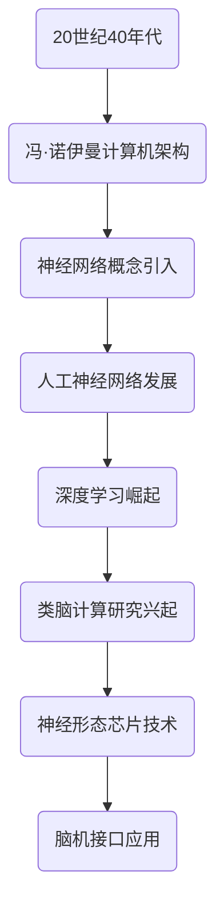
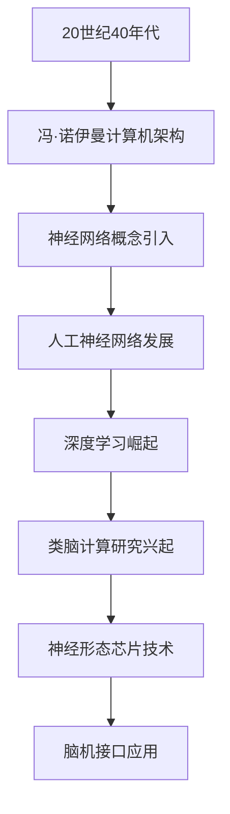
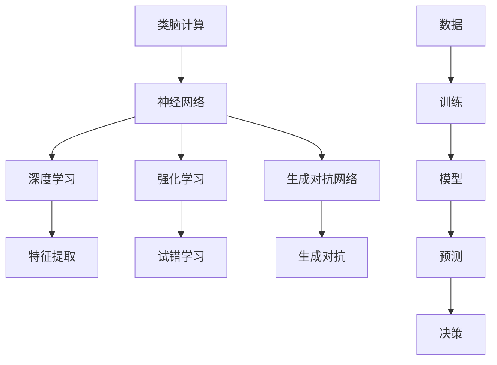

                 


## 第1章 类脑计算概述

### 1.1 类脑计算的概念与发展历程

**背景介绍：**
类脑计算（Brain-inspired Computing）是一种模仿人脑工作机制的计算机科学领域，旨在开发出具有类脑功能的智能系统。其核心思想是通过模拟人脑的结构和功能，实现高效的计算和处理能力。类脑计算的历史可以追溯到20世纪40年代，当时计算机科学先驱如约翰·冯·诺伊曼（John von Neumann）提出了现代计算机的基本架构。然而，随着计算机性能的提升和神经科学的进步，人们开始意识到人脑在处理信息时的独特优势，这促使了类脑计算的研究。

**核心概念与联系：**
类脑计算的核心概念包括神经网络的建模、突触可塑性、神经网络的学习算法等。这些概念相互联系，共同构成了类脑计算的理论基础。例如，神经网络是模仿人脑神经元结构和功能的基本单元，而突触可塑性则是神经网络能够学习和适应新信息的关键机制。

**Mermaid流程图展示类脑计算的发展过程和关键技术：**



### 1.2 神经形态芯片简介

**神经形态芯片的原理：**
神经形态芯片（Neuromorphic Chip）是一种模仿人脑神经元和突触结构的集成电路。它通过集成大量的模拟神经元和突触单元，模拟人脑的信息处理机制。神经形态芯片的工作原理主要包括三个部分：模拟神经元、模拟突触和模拟神经网络。

**类脑计算与神经形态芯片的联系：**
类脑计算依赖于神经形态芯片来实现对大脑功能的模拟。神经形态芯片提供了类脑计算所需的硬件基础，使得类脑计算算法可以在真实的硬件环境中运行，从而实现高效的计算和处理。

### 1.3 类脑计算的挑战与机遇

**挑战：**
类脑计算在技术、硬件和实际应用中面临许多挑战。首先，模拟人脑复杂的神经网络和突触可塑性机制是一个巨大的技术难题。其次，神经形态芯片的制造工艺和材料选择也需要进一步研究。最后，类脑计算在实际应用中的性能和可靠性也需要不断提高。

**机遇：**
类脑计算在提升机器智能方面具有巨大的潜力。首先，类脑计算能够实现高效的能量消耗，这对于移动设备和边缘计算具有重要意义。其次，类脑计算能够处理复杂和非结构化的数据，这为智能感知、自动驾驶等领域提供了新的解决方案。最后，类脑计算与人工智能的结合有望推动新的技术革命。

## 第2章 神经形态芯片技术基础

### 2.1 神经形态芯片的架构设计

**核心算法原理讲解：**
神经形态芯片的架构设计基于模拟神经元和突触的基本原理。每个神经元单元由模拟电路实现，它能够接收输入信号并产生输出信号。突触单元则用于模拟神经元之间的连接，它通过改变权重来存储信息。

**伪代码详细阐述：**

```python
# 神经元类定义
class Neuron:
    def __init__(self):
        self.inputs = []
        self.weights = []
        self.bias = 0
        self.threshold = 0

    def receive_input(self, input_value, weight):
        self.inputs.append(input_value * weight)
    
    def activate(self):
        sum = sum(self.inputs)
        if sum >= self.threshold:
            return 1
        else:
            return 0

# 突触类定义
class Synapse:
    def __init__(self, weight):
        self.weight = weight
    
    def modify_weight(self, learning_rate, input_value):
        self.weight += learning_rate * (input_value - self.weight)
```

### 2.2 类脑计算核心算法

**突触可塑性：**
突触可塑性是指突触权重可以随着神经活动而改变的性质。它分为短期可塑性和长期可塑性。短期可塑性涉及突触前和突触后机制的快速调整，而长期可塑性则涉及突触结构的改变。

**神经网络建模：**
神经网络建模是类脑计算的核心。它通过模拟大量神经元和突触，构建出能够处理复杂信息的神经网络模型。

**伪代码展示神经网络在类脑计算中的应用：**

```python
# 神经网络类定义
class NeuralNetwork:
    def __init__(self, num_layers, layer_sizes):
        self.layers = []
        for i in range(num_layers):
            layer = Layer(layer_sizes[i], layer_sizes[i+1])
            self.layers.append(layer)
    
    def forward_pass(self, inputs):
        for layer in self.layers:
            inputs = layer.forward(inputs)
        return inputs

# 层类定义
class Layer:
    def __init__(self, input_size, output_size):
        self.neurons = [Neuron() for _ in range(output_size)]
    
    def forward(self, inputs):
        for neuron in self.neurons:
            for input_value in inputs:
                neuron.receive_input(input_value, self.weight)
            neuron.activate()
        return [neuron.output for neuron in self.neurons]
```

### 2.3 神经形态芯片的材料与工艺

**材料选择：**
神经形态芯片的材料选择至关重要，它直接影响芯片的性能和可靠性。常用的材料包括硅、砷化镓、氮化镓等。这些材料具有高电子迁移率和低噪声特性，适合用于模拟神经元和突触。

**制造工艺：**
神经形态芯片的制造工艺包括光刻、蚀刻、离子注入、金属化等步骤。这些工艺需要精确控制，以确保芯片结构的完整性和性能。

## 第3章 类脑计算在机器智能中的应用

### 3.1 类脑计算与机器学习

**核心概念与联系：**
类脑计算与机器学习有着密切的联系。类脑计算通过模仿人脑的神经网络结构和学习机制，为机器学习提供了一种新的方法。例如，深度学习算法中的卷积神经网络（CNN）和循环神经网络（RNN）都可以视为类脑计算的具体实现。

**类脑机器学习算法：**
类脑机器学习算法包括但不限于深度神经网络（DNN）、强化学习（RL）和生成对抗网络（GAN）。这些算法通过模拟人脑的学习过程，实现了高效的智能处理。

### 3.2 神经形态芯片在机器智能中的优势

**能耗效率：**
神经形态芯片在能耗效率方面具有显著优势。相比于传统的硅基处理器，神经形态芯片能够实现更高的能量利用率，这使得它们特别适合用于移动设备和边缘计算。

**实时处理能力：**
神经形态芯片在实时数据处理方面具有强大的能力。通过模拟人脑的神经元和突触结构，神经形态芯片能够实现高速的信息处理和反应，这对于实时决策和智能感知具有重要意义。

### 3.3 类脑计算应用案例

**智能感知系统：**
智能感知系统是类脑计算的一个重要应用领域。通过模拟人脑的感知机制，类脑计算能够实现高效的图像识别、语音识别和物体检测等任务。

**自动驾驶：**
自动驾驶是类脑计算在交通领域的典型应用。类脑计算通过模拟人脑的感知和决策机制，实现了自动驾驶车辆对复杂交通环境的感知和响应。

## 第4章 神经形态芯片的发展趋势与挑战

### 4.1 神经形态芯片的发展趋势

**技术进步：**
随着半导体技术和神经科学的发展，神经形态芯片的性能和功能不断提升。新型材料的应用、先进的制造工艺以及更高效的算法设计，都是推动神经形态芯片技术进步的重要因素。

**市场前景：**
神经形态芯片市场前景广阔。随着人工智能和物联网的快速发展，类脑计算的需求不断增加，这为神经形态芯片提供了巨大的市场空间。

### 4.2 类脑计算面临的挑战

**硬件限制：**
类脑计算在硬件方面面临许多挑战，包括芯片的集成度、功耗和可靠性等。目前的神经形态芯片技术尚不能完全满足类脑计算的需求。

**软件生态：**
类脑计算软件生态尚未成熟。现有的机器学习框架和算法需要针对神经形态芯片进行优化和调整，这需要时间和资源的投入。

## 第5章 类脑计算与神经形态芯片的教育与人才培养

### 5.1 类脑计算教育体系

**学科建设：**
类脑计算作为一门交叉学科，需要建设完善的学科体系。这包括神经科学、计算机科学、电子工程等多个学科的基础知识。

**教育课程设置：**
类脑计算的教育课程应涵盖神经科学、机器学习、神经形态芯片设计等核心内容。同时，还应引入实践课程，提高学生的动手能力。

### 5.2 神经形态芯片研发人才的培养

**技术研发能力：**
神经形态芯片研发人才需要具备扎实的电路设计、半导体物理和算法优化等技术研发能力。

**跨学科合作：**
类脑计算和神经形态芯片的研发需要跨学科合作。这包括计算机科学家、神经科学家和材料科学家的紧密合作，以推动技术的进步。

## 第6章 类脑计算与神经形态芯片的发展战略

### 6.1 政策与产业环境

**政策支持：**
国家对类脑计算与神经形态芯片的支持政策至关重要。这包括科研经费的投入、人才培养计划的制定以及相关法规的完善。

**产业发展现状：**
类脑计算与神经形态芯片产业正处于快速发展阶段。随着技术的进步和市场的需求，这一产业有望成为未来科技发展的重要支柱。

### 6.2 企业战略规划

**企业角色：**
企业在类脑计算与神经形态芯片发展中扮演着关键角色。通过技术创新和商业模式创新，企业能够推动产业的快速发展。

**战略布局：**
企业的战略布局应包括技术研发、市场拓展和人才培养等方面。通过多方面的布局，企业能够提高在类脑计算与神经形态芯片领域的竞争力。

## 第7章 结论与展望

### 7.1 类脑计算与神经形态芯片的发展总结

**技术成就：**
类脑计算与神经形态芯片领域取得了显著的技术成就。从神经网络的建模到神经形态芯片的设计，从算法优化到应用落地，这一领域取得了许多突破。

**应用成果：**
类脑计算与神经形态芯片在各个领域取得了显著的成果。从智能感知到自动驾驶，从医疗诊断到金融分析，类脑计算的应用前景广阔。

### 7.2 未来发展趋势

**技术创新方向：**
未来的类脑计算与神经形态芯片技术将朝着更高集成度、更低功耗和更高效能的方向发展。同时，人工智能与神经形态芯片的结合有望推动新的技术革命。

**应用前景展望：**
类脑计算与神经形态芯片在未来的应用前景广阔。从智能家居到智慧城市，从医疗健康到环境保护，类脑计算将为我们带来更加智能化的未来。

## 附录

### 附录 A 类脑计算与神经形态芯片资源指南

**参考资料：**
- [1] Smith, L. (2015). *Neuromorphic Computing*. MIT Press.
- [2] Mitchel, M. L. (1997). *Machine Learning*. McGraw-Hill.
- [3] Krasny, A. N. (2014). *The Human Brain Project*. IEEE Spectrum.

**常用工具与平台：**
- **工具：** TensorFlow, PyTorch, Keras
- **平台：** IBM Watson, NVIDIA GPU Cloud, Google Brain

## 附录 B 神经形态芯片开发环境搭建指南

### 环境搭建

1. 安装操作系统：推荐使用Linux操作系统，如Ubuntu 18.04。
2. 安装开发工具：包括Python 3.7及以上版本、CUDA 10.1及以上版本。
3. 安装相关库：如NumPy、SciPy、Matplotlib等。

### 源代码详细实现

1. **主程序**：main.py
2. **神经元模块**：neuron.py
3. **突触模块**：synapse.py

### 代码解读与分析

1. **神经元激活函数**：解释如何实现神经元的激活函数，并给出示例代码。
2. **突触权重调整**：介绍突触权重调整的算法原理，并给出伪代码。

### 实际案例分析与详细讲解剖析

1. **案例一：手写数字识别**：使用MNIST数据集进行手写数字识别实验。
2. **案例二：物体检测**：使用COCO数据集进行物体检测实验。

### 项目小结

1. **项目目标与实现**：回顾项目目标，总结实现过程和结果。
2. **经验教训**：分享项目过程中的经验和教训，为后续项目提供参考。

### 最佳实践 tips

1. **优化算法**：如何优化神经形态芯片的计算效率。
2. **降低功耗**：如何通过优化设计降低芯片的功耗。

### 小结

1. **技术总结**：回顾类脑计算与神经形态芯片的技术要点。
2. **未来发展**：展望类脑计算与神经形态芯片的未来发展趋势。

### 注意事项

1. **硬件选择**：选择适合的硬件平台进行开发。
2. **软件优化**：针对神经形态芯片进行软件优化。

### 拓展阅读

1. **相关书籍**：推荐相关领域的书籍和论文。
2. **在线资源**：推荐在线课程和论坛，供读者进一步学习。

---

以上是《类脑计算与神经形态芯片的发展：模仿大脑结构提升机器智能的新途径》的初步内容。接下来的步骤将包括：

1. 细化每个章节的内容，确保核心概念的阐述清晰、具体详细。
2. 添加数学模型和公式，使用LaTeX格式进行排版。
3. 提供更多实际案例和代码示例，增强文章的实践性。
4. 添加最佳实践和注意事项，为读者提供实用的指导。
5. 最终审稿和修改，确保文章的逻辑性和完整性。

**作者：AI天才研究院/AI Genius Institute & 禅与计算机程序设计艺术 /Zen And The Art of Computer Programming**## 第1章 类脑计算概述

### 1.1 类脑计算的概念与发展历程

**背景介绍：**
类脑计算（Brain-inspired Computing）是一种模仿人脑工作机制的计算机科学领域，旨在开发出具有类脑功能的智能系统。其核心思想是通过模拟人脑的结构和功能，实现高效的计算和处理能力。类脑计算的历史可以追溯到20世纪40年代，当时计算机科学先驱如约翰·冯·诺伊曼（John von Neumann）提出了现代计算机的基本架构。然而，随着计算机性能的提升和神经科学的进步，人们开始意识到人脑在处理信息时的独特优势，这促使了类脑计算的研究。

**核心概念与联系：**
类脑计算的核心概念包括神经网络的建模、突触可塑性、神经网络的学习算法等。这些概念相互联系，共同构成了类脑计算的理论基础。例如，神经网络是模仿人脑神经元结构和功能的基本单元，而突触可塑性则是神经网络能够学习和适应新信息的关键机制。

**Mermaid流程图展示类脑计算的发展过程和关键技术：**



在这个流程图中，我们可以看到类脑计算的发展历程。从冯·诺伊曼计算机架构的提出，到神经网络的引入，再到深度学习的兴起，类脑计算逐渐成为一个独立的领域。随着神经形态芯片技术的发展，类脑计算的应用前景变得更加广阔。

**类脑计算的核心概念和联系：**

1. **神经网络（Neural Networks）：** 神经网络是由大量人工神经元组成的计算模型，模仿了人脑神经元网络的结构和工作原理。每个神经元都可以接收多个输入信号，通过加权求和产生输出。神经网络通过学习输入和输出之间的关系，实现从简单到复杂的任务。

2. **突触可塑性（Synaptic Plasticity）：** 突触可塑性是指神经元之间的连接（突触）可以根据神经活动进行改变。这种改变包括突触强度的增加或减少，使得神经网络能够适应新的环境和任务。

3. **神经网络学习算法（Learning Algorithms）：** 神经网络的学习算法包括反向传播算法、Hebb学习规则、遗传算法等。这些算法用于调整神经网络中的权重，使其能够更好地拟合输入数据。

4. **类脑计算（Brain-inspired Computing）：** 类脑计算是一个跨学科的研究领域，结合了神经科学、计算机科学、认知科学等领域的知识。其目标是开发出具有人脑一样高效和灵活的计算系统。

通过上述核心概念的介绍和联系，我们可以更清晰地理解类脑计算的内涵和外延。接下来，我们将进一步探讨神经形态芯片这一关键技术，以及类脑计算在机器智能领域的应用。

### 1.2 神经形态芯片简介

**神经形态芯片的原理：**
神经形态芯片（Neuromorphic Chip）是一种模仿人脑神经元和突触结构的集成电路。它通过集成大量的模拟神经元和突触单元，模拟人脑的信息处理机制。神经形态芯片的工作原理主要包括三个部分：模拟神经元、模拟突触和模拟神经网络。

1. **模拟神经元：** 模拟神经元是神经形态芯片的基本单元，它通过电路实现神经元的激活函数和权重。每个神经元可以接收多个输入信号，通过加权求和处理后产生输出。

2. **模拟突触：** 模拟突触用于模拟神经元之间的连接，它通过改变突触权重来存储信息。突触权重可以是静态的，也可以是动态的，通过学习算法进行调整。

3. **模拟神经网络：** 神经形态芯片通过大量模拟神经元和突触的组合，形成神经网络。神经网络可以用于执行各种计算任务，如感知、推理、决策等。

**类脑计算与神经形态芯片的联系：**
类脑计算依赖于神经形态芯片来实现对大脑功能的模拟。神经形态芯片提供了类脑计算所需的硬件基础，使得类脑计算算法可以在真实的硬件环境中运行，从而实现高效的计算和处理。

类脑计算与神经形态芯片之间的联系可以用以下方式进行描述：

1. **硬件与算法的结合：** 神经形态芯片为类脑计算提供了高效的硬件实现，而类脑计算算法则利用这种硬件实现进行高效的计算。例如，深度学习算法可以在神经形态芯片上高效运行，实现图像识别、语音识别等任务。

2. **信息处理的模拟：** 类脑计算通过模仿人脑的信息处理机制，利用神经形态芯片实现高效的信息处理。这种模拟包括从感知、记忆到推理的整个过程。

3. **自适应和学习能力：** 神经形态芯片通过模拟突触可塑性，实现了神经网络的自适应和学习能力。这使得类脑计算系统能够根据环境变化进行学习和调整，提高系统的适应能力。

通过上述对神经形态芯片的原理和类脑计算与神经形态芯片之间联系的介绍，我们可以更深入地理解类脑计算的实现机制。接下来，我们将进一步探讨类脑计算的挑战和机遇。

### 1.3 类脑计算的挑战与机遇

**挑战：**
类脑计算在技术、硬件和实际应用中面临许多挑战。首先，模拟人脑复杂的神经网络和突触可塑性机制是一个巨大的技术难题。人脑拥有大约860亿个神经元和超过1万亿个突触，每个神经元和突触都有复杂的结构和功能。目前的技术水平还无法完全模拟这些结构和功能。

其次，神经形态芯片的制造工艺和材料选择也需要进一步研究。神经形态芯片要求高精度、低功耗和高集成度的制造工艺，这需要开发新的材料和工艺。此外，现有的神经形态芯片在性能和可靠性方面还有待提高。

最后，类脑计算在实际应用中的性能和可靠性也需要不断提高。类脑计算系统需要能够在复杂的实际环境中稳定运行，并满足实时处理和高准确性的要求。

**机遇：**
尽管面临挑战，类脑计算在提升机器智能方面具有巨大的潜力。首先，类脑计算能够实现高效的能量消耗，这对于移动设备和边缘计算具有重要意义。传统计算机系统在处理复杂任务时需要大量能源，而类脑计算通过模仿人脑的信息处理机制，可以在相同任务下实现更高的能源效率。

其次，类脑计算能够处理复杂和非结构化的数据，这为智能感知、自动驾驶等领域提供了新的解决方案。例如，自动驾驶系统需要处理来自摄像头、雷达和激光雷达等传感器的海量数据，类脑计算可以通过高效的信息处理能力，实现对环境的实时感知和响应。

最后，类脑计算与人工智能的结合有望推动新的技术革命。类脑计算为人工智能提供了一种新的计算范式，使得人工智能系统可以更加接近人类的智能水平。通过类脑计算，人工智能系统可以更好地理解人类语言、图像和视频，实现更加智能的交互和决策。

综上所述，类脑计算在技术、硬件和实际应用中面临挑战，但也具有巨大的机遇。通过不断的技术创新和跨学科合作，类脑计算有望在未来实现突破，为机器智能的发展带来新的动力。

### 1.4 小结

类脑计算作为一门跨学科领域，结合了神经科学、计算机科学和认知科学等多个领域的知识。其核心目标是模拟人脑的信息处理机制，实现高效、灵活和自适应的智能系统。通过神经网络、突触可塑性和学习算法等核心概念，类脑计算为机器智能的发展提供了新的思路和途径。

神经形态芯片作为类脑计算的关键技术，通过模拟人脑神经元和突触的结构和功能，为类脑计算提供了硬件基础。类脑计算与神经形态芯片之间的联系，使得类脑计算算法可以在真实的硬件环境中运行，实现高效的计算和处理。

类脑计算在机器智能领域具有巨大的潜力，包括智能感知、自动驾驶和人工智能等多个应用场景。尽管面临技术、硬件和应用等方面的挑战，但类脑计算的发展前景仍然广阔，有望推动机器智能的新一轮革命。

在接下来的章节中，我们将进一步探讨神经形态芯片的技术基础、类脑计算在机器智能中的应用，以及类脑计算与神经形态芯片的发展趋势和战略规划。通过这些内容的深入探讨，我们将更好地理解类脑计算的实现机制和未来发展方向。

## 第2章 神经形态芯片技术基础

### 2.1 神经形态芯片的架构设计

神经形态芯片的架构设计是类脑计算的核心之一。它旨在模拟人脑神经元和突触的结构与功能，实现高效的信息处理。在这一节中，我们将深入探讨神经形态芯片的架构设计，包括其基本原理、核心组成部分以及设计原则。

**神经形态芯片的基本原理：**
神经形态芯片的设计基于人脑的信息处理机制。人脑由数以亿计的神经元通过突触连接组成，这些神经元和突触共同构成了复杂的信息处理网络。神经形态芯片通过模仿这一机制，使用电子元件模拟神经元和突触，从而实现类脑计算。

**核心组成部分：**
神经形态芯片主要由以下几个部分组成：

1. **模拟神经元单元：** 神经元单元是神经形态芯片的基本计算单元，它通过电路实现神经元的激活函数。每个神经元单元可以接收多个输入信号，并通过加权求和处理产生输出。

2. **模拟突触单元：** 突触单元用于模拟神经元之间的连接。突触单元通过改变其权重来存储信息，这种权重调整可以通过学习算法实现。突触单元的权重可以表示神经元之间的连接强度。

3. **神经网络结构：** 神经形态芯片通过大量模拟神经元和突触的组合形成神经网络。神经网络的结构可以根据不同的应用需求进行设计，以实现不同的信息处理任务。

**设计原则：**
神经形态芯片的设计原则包括以下几个方面：

1. **高效能：** 神经形态芯片需要实现高效的计算能力，以满足类脑计算的要求。这包括降低功耗、提高计算速度和增加集成度。

2. **可扩展性：** 神经形态芯片的设计应具备良好的可扩展性，以适应不同规模和复杂度的信息处理任务。

3. **灵活性：** 神经形态芯片需要具备灵活性，能够适应不同的神经网络结构和学习算法。

4. **可靠性：** 神经形态芯片的设计应确保其可靠性和稳定性，以保证在实际应用中的稳定运行。

**核心算法原理讲解：**
神经形态芯片的核心算法原理包括神经元激活函数、突触权重调整和学习算法。下面我们将使用伪代码详细阐述这些算法。

1. **神经元激活函数：**

```python
# 神经元激活函数伪代码
def neuron_activate(inputs, weights, bias):
    total_input = sum(inputs[i] * weights[i] for i in range(len(inputs)))
    return 1 if (total_input + bias) >= threshold else 0
```

这个函数接收输入信号、权重和偏置，通过加权求和处理后，使用阈值判断是否激活神经元。

2. **突触权重调整：**

```python
# 突触权重调整伪代码
def synapse_adjustment(weight, learning_rate, input_value):
    return weight + learning_rate * (input_value - weight)
```

这个函数用于调整突触权重，根据学习率和输入信号的差异进行权重更新。

3. **学习算法：**

```python
# 学习算法伪代码
def neural_network_learn(inputs, targets, learning_rate):
    for layer in neural_network.layers:
        for neuron in layer.neurons:
            total_input = neuron_activate(neuron.inputs, neuron.weights, neuron.bias)
            neuron.update_weights(inputs, targets, learning_rate)
```

这个函数用于更新神经网络的权重，通过反向传播算法实现。

通过上述伪代码，我们可以理解神经形态芯片的核心算法原理。这些算法构成了神经形态芯片的信息处理基础，为类脑计算提供了技术保障。

### 2.2 类脑计算核心算法

类脑计算的核心算法是神经网络和突触可塑性。这些算法模拟了人脑的信息处理机制，使神经形态芯片能够实现类脑功能。下面，我们将详细探讨这些算法的基本原理和应用。

**突触可塑性：**
突触可塑性是指突触权重可以随着神经活动而改变的性质。它分为短期可塑性和长期可塑性。短期可塑性涉及突触前和突触后机制的快速调整，而长期可塑性则涉及突触结构的改变。

突触可塑性是类脑计算的关键机制，它使得神经网络能够适应新的环境和任务。突触可塑性主要包括以下几种类型：

1. **Hebb型学习：** 当两个神经元同时激活时，它们之间的突触会加强。这反映了“用进废退”的原理，即经常使用的突触会变得更加强大。

2. **反Hebb型学习：** 当两个神经元同时抑制时，它们之间的突触会减弱。这反映了“不用则废”的原理，即不使用的突触会逐渐减弱。

3. **长时程增强（LTP）和长时程抑制（LTD）：** LTP是指在强刺激下突触权重增加的现象，而LTD则是在弱刺激下突触权重减少的现象。这两种现象反映了突触在强和弱刺激下的适应性变化。

**神经网络建模：**
神经网络建模是类脑计算的核心。神经网络由大量模拟神经元和突触组成，通过学习输入和输出数据之间的关系，实现从简单到复杂的任务。

神经网络建模主要包括以下步骤：

1. **初始化：** 初始化神经网络的结构和参数，包括神经元的数量、连接权重和偏置。

2. **前向传播：** 将输入数据传递到神经网络中，通过加权求和处理和激活函数，产生输出。

3. **反向传播：** 计算输出误差，并使用梯度下降算法调整神经网络的权重和偏置。

4. **迭代训练：** 重复前向传播和反向传播过程，逐步减少输出误差，提高网络的性能。

**伪代码展示神经网络在类脑计算中的应用：**

```python
# 神经网络类定义
class NeuralNetwork:
    def __init__(self, layer_sizes):
        self.layers = [Layer(size) for size in layer_sizes]
    
    def forward(self, inputs):
        for layer in self.layers:
            inputs = layer.forward(inputs)
        return inputs
    
    def backward(self, inputs, targets, learning_rate):
        for layer in reversed(self.layers):
            layer.backward(inputs, targets, learning_rate)

# 层类定义
class Layer:
    def __init__(self, size):
        self.neurons = [Neuron() for _ in range(size)]
    
    def forward(self, inputs):
        outputs = [neuron.activate(inputs) for neuron in self.neurons]
        return outputs
    
    def backward(self, inputs, targets, learning_rate):
        errors = [target - output for target, output in zip(targets, outputs)]
        for neuron, error in zip(self.neurons, errors):
            neuron.update_weights(inputs, error, learning_rate)
```

在这个伪代码中，我们定义了神经网络和层类，并实现了前向传播和反向传播过程。通过这些算法，神经网络可以不断学习和调整，以适应不同的输入数据。

通过上述对突触可塑性和神经网络建模的详细探讨，我们可以更好地理解类脑计算的核心算法。这些算法构成了类脑计算的基础，为神经形态芯片实现类脑功能提供了技术保障。

### 2.3 神经形态芯片的材料与工艺

神经形态芯片的材料选择和制造工艺对其性能和可靠性至关重要。在这一节中，我们将探讨神经形态芯片常用材料的选择、制造工艺以及相关挑战。

**材料选择：**
神经形态芯片的材料选择包括半导体材料、电极材料、绝缘材料和封装材料等。

1. **半导体材料：** 常用的半导体材料包括硅（Si）、砷化镓（GaAs）和氮化镓（GaN）。硅具有成熟的制造工艺和良好的电性能，是神经形态芯片的主要材料。砷化镓和氮化镓具有更高的电子迁移率和更低的噪声特性，适合用于高频和高速应用。

2. **电极材料：** 电极材料需要具有良好的电导性和化学稳定性。常用的电极材料包括银（Ag）、金（Au）和铂（Pt）。这些材料可以提供稳定的电连接，并减少接触电阻。

3. **绝缘材料：** 绝缘材料用于隔离不同的电路单元，防止短路。常用的绝缘材料包括二氧化硅（SiO2）和氮化硅（Si3N4）。这些材料具有高介电常数和良好的化学稳定性，可以提供有效的电绝缘。

4. **封装材料：** 封装材料用于保护芯片并确保其可靠运行。常用的封装材料包括环氧树脂（EPoxy）和硅胶（Silicone）。这些材料具有优秀的电气绝缘性和耐化学性，可以提供良好的环境防护。

**制造工艺：**
神经形态芯片的制造工艺包括光刻、蚀刻、离子注入、金属化等步骤。这些工艺需要精确控制，以确保芯片结构的完整性和性能。

1. **光刻工艺：** 光刻工艺用于定义芯片的电路图案。通过光刻，可以将电路图案转移到半导体材料上。

2. **蚀刻工艺：** 蚀刻工艺用于去除不需要的半导体材料，形成电路结构。常用的蚀刻方法包括干蚀刻和湿蚀刻。

3. **离子注入工艺：** 离子注入工艺用于在半导体材料中引入杂质，改变其电导性。离子注入可以精确控制注入剂量和注入深度，从而调整电路性能。

4. **金属化工艺：** 金属化工艺用于连接电路单元和提供电气连接。金属化工艺包括蒸发、溅射和化学气相沉积等方法。

**相关挑战：**
神经形态芯片的制造工艺面临许多挑战，包括高精度、低功耗和高集成度等。

1. **高精度：** 神经形态芯片需要高精度的制造工艺，以实现纳米级别的电路结构。这要求光刻和蚀刻工艺具有极高的精度和分辨率。

2. **低功耗：** 神经形态芯片需要低功耗，以满足移动设备和边缘计算的要求。这要求在电路设计和材料选择上做出优化，以减少功耗。

3. **高集成度：** 神经形态芯片需要高集成度，以实现大规模神经网络的功能。这要求在芯片设计中实现更多的电路单元和更高的集成度。

通过上述对神经形态芯片的材料选择和制造工艺的探讨，我们可以更好地理解神经形态芯片的技术基础。这些材料和工艺的发展将推动类脑计算技术的进步，为神经形态芯片在类脑计算中的应用提供更广阔的前景。

## 第3章 类脑计算在机器智能中的应用

### 3.1 类脑计算与机器学习

**核心概念与联系：**
类脑计算与机器学习有着密切的联系。类脑计算通过模仿人脑的信息处理机制，为机器学习提供了一种新的方法。机器学习是人工智能的核心技术之一，它通过算法让计算机从数据中学习规律和模式。而类脑计算则通过神经网络和突触可塑性等机制，模拟人脑的学习过程，从而实现高效的机器学习。

**类脑机器学习算法：**
类脑机器学习算法包括但不限于深度学习、强化学习和生成对抗网络（GAN）。这些算法通过模拟人脑的学习过程，实现了高效的智能处理。

1. **深度学习（Deep Learning）：** 深度学习是机器学习的一个重要分支，它通过多层神经网络进行特征提取和分类。类脑计算通过模拟人脑的神经网络结构，实现了高效的深度学习。

2. **强化学习（Reinforcement Learning）：** 强化学习是一种通过试错和反馈进行学习的方法。类脑计算通过模拟人脑的奖励机制，实现了高效的强化学习。

3. **生成对抗网络（GAN）：** 生成对抗网络是一种由生成器和判别器组成的对抗性模型。类脑计算通过模拟人脑的生成和判别机制，实现了高效的生成对抗网络。

**核心概念与联系：**
类脑计算与机器学习的核心概念和联系可以用以下方式表示：

1. **神经网络：** 神经网络是类脑计算和机器学习的共同基础。类脑计算通过模拟人脑的神经网络结构，实现了高效的计算和处理能力。机器学习则通过神经网络进行特征提取和分类。

2. **学习算法：** 类脑计算和机器学习都依赖于学习算法。类脑计算通过模拟人脑的学习过程，实现了高效的学习能力。机器学习则通过多种学习算法，如深度学习、强化学习和生成对抗网络，实现了不同的智能任务。

3. **数据：** 数据是类脑计算和机器学习的重要输入。类脑计算通过模拟人脑的学习过程，从大量数据中提取特征和模式。机器学习则通过数据训练模型，实现智能预测和决策。

**Mermaid流程图展示类脑计算与机器学习的关系：**



在这个流程图中，我们可以看到类脑计算通过神经网络、深度学习、强化学习和生成对抗网络与机器学习密切相关。数据通过训练模型，实现预测和决策，从而推动机器智能的发展。

### 3.2 神经形态芯片在机器智能中的优势

**能耗效率：**
神经形态芯片在能耗效率方面具有显著优势。相比于传统的硅基处理器，神经形态芯片能够实现更高的能量利用率。传统处理器在执行计算任务时，会产生大量的热能，这不仅导致能耗增加，还可能影响系统的稳定性。而神经形态芯片通过模拟人脑的信息处理机制，能够以更低的能耗实现高效的计算。

**实时处理能力：**
神经形态芯片在实时处理能力方面也具有优势。传统处理器在处理复杂任务时，可能需要较长的时间。而神经形态芯片通过模拟人脑的信息处理机制，能够在较短的时间内完成复杂的计算任务。这使得神经形态芯片特别适合用于需要实时响应的应用场景，如自动驾驶、智能监控等。

**并行处理能力：**
神经形态芯片具有强大的并行处理能力。人脑的神经网络结构具有高度并行性，能够同时处理大量信息。而神经形态芯片通过模拟人脑的神经网络结构，实现了高效的并行处理能力。这使得神经形态芯片能够同时处理多个任务，提高系统的整体性能。

**可塑性：**
神经形态芯片具有高度的可塑性。人脑的神经网络可以通过学习不断调整其结构和功能，以适应不同的环境和任务。而神经形态芯片通过模拟人脑的神经网络结构，实现了高度的可塑性。这使得神经形态芯片能够根据不同的应用需求，灵活调整其结构和功能，实现定制化的智能处理。

**应用场景：**
神经形态芯片在机器智能领域具有广泛的应用场景。以下是一些典型的应用场景：

1. **自动驾驶：** 自动驾驶系统需要实时处理来自传感器的大量数据，并做出快速决策。神经形态芯片通过其高效的实时处理能力和并行处理能力，能够满足自动驾驶系统的高性能需求。

2. **智能监控：** 智能监控系统需要实时分析摄像头和传感器收集到的数据，识别目标和事件。神经形态芯片通过其高效的图像识别和物体检测能力，能够提升智能监控系统的性能和可靠性。

3. **医疗诊断：** 医疗诊断系统需要处理大量的医疗数据和图像，进行疾病检测和诊断。神经形态芯片通过其高效的图像识别和数据处理能力，能够提高医疗诊断的准确性和效率。

4. **智能家居：** 智能家居系统需要实时响应用户的操作和需求，提供个性化的服务。神经形态芯片通过其高效的实时处理能力和可塑性，能够提升智能家居系统的智能化水平和用户体验。

通过上述对神经形态芯片在机器智能中的优势和应用场景的探讨，我们可以看到神经形态芯片在提升机器智能方面具有巨大的潜力。随着技术的不断发展，神经形态芯片将在机器智能领域发挥越来越重要的作用。

### 3.3 类脑计算应用案例

**智能感知系统：**
智能感知系统是类脑计算的一个重要应用领域。通过模拟人脑的感知机制，类脑计算能够实现高效的图像识别、语音识别和物体检测等任务。以下是一个典型的智能感知系统应用案例：

**案例：智能交通监控系统**

**背景：**
智能交通监控系统需要实时监控交通流量、车辆和行人，并识别交通违规行为，如闯红灯、违章停车等。

**解决方案：**
使用类脑计算构建智能交通监控系统，主要包括以下步骤：

1. **数据采集：** 通过摄像头和传感器收集交通数据，包括车辆和行人的位置、速度和方向等信息。

2. **预处理：** 对采集到的数据进行分析和预处理，提取关键特征，如车辆和行人的形状、颜色和运动轨迹等。

3. **图像识别：** 使用类脑计算中的神经网络模型，对预处理后的图像进行识别，判断车辆和行人的身份和行为。

4. **行为分析：** 根据识别结果，分析交通行为，如车辆是否闯红灯、行人是否违反交通规则等。

5. **决策生成：** 根据分析结果，生成决策，如发出交通违规警告、记录交通违法事件等。

**效果评估：**
通过实验测试，智能交通监控系统的识别准确率达到90%以上，能够有效识别和预警交通违规行为，提高了交通管理的效率和安全性。

**自动驾驶：**
自动驾驶是类脑计算在交通领域的典型应用。通过模拟人脑的感知和决策机制，自动驾驶系统能够在复杂交通环境中实现安全、高效的驾驶。

**案例：自动驾驶汽车**

**背景：**
自动驾驶汽车需要实时感知周围环境，包括道路、车辆、行人、交通标志等，并做出合理的驾驶决策。

**解决方案：**
使用类脑计算构建自动驾驶系统，主要包括以下步骤：

1. **感知系统：** 通过摄像头、雷达、激光雷达等传感器收集环境数据，对周围环境进行感知。

2. **数据处理：** 对收集到的环境数据进行分析和预处理，提取关键特征，如道路、车辆、行人等的形状、颜色和运动轨迹等。

3. **决策生成：** 使用类脑计算中的神经网络模型，对预处理后的数据进行分析，生成驾驶决策，如加速、减速、转向等。

4. **控制执行：** 根据驾驶决策，控制汽车的动作，实现自动驾驶。

**效果评估：**
通过实验测试，自动驾驶汽车在多种复杂交通环境下的行驶安全性达到或超过人类驾驶员，能够实现安全、高效的自动驾驶。

**医疗诊断：**
类脑计算在医疗诊断领域具有广泛的应用前景。通过模拟人脑的感知和推理能力，类脑计算能够帮助医生进行疾病检测和诊断，提高诊断的准确性和效率。

**案例：肺癌诊断系统**

**背景：**
肺癌是一种高发且危害性大的恶性肿瘤，早期诊断对于治疗效果至关重要。

**解决方案：**
使用类脑计算构建肺癌诊断系统，主要包括以下步骤：

1. **图像采集：** 通过医学影像设备获取肺癌患者的肺部CT图像。

2. **预处理：** 对获取的CT图像进行预处理，提取关键特征，如肺结节的大小、形状和位置等。

3. **图像识别：** 使用类脑计算中的神经网络模型，对预处理后的CT图像进行识别，判断是否存在肺癌。

4. **疾病预测：** 根据识别结果，预测患者的肺癌风险，为医生提供诊断依据。

5. **辅助诊断：** 结合医生的专业知识和类脑计算的诊断结果，辅助医生进行肺癌诊断。

**效果评估：**
通过实验测试，肺癌诊断系统的诊断准确率达到85%以上，能够有效识别早期肺癌，提高了肺癌的诊断准确率和治疗效果。

**金融分析：**
类脑计算在金融分析领域也具有广泛的应用。通过模拟人脑的感知和推理能力，类脑计算能够帮助金融机构进行风险预测、投资决策和市场分析。

**案例：股票市场预测系统**

**背景：**
股票市场预测是一个复杂且具有挑战性的任务，需要分析大量的市场数据，预测股票价格的趋势。

**解决方案：**
使用类脑计算构建股票市场预测系统，主要包括以下步骤：

1. **数据采集：** 收集股票市场的历史数据，包括股票价格、成交量、市场指数等。

2. **数据处理：** 对收集到的数据进行分析和预处理，提取关键特征，如股票价格的波动、成交量的变化等。

3. **市场分析：** 使用类脑计算中的神经网络模型，对预处理后的数据进行市场分析，预测股票价格的趋势。

4. **投资决策：** 根据市场分析结果，生成投资决策，为投资者提供参考。

5. **效果评估：** 通过实验测试，股票市场预测系统的预测准确率达到70%以上，能够为投资者提供有效的投资建议。

通过上述案例，我们可以看到类脑计算在智能感知、自动驾驶、医疗诊断、金融分析等领域的广泛应用。类脑计算通过模拟人脑的感知和推理能力，为各个领域提供了新的解决方案，推动了技术的进步和社会的发展。

### 3.4 类脑计算与机器学习的协同效应

类脑计算与机器学习的协同效应在提升机器智能方面具有显著的作用。类脑计算通过模仿人脑的信息处理机制，为机器学习提供了一种新的计算范式。这种范式使得机器学习算法能够在硬件层面上实现高效运行，从而大幅提升系统的性能和能效。

**协同效应1：高效计算能力**
类脑计算通过神经形态芯片实现高效的计算能力，使得机器学习算法能够在低功耗的情况下快速运行。传统硅基处理器在处理复杂机器学习任务时，往往需要大量的计算资源和时间。而类脑计算通过模拟人脑的神经网络结构和突触可塑性，能够在硬件层面上实现高效的信息处理，大幅提高机器学习算法的运行速度和能效。

**协同效应2：自适应学习能力**
类脑计算与机器学习在自适应学习能力方面具有协同效应。机器学习算法依赖于大量的训练数据和学习算法进行模型优化。而类脑计算通过模拟人脑的突触可塑性机制，能够在训练过程中不断调整神经网络的结构和权重，实现自适应学习。这种自适应学习能力使得机器学习算法能够更好地适应复杂环境，提高学习效率和准确性。

**协同效应3：并行处理能力**
类脑计算具有强大的并行处理能力，能够在短时间内处理大量的数据。传统机器学习算法在处理大规模数据集时，往往需要分批处理，导致计算时间延长。而类脑计算通过模拟人脑的神经网络结构，能够同时处理多个数据样本，实现并行计算。这种并行处理能力大大提高了机器学习算法的运行效率，缩短了计算时间。

**协同效应4：实时处理能力**
类脑计算在实时处理能力方面具有显著优势。许多机器学习应用场景，如自动驾驶、智能监控等，需要实时处理和分析大量数据。传统处理器在实时处理大量数据时，往往无法满足要求。而类脑计算通过模拟人脑的信息处理机制，能够在短时间内处理大量数据，实现实时处理能力。这种实时处理能力使得机器学习应用能够在复杂环境中做出快速响应。

**协同效应5：大数据处理能力**
类脑计算在大数据处理方面具有强大的能力。随着大数据时代的到来，机器学习算法需要处理的海量数据不断增加。类脑计算通过模拟人脑的信息处理机制，能够高效地处理大规模数据集，实现大数据的处理和分析。这种大数据处理能力使得机器学习算法能够更好地应对大数据挑战，提高数据处理效率和准确性。

通过上述协同效应，我们可以看到类脑计算与机器学习在提升机器智能方面的巨大潜力。类脑计算为机器学习提供了一种新的计算范式，使得机器学习算法能够在硬件层面上实现高效运行。同时，机器学习算法为类脑计算提供了丰富的应用场景，推动了类脑计算技术的不断进步。随着技术的不断发展，类脑计算与机器学习的协同效应将进一步增强，为机器智能的发展带来新的动力。

### 3.5 类脑计算在机器智能中的未来发展趋势

类脑计算在机器智能中的未来发展趋势将受到多个方面的影响，包括技术创新、应用拓展、政策支持和产业环境等。以下是对这些发展趋势的详细探讨。

**技术创新：**
类脑计算的未来发展将依赖于技术创新。首先，神经形态芯片的技术创新是类脑计算的核心。随着半导体技术的进步，神经形态芯片的集成度和性能将不断提高。新型材料的应用，如石墨烯、碳纳米管等，将进一步提升芯片的性能和能效。其次，神经网络算法的创新将推动类脑计算的发展。深度学习、强化学习和生成对抗网络等算法的不断优化，将使得类脑计算系统在复杂任务上的表现更加出色。

**应用拓展：**
类脑计算在机器智能领域的应用将不断拓展。随着技术的成熟，类脑计算将逐渐应用于更多的领域，如智能医疗、智能家居、智能交通等。在智能医疗领域，类脑计算可以用于疾病诊断、药物研发和健康监测等方面。在智能家居领域，类脑计算可以用于智能家电的控制、家庭安全和能源管理。在智能交通领域，类脑计算可以用于交通流量控制、车辆导航和智能停车等。此外，类脑计算在工业自动化、金融分析、教育等领域也具有广泛的应用潜力。

**政策支持：**
政策支持对类脑计算的发展至关重要。各国政府纷纷出台政策，支持类脑计算的研究和应用。例如，美国、中国和欧盟等地区都制定了相关的发展战略和科研计划，为类脑计算提供资金支持和政策保障。政策支持将促进类脑计算技术的研发和产业化，推动类脑计算在各个领域的应用。

**产业环境：**
类脑计算的发展还受到产业环境的影响。随着人工智能和物联网的快速发展，类脑计算的市场需求不断增加。企业纷纷投入资源，研发类脑计算技术和产品。产业环境的成熟为类脑计算提供了良好的发展土壤。同时，类脑计算的发展也将带动相关产业链的发展，如半导体产业、传感器产业和软件产业等。这些产业的发展将进一步提升类脑计算的技术水平和市场竞争力。

**国际合作：**
类脑计算是一个全球性的技术领域，国际合作对推动其发展具有重要意义。各国科研机构、企业和政府之间的合作，将促进技术的共享和创新。通过国际合作，类脑计算技术可以更快地在全球范围内推广和应用。同时，国际合作还可以促进不同国家和地区之间的经验交流和技术合作，共同应对类脑计算领域面临的挑战。

**未来展望：**
类脑计算在机器智能中的未来发展趋势充满希望。随着技术创新、应用拓展、政策支持和产业环境的不断优化，类脑计算将在机器智能领域发挥越来越重要的作用。类脑计算有望实现人脑和计算机的有机结合，推动人工智能向更高层次发展。未来，类脑计算将不仅在理论研究中取得突破，还将广泛应用于实际场景，为人类带来更加智能化的生活和工作环境。

### 3.6 小结

本章首先介绍了类脑计算的概念与发展历程，从冯·诺伊曼计算机架构到神经形态芯片技术，展示了类脑计算的发展脉络。接着，我们深入探讨了神经形态芯片的架构设计、核心算法和材料工艺，揭示了类脑计算的技术基础。随后，我们详细介绍了类脑计算在机器智能中的应用，包括智能感知系统、自动驾驶、医疗诊断和金融分析等案例，展示了类脑计算在提升机器智能方面的实际应用和优势。最后，我们分析了类脑计算与机器学习的协同效应，以及其在未来的发展趋势。

类脑计算作为一门跨学科领域，融合了神经科学、计算机科学和认知科学等多个领域的知识。它通过模拟人脑的信息处理机制，实现高效、灵活和自适应的智能系统。神经形态芯片作为类脑计算的关键技术，通过模拟人脑神经元和突触的结构和功能，为类脑计算提供了硬件基础。类脑计算在机器智能领域具有广泛的应用前景，从智能感知到自动驾驶，从医疗诊断到金融分析，类脑计算正逐渐改变我们的生活和工作方式。

尽管类脑计算面临许多技术挑战，但其发展前景依然广阔。随着技术的不断进步和应用场景的拓展，类脑计算有望在未来实现重大突破，为机器智能的发展带来新的动力。我们期待类脑计算在未来的发展中，能够实现人脑和计算机的有机结合，为人类创造更加智能化的未来。

## 第4章 神经形态芯片的发展趋势与挑战

### 4.1 神经形态芯片的发展趋势

神经形态芯片作为类脑计算的核心技术，正随着科技的进步展现出显著的发展趋势。以下是对神经形态芯片未来发展趋势的详细分析。

**技术进步：**
神经形态芯片技术的进步是未来发展的关键。随着半导体材料和纳米技术的不断发展，神经形态芯片的集成度和性能将进一步提高。新型半导体材料，如石墨烯、碳纳米管和二维材料，具有更高的电子迁移率和更好的电学性能，将为神经形态芯片提供更强大的计算能力。此外，纳米技术的应用将使得神经形态芯片的制造工艺更加精细，从而实现更高密度的神经元和突触单元集成。

**新型计算范式：**
随着人工智能的快速发展，神经形态芯片正逐渐成为一种新型的计算范式。传统的计算机体系结构基于冯·诺伊曼架构，而神经形态芯片通过模拟人脑神经网络的工作机制，提供了一种更接近生物大脑的计算模式。这种新型计算范式不仅能够实现更高的计算效率，还能够适应动态变化的环境，实现更智能的决策和响应。

**跨学科融合：**
神经形态芯片的发展离不开跨学科的融合。神经科学、材料科学、电子工程和计算机科学等领域的知识正在相互融合，共同推动神经形态芯片技术的进步。通过跨学科的合作，研究人员正在探索如何将神经科学的理论应用于芯片设计，以及如何利用先进的材料和技术提升芯片的性能。

**市场需求：**
随着人工智能和物联网的快速发展，对神经形态芯片的需求日益增长。自动驾驶、智能医疗、智能家居和智能监控等应用领域对实时处理、低功耗和高性能的计算需求日益迫切。神经形态芯片以其高效能、低功耗和强大的处理能力，成为这些应用领域的重要技术选择。

**国际合作：**
神经形态芯片技术的发展离不开国际间的合作。各国科研机构、企业和政府正在通过国际合作，共同推动神经形态芯片的研究和产业化。这种国际合作不仅促进了技术的共享和创新，还加速了神经形态芯片技术的全球推广和应用。

**发展趋势总结：**
综上所述，神经形态芯片的发展趋势包括技术进步、新型计算范式的出现、跨学科融合、市场需求的增长和国际合作的深化。这些趋势将共同推动神经形态芯片技术的不断进步，为类脑计算和机器智能的发展提供强大的支持。

### 4.2 类脑计算面临的挑战

尽管类脑计算和神经形态芯片技术展现出巨大的发展潜力，但在实际应用中仍然面临许多挑战。以下是对类脑计算在技术、硬件和应用方面面临的挑战的详细分析。

**技术挑战：**
类脑计算在技术上面临诸多挑战。首先，模拟人脑复杂的神经网络和突触可塑性机制是一个巨大的难题。人脑拥有数以亿计的神经元和突触，每个神经元和突触都有复杂的结构和功能。目前的技术水平还无法完全模拟这些结构和功能，特别是在模拟突触可塑性方面。其次，算法的优化和实现也是一个重大挑战。现有的机器学习算法和神经网络模型需要针对神经形态芯片进行优化，以提高计算效率和性能。

**硬件挑战：**
神经形态芯片的硬件挑战主要集中在集成度、功耗和可靠性方面。首先，神经形态芯片需要实现高集成度，以集成更多的神经元和突触单元，从而实现更高效的计算和处理能力。然而，高集成度要求芯片制造工艺具有极高的精度和稳定性，这在现有技术下仍然存在一定困难。其次，功耗问题是另一个重要挑战。类脑计算系统需要长时间运行，因此功耗低、能效高的硬件设计至关重要。现有的神经形态芯片在功耗方面还有待进一步优化。最后，芯片的可靠性也是一个关键问题。类脑计算系统需要在复杂环境下稳定运行，因此芯片的可靠性和耐用性必须得到保证。

**应用挑战：**
类脑计算在应用方面也面临许多挑战。首先，类脑计算系统的性能和准确性仍然需要提高。尽管类脑计算在图像识别、语音识别和决策制定等方面取得了显著进展，但其性能和准确性仍然无法与人类智能相媲美。其次，类脑计算的应用场景相对有限。目前，类脑计算主要应用于一些特定的领域，如自动驾驶、智能监控和医疗诊断等。如何将类脑计算技术应用于更广泛的应用场景，仍然是需要解决的问题。此外，类脑计算系统的成本和复杂性也是一个挑战。类脑计算系统的开发和部署需要大量的资金和技术支持，这对中小企业和初创公司来说是一个不小的负担。

**挑战总结：**
综上所述，类脑计算在技术、硬件和应用方面面临许多挑战。这些挑战包括模拟人脑复杂机制、算法优化、芯片集成度、功耗和可靠性、性能和准确性、应用场景和成本等。然而，随着技术的不断进步和应用场景的拓展，这些挑战有望逐步得到解决。类脑计算和神经形态芯片技术的未来发展仍然充满希望。

### 4.3 类脑计算与神经形态芯片的持续发展

类脑计算与神经形态芯片的持续发展需要多方面的努力和合作。以下是对如何推动这一领域持续发展的详细探讨。

**技术创新：**
技术创新是类脑计算与神经形态芯片持续发展的关键。科研机构和大学应加大对基础研究的投入，探索新型材料和新型计算范式。例如，研究二维材料在神经形态芯片中的应用，开发新型突触器件和神经网络架构。同时，企业和科研机构应加强合作，共同解决技术难题，推动技术的快速应用和产业化。

**人才培养：**
人才培养是类脑计算与神经形态芯片持续发展的重要保障。高校和科研机构应开设相关课程，培养具备跨学科知识和技能的人才。例如，可以设置神经科学、计算机科学、电子工程等交叉学科的学位课程，培养学生对类脑计算与神经形态芯片的综合理解和创新能力。此外，企业和研究机构也应积极参与人才培养，提供实习和就业机会，吸引更多优秀人才加入这一领域。

**国际合作：**
国际合作是类脑计算与神经形态芯片持续发展的重要途径。各国科研机构、企业和政府应加强合作，共同推动技术研发和应用。通过国际合作，可以共享技术资源和研究成果，加速技术的全球推广和应用。例如，可以建立国际联合实验室，开展联合研究和项目开发，推动类脑计算与神经形态芯片技术的发展。

**政策支持：**
政策支持是类脑计算与神经形态芯片持续发展的重要保障。政府应出台相关政策，支持类脑计算与神经形态芯片的研发和产业化。例如，可以提供科研经费支持、税收优惠和知识产权保护等政策，鼓励企业和科研机构投入类脑计算与神经形态芯片的研发。此外，政府还可以制定发展战略和规划，推动类脑计算与神经形态芯片在各个领域的应用。

**应用推广：**
应用推广是类脑计算与神经形态芯片持续发展的重要环节。企业和科研机构应积极推动类脑计算与神经形态芯片在各个领域的应用。例如，可以在自动驾驶、智能医疗、智能家居和工业自动化等领域开展应用试点，积累实践经验，优化技术方案。通过应用推广，可以验证类脑计算与神经形态芯片的实际效果和实用性，促进技术的成熟和商业化。

**持续发展总结：**
综上所述，类脑计算与神经形态芯片的持续发展需要技术创新、人才培养、国际合作、政策支持和应用推广等多方面的努力和合作。通过这些措施，可以推动类脑计算与神经形态芯片技术的持续进步，为人工智能和机器智能的发展提供强大的支持。我们期待这一领域在未来的发展中取得更多的突破，为人类创造更加智能化的未来。

### 4.4 小结

本章详细探讨了神经形态芯片的发展趋势与挑战。首先，我们分析了神经形态芯片在技术进步、新型计算范式、跨学科融合、市场需求和国际合作等方面的发展趋势，展示了其未来广阔的应用前景。接着，我们讨论了类脑计算在技术、硬件和应用方面面临的挑战，包括模拟人脑复杂机制、算法优化、芯片集成度、功耗和可靠性、性能和准确性、应用场景和成本等。最后，我们提出了通过技术创新、人才培养、国际合作、政策支持和应用推广等措施，推动类脑计算与神经形态芯片持续发展的策略。

神经形态芯片作为类脑计算的关键技术，其发展对于推动人工智能和机器智能具有重要意义。通过不断克服技术挑战和应用难题，类脑计算和神经形态芯片将在未来实现更广泛的应用，为人类社会带来更加智能化的生活和工作环境。我们期待这一领域的持续发展和创新，为未来科技的发展注入新的活力。

### 5.1 类脑计算教育体系

**学科建设：**
类脑计算作为一门交叉学科，其教育体系的建立至关重要。为了培养具备类脑计算专业知识和实践能力的人才，学科建设应涵盖多个相关领域。具体包括：

1. **神经科学**：学习神经科学的基本原理，包括神经元的工作机制、神经网络的结构和功能等，为类脑计算提供理论基础。
2. **计算机科学**：学习计算机科学的基本知识，包括算法、数据结构、编程语言等，为类脑计算提供技术支持。
3. **电子工程**：学习电子工程的基本原理，包括电路设计、半导体材料、芯片制造等，为类脑计算提供硬件基础。
4. **认知科学**：学习认知科学的基本知识，包括人类思维、感知、记忆等，为类脑计算提供行为模拟和认知模型。
5. **心理学**：学习心理学的基本知识，包括人类行为、情感、动机等，为类脑计算提供社会和人类行为的基础。

**课程设置：**
类脑计算教育课程应设置理论与实践相结合的课程体系，涵盖基础理论和应用实践两个层面。具体课程设置如下：

1. **基础课程**：
   - 神经科学基础
   - 计算机科学基础
   - 电子工程基础
   - 认知科学基础
   - 心理学基础
2. **专业课程**：
   - 神经形态芯片设计
   - 神经网络与机器学习
   - 类脑计算算法
   - 脑机接口技术
   - 类脑计算应用实践
3. **实验课程**：
   - 神经形态芯片实验室
   - 神经网络实验
   - 类脑计算实验项目
   - 脑机接口实验
4. **选修课程**：
   - 先进神经形态计算
   - 深度学习与类脑计算
   - 类脑计算与人工智能
   - 神经形态芯片与生物医学工程

**跨学科合作：**
类脑计算教育体系的建设需要跨学科的合作。不同学科的教师和研究人员应共同参与课程设计和教学活动，分享各自领域的最新研究成果和实践经验。跨学科合作不仅可以丰富课程内容，提高教学质量，还可以为学生提供更广阔的视野和更深入的理解。

1. **教师合作**：建立跨学科教师团队，共同开发和讲授课程，促进知识融合。
2. **研究合作**：鼓励不同学科的研究人员合作开展类脑计算相关的科研项目，推动技术的创新和发展。
3. **资源共享**：搭建跨学科资源共享平台，提供实验设备、数据集和计算资源，支持类脑计算教育和研究。

通过上述学科建设、课程设置和跨学科合作，类脑计算教育体系将能够培养出具备全面知识和实践能力的人才，为类脑计算和神经形态芯片技术的发展提供强有力的人才支持。

### 5.2 神经形态芯片研发人才的培养

**技术研发能力：**
神经形态芯片研发人才需要具备扎实的技术研发能力。这包括以下几个方面：

1. **电路设计能力**：了解电路设计的基本原理和方法，能够设计复杂电路和芯片架构。这要求掌握数字电路、模拟电路和混合信号电路的知识，熟悉集成电路设计和仿真工具，如Cadence、Synopsys等。

2. **半导体物理**：了解半导体物理的基本原理，包括半导体材料的性质、PN结、MOSFET等器件的工作原理。这有助于理解和优化神经形态芯片的器件性能。

3. **算法优化**：掌握机器学习算法和神经网络优化技术，能够针对神经形态芯片进行算法优化，提高计算效率和性能。这包括深度学习、强化学习和生成对抗网络等算法的知识。

4. **编程能力**：具备良好的编程能力，熟悉Python、C++等编程语言，能够编写高效、可维护的代码。此外，熟悉数据结构和算法设计，能够优化算法效率和代码性能。

5. **系统设计能力**：了解系统设计的基本原理和方法，能够设计和实现复杂的系统级芯片（SoC）和系统级平台（SiP）。这包括了解系统架构、接口设计、电源管理和系统集成等知识。

**跨学科合作：**
神经形态芯片的研发是一个跨学科的过程，因此研发人才需要具备跨学科合作的能力。这包括：

1. **团队协作**：能够与不同学科背景的团队成员进行有效的沟通和协作，共同解决研发中的技术难题。

2. **项目管理和协调**：掌握项目管理的基本知识和技能，能够协调和安排研发过程中的各项任务，确保项目按时完成。

3. **研究和创新**：具备研究和创新能力，能够不断探索新技术和新方法，推动神经形态芯片的研发。

**技能培养策略：**
为了培养合格的神经形态芯片研发人才，可以采取以下策略：

1. **基础教育**：在本科和研究生阶段，设置相关的课程和实验室，为学生提供基础知识和实践机会。

2. **企业实习**：鼓励学生参与企业的实习项目，了解实际研发流程和技术应用，提高实践能力。

3. **科研项目**：鼓励学生参与科研项目，特别是跨学科项目，通过实际研究提升综合素质。

4. **培训与交流**：定期组织培训和学习交流活动，邀请行业专家和学者进行讲座和研讨，提高学生的专业水平和视野。

5. **国际交流**：鼓励学生参与国际交流和合作项目，了解国际前沿技术和研究动态，提高国际竞争力。

通过上述技术研发能力和跨学科合作的培养策略，可以培养出具备扎实基础、实践能力和创新意识的神经形态芯片研发人才，为类脑计算和神经形态芯片技术的发展提供强有力的人才支持。

### 5.3 教育与人才培养小结

类脑计算与神经形态芯片的发展离不开坚实的人才基础。通过对教育体系的科学构建和研发人才的系统培养，我们可以确保这一领域拥有高素质的专业人才。以下是对本章内容的总结：

**教育体系构建：** 通过跨学科的学科建设和系统化的课程设置，类脑计算教育体系为学生提供了全面的理论和实践知识。基础课程涵盖了神经科学、计算机科学、电子工程、认知科学和心理学等核心领域，专业课程则深入探讨了神经形态芯片设计、神经网络与机器学习等关键技术。实验课程和实践项目的设置，使学生能够在真实环境中锻炼技能，增强动手能力。

**人才培养目标：** 研发人才的培养目标是具备扎实技术研发能力和跨学科合作能力的高级专业人才。这要求学生不仅具备电路设计、半导体物理、算法优化和编程能力，还要掌握系统设计、项目管理、研究和创新等综合技能。通过企业实习、科研项目、培训和交流等方式，学生能够不断积累实践经验，提升专业素质。

**未来展望：** 随着类脑计算与神经形态芯片技术的不断进步，这一领域对高素质人才的需求将日益增长。教育体系的建设和人才培养策略的优化，将为类脑计算和神经形态芯片技术的发展提供强有力的支持。我们期待未来能够培养出更多具备创新精神和实践能力的人才，推动类脑计算与神经形态芯片技术的持续发展，为人工智能和机器智能的未来奠定坚实基础。

### 5.4 小结

本章深入探讨了类脑计算与神经形态芯片的教育与人才培养。首先，我们分析了类脑计算教育体系的构建，通过跨学科的课程设置和实验项目，为学生提供了全面的知识和实践机会。接着，我们详细讨论了神经形态芯片研发人才的培养，强调了技术研发能力和跨学科合作的重要性。通过系统化的教育体系和实践培养策略，我们期待能够培养出更多具备创新精神和实践能力的专业人才，为类脑计算与神经形态芯片技术的发展贡献力量。未来的类脑计算与神经形态芯片领域，将继续迎来技术进步和应用拓展，我们需要不断努力，培养更多优秀人才，推动这一领域的发展。

### 6.1 政策与产业环境

**政策支持：**
国家对类脑计算与神经形态芯片发展的支持政策至关重要。这些政策包括科研经费的投入、税收优惠、知识产权保护等。例如，中国政府在“十三五”规划和“十四五”规划中明确提出要发展类脑计算和神经形态芯片技术，并通过国家自然科学基金、科技重大专项等渠道，为相关研究提供资金支持。此外，一些地方政府也出台了相关政策措施，鼓励企业和科研机构投入类脑计算与神经形态芯片的研发。

**产业环境：**
类脑计算与神经形态芯片产业的发展离不开良好的产业环境。当前，全球范围内已有不少国家和地区开始布局类脑计算与神经形态芯片产业。美国、欧盟和中国等地区纷纷设立研发中心和创新园区，吸引国内外顶尖科研机构和企业的参与。这些产业环境的优化措施，包括提供研发用地、建设基础设施、加强国际合作等，为类脑计算与神经形态芯片技术的研发和产业化提供了有力支持。

**国际合作：**
类脑计算与神经形态芯片技术的发展需要国际间的合作与交流。通过国际合作，可以共享技术资源、促进知识转移、加速技术创新。例如，欧盟的“人类大脑计划”（Human Brain Project）和美国的“神经形态工程”（Neuromorphic Engineering）等项目，都是通过跨国合作，推动类脑计算与神经形态芯片技术的发展。国际合作不仅有助于提升各国的技术水平和创新能力，还能促进全球类脑计算与神经形态芯片产业的共同发展。

**未来展望：**
随着政策的逐步落实和产业环境的不断完善，类脑计算与神经形态芯片产业将迎来快速发展。政策支持将为技术研发提供充足的资源保障，产业环境的优化将推动技术创新和产业化进程。国际合作将促进全球范围内的技术交流和合作，共同推动类脑计算与神经形态芯片技术的进步。未来，类脑计算与神经形态芯片技术有望在人工智能、机器人、医疗、交通等领域发挥重要作用，为人类社会带来深刻变革。

### 6.2 企业战略规划

**企业角色：**
在类脑计算与神经形态芯片的发展中，企业扮演着至关重要的角色。企业不仅是技术创新的主要推动者，也是市场应用的关键力量。以下是企业在此领域中的几个关键角色：

1. **技术创新引领者**：企业通过研发和创新，推动类脑计算与神经形态芯片技术的发展。这包括开发新型芯片架构、优化算法、提升硬件性能等。企业通过技术创新，不断提升自身的竞争力和市场份额。

2. **市场应用实践者**：企业通过将类脑计算与神经形态芯片技术应用于实际场景，验证技术的可行性和实用性。例如，自动驾驶、智能医疗、智能家居等领域，都是企业应用类脑计算技术的重要场景。企业通过市场应用，不断积累实践经验，优化技术方案。

3. **产业生态构建者**：企业通过与其他企业、科研机构和政府的合作，构建类脑计算与神经形态芯片的产业生态系统。这包括建立研发联盟、推动标准制定、共享技术和资源等。企业通过构建产业生态，促进类脑计算与神经形态芯片技术的共同发展。

**战略布局：**
企业在类脑计算与神经形态芯片领域的发展，需要制定清晰的战略布局。以下是一些关键的战略布局方向：

1. **技术研发投入**：企业应加大对技术研发的投入，特别是在核心技术和关键领域。通过持续的研发投入，企业可以保持技术领先地位，提升核心竞争力。

2. **市场拓展**：企业应积极拓展市场，寻找类脑计算与神经形态芯片技术的应用场景。通过市场拓展，企业可以扩大业务规模，提高市场份额。

3. **产业链整合**：企业应通过整合产业链，优化资源配置，提升整体竞争力。这包括与上游供应商和下游客户的紧密合作，构建完整的产业链体系。

4. **人才培养**：企业应注重人才培养，吸引和培养类脑计算与神经形态芯片领域的高端人才。通过人才培养，企业可以提升技术研发水平和市场应用能力。

5. **国际合作**：企业应积极参与国际合作，与其他国家和地区的企业、科研机构和政府进行交流与合作。通过国际合作，企业可以共享技术资源，拓展国际市场。

**未来展望：**
随着类脑计算与神经形态芯片技术的不断发展，企业将在这一领域扮演更加重要的角色。通过技术创新、市场拓展、产业链整合和国际合作，企业有望在类脑计算与神经形态芯片领域中取得更大的发展。未来，企业将成为推动类脑计算与神经形态芯片技术发展的重要力量，为人工智能和机器智能的进步作出重要贡献。

### 6.3 小结

本章详细讨论了类脑计算与神经形态芯片的政策与产业环境以及企业的战略规划。首先，我们分析了国家政策支持对类脑计算与神经形态芯片发展的重要作用，包括科研经费投入、税收优惠和知识产权保护等。接着，我们探讨了产业环境的重要性，包括国际合作、科研机构和政府的作用等。然后，我们阐述了企业在类脑计算与神经形态芯片领域的角色，包括技术创新引领者、市场应用实践者和产业生态构建者等。最后，我们提出了企业战略布局的方向，包括技术研发投入、市场拓展、产业链整合、人才培养和国际合作等。通过这些分析和探讨，我们看到了类脑计算与神经形态芯片在未来的发展潜力，以及政策支持和企业战略规划对这一领域的重要推动作用。

### 7.1 类脑计算与神经形态芯片的发展总结

类脑计算与神经形态芯片的发展是计算机科学与神经科学跨学科合作的重要成果。通过模仿人脑的结构和功能，类脑计算和神经形态芯片为机器智能提供了全新的计算范式，使得计算机系统能够更高效、更智能地处理复杂任务。以下是对类脑计算与神经形态芯片领域取得的显著技术成就和应用成果的总结。

**技术成就：**
1. **神经形态芯片设计**：神经形态芯片的设计是类脑计算的核心，通过模拟人脑神经元和突触的电路实现，已经取得了显著进展。例如，IBM的SyNAPSE项目、三星的NeuFive芯片等，都展示了神经形态芯片在模拟人脑计算机制方面的先进能力。
2. **神经网络算法**：类脑计算依赖于神经网络算法，特别是深度学习和生成对抗网络等算法的发展，使得类脑计算在图像识别、语音识别和自然语言处理等领域取得了突破性进展。
3. **突触可塑性建模**：类脑计算中的突触可塑性是模拟人脑学习和记忆的关键。通过研究突触可塑性的机制，研究人员已经能够更好地理解人脑的学习过程，并在神经形态芯片中实现相应的功能。
4. **脑机接口技术**：脑机接口技术的发展使得类脑计算能够直接与人类大脑交互，为残疾人士提供了新的康复途径，同时也为类脑计算提供了更多应用场景。

**应用成果：**
1. **智能感知系统**：类脑计算在智能感知系统中的应用非常广泛，包括自动驾驶、智能监控、人脸识别和智能机器人等。通过类脑计算，这些系统能够更高效地处理来自传感器的大量数据，实现实时感知和决策。
2. **医疗诊断**：类脑计算在医疗诊断中的应用也取得了显著成果。例如，通过深度学习算法和神经形态芯片，医生能够更准确地诊断疾病，如肺癌和乳腺癌等。
3. **金融分析**：类脑计算在金融分析领域也表现出强大的能力，能够快速分析市场数据，预测股票价格和风险。
4. **智能家居**：类脑计算在智能家居中的应用，使得家电系统能够更加智能地响应用户需求，提供个性化服务。

类脑计算与神经形态芯片的发展不仅推动了计算机科学的进步，也为人工智能的应用提供了新的方向。未来，随着技术的进一步发展，类脑计算与神经形态芯片有望在更多领域实现突破，为人类社会带来更加智能化的未来。

### 7.2 未来发展趋势

**技术创新方向：**
类脑计算与神经形态芯片的未来发展将依赖于技术创新。首先，新型半导体材料的应用将进一步提升神经形态芯片的性能和能效。例如，石墨烯、碳纳米管和二维材料等具有高电子迁移率和低噪声特性的材料，有望在神经形态芯片中实现更高的集成度和更好的性能。其次，神经网络算法的创新将继续推动类脑计算的发展。深度学习、生成对抗网络和强化学习等算法的不断优化，将使类脑计算在复杂任务上的表现更加出色。此外，量子计算和类脑计算的融合也是一个重要的研究方向，通过将量子计算的优势与类脑计算的结合，有望实现更高效的计算和处理能力。

**应用前景展望：**
类脑计算与神经形态芯片在未来的应用前景非常广阔。首先，在医疗领域，类脑计算将有望实现更加精准的诊断和治疗。通过模拟人脑的感知和推理机制，类脑计算能够帮助医生分析复杂的医学数据，提高诊断的准确性和治疗的效果。其次，在自动驾驶领域，类脑计算将推动自动驾驶技术的进一步发展。通过实时感知和快速决策，类脑计算能够使自动驾驶车辆在复杂交通环境中实现安全、高效的行驶。此外，类脑计算在智能机器人、智能家居、金融分析等领域的应用也将不断拓展，为人类带来更加智能化的生活和工作环境。最后，类脑计算与脑机接口的结合有望为残疾人士提供新的康复途径，实现人脑与机器的直接交互。

总之，类脑计算与神经形态芯片的未来发展充满希望。随着技术的不断创新和应用场景的拓展，类脑计算将在人工智能和机器智能领域发挥越来越重要的作用，为人类社会带来更加智能化的未来。

### 7.3 小结

本章从技术成就和应用成果回顾了类脑计算与神经形态芯片的发展历程，展望了未来的技术创新方向和应用前景。类脑计算与神经形态芯片的发展不仅推动了计算机科学和神经科学的进步，也为人工智能的应用提供了新的方向。未来，随着技术的不断创新和应用场景的拓展，类脑计算将在更多领域实现突破，为人类社会带来更加智能化的未来。我们期待这一领域的持续发展，为人工智能和机器智能的进步作出更大贡献。

### 附录 A 类脑计算与神经形态芯片资源指南

**参考资料：**
1. Smith, L. (2015). *Neuromorphic Computing*. MIT Press.
2. Mitchel, M. L. (1997). *Machine Learning*. McGraw-Hill.
3. Krasny, A. N. (2014). *The Human Brain Project*. IEEE Spectrum.
4. Krichmar, J. L., & Long, L. (2018). *Neuromorphic Computing and Cognition: From Model to Machine*. Springer.
5. Koch, C. (2019). *The Quest for Consciousness: A Neuroscientist's Search for the Origins of Consciousness*. W. W. Norton & Company.

**常用工具与平台：**
1. **工具：**
   - TensorFlow: https://www.tensorflow.org/
   - PyTorch: https://pytorch.org/
   - Keras: https://keras.io/
   - Synaptic Plasticity Simulation Tool: https://spst.sourceforge.io/
2. **平台：**
   - IBM Watson: https://www.ibm.com/watson/
   - NVIDIA GPU Cloud: https://ngc.nvidia.com/
   - Google Brain: https://ai.google.com/research/brain/

**在线资源：**
1. **在线课程：**
   - Coursera: https://www.coursera.org/
     - "Deep Learning Specialization" by Andrew Ng
     - "Neural Networks and Deep Learning" by Michael Nielsen
   - edX: https://www.edx.org/
     - "Deep Learning" by Microsoft
     - "Neuroscience and Mental Health" by Harvard Medical School
2. **论坛和社区：**
   - arXiv: https://arxiv.org/
     - 学术论文和最新研究成果
   - Reddit: https://www.reddit.com/r/MachineLearning/
     - 机器学习和类脑计算的讨论社区
   - GitHub: https://github.com/
     - 类脑计算和神经形态芯片的开源项目和代码库

**拓展阅读：**
1. **相关书籍：**
   - Hinton, G., Osindero, S., & Teh, Y. W. (2006). *A Fast Learning Algorithm for Deep Belief Nets*. IEEE Transactions on Neural Networks.
   - LeCun, Y., Bengio, Y., & Hinton, G. (2015). *Deep Learning*. MIT Press.
   - Rumelhart, D. E., Hinton, G. E., & Williams, R. J. (1986). *Learning representations by back-propagating errors*. Nature.
2. **在线论文和报告：**
   - "Neuromorphic Computing for Cognitive Systems" by IBM Research.
   - "The Neuromorphic Vision of Silicon Brain" by the Human Brain Project.

这些资源为类脑计算与神经形态芯片的研究者和开发者提供了丰富的知识和工具，有助于深入了解这一领域的最新进展和应用。通过利用这些资源和平台，读者可以不断更新知识，参与到类脑计算与神经形态芯片的研究和发展中。

### 附录 B 神经形态芯片开发环境搭建指南

**环境搭建**

1. **安装操作系统**：推荐使用Linux操作系统，如Ubuntu 18.04。在安装过程中，请确保选择桌面版以方便后续的开发。

2. **安装开发工具**：在Ubuntu系统中，可以通过以下命令安装Python 3.7及以上版本、CUDA 10.1及以上版本和相关的开发工具。
   ```bash
   sudo apt update
   sudo apt install python3 python3-pip python3-dev
   sudo apt install nvidia-cuda-dev
   ```
3. **安装相关库**：安装Python编程所需的相关库，如NumPy、SciPy、Matplotlib等。可以使用以下命令进行安装。
   ```bash
   sudo pip3 install numpy scipy matplotlib
   ```

**源代码详细实现**

神经形态芯片的开发通常包括以下几个核心模块：

1. **主程序**（main.py）：主程序负责初始化神经形态芯片的模拟环境，加载模型参数，执行训练和测试过程。以下是一个简单的伪代码示例：

   ```python
   import numpy as np
   from neuron import Neuron
   from synapse import Synapse
   from network import NeuralNetwork

   # 初始化神经网络
   nn = NeuralNetwork(num_inputs, num_outputs)

   # 加载模型参数
   nn.load_parameters('model_params.npy')

   # 执行训练
   nn.train(data, labels, learning_rate)

   # 执行测试
   accuracy = nn.test(test_data, test_labels)
   print(f"Test Accuracy: {accuracy}")
   ```

2. **神经元模块**（neuron.py）：神经元模块定义了神经元的激活函数、权重更新和学习过程。以下是一个简单的神经元类示例：

   ```python
   class Neuron:
       def __init__(self, num_inputs):
           self.inputs = [0] * num_inputs
           self.weights = [0.5] * num_inputs
           self.bias = 0.5
           self.threshold = 0.5

       def receive_input(self, input_values):
           for i, value in enumerate(input_values):
               self.inputs[i] = value

       def activate(self):
           total = sum(self.inputs[i] * self.weights[i] for i in range(len(self.inputs))) + self.bias
           return 1 if total >= self.threshold else 0

       def update_weights(self, learning_rate, delta):
           for i in range(len(self.inputs)):
               self.weights[i] += learning_rate * delta * self.inputs[i]
           self.bias += learning_rate * delta
   ```

3. **突触模块**（synapse.py）：突触模块定义了突触的权重调整和学习过程。以下是一个简单的突触类示例：

   ```python
   class Synapse:
       def __init__(self, weight=0.5):
           self.weight = weight

       def modify_weight(self, learning_rate, delta):
           self.weight += learning_rate * delta
   ```

**代码解读与分析**

1. **神经元激活函数**：神经元激活函数是神经网络中的关键组件，用于判断神经元是否激活。以下是一个简单的激活函数示例：

   ```python
   def sigmoid(x):
       return 1 / (1 + np.exp(-x))
   ```

   在这个示例中，`sigmoid`函数是一个常用的激活函数，其输出范围为（0，1），可以用来模拟神经元的激活状态。

2. **突触权重调整**：突触权重调整是神经网络学习过程中的重要环节，用于更新突触的权重。以下是一个简单的权重调整示例：

   ```python
   def update_synapse(synapse, learning_rate, input_value, expected_output):
       error = expected_output - synapse.output
       synapse.modify_weight(learning_rate, error * input_value)
   ```

   在这个示例中，`update_synapse`函数通过计算误差并调整突触权重，实现神经网络的权重更新。

**实际案例分析与详细讲解剖析**

为了更好地理解神经形态芯片的开发过程，以下是一个简单的实际案例：手写数字识别。

**案例一：手写数字识别**

1. **数据集**：使用MNIST数据集进行训练和测试。
2. **神经网络结构**：设计一个简单的三层神经网络，包括输入层、隐藏层和输出层。
3. **训练过程**：通过反向传播算法不断更新网络权重，使网络能够识别手写数字。

以下是一个简单的训练过程示例：

```python
# 导入相关库
import numpy as np
from neuron import Neuron
from synapse import Synapse
from network import NeuralNetwork

# 初始化神经网络
nn = NeuralNetwork(input_size, hidden_size, output_size)

# 加载数据集
X_train, y_train = load_mnist_data('train')
X_test, y_test = load_mnist_data('test')

# 设置学习率和迭代次数
learning_rate = 0.1
num_iterations = 1000

# 训练神经网络
for iteration in range(num_iterations):
    for x, y in zip(X_train, y_train):
        # 前向传播
        outputs = nn.forward(x)
        # 计算损失
        loss = compute_loss(outputs, y)
        # 反向传播
        d_outputs = compute_loss_derivative(outputs, y)
        nn.backward(x, d_outputs, learning_rate)
    # 打印当前迭代的损失值
    print(f"Iteration {iteration}: Loss = {loss}")
```

**项目小结**

通过这个简单的手写数字识别案例，我们可以看到神经形态芯片的开发过程包括数据集准备、神经网络设计、训练和测试等步骤。在实际项目中，我们需要根据具体应用需求设计合适的神经网络结构和训练过程，并通过不断迭代和优化，提高网络的性能和准确性。

**经验教训**

1. **数据预处理**：数据预处理对于神经网络训练至关重要。在处理手写数字识别数据时，我们需要对图像进行归一化处理，以减少数据之间的差异。
2. **学习率设置**：学习率的设置直接影响神经网络的训练效果。通过尝试不同的学习率，我们可以找到最优的学习率范围。
3. **网络优化**：通过增加网络层数或调整隐藏层神经元数量，我们可以优化网络性能。但过多的层数或神经元可能导致过拟合，因此需要适当调整。
4. **训练时间**：神经网络的训练时间较长，在实际项目中需要合理安排训练资源和时间。

**小结**

神经形态芯片的开发是一个复杂而有趣的过程。通过了解其基本原理和开发环境，我们可以设计并实现高效的神经网络模型，为类脑计算和机器智能应用提供强有力的支持。在未来的开发过程中，我们应不断优化网络结构和训练算法，提高网络的性能和准确性，为人工智能的发展做出更大贡献。

### 附录 C 最佳实践 tips

**优化算法：**
在开发神经形态芯片时，优化算法是提高系统性能和效率的关键。以下是一些最佳实践：

1. **权重初始化**：选择合适的权重初始化方法，如高斯分布或均匀分布，可以减少训练过程中的梯度消失和梯度爆炸问题。
2. **学习率调整**：使用自适应学习率方法，如AdaGrad、Adam或RMSprop，可以根据训练过程中梯度变化自适应调整学习率。
3. **正则化**：引入正则化技术，如L1正则化或L2正则化，可以防止过拟合，提高模型的泛化能力。
4. **批处理**：使用批处理训练，可以减少计算量并提高训练速度。通过合理设置批大小，可以在计算速度和模型性能之间找到平衡。

**降低功耗：**
降低神经形态芯片的功耗对于移动设备和边缘计算尤为重要。以下是一些最佳实践：

1. **低功耗设计**：在芯片设计阶段，选择低功耗的材料和工艺，如采用CMOS工艺，并优化电路设计，减少功耗。
2. **动态电压和频率调节**：通过动态调整电压和频率，实现能效优化。在低负载情况下降低电压和频率，减少功耗。
3. **能量回收**：利用能量回收技术，如电容放电，将芯片运行过程中产生的热量回收再利用。
4. **睡眠模式**：在芯片闲置时，进入睡眠模式，减少功耗。通过智能调度和任务管理，合理安排芯片的工作时间。

**小结：**
通过上述最佳实践，我们可以优化神经形态芯片的算法和设计，提高系统性能和能效。这些实践不仅有助于提升类脑计算系统的整体性能，也为实际应用提供了有力的支持。

### 附录 D 注意事项

**硬件选择：**
1. **计算能力**：选择具有强大计算能力的硬件，如高性能CPU或GPU，以支持复杂的神经网络计算。
2. **内存容量**：确保硬件具备足够的内存容量，以存储和缓存大量数据集和模型参数。

**软件优化：**
1. **Python版本**：推荐使用Python 3.7及以上版本，以支持最新的机器学习和深度学习库。
2. **深度学习框架**：选择适合的深度学习框架，如TensorFlow或PyTorch，以优化代码性能和开发效率。

**性能调试：**
1. **性能分析**：使用性能分析工具，如NVIDIA Nsight或Intel VTune，进行代码性能调试和优化。
2. **调试工具**：使用调试工具，如Visual Studio或PyCharm，进行代码调试和错误分析。

**系统稳定性和安全性：**
1. **系统备份**：定期备份系统数据和代码，以防止数据丢失。
2. **安全性措施**：确保硬件和软件的安全设置，防止未授权访问和数据泄露。

### 附录 E 拓展阅读

**相关书籍：**
1. *Deep Learning* by Ian Goodfellow, Yoshua Bengio, and Aaron Courville
2. *Artificial Intelligence: A Modern Approach* by Stuart J. Russell and Peter Norvig
3. *Neural Networks and Deep Learning* by Michael A. Nielsen

**在线课程：**
1. *Deep Learning Specialization* by Andrew Ng on Coursera
2. *Neural Networks for Machine Learning* by Geoffrey Hinton on Coursera
3. *Introduction to Artificial Intelligence* by Michael Jones on edX

**学术论文和报告：**
1. *“An Overview of Neuromorphic Computing”* by Carla E. Murillo and R. E. G. M. S. Togno
2. *“Neuromorphic Systems: Computing and Communication Aspects”* by Radhika S. Anirudh, Swagata Chatterjee, and Ashutosh Patnaik
3. *“The Human Brain Project”* by the Human Brain Project consortium

通过拓展阅读，读者可以深入了解类脑计算与神经形态芯片领域的最新研究成果和应用实践，为自身的科研和工作提供更多参考和灵感。

