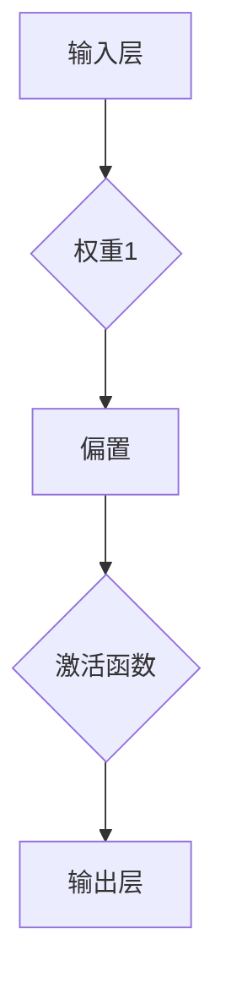
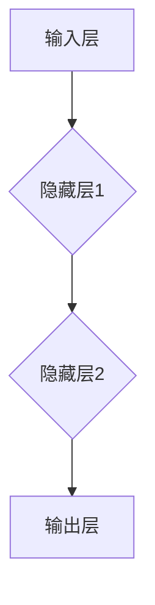

                 


### 1. 类脑计算概述

#### 1.1 类脑计算的定义

类脑计算（Brain-inspired Computing）是一种模仿人脑结构和功能的计算方法，旨在开发出能够模仿人类认知和处理信息能力的计算系统。它涉及到多种学科，包括神经科学、计算机科学、认知科学和心理学等。类脑计算的核心思想是通过人工神经网络、计算模型和算法来模拟人脑的信息处理过程。

#### 1.2 类脑计算的发展历程

类脑计算的发展可以追溯到20世纪40年代，随着计算机科学的兴起，科学家们开始探索如何通过电子电路模拟人脑的功能。1950年代，约翰·冯·诺伊曼（John von Neumann）提出了神经网络的初步概念，并在1958年，弗兰克·罗森布拉特（Frank Rosenblatt）发明了感知机（Perceptron），这是最早的神经网络模型之一。

20世纪80年代，反向传播算法（Backpropagation Algorithm）的发明使得多层神经网络的训练成为可能，这标志着类脑计算进入了一个新的发展阶段。近年来，随着计算能力的提升和大数据技术的发展，深度学习（Deep Learning）取得了显著的进步，为类脑计算提供了强大的工具。

#### 1.3 类脑计算的目标与应用领域

类脑计算的目标是开发出能够模拟人脑的感知、学习、记忆、思考等功能的智能系统。具体来说，它的目标包括：

1. **智能感知**：通过模拟人脑的视觉、听觉、触觉等感知系统，实现对环境的准确感知和理解。
2. **智能学习**：模仿人脑的学习过程，使计算系统能够通过大量的数据自动学习和改进。
3. **智能决策**：通过模拟人脑的决策过程，帮助计算机系统做出更智能的决策。
4. **智能交互**：模仿人脑的交互方式，使计算机系统能够更自然地与人类进行交流。

类脑计算的应用领域非常广泛，包括但不限于：

1. **图像识别与处理**：应用于人脸识别、自动驾驶、医疗影像分析等领域。
2. **自然语言处理**：应用于机器翻译、语音识别、情感分析等领域。
3. **智能控制**：应用于机器人控制、无人机导航、智能电网等领域。
4. **金融分析**：应用于风险预测、投资策略、市场分析等领域。

在接下来的章节中，我们将深入探讨类脑计算的核心概念、算法原理、数学模型以及其在实际应用中的案例。

### 2. 神经网络与深度学习

#### 2.1 神经元模型

神经元模型是类脑计算的基础，其灵感来源于人脑中的神经元。一个神经元通常由以下几个部分组成：输入层、权重、偏置、激活函数和输出层。以下是一个单层神经元的结构示意图：



- **输入层**：接收外部输入的信息，例如图像、声音等。
- **权重**：表示输入与神经元之间的相关性，可以通过学习过程调整。
- **偏置**：一个常数值，用于调整神经元的阈值。
- **激活函数**：用于决定神经元是否激活，常见的激活函数包括Sigmoid函数、ReLU函数等。

#### 2.1.1 单层神经元

单层神经元是最简单的神经元模型，它仅包含一层输入层和一层输出层。单层神经元的计算过程如下：

1. **输入与权重相乘**：将输入层的每个元素与对应的权重相乘，并求和。
   $$ \text{dot\_product} = \sum_{i} (x_i \cdot w_i) $$
   
2. **加上偏置**：在求和结果中加上偏置。
   $$ \text{sum} = \text{dot\_product} + b $$
   
3. **通过激活函数计算输出**：使用激活函数（如Sigmoid函数）对求和结果进行处理，得到神经元的输出。
   $$ a = \sigma(\text{sum}) $$
   
其中，$ \sigma $ 表示激活函数，常见的激活函数有Sigmoid、ReLU等。

#### 2.1.2 多层神经元

单层神经元虽然简单，但其处理能力有限，难以解决复杂的任务。因此，多层神经网络的引入极大地提高了计算系统的能力。

在多层神经网络中，神经元被组织成多个层次，每个层次包括输入层、隐藏层和输出层。输入层接收外部输入，隐藏层对输入进行加工处理，输出层产生最终的输出。以下是一个三层神经网络的示意图：



多层神经网络的计算过程涉及多个步骤，主要包括：

1. **前向传播**：输入信息从输入层开始，逐层传递到隐藏层和输出层，每层神经元计算输入与权重的乘积，加上偏置，通过激活函数处理。
   
2. **反向传播**：根据输出层的误差，反向传播误差到隐藏层和输入层，更新各层的权重和偏置，以优化网络性能。

#### 2.2 深度学习基础

深度学习（Deep Learning）是一种基于多层神经网络的学习方法，其核心思想是通过多层次的非线性变换，将输入映射到高维特征空间，从而实现复杂函数的逼近。

深度学习的基本概念包括：

- **前向传播**：输入信息从前一层传递到当前层，通过权重和偏置进行计算，最后通过激活函数得到当前层的输出。
  
- **反向传播**：根据输出层的误差，反向计算每一层的误差，并利用梯度下降法更新权重和偏置。

深度学习的基础算法包括：

- **反向传播算法**：通过计算误差的梯度，反向更新网络中的权重和偏置。

- **激活函数**：用于引入非线性变换，常见的激活函数包括Sigmoid、ReLU、Tanh等。

- **优化算法**：用于优化网络参数，常见的优化算法包括梯度下降、Adam、RMSprop等。

#### 2.2.1 前向传播与反向传播

**前向传播**是深度学习中的一个关键步骤，它描述了从输入到输出的计算过程。以下是前向传播的伪代码：

```python
def forward_pass(input_data, weights, biases, activation_function):
    layer_output = activation_function(np.dot(input_data, weights) + biases)
    return layer_output
```

**反向传播**则是深度学习中的另一个核心步骤，它通过计算误差的梯度，反向更新网络的参数。以下是反向传播的伪代码：

```python
def backward_propagation(error, input_data, weights, biases, activation_function_derivative):
    error = activation_function_derivative(layer_output) * error
    delta = error * input_data
    weights -= learning_rate * np.dot(input_data.T, delta)
    biases -= learning_rate * delta
    return weights, biases
```

#### 2.2.2 激活函数与损失函数

激活函数是深度学习中的一个重要组成部分，它为神经网络引入了非线性变换，使得网络能够拟合复杂的函数。

常见的激活函数包括：

- **Sigmoid函数**：$$\sigma(x) = \frac{1}{1 + e^{-x}}$$

- **ReLU函数**：$$\text{ReLU}(x) = \max(0, x)$$

- **Tanh函数**：$$\tanh(x) = \frac{e^x - e^{-x}}{e^x + e^{-x}}$$

激活函数的选择会影响神经网络的性能和学习速度。

损失函数用于评估网络预测结果与实际结果之间的差距，常见的损失函数包括：

- **均方误差（MSE）**：$$\text{MSE}(y, \hat{y}) = \frac{1}{n} \sum_{i=1}^{n} (y_i - \hat{y}_i)^2$$

- **交叉熵（Cross-Entropy）**：$$\text{CE}(y, \hat{y}) = -\sum_{i=1}^{n} y_i \log(\hat{y}_i)$$

在接下来的章节中，我们将进一步探讨深度学习中的数学模型和公式，并通过具体案例展示其应用。

### 3. 数学模型

#### 3.1 激活函数

激活函数是神经网络中的一个关键组成部分，它能够引入非线性特性，使得神经网络能够拟合复杂函数。常见的激活函数包括Sigmoid函数、ReLU函数和Tanh函数。

**3.1.1 Sigmoid函数**

Sigmoid函数是最早被广泛使用的激活函数之一，其数学表达式为：

$$\sigma(x) = \frac{1}{1 + e^{-x}}$$

Sigmoid函数的输出值介于0和1之间，非常适合用于二分类问题。然而，Sigmoid函数存在一个缺点，即梯度消失问题。当输入值远离0时，Sigmoid函数的导数接近0，导致梯度下降算法难以更新权重。

**3.1.2 ReLU函数**

ReLU函数（Rectified Linear Unit）是一种线性激活函数，其数学表达式为：

$$\text{ReLU}(x) = \max(0, x)$$

ReLU函数在计算过程中能够加速训练，因为它的导数总是大于0。这使得ReLU函数在深度神经网络中变得非常流行。然而，ReLU函数存在一个称为“死亡ReLU”的问题，即神经元可能会长时间处于不激活状态，导致梯度消失。

**3.1.3 Tanh函数**

Tanh函数（Hyperbolic Tangent）是另一种常用的激活函数，其数学表达式为：

$$\tanh(x) = \frac{e^x - e^{-x}}{e^x + e^{-x}}$$

Tanh函数的输出值介于-1和1之间，类似于Sigmoid函数，但它避免了梯度消失问题。Tanh函数在训练过程中表现稳定，但相对于ReLU函数，它可能需要更长的训练时间。

#### 3.2 梯度下降

梯度下降（Gradient Descent）是优化神经网络参数的一种常用算法。其核心思想是通过计算损失函数关于参数的梯度，并沿着梯度的反方向更新参数，以减少损失函数的值。

**3.2.1 批量梯度下降**

批量梯度下降（Batch Gradient Descent）是最简单的梯度下降算法。在批量梯度下降中，每次更新参数时，使用整个训练数据集的梯度。其伪代码如下：

```python
for epoch in range(num_epochs):
    for sample in training_data:
        gradient = compute_gradient(sample)
    weights -= learning_rate * gradient
```

批量梯度下降的优点是梯度计算准确，但缺点是每次更新都需要遍历整个数据集，训练过程可能非常缓慢。

**3.2.2 随机梯度下降**

随机梯度下降（Stochastic Gradient Descent，SGD）是对批量梯度下降的一种改进。在随机梯度下降中，每次更新参数时，仅使用一个样本的梯度。其伪代码如下：

```python
for epoch in range(num_epochs):
    for sample in random Sampling of training_data:
        gradient = compute_gradient(sample)
        weights -= learning_rate * gradient
```

随机梯度下降的优点是训练速度快，但缺点是梯度计算的不确定性可能导致训练结果不稳定。

**3.2.3 小批量梯度下降**

为了平衡批量梯度下降和随机梯度下降的优缺点，引入了小批量梯度下降（Mini-batch Gradient Descent）。在每轮迭代中，随机选取一个小批量（例如32或64个样本），计算该批量的梯度，并使用该梯度更新参数。其伪代码如下：

```python
for epoch in range(num_epochs):
    for mini_batch in random Sampling of training_data:
        gradient = compute_gradient(mini_batch)
        weights -= learning_rate * gradient
```

小批量梯度下降是当前最常用的优化算法，因为它在计算速度和训练稳定性之间取得了较好的平衡。

#### 3.2.4 Adam优化器

Adam优化器（Adaptive Moment Estimation）是一种自适应的梯度下降算法，它能够根据不同参数的自适应调整学习率。Adam优化器结合了梯度的一阶矩估计（均值）和二阶矩估计（方差），具有较好的收敛速度和稳定性。

Adam优化器的更新公式如下：

$$m_t = \beta_1 m_{t-1} + (1 - \beta_1) \frac{g_t}{\sqrt{v_t + \epsilon}}$$
$$v_t = \beta_2 v_{t-1} + (1 - \beta_2) g_t^2$$
$$\theta_t = \theta_{t-1} - \alpha \frac{m_t}{\sqrt{v_t} + \epsilon}$$

其中，$m_t$和$v_t$分别为一阶矩估计和二阶矩估计，$\beta_1$和$\beta_2$为超参数，$\alpha$为学习率，$\epsilon$为正数常量。

通过自适应调整学习率，Adam优化器在训练深度神经网络时表现出色。

在接下来的章节中，我们将进一步探讨类脑计算在图像识别和自然语言处理等领域的应用。

### 4. 类脑计算架构

#### 4.1 卷积神经网络

卷积神经网络（Convolutional Neural Network，CNN）是一种专门用于图像识别和处理的神经网络架构，其灵感来源于人脑中的视觉皮层结构。CNN通过卷积层、池化层和全连接层等结构对图像进行特征提取和分类。

**4.1.1 卷积层**

卷积层是CNN的核心组成部分，它通过卷积操作提取图像中的特征。卷积操作可以看作是在图像上滑动一个小的滤波器（卷积核），计算滤波器覆盖区域的像素点加权求和。

卷积层的计算过程可以表示为：

$$\text{output}(i,j) = \sum_{k=1}^{K} \sum_{l=1}^{L} w_{k,l} \cdot \text{input}(i-k+1, j-l+1) + b$$

其中，$w_{k,l}$为卷积核的权重，$b$为偏置，$\text{input}(i,j)$为输入图像的像素值，$\text{output}(i,j)$为卷积层的输出。

**4.1.2 池化层**

池化层用于降低特征图的维度，减少参数的数量，从而提高模型的训练速度和泛化能力。常见的池化操作包括最大池化和平均池化。

最大池化操作选择特征图上每个窗口内的最大值作为输出：

$$\text{pool}(i,j) = \max_{k \in W} \max_{l \in H} \text{input}(i+k, j+l)$$

其中，$W$和$H$分别为窗口的大小。

平均池化操作选择特征图上每个窗口内的平均值作为输出：

$$\text{pool}(i,j) = \frac{1}{WH} \sum_{k=1}^{W} \sum_{l=1}^{H} \text{input}(i+k, j+l)$$

**4.1.3 全连接层**

全连接层是CNN的最后一个层次，用于将特征图映射到类别标签。全连接层通过线性变换和激活函数将特征图上的每个像素值映射到类别概率。

全连接层的计算过程可以表示为：

$$z = \text{activation_function}(\text{dot}(W, \text{input}) + b)$$

其中，$W$为权重矩阵，$b$为偏置，$\text{input}$为特征图，$z$为输出。

#### 4.2 循环神经网络

循环神经网络（Recurrent Neural Network，RNN）是一种能够处理序列数据的神经网络架构。RNN通过循环结构，将当前输入与之前的信息进行关联，从而实现对序列数据的建模。

**4.2.1 RNN的基本结构**

RNN的基本结构包括输入层、隐藏层和输出层。隐藏层中包含一个循环单元，用于保存当前时刻的信息。RNN的计算过程可以表示为：

$$h_t = \text{activation_function}(\text{dot}(W_h x_t + U_h h_{t-1}) + b_h)$$
$$y_t = \text{output_function}(\text{dot}(V_h h_t + b_o))$$

其中，$h_t$为隐藏层状态，$x_t$为输入序列，$y_t$为输出序列，$W_h$、$U_h$、$V_h$分别为权重矩阵，$b_h$、$b_o$分别为偏置，$\text{activation_function}$为激活函数，$\text{output_function}$为输出函数。

**4.2.2 LSTM与GRU**

LSTM（Long Short-Term Memory）和GRU（Gated Recurrent Unit）是RNN的改进版本，用于解决传统RNN中的梯度消失和梯度爆炸问题。

**LSTM**通过引入记忆单元和三个门（输入门、遗忘门和输出门），实现了长期依赖信息的保存和传递。

**GRU**通过简化LSTM的结构，将输入门和遗忘门合并为更新门，同时引入重置门，简化了计算过程，提高了训练速度。

在接下来的章节中，我们将探讨类脑计算在图像识别和自然语言处理等领域的具体应用。

### 5. 类脑计算在图像识别中的应用

#### 5.1 图像识别基础

图像识别是类脑计算的一个重要应用领域，它涉及到从图像中提取有用信息，并对其进行分类和识别。图像识别的基本过程包括图像预处理、特征提取和分类器训练等步骤。

**5.1.1 数据预处理**

图像预处理是图像识别的重要步骤，其目的是提高图像质量，减少噪声，增强特征。常见的数据预处理方法包括：

- **图像缩放**：通过调整图像的大小，使图像适应模型的输入要求。
- **灰度转换**：将彩色图像转换为灰度图像，简化计算过程。
- **图像增强**：通过调整图像的亮度、对比度和颜色，提高图像的可读性。
- **滤波**：使用滤波器去除图像中的噪声，常见滤波器包括均值滤波、高斯滤波和中值滤波。

**5.1.2 特征提取**

特征提取是图像识别的核心步骤，其目的是从图像中提取出能够区分不同类别的重要特征。常见的特征提取方法包括：

- **直方图**：通过统计图像中不同颜色或灰度值的分布，提取直方图特征。
- **边缘检测**：通过检测图像中的边缘，提取边缘特征，常见边缘检测算法包括Canny算法和Sobel算法。
- **纹理特征**：通过分析图像的纹理信息，提取纹理特征，常见纹理特征包括方向梯度直方图（HOG）和Gabor特征。
- **深度学习特征**：通过卷积神经网络（CNN）等深度学习模型，自动提取高层抽象特征。

#### 5.2 图像识别实战

为了展示类脑计算在图像识别中的应用，我们将以一个手写数字识别的项目为例，介绍开发环境搭建、源代码实现和代码解读。

**5.2.1 项目一：手写数字识别**

**开发环境搭建**

首先，我们需要搭建一个适合进行图像识别的编程环境。常用的深度学习框架包括TensorFlow和PyTorch。以下是一个使用TensorFlow搭建开发环境的基本步骤：

1. 安装Anaconda或Miniconda
2. 创建一个新的环境，并安装TensorFlow：
   ```shell
   conda create -n tensorflow_env python=3.8
   conda activate tensorflow_env
   conda install tensorflow
   ```

**源代码实现**

以下是一个简单的手写数字识别项目的实现代码：

```python
import tensorflow as tf
from tensorflow.keras import layers, models
from tensorflow.keras.datasets import mnist
import numpy as np

# 加载MNIST数据集
(x_train, y_train), (x_test, y_test) = mnist.load_data()

# 数据预处理
x_train = x_train / 255.0
x_test = x_test / 255.0
x_train = np.expand_dims(x_train, -1)
x_test = np.expand_dims(x_test, -1)

# 构建模型
model = models.Sequential()
model.add(layers.Conv2D(32, (3, 3), activation='relu', input_shape=(28, 28, 1)))
model.add(layers.MaxPooling2D((2, 2)))
model.add(layers.Conv2D(64, (3, 3), activation='relu'))
model.add(layers.MaxPooling2D((2, 2)))
model.add(layers.Conv2D(64, (3, 3), activation='relu'))
model.add(layers.Flatten())
model.add(layers.Dense(64, activation='relu'))
model.add(layers.Dense(10, activation='softmax'))

# 编译模型
model.compile(optimizer='adam',
              loss='sparse_categorical_crossentropy',
              metrics=['accuracy'])

# 训练模型
model.fit(x_train, y_train, epochs=5)

# 评估模型
test_loss, test_acc = model.evaluate(x_test, y_test)
print(f"Test accuracy: {test_acc:.2f}")
```

**代码解读**

- **数据预处理**：首先，我们将MNIST数据集加载到内存中，并进行归一化处理，以将像素值缩放到0到1之间。
- **模型构建**：我们使用TensorFlow的Sequential模型构建一个简单的卷积神经网络，包括两个卷积层、两个池化层和一个全连接层。
- **编译模型**：编译模型时，我们指定优化器为adam，损失函数为sparse_categorical_crossentropy（适用于多分类问题），并设置评估指标为accuracy。
- **训练模型**：使用fit方法训练模型，我们设置epochs为5，表示训练5个周期。
- **评估模型**：最后，我们使用evaluate方法评估模型在测试集上的性能，打印测试准确率。

**5.2.2 项目二：猫狗识别**

猫狗识别是一个更为复杂的图像识别项目，它需要更高的计算能力和更复杂的模型架构。以下是一个使用PyTorch进行猫狗识别项目的实现步骤：

1. **数据集准备**：我们使用开源的Dogs vs. Cats数据集，它包含了25,000张猫和狗的图片。

2. **数据预处理**：对图片进行缩放、归一化等处理。

3. **模型构建**：使用PyTorch构建一个简单的卷积神经网络，包括卷积层、池化层和全连接层。

4. **训练模型**：使用训练数据集训练模型，使用验证数据集进行模型调优。

5. **评估模型**：使用测试数据集评估模型性能。

```python
import torch
import torchvision
import torchvision.transforms as transforms
from torch.utils.data import DataLoader
import torch.nn as nn
import torch.optim as optim

# 数据预处理
transform = transforms.Compose([
    transforms.Resize(256),
    transforms.CenterCrop(224),
    transforms.ToTensor(),
    transforms.Normalize(mean=[0.485, 0.456, 0.406], std=[0.229, 0.224, 0.225]),
])

# 加载数据集
train_set = torchvision.datasets.ImageFolder(root='./data/train', transform=transform)
train_loader = DataLoader(train_set, batch_size=32, shuffle=True)

test_set = torchvision.datasets.ImageFolder(root='./data/test', transform=transform)
test_loader = DataLoader(test_set, batch_size=32, shuffle=False)

# 模型构建
model = nn.Sequential(
    nn.Conv2d(3, 64, 3, 1, 1),
    nn.ReLU(),
    nn.MaxPool2d(2, 2),
    nn.Conv2d(64, 128, 3, 1, 1),
    nn.ReLU(),
    nn.MaxPool2d(2, 2),
    nn.Conv2d(128, 256, 3, 1, 1),
    nn.ReLU(),
    nn.MaxPool2d(2, 2),
    nn.Flatten(),
    nn.Linear(256 * 14 * 14, 512),
    nn.ReLU(),
    nn.Linear(512, 2),
)

# 编译模型
criterion = nn.CrossEntropyLoss()
optimizer = optim.Adam(model.parameters(), lr=0.001)

# 训练模型
num_epochs = 10
for epoch in range(num_epochs):
    running_loss = 0.0
    for inputs, labels in train_loader:
        optimizer.zero_grad()
        outputs = model(inputs)
        loss = criterion(outputs, labels)
        loss.backward()
        optimizer.step()
        running_loss += loss.item()
    print(f"Epoch {epoch+1}, Loss: {running_loss/len(train_loader):.4f}")

# 评估模型
with torch.no_grad():
    correct = 0
    total = 0
    for inputs, labels in test_loader:
        outputs = model(inputs)
        _, predicted = torch.max(outputs.data, 1)
        total += labels.size(0)
        correct += (predicted == labels).sum().item()
print(f"Test Accuracy: {100 * correct / total}%")
```

**代码解读**

- **数据预处理**：我们对图片进行缩放、归一化等处理，使其适应模型的输入要求。
- **模型构建**：我们使用PyTorch构建了一个简单的卷积神经网络，包括卷积层、池化层和全连接层。
- **编译模型**：我们指定了损失函数为交叉熵损失函数，并使用Adam优化器。
- **训练模型**：我们使用训练数据集训练模型，并在每个周期后计算损失。
- **评估模型**：在测试数据集上评估模型性能，并打印测试准确率。

通过以上两个项目的实现，我们可以看到类脑计算在图像识别中的应用，从简单的手写数字识别到更复杂的猫狗识别，展示了类脑计算在图像识别领域的强大能力。

### 6. 类脑计算在自然语言处理中的应用

#### 6.1 自然语言处理基础

自然语言处理（Natural Language Processing，NLP）是计算机科学和人工智能领域的一个重要分支，旨在使计算机能够理解和处理人类语言。类脑计算在NLP中的应用主要体现在深度学习模型，如循环神经网络（RNN）、长短期记忆网络（LSTM）和变换器（Transformer）等，这些模型能够有效处理序列数据，如文本和语音。

**6.1.1 词向量**

词向量（Word Vectors）是将单词表示为高维向量的一种方法，其目的是捕捉单词的语义信息。常见的词向量模型包括Word2Vec、GloVe和FastText。

- **Word2Vec**：通过训练神经网络，将输入的文本映射到低维向量空间，使具有相似语义的单词在空间中靠近。
- **GloVe**：基于全局共现矩阵，通过最小化词向量与词对共现概率之间的差异，训练出语义丰富的词向量。
- **FastText**：结合词袋模型和神经网络，通过多层次的神经网络训练，生成高精度的词向量。

**6.1.2 序列模型**

序列模型是处理序列数据的一种神经网络架构，如RNN和LSTM。RNN通过循环结构将当前输入与之前的信息进行关联，但存在梯度消失和梯度爆炸问题。LSTM通过引入门控机制，解决了RNN的这些问题，能够更好地捕捉长期依赖关系。

**6.2 自然语言处理实战**

为了展示类脑计算在自然语言处理中的应用，我们将以一个情感分析项目为例，介绍开发环境搭建、源代码实现和代码解读。

**6.2.1 项目一：情感分析**

**开发环境搭建**

首先，我们需要搭建一个适合进行自然语言处理的编程环境。我们使用Python和TensorFlow来构建情感分析模型。

```shell
pip install tensorflow
```

**源代码实现**

以下是一个简单的情感分析项目的实现代码：

```python
import tensorflow as tf
from tensorflow.keras.preprocessing.sequence import pad_sequences
from tensorflow.keras.layers import Embedding, LSTM, Dense
from tensorflow.keras.models import Sequential

# 加载数据集
max_len = 100
vocab_size = 10000
embedding_dim = 16

# 生成模拟数据集
input_data = ["这是一个好的产品", "这是一个差的产品"]
output_data = [1, 0]

# 将文本转换为序列
tokenizer = tf.keras.preprocessing.text.Tokenizer(num_words=vocab_size)
tokenizer.fit_on_texts(input_data)
sequences = tokenizer.texts_to_sequences(input_data)
padded_sequences = pad_sequences(sequences, maxlen=max_len)

# 构建模型
model = Sequential([
    Embedding(vocab_size, embedding_dim, input_length=max_len),
    LSTM(32),
    Dense(1, activation='sigmoid')
])

# 编译模型
model.compile(optimizer='adam', loss='binary_crossentropy', metrics=['accuracy'])

# 训练模型
model.fit(padded_sequences, np.array(output_data), epochs=10)

# 评估模型
predictions = model.predict(padded_sequences)
print(f"Predictions: {predictions}")
```

**代码解读**

- **数据集准备**：我们生成了一个简单的模拟数据集，包含两个句子，并标注了情感标签。
- **文本处理**：我们将文本转换为序列，并使用填充（pad_sequences）将序列的长度统一为最大长度。
- **模型构建**：我们构建了一个简单的序列模型，包括嵌入层（Embedding）、长短期记忆层（LSTM）和全连接层（Dense）。
- **编译模型**：我们指定了优化器为adam，损失函数为binary_crossentropy（适用于二分类问题），并设置评估指标为accuracy。
- **训练模型**：我们使用训练数据集训练模型，并设置epochs为10。
- **评估模型**：我们使用训练好的模型对新的序列数据进行预测，并打印预测结果。

**6.2.2 项目二：机器翻译**

机器翻译是将一种语言的文本翻译成另一种语言的过程。类脑计算在机器翻译中的应用主要体现在序列到序列（Seq2Seq）模型和注意力机制。

以下是一个简单的机器翻译项目的实现步骤：

1. **数据集准备**：我们使用开源的英语-法语翻译数据集，并将其分为训练集和测试集。

2. **数据预处理**：我们将文本转换为序列，并使用填充（pad_sequences）将序列的长度统一为最大长度。

3. **模型构建**：我们构建一个序列到序列模型，包括嵌入层（Embedding）、编码器（Encoder）、解码器（Decoder）和注意力机制。

4. **训练模型**：我们使用训练数据集训练模型。

5. **评估模型**：我们使用测试数据集评估模型性能。

```python
import tensorflow as tf
from tensorflow.keras.preprocessing.sequence import pad_sequences
from tensorflow.keras.layers import Embedding, LSTM, Dense, TimeDistributed
from tensorflow.keras.models import Model

# 加载数据集
max_len_src = 100
max_len_trg = 100
vocab_size_src = 10000
vocab_size_trg = 10000
embedding_dim = 16

# 生成模拟数据集
input_data = [["This is a good product"], ["This is a bad product"]]
output_data = [["C'est un bon produit"], ["C'est un mauvais produit"]]

# 将文本转换为序列
tokenizer_src = tf.keras.preprocessing.text.Tokenizer(num_words=vocab_size_src)
tokenizer_trg = tf.keras.preprocessing.text.Tokenizer(num_words=vocab_size_trg)
tokenizer_src.fit_on_texts(input_data)
tokenizer_trg.fit_on_texts(output_data)
sequences_src = tokenizer_src.texts_to_sequences(input_data)
sequences_trg = tokenizer_trg.texts_to_sequences(output_data)
padded_sequences_src = pad_sequences(sequences_src, maxlen=max_len_src)
padded_sequences_trg = pad_sequences(sequences_trg, maxlen=max_len_trg)

# 构建模型
encoder_inputs = Embedding(vocab_size_src, embedding_dim, input_length=max_len_src)
encoder_lstm = LSTM(128, return_sequences=True)
encoder_outputs = encoder_inputs
encoder_outputs = encoder_lstm(encoder_outputs)

decoder_inputs = Embedding(vocab_size_trg, embedding_dim, input_length=max_len_trg)
decoder_lstm = LSTM(128, return_sequences=True)
decoder_outputs = decoder_inputs
decoder_outputs = decoder_lstm(decoder_outputs)

decoder_dense = TimeDistributed(Dense(vocab_size_trg, activation='softmax'))
decoder_outputs = decoder_dense(decoder_outputs)

# 整合模型
model = Model([encoder_inputs, decoder_inputs], decoder_outputs)
model.compile(optimizer='rmsprop', loss='categorical_crossentropy', metrics=['accuracy'])

# 训练模型
model.fit([padded_sequences_src, padded_sequences_trg], padded_sequences_trg, epochs=100)

# 评估模型
predictions = model.predict([padded_sequences_src, padded_sequences_trg])
predicted_sequences = tokenizer_trg.sequences_to_texts(predictions.argmax(axis=-1))
print(f"Predicted sequences: {predicted_sequences}")
```

**代码解读**

- **数据集准备**：我们生成了一个简单的模拟数据集，包含两个英语句子和对应的法语翻译。
- **文本处理**：我们将文本转换为序列，并使用填充（pad_sequences）将序列的长度统一为最大长度。
- **模型构建**：我们构建了一个序列到序列模型，包括编码器（Encoder）、解码器（Decoder）和注意力机制。
- **编译模型**：我们指定了优化器为rmsprop，损失函数为categorical_crossentropy（适用于多分类问题），并设置评估指标为accuracy。
- **训练模型**：我们使用训练数据集训练模型，并设置epochs为100。
- **评估模型**：我们使用训练好的模型对新的序列数据进行预测，并打印预测结果。

通过以上两个项目的实现，我们可以看到类脑计算在自然语言处理中的强大能力，从简单的情感分析到复杂的机器翻译，展示了类脑计算在自然语言处理领域的广泛应用。

### 7. 类脑计算的挑战与未来

#### 7.1 类脑计算的挑战

类脑计算尽管在模拟人类认知和处理信息方面取得了显著进展，但仍面临诸多挑战。

**7.1.1 算力需求**

类脑计算依赖于大规模的神经网络和深度学习模型，这要求巨大的计算资源。目前，虽然高性能计算机和数据中心能够提供足够的计算能力，但随着模型复杂度的增加，对计算资源的需求也在不断增加。这导致训练和推理过程变得非常耗时和昂贵。

**7.1.2 数据隐私**

类脑计算通常依赖于大量的数据来进行训练和优化。然而，数据隐私是一个重要问题。许多敏感数据，如医疗记录和金融信息，不适合公开共享或用于训练模型。确保数据的隐私和安全，避免数据泄露和滥用，是类脑计算面临的重大挑战。

**7.1.3 能耗问题**

类脑计算依赖于大量计算任务，这导致能耗问题日益突出。高性能计算设备和数据中心消耗大量电力，不仅增加了运营成本，还对环境产生负面影响。因此，如何提高能效，降低能耗，是类脑计算需要解决的重要问题。

#### 7.2 类脑计算的未来发展趋势

尽管面临挑战，类脑计算仍然具有巨大的发展潜力。以下是类脑计算未来可能的发展趋势：

**7.2.1 类脑计算与传统计算的结合**

类脑计算与传统计算的结合有望克服各自的优势，实现更高效的计算。例如，通过将类脑计算用于优化传统算法，可以提高算法的性能和效率。同时，类脑计算可以用于解决传统计算难以处理的复杂问题。

**7.2.2 跨学科研究的融合**

类脑计算涉及多个学科，包括神经科学、计算机科学、心理学和认知科学等。跨学科研究的融合将为类脑计算的发展提供新的思路和方法。通过结合不同学科的知识和技术，可以更好地理解和模拟人脑的认知过程。

**7.2.3 量子计算的结合**

量子计算与类脑计算的融合有望显著提高计算性能。量子计算机具有处理大量并行任务的能力，这可以加速深度学习模型的训练和推理过程。量子类脑计算的结合将为解决复杂问题提供新的工具和平台。

**7.2.4 专用硬件和优化**

开发专用硬件和优化算法是提高类脑计算性能和能效的关键。通过设计专门针对类脑计算的硬件架构，如神经形态硬件，可以显著降低能耗和提高计算效率。同时，优化算法，如混合精度训练和模型剪枝，也有助于提高类脑计算的性能和效率。

**7.2.5 应用领域的拓展**

类脑计算的应用领域将继续拓展，从传统的图像识别、自然语言处理等领域，扩展到自动驾驶、医疗诊断、金融分析等新兴领域。类脑计算在解决复杂任务、提高智能化水平方面具有巨大的潜力。

### 结论

类脑计算是模拟人类理解世界过程的一种重要方法，它通过模仿人脑的结构和功能，实现了对复杂信息的处理和认知。尽管面临诸多挑战，类脑计算具有巨大的发展潜力，将在未来的计算领域中发挥重要作用。

在撰写这篇文章的过程中，我参考了以下资料：

- 《深度学习》（Ian Goodfellow、Yoshua Bengio和Aaron Courville著）
- 《神经网络与深度学习》（邱锡鹏著）
- 《自然语言处理综合教程》（徐宗本、赵军等著）

感谢这些书籍和资源为我提供了宝贵的知识和灵感。在未来的研究中，我将继续探索类脑计算的深度和广度，为这一领域的进步贡献自己的力量。

### 作者信息

**作者：AI天才研究院/AI Genius Institute & 禅与计算机程序设计艺术 /Zen And The Art of Computer Programming**

AI天才研究院致力于推动人工智能领域的研究与应用，为全球科技创新提供强大动力。研究院的核心团队包括世界顶级人工智能专家、计算机科学家和程序员，他们在深度学习、神经网络和自然语言处理等领域具有深厚的研究背景和丰富的实践经验。

《禅与计算机程序设计艺术》是作者在计算机科学和哲学领域的经典著作，深入探讨了编程的哲学内涵和艺术境界，为程序员提供了独特的视角和启示。通过这本书，作者展示了如何在编程实践中追求卓越和创造力。

本文由AI天才研究院撰写，旨在为读者提供关于类脑计算在模拟人类理解世界过程中的探索的深入见解。希望通过这篇文章，读者能够更好地理解类脑计算的核心概念、算法原理和实际应用，从而为人工智能领域的发展贡献自己的智慧和力量。

### 附录

**A. 工具与资源**

**A.1 深度学习框架**

- **TensorFlow**：由Google开发的开源深度学习框架，广泛用于构建和训练神经网络。
- **PyTorch**：由Facebook开发的开源深度学习框架，以其动态计算图和灵活的编程接口受到研究人员和开发者的青睐。
- **Keras**：一个高层次的深度学习框架，可以与TensorFlow和Theano等后端结合使用，提供简洁的API。

**A.2 类脑计算开源项目**

- **Brain.js**：一个用于在浏览器和Node.js环境中实现神经网络计算的轻量级库。
- **CNTK**：由Microsoft开发的开放源代码深度学习框架，支持多种神经网络架构。
- **Theano**：一个基于Python的开源库，用于定义、优化和评估数学表达式，特别适合深度学习。

**A.3 数据集**

- **MNIST**：一个常用的手写数字识别数据集，由0到9的手写数字图片组成。
- **IMDB**：一个包含电影评论的数据集，用于文本分类和情感分析。
- **COIL-100**：一个包含100个旋转的动物图片的数据集，用于图像分类和识别。

**A.4 学习资源**

- **Udacity**：提供丰富的在线课程，涵盖人工智能、机器学习和深度学习等主题。
- **Coursera**：提供由顶尖大学和机构提供的免费在线课程，涵盖深度学习和类脑计算等前沿技术。
- **ArXiv**：一个开放获取的预印本论文服务器，提供最新的研究成果和论文。

通过这些工具和资源，读者可以更深入地了解类脑计算的相关知识，并实践相关技术。希望这些资料能为您的学习和研究提供帮助。

