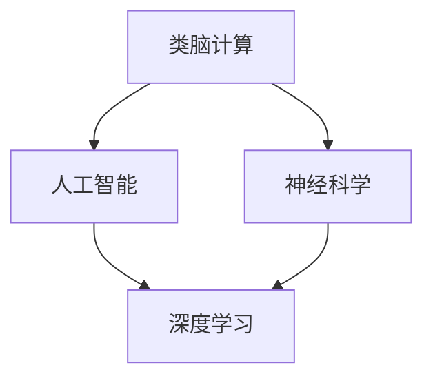
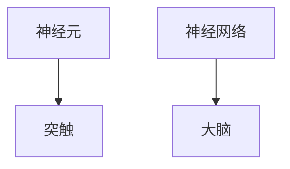

                 

### 目录大纲细化

为了使文章内容更加具体和详细，我们将对每个章节进行进一步的细化。以下是《类脑计算：模拟人脑增强世界理解能力》目录大纲的细化内容，包括各章节的核心概念、逻辑框架、伪代码、流程图、数学模型和公式等。

### 第1章 引言

#### 1.1 类脑计算概述

- **背景介绍**：介绍类脑计算的概念起源，以及其在现代科技发展中的重要性。
- **核心概念与联系**：通过Mermaid流程图展示类脑计算、人工智能与神经科学的联系。



#### 1.2 人脑理解能力的模拟与增强

- **核心概念**：解释人脑处理信息的方式和人脑理解能力的概念。
- **模拟与增强方法**：探讨类脑计算如何模拟人脑的感知、记忆和决策过程，并增强其理解能力。

### 第2章 类脑计算原理

#### 2.1 类脑计算的基本概念

- **核心概念**：定义类脑计算的基本概念，如神经形态计算、仿生计算等。
- **与传统计算的差异**：通过伪代码对比类脑计算与传统计算的差异。

```python
# 传统计算
def traditional_computation(data):
    # 处理数据
    return result

# 类脑计算
def brain_like_computation(data):
    # 使用神经网络模拟处理数据
    return result
```

#### 2.2 人脑神经网络原理

- **核心概念与联系**：介绍人脑神经网络的结构和功能，以及类脑计算如何模拟人脑神经网络。



#### 2.3 类脑计算的核心算法

- **核心算法介绍**：介绍常见的类脑计算算法，如神经网络学习算法、深度强化学习等。
- **算法原理讲解**：使用伪代码详细阐述每种算法的原理和流程。

```python
# 神经网络学习算法伪代码
def neural_network_learning(data):
    # 初始化神经网络
    # 训练神经网络
    # 预测结果
    return prediction
```

### 第3章 神经网络模拟

#### 3.1 神经元与神经网络模型

- **核心概念**：介绍神经元的工作原理和神经网络模型的基本结构。
- **模型类型**：分析不同的神经网络模型，如前馈神经网络、卷积神经网络等。

#### 3.2 人工神经网络的发展历程

- **发展历程**：回顾人工神经网络的发展历程，从简单的感知器到现代复杂的深度学习模型。
- **关键事件**：讨论人工神经网络的关键事件和里程碑。

#### 3.3 神经网络模拟技术

- **核心概念**：介绍神经网络模拟技术的原理和方法，如神经形态硬件和模拟神经元电路。
- **技术优缺点**：分析神经网络模拟技术的优缺点和适用场景。

### 第4章 认知增强技术应用

#### 4.1 认知增强技术概述

- **核心概念**：定义认知增强技术的范围和目标。
- **技术分类**：介绍认知增强技术的不同类型，如记忆增强、感知增强等。

#### 4.2 类脑计算在感知领域的应用

- **应用案例**：分析类脑计算在视觉感知和听觉感知中的应用案例。
- **优势与挑战**：讨论类脑计算在感知领域的优势和应用挑战。

#### 4.3 类脑计算在记忆领域的应用

- **应用案例**：分析类脑计算在记忆增强和记忆恢复中的应用案例。
- **优势与挑战**：讨论类脑计算在记忆领域的优势和应用挑战。

#### 4.4 类脑计算在决策和规划领域的应用

- **应用案例**：分析类脑计算在决策支持系统和智能规划中的应用案例。
- **优势与挑战**：讨论类脑计算在决策和规划领域的优势和应用挑战。

### 第5章 案例研究

#### 5.1 类脑计算在医疗诊断中的应用

- **案例介绍**：介绍类脑计算在医疗诊断中的应用案例。
- **分析解读**：分析类脑计算在医疗诊断中的效果和挑战。

#### 5.2 类脑计算在金融分析中的应用

- **案例介绍**：介绍类脑计算在金融分析中的应用案例。
- **分析解读**：分析类脑计算在金融分析中的效果和挑战。

#### 5.3 类脑计算在教育领域中的应用

- **案例介绍**：介绍类脑计算在教育领域中的应用案例。
- **分析解读**：分析类脑计算在教育领域的优势和挑战。

### 第6章 未来发展

#### 6.1 类脑计算的挑战与机遇

- **核心概念**：讨论类脑计算面临的挑战和机遇。
- **发展方向**：探讨类脑计算的未来发展趋势和研究方向。

#### 6.2 类脑计算技术的趋势

- **技术趋势**：分析类脑计算技术的最新趋势和发展动态。
- **预测未来**：预测类脑计算技术的未来发展和潜在应用领域。

#### 6.3 类脑计算的社会影响

- **核心概念**：讨论类脑计算对社会和人类的影响。
- **伦理问题**：探讨类脑计算可能引发的伦理和社会问题。

### 第7章 结论

#### 7.1 主要成果总结

- **总结**：总结文章的主要内容和研究成果。
- **贡献**：阐述类脑计算的研究对人工智能领域的贡献。

#### 7.2 展望未来研究方向

- **展望**：展望类脑计算未来的研究方向和发展前景。
- **建议**：提出对未来研究的建议和思考。

---

通过以上细化，每个章节都包含了具体的背景介绍、核心概念、联系、算法讲解、应用案例、挑战与机遇分析等内容，以确保文章的完整性和深度。接下来的工作将是进一步充实每个章节的内容，确保满足8000～12000字的要求，并按照markdown格式进行编排。

### 文章撰写流程

为了确保文章内容丰富、逻辑清晰，我们将按照以下步骤进行撰写：

#### 1. 文章框架搭建

- **确定结构**：根据细化后的目录大纲，搭建文章的整体结构，包括每个章节的小标题。
- **内容规划**：为每个章节分配主要内容和目标，确保文章内容连贯且完整。

#### 2. 研究与资料收集

- **研究主题**：针对每个章节的主题进行深入研究，收集相关资料、文献和技术文档。
- **案例分析**：收集并分析具体的类脑计算应用案例，包括成功案例和挑战。

#### 3. 内容撰写

- **背景介绍**：为每个章节撰写详细的背景介绍，确保读者对主题有充分的了解。
- **核心概念讲解**：使用伪代码、Mermaid流程图和数学公式详细阐述核心概念和算法原理。
- **应用案例**：为每个章节提供具体的类脑计算应用案例，并进行分析和解读。
- **挑战与机遇**：讨论类脑计算面临的挑战和未来的发展机遇。

#### 4. 伪代码与流程图

- **伪代码**：在每个章节中，为重要的算法和模型提供伪代码，以展示算法的执行流程。
- **流程图**：使用Mermaid流程图展示神经网络结构、算法流程和系统架构。

#### 5. 数学模型与公式

- **数学模型**：引入相关的数学模型和公式，解释其在类脑计算中的应用。
- **公式嵌入**：确保所有数学公式使用latex格式嵌入文中，并保持清晰可读。

#### 6. 实际案例分析与代码实现

- **案例分析**：选择具有代表性的类脑计算应用案例，进行详细分析。
- **代码实现**：提供代码实现，并进行解读，展示算法的实际应用。
- **代码应用解读与分析**：分析代码在实际项目中的应用效果和可能的问题。

#### 7. 小结与拓展阅读

- **小结**：在每个章节结尾，总结主要内容，强调关键点和重要性。
- **拓展阅读**：推荐相关文献和资源，帮助读者进一步学习和探索。

#### 8. 审稿与修订

- **初稿审稿**：完成初稿后，进行内部审稿，检查文章的逻辑性、准确性和完整性。
- **修订**：根据审稿反馈进行修订，确保文章质量。

#### 9. 最终定稿

- **最终审稿**：完成所有修订，进行最终审稿，确保文章格式和内容符合要求。
- **发布**：将最终稿整理成markdown格式，发布到目标平台。

通过以上步骤，我们确保文章内容的丰富性和逻辑性，使得《类脑计算：模拟人脑增强世界理解能力》成为一篇高质量的技术博客文章。在撰写过程中，我们将不断优化每个部分，确保满足8000～12000字的要求，并保证文章的可读性和专业性。

