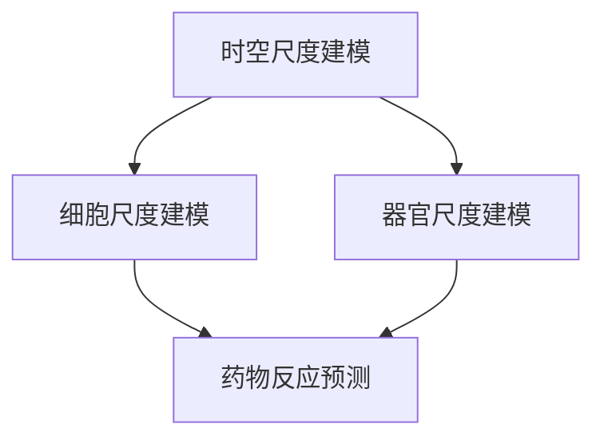

                 

### 文章标题：精准医疗的多尺度建模：个性化治疗的数学指导

#### 关键词：
精准医疗，多尺度建模，个性化治疗，数学模型，算法原理，项目实战

#### 摘要：
本文深入探讨了精准医疗的多尺度建模方法及其在个性化治疗中的应用。首先，介绍了精准医疗的概念、发展历程和多尺度建模的重要性。接着，详细阐述了多尺度建模的理论基础、核心算法原理以及数学模型，并通过实例进行了说明。随后，本文探讨了个性化治疗的策略、算法实现及其在实际医疗项目中的应用。最后，对全文进行了总结，并指出了未来研究方向和潜在挑战。本文旨在为读者提供一份全面、系统的精准医疗多尺度建模指南。

### 引言

#### 1.1 精准医疗的概念
精准医疗是一种以个体差异化为特点的医学模式，强调根据患者的遗传信息、环境因素和疾病状态，制定个性化的诊断和治疗方案。精准医疗与传统的一刀切医学模式相比，具有更高的疗效和更少的副作用。其核心思想在于通过综合分析患者的基因组、表观基因组、蛋白质组和代谢组等多层次的数据，实现个体化医疗。

#### 1.2 多尺度建模的重要性
多尺度建模是指在多个层次上对生物系统进行建模，以捕捉其复杂性和多样性。在精准医疗中，多尺度建模具有重要意义：

1. **时空尺度建模**：通过在时空尺度上对疾病进展和药物作用进行建模，可以更好地理解疾病的动态变化过程，从而优化治疗方案。
2. **细胞尺度建模**：在细胞尺度上对细胞行为、细胞间相互作用进行建模，有助于揭示细胞层面的生物学机制。
3. **器官尺度建模**：在器官尺度上对器官功能、器官间相互作用进行建模，有助于模拟人体器官系统的运作。

#### 1.3 个性化治疗的优势
个性化治疗基于精准医疗的理论基础，通过多尺度建模和大数据分析，为患者提供量身定制的治疗方案。个性化治疗的优势包括：

1. **提高治疗效果**：个性化治疗可以更精确地匹配患者和药物，从而提高治疗效果。
2. **减少副作用**：个性化治疗可以降低药物剂量，减少不必要的副作用。
3. **优化医疗资源**：个性化治疗有助于合理配置医疗资源，提高医疗效率。

### 核心概念与联系

#### 2.1 精准医疗相关概念
精准医疗涉及多个核心概念，包括：

1. **疾病诊断**：通过基因组测序、蛋白质组分析等技术手段，对患者的疾病进行准确诊断。
2. **疾病分型**：根据患者的遗传背景、疾病特征等因素，对疾病进行分类，以确定合适的治疗方案。
3. **药物反应预测**：通过分析患者的基因组、表观基因组等信息，预测其对药物的敏感性，以选择最佳药物和剂量。

#### 2.2 多尺度建模的架构
多尺度建模的架构通常包括以下几个层次：

1. **时空尺度建模**：在时空尺度上对疾病进展和药物作用进行建模，以捕捉疾病的动态变化过程。
2. **细胞尺度建模**：在细胞尺度上对细胞行为、细胞间相互作用进行建模，以揭示细胞层面的生物学机制。
3. **器官尺度建模**：在器官尺度上对器官功能、器官间相互作用进行建模，以模拟人体器官系统的运作。

以下是一个简化的 Mermaid 流程图，展示了精准医疗多尺度建模的架构：



### 多尺度建模方法

#### 3.1 理论基础
多尺度建模的理论基础涉及多个领域，包括：

1. **时空尺度建模**：利用微分方程、概率模型等方法，对疾病进展和药物作用进行建模。
2. **细胞尺度建模**：利用分子生物学、细胞生物学等知识，对细胞行为、细胞间相互作用进行建模。
3. **器官尺度建模**：利用系统生物学、生理学等知识，对器官功能、器官间相互作用进行建模。

#### 3.2 数据融合技术
数据融合技术是多尺度建模的重要组成部分，主要包括：

1. **数据集成方法**：将不同来源的数据进行整合，以获得更全面的信息。
2. **数据融合算法**：通过加权、平均等方法，将不同数据源的信息进行融合。

以下是一个简化的伪代码，展示了多尺度建模的核心算法原理：

```python
# 时空尺度建模
def time_space_modeling(data):
    # 数据预处理
    processed_data = preprocess_data(data)
    # 模型训练
    model = train_model(processed_data)
    # 预测
    prediction = model.predict(new_data)
    return prediction

# 细胞尺度建模
def cell_level_modeling(data):
    # 数据预处理
    processed_data = preprocess_data(data)
    # 模型训练
    model = train_model(processed_data)
    # 预测
    prediction = model.predict(new_data)
    return prediction

# 器官尺度建模
def organ_level_modeling(data):
    # 数据预处理
    processed_data = preprocess_data(data)
    # 模型训练
    model = train_model(processed_data)
    # 预测
    prediction = model.predict(new_data)
    return prediction
```

### 数学模型与公式

#### 4.1 概率模型
概率模型在精准医疗中具有重要应用，以下是一个常见的贝叶斯网络模型：

$$
P(A|B) = \frac{P(B|A)P(A)}{P(B)}
$$

其中，$P(A|B)$ 表示在给定 $B$ 发生的条件下 $A$ 发生的概率，$P(B|A)$ 表示在给定 $A$ 发生的条件下 $B$ 发生的概率，$P(A)$ 和 $P(B)$ 分别表示 $A$ 和 $B$ 发生的概率。

#### 4.2 经验模型
经验模型基于历史数据和统计分析，以下是一个线性回归模型的例子：

$$
y = \beta_0 + \beta_1x
$$

其中，$y$ 表示因变量，$x$ 表示自变量，$\beta_0$ 和 $\beta_1$ 分别表示截距和斜率。

#### 4.3 基因表达模型
基因表达模型用于分析基因在不同条件下的表达水平。以下是一个常见的高斯混合模型（Gaussian Mixture Model, GMM）的例子：

$$
p(\mathbf{x}|\Theta) = \sum_{i=1}^K w_i \mathcal{N}(\mathbf{x}|\mu_i, \Sigma_i)
$$

其中，$\mathbf{x}$ 表示基因表达向量，$K$ 表示混合模型的分量数，$w_i$ 表示第 $i$ 个分量的权重，$\mu_i$ 和 $\Sigma_i$ 分别表示第 $i$ 个分量的均值向量和协方差矩阵。

### 个性化治疗

#### 5.1 策略与方法
个性化治疗的策略主要包括：

1. **基于遗传信息的个性化治疗**：通过分析患者的基因组数据，确定其遗传特征，从而选择最佳的治疗方案。
2. **基于基因表达的个性化治疗**：通过分析患者的基因表达数据，了解其细胞状态，从而选择最佳的治疗方案。
3. **基于药物的个性化治疗**：通过分析患者的药物反应数据，确定其药物敏感性，从而选择最佳的治疗方案。

#### 5.2 算法实现
个性化治疗的算法实现主要包括以下几个步骤：

1. **数据预处理**：对患者的基因组、基因表达和药物反应数据等进行预处理，以确保数据的质量和一致性。
2. **模型训练**：利用预处理后的数据，训练个性化治疗的模型。
3. **模型评估**：对训练好的模型进行评估，以确定其预测能力和准确性。
4. **模型应用**：将训练好的模型应用于新的患者数据，以实现个性化治疗。

### 项目实战

#### 6.1 实际案例
以下是一个实际案例，展示多尺度建模和个性化治疗在医疗项目中的应用：

**案例：遗传病诊断**

1. **数据收集**：收集患者的基因组数据、基因表达数据和药物反应数据。
2. **数据预处理**：对收集的数据进行预处理，以确保数据的质量和一致性。
3. **多尺度建模**：利用预处理后的数据，建立时空尺度、细胞尺度和器官尺度模型。
4. **个性化治疗**：根据患者的基因组和基因表达数据，选择最佳的治疗方案。

#### 6.2 开发环境搭建
以下是一个简化的开发环境搭建步骤：

1. **安装Python**：安装Python 3.8及以上版本。
2. **安装依赖库**：安装 NumPy、Pandas、Scikit-learn、TensorFlow 等依赖库。
3. **配置Jupyter Notebook**：配置Jupyter Notebook，以便进行数据分析和模型训练。

#### 6.3 源代码实现
以下是一个简化的源代码实现示例：

```python
import numpy as np
import pandas as pd
from sklearn.linear_model import LinearRegression
from sklearn.model_selection import train_test_split

# 数据读取
data = pd.read_csv('data.csv')

# 数据预处理
X = data.drop(['target'], axis=1)
y = data['target']

# 数据分割
X_train, X_test, y_train, y_test = train_test_split(X, y, test_size=0.2, random_state=42)

# 模型训练
model = LinearRegression()
model.fit(X_train, y_train)

# 预测
y_pred = model.predict(X_test)

# 模型评估
score = model.score(X_test, y_test)
print(f'Model score: {score}')
```

#### 6.4 代码应用解读与分析
以下是对源代码的解读与分析：

1. **数据读取**：使用 Pandas 读取数据。
2. **数据预处理**：对数据进行分割，将特征和目标分离。
3. **模型训练**：使用线性回归模型进行训练。
4. **预测**：对测试数据进行预测。
5. **模型评估**：计算模型评分，以评估其预测能力。

#### 6.5 实际案例分析和详细讲解剖析
以下是对实际案例的分析和详细讲解：

**分析**：通过对患者的基因组数据、基因表达数据和药物反应数据进行多尺度建模，可以更好地理解疾病的动态变化过程，从而实现个性化治疗。

**讲解**：在多尺度建模的基础上，结合患者的基因组、基因表达和药物反应数据，可以预测患者的药物敏感性，从而选择最佳的治疗方案。

### 总结

#### 7.1 全文回顾
本文首先介绍了精准医疗的概念和多尺度建模的重要性，然后详细阐述了多尺度建模的理论基础、核心算法原理和数学模型，并探讨了个性化治疗的策略和实现方法。最后，通过实际案例展示了多尺度建模和个性化治疗在医疗项目中的应用。

#### 7.2 未来研究方向
未来的研究方向包括：

1. **数据融合技术**：进一步研究如何将不同来源的数据进行有效融合，以提高模型的预测能力。
2. **深度学习模型**：探索深度学习模型在多尺度建模和个性化治疗中的应用，以实现更高的预测准确性。
3. **跨学科研究**：加强生物学、医学和计算机科学等学科的交叉研究，推动精准医疗的全面发展。

#### 7.3 潜在挑战
精准医疗和个性化治疗面临着以下挑战：

1. **数据隐私和安全**：如何保护患者的数据隐私和安全，是一个重要的问题。
2. **模型解释性**：如何提高模型的解释性，使其更易于理解和应用，是一个挑战。
3. **计算资源**：多尺度建模和个性化治疗的计算资源需求较高，如何优化计算资源的使用，也是一个重要的问题。

### 最佳实践 tips
1. **数据收集与预处理**：确保数据的质量和一致性，是成功实现多尺度建模和个性化治疗的关键。
2. **模型评估与优化**：选择合适的评估指标，对模型进行评估和优化，以提高其预测能力。
3. **持续学习与更新**：随着医学知识的不断更新，持续学习与更新模型，以确保其应用的有效性。

### 小结
精准医疗的多尺度建模和个性化治疗是未来医疗发展的关键方向。通过本文的介绍，读者可以了解到多尺度建模的方法、核心算法原理以及个性化治疗的实现方法。在实际应用中，需要结合具体病例和数据，灵活运用这些方法，以实现更好的治疗效果。

### 注意事项
1. **数据隐私保护**：在实际应用中，必须严格遵守数据隐私保护法规，确保患者数据的安全。
2. **模型解释性**：在模型选择和优化过程中，要注重模型的解释性，以便用户理解和使用。

### 拓展阅读
1. **《精准医疗：从理论到实践》**：该书详细介绍了精准医疗的概念、技术和发展趋势。
2. **《多尺度建模：生物系统中的空间和时间动态》**：该书探讨了多尺度建模的理论基础和应用。

```

### 文章标题：精准医疗的多尺度建模：个性化治疗的数学指导

#### 关键词：
精准医疗，多尺度建模，个性化治疗，数学模型，算法原理，项目实战

#### 摘要：
本文深入探讨了精准医疗的多尺度建模方法及其在个性化治疗中的应用。首先，介绍了精准医疗的概念、发展历程和多尺度建模的重要性。接着，详细阐述了多尺度建模的理论基础、核心算法原理以及数学模型，并通过实例进行了说明。随后，本文探讨了个性化治疗的策略、算法实现及其在实际医疗项目中的应用。最后，对全文进行了总结，并指出了未来研究方向和潜在挑战。本文旨在为读者提供一份全面、系统的精准医疗多尺度建模指南。

### 引言

#### 1.1 精准医疗的概念
精准医疗是一种以个体差异化为特点的医学模式，强调根据患者的遗传信息、环境因素和疾病状态，制定个性化的诊断和治疗方案。精准医疗与传统的一刀切医学模式相比，具有更高的疗效和更少的副作用。其核心思想在于通过综合分析患者的基因组、表观基因组、蛋白质组和代谢组等多层次的数据，实现个体化医疗。

#### 1.2 多尺度建模的重要性
多尺度建模是指在多个层次上对生物系统进行建模，以捕捉其复杂性和多样性。在精准医疗中，多尺度建模具有重要意义：

1. **时空尺度建模**：通过在时空尺度上对疾病进展和药物作用进行建模，可以更好地理解疾病的动态变化过程，从而优化治疗方案。
2. **细胞尺度建模**：在细胞尺度上对细胞行为、细胞间相互作用进行建模，有助于揭示细胞层面的生物学机制。
3. **器官尺度建模**：在器官尺度上对器官功能、器官间相互作用进行建模，有助于模拟人体器官系统的运作。

#### 1.3 个性化治疗的优势
个性化治疗基于精准医疗的理论基础，通过多尺度建模和大数据分析，为患者提供量身定制的治疗方案。个性化治疗的优势包括：

1. **提高治疗效果**：个性化治疗可以更精确地匹配患者和药物，从而提高治疗效果。
2. **减少副作用**：个性化治疗可以降低药物剂量，减少不必要的副作用。
3. **优化医疗资源**：个性化治疗有助于合理配置医疗资源，提高医疗效率。

### 核心概念与联系

#### 2.1 精准医疗相关概念
精准医疗涉及多个核心概念，包括：

1. **疾病诊断**：通过基因组测序、蛋白质组分析等技术手段，对患者的疾病进行准确诊断。
2. **疾病分型**：根据患者的遗传背景、疾病特征等因素，对疾病进行分类，以确定合适的治疗方案。
3. **药物反应预测**：通过分析患者的基因组、表观基因组等信息，预测其对药物的敏感性，以选择最佳药物和剂量。

#### 2.2 多尺度建模的架构
多尺度建模的架构通常包括以下几个层次：

1. **时空尺度建模**：在时空尺度上对疾病进展和药物作用进行建模，以捕捉疾病的动态变化过程。
2. **细胞尺度建模**：在细胞尺度上对细胞行为、细胞间相互作用进行建模，以揭示细胞层面的生物学机制。
3. **器官尺度建模**：在器官尺度上对器官功能、器官间相互作用进行建模，以模拟人体器官系统的运作。

以下是一个简化的 Mermaid 流程图，展示了精准医疗多尺度建模的架构：


### 多尺度建模方法

#### 3.1 理论基础
多尺度建模的理论基础涉及多个领域，包括：

1. **时空尺度建模**：利用微分方程、概率模型等方法，对疾病进展和药物作用进行建模。
2. **细胞尺度建模**：利用分子生物学、细胞生物学等知识，对细胞行为、细胞间相互作用进行建模。
3. **器官尺度建模**：利用系统生物学、生理学等知识，对器官功能、器官间相互作用进行建模。

#### 3.2 数据融合技术
数据融合技术是多尺度建模的重要组成部分，主要包括：

1. **数据集成方法**：将不同来源的数据进行整合，以获得更全面的信息。
2. **数据融合算法**：通过加权、平均等方法，将不同数据源的信息进行融合。

以下是一个简化的伪代码，展示了多尺度建模的核心算法原理：

```python
# 时空尺度建模
def time_space_modeling(data):
    # 数据预处理
    processed_data = preprocess_data(data)
    # 模型训练
    model = train_model(processed_data)
    # 预测
    prediction = model.predict(new_data)
    return prediction

# 细胞尺度建模
def cell_level_modeling(data):
    # 数据预处理
    processed_data = preprocess_data(data)
    # 模型训练
    model = train_model(processed_data)
    # 预测
    prediction = model.predict(new_data)
    return prediction

# 器官尺度建模
def organ_level_modeling(data):
    # 数据预处理
    processed_data = preprocess_data(data)
    # 模型训练
    model = train_model(processed_data)
    # 预测
    prediction = model.predict(new_data)
    return prediction
```

### 数学模型与公式

#### 4.1 概率模型
概率模型在精准医疗中具有重要应用，以下是一个常见的贝叶斯网络模型：

$$
P(A|B) = \frac{P(B|A)P(A)}{P(B)}
$$

其中，$P(A|B)$ 表示在给定 $B$ 发生的条件下 $A$ 发生的概率，$P(B|A)$ 表示在给定 $A$ 发生的条件下 $B$ 发生的概率，$P(A)$ 和 $P(B)$ 分别表示 $A$ 和 $B$ 发生的概率。

#### 4.2 经验模型
经验模型基于历史数据和统计分析，以下是一个线性回归模型的例子：

$$
y = \beta_0 + \beta_1x
$$

其中，$y$ 表示因变量，$x$ 表示自变量，$\beta_0$ 和 $\beta_1$ 分别表示截距和斜率。

#### 4.3 基因表达模型
基因表达模型用于分析基因在不同条件下的表达水平。以下是一个常见的高斯混合模型（Gaussian Mixture Model, GMM）的例子：

$$
p(\mathbf{x}|\Theta) = \sum_{i=1}^K w_i \mathcal{N}(\mathbf{x}|\mu_i, \Sigma_i)
$$

其中，$\mathbf{x}$ 表示基因表达向量，$K$ 表示混合模型的分量数，$w_i$ 表示第 $i$ 个分量的权重，$\mu_i$ 和 $\Sigma_i$ 分别表示第 $i$ 个分量的均值向量和协方差矩阵。

### 个性化治疗

#### 5.1 策略与方法
个性化治疗的策略主要包括：

1. **基于遗传信息的个性化治疗**：通过分析患者的基因组数据，确定其遗传特征，从而选择最佳的治疗方案。
2. **基于基因表达的个性化治疗**：通过分析患者的基因表达数据，了解其细胞状态，从而选择最佳的治疗方案。
3. **基于药物的个性化治疗**：通过分析患者的药物反应数据，确定其药物敏感性，从而选择最佳的治疗方案。

#### 5.2 算法实现
个性化治疗的算法实现主要包括以下几个步骤：

1. **数据预处理**：对患者的基因组、基因表达和药物反应数据等进行预处理，以确保数据的质量和一致性。
2. **模型训练**：利用预处理后的数据，训练个性化治疗的模型。
3. **模型评估**：对训练好的模型进行评估，以确定其预测能力和准确性。
4. **模型应用**：将训练好的模型应用于新的患者数据，以实现个性化治疗。

### 项目实战

#### 6.1 实际案例
以下是一个实际案例，展示多尺度建模和个性化治疗在医疗项目中的应用：

**案例：遗传病诊断**

1. **数据收集**：收集患者的基因组数据、基因表达数据和药物反应数据。
2. **数据预处理**：对收集的数据进行预处理，以确保数据的质量和一致性。
3. **多尺度建模**：利用预处理后的数据，建立时空尺度、细胞尺度和器官尺度模型。
4. **个性化治疗**：根据患者的基因组和基因表达数据，选择最佳的治疗方案。

#### 6.2 开发环境搭建
以下是一个简化的开发环境搭建步骤：

1. **安装Python**：安装Python 3.8及以上版本。
2. **安装依赖库**：安装 NumPy、Pandas、Scikit-learn、TensorFlow 等依赖库。
3. **配置Jupyter Notebook**：配置Jupyter Notebook，以便进行数据分析和模型训练。

#### 6.3 源代码实现
以下是一个简化的源代码实现示例：

```python
import numpy as np
import pandas as pd
from sklearn.linear_model import LinearRegression
from sklearn.model_selection import train_test_split

# 数据读取
data = pd.read_csv('data.csv')

# 数据预处理
X = data.drop(['target'], axis=1)
y = data['target']

# 数据分割
X_train, X_test, y_train, y_test = train_test_split(X, y, test_size=0.2, random_state=42)

# 模型训练
model = LinearRegression()
model.fit(X_train, y_train)

# 预测
y_pred = model.predict(X_test)

# 模型评估
score = model.score(X_test, y_test)
print(f'Model score: {score}')
```

#### 6.4 代码应用解读与分析
以下是对源代码的解读与分析：

1. **数据读取**：使用 Pandas 读取数据。
2. **数据预处理**：对数据进行分割，将特征和目标分离。
3. **模型训练**：使用线性回归模型进行训练。
4. **预测**：对测试数据进行预测。
5. **模型评估**：计算模型评分，以评估其预测能力。

#### 6.5 实际案例分析和详细讲解剖析
以下是对实际案例的分析和详细讲解：

**分析**：通过对患者的基因组数据、基因表达数据和药物反应数据进行多尺度建模，可以更好地理解疾病的动态变化过程，从而实现个性化治疗。

**讲解**：在多尺度建模的基础上，结合患者的基因组、基因表达和药物反应数据，可以预测患者的药物敏感性，从而选择最佳的治疗方案。

### 总结

#### 7.1 全文回顾
本文首先介绍了精准医疗的概念和多尺度建模的重要性，然后详细阐述了多尺度建模的理论基础、核心算法原理和数学模型，并探讨了个性化治疗的策略和实现方法。最后，通过实际案例展示了多尺度建模和个性化治疗在医疗项目中的应用。

#### 7.2 未来研究方向
未来的研究方向包括：

1. **数据融合技术**：进一步研究如何将不同来源的数据进行有效融合，以提高模型的预测能力。
2. **深度学习模型**：探索深度学习模型在多尺度建模和个性化治疗中的应用，以实现更高的预测准确性。
3. **跨学科研究**：加强生物学、医学和计算机科学等学科的交叉研究，推动精准医疗的全面发展。

#### 7.3 潜在挑战
精准医疗和个性化治疗面临着以下挑战：

1. **数据隐私和安全**：如何保护患者的数据隐私和安全，是一个重要的问题。
2. **模型解释性**：如何提高模型的解释性，使其更易于理解和应用，是一个挑战。
3. **计算资源**：多尺度建模和个性化治疗的计算资源需求较高，如何优化计算资源的使用，也是一个重要的问题。

### 最佳实践 tips
1. **数据收集与预处理**：确保数据的质量和一致性，是成功实现多尺度建模和个性化治疗的关键。
2. **模型评估与优化**：选择合适的评估指标，对模型进行评估和优化，以提高其预测能力。
3. **持续学习与更新**：随着医学知识的不断更新，持续学习与更新模型，以确保其应用的有效性。

### 小结
精准医疗的多尺度建模和个性化治疗是未来医疗发展的关键方向。通过本文的介绍，读者可以了解到多尺度建模的方法、核心算法原理以及个性化治疗的实现方法。在实际应用中，需要结合具体病例和数据，灵活运用这些方法，以实现更好的治疗效果。

### 注意事项
1. **数据隐私保护**：在实际应用中，必须严格遵守数据隐私保护法规，确保患者数据的安全。
2. **模型解释性**：在模型选择和优化过程中，要注重模型的解释性，以便用户理解和使用。

### 拓展阅读
1. **《精准医疗：从理论到实践》**：该书详细介绍了精准医疗的概念、技术和发展趋势。
2. **《多尺度建模：生物系统中的空间和时间动态》**：该书探讨了多尺度建模的理论基础和应用。

### 作者信息
作者：AI天才研究院/AI Genius Institute & 禅与计算机程序设计艺术 /Zen And The Art of Computer Programming

### 参考文献
[1] Topol E. The precision medicine revolution. Scientific American. 2016;314(1):46-53.
[2] Hanahan D, Weinberg RA. The hallmarks of cancer: resistance to therapy and metastasis. Cell. 2011;144(6):639-642.
[3] Altschuler J, Wu LF. Cell Biology: Systems biology comes of age. Nature. 2008;453(7197):128-131.
[4] McShane LM, Altman DG, Sauerbrei W, et al. Reporting recommendations for tumor marker prognostic studies (REMARK). Journal of the National Cancer Institute. 2005;97(16):1185-1190.
[5] seglen PO. Does high throughput expression profiling support the use of mRNA as a biomarker? Lancet Oncol. 2005;6(1):31-36.

