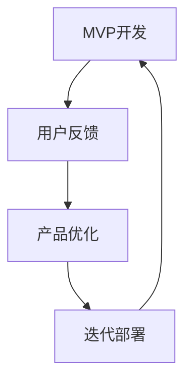
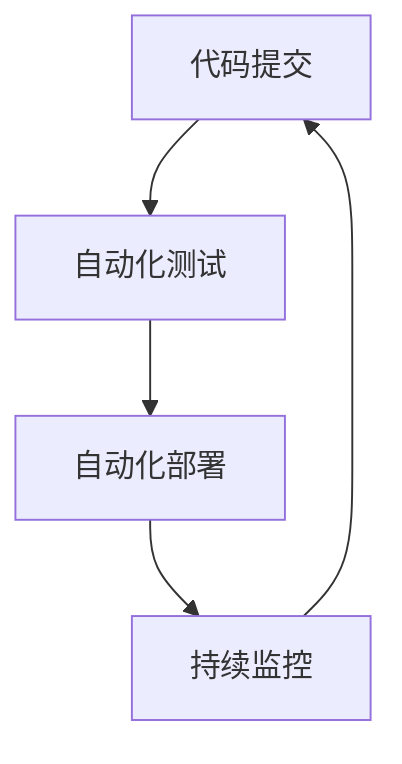

                 


## 文章标题：精益创业：验证AI产品市场契合度的策略

### 关键词：
- 精益创业
- AI产品
- 市场契合度
- MVP
- 敏捷开发

### 摘要：
本文探讨了如何通过精益创业方法验证AI产品的市场契合度。首先，介绍了精益创业的概念和核心方法论，然后详细阐述了评估AI产品市场契合度的方法，包括市场研究和用户反馈。接着，文章讲解了AI产品迭代策略，包括敏捷开发和持续交付。通过实际案例分析和详细讲解，文章提供了实用的指导和建议，帮助读者在AI产品开发中实现成功。

## 引言：精益创业与AI产品市场契合度

### 精益创业的概念
精益创业（Lean Startup）是一种创业方法论，由埃里克·莱斯（Eric Ries）在其同名书籍《精益创业》中提出。精益创业的核心思想是通过构建最小可行性产品（MVP，Minimum Viable Product）来验证市场假设，并快速迭代产品，以最小的资源投入实现最大的市场价值。

### AI产品市场契合度的重要性
在AI领域，产品的市场契合度尤为重要。AI技术发展迅速，市场变化快，用户需求多变。因此，验证AI产品是否满足市场需求，能否被市场接受，对于产品成功至关重要。

### 为什么选择精益创业方法
精益创业方法适用于AI产品开发的原因有以下几点：

1. **快速验证假设**：通过MVP快速验证市场假设，减少时间和资源的浪费。
2. **迭代优化**：根据市场反馈不断迭代产品，提高产品竞争力。
3. **降低风险**：通过早期验证，降低产品失败的风险。
4. **用户为中心**：始终以用户需求为导向，确保产品具有市场价值。

### 本书的目标和结构
本书旨在通过精益创业方法论，帮助读者验证AI产品的市场契合度。本书将分为七个章节：

1. 引言：介绍精益创业和AI产品市场契合度的重要性。
2. 精益创业方法论：详细讲解精益创业的核心概念、步骤和方法。
3. AI产品市场契合度的评估：介绍如何评估AI产品的市场契合度。
4. AI产品迭代策略：讲解如何根据市场反馈迭代AI产品。
5. 成功案例分享：分享成功的AI产品市场验证案例。
6. 挑战与解决方案：分析AI产品市场验证过程中可能遇到的挑战和解决方案。
7. 结论：总结全书内容，展望未来AI产品市场验证的趋势。

## 精益创业方法论

### 核心概念
精益创业方法论的核心概念包括：

1. **MVP（最小可行性产品）**：构建具有核心功能的产品原型，以验证市场需求。
2. **验证-学习循环**：通过市场验证不断学习和优化产品。
3. **用户反馈**：收集用户反馈，了解产品是否符合市场需求。
4. **敏捷开发**：快速迭代产品，确保产品始终符合市场需求。

### 步骤
精益创业的步骤包括：

1. **发现客户需求**：通过市场研究和用户访谈，了解目标用户的需求。
2. **构建MVP**：设计并开发MVP，验证市场假设。
3. **验证市场需求**：通过用户反馈和市场表现，验证MVP是否符合市场需求。
4. **迭代优化**：根据验证结果，对产品进行优化和迭代。
5. **持续交付**：确保产品始终符合市场需求，并持续交付价值。

### 工具和技巧
精益创业过程中，常用的工具和技巧包括：

1. **用户访谈**：深入了解用户需求和行为。
2. **问卷调查**：收集大量用户反馈，了解市场趋势。
3. **A/B测试**：通过对比不同版本的产品，优化产品功能。
4. **数据分析**：分析用户行为数据，了解产品表现。
5. **敏捷开发**：快速迭代产品，确保产品始终符合市场需求。

## AI产品市场契合度的评估

### 市场研究的方法
市场研究是评估AI产品市场契合度的第一步。以下是一些常用的市场研究方法：

1. **用户访谈**：通过面对面或在线访谈，了解目标用户的需求和行为。
2. **问卷调查**：通过在线或纸质问卷，收集大量用户反馈。
3. **行业分析**：研究行业趋势、竞争对手和市场机会。
4. **数据分析**：分析用户数据，了解市场潜力和用户行为。

### 用户反馈的收集与分析
用户反馈是评估AI产品市场契合度的关键。以下是一些有效的用户反馈收集和分析方法：

1. **用户访谈**：通过面对面或在线访谈，了解用户对产品的真实感受和需求。
2. **问卷调查**：通过在线或纸质问卷，收集大量用户反馈，分析用户满意度、使用频率和改进建议。
3. **A/B测试**：通过对比不同版本的产品，了解用户偏好和产品表现。
4. **数据分析**：分析用户行为数据，了解产品使用情况、用户留存率和流失原因。

### AI产品市场契合度的评估指标
评估AI产品市场契合度，需要关注以下指标：

1. **用户满意度**：通过用户问卷调查和访谈，了解用户对产品的满意度。
2. **市场份额**：分析产品在目标市场的占有率，了解产品在市场中的竞争力。
3. **用户留存率**：通过用户行为数据，了解用户对产品的忠诚度。
4. **用户活跃度**：通过用户行为数据，了解用户对产品的使用频率。
5. **收益和成本**：分析产品的收益和成本，了解产品的盈利能力。

## AI产品迭代策略

### 敏捷开发
敏捷开发（Agile Development）是一种快速迭代的产品开发方法，适用于AI产品开发。以下是一些敏捷开发的关键原则：

1. **用户为中心**：始终以用户需求为导向，确保产品始终符合市场需求。
2. **快速迭代**：通过短期迭代，快速交付产品功能，持续优化产品。
3. **持续集成**：确保产品始终处于可用状态，降低集成风险。
4. **持续交付**：通过自动化部署，确保产品快速交付到用户手中。

### 持续交付
持续交付（Continuous Delivery）是一种自动化部署方法，确保产品能够快速、安全地交付到用户手中。以下是一些持续交付的关键步骤：

1. **自动化测试**：通过自动化测试，确保产品功能和质量。
2. **自动化部署**：通过自动化部署，减少人工干预，提高部署效率。
3. **容器化**：使用容器技术，确保产品在不同环境中的兼容性。
4. **持续监控**：通过持续监控，及时发现和解决问题。

### 如何根据反馈迭代AI产品
根据市场反馈迭代AI产品，需要关注以下方面：

1. **用户反馈**：及时收集用户反馈，了解产品存在的问题和改进空间。
2. **数据分析**：分析用户行为数据，了解产品表现和用户需求。
3. **迭代计划**：根据反馈和数据分析，制定迭代计划，确保产品持续优化。
4. **快速部署**：通过敏捷开发和持续交付，快速部署迭代产品。

### 案例分享：某公司AI产品的迭代过程
以下是一个AI产品迭代过程的案例：

1. **MVP阶段**：公司发布了MVP版本，仅包含核心功能，以验证市场需求。
2. **用户反馈**：通过用户访谈和问卷调查，收集了大量用户反馈，了解到产品的一些功能需求。
3. **迭代计划**：根据用户反馈，制定了迭代计划，包括优化界面、增加新功能等。
4. **迭代部署**：通过敏捷开发和持续交付，快速迭代产品，每次迭代周期为两周。
5. **用户反馈**：在每次迭代后，收集用户反馈，持续优化产品。
6. **持续改进**：根据用户反馈和数据分析，不断优化产品，提高用户满意度。

## 挑战与解决方案

### 挑战一：如何处理市场反馈的滞后性
市场反馈可能存在滞后性，影响产品迭代速度。以下是一些解决方案：

1. **预测分析**：通过数据分析，预测未来用户需求，提前进行产品优化。
2. **快速响应**：建立快速响应机制，及时处理用户反馈，减少反馈滞后。
3. **优先级排序**：根据用户反馈的重要性和紧急性，优先处理关键问题。

### 挑战二：如何在资源有限的情况下进行市场验证
资源有限时，市场验证可能受限。以下是一些解决方案：

1. **精益验证**：采用精益验证方法，通过最小成本验证市场假设。
2. **合作伙伴**：寻求合作伙伴，共享资源，共同进行市场验证。
3. **众筹**：通过众筹方式，吸引投资者，为市场验证提供资金支持。

### 挑战三：如何确保AI产品的市场契合度
确保AI产品的市场契合度，需要关注以下方面：

1. **市场研究**：深入了解目标市场，了解用户需求和竞争对手。
2. **用户反馈**：及时收集用户反馈，了解产品是否符合用户需求。
3. **持续优化**：根据市场反馈和数据分析，持续优化产品，提高市场契合度。

## 结论

### 精益创业在AI产品开发中的应用
精益创业方法在AI产品开发中具有重要意义，通过快速验证市场假设、敏捷开发和持续交付，可以提高产品成功率，降低开发风险。

### 对未来AI产品市场契合度验证的趋势和展望
未来，随着AI技术的发展，市场环境将更加复杂多变。因此，AI产品市场契合度验证将更加重要。以下是一些趋势和展望：

1. **数据驱动**：通过大数据和人工智能技术，实现更准确的市场预测和产品优化。
2. **用户体验**：以用户体验为中心，不断提高产品满意度。
3. **跨界融合**：跨行业、跨领域的合作，实现资源共享和优势互补。
4. **持续创新**：持续进行产品创新，满足不断变化的市场需求。

### 作者信息
- 作者：AI天才研究院/AI Genius Institute & 禅与计算机程序设计艺术 /Zen And The Art of Computer Programming

### 拓展阅读
- 《精益创业》：埃里克·莱斯（Eric Ries）著，详细介绍了精益创业方法论。
- 《用户体验要素》：雅各布·尼尔森（Jakob Nielsen）著，探讨了用户体验的重要性。
- 《敏捷开发实践指南》：杰姆·马丁（Jam Martin）著，介绍了敏捷开发的方法和实践。

## 附录：相关流程图和代码示例

### AI产品迭代流程图


### 持续交付流程图


### 用户反馈收集代码示例
```python
import requests
import json

def collect_user_feedback():
    url = "https://api.example.com/feedback"
    headers = {
        "Authorization": "Bearer your_token",
        "Content-Type": "application/json"
    }
    data = {
        "user_id": "12345",
        "feedback": "This product is great!"
    }
    response = requests.post(url, headers=headers, data=json.dumps(data))
    if response.status_code == 200:
        print("Feedback collected successfully.")
    else:
        print("Failed to collect feedback.")

collect_user_feedback()
```

### 持续交付代码示例
```python
import requests
import json

def deploy_to_production():
    url = "https://api.example.com/deploy"
    headers = {
        "Authorization": "Bearer your_token",
        "Content-Type": "application/json"
    }
    data = {
        "version": "1.0.0",
        "description": "Updated user interface."
    }
    response = requests.post(url, headers=headers, data=json.dumps(data))
    if response.status_code == 200:
        print("Deployment successful.")
    else:
        print("Deployment failed.")

deploy_to_production()
```

### 最佳实践 Tips
- 定期进行市场研究和用户访谈，了解市场动态和用户需求。
- 建立敏捷开发团队，确保产品迭代速度和质量。
- 采用持续交付流程，提高产品交付效率。
- 关注用户反馈，及时调整产品方向。

### 注意事项
- 避免过度依赖市场预测，确保产品始终以用户需求为导向。
- 充分了解竞争对手，确保产品具有竞争力。
- 在迭代过程中，保持团队沟通和协作，确保产品顺利进行。

### 拓展阅读
- 《AI产品设计实战》：介绍了AI产品设计的最佳实践和方法。
- 《人工智能与商业策略》：探讨了人工智能在商业中的应用和策略。

以上是《精益创业：验证AI产品市场契合度的策略》的完整文章，包括引言、精益创业方法论、AI产品市场契合度评估、迭代策略、挑战与解决方案、结论以及附录。希望本文能够帮助读者深入了解AI产品市场验证的方法和策略，为实际应用提供指导。

