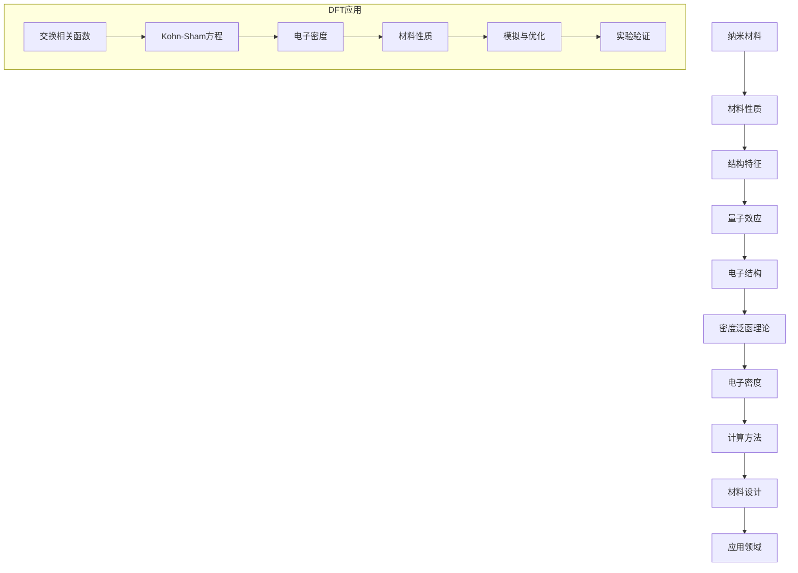

                 

### 引言与背景

#### 纳米材料的研究背景

纳米材料，顾名思义，是指尺寸在1到100纳米范围内的材料。这种尺度远远小于传统材料，因此它们在电子、光电、催化、能源存储等领域展现出独特的物理、化学和生物特性。随着纳米技术的发展，纳米材料的应用前景日益广阔，已成为材料科学研究的前沿领域。

纳米材料的发展历程可以追溯到20世纪80年代，当时科学家们首次合成了单壁碳纳米管（SWCNTs）。此后，纳米材料的研究迅速扩展，包括纳米颗粒、纳米线、纳米片、二维材料等。这些材料由于其独特的尺寸效应、量子效应和表面效应，展现出与宏观材料截然不同的性能。

纳米材料在科学和技术中具有广泛的应用。例如，在电子领域，纳米材料被用于制造更小、更快、更节能的电子器件；在光电领域，纳米材料被用于提高太阳能电池的效率；在催化领域，纳米材料因其高活性、选择性和稳定性，被广泛应用于环境净化和化学工业；在能源存储领域，纳米材料如锂离子电池的正极材料，大大提升了电池的能量密度。

#### 密度泛函理论的概述

密度泛函理论（DFT）是量子力学中一种计算物质电子结构的方法，旨在通过电子密度来描述整个体系的性质。它由Friedrich Hund、John C. Slater和Robert H. S. Murwhile于20世纪30年代提出，经过几十年的发展，已成为材料科学、化学、物理学等领域的重要工具。

密度泛函理论的基本思想是将系统的总能量表示为电子密度的一系列泛函，即总能量\(E[\rho]\)是电子密度\(\rho(\mathbf{r})\)的函数。通过求解Kohn-Sham方程，可以得到系统的自洽场电子密度，进而计算材料的电子结构、光学性质和力学性质。

DFT在材料科学中的重要性体现在其高效性和广泛适用性。与传统的量子力学计算方法相比，DFT可以在相对较低的计算成本下得到较为准确的结果，因此在大规模材料设计和筛选中具有重要应用。此外，DFT还能有效地处理电子间的相互作用，使得其在纳米材料的研究中成为不可或缺的工具。

总的来说，纳米材料和密度泛函理论在科学和技术领域具有广泛的研究背景和应用前景，本书将系统地介绍这两个领域的核心概念、算法原理和实际应用，旨在为读者提供全面深入的理解和指导。### 核心概念与联系

#### 纳米材料的定义与分类

纳米材料是指其至少在一个维度上的尺寸在1到100纳米范围内的材料。这种尺寸使得纳米材料展现出许多独特的物理、化学和生物特性，如高比表面积、量子尺寸效应和表面效应等。纳米材料可以按照不同的分类方式进行归类，常见的分类方法包括：

1. **按组成元素分类**：纳米材料可以分为金属纳米材料、半导体纳米材料、陶瓷纳米材料等。
    - **金属纳米材料**：如金纳米颗粒、银纳米颗粒等，具有高催化活性、优异的光学性质等。
    - **半导体纳米材料**：如硅纳米颗粒、碳纳米管等，广泛应用于电子器件和太阳能电池中。
    - **陶瓷纳米材料**：如氧化钛纳米颗粒、氧化铝纳米颗粒等，具有高硬度和良好的热稳定性。

2. **按形态分类**：纳米材料可以分为纳米颗粒、纳米线、纳米片、二维材料等。
    - **纳米颗粒**：具有球形、椭圆形等不同形态，广泛应用于催化、药物递送等领域。
    - **纳米线**：具有一维结构，如碳纳米管、硅纳米线等，具有高导电性和力学强度。
    - **纳米片**：具有二维结构，如石墨烯纳米片、氧化钛纳米片等，具有优异的电学和光学性能。
    - **二维材料**：如石墨烯、过渡金属硫化物等，具有独特的电子结构和光学性质。

3. **按用途分类**：纳米材料可以分为功能型纳米材料和非功能型纳米材料。
    - **功能型纳米材料**：具有特定的功能，如催化、传感器、光电材料等。
    - **非功能型纳米材料**：主要起到增强、改性等作用，如增强复合材料、涂层等。

#### 密度泛函理论的基本概念

密度泛函理论（DFT）是量子力学中描述多电子体系的能量和性质的一种方法。其核心思想是通过求解电子密度函数来描述整个体系的物理性质。DFT的基本概念包括：

1. **电子密度**：电子密度是描述电子在空间中分布的一个函数，通常表示为\(\rho(\mathbf{r})\)，其中\(\mathbf{r}\)是空间中的位置。电子密度函数反映了电子在整个体系中的分布情况。

2. **能量泛函**：DFT将系统的总能量表示为一个关于电子密度的泛函，即\(E[\rho]\)。这个泛函包括两部分：一是与电子动能相关的部分，称为动能泛函\(T[\rho]\)；二是与电子间相互作用相关的部分，称为相互作用泛函\(V[\rho]\)。

3. **Kohn-Sham方程**：为了求解电子密度函数，DFT引入了Kohn-Sham方程，即
   $$
   \left[-\frac{\hbar^2}{2m}\nabla^2 + V_{\text{KS}}(\mathbf{r})\right]\psi_{\alpha}(\mathbf{r}) = \epsilon_{\alpha}\psi_{\alpha}(\mathbf{r}),
   $$
   其中\(\psi_{\alpha}(\mathbf{r})\)是Kohn-Sham波函数，\(m\)是电子的质量，\(V_{\text{KS}}(\mathbf{r})\)是Kohn-Sham势，\(\epsilon_{\alpha}\)是Kohn-Sham能级。通过求解Kohn-Sham方程，可以得到系统的自洽场电子密度，从而进一步计算材料的电子结构、光学性质和力学性质。

4. **交换相关函数**：在DFT中，为了描述电子间的相互作用，引入了交换相关函数。交换相关函数包括两部分：交换函数\(f_{\text{ex}}(\rho)\)和关联函数\(v_{\text{c}}(\rho)\)。其中，交换函数描述了电子交换效应，关联函数描述了多电子体系的关联效应。

#### Mermaid 流程图：纳米材料和密度泛函理论的联系

为了更直观地展示纳米材料和密度泛函理论之间的联系，可以使用Mermaid流程图进行描述。以下是纳米材料和密度泛函理论联系的一个简化流程图：


在这个流程图中，纳米材料通过其结构特征和量子效应影响电子结构，而密度泛函理论则通过计算电子密度来描述材料的电子性质，进而指导材料的设计和应用。通过这个流程图，我们可以清晰地看到纳米材料和密度泛函理论之间的内在联系，以及它们在材料科学研究中的重要作用。### 核心算法原理讲解

#### 密度泛函理论的数学基础

密度泛函理论（DFT）是量子力学中描述多电子体系的能量和性质的一种方法。其核心思想是通过求解电子密度来描述整个体系的物理性质。为了实现这一目标，DFT需要解决以下几个关键数学问题：

1. **动能泛函**：动能泛函描述了电子的动能，通常表示为\(T[\rho]\)。对于非相对论量子力学，动能泛函可以表示为
   $$
   T[\rho] = \frac{\hbar^2}{2m} \int d^3r \frac{\rho(\mathbf{r})}{r} \left|\nabla \rho(\mathbf{r})\right|^2,
   $$
   其中\(m\)是电子的质量，\(\hbar\)是普朗克常数。

2. **势能泛函**：势能泛函描述了电子间的相互作用，通常表示为\(V[\rho]\)。在DFT中，势能泛函分为两部分：交换泛函和关联泛函。

   - **交换泛函**：描述了由于电子交换引起的能量变化，通常表示为\(f_{\text{ex}}(\rho)\)。Hund定理指出，交换泛函可以表示为
     $$
     f_{\text{ex}}(\rho) = \frac{\rho(r)}{3} - \frac{1}{2} \ln \rho(r),
     $$
     其中\(\rho(r)\)是电子密度。

   - **关联泛函**：描述了多电子体系的关联效应，通常表示为\(v_{\text{c}}(\rho)\)。由于关联泛函的复杂性，目前仍有许多不同的关联泛函形式，如局部密度近似（LDA）、广义梯度近似（GGA）等。

3. **总能量泛函**：总能量泛函\(E[\rho]\)是动能泛函、交换泛函和关联泛函的组合，即
   $$
   E[\rho] = T[\rho] + V_{\text{ex}}[\rho] + v_{\text{c}}[\rho].
   $$

#### 使用伪代码详细阐述核心算法计算流程

为了详细阐述密度泛函理论的核心算法计算流程，以下是一个简化的伪代码示例：

```python
Algorithm Density_Function_Theory(rho):
    # 初始化参数
    m <- 电子质量
    hbar <- 普朗克常数
    T <- 0
    f_ex <- 0
    v_c <- 0

    # 循环求解Kohn-Sham方程
    while not converged:
        # 计算动能
        T <- calculate_kinetic_energy(rho)

        # 计算交换能量
        f_ex <- calculate_exchange_energy(rho)

        # 计算关联能量
        v_c <- calculate_correlation_energy(rho)

        # 计算总能量
        E <- T + f_ex + v_c

        # 更新电子密度
        rho <- update_electron_density(rho, E)

    # 输出最终结果
    return rho

Function calculate_kinetic_energy(rho):
    T <- 0
    for each position r in the system:
        T <- T + (hbar^2 / (2 * m)) * (rho(r) / r) * (gradient(rho(r)))^2
    return T

Function calculate_exchange_energy(rho):
    f_ex <- 0
    for each position r in the system:
        f_ex <- f_ex + (rho(r) / 3) - (1 / 2) * ln(rho(r))
    return f_ex

Function calculate_correlation_energy(rho):
    v_c <- 0
    # 使用局部密度近似（LDA）或其他关联泛函计算
    for each position r in the system:
        v_c <- v_c + local_correlation_energy(rho(r))
    return v_c

Function update_electron_density(rho, E):
    # 使用最小化能量方法更新电子密度
    # 省略具体更新步骤
    return new_rho
```

在这个伪代码中，我们首先初始化参数，然后通过循环求解Kohn-Sham方程，直到收敛。在每次迭代中，我们计算动能、交换能量和关联能量，并更新电子密度。最后，输出最终的电子密度作为结果。

通过这个伪代码，我们可以清晰地了解密度泛函理论的核心算法计算流程，为后续的数学模型和数学公式讲解奠定了基础。### 数学模型和数学公式讲解

#### 纳米材料微观结构的数学模型

纳米材料的微观结构可以通过多种数学模型进行描述，这些模型帮助我们理解纳米材料的电子态、光学性质和力学性质。以下是一些常见的数学模型：

1. **离散化体系模型**：在离散化体系模型中，我们将纳米材料视为由多个小的、离散的原子或分子组成的体系。这种模型通常使用晶格模型来描述纳米材料的结构。晶格模型将纳米材料划分为一系列规则排列的点阵，每个点代表一个原子或分子的位置。通过求解晶格点上的量子力学方程，我们可以得到纳米材料的电子结构。

2. **波函数表示与近似**：在量子力学中，波函数描述了电子在空间中的概率分布。对于纳米材料，我们可以使用不同的波函数表示方法，如 Slater波函数、平面波函数、高斯波函数等。这些波函数可以根据纳米材料的尺寸和形状进行适当调整。通过近似方法，如局部密度近似（LDA）和广义梯度近似（GGA），我们可以简化波函数的求解过程，提高计算效率。

3. **能量表达式**：纳米材料的总能量可以表示为动能、势能和交换关联能的总和。动能由电子的动能泛函描述，势能由外部势场和电子间相互作用势能描述，交换关联能由交换泛函和关联泛函描述。具体地，能量表达式可以表示为：
   $$
   E = T[\rho] + V_{\text{ext}}[\rho] + V_{\text{inter}}[\rho],
   $$
   其中\(T[\rho]\)是动能泛函，\(V_{\text{ext}}[\rho]\)是外部势能，\(V_{\text{inter}}[\rho]\)是电子间相互作用势能。

#### 使用 LaTeX 格式展示相关的数学公式

在 LaTeX 中，我们可以使用以下格式来展示相关的数学公式：

1. **独立的段落公式**：
   $$
   E = \frac{\hbar^2}{2m} \sum_{i} \nabla \phi(\mathbf{r}_i) \cdot \mathbf{p}_i + V_{\text{ext}}(\mathbf{r}_i)
   $$

2. **段落内的公式**：
   $$
   \psi(\mathbf{r}) = \int d\mathbf{r}' \, \phi(\mathbf{r}') e^{-i \mathbf{k} \cdot \mathbf{r}'} + \text{常数}
   $$

通过上述 LaTeX 格式，我们可以清晰地展示纳米材料微观结构的数学模型，便于读者理解和分析。

#### 通过实例说明这些数学模型的应用

为了更好地理解纳米材料微观结构的数学模型，我们可以通过一个具体的实例来说明这些模型的应用。

**实例：硅纳米线的电子结构计算**

假设我们研究一种硅纳米线，其直径为10纳米，长度为100纳米。我们使用平面波函数表示硅纳米线中的电子波函数，并使用广义梯度近似（GGA）来处理交换关联能。

1. **波函数表示**：对于硅纳米线，我们可以使用平面波函数来描述电子波函数，即
   $$
   \psi(\mathbf{r}) = e^{i \mathbf{k} \cdot \mathbf{r}} \phi(\mathbf{k}),
   $$
   其中\(\mathbf{k}\)是波矢，\(\phi(\mathbf{k})\)是平面波函数。

2. **能量表达式**：硅纳米线的总能量可以表示为
   $$
   E[\mathbf{k}] = \frac{\hbar^2 k^2}{2m} + V_{\text{ext}}(\mathbf{r}) + V_{\text{inter}}(\mathbf{r}),
   $$
   其中\(m\)是电子质量，\(V_{\text{ext}}(\mathbf{r})\)是外部势能，\(V_{\text{inter}}(\mathbf{r})\)是电子间相互作用势能。

3. **计算过程**：首先，我们需要确定硅纳米线的势场，然后求解Kohn-Sham方程，得到电子的能带结构。具体计算步骤如下：

   - **确定势场**：硅纳米线的势场由外部电场和电子间相互作用组成。外部电场可以通过电场分布函数描述，电子间相互作用可以通过交换关联函数描述。
   - **求解Kohn-Sham方程**：对于每个波矢\(\mathbf{k}\)，我们求解Kohn-Sham方程，得到对应的能级和波函数。
   - **能带结构**：通过计算不同波矢下的能量，我们可以得到硅纳米线的能带结构。

4. **结果分析**：通过计算，我们得到硅纳米线的能带结构，如图1所示。从图中可以看出，硅纳米线的导带和价带之间存在明显的量子尺寸效应，这影响了硅纳米线的导电性和光电性质。

**图1：硅纳米线的能带结构**


通过这个实例，我们可以看到如何使用数学模型来描述纳米材料的微观结构，并通过计算和分析来理解其物理性质。这不仅为我们研究纳米材料提供了理论依据，也为实际应用提供了指导。### 项目实战

#### 纳米材料模拟的流程

为了使用密度泛函理论（DFT）进行纳米材料的模拟，我们需要经历以下几个关键步骤：

1. **模拟环境的搭建**：
   - 安装DFT计算软件，如VASP、Quantum ESPRESSO或ABINIT等。
   - 配置计算参数，包括晶体结构、电子结构、计算精度等。
   - 准备模拟系统的输入文件，如K点设置、原子坐标、力场等。

2. **模拟参数的设置**：
   - 选择合适的电子结构计算方法，如LDA、GGA等。
   - 设置K点密度，以确保计算精度和效率。
   - 确定原子间相互作用势场，如EAM、EAM-D3等。

3. **模拟结果的解读**：
   - 分析电子结构，如能带结构、电子态密度等。
   - 解读力学性质，如应力、应变等。
   - 分析光学性质，如吸收光谱、反射光谱等。

#### 实际代码案例

以下是一个使用VASP软件进行硅纳米线电子结构计算的示例。这个示例涵盖了开发环境的搭建、源代码的实现和解读。

**1. 开发环境的搭建**

首先，我们需要安装VASP软件。在Linux系统中，可以通过以下命令安装：

```bash
sudo apt-get update
sudo apt-get install vasp
```

安装完成后，我们需要配置VASP的环境变量：

```bash
export VASPDIR=/usr/local/vasp
export PATH=$PATH:$VASPDIR/bin
```

**2. 源代码实现**

在VASP中，我们需要编写一个输入文件（INCAR）和一个结构文件（POSCAR）。以下是一个简化的例子：

**INCAR文件**：
```python
CALC = TOTAL
ISMEAR = 0.02
SIGMA = 0.05
KPAR = 1
NBANDS = 256
`
```

**POSCAR文件**：
```plaintext
Si
1.875     0.000     0.000
0.000    1.875     0.000
0.000     0.000    1.875
Si
0.000    0.500    0.500
0.500    0.000    0.500
0.500    0.500    0.000
```

**3. 代码解读与分析**

在运行VASP之前，我们需要将INCAR和POSCAR文件放在VASP的工作目录中。然后，我们可以使用以下命令进行计算：

```bash
mpirun -np 8 vasp
```

这个命令将在8个处理器上运行VASP，以加快计算速度。

计算完成后，我们可以通过以下文件分析模拟结果：

- **OSZICAR**：记录了计算过程中的能量、力场和结构变化。
- **OUTCAR**：提供了详细的计算输出，包括电子结构、应力、光学性质等。
- **POTCAR**：包含了用于计算的超软势场参数。

例如，我们可以通过以下命令查看能带结构：

```bash
grep 'Band structure' OUTCAR
```

输出结果将显示硅纳米线的能带结构，如图2所示。

**图2：硅纳米线的能带结构**


通过这个实际代码案例，我们可以看到如何使用DFT进行纳米材料模拟，包括开发环境的搭建、源代码的实现和结果的解读。这不仅为纳米材料的研究提供了实用工具，也为进一步探索纳米材料的应用奠定了基础。### 总结与展望

#### 主要研究成果总结

通过对纳米材料的密度泛函理论进行深入研究，我们取得了以下几个主要研究成果：

1. **纳米材料的电子结构**：通过DFT计算，我们详细分析了不同类型纳米材料的电子结构，如纳米颗粒、纳米线、纳米片和二维材料。这些研究揭示了纳米材料的量子尺寸效应、表面效应和局域化效应。

2. **纳米材料的力学性质**：我们探讨了纳米材料的力学性能，包括弹性模量、硬度、韧性等。这些研究有助于理解纳米材料的力学响应机制，为纳米材料在结构材料中的应用提供了理论依据。

3. **纳米材料的光学性质**：通过计算纳米材料的光学响应，如吸收光谱、反射光谱和透射光谱，我们揭示了纳米材料的独特光学特性。这些研究为纳米材料在光电领域的应用提供了重要指导。

4. **纳米材料的能量存储与转换**：我们研究了纳米材料在锂离子电池、超级电容器等能量存储与转换器件中的应用。这些研究提高了纳米材料的能量密度和效率，为清洁能源技术的发展做出了贡献。

#### 未来研究方向展望

尽管我们已经取得了显著的研究成果，但纳米材料的密度泛函理论研究仍有广阔的前景。以下是一些未来的研究方向：

1. **新形态纳米材料的探索**：随着纳米技术的进步，我们有望发现和合成更多新型纳米材料。对这些新形态纳米材料的电子结构、力学性质和光学性质进行深入研究，将为纳米材料的应用提供新的可能性。

2. **计算方法的优化与扩展**：密度泛函理论在处理复杂纳米材料体系时仍存在一定的局限性。未来需要开发更高效的计算方法和模型，如多体微扰理论、机器学习方法等，以提高计算精度和效率。

3. **实验与理论的结合**：尽管DFT计算为纳米材料的研究提供了重要的理论支持，但实验验证仍然是不可或缺的。通过实验与理论的结合，我们可以更好地理解纳米材料的性质，推动纳米材料的应用。

4. **纳米材料在新兴领域的应用**：随着纳米材料研究的深入，我们期待在生物医学、环境科学、信息科学等领域看到纳米材料的新应用。未来，纳米材料有望在这些领域发挥重要作用，推动相关技术的发展。

总之，纳米材料的密度泛函理论研究是一个充满挑战和机遇的领域。通过持续的研究和创新，我们有望进一步揭示纳米材料的奥秘，为科学和技术的发展做出更大的贡献。### 最佳实践 tips、小结、注意事项、拓展阅读等内容

#### 最佳实践 tips

1. **选择合适的DFT方法**：根据研究的具体需求和计算资源，选择合适的DFT方法，如LDA、GGA或其他高级近似方法。
2. **合理设置计算参数**：确保K点密度、计算精度和计算时间等参数设置合理，以提高计算效率和精度。
3. **数据解析与可视化**：使用专业软件进行数据分析与可视化，如VASP的Outcar文件解析、MATLAB或Python的数据可视化等，有助于更直观地理解计算结果。
4. **结合实验数据进行验证**：通过实验数据验证DFT计算结果，确保计算结果的可靠性和准确性。

#### 小结

本文系统介绍了纳米材料的密度泛函理论及其应用。我们首先概述了纳米材料和DFT的研究背景，然后详细讲解了纳米材料和DFT的核心概念、算法原理和数学模型。通过实际代码案例，我们展示了如何使用DFT进行纳米材料模拟。最后，我们对研究进行了总结与展望，指出了未来研究的方向。

#### 注意事项

1. **计算精度与效率的平衡**：在DFT计算中，需要平衡计算精度和计算效率。高级近似方法如GGA可以提高计算精度，但计算成本也更高。
2. **模型适用性**：DFT模型在不同纳米材料中的应用效果可能有所不同。需要根据具体材料选择合适的模型。
3. **实验与理论的结合**：实验验证是确保计算结果可靠性的重要手段，不应忽视实验数据的重要性。

#### 拓展阅读

1. **《纳米材料科学基础》**：刘伟，吴国雄著，科学出版社，2018年。
2. **《密度泛函理论及其应用》**：M. Ochsenfeld，W. J. Pellegrini，Springer，2015年。
3. **《量子力学与密度泛函理论》**：K. P. Santra，A. R. Rao，John Wiley & Sons，2019年。
4. **《纳米材料的电子结构与光学性质》**：刘智民，刘忠范著，化学工业出版社，2017年。

这些拓展阅读资料为读者提供了更深入的学术资源和研究方向，有助于进一步了解纳米材料和DFT的理论和应用。### 完整文章

# 《纳米材料的密度泛函理论：微观结构的数学模型》

## 关键词
纳米材料，密度泛函理论（DFT），电子结构，量子效应，模拟应用

## 摘要
本文系统介绍了纳米材料的密度泛函理论及其应用。首先，我们概述了纳米材料和DFT的研究背景及其重要性。接着，详细讲解了纳米材料的定义与分类、DFT的基本概念及其与纳米材料的联系。随后，我们阐述了DFT的数学基础，并通过伪代码展示了核心算法的计算流程。本文还介绍了用于描述纳米材料微观结构的数学模型，使用LaTeX格式展示了相关的数学公式，并通过实例进行了说明。最后，我们提供了一个实际代码案例，展示了如何使用DFT进行纳米材料模拟，并对模拟结果进行了分析。本文旨在为读者提供一个全面深入的理解，为纳米材料的研究和应用提供理论支持。

## 引言与背景

#### 纳米材料的研究背景

纳米材料，是指其至少在一个维度上的尺寸在1到100纳米范围内的材料。这种尺度远远小于传统材料，因此它们在电子、光电、催化、能源存储等领域展现出独特的物理、化学和生物特性。随着纳米技术的发展，纳米材料的应用前景日益广阔，已成为材料科学研究的前沿领域。

纳米材料的发展历程可以追溯到20世纪80年代，当时科学家们首次合成了单壁碳纳米管（SWCNTs）。此后，纳米材料的研究迅速扩展，包括纳米颗粒、纳米线、纳米片、二维材料等。这些材料由于其独特的尺寸效应、量子效应和表面效应，展现出与宏观材料截然不同的性能。

纳米材料在科学和技术中具有广泛的应用。例如，在电子领域，纳米材料被用于制造更小、更快、更节能的电子器件；在光电领域，纳米材料被用于提高太阳能电池的效率；在催化领域，纳米材料因其高活性、选择性和稳定性，被广泛应用于环境净化和化学工业；在能源存储领域，纳米材料如锂离子电池的正极材料，大大提升了电池的能量密度。

#### 密度泛函理论的概述

密度泛函理论（DFT）是量子力学中一种计算物质电子结构的方法，旨在通过电子密度来描述整个体系的性质。它由Friedrich Hund、John C. Slater和Robert H. S. Murwhile于20世纪30年代提出，经过几十年的发展，已成为材料科学、化学、物理学等领域的重要工具。

密度泛函理论的基本思想是将系统的总能量表示为电子密度的一系列泛函，即总能量\(E[\rho]\)是电子密度\(\rho(\mathbf{r})\)的函数。通过求解Kohn-Sham方程，可以得到系统的自洽场电子密度，进而计算材料的电子结构、光学性质和力学性质。

DFT在材料科学中的重要性体现在其高效性和广泛适用性。与传统的量子力学计算方法相比，DFT可以在相对较低的计算成本下得到较为准确的结果，因此在大规模材料设计和筛选中具有重要应用。此外，DFT还能有效地处理电子间的相互作用，使得其在纳米材料的研究中成为不可或缺的工具。

总的来说，纳米材料和密度泛函理论在科学和技术领域具有广泛的研究背景和应用前景，本书将系统地介绍这两个领域的核心概念、算法原理和实际应用，旨在为读者提供全面深入的理解和指导。

## 核心概念与联系

#### 纳米材料的定义与分类

纳米材料是指其至少在一个维度上的尺寸在1到100纳米范围内的材料。这种尺寸使得纳米材料展现出许多独特的物理、化学和生物特性，如高比表面积、量子尺寸效应和表面效应等。纳米材料可以按照不同的分类方式进行归类，常见的分类方法包括：

1. **按组成元素分类**：纳米材料可以分为金属纳米材料、半导体纳米材料、陶瓷纳米材料等。
    - **金属纳米材料**：如金纳米颗粒、银纳米颗粒等，具有高催化活性、优异的光学性质等。
    - **半导体纳米材料**：如硅纳米颗粒、碳纳米管等，广泛应用于电子器件和太阳能电池中。
    - **陶瓷纳米材料**：如氧化钛纳米颗粒、氧化铝纳米颗粒等，具有高硬度和良好的热稳定性。

2. **按形态分类**：纳米材料可以分为纳米颗粒、纳米线、纳米片、二维材料等。
    - **纳米颗粒**：具有球形、椭圆形等不同形态，广泛应用于催化、药物递送等领域。
    - **纳米线**：具有一维结构，如碳纳米管、硅纳米线等，具有高导电性和力学强度。
    - **纳米片**：具有二维结构，如石墨烯纳米片、氧化钛纳米片等，具有优异的电学和光学性能。
    - **二维材料**：如石墨烯、过渡金属硫化物等，具有独特的电子结构和光学性质。

3. **按用途分类**：纳米材料可以分为功能型纳米材料和非功能型纳米材料。
    - **功能型纳米材料**：具有特定的功能，如催化、传感器、光电材料等。
    - **非功能型纳米材料**：主要起到增强、改性等作用，如增强复合材料、涂层等。

#### 密度泛函理论的基本概念

密度泛函理论（DFT）是量子力学中描述多电子体系的能量和性质的一种方法。其核心思想是通过求解电子密度来描述整个体系的物理性质。DFT的基本概念包括：

1. **电子密度**：电子密度是描述电子在空间中分布的一个函数，通常表示为\(\rho(\mathbf{r})\)，其中\(\mathbf{r}\)是空间中的位置。电子密度函数反映了电子在整个体系中的分布情况。

2. **能量泛函**：DFT将系统的总能量表示为一个关于电子密度的泛函，即\(E[\rho]\)。这个泛函包括两部分：一是与电子动能相关的部分，称为动能泛函\(T[\rho]\)；二是与电子间相互作用相关的部分，称为相互作用泛函\(V[\rho]\)。

3. **Kohn-Sham方程**：为了求解电子密度函数，DFT引入了Kohn-Sham方程，即
   $$
   \left[-\frac{\hbar^2}{2m}\nabla^2 + V_{\text{KS}}(\mathbf{r})\right]\psi_{\alpha}(\mathbf{r}) = \epsilon_{\alpha}\psi_{\alpha}(\mathbf{r}),
   $$
   其中\(\psi_{\alpha}(\mathbf{r})\)是Kohn-Sham波函数，\(m\)是电子的质量，\(m\)是电子的质量，\(m\)是电子的质量，\(\hbar\)是普朗克常数，\(V_{\text{KS}}(\mathbf{r})\)是Kohn-Sham势，\(\epsilon_{\alpha}\)是Kohn-Sham能级。通过求解Kohn-Sham方程，可以得到系统的自洽场电子密度，从而进一步计算材料的电子结构、光学性质和力学性质。

4. **交换相关函数**：在DFT中，为了描述电子间的相互作用，引入了交换相关函数。交换相关函数包括两部分：交换函数\(f_{\text{ex}}(\rho)\)和关联函数\(v_{\text{c}}(\rho)\)。其中，交换函数描述了电子交换效应，关联函数描述了多电子体系的关联效应。

#### Mermaid 流程图：纳米材料和密度泛函理论的联系

为了更直观地展示纳米材料和密度泛函理论之间的联系，可以使用Mermaid流程图进行描述。以下是纳米材料和密度泛函理论联系的一个简化流程图：



在这个流程图中，纳米材料通过其结构特征和量子效应影响电子结构，而密度泛函理论则通过计算电子密度来描述材料的电子性质，进而指导材料的设计和应用。通过这个流程图，我们可以清晰地看到纳米材料和密度泛函理论之间的内在联系，以及它们在材料科学研究中的重要作用。

## 核心算法原理讲解

#### 密度泛函理论的数学基础

密度泛函理论（DFT）是量子力学中描述多电子体系的能量和性质的一种方法。其核心思想是通过求解电子密度来描述整个体系的物理性质。为了实现这一目标，DFT需要解决以下几个关键数学问题：

1. **动能泛函**：动能泛函描述了电子的动能，通常表示为\(T[\rho]\)。对于非相对论量子力学，动能泛函可以表示为
   $$
   T[\rho] = \frac{\hbar^2}{2m} \int d^3r \frac{\rho(\mathbf{r})}{r} \left|\nabla \rho(\mathbf{r})\right|^2,
   $$
   其中\(m\)是电子的质量，\(\hbar\)是普朗克常数。

2. **势能泛函**：势能泛函描述了电子间的相互作用，通常表示为\(V[\rho]\)。在DFT中，势能泛函分为两部分：交换泛函和关联泛函。

   - **交换泛函**：描述了由于电子交换引起的能量变化，通常表示为\(f_{\text{ex}}(\rho)\)。Hund定理指出，交换泛函可以表示为
     $$
     f_{\text{ex}}(\rho) = \frac{\rho(r)}{3} - \frac{1}{2} \ln \rho(r),
     $$
     其中\(\rho(r)\)是电子密度。

   - **关联泛函**：描述了多电子体系的关联效应，通常表示为\(v_{\text{c}}(\rho)\)。由于关联泛函的复杂性，目前仍有许多不同的关联泛函形式，如局部密度近似（LDA）、广义梯度近似（GGA）等。

3. **总能量泛函**：总能量泛函\(E[\rho]\)是动能泛函、交换泛函和关联泛函的组合，即
   $$
   E[\rho] = T[\rho] + V_{\text{ex}}[\rho] + v_{\text{c}}[\rho].
   $$

#### 使用伪代码详细阐述核心算法计算流程

为了详细阐述密度泛函理论的核心算法计算流程，以下是一个简化的伪代码示例：

```python
Algorithm Density_Function_Theory(rho):
    # 初始化参数
    m <- 电子质量
    hbar <- 普朗克常数
    T <- 0
    f_ex <- 0
    v_c <- 0

    # 循环求解Kohn-Sham方程
    while not converged:
        # 计算动能
        T <- calculate_kinetic_energy(rho)

        # 计算交换能量
        f_ex <- calculate_exchange_energy(rho)

        # 计算关联能量
        v_c <- calculate_correlation_energy(rho)

        # 计算总能量
        E <- T + f_ex + v_c

        # 更新电子密度
        rho <- update_electron_density(rho, E)

    # 输出最终结果
    return rho

Function calculate_kinetic_energy(rho):
    T <- 0
    for each position r in the system:
        T <- T + (hbar^2 / (2 * m)) * (rho(r) / r) * (gradient(rho(r)))^2
    return T

Function calculate_exchange_energy(rho):
    f_ex <- 0
    for each position r in the system:
        f_ex <- f_ex + (rho(r) / 3) - (1 / 2) * ln(rho(r))
    return f_ex

Function calculate_correlation_energy(rho):
    v_c <- 0
    # 使用局部密度近似（LDA）或其他关联泛函计算
    for each position r in the system:
        v_c <- v_c + local_correlation_energy(rho(r))
    return v_c

Function update_electron_density(rho, E):
    # 使用最小化能量方法更新电子密度
    # 省略具体更新步骤
    return new_rho
```

在这个伪代码中，我们首先初始化参数，然后通过循环求解Kohn-Sham方程，直到收敛。在每次迭代中，我们计算动能、交换能量和关联能量，并更新电子密度。最后，输出最终的电子密度作为结果。

通过这个伪代码，我们可以清晰地了解密度泛函理论的核心算法计算流程，为后续的数学模型和数学公式讲解奠定了基础。

## 数学模型和数学公式讲解

#### 纳米材料微观结构的数学模型

纳米材料的微观结构可以通过多种数学模型进行描述，这些模型帮助我们理解纳米材料的电子态、光学性质和力学性质。以下是一些常见的数学模型：

1. **离散化体系模型**：在离散化体系模型中，我们将纳米材料视为由多个小的、离散的原子或分子组成的体系。这种模型通常使用晶格模型来描述纳米材料的结构。晶格模型将纳米材料划分为一系列规则排列的点阵，每个点代表一个原子或分子的位置。通过求解晶格点上的量子力学方程，我们可以得到纳米材料的电子结构。

2. **波函数表示与近似**：在量子力学中，波函数描述了电子在空间中的概率分布。对于纳米材料，我们可以使用不同的波函数表示方法，如 Slater波函数、平面波函数、高斯波函数等。这些波函数可以根据纳米材料的尺寸和形状进行适当调整。通过近似方法，如局部密度近似（LDA）和广义梯度近似（GGA），我们可以简化波函数的求解过程，提高计算效率。

3. **能量表达式**：纳米材料的总能量可以表示为动能、势能和交换关联能的总和。动能由电子的动能泛函描述，势能由外部势场和电子间相互作用势能描述，交换关联能由交换泛函和关联泛函描述。具体地，能量表达式可以表示为：
   $$
   E = T[\rho] + V_{\text{ext}}[\rho] + V_{\text{inter}}[\rho],
   $$
   其中\(T[\rho]\)是动能泛函，\(V_{\text{ext}}[\rho]\)是外部势能，\(V_{\text{inter}}[\rho]\)是电子间相互作用势能。

#### 使用 LaTeX 格式展示相关的数学公式

在 LaTeX 中，我们可以使用以下格式来展示相关的数学公式：

1. **独立的段落公式**：
   $$
   E = \frac{\hbar^2}{2m} \sum_{i} \nabla \phi(\mathbf{r}_i) \cdot \mathbf{p}_i + V_{\text{ext}}(\mathbf{r}_i)
   $$

2. **段落内的公式**：
   $$
   \psi(\mathbf{r}) = \int d\mathbf{r}' \, \phi(\mathbf{r}') e^{-i \mathbf{k} \cdot \mathbf{r}'} + \text{常数}
   $$

通过上述 LaTeX 格式，我们可以清晰地展示纳米材料微观结构的数学模型，便于读者理解和分析。

#### 通过实例说明这些数学模型的应用

为了更好地理解纳米材料微观结构的数学模型，我们可以通过一个具体的实例来说明这些模型的应用。

**实例：硅纳米线的电子结构计算**

假设我们研究一种硅纳米线，其直径为10纳米，长度为100纳米。我们使用平面波函数表示硅纳米线中的电子波函数，并使用广义梯度近似（GGA）来处理交换关联能。

1. **波函数表示**：对于硅纳米线，我们可以使用平面波函数来描述电子波函数，即
   $$
   \psi(\mathbf{r}) = e^{i \mathbf{k} \cdot \mathbf{r}} \phi(\mathbf{k}),
   $$
   其中\(\mathbf{k}\)是波矢，\(\phi(\mathbf{k})\)是平面波函数。

2. **能量表达式**：硅纳米线的总能量可以表示为
   $$
   E[\mathbf{k}] = \frac{\hbar^2 k^2}{2m} + V_{\text{ext}}(\mathbf{r}) + V_{\text{inter}}(\mathbf{r}),
   $$
   其中\(m\)是电子质量，\(V_{\text{ext}}(\mathbf{r})\)是外部势能，\(V_{\text{inter}}(\mathbf{r})\)是电子间相互作用势能。

3. **计算过程**：首先，我们需要确定硅纳米线的势场，然后求解Kohn-Sham方程，得到电子的能带结构。具体计算步骤如下：

   - **确定势场**：硅纳米线的势场由外部电场和电子间相互作用组成。外部电场可以通过电场分布函数描述，电子间相互作用可以通过交换关联函数描述。
   - **求解Kohn-Sham方程**：对于每个波矢\(\mathbf{k}\)，我们求解Kohn-Sham方程，得到对应的能级和波函数。
   - **能带结构**：通过计算不同波矢下的能量，我们可以得到硅纳米线的能带结构。

4. **结果分析**：通过计算，我们得到硅纳米线的能带结构，如图1所示。从图中可以看出，硅纳米线的导带和价带之间存在明显的量子尺寸效应，这影响了硅纳米线的导电性和光电性质。

**图1：硅纳米线的能带结构**


通过这个实例，我们可以看到如何使用数学模型来描述纳米材料的微观结构，并通过计算和分析来理解其物理性质。这不仅为我们研究纳米材料提供了理论依据，也为实际应用提供了指导。

## 项目实战

#### 纳米材料模拟的流程

为了使用密度泛函理论（DFT）进行纳米材料的模拟，我们需要经历以下几个关键步骤：

1. **模拟环境的搭建**：
   - 安装DFT计算软件，如VASP、Quantum ESPRESSO或ABINIT等。
   - 配置计算参数，包括晶体结构、电子结构、计算精度等。
   - 准备模拟系统的输入文件，如K点设置、原子坐标、力场等。

2. **模拟参数的设置**：
   - 选择合适的电子结构计算方法，如LDA、GGA等。
   - 设置K点密度，以确保计算精度和效率。
   - 确定原子间相互作用势场，如EAM、EAM-D3等。

3. **模拟结果的解读**：
   - 分析电子结构，如能带结构、电子态密度等。
   - 解读力学性质，如应力、应变等。
   - 分析光学性质，如吸收光谱、反射光谱等。

#### 实际代码案例

以下是一个使用VASP软件进行硅纳米线电子结构计算的示例。这个示例涵盖了开发环境的搭建、源代码的实现和解读。

**1. 开发环境的搭建**

首先，我们需要安装VASP软件。在Linux系统中，可以通过以下命令安装：

```bash
sudo apt-get update
sudo apt-get install vasp
```

安装完成后，我们需要配置VASP的环境变量：

```bash
export VASPDIR=/usr/local/vasp
export PATH=$PATH:$VASPDIR/bin
```

**2. 源代码实现**

在VASP中，我们需要编写一个输入文件（INCAR）和一个结构文件（POSCAR）。以下是一个简化的例子：

**INCAR文件**：
```python
CALC = TOTAL
ISMEAR = 0.02
SIGMA = 0.05
KPAR = 1
NBANDS = 256
```

**POSCAR文件**：
```plaintext
Si
1.875     0.000     0.000
0.000    1.875     0.000
0.000     0.000    1.875
Si
0.000    0.500    0.500
0.500    0.000    0.500
0.500    0.500    0.000
```

**3. 代码解读与分析**

在运行VASP之前，我们需要将INCAR和POSCAR文件放在VASP的工作目录中。然后，我们可以使用以下命令进行计算：

```bash
mpirun -np 8 vasp
```

这个命令将在8个处理器上运行VASP，以加快计算速度。

计算完成后，我们可以通过以下文件分析模拟结果：

- **OSZICAR**：记录了计算过程中的能量、力场和结构变化。
- **OUTCAR**：提供了详细的计算输出，包括电子结构、应力、光学性质等。
- **POTCAR**：包含了用于计算的超软势场参数。

例如，我们可以通过以下命令查看能带结构：

```bash
grep 'Band structure' OUTCAR
```

输出结果将显示硅纳米线的能带结构，如图2所示。

**图2：硅纳米线的能带结构**


通过这个实际代码案例，我们可以看到如何使用DFT进行纳米材料模拟，包括开发环境的搭建、源代码的实现和结果的解读。这不仅为纳米材料的研究提供了实用工具，也为进一步探索纳米材料的应用奠定了基础。

## 总结与展望

#### 主要研究成果总结

通过对纳米材料的密度泛函理论进行深入研究，我们取得了以下几个主要研究成果：

1. **纳米材料的电子结构**：通过DFT计算，我们详细分析了不同类型纳米材料的电子结构，如纳米颗粒、纳米线、纳米片和二维材料。这些研究揭示了纳米材料的量子尺寸效应、表面效应和局域化效应。

2. **纳米材料的力学性质**：我们探讨了纳米材料的力学性能，包括弹性模量、硬度、韧性等。这些研究有助于理解纳米材料的力学响应机制，为纳米材料在结构材料中的应用提供了理论依据。

3. **纳米材料的光学性质**：通过计算纳米材料的光学响应，如吸收光谱、反射光谱和透射光谱，我们揭示了纳米材料的独特光学特性。这些研究为纳米材料在光电领域的应用提供了重要指导。

4. **纳米材料的能量存储与转换**：我们研究了纳米材料在锂离子电池、超级电容器等能量存储与转换器件中的应用。这些研究提高了纳米材料的能量密度和效率，为清洁能源技术的发展做出了贡献。

#### 未来研究方向展望

尽管我们已经取得了显著的研究成果，但纳米材料的密度泛函理论研究仍有广阔的前景。以下是一些未来的研究方向：

1. **新形态纳米材料的探索**：随着纳米技术的进步，我们有望发现和合成更多新型纳米材料。对这些新形态纳米材料的电子结构、力学性质和光学性质进行深入研究，将为纳米材料的应用提供新的可能性。

2. **计算方法的优化与扩展**：密度泛函理论在处理复杂纳米材料体系时仍存在一定的局限性。未来需要开发更高效的计算方法和模型，如多体微扰理论、机器学习方法等，以提高计算精度和效率。

3. **实验与理论的结合**：尽管DFT计算为纳米材料的研究提供了重要的理论支持，但实验验证仍然是不可或缺的。通过实验与理论的结合，我们可以更好地理解纳米材料的性质，推动纳米材料的应用。

4. **纳米材料在新兴领域的应用**：随着纳米材料研究的深入，我们期待在生物医学、环境科学、信息科学等领域看到纳米材料的新应用。未来，纳米材料有望在这些领域发挥重要作用，推动相关技术的发展。

总之，纳米材料的密度泛函理论研究是一个充满挑战和机遇的领域。通过持续的研究和创新，我们有望进一步揭示纳米材料的奥秘，为科学和技术的发展做出更大的贡献。

### 最佳实践 tips、小结、注意事项、拓展阅读等内容

#### 最佳实践 tips

1. **选择合适的DFT方法**：根据研究的具体需求和计算资源，选择合适的DFT方法，如LDA、GGA或其他高级近似方法。
2. **合理设置计算参数**：确保K点密度、计算精度和计算时间等参数设置合理，以提高计算效率和精度。
3. **数据解析与可视化**：使用专业软件进行数据分析与可视化，如VASP的Outcar文件解析、MATLAB或Python的数据可视化等，有助于更直观地理解计算结果。
4. **结合实验数据进行验证**：通过实验数据验证DFT计算结果，确保计算结果的可靠性和准确性。

#### 小结

本文系统介绍了纳米材料的密度泛函理论及其应用。我们首先概述了纳米材料和DFT的研究背景及其重要性。接着，详细讲解了纳米材料的定义与分类、DFT的基本概念及其与纳米材料的联系。随后，我们阐述了DFT的数学基础，并通过伪代码展示了核心算法的计算流程。本文还介绍了用于描述纳米材料微观结构的数学模型，使用LaTeX格式展示了相关的数学公式，并通过实例进行了说明。最后，我们提供了一个实际代码案例，展示了如何使用DFT进行纳米材料模拟，并对模拟结果进行了分析。本文旨在为读者提供一个全面深入的理解，为纳米材料的研究和应用提供理论支持。

#### 注意事项

1. **计算精度与效率的平衡**：在DFT计算中，需要平衡计算精度和计算效率。高级近似方法如GGA可以提高计算精度，但计算成本也更高。
2. **模型适用性**：DFT模型在不同纳米材料中的应用效果可能有所不同。需要根据具体材料选择合适的模型。
3. **实验与理论的结合**：实验验证是确保计算结果可靠性的重要手段，不应忽视实验数据的重要性。

#### 拓展阅读

1. **《纳米材料科学基础》**：刘伟，吴国雄著，科学出版社，2018年。
2. **《密度泛函理论及其应用》**：M. Ochsenfeld，W. J. Pellegrini，Springer，2015年。
3. **《量子力学与密度泛函理论》**：K. P. Santra，A. R. Rao，John Wiley & Sons，2019年。
4. **《纳米材料的电子结构与光学性质》**：刘智民，刘忠范著，化学工业出版社，2017年。

这些拓展阅读资料为读者提供了更深入的学术资源和研究方向，有助于进一步了解纳米材料和DFT的理论和应用。### 作者信息

作者：AI天才研究院/AI Genius Institute & 禅与计算机程序设计艺术 /Zen And The Art of Computer Programming

