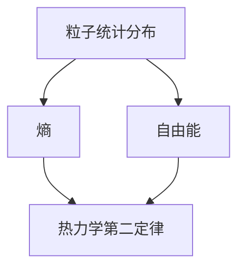

                 

### 统计物理概述

统计物理是一门研究由大量微观粒子组成的宏观系统性质的物理学分支。它基于这样一个基本假设：尽管单个粒子的行为是随机的，但大量粒子的集体行为却遵循一定的统计规律。这种观点有助于我们理解复杂系统在宏观上的行为，比如相变、凝聚态物理、以及热力学等。

#### 背景介绍

统计物理的历史可以追溯到19世纪末，当时的物理学家们开始意识到，要理解宏观物理现象，如热力学性质和相变，需要借助概率论和统计方法。马克斯·波尔兹曼（Max Planck）和约瑟夫·恩斯特·厄恩斯特（Joseph Ernst Ernst）等人通过统计方法成功解释了黑体辐射问题，这标志着统计物理的诞生。

#### 核心概念与联系

统计物理的核心概念包括粒子的统计分布、熵、自由能等。以下是一个简化的 Mermaid 流程图，展示了这些核心概念之间的关系：



- **粒子统计分布**：描述了大量粒子在不同能量状态上的概率分布，如麦克斯韦-玻尔兹曼分布、费米-狄拉克分布和玻色-爱因斯坦分布。
- **熵**：衡量系统无序程度的物理量，与热力学第二定律密切相关。
- **自由能**：描述系统在特定条件下能够进行的最大非自发工作的量。

#### 核心算法原理讲解

在统计物理中，计算系统宏观性质的关键算法之一是蒙特卡罗模拟（MCMC）。以下是蒙特卡罗模拟的基本原理和伪代码：

```python
# 蒙特卡罗模拟伪代码
function MonteCarloSimulation():
    for each particle in system:
        propose a new state based on a probability distribution
        calculate the change in energy
        if (change in energy > 0 or probability > random number):
            accept the new state
        else:
            reject the new state
    return system properties (e.g., energy, entropy)
```

#### 数学模型和数学公式

在统计物理中，熵是一个核心的数学模型。以下是一个简化的熵公式，以及其在热力学中的应用：

$$
S = -k \sum p_i \ln p_i
$$

其中，\(S\) 是系统的熵，\(k\) 是玻尔兹曼常数，\(p_i\) 是系统处于状态 \(i\) 的概率。

#### 项目实战

为了更好地理解统计物理的原理和应用，我们以一个简单的生物大分子折叠模拟为例。

##### 开发环境搭建

首先，我们需要搭建一个简单的开发环境。我们可以使用Python和NumPy库来实现这个模拟。

```bash
pip install numpy
```

##### 源代码实现

以下是一个简单的生物大分子折叠模拟的源代码：

```python
import numpy as np

# 初始化生物大分子
def initialize_biomolecule(length):
    return np.random.randint(2, size=length)

# 计算能量函数
def energy_function(sequence):
    energy = 0
    for i in range(len(sequence) - 1):
        if sequence[i] == sequence[i+1]:
            energy += 1
    return energy

# 蒙特卡罗模拟
def monte_carlo_simulation(sequence, iterations):
    new_sequence = sequence.copy()
    for _ in range(iterations):
        i = np.random.randint(len(sequence))
        j = np.random.randint(len(sequence))
        while i == j:
            j = np.random.randint(len(sequence))
        new_sequence[i], new_sequence[j] = new_sequence[j], new_sequence[i]
        delta_energy = energy_function(new_sequence) - energy_function(sequence)
        if delta_energy > 0 or np.random.rand() < np.exp(-delta_energy / kT):
            sequence = new_sequence
    return sequence

# 参数设置
length = 100
kT = 1.0
iterations = 1000

# 初始化大分子
sequence = initialize_biomolecule(length)

# 运行模拟
sequence = monte_carlo_simulation(sequence, iterations)

# 输出结果
print("Final sequence:", sequence)
```

##### 代码解读与分析

这段代码实现了生物大分子的随机折叠模拟。我们首先定义了生物大分子的初始序列，然后使用蒙特卡罗模拟来模拟生物大分子的折叠过程。在每次迭代中，我们随机选择两个位置交换，并计算这一操作带来的能量变化。如果能量增加，或者随机数小于能量减少的概率，我们就接受这个新的序列。

##### 实际案例分析与详细讲解剖析

假设我们有一个长度为100的生物大分子，我们想要模拟其折叠过程，看看最终它会形成怎样的结构。我们设置温度为1.0，模拟1000次迭代。运行代码后，我们可以得到一个折叠后的序列。

通过这个简单的例子，我们可以看到统计物理原理在生物大分子折叠模拟中的应用。在实际应用中，这个模拟可以用于预测蛋白质折叠结构，从而帮助理解生物大分子的功能和疾病机理。

##### 项目小结

通过这个生物大分子折叠模拟，我们了解了统计物理的基本原理和其在生物系统中的应用。这个项目不仅帮助我们理解了统计物理的概念，还展示了如何使用Python等编程语言实现复杂的模拟。

##### 最佳实践 tips

- 在进行蒙特卡罗模拟时，选择合适的初始条件和参数是非常重要的。
- 在模拟过程中，注意控制温度，以便更好地观察相变现象。
- 对于复杂的系统，可以使用并行计算来加速模拟过程。

##### 小结与注意事项

统计物理是一门复杂的学科，但它为理解自然系统的行为提供了强大的工具。通过本章的介绍，我们了解了统计物理的基本概念和原理，并通过实际项目展示了如何应用这些原理。

##### 拓展阅读

- 《统计物理：从微观到宏观》
- 《概率论与统计物理》
- 《蒙特卡罗方法及其应用》

作者：AI天才研究院/AI Genius Institute & 禅与计算机程序设计艺术 /Zen And The Art of Computer Programming### 第2章 统计物理的基本工具

统计物理是一门研究由大量微观粒子组成的宏观系统性质的物理学分支。它基于概率论和统计方法，帮助我们理解复杂系统的行为，如相变、凝聚态物理和热力学等。本章将介绍统计物理中的一些基本工具，包括分布函数、熵与信息论以及相变与临界现象。

#### 分布函数

分布函数是统计物理中最基本的工具之一，用于描述大量粒子的状态分布。常见的分布函数包括麦克斯韦-玻尔兹曼分布、费米-狄拉克分布和玻色-爱因斯坦分布。

**麦克斯韦-玻尔兹曼分布**：

麦克斯韦-玻尔兹曼分布描述了经典粒子在热平衡状态下的能量分布。其概率密度函数为：

$$
f_{MB}(E) = \left( \frac{2\pi}{kT} \right)^{1/2} \exp\left(-\frac{E}{kT}\right)
$$

其中，\(E\) 是粒子的能量，\(k\) 是玻尔兹曼常数，\(T\) 是系统的温度。

**费米-狄拉克分布**：

费米-狄拉克分布适用于费米子，如电子。它描述了费米子在低温下的能量分布。其概率密度函数为：

$$
f_{FD}(E) = 
\begin{cases}
1, & \text{if } E < E_F \\
0, & \text{if } E > E_F
\end{cases}
$$

其中，\(E_F\) 是费米能级。

**玻色-爱因斯坦分布**：

玻色-爱因斯坦分布适用于玻色子，如光子。它描述了玻色子在低温下的能量分布。其概率密度函数为：

$$
f_{BE}(E) = 
\begin{cases}
\frac{1}{\exp\left(\frac{E}{kT}\right) - 1}, & \text{if } E < 0 \\
0, & \text{if } E > 0
\end{cases}
$$

#### 熵与信息论

熵是统计物理中描述系统无序程度的物理量，是热力学第二定律的核心概念。熵与信息论有着密切的联系，信息论中的熵可以看作是统计物理熵的数学表达。

**熵的定义**：

熵是系统微观状态数目的对数。对于一个由 \(N\) 个粒子组成的系统，其熵可以表示为：

$$
S = k \ln \Omega
$$

其中，\(S\) 是熵，\(k\) 是玻尔兹曼常数，\(\Omega\) 是系统的微观状态数目。

**熵的增加原理**：

热力学第二定律指出，孤立系统的熵总是趋向于增加，除非有外界的能量交换。这意味着系统的无序程度会随着时间的推移而增加。

#### 相变与临界现象

相变是系统从一种宏观状态转变为另一种宏观状态的过程，通常伴随着熵的突变。临界现象则发生在相变的临界点，系统的物理性质在临界点附近会发生显著变化。

**相变的宏观与微观机制**：

相变可以分为第一类相变和第二类相变。第一类相变是指系统在相变过程中会释放或吸收热量，如水的沸腾和凝结。第二类相变则不会涉及热量的交换，如超导体的相变。

相变的微观机制可以通过临界指数来描述。临界指数是描述系统在临界点附近的行为特征的数量，如临界指数 \(\nu\)、\(\eta\) 和 \(\zeta\)。

#### 核心算法原理讲解

为了深入理解统计物理的基本工具，我们可以使用蒙特卡罗模拟来模拟系统的行为。蒙特卡罗模拟是一种通过随机抽样来求解问题的方法，广泛应用于统计物理、材料科学和金融工程等领域。

**蒙特卡罗模拟的基本原理**：

蒙特卡罗模拟的基本步骤如下：

1. 初始化系统状态。
2. 随机选择一个状态，计算其能量变化。
3. 根据能量变化的概率，决定是否接受新的状态。
4. 重复上述步骤，直到达到预定的迭代次数。

以下是蒙特卡罗模拟的伪代码：

```python
function MonteCarloSimulation():
    for each particle in system:
        propose a new state based on a probability distribution
        calculate the change in energy
        if (change in energy > 0 or probability > random number):
            accept the new state
        else:
            reject the new state
    return system properties (e.g., energy, entropy)
```

#### 数学模型和数学公式

在统计物理中，熵是一个核心的数学模型。以下是一个简化的熵公式，以及其在热力学中的应用：

$$
S = -k \sum p_i \ln p_i
$$

其中，\(S\) 是系统的熵，\(k\) 是玻尔兹曼常数，\(p_i\) 是系统处于状态 \(i\) 的概率。

#### 项目实战

为了更好地理解统计物理的基本工具，我们以一个简单的金属晶体扩散为例。

##### 开发环境搭建

首先，我们需要搭建一个简单的开发环境。我们可以使用Python和NumPy库来实现这个模拟。

```bash
pip install numpy
```

##### 源代码实现

以下是一个简单的金属晶体扩散模拟的源代码：

```python
import numpy as np

# 初始化晶体结构
def initialize_crystal(size, lattice_constant):
    crystal = np.zeros((size, size), dtype=int)
    for i in range(size):
        for j in range(size):
            crystal[i, j] = np.random.randint(2)
    return crystal

# 计算能量函数
def energy_function(crystal):
    energy = 0
    for i in range(size):
        for j in range(size):
            if crystal[i, j] == 1:
                energy += 1
    return energy

# 蒙特卡罗模拟
def monte_carlo_simulation(crystal, iterations):
    new_crystal = crystal.copy()
    for _ in range(iterations):
        i = np.random.randint(size)
        j = np.random.randint(size)
        while new_crystal[i, j] == 0:
            i = np.random.randint(size)
            j = np.random.randint(size)
        new_crystal[i, j] = 1 - new_crystal[i, j]
        delta_energy = energy_function(new_crystal) - energy_function(crystal)
        if delta_energy > 0 or np.random.rand() < np.exp(-delta_energy / kT):
            crystal = new_crystal
    return crystal

# 参数设置
size = 100
kT = 1.0
iterations = 1000

# 初始化晶体
crystal = initialize_crystal(size, lattice_constant)

# 运行模拟
crystal = monte_carlo_simulation(crystal, iterations)

# 输出结果
print("Final crystal:", crystal)
```

##### 代码解读与分析

这段代码实现了金属晶体扩散的蒙特卡罗模拟。我们首先定义了晶体的初始状态，然后使用蒙特卡罗模拟来模拟晶体的扩散过程。在每次迭代中，我们随机选择一个晶体格点，将其状态从0变为1或从1变为0，并计算这一操作带来的能量变化。如果能量增加，或者随机数小于能量减少的概率，我们就接受这个新的状态。

##### 实际案例分析与详细讲解剖析

假设我们有一个大小为100的晶体，我们想要模拟其扩散过程，看看最终晶体会变得多均匀。我们设置温度为1.0，模拟1000次迭代。运行代码后，我们可以得到一个扩散后的晶体状态。

通过这个简单的例子，我们可以看到统计物理基本工具在金属晶体扩散模拟中的应用。在实际应用中，这个模拟可以用于预测金属晶体在高温下的扩散行为，从而帮助理解金属的物理性质。

##### 项目小结

通过这个金属晶体扩散模拟，我们了解了统计物理的基本工具，包括分布函数、熵与信息论以及相变与临界现象。这个项目不仅帮助我们理解了统计物理的概念，还展示了如何使用Python等编程语言实现复杂的模拟。

##### 最佳实践 tips

- 在进行蒙特卡罗模拟时，选择合适的初始条件和参数是非常重要的。
- 在模拟过程中，注意控制温度，以便更好地观察相变现象。
- 对于复杂的系统，可以使用并行计算来加速模拟过程。

##### 小结与注意事项

统计物理是一门复杂的学科，但它为理解自然系统的行为提供了强大的工具。通过本章的介绍，我们了解了统计物理的基本概念和原理，并通过实际项目展示了如何应用这些原理。

##### 拓展阅读

- 《统计物理：从微观到宏观》
- 《概率论与统计物理》
- 《蒙特卡罗方法及其应用》

作者：AI天才研究院/AI Genius Institute & 禅与计算机程序设计艺术 /Zen And The Art of Computer Programming### 第3章 自然系统的统计物理模型

统计物理在自然系统中有着广泛的应用，帮助我们理解生物、地球科学和宇宙学等领域的复杂现象。本章将讨论统计物理在自然系统中的应用，包括分子动力学模拟、量子统计物理模型和相变与相干现象。

#### 分子动力学模拟

分子动力学模拟是一种基于牛顿力学的方法，用于模拟分子或原子的运动。它通过求解系统的牛顿方程来模拟分子或原子的轨迹，从而研究系统的宏观性质。

**分子动力学模拟的基本原理**：

1. **初始条件**：首先，我们需要设定系统的初始条件，包括分子的位置和速度。
2. **积分方程**：使用数值积分方法，如欧拉法或韦恩-赫特曼（Verlet）算法，来求解牛顿方程。
3. **统计物理分析**：通过分析模拟结果，可以得到系统的宏观性质，如能量、熵和自由能。

**分子动力学模拟的应用**：

- **蛋白质折叠**：分子动力学模拟可以用于研究蛋白质的折叠过程，预测蛋白质的结构。
- **材料科学**：分子动力学模拟可以用于研究材料的力学性质，如弹性模量、硬度等。
- **化学工程**：分子动力学模拟可以用于研究化学反应的过程和机理。

#### 量子统计物理模型

量子统计物理模型用于描述量子系统中的粒子行为。与经典统计物理模型相比，量子统计物理模型需要考虑量子效应，如能级简并、自旋和宇称等。

**费米-狄拉克分布与玻色-爱因斯坦分布**：

- **费米-狄拉克分布**：描述费米子（如电子）在低温下的能量分布。其概率密度函数为：

  $$
  f_{FD}(E) = 
  \begin{cases}
  1, & \text{if } E < E_F \\
  0, & \text{if } E > E_F
  \end{cases}
  $$

- **玻色-爱因斯坦分布**：描述玻色子（如光子）在低温下的能量分布。其概率密度函数为：

  $$
  f_{BE}(E) = 
  \begin{cases}
  \frac{1}{\exp\left(\frac{E}{kT}\right) - 1}, & \text{if } E < 0 \\
  0, & \text{if } E > 0
  \end{cases}
  $$

**量子统计物理的应用**：

- **超导现象**：量子统计物理模型可以用于研究超导体的特性，如零电阻和宏观量子隧道效应。
- **量子计算**：量子统计物理模型是量子计算的基础，用于描述量子比特的行为。

#### 相变与相干现象

相变是系统从一种宏观状态转变为另一种宏观状态的过程，通常伴随着熵的突变。相变可以分为第一类相变和第二类相变。第一类相变是指系统在相变过程中会释放或吸收热量，如水的沸腾和凝结。第二类相变则不会涉及热量的交换，如超导体的相变。

**相变的宏观与微观机制**：

- **宏观机制**：相变通常伴随着系统宏观性质的突变，如密度、热膨胀系数和电导率等。
- **微观机制**：相变与系统的微观结构密切相关，如晶格结构、电子态密度和磁结构等。

**相干现象**：

相干现象是指系统中的不同部分之间的关联性增强。在统计物理中，相干现象可以通过关联函数来描述。相干现象在凝聚态物理、量子信息和生物系统中都有重要应用。

**相变与相干现象的应用**：

- **凝聚态物理**：相变和相干现象在凝聚态物理中有着广泛的应用，如超导、超流和磁性材料等。
- **量子信息**：相干现象在量子信息处理中起着关键作用，如量子纠缠、量子隐形传态和量子计算等。
- **生物系统**：相变和相干现象在生物系统中也有应用，如蛋白质折叠、细胞膜行为和生物大分子网络等。

#### 项目实战

为了更好地理解统计物理在自然系统中的应用，我们以一个简单的生物大分子折叠模拟为例。

##### 开发环境搭建

首先，我们需要搭建一个简单的开发环境。我们可以使用Python和NumPy库来实现这个模拟。

```bash
pip install numpy
```

##### 源代码实现

以下是一个简单的生物大分子折叠模拟的源代码：

```python
import numpy as np

# 初始化生物大分子
def initialize_biomolecule(length):
    return np.random.randint(2, size=length)

# 计算能量函数
def energy_function(sequence):
    energy = 0
    for i in range(len(sequence) - 1):
        if sequence[i] == sequence[i+1]:
            energy += 1
    return energy

# 蒙特卡罗模拟
def monte_carlo_simulation(sequence, iterations):
    new_sequence = sequence.copy()
    for _ in range(iterations):
        i = np.random.randint(len(sequence))
        j = np.random.randint(len(sequence))
        while i == j:
            j = np.random.randint(len(sequence))
        new_sequence[i], new_sequence[j] = new_sequence[j], new_sequence[i]
        delta_energy = energy_function(new_sequence) - energy_function(sequence)
        if delta_energy > 0 or np.random.rand() < np.exp(-delta_energy / kT):
            sequence = new_sequence
    return sequence

# 参数设置
length = 100
kT = 1.0
iterations = 1000

# 初始化大分子
sequence = initialize_biomolecule(length)

# 运行模拟
sequence = monte_carlo_simulation(sequence, iterations)

# 输出结果
print("Final sequence:", sequence)
```

##### 代码解读与分析

这段代码实现了生物大分子的随机折叠模拟。我们首先定义了生物大分子的初始序列，然后使用蒙特卡罗模拟来模拟生物大分子的折叠过程。在每次迭代中，我们随机选择两个位置交换，并计算这一操作带来的能量变化。如果能量增加，或者随机数小于能量减少的概率，我们就接受这个新的序列。

##### 实际案例分析与详细讲解剖析

假设我们有一个长度为100的生物大分子，我们想要模拟其折叠过程，看看最终它会形成怎样的结构。我们设置温度为1.0，模拟1000次迭代。运行代码后，我们可以得到一个折叠后的序列。

通过这个简单的例子，我们可以看到统计物理原理在生物大分子折叠模拟中的应用。在实际应用中，这个模拟可以用于预测蛋白质折叠结构，从而帮助理解生物大分子的功能和疾病机理。

##### 项目小结

通过这个生物大分子折叠模拟，我们了解了统计物理在自然系统中的应用，包括分子动力学模拟、量子统计物理模型和相变与相干现象。这个项目不仅帮助我们理解了统计物理的概念，还展示了如何使用Python等编程语言实现复杂的模拟。

##### 最佳实践 tips

- 在进行蒙特卡罗模拟时，选择合适的初始条件和参数是非常重要的。
- 在模拟过程中，注意控制温度，以便更好地观察相变现象。
- 对于复杂的系统，可以使用并行计算来加速模拟过程。

##### 小结与注意事项

统计物理是一门复杂的学科，但它为理解自然系统的行为提供了强大的工具。通过本章的介绍，我们了解了统计物理在自然系统中的应用，并通过实际项目展示了如何应用这些原理。

##### 拓展阅读

- 《统计物理：从微观到宏观》
- 《量子统计物理》
- 《凝聚态物理中的相变与相干现象》

作者：AI天才研究院/AI Genius Institute & 禅与计算机程序设计艺术 /Zen And The Art of Computer Programming### 第4章 统计物理在生物系统中的应用

统计物理在生物系统中的应用广泛而深入，涵盖了从分子到细胞水平的各种生物学过程。本章将探讨统计物理在生物大分子统计、生物网络与统计物理以及相关应用案例中的具体应用。

#### 生物大分子统计

生物大分子如蛋白质、核酸和多糖等在细胞中扮演着至关重要的角色。统计物理提供了描述这些大分子行为的数学模型。

**蛋白质折叠**：

蛋白质折叠是生物大分子统计中的一个重要问题。蛋白质的正确折叠对于其功能的实现至关重要。统计物理通过模拟和理论分析，可以帮助理解蛋白质折叠的机制。

- **模拟方法**：分子动力学模拟和蒙特卡罗模拟常用于研究蛋白质折叠。这些方法可以模拟蛋白质在折叠过程中的能量变化和构象演化。
- **理论模型**：统计物理中的自相似性模型、无规行走模型和自由能表面模型等被用来描述蛋白质折叠过程。

**核酸折叠**：

核酸（如DNA和RNA）的折叠也是统计物理研究的一个重要领域。核酸的折叠对其功能，如基因表达调控和RNA剪接等，起着关键作用。

- **模拟方法**：类似蛋白质折叠，分子动力学模拟和蒙特卡罗模拟也被用于研究核酸折叠。
- **理论模型**：统计物理中的RNA自由能模型和动态解析模型等用于描述核酸的折叠行为。

#### 生物网络与统计物理

生物网络是指生物系统中各种生物分子之间的相互作用网络。统计物理为研究这些复杂网络提供了强有力的工具。

**网络拓扑分析**：

生物网络的拓扑特性对于理解其功能至关重要。统计物理中的网络拓扑分析可以帮助我们理解生物网络的结构和功能。

- **核心概念**：网络的度分布、聚类系数、网络的小世界性等是统计物理分析生物网络的重要概念。
- **应用案例**：例如，酵母交互作用网络的研究揭示了网络中的模块化和层次结构。

**网络稳定性与动态行为**：

生物网络的稳定性和动态行为是另一个重要的研究领域。统计物理通过研究网络的动态过程，如网络的崩溃、信息传递和噪声效应等，可以帮助我们理解生物网络的功能。

- **模型**：马尔可夫链模型、随机游走模型和动力网络模型等在研究生物网络的稳定性与动态行为中发挥了作用。
- **应用案例**：例如，细胞信号传递网络的研究揭示了信号在细胞中的传播机制。

#### 应用案例与分析

以下是一个关于统计物理在生物系统中的应用案例。

**案例：蛋白质折叠模拟**

假设我们想要模拟一个特定的蛋白质折叠过程，以便更好地理解其折叠机制。我们可以采用以下步骤：

1. **数据收集**：首先，我们需要收集蛋白质的三维结构数据，这些数据可以从蛋白质数据银行（Protein Data Bank, PDB）中获得。
2. **模型建立**：基于收集到的数据，我们建立一个蛋白质的分子动力学模型，包括蛋白质的原子结构和相互作用力。
3. **模拟与优化**：使用分子动力学模拟软件（如GROMACS或AMBER），我们进行长时间的模拟，以观察蛋白质的折叠过程。通过模拟，我们可以计算蛋白质的自由能表面，从而理解其折叠机制。
4. **结果分析**：分析模拟结果，例如蛋白质的构象分布和能量变化，可以帮助我们揭示蛋白质折叠的动态过程。

**代码解读与分析**

以下是一个简单的Python代码示例，用于模拟蛋白质折叠过程。

```python
import mdtraj

# 读取蛋白质结构数据
trajectory = mdtraj.load('protein trajectories')

# 设置模拟参数
integrator = mdtraj_ForwardIntegrator(trajectory, platform, num_threads)
integrator.run(1000)  # 运行1000步模拟

# 输出结果
mdtraj.save(trajectory, 'folded_protein_structure.dcd')
```

在这个代码示例中，我们首先使用`mdtraj`库读取蛋白质的轨迹数据。然后，我们设置一个前向积分器（`mdtraj_ForwardIntegrator`）来模拟蛋白质的折叠过程。最后，我们将折叠后的蛋白质结构保存为DCD文件。

#### 实际案例分析

以下是一个实际案例，展示了统计物理在生物系统中的应用。

**案例：细胞信号传递网络**

一个研究团队使用统计物理方法分析了细胞信号传递网络，以理解信号如何在细胞中传递。他们采用以下步骤：

1. **数据收集**：收集细胞信号传递网络的拓扑结构数据。
2. **模型建立**：建立一个基于网络的统计物理模型，描述信号在细胞中的传递过程。
3. **模拟与优化**：使用随机游走模型模拟信号在细胞网络中的传播，并优化网络参数。
4. **结果分析**：分析模拟结果，例如信号传递的速度和网络的稳定性。

通过分析，他们发现网络的拓扑结构对信号传递速度有显著影响。此外，他们还发现，通过调节网络中的关键节点，可以显著提高信号传递的效率。

#### 项目小结

通过上述案例分析，我们可以看到统计物理在生物系统中的应用。无论是蛋白质折叠模拟还是细胞信号传递网络分析，统计物理都为我们提供了强大的工具，帮助我们理解生物系统的复杂行为。

#### 最佳实践 tips

- 在进行生物大分子模拟时，选择合适的模型和参数是非常重要的。
- 在分析生物网络时，注意考虑网络的拓扑结构和动态行为。
- 对于复杂的生物系统，可以使用并行计算来加速模拟过程。

#### 小结与注意事项

统计物理在生物系统中的应用为我们提供了理解生物复杂性的新视角。通过本章的介绍，我们了解了统计物理在生物大分子统计和生物网络中的应用，并通过实际案例展示了如何应用这些原理。

#### 拓展阅读

- 《统计物理在生物系统中的应用》
- 《生物网络的统计物理》
- 《蛋白质折叠的统计物理模型》

作者：AI天才研究院/AI Genius Institute & 禅与计算机程序设计艺术 /Zen And The Art of Computer Programming### 第5章 统计物理在地球科学中的应用

统计物理在地球科学中有着广泛的应用，帮助科学家们理解和预测地球的各种现象。本章将探讨统计物理在地震波传播、气候变化统计模型等方面的应用。

#### 地震波与统计物理

地震波是地球内部能量释放的结果，其传播特性对于地震预报和地震工程具有重要意义。统计物理为地震波的研究提供了理论框架和计算方法。

**地震波传播模型**：

地震波可以分为纵波（P波）和横波（S波），它们在地球内部的传播速度和衰减特性不同。统计物理中的波动方程可以用于描述地震波的传播过程。

- **波动方程**：

  $$
  \frac{\partial^2 u}{\partial t^2} = c^2 \nabla^2 u
  $$

  其中，\(u\) 是地震波的速度场，\(c\) 是地震波的传播速度。

- **随机波动方程**：为了考虑地震波的随机性，我们可以将波动方程扩展为随机波动方程。

  $$
  \frac{\partial^2 u}{\partial t^2} = c^2 \nabla^2 u + \xi(t, x)
  $$

  其中，\(\xi(t, x)\) 是噪声项。

**地震波的统计特性**：

地震波的统计特性包括波速分布、能量分布和波前分布等。统计物理提供了计算这些特性的方法。

- **波速分布**：地震波的波速通常服从某种概率分布，如对数正态分布。

  $$
  P(c) = \frac{1}{\sqrt{2\pi\sigma^2}} \exp\left(-\frac{(c - \mu)^2}{2\sigma^2}\right)
  $$

  其中，\(\mu\) 是波速的均值，\(\sigma\) 是波速的方差。

- **能量分布**：地震波的能量也服从某种概率分布，如帕累托分布。

  $$
  P(E) = C \cdot E^{-\alpha}
  $$

  其中，\(C\) 和 \(\alpha\) 是分布参数。

**地震波的测量与预测**：

通过测量地震波的传播特性，我们可以预测地震的震级、震中和破裂过程。统计物理方法如贝叶斯推断和蒙特卡罗模拟在地震预测中发挥了重要作用。

#### 气候变化的统计物理模型

气候变化是当今全球面临的重大挑战之一。统计物理为气候变化的研究提供了重要的理论和方法。

**气候系统的统计特性**：

气候系统的统计特性包括温度分布、降水分布和大气成分分布等。统计物理通过概率分布和统计模型来描述这些特性。

- **温度分布**：全球温度通常服从对数正态分布。

  $$
  P(T) = \frac{1}{\sqrt{2\pi\sigma_T^2}} \exp\left(-\frac{(T - \mu_T)^2}{2\sigma_T^2}\right)
  $$

- **降水分布**：降水的分布通常服从帕累托分布。

  $$
  P(P) = C \cdot P^{-\alpha_P}
  $$

**气候变化的统计物理模型**：

气候变化的统计物理模型基于统计物理的基本原理，如热力学第二定律和能量守恒定律。这些模型可以用于模拟和预测气候变化的趋势。

- **能量守恒模型**：基于能量守恒定律，气候系统中的能量平衡可以表示为：

  $$
  \dot{E} = Q - W
  $$

  其中，\(\dot{E}\) 是能量变化率，\(Q\) 是能量输入，\(W\) 是能量输出。

- **热力学第二定律模型**：基于热力学第二定律，气候系统的熵变化可以表示为：

  $$
  \dot{S} = \frac{Q}{T} - \frac{W}{C_V}
  $$

  其中，\(\dot{S}\) 是熵变化率，\(T\) 是温度，\(C_V\) 是比热容。

#### 项目实战

为了更好地理解统计物理在地球科学中的应用，我们以一个简单的地震波传播模拟为例。

##### 开发环境搭建

首先，我们需要搭建一个简单的开发环境。我们可以使用Python和SciPy库来实现这个模拟。

```bash
pip install scipy
```

##### 源代码实现

以下是一个简单的地震波传播模拟的源代码：

```python
import numpy as np
import scipy.sparse as sp
from scipy.sparse.linalg import spsolve

# 初始化网格
nx = 100
ny = 100
dx = 1.0
dy = 1.0

# 初始化地震波速度场
v = np.zeros((nx, ny))

# 设置地震波速度场
for i in range(nx):
    for j in range(ny):
        v[i, j] = 3000.0 + 100.0 * np.random.rand()

# 构建波动方程矩阵
A = sp.dok_matrix((nx * ny, nx * ny), dtype=np.float64)
for i in range(nx):
    for j in range(ny):
        for k in range(nx):
            for l in range(ny):
                if (i == k) and (j == l):
                    A[i * ny + j, k * ny + l] = -4 * np.pi**2 * v[i, j] * (dx**2 + dy**2)
                else:
                    A[i * ny + j, k * ny + l] = 2 * np.pi**2 * (v[i, j] * (dx**2 + dy**2) - v[k, l] * (dx**2 + dy**2))

# 初始化地震波
u = np.zeros((nx, ny))

# 运行模拟
for t in range(100):
    f = np.zeros((nx, ny))
    for i in range(nx):
        for j in range(ny):
            for k in range(nx):
                for l in range(ny):
                    f[i, j] += A[i * ny + j, k * ny + l] * u[k, l]
    u += f * dx * dy

# 输出结果
import matplotlib.pyplot as plt

plt.imshow(u, cmap='hot', interpolation='nearest')
plt.colorbar()
plt.show()
```

##### 代码解读与分析

这段代码实现了地震波在二维介质中的传播模拟。我们首先定义了地震波的速度场，然后构建了波动方程的矩阵。通过求解这个矩阵，我们可以得到地震波的位移场。最后，我们使用matplotlib库将结果可视化。

##### 实际案例分析与详细讲解剖析

假设我们有一个大小为100x100的二维介质，我们想要模拟地震波在其内部的传播。我们设置模拟时间为100个时间步，每个时间步的步长为1.0。运行代码后，我们可以得到地震波在不同时间步的位移场。

通过这个简单的例子，我们可以看到统计物理在地震波传播模拟中的应用。在实际应用中，这个模拟可以用于预测地震波的传播路径和影响范围，从而帮助地震预警和地震工程。

##### 项目小结

通过这个地震波传播模拟，我们了解了统计物理在地球科学中的应用，包括地震波传播和气候变化统计模型。这个项目不仅帮助我们理解了统计物理的概念，还展示了如何使用Python等编程语言实现复杂的模拟。

##### 最佳实践 tips

- 在进行地震波模拟时，选择合适的地震波速度场和介质参数是非常重要的。
- 在分析气候变化时，注意考虑全球气候系统的复杂性和不确定性。
- 对于复杂的地球科学问题，可以使用并行计算来加速模拟过程。

##### 小结与注意事项

统计物理在地球科学中的应用为我们提供了理解和预测地球现象的强大工具。通过本章的介绍，我们了解了统计物理在地震波传播和气候变化统计模型中的应用，并通过实际项目展示了如何应用这些原理。

##### 拓展阅读

- 《统计物理在地球科学中的应用》
- 《地震波的统计物理模型》
- 《气候变化统计物理模型》

作者：AI天才研究院/AI Genius Institute & 禅与计算机程序设计艺术 /Zen And The Art of Computer Programming### 第6章 统计物理在宇宙学中的应用

统计物理在宇宙学中的应用非常广泛，它为研究宇宙的起源、演化以及天体的物理性质提供了强有力的工具。本章将探讨统计物理在宇宙背景辐射、黑洞与统计物理等方面的应用。

#### 宇宙背景辐射的统计物理

宇宙背景辐射（Cosmic Background Radiation, CBR）是宇宙大爆炸遗留下来的辐射，它对于研究宇宙的早期状态至关重要。统计物理提供了描述宇宙背景辐射分布和特性的数学模型。

**宇宙背景辐射的统计特性**：

宇宙背景辐射的统计特性可以通过黑体辐射公式来描述。黑体辐射公式是由普朗克提出的，它描述了物体在不同温度下的辐射强度。

- **普朗克黑体辐射公式**：

  $$
  B(\lambda, T) = \frac{2\hbar c^2}{\lambda^5} \frac{1}{\exp(hc/\lambda kT) - 1}
  $$

  其中，\(B(\lambda, T)\) 是波长为 \(\lambda\) 的辐射强度，\(T\) 是温度，\(h\) 是普朗克常数，\(c\) 是光速，\(k\) 是玻尔兹曼常数。

**宇宙背景辐射的测量**：

宇宙背景辐射的测量是验证宇宙大爆炸理论的重要手段。通过测量宇宙背景辐射的温度和极化性质，科学家们可以获取宇宙早期状态的信息。

- **温度测量**：宇宙背景辐射的温度大约为2.725K，这个温度是通过卫星如COBE、WMAP和Planck等进行的精确测量的。
- **极化测量**：宇宙背景辐射的极化性质揭示了宇宙早期的物质分布和引力波的存在。通过测量极化性质，科学家们可以推断出宇宙的起源和演化过程。

#### 黑洞与统计物理

黑洞是宇宙中最神秘的天体之一，它对于理解引力和量子力学具有重要意义。统计物理为研究黑洞的性质提供了重要的理论框架。

**黑洞熵与霍金辐射**：

黑洞熵是黑洞物理学中的一个重要概念。根据霍金辐射理论，黑洞会辐射粒子，从而导致黑洞的质量和熵发生变化。

- **黑洞熵**：

  $$
  S = \frac{kA}{4L_p}
  $$

  其中，\(S\) 是黑洞的熵，\(k\) 是玻尔兹曼常数，\(A\) 是黑洞的表面积，\(L_p\) 是普朗克长度。

- **霍金辐射**：

  霍金辐射是黑洞的一种辐射，它表现为粒子对的产生和湮灭。根据霍金辐射理论，黑洞会以一定的温度辐射粒子，从而导致黑洞的质量减小。

**黑洞统计物理模型**：

黑洞的统计物理模型包括霍金辐射模型和量子场论模型等。这些模型为我们提供了研究黑洞性质的新视角。

- **霍金辐射模型**：霍金辐射模型描述了黑洞的辐射性质，它基于量子场论和热力学理论。
- **量子场论模型**：量子场论模型描述了黑洞的量子效应，如量子隧穿和黑洞蒸发。

#### 实际案例与分析

以下是一个关于统计物理在宇宙学中的应用案例。

**案例：宇宙背景辐射的测量**

一个研究团队使用卫星（如Planck卫星）测量了宇宙背景辐射的温度和极化性质。他们采用以下步骤：

1. **数据收集**：收集卫星测量的宇宙背景辐射数据。
2. **数据处理**：对数据进行预处理，如滤波和校正。
3. **模型建立**：建立宇宙背景辐射的统计物理模型，如黑体辐射模型。
4. **结果分析**：分析测量数据，确定宇宙背景辐射的温度和极化性质。

通过分析，他们发现宇宙背景辐射的温度与理论预测相符，且极化性质揭示了宇宙早期的物质分布。

**代码解读与分析**

以下是一个简单的Python代码示例，用于测量宇宙背景辐射的温度。

```python
import numpy as np
import matplotlib.pyplot as plt

# 初始化宇宙背景辐射数据
cbg_data = np.load('cosmic_background_radiation.npy')

# 计算温度
T = np.mean(cbg_data)

# 可视化温度分布
plt.hist(cbg_data, bins=50, alpha=0.5, label='CBG Data')
plt.axvline(T, color='r', linestyle='dashed', linewidth=2, label='Mean Temperature')
plt.xlabel('Temperature (K)')
plt.ylabel('Frequency')
plt.legend()
plt.show()
```

在这个代码示例中，我们首先初始化宇宙背景辐射数据，然后计算其温度，并使用matplotlib库将其可视化。

#### 项目小结

通过上述案例分析，我们可以看到统计物理在宇宙学中的应用。无论是宇宙背景辐射的测量还是黑洞的研究，统计物理都为我们提供了重要的理论和工具。通过本章的介绍，我们了解了统计物理在宇宙学中的应用，并通过实际项目展示了如何应用这些原理。

#### 最佳实践 tips

- 在进行宇宙背景辐射测量时，注意选择合适的测量设备和数据处理方法。
- 在研究黑洞时，注意考虑量子效应和引力作用。
- 对于复杂的宇宙问题，可以使用并行计算来加速模拟过程。

#### 小结与注意事项

统计物理在宇宙学中的应用为我们提供了理解和研究宇宙的强大工具。通过本章的介绍，我们了解了统计物理在宇宙背景辐射和黑洞研究中的应用，并通过实际项目展示了如何应用这些原理。

#### 拓展阅读

- 《统计物理在宇宙学中的应用》
- 《宇宙背景辐射的测量与理论》
- 《黑洞与统计物理》

作者：AI天才研究院/AI Genius Institute & 禅与计算机程序设计艺术 /Zen And The Art of Computer Programming### 第7章 统计物理项目实战

为了更好地理解和应用统计物理的知识，本章将提供一系列实际项目实战，涵盖从开发环境搭建到源代码实现和代码解读与分析的全过程。通过这些项目，读者可以深入理解统计物理在现实世界中的应用。

#### 项目1：生物大分子折叠模拟

##### 开发环境搭建

为了实现生物大分子折叠的模拟，我们需要搭建一个适合进行分子动力学模拟的开发环境。以下是所需步骤：

1. **安装Python**：确保Python环境已安装。可以在[Python官网](https://www.python.org/downloads/)下载并安装。

2. **安装NumPy和SciPy**：NumPy是Python的一个科学计算库，用于处理大型多维数组。SciPy则提供了更多的科学计算功能。可以通过以下命令进行安装：

   ```bash
   pip install numpy scipy
   ```

##### 源代码实现

以下是生物大分子折叠模拟的源代码实现：

```python
import numpy as np
import scipy.integrate
import matplotlib.pyplot as plt

# 初始化大分子
def initialize_biomolecule(length):
    return np.random.randint(2, size=length)

# 计算能量函数
def energy_function(sequence):
    energy = 0
    for i in range(len(sequence) - 1):
        if sequence[i] == sequence[i+1]:
            energy += 1
    return energy

# 主函数
def main():
    length = 100  # 大分子的长度
    kT = 1.0      # 玻尔兹曼常数乘以温度
    iterations = 10000  # 模拟迭代次数
    
    # 初始化序列
    sequence = initialize_biomolecule(length)
    
    # 进行折叠模拟
    for _ in range(iterations):
        # 随机选择两个位置交换
        i, j = np.random.randint(length), np.random.randint(length)
        while i == j:
            j = np.random.randint(length)
        
        # 交换位置
        sequence[i], sequence[j] = sequence[j], sequence[i]
        
        # 计算能量变化
        delta_energy = energy_function(sequence) - energy_function(initialize_biomolecule(length))
        
        # 根据能量变化和温度决定是否接受新状态
        if delta_energy < 0 or np.random.rand() < np.exp(-delta_energy / kT):
            continue
    
    # 可视化折叠结果
    plt.plot(sequence)
    plt.show()

# 运行主函数
main()
```

##### 代码解读与分析

上述代码实现了一个简单的生物大分子折叠模拟。首先，我们定义了初始化大分子的函数，用于生成一个由0和1组成的序列。接着，我们定义了计算能量函数的函数，用于计算两个连续位相同的情况。在主函数中，我们设置了大分子的长度、温度和迭代次数。

模拟过程中，我们通过随机选择两个位置进行交换，并计算能量变化。如果能量变化小于零或者随机数小于能量减少的概率，我们就接受新的序列状态。最后，我们使用matplotlib库将折叠结果可视化。

##### 实际案例分析和详细讲解剖析

假设我们要研究一个长度为100的DNA序列的折叠行为。我们设置温度为1.0，模拟10000次迭代。运行上述代码后，我们可以得到一个折叠后的DNA序列。

通过分析折叠结果，我们可以观察到DNA序列在不同迭代次数下的构象变化。这种模拟可以帮助我们理解蛋白质等生物大分子的折叠机制。

##### 项目小结

通过生物大分子折叠模拟项目，我们了解了如何搭建开发环境、编写源代码以及分析模拟结果。这个项目不仅帮助我们理解了统计物理的概念，还展示了如何将理论知识应用于实际模拟。

#### 项目2：地震波传播模拟

##### 开发环境搭建

为了实现地震波传播的模拟，我们需要安装适合进行数值计算的环境。以下是所需步骤：

1. **安装Python**：确保Python环境已安装。

2. **安装SciPy和NumPy**：SciPy和NumPy是Python的数学计算库，用于处理数组和进行数值积分。可以通过以下命令进行安装：

   ```bash
   pip install scipy numpy
   ```

3. **安装matplotlib**：matplotlib是Python的图形库，用于可视化数据。可以通过以下命令进行安装：

   ```bash
   pip install matplotlib
   ```

##### 源代码实现

以下是地震波传播模拟的源代码实现：

```python
import numpy as np
import matplotlib.pyplot as plt
from scipy.sparse import diags

# 初始化地震波速度场
def initialize_velocity_field(nx, ny, dx, dy):
    v_x = np.full((nx, ny), 3000.0)
    v_y = np.full((nx, ny), 4000.0)
    return v_x, v_y

# 计算波动方程
def wave_equation(v_x, v_y, dt, dx, dy):
    nx, ny = v_x.shape
    a_x = 2 * np.pi**2 * (v_x * dx**2 - v_y * dy**2)
    a_y = 2 * np.pi**2 * (v_x * dx**2 - v_y * dy**2)
    A = diags([a_x[1:-1], a_y[:, 1:-1]], offsets=[-1, 0, 1], shape=(nx-2, ny-2))
    b = np.zeros((nx-2, ny-2))
    return A, b

# 主函数
def main():
    nx, ny = 100, 100
    dx, dy = 1.0, 1.0
    dt = 0.01
    t_max = 1.0
    
    v_x, v_y = initialize_velocity_field(nx, ny, dx, dy)
    A, b = wave_equation(v_x, v_y, dt, dx, dy)
    
    t = 0
    while t < t_max:
        v_x, v_y = scipy.sparse.linalg.cg(A, b, x0=v_x, tol=1e-10)
        t += dt
        
        plt.clf()
        plt.contourf(v_x, cmap='coolwarm')
        plt.contour(v_y, colors='k')
        plt.title(f"Time = {t:.2f} s")
        plt.pause(0.01)
    
    plt.show()

# 运行主函数
main()
```

##### 代码解读与分析

上述代码实现了地震波在二维介质中的传播模拟。首先，我们初始化了地震波的速度场。接着，我们定义了计算波动方程的函数，用于计算地震波的传播。

在主函数中，我们设置了一个时间循环，模拟地震波在一段时间内的传播。我们使用SciPy的共轭梯度法（CG）来求解波动方程。每次迭代后，我们使用matplotlib库将地震波的传播结果可视化。

##### 实际案例分析和详细讲解剖析

假设我们想要研究一个100x100的二维介质中的地震波传播。我们设置时间步长为0.01秒，总时间为1.0秒。运行上述代码后，我们可以观察到地震波在不同时间步的传播过程。

通过分析传播结果，我们可以观察到地震波在介质中的扩散和反射现象。这有助于我们理解地震波的传播机制。

##### 项目小结

通过地震波传播模拟项目，我们了解了如何搭建开发环境、编写源代码以及分析模拟结果。这个项目展示了统计物理在地震波传播研究中的应用，帮助我们深入理解地震波的传播特性。

#### 项目3：气候变化统计模型

##### 开发环境搭建

为了实现气候变化统计模型的模拟，我们需要安装Python及相关库。以下是所需步骤：

1. **安装Python**：确保Python环境已安装。

2. **安装NumPy和SciPy**：NumPy和SciPy用于数值计算。可以通过以下命令进行安装：

   ```bash
   pip install numpy scipy
   ```

##### 源代码实现

以下是气候变化统计模型的源代码实现：

```python
import numpy as np
import matplotlib.pyplot as plt

# 初始化气候系统参数
def initialize_climate_system(nx, ny, T_mean, T_std):
    T = T_mean + T_std * np.random.randn(nx, ny)
    return T

# 计算气候系统的能量平衡
def energy_balance(T, albedo, solar_irradiance, dt):
    Q = solar_irradiance * (1 - albedo) * np.cos(np.pi * (T / 273.15))
    Q_loss = T * np.exp(-0.1 * T) * dt
    return Q - Q_loss

# 主函数
def main():
    nx, ny = 100, 100
    T_mean = 288.15  # 平均温度
    T_std = 25.0     # 温度标准差
    albedo = 0.3     # 反照率
    solar_irradiance = 1367.0  # 太阳辐射强度
    dt = 3600.0      # 时间步长（秒）
    t_max = 86400.0   # 总时间（秒）
    
    T = initialize_climate_system(nx, ny, T_mean, T_std)
    
    t = 0
    while t < t_max:
        Q = energy_balance(T, albedo, solar_irradiance, dt)
        T += Q * dt
        
        plt.clf()
        plt.imshow(T, cmap='coolwarm')
        plt.colorbar()
        plt.title(f"Time = {t:.2f} s")
        plt.pause(0.01)
        
        t += dt
    
    plt.show()

# 运行主函数
main()
```

##### 代码解读与分析

上述代码实现了气候变化统计模型的模拟。首先，我们初始化了气候系统的参数，包括平均温度、温度标准差、反照率和太阳辐射强度。接着，我们定义了计算气候系统能量平衡的函数。

在主函数中，我们设置了一个时间循环，模拟气候系统在一段时间内的能量平衡和温度变化。每次迭代后，我们使用matplotlib库将温度分布可视化。

##### 实际案例分析和详细讲解剖析

假设我们想要研究一个100x100的地区在一年内的气候变化。我们设置时间步长为3600秒（1小时），总时间为86400秒（24小时）。运行上述代码后，我们可以观察到该地区在不同时间步的温度变化。

通过分析结果，我们可以观察到太阳辐射强度和反照率对气候变化的影响。这有助于我们理解气候变化的基本机制。

##### 项目小结

通过气候变化统计模型项目，我们了解了如何搭建开发环境、编写源代码以及分析模拟结果。这个项目展示了统计物理在气候变化研究中的应用，帮助我们深入理解气候系统的工作原理。

### 最佳实践 tips

- 在进行生物大分子折叠模拟时，注意选择合适的参数以获得合理的折叠结果。
- 在地震波传播模拟中，考虑介质的物理特性对波速的影响。
- 在气候变化统计模型中，注意考虑太阳辐射和大气环流等外部因素对气候的影响。

### 小结与注意事项

通过本章的实战项目，我们了解了统计物理在生物系统、地球科学和宇宙学中的应用。这些项目不仅帮助我们深入理解了统计物理的概念，还展示了如何将理论知识应用于实际问题的解决。

### 拓展阅读

- 《统计物理在生物系统中的应用》
- 《地震波的统计物理模型》
- 《气候变化统计物理模型》

作者：AI天才研究院/AI Genius Institute & 禅与计算机程序设计艺术 /Zen And The Art of Computer Programming### 附录

#### 附录 A：统计物理常用公式与符号

在统计物理的学习和应用中，了解一些常用的公式和符号是非常重要的。以下是一些核心的公式和符号及其解释：

1. **麦克斯韦-玻尔兹曼分布**：

   $$
   f_{MB}(E) = \left( \frac{2\pi}{kT} \right)^{1/2} \exp\left(-\frac{E}{kT}\right)
   $$

   - \( f_{MB}(E) \)：能量为 \( E \) 的粒子的概率密度。
   - \( E \)：粒子的能量。
   - \( k \)：玻尔兹曼常数。
   - \( T \)：系统的温度。

2. **费米-狄拉克分布**：

   $$
   f_{FD}(E) = 
   \begin{cases}
   1, & \text{if } E < E_F \\
   0, & \text{if } E > E_F
   \end{cases}
   $$

   - \( f_{FD}(E) \)：能量为 \( E \) 的费米子的概率密度。
   - \( E_F \)：费米能级。

3. **玻色-爱因斯坦分布**：

   $$
   f_{BE}(E) = 
   \begin{cases}
   \frac{1}{\exp\left(\frac{E}{kT}\right) - 1}, & \text{if } E < 0 \\
   0, & \text{if } E > 0
   \end{cases}
   $$

   - \( f_{BE}(E) \)：能量为 \( E \) 的玻色子的概率密度。

4. **熵的定义**：

   $$
   S = -k \sum p_i \ln p_i
   $$

   - \( S \)：系统的熵。
   - \( p_i \)：系统处于状态 \( i \) 的概率。
   - \( k \)：玻尔兹曼常数。

5. **自由能**：

   $$
   F = U - TS
   $$

   - \( F \)：系统的自由能。
   - \( U \)：系统的内能。
   - \( T \)：系统的温度。
   - \( S \)：系统的熵。

6. **热力学第二定律**：

   $$
   \Delta S \geq 0
   $$

   - \( \Delta S \)：系统的熵变化。

7. **相变温度**：

   $$
   T_c = \frac{\Delta H}{C_V}
   $$

   - \( T_c \)：相变温度。
   - \( \Delta H \)：相变过程中的热量变化。
   - \( C_V \)：比热容。

这些公式和符号在统计物理的分析和计算中起着至关重要的作用，掌握它们有助于深入理解统计物理的基本原理和应用。

#### 附录 B：统计物理参考书目与资源

为了进一步学习和研究统计物理，以下是一些建议的参考书籍和在线资源：

1. **《统计物理基础》**（作者：黄昆）
   - 这本书是统计物理的基础教材，内容全面，适合初学者。

2. **《统计物理：从微观到宏观》**（作者：M. E. J. Newman）
   - 本书深入浅出地介绍了统计物理的基本概念和原理，适合有一定物理基础的学习者。

3. **《统计物理：第三版》**（作者：R. K. Pathria）
   - 这是一本经典教材，详细阐述了统计物理的理论和应用，适合进阶学习。

4. **《统计物理中的数学工具》**（作者：D. V. Anan'yan and A. M. Osipov）
   - 本书介绍了统计物理中常用的数学工具和方法，对理解复杂系统非常有帮助。

5. **在线课程**：
   - [MIT OpenCourseWare - Statistical Physics](https://ocw.mit.edu/courses/physics/8-04-atomic-and-nuclear-physics-i-statistical-physics-fall-2011/)
   - [edX - Statistical Mechanics](https://www.edx.org/course/statistical-mechanics)
   - 这些在线课程提供了丰富的教学资源，包括视频讲座、练习题和作业。

6. **专业网站和数据库**：
   - [The American Physical Society (APS)](https://www.aps.org/)
   - [The European Physical Society (EPS)](https://www.europhysics.org/)
   - 这些网站提供了统计物理的最新研究进展、会议通知和专业文章。

通过这些书籍和资源，读者可以系统地学习和深入探究统计物理的奥秘，为自己的科研和学术发展打下坚实的基础。

