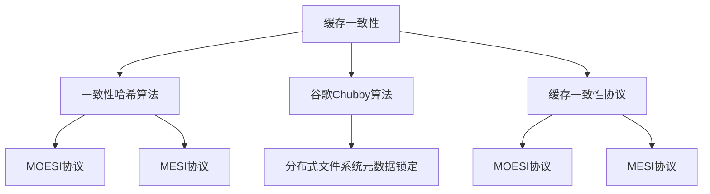

                 

### 文章标题

《缓存一致性策略在分布式LLM应用中的应用》

> 关键词：缓存一致性、分布式大规模语言模型、一致性算法、数学模型、项目实战

> 摘要：本文深入探讨了缓存一致性策略在分布式大规模语言模型（LLM）应用中的重要性。通过定义和解释核心概念，详细讲解了缓存一致性算法原理和数学模型，并结合实际项目案例，展示了如何在实际环境中应用这些策略，以优化分布式LLM的性能和可靠性。

----------------------------------------------------------------

## 缓存一致性概述

### 核心概念与联系

缓存一致性策略是为了保证多处理器系统中各个缓存副本的一致性而设计的。在分布式系统中，多个节点可能同时访问和修改同一份数据，如果这些操作不能协调一致，会导致数据的不一致性问题。缓存一致性策略的核心目标就是确保每个节点的缓存副本都保持最新的状态，从而避免数据竞争和冲突。

**一致性哈希算法**：一致性哈希算法是一种分布式哈希函数，通过将数据映射到哈希环上，以实现数据分布和节点故障转移的高效管理。它通过调整哈希环上节点的位置，来动态适应节点的加入和离开。

**谷歌Chubby算法**：Chubby算法是一种基于锁服务的分布式一致性算法，主要用于分布式文件系统的元数据锁定。Chubby提供了一个可靠的时间戳服务，通过时间戳来协调各个节点的操作，从而保证数据的一致性。

**缓存一致性协议**：缓存一致性协议是一组规则和机制，用于确保多处理器系统中各个缓存副本的一致性。常见的缓存一致性协议包括**MOESI协议**和**MESI协议**，它们通过不同的状态标志和控制机制，来管理缓存数据的读取和写入操作。

以下是一个Mermaid流程图，展示了这些核心概念之间的关系：

### 缓存一致性挑战

在分布式系统中，实现缓存一致性面临着诸多挑战，包括：

1. **数据复制**：为了保证数据的高可用性和高可靠性，分布式系统通常会进行数据复制。但是，过多的数据复制会导致网络带宽的占用和一致性问题的复杂化。
2. **网络延迟**：分布式系统中的节点可能分布在不同的地理位置，导致网络延迟成为一致性问题的主要因素。网络延迟会导致节点之间的同步延迟，从而影响数据的一致性。
3. **节点故障**：分布式系统中的节点可能会出现故障，导致数据不一致。一致性算法需要能够处理节点故障，并确保系统能够快速恢复。

### 缓存一致性模型

缓存一致性模型定义了分布式系统中各个节点的缓存状态和操作行为。常见的缓存一致性模型包括：

1. **强一致性**：在强一致性模型中，所有节点的缓存副本都始终保持最新的状态，从而保证了数据的一致性。但是，强一致性模型通常会带来较高的网络延迟和性能损失。
2. **最终一致性**：在最终一致性模型中，节点的缓存副本可能会存在一定的延迟，但最终会达到一致性状态。最终一致性模型提供了更高的性能和可扩展性，但可能会牺牲一定的一致性保障。
3. **部

