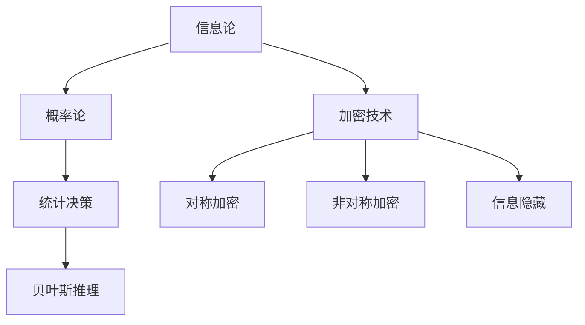

                 

### Step 1: 背景介绍

《网络安全的信息论：数据保护的数学原理》这本书旨在探讨网络安全与信息论之间的关系，深入讲解数学原理在数据保护中的应用。在当今数字化时代，网络安全已经成为一个至关重要的话题。随着互联网的普及，数据的传播和交换变得日益频繁，网络安全问题也日益凸显。信息论作为一种研究信息传输和处理的数学工具，为解决网络安全问题提供了理论基础和实用方法。

本书的第一部分将介绍信息论的基本概念，包括信息的定义、度量和传输过程。信息论的核心概念如熵、信息容量和信息密度将在这一部分中得到详细阐述。通过对这些基本概念的理解，读者将能够更好地理解网络安全中的信息保护机制。

### Step 2: 核心概念与联系

#### 2.1 信息的定义与度量

信息是数据的意义，是对数据的解释和理解。在网络安全中，信息的定义和度量对于数据保护至关重要。信息的度量可以通过熵来表示，熵是衡量信息不确定性的度量。信息熵的计算公式如下：

$$
H(X) = -\sum_{i} p(x_i) \log_2(p(x_i))
$$

其中，$H(X)$ 是随机变量 $X$ 的熵，$p(x_i)$ 是 $X$ 取值为 $x_i$ 的概率。熵值越高，信息的不确定性越大。

#### 2.2 概率论与统计决策

概率论是信息论的基础，它用于描述随机事件的发生概率。在网络安全中，概率论可以帮助我们理解和预测各种攻击的概率，从而采取相应的防护措施。统计决策理论则是在不确定环境下做出最优决策的方法，它依赖于贝叶斯推理。

贝叶斯推理是一种基于概率的推理方法，它通过已有数据和先验概率来更新后验概率，从而做出决策。贝叶斯推理公式如下：

$$
P(A|B) = \frac{P(B|A)P(A)}{P(B)}
$$

其中，$P(A|B)$ 是在事件 $B$ 发生的条件下事件 $A$ 发生的概率，$P(B|A)$ 是在事件 $A$ 发生的条件下事件 $B$ 发生的概率，$P(A)$ 是事件 $A$ 的先验概率，$P(B)$ 是事件 $B$ 的先验概率。

#### 2.3 加密与信息隐藏

加密是保护信息不被未经授权者获取的一种手段。加密技术通过将明文转换为密文，使得未经授权者无法解读信息。加密技术可以分为对称加密和非对称加密两种类型。

对称加密使用相同的密钥来加密和解密信息，常见的对称加密算法有AES、DES等。非对称加密使用一对密钥，即公钥和私钥，公钥用于加密，私钥用于解密，常见的非对称加密算法有RSA、ECC等。

信息隐藏是一种将秘密信息嵌入到其他信息中的技术，常见的信息隐藏技术有隐写术、数字指纹等。信息隐藏技术可以在不引起怀疑的情况下传输秘密信息，从而实现数据保护。

## 核心概念原理和架构的 Mermaid 流程图



### 核心算法原理讲解

#### 3.1 集值函数与熵

集值函数是信息论中的一个重要概念，它用于描述随机变量的取值。集值函数的熵是衡量信息不确定性的重要指标，熵的计算公式如下：

$$
H(X) = -\sum_{x} p(x) \log_2(p(x))
$$

其中，$X$ 是随机变量，$p(x)$ 是 $X$ 取值为 $x$ 的概率。

熵增定理指出，在随机过程中，系统的熵总是趋于增加，除非有外部的能量输入来降低熵。熵增定理是信息论中的一个基本原理，对于理解网络安全中的信息保护和传播具有重要意义。

#### 3.2 熵增定理与信息散布

熵增定理指出，在随机过程中，系统的熵总是趋于增加，除非有外部的能量输入来降低熵。这一原理表明，在信息传输过程中，信息的不确定性会不断增加，这为数据保护提供了理论依据。

信息散布是衡量信息在系统中的分布情况，它可以通过熵来描述。信息散布越均匀，熵值越高，信息的不确定性越大。在网络安全中，通过控制信息散布，可以降低数据被攻击的风险。

#### 3.3 信息密度与信息容量

信息密度是单位时间内传输的信息量，它反映了信息传输的效率。信息容量的计算公式如下：

$$
C = B \log_2(1 + S/N)
$$

其中，$C$ 是信息容量，$B$ 是带宽，$S$ 是信号功率，$N$ 是噪声功率。

信息密度和信息容量是网络安全中重要的参数，它们决定了数据传输的安全性和效率。通过优化信息密度和信息容量，可以提升网络安全性能。

### 数学模型和数学公式

#### 4.1 熵的定义与计算

熵是衡量信息不确定性的指标，它的计算公式如下：

$$
H(X) = -\sum_{x} p(x) \log_2(p(x))
$$

其中，$X$ 是随机变量，$p(x)$ 是 $X$ 取值为 $x$ 的概率。

#### 4.2 信道编码与解码

信道编码是将原始数据转换为适合信道传输的编码，解码是将接收到的编码还原为原始数据。信道编码与解码的数学模型如下：

$$
C = E \{ X \}
$$

$$
P(X|C) = P(C|X)
$$

其中，$C$ 是编码后的数据，$X$ 是原始数据，$E \{ X \}$ 是期望值，$P(X|C)$ 是在已知编码条件下原始数据的概率分布，$P(C|X)$ 是在已知原始数据条件下编码的概率分布。

#### 4.3 密码学基础

密码学是研究加密和解密技术的学科，它基于数学原理来保护信息安全。密码学的基本概念包括：

- 对称加密：使用相同的密钥进行加密和解密。
- 非对称加密：使用一对密钥进行加密和解密，公钥加密，私钥解密。
- 哈希函数：将任意长度的输入数据映射为固定长度的输出数据。

密码学的数学模型包括：

- 对称加密模型：
  $$
  C = E_K(P)
  $$

  $$

- 非对称加密模型：
  $$
  C = E_K(P)
  $$

  $$
  P = D_K(C)
  $$

- 哈希函数模型：
  $$
  H = Hash(P)
  $$

### 信息论与网络安全的应用举例

#### 4.4.1 数据加密标准（DES）

数据加密标准（DES）是一种对称加密算法，它使用56位的密钥对数据进行加密和解密。DES的数学模型如下：

$$
C = E_K(P)
$$

$$
P = D_K(C)
$$

其中，$C$ 是加密后的数据，$P$ 是原始数据，$K$ 是密钥。

#### 4.4.2 传输层安全协议（TLS）

传输层安全协议（TLS）是一种用于网络通信的安全协议，它使用非对称加密和对称加密技术来保护数据传输。TLS的数学模型如下：

$$
C = E_K(P)
$$

$$
P = D_K(C)
$$

其中，$C$ 是加密后的数据，$P$ 是原始数据，$K$ 是对称密钥，$E_K$ 和 $D_K$ 分别是对称加密和解密算法。

### 5.1 网络安全项目实战案例

#### 5.1.1 项目开发环境搭建

在开始网络安全项目之前，我们需要搭建一个合适的开发环境。以下是一个简单的项目开发环境搭建步骤：

1. 安装操作系统：选择一个合适的操作系统，如Linux或Windows。
2. 安装编程语言：根据项目需求，选择合适的编程语言，如Python、Java等。
3. 安装开发工具：安装IDE（集成开发环境），如PyCharm、Eclipse等。
4. 安装依赖库：根据项目需求，安装必要的依赖库，如PyCrypto、OpenSSL等。

#### 5.1.2 源代码实现与解读

以下是一个简单的数据加密和解密的Python示例代码：

```python
from Crypto.Cipher import AES
from Crypto.Util.Padding import pad, unpad
from Crypto.Random import get_random_bytes

# 密钥生成
key = get_random_bytes(16)

# 加密函数
def encrypt(message, key):
    cipher = AES.new(key, AES.MODE_CBC)
    ct_bytes = cipher.encrypt(pad(message.encode('utf-8'), AES.block_size))
    iv = cipher.iv
    return iv + ct_bytes

# 解密函数
def decrypt(ciphertext, key):
    iv = ciphertext[:16]
    ct = ciphertext[16:]
    cipher = AES.new(key, AES.MODE_CBC, iv)
    pt = unpad(cipher.decrypt(ct), AES.block_size)
    return pt.decode('utf-8')

# 测试代码
message = "Hello, World!"
ciphertext = encrypt(message, key)
print("Ciphertext:", ciphertext)

plaintext = decrypt(ciphertext, key)
print("Plaintext:", plaintext)
```

#### 5.1.3 代码应用解读与分析

在这个示例中，我们使用了PyCrypto库来实现AES加密算法。首先，我们生成一个随机的密钥，然后使用该密钥对明文消息进行加密。加密过程中，我们使用了CBC模式，并将明文消息填充到AES块的大小。加密后的密文包含了初始化向量（IV）和加密后的数据。在解密过程中，我们首先提取出IV，然后使用密钥和解密函数来还原明文消息。

#### 5.1.4 实际案例分析和详细讲解剖析

以下是一个实际案例：使用TLS协议进行安全的网络通信。

1. **客户端请求建立连接：** 客户端发起HTTPS请求，并向服务器发送TLS握手请求。
2. **服务器响应握手请求：** 服务器接收客户端的握手请求，并生成一个随机数作为服务器生成的密钥。
3. **客户端验证服务器身份：** 客户端接收服务器返回的证书，并使用证书中的公钥来加密客户端生成的随机数，然后发送给服务器。
4. **服务器解密客户端的随机数：** 服务器使用自己的私钥来解密客户端发送的随机数，并与服务器生成的随机数进行比较，以验证客户端的身份。
5. **客户端和服务器交换密钥：** 双方交换生成的随机数，用于协商会话密钥。
6. **建立安全的通信通道：** 双方使用协商好的会话密钥来加密和解密通信数据。

#### 5.1.5 项目小结

通过这个项目实战案例，我们了解了如何使用Python和PyCrypto库来实现AES加密算法，并了解了TLS协议的工作原理。在实际应用中，我们可以根据具体需求选择合适的加密算法和协议，以确保数据传输的安全性和完整性。

### 6. 最佳实践 tips、小结、注意事项、拓展阅读等内容

#### 最佳实践 tips

- 选择合适的加密算法：根据实际需求选择合适的加密算法，如AES、RSA等。
- 使用强密码：使用强密码来保护密钥和账户安全，避免使用弱密码。
- 定期更新密钥：定期更换密钥，以降低密钥泄露的风险。
- 确保数据完整性：使用哈希函数来确保数据的完整性，避免数据被篡改。

#### 小结

本书通过介绍信息论的基本概念、概率论与统计决策、加密与信息隐藏等核心概念，以及实际项目实战案例，全面探讨了网络安全与信息论的关系。读者可以了解如何利用数学原理来保护数据安全，并掌握常用的加密技术和网络安全协议。

#### 注意事项

- 在实际应用中，网络安全是一个复杂的过程，需要综合考虑多种因素，如加密算法的选择、密钥的管理、数据的完整性等。
- 定期进行安全审计和风险评估，确保网络安全措施的有效性。
- 关注网络安全领域的最新动态和技术发展，不断提升网络安全能力。

#### 拓展阅读

- 《网络安全基础教程》
- 《密码学：原理与实践》
- 《信息安全技术与应用》
- 《网络安全测试与评估》

---

### 结语

《网络安全的信息论：数据保护的数学原理》旨在为读者提供一套完整的网络安全理论基础和实用方法。通过本书的学习，读者可以深入了解信息论在网络安全中的应用，掌握基本的加密技术和网络安全协议。在实际工作中，读者可以根据本书的内容，结合具体项目需求，不断提升网络安全能力，保护数据的安全和完整性。在未来的网络安全领域，信息论将继续发挥重要作用，为数据保护提供强大的理论支持和实用工具。作者：AI天才研究院/AI Genius Institute & 禅与计算机程序设计艺术 /Zen And The Art of Computer Programming。

