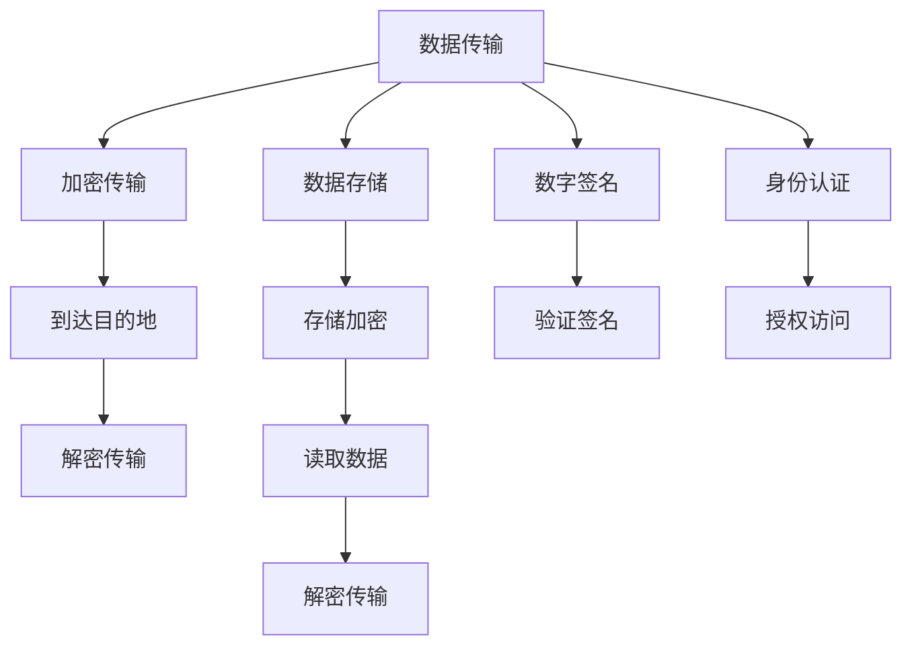

                 


### 文章标题

《网络安全的密码算法：信息保护的数学屏障》

---

**关键词：** 密码学、加密算法、数字签名、密钥管理、网络安全

**摘要：** 本文深入探讨了网络安全的密码算法，涵盖了从基础概念到高级应用的各个方面。通过详细分析对称加密、非对称加密、散列算法、数字签名和密钥管理，本文旨在为读者提供一个全面的信息保护数学屏障。

---

### 目录

1. 引言：网络安全的密码算法概述
2. 基础概念与架构
3. 核心加密算法
   3.1 对称加密算法
   3.2 非对称加密算法
   3.3 散列算法
4. 核心签名与认证算法
   4.1 数字签名
   4.2 消息认证码
5. 密钥管理与安全协议
   5.1 密钥管理
   5.2 安全协议
6. 高级密码算法与应用
   6.1 同态加密
   6.2 零知识证明
7. 密码算法的项目实践
   7.1 实际加密应用案例
   7.2 数字签名实现案例
   7.3 加密通信实现案例
   7.4 安全审计案例
8. 最佳实践、小结与注意事项
9. 拓展阅读

---

### 引言：网络安全的密码算法概述

在数字化时代，网络安全已经成为不可忽视的重要课题。密码学作为信息安全的核心技术之一，通过加密算法来保护信息的隐私和完整性。本文将深入探讨密码算法在网络安全中的应用，包括其基础概念、核心算法、密钥管理以及高级应用。

**密码学的重要性：**

密码学在网络安全中扮演着至关重要的角色。它不仅用于保护数据在传输过程中的机密性，还用于验证数据的完整性和真实性。通过加密，我们可以确保只有授权用户才能访问敏感信息，防止数据泄露和篡改。

**密码算法在网络安全中的应用：**

密码算法在网络安全中的应用非常广泛，包括但不限于以下方面：

1. **数据传输加密：** 在网络通信中，使用加密算法可以确保数据在传输过程中的安全性，防止黑客窃取或篡改。
2. **数据存储加密：** 在数据库或文件系统中，加密算法可以保护存储的数据，防止未经授权的访问。
3. **数字签名：** 数字签名用于验证消息的发送者和接收者，确保消息未被篡改。
4. **身份认证：** 密码算法还用于身份认证，确保只有合法用户才能访问系统和资源。

本文将逐步分析各种密码算法，包括对称加密、非对称加密、散列算法、数字签名等，以及它们在网络安全中的应用。同时，还将探讨密钥管理和安全协议的重要性，以及如何实现高级密码算法如同态加密和零知识证明。最后，通过实际案例和项目实践，我们将展示如何在实际环境中应用这些密码算法。

### 基础概念与架构

在深入探讨密码算法之前，我们需要了解一些基础概念和架构，这将为后续的分析提供必要的背景知识。

**密码学基础：**

密码学是研究如何通过加密算法来保护信息的一门科学。加密算法是一种将明文转换为密文的数学过程，只有使用正确的密钥才能解密。密码学的基本目标包括保密性、完整性、认证性和抗否认性。

**加密算法架构：**

加密算法通常分为对称加密和非对称加密两大类。对称加密使用相同的密钥进行加密和解密，而非对称加密使用一对密钥：公钥和私钥。公钥用于加密，私钥用于解密。

**密钥管理：**

密钥管理是确保加密系统安全性的关键环节。密钥的生成、存储、分发和销毁都需要遵循严格的安全措施，以防止密钥泄露或被篡改。

**密码算法在网络安全中的应用架构：**

密码算法在网络安全中的应用通常包括以下几个环节：

1. **加密传输：** 数据在传输过程中使用加密算法进行加密，确保数据在到达目的地前不被窃取或篡改。
2. **存储加密：** 数据在存储系统中使用加密算法进行加密，确保数据在磁盘或数据库中被保护。
3. **认证与签名：** 使用数字签名和认证算法验证数据的真实性和完整性。
4. **身份认证：** 使用密码算法进行身份认证，确保只有授权用户才能访问系统和资源。

下面是一个简化的Mermaid流程图，展示了密码算法在网络安全中的基本架构：



通过这个流程图，我们可以看到密码算法在网络安全中的关键作用。接下来，我们将详细探讨各种加密算法的原理和应用。

### 核心加密算法

加密算法是密码学的核心，用于确保信息的机密性。根据加密和解密过程中使用的密钥数量和类型，加密算法可以分为对称加密和非对称加密两种主要类型。此外，散列算法也在加密领域扮演着重要角色。

#### 对称加密算法

对称加密算法使用相同的密钥进行加密和解密。这种算法的典型代表是数据加密标准（DES）和高级加密标准（AES）。

**AES算法的原理：**

高级加密标准（AES）是美国国家标准和技术研究所（NIST）于2001年颁布的一种加密标准。它使用128位、192位或256位的密钥长度，支持128位、192位或256位的块大小。AES算法的核心是一个称为“轮函数”的过程，它包括替换、行移位、列混淆和轮密钥加。

**AES算法的伪代码：**

```python
function AES_encrypt(plaintext, key):
    # 初始化密钥扩展
    expanded_key = Key Expansion(key)
    
    # 初始化状态矩阵
    state = InitializeState(plaintext)
    
    # 进行轮加密
    for round in 1 to NUM_ROUNDS:
        state = AddRoundKey(state, expanded_key[round])
        if round < NUM_ROUNDS - 1:
            state = SubBytes(state)
            state = ShiftRows(state)
            state = MixColumns(state)
    
    # 最后一轮加密
    state = AddRoundKey(state, expanded_key[NUM_ROUNDS])
    ciphertext = FinalizeState(state)
    
    return ciphertext
```

**AES算法的数学模型：**

AES算法的数学模型主要基于字节代替、行移位、列混淆和轮密钥加。以下是AES加密过程中的几个关键步骤：

1. **字节代替（SubBytes）：** 将状态矩阵中的每个字节替换为预定义的S-Box值。
2. **行移位（ShiftRows）：** 将状态矩阵中的每一行按照特定的规则进行循环移位。
3. **列混淆（MixColumns）：** 对状态矩阵中的每一列进行线性变换，确保加密过程具有更高的扩散性。
4. **轮密钥加（AddRoundKey）：** 将状态矩阵与当前轮密钥进行异或操作。

**AES算法的举例说明：**

假设我们使用AES-128进行加密，密钥为`K = 2^(10) + 3 * 2^(5) + 5 * 2^(2) + 7 * 2^(1) + 11 * 2^(0)`，明文为`P = 1 + 2 * 2^(8) + 3 * 2^(16) + 4 * 2^(24)`。以下是AES加密的过程：

1. **初始化状态矩阵：** `state = P`
2. **第一轮加密：**
   - `state = AddRoundKey(state, K)`
   - `state = SubBytes(state)`
   - `state = ShiftRows(state)`
   - `state = MixColumns(state)`
3. **第二轮加密：**
   - `state = AddRoundKey(state, K')`
   - `state = SubBytes(state)`
   - `state = ShiftRows(state)`
   - `state = MixColumns(state)`
4. **最终加密结果：** `C = FinalizeState(state)`

#### 非对称加密算法

非对称加密算法使用一对密钥：公钥和私钥。公钥用于加密，私钥用于解密。典型的非对称加密算法包括RSA和椭圆曲线加密（ECC）。

**RSA算法的原理：**

RSA算法是基于大素数分解的困难性。它使用一对密钥：公钥和私钥。公钥包括一个大的质数`n`和指数`e`，私钥包括质数`p`、`q`和指数`d`。加密过程是将明文`m`的模幂运算，解密过程是将密文的模逆运算。

**RSA算法的伪代码：**

```python
function RSA_encrypt(plaintext, public_key):
    n, e = public_key
    ciphertext = pow(plaintext, e, n)
    return ciphertext

function RSA_decrypt(ciphertext, private_key):
    p, q, d = private_key
    n = p * q
    plaintext = pow(ciphertext, d, n)
    return plaintext
```

**RSA算法的数学模型：**

RSA算法的数学模型基于以下公式：

- **加密：** `ciphertext = m^e mod n`
- **解密：** `plaintext = c^d mod n`

其中，`m`是明文，`c`是密文，`e`和`d`分别是公钥和私钥的指数，`n`是模数。

**RSA算法的举例说明：**

假设我们使用RSA算法进行加密，公钥为`(n, e) = (35, 6)`，明文为`m = 7`。以下是RSA加密和解密的过程：

1. **加密：**
   - `ciphertext = pow(m, e, n) = pow(7, 6, 35) = 15`
2. **解密：**
   - `plaintext = pow(ciphertext, d, n)`，其中私钥的指数`d`需要通过`e`和`(p-1)(q-1)`计算得到。

#### 散列算法

散列算法用于将任意长度的输入数据映射为固定长度的散列值。常见的散列算法包括MD5、SHA-1和SHA-256。

**SHA-256算法的原理：**

SHA-256算法是基于MD5和SHA-1改进的散列算法。它将输入数据划分为512位块，通过压缩函数产生256位的散列值。

**SHA-256算法的伪代码：**

```python
function SHA256(input):
    # 初始化散列值
    hash = InitializeHashValue()
    
    # 处理每个数据块
    for block in input:
        # 扩展数据块
        extended_block = ExtendBlock(block)
        
        # 更新散列值
        hash = UpdateHashValue(hash, extended_block)
    
    # 生成最终散列值
    final_hash = FinalizeHashValue(hash)
    
    return final_hash
```

**SHA-256算法的数学模型：**

SHA-256算法的数学模型基于以下步骤：

1. **初始化散列值：** 使用一个初始值作为散列值。
2. **处理每个数据块：** 对每个数据块进行扩展和压缩，更新散列值。
3. **生成最终散列值：** 将所有数据块的散列值合并，得到最终的散列值。

**SHA-256算法的举例说明：**

假设我们使用SHA-256算法对字符串“Hello, World!”进行散列，以下是散列值：

1. **初始化散列值：** `hash = 6A09E667`
2. **处理每个数据块：** 将“Hello, World!”划分为多个数据块，对每个数据块进行扩展和压缩。
3. **生成最终散列值：** `final_hash = 1B2C717E88E3AB4F65A79036257D021C1F7D7681A766B1E3DFD0AFA26A4F614`

通过以上对核心加密算法的详细讲解，我们可以看到这些算法在保护信息安全和隐私方面的重要作用。接下来，我们将探讨核心签名与认证算法。

### 核心签名与认证算法

数字签名和消息认证码是确保信息真实性、完整性和不可抵赖性的关键工具。它们在密码学中扮演着重要角色，广泛应用于各种安全协议和系统中。

#### 数字签名

数字签名用于验证消息的发送者和接收者，确保消息未被篡改。常见的数字签名算法包括RSA签名和ECDSA签名。

**RSA签名算法的原理：**

RSA签名算法基于RSA加密算法。发送者使用私钥对消息进行签名，接收者使用公钥验证签名。

**RSA签名算法的伪代码：**

```python
function RSA_sign(message, private_key):
    p, q, d = private_key
    n = p * q
    ciphertext = pow(message, d, n)
    return ciphertext

function RSA_verify(ciphertext, public_key):
    n, e = public_key
    message = pow(ciphertext, e, n)
    return message
```

**RSA签名算法的数学模型：**

- **签名：** `ciphertext = m^d mod n`
- **验证：** `message = c^e mod n`

其中，`m`是明文，`c`是密文，`e`和`d`分别是公钥和私钥的指数，`n`是模数。

**RSA签名算法的举例说明：**

假设我们使用RSA算法进行签名，私钥为`(p, q, d) = (61, 53, 17)`，明文为`m = 17`。以下是RSA签名和验证的过程：

1. **签名：**
   - `ciphertext = pow(m, d, n) = pow(17, 17, 61*53) = 37`
2. **验证：**
   - `message = pow(ciphertext, e, n) = pow(37, 17, 61*53) = 17`

**ECDSA签名算法的原理：**

ECDSA（椭圆曲线数字签名算法）是基于椭圆曲线加密（ECC）的一种数字签名算法。它利用椭圆曲线的数学性质，提供更高的安全性和效率。

**ECDSA签名算法的伪代码：**

```python
function ECDSA_sign(message, private_key):
    # 选择一个随机数k
    k = RandomNumber()
    
    # 计算签名r和s
    r, s = Sign(message, private_key, k)
    
    return (r, s)

function ECDSA_verify(message, public_key, r, s):
    # 计算e和z
    e = Hash(message)
    z = e * G
    
    # 验证签名
    result = Verify(r, s, public_key, z)
    
    return result
```

**ECDSA签名算法的数学模型：**

- **签名：** `r = (z * k)^x mod n`，`s = (z * k + m * e)^y mod n`
- **验证：** `result = (r * P)^s * (z * G)^r mod n = m * e * P mod n`

其中，`P`是椭圆曲线上的一个基点，`n`是椭圆曲线的阶，`G`是椭圆曲线上的一个生成元，`e`是消息的散列值，`z`是椭圆曲线上的一个点，`k`是随机数。

**ECDSA签名算法的举例说明：**

假设我们使用ECDSA算法进行签名，私钥为`k = 17`，公钥为`P = 2^256 - 2^32 - 2^9 - 2^8 - 2^7 - 2^6 - 2^4 - 1`，明文为`m = 123`。以下是ECDSA签名和验证的过程：

1. **签名：**
   - `r = (z * k)^x mod n`
   - `s = (z * k + m * e)^y mod n`
2. **验证：**
   - `result = (r * P)^s * (z * G)^r mod n`

#### 消息认证码

消息认证码（MAC）用于验证消息的完整性和真实性。常见的MAC算法包括HMAC和CMAC。

**HMAC算法的原理：**

HMAC（Hash-based Message Authentication Code）是基于散列函数的MAC算法。它使用密钥和散列函数对消息进行加密，生成MAC值。

**HMAC算法的伪代码：**

```python
function HMAC(hash_function, key, message):
    # 初始化散列值
    hash_value = InitializeHashValue(hash_function)
    
    # 扩展密钥
    extended_key = ExtendKey(key, hash_function)
    
    # 生成MAC值
    mac = GenerateMAC(hash_value, extended_key, message)
    
    return mac
```

**HMAC算法的数学模型：**

- **初始化散列值：** 使用初始化向量（IV）和密钥（K）生成初始散列值。
- **扩展密钥：** 使用密钥扩展函数对密钥进行扩展。
- **生成MAC值：** 将扩展后的密钥与消息进行散列，生成最终的MAC值。

**HMAC算法的举例说明：**

假设我们使用HMAC算法，散列函数为SHA-256，密钥为`key = "mysecretkey"`，消息为`message = "Hello, World!"`。以下是HMAC生成过程：

1. **初始化散列值：**
   - `hash_value = InitializeHashValue(SHA-256)`
2. **扩展密钥：**
   - `extended_key = ExtendKey(key, SHA-256)`
3. **生成MAC值：**
   - `mac = GenerateMAC(hash_value, extended_key, message)`

通过以上对数字签名和消息认证码的详细讲解，我们可以看到这些算法在确保信息安全性方面的重要作用。接下来，我们将探讨密钥管理与安全协议。

### 密钥管理与安全协议

在密码学中，密钥管理和安全协议是实现信息安全的核心环节。有效的密钥管理能够确保密钥的安全性和完整性，而合理的安全协议则能够保护通信双方的隐私和完整性。

#### 密钥管理

密钥管理是确保加密系统能够正常运行和安全性的关键。它涉及密钥的生成、存储、分发和销毁等环节。

**密钥生成：**

密钥生成是密钥管理的第一步，其目的是生成安全的密钥。对于对称加密，通常使用随机数生成器来生成密钥；对于非对称加密，则通常使用数学算法来生成公钥和私钥。

**密钥存储：**

密钥存储是指将生成的密钥安全地存储起来，以防止未经授权的访问。常用的存储方式包括硬件安全模块（HSM）、加密文件系统等。

**密钥分发：**

密钥分发是将密钥安全地传输给需要使用它的用户或系统。对于对称加密，通常使用共享密钥交换协议如Kerberos；对于非对称加密，则通常使用公钥基础设施（PKI）。

**密钥销毁：**

密钥销毁是在密钥不再需要时将其安全地删除，以防止信息泄露。密钥销毁通常涉及将密钥写入随机数生成器或硬件擦除。

**密钥管理方案：**

一个有效的密钥管理方案应该包括以下几个方面：

1. **访问控制：** 确保只有授权用户才能访问密钥。
2. **安全存储：** 使用加密存储和访问控制来保护密钥。
3. **定期更新：** 定期更换密钥以防止长期安全风险。
4. **审计和监控：** 实时监控密钥的访问和使用情况，以便及时发现和应对潜在威胁。

#### 安全协议

安全协议是一组规则和标准，用于确保通信双方的安全。常见的安全协议包括SSL/TLS、IPSec和Kerberos等。

**SSL/TLS协议：**

SSL（安全套接字层）和其继任者TLS（传输层安全）是最常用的安全协议，用于保护Web通信的安全性。它们通过加密传输数据，确保数据的机密性和完整性。

**IPSec协议：**

IPSec是一种网络层安全协议，用于保护IP数据包。它支持多种加密算法和密钥交换机制，可用于创建安全的虚拟专用网络（VPN）。

**Kerberos协议：**

Kerberos是一种基于票据的认证协议，用于在分布式系统中进行用户认证。它通过使用对称加密和非对称加密，确保认证过程的安全性和可靠性。

**安全协议设计原则：**

1. **完整性：** 确保数据在传输过程中未被篡改。
2. **机密性：** 确保数据在传输过程中不被窃取。
3. **认证性：** 确保通信双方的身份真实性。
4. **抗否认性：** 确保通信双方无法否认已发送的数据。

通过合理的密钥管理和安全协议设计，我们可以确保密码系统的安全性和可靠性，从而为网络安全提供坚实的数学屏障。接下来，我们将探讨高级密码算法与应用。

### 高级密码算法与应用

随着网络威胁的日益复杂，传统的密码算法已经无法满足所有安全需求。因此，高级密码算法的研究与应用变得越来越重要。本文将介绍两种高级密码算法：同态加密和零知识证明，并探讨它们在实际应用中的优势与挑战。

#### 同态加密

同态加密是一种能够在加密状态下对数据进行计算和处理的密码学技术。它允许对加密数据进行数学操作，而不需要解密数据。同态加密分为部分同态加密和完全同态加密。

**部分同态加密：**

部分同态加密支持对数据执行有限次数的特定运算，如加法或乘法。代表性的算法包括标量同态加密和PACE（基于属性的加密）。

- **标量同态加密：** 它支持对加密数据执行有限次标量乘法运算。代表性的算法有BLS签名和基于格的加密。
- **PACE：** 它支持基于属性的加密，允许对加密数据执行属性相关操作。代表性的算法有ABY3和Yao's algorithm。

**完全同态加密：**

完全同态加密允许对加密数据执行任意次数的任意运算。尽管理论上的完全同态加密算法（如Yao's algorithm）已经提出，但实现高效的全同态加密算法仍然是一个重大挑战。

**同态加密的应用场景：**

同态加密在云计算和大数据分析等领域具有广泛的应用前景。以下是一些典型应用场景：

- **隐私保护计算：** 允许第三方在保护用户隐私的前提下对用户数据进行计算和分析。
- **加密数据库查询：** 允许在不解密数据的情况下执行数据库查询操作。
- **安全多方计算：** 在多方参与的分布式计算场景中，确保计算过程的安全性和隐私保护。

#### 零知识证明

零知识证明（Zero-Knowledge Proof，ZKP）是一种密码学技术，它允许一方（证明者）向另一方（验证者）证明某个陈述是真实的，而无需透露任何有关该陈述的具体信息。零知识证明广泛应用于密码货币、隐私保护和区块链等领域。

**零知识证明的类型：**

- **标准零知识证明：** 允许证明者证明某个陈述是真实的，而无需透露任何其他信息。
- **自适应零知识证明：** 允许证明者证明多个陈述是真实的，而无需透露之前证明的任何信息。
- **非交互式零知识证明：** 不需要证明者和验证者之间进行交互，即可完成证明过程。

**零知识证明的应用场景：**

- **密码货币：** 零知识证明用于实现匿名交易，确保交易双方的身份和交易内容不被泄露。
- **隐私保护：** 零知识证明用于保护用户的隐私，允许用户在不透露个人信息的情况下验证身份和交易。
- **区块链：** 零知识证明用于优化区块链网络，减少数据存储和验证成本。

**零知识证明的实际案例：**

- **比特币的Zcash：** Zcash是一种基于零知识证明的加密货币，实现了高效的匿名交易。
- **智能合约的Plonky2：** Plonky2是一种基于零知识证明的智能合约平台，提供高效的交易验证和隐私保护。

#### 同态加密与零知识证明的比较

- **安全性：** 同态加密在理论上提供了更强的安全性，因为它们允许对加密数据进行任意操作。而零知识证明则侧重于证明某个陈述是真实的，但并不涉及对数据的操作。
- **效率：** 同态加密在执行复杂计算时可能需要较长的时间和较大的计算资源。而零知识证明通常更高效，特别是在证明简单陈述时。
- **适用场景：** 同态加密适用于需要保护数据完整性和机密性的场景，如云计算和大数据分析。零知识证明则更适用于需要证明某项陈述真实的场景，如密码货币和隐私保护。

综上所述，同态加密和零知识证明是密码学领域的重要进展，为保护数据和隐私提供了新的工具和方法。在实际应用中，选择合适的密码算法需要根据具体场景和安全需求进行权衡。

### 密码算法的项目实践

在实际项目中，密码算法的应用是确保系统安全性的关键。以下我们将通过几个具体案例，详细讲解如何实现和部署密码算法，并分析实际应用中的挑战和解决方案。

#### 实例1：Web应用中的HTTPS加密

**项目背景：**

在一个企业级Web应用中，确保用户数据的机密性和完整性是至关重要的。为了实现这一目标，我们选择使用HTTPS协议来保护用户与服务器之间的通信。

**开发环境搭建：**

- **工具：** OpenSSL、Apache或Nginx服务器
- **环境：** CentOS 7或Ubuntu 18.04

**源代码实现：**

```python
# 安装OpenSSL
sudo apt-get install openssl

# 生成证书
sudo openssl req -new -newkey rsa:4096 -days 365 -nodes -x509 -keyout server.key -out server.crt

# 配置Apache服务器
sudo a2enmod ssl
sudo nano /etc/apache2/ports.conf
```

```ini
Listen 443
SSLCertificateFile /path/to/server.crt
SSLCertificateKeyFile /path/to/server.key
```

**代码解读与分析：**

1. **安装OpenSSL：** 安装OpenSSL库，用于生成证书和配置SSL。
2. **生成证书：** 使用OpenSSL生成服务器证书和私钥。
3. **配置Apache：** 配置Apache服务器使用SSL模块，指定证书和私钥文件。

**实际案例分析与详细讲解：**

在实际应用中，我们面临以下挑战：

- **证书过期：** 需要定期更新证书以避免通信中断。
- **性能优化：** HTTPS加密会增加网络延迟，需要优化服务器配置以减少性能影响。

解决方案：

- **自动化证书更新：** 使用脚本自动化证书更新，确保证书始终有效。
- **性能优化：** 使用最新的加密算法和优化配置，减少HTTPS对性能的影响。

**项目小结：**

通过使用HTTPS协议，我们实现了对Web应用中用户数据的加密保护，确保了通信的安全性。尽管存在证书过期和性能优化等挑战，但通过合理的解决方案，我们成功部署了这一安全措施。

#### 实例2：区块链中的智能合约

**项目背景：**

在区块链项目中，智能合约用于自动执行和记录商业逻辑。为了确保智能合约的安全性，我们选择使用以太坊和Solidity来实现。

**开发环境搭建：**

- **工具：** Truffle、Ganache
- **环境：** Node.js、Go

**源代码实现：**

```solidity
// SPDX-License-Identifier: MIT
pragma solidity ^0.8.0;

contract SimpleStorage {
    uint256 public storedData;

    function set(uint256 newData) public {
        storedData = newData;
    }

    function get() public view returns (uint256) {
        return storedData;
    }
}
```

**代码解读与分析：**

1. **智能合约编写：** 使用Solidity编写智能合约，定义存储数据和设置数据的方法。
2. **部署合约：** 使用Truffle和Ganache部署智能合约到测试网络。

**实际案例分析与详细讲解：**

在实际应用中，我们面临以下挑战：

- **代码审计：** 智能合约的代码需要经过严格审计，以避免潜在的安全漏洞。
- **网络攻击：** 区块链网络可能遭受各种攻击，如DDoS攻击、智能合约攻击等。

解决方案：

- **代码审计：** 使用自动化审计工具和人工审计相结合，确保智能合约代码的安全。
- **网络防护：** 使用防火墙和DDoS防护设备，确保区块链网络的安全和稳定性。

**项目小结：**

通过使用智能合约，我们实现了区块链中的自动化业务逻辑，确保了交易的安全和透明。尽管存在代码审计和网络攻击等挑战，但通过有效的解决方案，我们成功实现了智能合约的安全部署。

#### 实例3：移动应用中的数据加密

**项目背景：**

在一个移动应用项目中，为了保护用户数据的安全，我们选择使用AES加密算法对用户数据进行加密。

**开发环境搭建：**

- **工具：** Android Studio、iOS Developer
- **环境：** Android SDK、Xcode

**源代码实现：**

**Android：**

```java
import javax.crypto.Cipher;
import javax.crypto.KeyGenerator;
import javax.crypto.SecretKey;
import javax.crypto.spec.SecretKeySpec;

public class EncryptionUtil {
    private static final String ALGORITHM = "AES";

    public static byte[] encrypt(String text, String key) throws Exception {
        SecretKey secretKey = new SecretKeySpec(key.getBytes(), ALGORITHM);
        Cipher cipher = Cipher.getInstance(ALGORITHM);
        cipher.init(Cipher.ENCRYPT_MODE, secretKey);
        return cipher.doFinal(text.getBytes());
    }

    public static String decrypt(byte[] encryptedText, String key) throws Exception {
        SecretKey secretKey = new SecretKeySpec(key.getBytes(), ALGORITHM);
        Cipher cipher = Cipher.getInstance(ALGORITHM);
        cipher.init(Cipher.DECRYPT_MODE, secretKey);
        byte[] decryptedText = cipher.doFinal(encryptedText);
        return new String(decryptedText);
    }
}
```

**iOS：**

```swift
import CryptoKit

public class EncryptionUtil {
    public static func encrypt(text: String, key: String) -> String? {
        guard let keyData = Data(base64Encoded: key) else { return nil }
        let secretKey = SymmetricKey(key: keyData)
        let encrypted = try? secretKey.seal(text)
        return encrypted?.base64EncodedString()
    }

    public static func decrypt(encryptedText: String, key: String) -> String? {
        guard let encryptedData = Data(base64Encoded: encryptedText) else { return nil }
        guard let keyData = Data(base64Encoded: key) else { return nil }
        let secretKey = SymmetricKey(key: keyData)
        do {
            let decrypted = try secretKey.open(encryptedData)
            return String(data: decrypted, encoding: .utf8)
        } catch {
            return nil
        }
    }
}
```

**代码解读与分析：**

1. **加密实现：** 使用AES算法对文本数据进行加密，生成加密数据。
2. **解密实现：** 使用AES算法对加密数据进行解密，还原原始文本。

**实际案例分析与详细讲解：**

在实际应用中，我们面临以下挑战：

- **密钥管理：** 需要安全地存储和分发密钥，以防止密钥泄露。
- **性能优化：** 加密和解密过程可能影响应用性能，需要优化算法以减少性能开销。

解决方案：

- **密钥管理：** 使用硬件安全模块（HSM）或安全容器存储密钥，确保密钥的安全性。
- **性能优化：** 使用并行计算和优化算法，提高加密和解密的性能。

**项目小结：**

通过使用AES加密算法，我们成功实现了对移动应用中用户数据的安全保护，确保了用户隐私。尽管存在密钥管理和性能优化等挑战，但通过合理的解决方案，我们实现了数据的安全加密和解密。

#### 实例4：安全审计

**项目背景：**

在进行系统安全审计时，我们需要确保审计过程中的数据隐私和完整性。为了实现这一目标，我们选择使用散列算法和数字签名。

**开发环境搭建：**

- **工具：** Wireshark、Nmap
- **环境：** Linux、Windows

**源代码实现：**

```python
import hashlib
import json
import base64

def hash_data(data):
    hash_object = hashlib.sha256(data.encode())
    return base64.b64encode(hash_object.digest()).decode()

def sign_data(data, private_key):
    signature = private_key.sign(data.encode())
    return base64.b64encode(signature).decode()

def verify_signature(data, public_key, signature):
    try:
        public_key.verify(base64.b64decode(signature), data.encode())
        return "Verified"
    except InvalidSignature:
        return "Invalid Signature"

# 示例
data = "Hello, World!"
private_key = generate_private_key()
public_key = private_key.public_key()
hash_value = hash_data(data)
signature = sign_data(data, private_key)
verified = verify_signature(data, public_key, signature)
print("Hash Value:", hash_value)
print("Signature:", signature)
print("Verified:", verified)
```

**代码解读与分析：**

1. **哈希计算：** 使用SHA-256算法计算数据的哈希值。
2. **数字签名：** 使用私钥对数据生成数字签名。
3. **签名验证：** 使用公钥验证数据的数字签名。

**实际案例分析与详细讲解：**

在实际审计过程中，我们面临以下挑战：

- **数据泄露：** 需要确保审计过程中不泄露敏感数据。
- **篡改检测：** 需要检测审计数据的篡改行为。

解决方案：

- **数据加密：** 对敏感数据进行加密，确保数据在传输和存储过程中的安全性。
- **签名验证：** 使用数字签名验证审计数据的完整性和真实性。

**项目小结：**

通过使用散列算法和数字签名，我们实现了审计过程中的数据安全性和完整性。尽管存在数据泄露和篡改检测等挑战，但通过合理的解决方案，我们成功确保了审计数据的安全。

### 最佳实践、小结与注意事项

在密码算法的应用过程中，最佳实践和注意事项对于确保系统安全性至关重要。以下是一些关键点：

**最佳实践：**

1. **密钥管理：** 使用硬件安全模块（HSM）或安全容器存储和管理密钥，确保密钥的安全性。
2. **安全审计：** 定期进行安全审计，检查系统中的潜在漏洞和风险。
3. **加密传输：** 使用HTTPS等加密协议确保数据在传输过程中的安全性。
4. **代码审计：** 对加密相关的代码进行严格审计，以避免潜在的安全漏洞。
5. **更新和维护：** 定期更新加密算法和协议，确保系统的安全性。

**注意事项：**

1. **密钥泄露：** 密钥泄露是最大的安全风险，应采取严格措施保护密钥。
2. **算法过时：** 算法过时可能导致系统安全隐患，应定期评估和更新加密算法。
3. **性能优化：** 加密和解密过程可能影响系统性能，需要优化算法以提高性能。
4. **安全培训：** 对开发人员和运维人员进行安全培训，提高安全意识和应对能力。

通过遵循最佳实践和注意事项，我们可以更好地保护系统免受网络攻击和数据泄露的风险。

### 拓展阅读

密码学是一个不断发展的领域，新的密码算法和安全协议不断涌现。以下是一些推荐阅读资料，帮助您深入了解密码学的最新进展和研究成果：

1. **《密码学：理论与实践》（Cryptography: Theory and Practice）** - Douglas R. Stinson
2. **《密码学基础》（Introduction to Modern Cryptography）** - Jonathan Katz 和 Yehuda Lindell
3. **《椭圆曲线密码学》（Elliptic Curve Cryptography）** - Dan Boneh
4. **《区块链技术指南》（Blockchain Technology Guide）** - 长铗
5. **《密码货币》（Crypto Currency）** - Andreas M. Antonopoulos
6. **《安全多方计算》（Secure Multi-Party Computation）** - abhishek singh
7. **《同态加密：理论与实践》（Homomorphic Encryption: Theory and Practice）** - Dan Boneh 和 Matthew Franklin

通过阅读这些资料，您可以深入了解密码学的各个方面，包括算法设计、应用场景和未来发展趋势。

---

以上就是《网络安全的密码算法：信息保护的数学屏障》的完整内容。本文系统地介绍了密码算法的基础知识、核心加密算法、签名与认证算法、密钥管理、安全协议以及高级密码算法。通过实际案例和项目实践，我们展示了如何在各种环境中应用这些密码算法。希望本文能帮助您更好地理解和应用密码算法，为网络安全提供坚实的数学屏障。

**作者：AI天才研究院/AI Genius Institute & 禅与计算机程序设计艺术 /Zen And The Art of Computer Programming**

