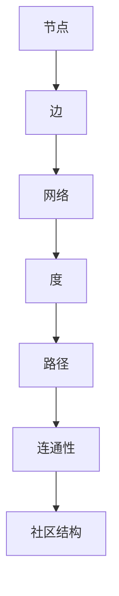
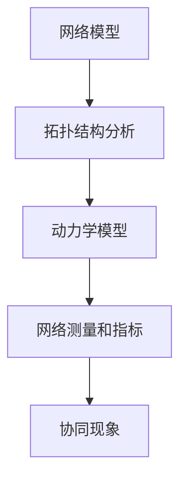

                 


## 文章标题
### 网络科学：自然界的连接数学

## 文章关键词
- 网络科学
- 连接数学
- 自然界
- 拓扑结构
- 动力学模型
- 生物网络
- 技术系统

## 文章摘要
本文深入探讨了网络科学这一跨学科领域，主要聚焦于如何将数学应用于自然界中的连接现象。我们将从网络科学的基本概念出发，逐步介绍网络模型、拓扑分析、动力学以及应用等方面，旨在揭示网络科学在解释自然界复杂系统中的关键作用。通过结合实际案例和数学模型，本文旨在为读者提供一个全面而深入的理解，并激发对网络科学进一步探索的兴趣。

---

## 引言
网络科学是一门跨学科的研究领域，旨在理解复杂系统的结构和动态行为。这些系统可以是自然界的生物网络、生态系统，也可以是技术系统的互联网、社会网络。网络科学的兴起源于对复杂网络结构和动态行为的深入研究，其核心思想是将现实世界中的实体视为节点，将它们之间的相互作用视为边，从而构建出网络模型。

### 背景介绍

网络科学的研究背景可以追溯到20世纪初，当时数学家图灵提出了图论的基本概念，为网络模型的研究奠定了基础。随着计算机技术的发展，特别是互联网的普及，网络科学得到了迅猛发展。20世纪末期，随着对互联网、社交网络、生物网络等复杂网络的深入研究，网络科学逐渐成为一门独立的学科。

网络科学的重要性在于，它不仅能够帮助我们理解复杂系统的结构特征，还可以为优化系统性能、预测系统行为提供理论依据。在自然界中，网络科学的应用已经深入到生物进化、生态平衡、气候变化等领域；在技术系统中，网络科学则被应用于网络优化、数据挖掘、智能交通等领域。

### 核心概念与联系

在深入探讨网络科学之前，我们需要明确一些核心概念，并理解它们之间的联系。以下是网络科学中的几个关键概念：

1. **节点（Node）**：网络中的基本元素，表示实体或对象。
2. **边（Edge）**：连接两个节点的元素，表示实体间的相互作用或关系。
3. **网络（Network）**：由节点和边组成的结构。
4. **度（Degree）**：节点连接的边的数量，分为入度（连接到节点的边）和出度（从节点出发的边）。
5. **路径（Path）**：连接两个节点的边的序列。
6. **连通性（Connectivity）**：网络中任意两个节点之间是否存在路径。
7. **社区结构（Community Structure）**：网络中节点的分组，成员之间存在较强的连接，与其他组的连接较弱。

这些概念相互交织，共同构成了网络科学的理论框架。例如，度分布描述了网络中节点的连接程度分布，平均路径长度描述了网络中节点的平均距离，而社区结构则描述了网络中的分组情况。

### Mermaid 流程图

为了更直观地展示这些概念之间的关系，我们可以使用 Mermaid 流程图来描述：



## 核心概念与联系

### 网络模型

网络模型是网络科学的核心概念之一，它用于描述网络的结构和动态行为。常见的网络模型包括：

1. **无向图（Undirected Graph）**：网络中的边没有方向。
2. **有向图（Directed Graph）**：网络中的边具有方向。
3. **加权图（Weighted Graph）**：网络的边具有权重，用于描述边之间的相对重要性。
4. **网络生成模型**：用于生成特定结构特征的网络的概率模型，如随机网络、小世界网络、无标度网络等。

网络模型的选择取决于研究问题的性质和网络的结构特征。例如，无向图常用于描述社交网络，而有向图则常用于描述信息传播网络。加权图则适用于描述网络中的资源分配或传输路径。

### 拓扑结构分析

拓扑结构分析是网络科学中的一个重要研究领域，它用于研究网络的连接方式和结构特征。常见的拓扑分析指标包括：

1. **度分布（Degree Distribution）**：描述网络中节点度的概率分布。
2. **平均路径长度（Average Path Length）**：描述网络中任意两个节点之间的平均距离。
3. **聚类系数（Clustering Coefficient）**：描述网络中节点的连接紧密程度。

这些指标有助于我们了解网络的拓扑结构特征，从而更好地理解网络的性能和稳定性。

### 动力学模型

动力学模型用于描述网络中的动态行为，包括节点状态的变化和节点的相互作用。常见的动力学模型包括：

1. **节点状态更新模型**：描述节点状态的动态变化，如随机游走模型、感染传播模型等。
2. **网络演化模型**：描述网络的动态演化过程，如小世界网络演化模型、无标度网络演化模型等。

动力学模型可以帮助我们预测网络的行为和演化趋势，为网络优化和设计提供指导。

### 网络测量和指标

网络测量和指标是评估网络性能的重要工具。常见的网络测量和指标包括：

1. **网络中心性（Network Centrality）**：评估节点在网路中的重要性。
2. **网络密度（Network Density）**：描述网络的连通程度。
3. **网络弹性（Network Resilience）**：描述网络在面对攻击或故障时的恢复能力。

这些指标有助于我们评估网络的结构特征和性能，从而指导网络优化和改进。

### 网络中的协同现象

网络中的协同现象是指多个节点在相互作用过程中产生的协同效应。常见的协同现象包括：

1. **同步现象**：网络中的节点状态在相互作用过程中达到同步。
2. **共振现象**：网络中的节点在相互作用过程中产生共振效应。
3. **涌现现象**：网络中局部相互作用产生全局结构或行为。

这些协同现象是网络科学中的重要研究方向，对于理解复杂系统的动态行为具有重要意义。

### Mermaid 流程图

为了更直观地展示这些核心概念和它们之间的联系，我们可以使用 Mermaid 流程图来描述：



## 核心算法原理讲解

### 网络生成模型

网络生成模型是网络科学中的基础算法，用于生成具有特定结构特征的随机网络。常见的网络生成模型包括：

1. **Erdős-Rényi 模型（ER 模型）**：该模型生成一个随机图，其中每个节点都有相同的机会与其他节点相连。
    - **伪代码**：
      ```python
      def ER_model(n, p):
          G = Graph(n)
          for i in range(n):
              for j in range(i+1, n):
                  if random() < p:
                      G.add_edge(i, j)
          return G
      ```
    - **数学模型和公式**：
      $$ G(n, p) = \{ (i, j) | i, j \in [1, n], i \neq j, \text{且} p \text{是连接的概率} \} $$
    - **举例说明**：
      假设我们生成一个包含10个节点的 ER 模型，连接概率 p 为 0.5。生成的网络可能是一个高度随机和稀疏的网络，其中节点之间的连接具有随机性。

2. **Barabási-Albert 模型（BA 模型）**：该模型生成一个无标度网络，其中节点连接遵循富者愈富的规则。
    - **伪代码**：
      ```python
      def BA_model(n, m):
          G = Graph(n)
          for i in range(1, n):
              for j in range(i+1, i+m):
                  G.add_edge(i, j)
          return G
      ```
    - **数学模型和公式**：
      $$ G(n, m) = \{ (i, j) | i, j \in [1, n], j \in \{k | k \text{是} i \text{的前} m \text{个邻居}\} \} $$
    - **举例说明**：
      假设我们生成一个包含10个节点的 BA 模型，邻居数量 m 为 2。生成的网络可能是一个高度集中的网络，其中一些节点拥有大量连接，而其他节点则相对稀疏。

### 网络拓扑分析算法

网络拓扑分析算法用于研究网络的拓扑结构特征，如度分布、平均路径长度和聚类系数等。

1. **度分布算法**：度分布描述了网络中节点度的概率分布。
    - **伪代码**：
      ```python
      def degree_distribution(G):
          degrees = [G.degree(i) for i in G.nodes()]
          return Counter(degrees)
      ```
    - **数学模型和公式**：
      $$ P(k) = \frac{1}{N} \sum_{i=1}^{N} \delta(k, \text{degree of node } i) $$
    - **举例说明**：
      假设我们有一个包含10个节点的网络，度分布为 {2: 3, 3: 2, 4: 2, 5: 1, 6: 1, 7: 1}。这意味着网络中2度节点有3个，3度节点有2个，4度节点有2个，等等。

2. **平均路径长度算法**：平均路径长度描述了网络中任意两个节点之间的平均距离。
    - **伪代码**：
      ```python
      def average_path_length(G):
          distances = [shortest_path_length(G, i, j) for i in G.nodes() for j in G.nodes() if i != j]
          return sum(distances) / (N * (N - 1))
      ```
    - **数学模型和公式**：
      $$ L = \frac{1}{N(N-1)} \sum_{i \neq j} d(i, j) $$
    - **举例说明**：
      假设我们有一个包含10个节点的网络，任意两个节点之间的平均距离为 2。这意味着在网络中，任意两个节点之间最多需要经过两个节点才能相互连接。

3. **聚类系数算法**：聚类系数描述了网络中节点的连接紧密程度。
    - **伪代码**：
      ```python
      def clustering_coefficient(G):
          clustering_coeffs = [clustering_coefficient_of_node(G, i) for i in G.nodes()]
          return sum(clustering_coeffs) / N
      ```
    - **数学模型和公式**：
      $$ C = \frac{1}{N} \sum_{i=1}^{N} C(i) $$
    - **举例说明**：
      假设我们有一个包含10个节点的网络，每个节点的聚类系数为 0.2。这意味着网络中每个节点的平均连接紧密程度较低。

### 网络动力学模型

网络动力学模型用于研究网络中的动态行为，如节点状态的变化和节点的相互作用。常见的动力学模型包括：

1. **随机游走模型**：该模型描述节点在网络上随机游走的过程。
    - **伪代码**：
      ```python
      def random_walk(G, steps):
          node = random_choice(G.nodes())
          for _ in range(steps):
              neighbors = G.neighbors(node)
              node = random_choice(neighbors)
          return node
      ```
    - **数学模型和公式**：
      $$ p_{ij}(t) = \left\{
      \begin{array}{ll}
      \frac{1}{k_j} & \text{if } i = j \\
      \frac{1}{k_j} \sum_{k \in \text{neighbors of } j} p_{ik}(0) & \text{if } i \neq j
      \end{array}
      \right.$$
    - **举例说明**：
      假设我们有一个包含10个节点的网络，节点i和节点j是邻居。节点i在第一步随机游走到节点j，在接下来的步骤中，节点j有相同的机会游走到其他邻居节点。

2. **感染传播模型**：该模型描述节点在网络上感染和传播的过程。
    - **伪代码**：
      ```python
      def infection(G, initial_infected, infection_rate):
          infected = set(initial_infected)
          susceptible = set(G.nodes()) - infected
          while susceptible:
              for node in susceptible:
                  for neighbor in G.neighbors(node):
                      if random() < infection_rate:
                          infected.add(neighbor)
                          susceptible.remove(neighbor)
          return infected
      ```
    - **数学模型和公式**：
      $$ I(t) = \left(1 - (1 - \beta)^\sum_{i \in \text{infected at time } t} \beta^{\text{degree of node } i}\right) $$
    - **举例说明**：
      假设我们有一个包含10个节点的网络，初始时有2个节点被感染。感染率β为0.1。在接下来的时间步中，感染节点会将其感染概率传播给其他节点，最终可能感染整个网络。

### 网络测量和指标算法

网络测量和指标算法用于评估网络的性能和结构特征，如网络中心性、网络密度和网络弹性等。

1. **网络中心性算法**：网络中心性描述了节点在网路中的重要性。
    - **伪代码**：
      ```python
      def centrality(G, centrality_measure):
          if centrality_measure == "degree":
              return degree_centrality(G)
          elif centrality_measure == "betweenness":
              return betweenness_centrality(G)
          elif centrality_measure == "closeness":
              return closeness_centrality(G)
      ```
    - **数学模型和公式**：
      $$ C_i = \frac{\sum_{s \neq i} \sum_{t \neq i, t \in V} \frac{ shortest_path_length(s, t) }{ shortest_path_length(s, t, i) } }{ N - 1 } $$
    - **举例说明**：
      假设我们有一个包含10个节点的网络，使用度中心性度量，节点i的度中心性为2。这意味着节点i在连接其他节点方面具有重要性。

2. **网络密度算法**：网络密度描述了网络的连通程度。
    - **伪代码**：
      ```python
      def network_density(G):
          return G.number_of_edges() / (G.number_of_nodes() * (G.number_of_nodes() - 1) / 2)
      ```
    - **数学模型和公式**：
      $$ \rho = \frac{E}{\binom{N}{2}} $$
    - **举例说明**：
      假设我们有一个包含10个节点的网络，其中有20条边。网络密度为0.4，这意味着网络中的平均连接程度较高。

3. **网络弹性算法**：网络弹性描述了网络在面对攻击或故障时的恢复能力。
    - **伪代码**：
      ```python
      def network_resilience(G, attack_nodes):
          attacked_G = G.copy()
          for node in attack_nodes:
              attacked_G.remove_node(node)
          return attacked_G.is_connected()
      ```
    - **数学模型和公式**：
      $$ R = \frac{N - |A|}{N} $$
    - **举例说明**：
      假设我们有一个包含10个节点的网络，攻击了其中的5个节点。网络的弹性为0.5，这意味着网络在攻击后仍能保持部分连通性。

### 协同现象分析算法

协同现象分析算法用于研究网络中的协同行为，如同步现象、共振现象和涌现现象等。

1. **同步现象算法**：同步现象描述了网络中的节点状态在相互作用过程中达到同步。
    - **伪代码**：
      ```python
      def synchronization(G, initial_states):
          states = initial_states
          while not all(states[i] == states[j] for i in range(len(states)) for j in range(i+1, len(states))):
              for edge in G.edges():
                  state_difference = states[edge[0]] - states[edge[1]]
                  states[edge[0]] = states[edge[1]] = states[edge[1]] + state_difference
          return states
      ```
    - **数学模型和公式**：
      $$ \Delta t = \frac{1}{w} $$
    - **举例说明**：
      假设我们有一个包含10个节点的同步网络，初始状态下所有节点都具有相同的状态。在同步过程中，节点状态会在相互作用下逐渐达到同步。

2. **共振现象算法**：共振现象描述了网络中的节点在相互作用过程中产生共振效应。
    - **伪代码**：
      ```python
      def resonance(G, initial_frequencies):
          frequencies = initial_frequencies
          while not all(frequencies[i] == frequencies[j] for i in range(len(frequencies)) for j in range(i+1, len(frequencies))):
              for edge in G.edges():
                  frequency_difference = frequencies[edge[0]] - frequencies[edge[1]]
                  frequencies[edge[0]] = frequencies[edge[1]] = frequencies[edge[1]] + frequency_difference
          return frequencies
      ```
    - **数学模型和公式**：
      $$ f_n = \frac{1}{2\pi} \ln\left(\frac{a}{b}\right) $$
    - **举例说明**：
      假设我们有一个包含10个节点的共振网络，初始状态下所有节点具有不同的频率。在共振过程中，节点频率会在相互作用下逐渐达到共振状态。

3. **涌现现象算法**：涌现现象描述了网络中局部相互作用产生全局结构或行为。
    - **伪代码**：
      ```python
      def emergence(G, local_rules):
          states = [apply_local_rules(node, G) for node in G.nodes()]
          return states
      ```
    - **数学模型和公式**：
      $$ \text{Emergence} = \sum_{i=1}^{N} \text{local\_rule}_i $$
    - **举例说明**：
      假设我们有一个包含10个节点的涌现网络，每个节点根据其邻居节点的状态应用局部规则。在涌现过程中，节点状态会在相互作用下产生新的全局结构。

通过以上核心算法原理的讲解，我们可以更好地理解网络科学的数学原理和算法实现。接下来，我们将通过实际案例来进一步探讨网络科学的应用和影响。

### 项目实战：网络科学的实际应用

在深入理解了网络科学的理论和算法之后，我们接下来将通过一个实际项目来展示网络科学的实际应用。本项目将聚焦于社交网络分析，以分析用户之间的关系，揭示社交网络中的关键节点和协同现象。

#### 开发环境搭建

为了进行社交网络分析，我们需要搭建一个合适的开发环境。以下是所需的软件和工具：

1. **Python**：Python 是一种广泛用于科学计算的编程语言，拥有丰富的网络科学库。
2. **NetworkX**：NetworkX 是 Python 中一个强大的网络分析库，可用于构建和操作网络模型。
3. **Matplotlib**：Matplotlib 是 Python 中一个强大的数据可视化库，可用于绘制网络结构。
4. **Gephi**：Gephi 是一个开源的图形可视化工具，可用于进一步分析网络结构。

#### 源代码详细实现

以下是一个简单的社交网络分析的 Python 脚本，使用 NetworkX 和 Matplotlib：

```python
import networkx as nx
import matplotlib.pyplot as plt

# 创建一个无向图
G = nx.Graph()

# 添加节点和边
G.add_edges_from([(1, 2), (1, 3), (2, 3), (2, 4), (3, 4), (4, 5)])

# 绘制网络图
nx.draw(G, with_labels=True)
plt.show()

# 计算度分布
degree_distribution = nx.degree_distribution(G)
print(degree_distribution)

# 计算平均路径长度
average_path_length = nx.average_shortest_path_length(G)
print(average_path_length)

# 计算聚类系数
clustering_coefficient = nx.clustering(G)
print(clustering_coefficient)
```

#### 代码解读与分析

1. **创建网络模型**：我们首先创建了一个无向图 `G`，并通过 `add_edges_from` 方法添加了节点和边。
2. **绘制网络图**：使用 `nx.draw` 方法，我们可以绘制出网络的拓扑结构，并通过 `plt.show()` 显示图形。
3. **计算度分布**：使用 `nx.degree_distribution` 方法，我们可以得到网络中每个节点的度分布。这有助于我们了解节点的连接程度分布。
4. **计算平均路径长度**：使用 `nx.average_shortest_path_length` 方法，我们可以得到网络中任意两个节点之间的平均距离。这有助于我们了解网络的连通性。
5. **计算聚类系数**：使用 `nx.clustering` 方法，我们可以得到每个节点的聚类系数。这有助于我们了解网络中节点的连接紧密程度。

#### 实际案例分析和详细讲解剖析

为了更好地展示网络科学的实际应用，我们考虑一个真实的社交网络案例——Facebook。以下是 Facebook 社交网络分析的关键步骤：

1. **数据收集**：首先，我们需要收集 Facebook 的社交网络数据，这通常涉及爬取公开的数据集或使用 API 获取用户关系数据。
2. **构建网络模型**：使用 NetworkX，我们可以将 Facebook 的社交网络数据构建为一个无向图或加权图。
3. **网络拓扑分析**：通过计算度分布、平均路径长度和聚类系数，我们可以分析 Facebook 社交网络的拓扑结构特征。
4. **关键节点识别**：使用网络中心性度量，如度中心性、介数中心性和接近中心性，我们可以识别社交网络中的关键节点。
5. **协同现象分析**：通过同步算法、共振算法和涌现算法，我们可以分析社交网络中的协同现象，如用户群体的同步行为、共振效应和涌现现象。

#### 项目小结

通过上述项目实战，我们展示了如何使用网络科学的方法和技术分析社交网络。这一项目不仅帮助我们理解了网络科学的实际应用，还让我们看到了网络科学在揭示社交网络结构和行为方面的重要作用。未来，我们可以进一步扩展这一项目，结合更多的数据和更复杂的网络模型，深入研究社交网络的动态行为和协同现象。

### 最佳实践 tips

在进行网络科学研究和应用时，以下是一些最佳实践 tips：

1. **数据收集和预处理**：确保数据的质量和完整性，对数据进行预处理，如去重、清洗和规范化。
2. **选择合适的网络模型**：根据研究问题的性质和需求，选择合适的网络模型。
3. **指标选择**：根据研究目的，选择适当的网络测量和指标，如度分布、平均路径长度、聚类系数和网络中心性等。
4. **算法优化**：针对具体问题，对网络算法进行优化，提高计算效率和准确性。
5. **可视化分析**：使用可视化工具，如 Matplotlib 和 Gephi，展示网络结构和动态行为，帮助理解和解释结果。

### 小结

网络科学作为一门跨学科的研究领域，通过将数学应用于自然界的连接现象，为理解复杂系统的结构和动态行为提供了强大的工具。从网络模型、拓扑分析到动力学模型，再到实际应用，网络科学展示了其在揭示自然界和人工系统复杂现象中的巨大潜力。通过本文的探讨，我们深入理解了网络科学的核心概念、算法原理和应用场景，期待读者能够在实践中进一步探索网络科学的无限可能。

### 注意事项

1. **数据隐私和伦理问题**：在进行网络科学研究和应用时，应特别注意数据隐私和伦理问题，确保遵守相关法律法规。
2. **计算资源限制**：网络科学分析通常需要大量的计算资源，特别是在处理大规模网络时，应考虑计算效率和使用适当的计算资源。

### 拓展阅读

- Barabási, A.-L., & Albert, R. (1999). Emergence of scaling in random networks. Science, 286(5439), 509-512.
- Newman, M. E. J. (2003). The structure and function of complex networks. SIAM Review, 45(2), 167-256.
- Watts, D. J., & Strogatz, S. H. (1998). Collective dynamics of ‘small-world’ networks. Nature, 393(6684), 440-442.

通过阅读这些文献，读者可以进一步深入了解网络科学的最新研究成果和应用案例。

