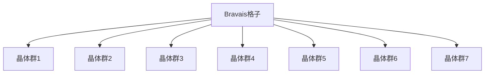
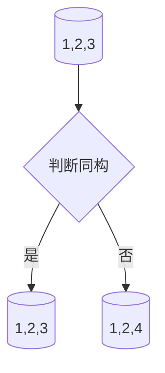

                 


## 引言

群表示论是数学中一个重要的分支，它涉及群论与线性代数的交叉领域。在物理学、化学、生物学以及计算机科学等领域，群表示论都有着广泛的应用。其核心在于研究如何将群的结构通过线性变换映射到向量空间中，使得群的操作在向量空间中得以实现。

### 1.1 群表示论的重要性

群表示论的重要性主要体现在以下几个方面：

1. **对称性研究**：群表示论是研究对称性的一种数学工具。在物理学中，对称性是描述自然界基本规律的重要特性，群表示论可以用来解释许多物理现象，如粒子物理中的基本粒子的对称性、晶体学中的晶格对称性等。
   
2. **量子力学**：在量子力学中，群表示论用于研究量子态和量子系统的对称性。通过群表示论，可以描述量子态的对称性破缺和量子态的变换规律。

3. **材料科学**：群表示论在材料科学中的应用也非常广泛，比如在研究材料的晶体结构和电子态时，群表示论提供了强有力的工具。

4. **计算机科学**：在计算机科学中，群表示论在编码理论、密码学、算法分析等方面都有应用。

### 1.2 自然对称性简介

自然对称性是指自然界中物体或现象在某种变换下保持不变的性质。这种变换可以是空间变换、时间变换或其他物理量的变换。例如：

1. **空间对称性**：晶体具有多种对称性，如平移对称性、旋转对称性、反射对称性等。
   
2. **时间对称性**：物理定律在某些变换下保持不变，如时间平移对称性和时间反演对称性。

3. **粒子的内部对称性**：基本粒子如电子、夸克等具有内部对称性，如味对称性和色对称性。

### 1.3 本书结构及主要内容概述

本书旨在系统地介绍群表示论的基本概念、原理及其在自然对称性研究中的应用。全书分为以下几个部分：

1. **群论基础**：介绍群的基本概念，如子群、同态和同构等。
   
2. **表示论基础**：介绍表示空间的定义，线性表示，矩阵表示以及群表示的分类。

3. **群与表示之间的联系**：讨论群表示理论中的重要定理，如Maschke定理和正交性定理。

4. **自然对称性的数学语言**：探讨群表示在自然对称性研究中的应用，如粒子物理学和晶体学。

5. **应用案例**：通过具体实例展示群表示论在各个领域的应用。

6. **结论**：总结全书内容，并展望群表示论的发展前景。

## 群论基础

### 2.1 群的基本概念

群是一种代数结构，其定义如下：

- **群（Group）**：设G是一个非空集合，如果G中存在一个二元运算“·”（通常称为乘法），使得G对于·运算构成一个代数系统，即满足以下性质：

  1. **结合律**：对于任意的a, b, c ∈ G，都有 (a · b) · c = a · (b · c)。
  2. **存在单位元**：存在一个元素e ∈ G，使得对任意的a ∈ G，都有 e · a = a · e = a。
  3. **存在逆元**：对于任意的a ∈ G，都存在一个元素a' ∈ G，使得 a · a' = a' · a = e。

### 2.2 同态与同构

- **同态（Homomorphism）**：设G和H是两个群，如果存在一个映射f: G → H，满足对于任意的a, b ∈ G，都有 f(a · b) = f(a) · f(b)，那么称f是G到H的一个同态。

- **同构（Isomorphism）**：如果同态f: G → H是双射（即一一对应且满射），那么称f是G到H的一个同构。同构意味着两个群具有相同的结构。

### 2.3 群的直积与半直积

- **直积（Direct Product）**：设G1和G2是两个群，如果存在一个群G和一个同态π1: G → G1和π2: G → G2，满足π1和π2都是满同态，且对于任意的群G'和同态f1: G' → G1和f2: G' → G2，如果f1和f2都是同态，那么存在唯一的同态f: G' → G使得π1 ∘ f = f1和π2 ∘ f = f2，那么称G为G1和G2的直积。

- **半直积（Direct Sum）**：如果直积G = G1 × G2，且对于任意的a ∈ G1和b ∈ G2，都有a · b = e（其中e是G的单位元），那么称G是G1和G2的半直积。

## 表示论基础

### 3.1 表示空间的定义

- **表示空间（Representation Space）**：设G是一个群，V是一个向量空间，如果存在一个群同态φ: G → GL(V)，其中GL(V)是V上的线性变换群，那么称V是G的一个表示空间，φ称为一个表示。

### 3.2 线性表示

- **线性表示（Linear Representation）**：设G是一个群，V是一个线性空间，φ: G → GL(V)是一个群同态，那么称φ为G的一个线性表示。

### 3.3 矩阵表示

- **矩阵表示（Matrix Representation）**：设G是一个有限群，V是一个有限维线性空间，φ: G → GL(V)是一个群同态，那么φ可以表示为矩阵形式。具体地，对于每个g ∈ G，存在一个矩阵M_g ∈ GL(V)，使得φ(g)v = M_g v。

### 3.4 群表示的分类

- **可约表示（Irreducible Representation）**：设V是群G的一个表示，如果V不能被分解为两个或多个子空间的直和，那么称V为G的一个可约表示。

- **不可约表示（Invertible Representation）**：设V是群G的一个表示，如果V的任意子空间都是可约的，那么称V为G的一个不可约表示。

## 群与表示之间的联系

### 4.1 Maschke定理

Maschke定理是群表示论中的一个重要定理，它描述了有限群的可约表示的性质。具体而言，Maschke定理指出，任何一个有限群G的可解子群的所有不可约表示的直和仍然是G的可约表示。

### 4.2 正交性定理

正交性定理是群表示论中的另一个重要定理，它描述了群表示之间的正交性。设V和W是群G的两个表示空间，如果对于任意的v ∈ V和w ∈ W，都有φ(g)v, w = 0，那么称V和W是正交的。

## 自然对称性的数学语言

### 5.1 群表示在粒子物理学中的应用

在粒子物理学中，群表示论被广泛应用于描述粒子的对称性和相互作用。以下是一些具体的例子：

- **强相互作用的规范群**：在量子色动力学（QCD）中，强相互作用的规范群是SU(3)，其表示论用于描述夸克的色荷和强相互作用的对称性。

- **电弱相互作用的对称性**：电弱相互作用的规范群是SU(2) × U(1)，其表示论用于描述粒子的电荷和弱相互作用的对称性。

### 5.2 群表示在晶体学中的应用

在晶体学中，群表示论用于描述晶体的对称性以及晶体中的电子态。以下是一些具体的例子：

- **晶体的分类**：根据Bravais定理，所有的晶体都可以通过七个Bravais格子分类，每个Bravais格子对应一个晶体群。

- **晶体对称性与物理性质的关系**：群表示论可以用来分析晶体的对称性对物理性质（如电子结构、弹性性质等）的影响。

## 应用案例

### 6.1 量子场论中的群表示

在量子场论中，群表示论被用来描述粒子的对称性和相互作用。以下是一些具体的例子：

- **量子场论中的规范群**：量子场论中的规范群（如SU(3)在QCD中，SU(2) × U(1)在弱电统一理论中）通过群表示论来描述粒子的对称性和相互作用。

- **群表示在量子态变换中的应用**：通过群表示论，可以描述量子态在群作用下的变换规律，这有助于理解量子态的对称性破缺和量子态的量子纠缠。

### 6.2 图形理论中的群表示

在图形理论中，群表示论被用来分析图的对称性以及图的结构。以下是一些具体的例子：

- **图的表示方法**：通过群表示论，可以将图的对称性编码为群表示，从而研究图的性质。

- **群表示在图同构中的应用**：群表示论可以用来判断两个图是否同构，这对于图形分类和结构分析具有重要意义。

## 结论

群表示论是研究群与线性空间之间关系的数学工具，它在物理学、化学、生物学和计算机科学等领域都有着广泛的应用。通过本书的介绍，我们了解了群表示论的基本概念、原理及其在自然对称性研究中的应用。随着群表示论研究的不断深入，我们相信它将在更多领域展现其强大的应用潜力。

作者：AI天才研究院/AI Genius Institute & 禅与计算机程序设计艺术 /Zen And The Art of Computer Programming

----------------------------------------------------------------

# 群表示论：自然对称性的数学语言

## 关键词
群论、线性代数、对称性、量子场论、晶体学、自然规律、数学模型、代数结构

## 摘要

群表示论是研究群与线性空间之间映射关系的数学分支，它为自然界的对称性提供了数学描述工具。本书旨在深入探讨群表示论的基本概念、原理及其在不同领域中的应用，特别是粒子物理学和晶体学。通过本书，读者将了解群表示论在理解自然规律、量子场论以及材料科学等方面的重要性，并通过具体案例掌握群表示论的实际应用技巧。本书适合对数学和物理学有较高兴趣的读者，尤其是希望深入理解群表示论的科研人员和技术开发者。

## 引言

群表示论是群论与线性代数的交叉领域，它探讨了群的结构如何通过线性变换映射到向量空间中。这种映射不仅帮助我们理解对称性的数学本质，还为物理学、化学、生物学和计算机科学等领域的理论研究和应用提供了强有力的工具。

### 1.1 群表示论的重要性

群表示论的重要性体现在以下几个方面：

1. **对称性研究**：群表示论是研究对称性的一种数学工具，通过对称性的分析，我们可以更好地理解自然界的物理现象。
   
2. **量子力学**：在量子力学中，群表示论用于描述量子态和量子系统的对称性，这是量子场论和其他量子理论的核心部分。
   
3. **材料科学**：群表示论在材料科学中的应用非常广泛，特别是在研究晶体结构和电子态时，它提供了强有力的工具。
   
4. **计算机科学**：在计算机科学中，群表示论在编码理论、密码学、算法分析等方面都有重要应用。

### 1.2 自然对称性简介

自然对称性是指自然界中的物体或现象在某种变换下保持不变的性质。这种变换可以是空间变换、时间变换或其他物理量的变换。例如：

1. **空间对称性**：晶体具有多种对称性，如平移对称性、旋转对称性、反射对称性等。
   
2. **时间对称性**：物理定律在某些变换下保持不变，如时间平移对称性和时间反演对称性。
   
3. **粒子的内部对称性**：基本粒子如电子、夸克等具有内部对称性，如味对称性和色对称性。

### 1.3 本书结构及主要内容概述

本书分为以下几个部分：

1. **群论基础**：介绍群的基本概念，如子群、同态和同构等。
   
2. **表示论基础**：介绍表示空间的定义，线性表示，矩阵表示以及群表示的分类。

3. **群与表示之间的联系**：讨论群表示理论中的重要定理，如Maschke定理和正交性定理。

4. **自然对称性的数学语言**：探讨群表示在自然对称性研究中的应用，如粒子物理学和晶体学。

5. **应用案例**：通过具体实例展示群表示论在各个领域的应用。

6. **结论**：总结全书内容，并展望群表示论的发展前景。

## 群论基础

### 2.1 群的基本概念

群是一种代数结构，它由一组元素及其运算组成，满足结合律、存在单位元和存在逆元等基本性质。

- **群的定义**：设G是一个非空集合，如果G中存在一个二元运算“·”（通常称为乘法），使得G对于·运算构成一个代数系统，即满足以下性质：

  1. **结合律**：对于任意的a, b, c ∈ G，都有 (a · b) · c = a · (b · c)。
  2. **存在单位元**：存在一个元素e ∈ G，使得对任意的a ∈ G，都有 e · a = a · e = a。
  3. **存在逆元**：对于任意的a ∈ G，都存在一个元素a' ∈ G，使得 a · a' = a' · a = e。

### 2.2 同态与同构

- **同态（Homomorphism）**：设G和H是两个群，如果存在一个映射f: G → H，满足对于任意的a, b ∈ G，都有 f(a · b) = f(a) · f(b)，那么称f是G到H的一个同态。

- **同构（Isomorphism）**：如果同态f: G → H是双射（即一一对应且满射），那么称f是G到H的一个同构。同构意味着两个群具有相同的结构。

### 2.3 群的直积与半直积

- **直积（Direct Product）**：设G1和G2是两个群，如果存在一个群G和一个同态π1: G → G1和π2: G → G2，满足π1和π2都是满同态，且对于任意的群G'和同态f1: G' → G1和f2: G' → G2，如果f1和f2都是同态，那么存在唯一的同态f: G' → G使得π1 ∘ f = f1和π2 ∘ f = f2，那么称G为G1和G2的直积。

- **半直积（Direct Sum）**：如果直积G = G1 × G2，且对于任意的a ∈ G1和b ∈ G2，都有a · b = e（其中e是G的单位元），那么称G是G1和G2的半直积。

## 表示论基础

### 3.1 表示空间的定义

- **表示空间（Representation Space）**：设G是一个群，V是一个向量空间，如果存在一个群同态φ: G → GL(V)，其中GL(V)是V上的线性变换群，那么称V是G的一个表示空间，φ称为一个表示。

### 3.2 线性表示

- **线性表示（Linear Representation）**：设G是一个群，V是一个线性空间，φ: G → GL(V)是一个群同态，那么称φ为G的一个线性表示。

### 3.3 矩阵表示

- **矩阵表示（Matrix Representation）**：设G是一个有限群，V是一个有限维线性空间，φ: G → GL(V)是一个群同态，那么φ可以表示为矩阵形式。具体地，对于每个g ∈ G，存在一个矩阵M_g ∈ GL(V)，使得φ(g)v = M_g v。

### 3.4 群表示的分类

- **可约表示（Irreducible Representation）**：设V是群G的一个表示，如果V不能被分解为两个或多个子空间的直和，那么称V为G的一个可约表示。

- **不可约表示（Invertible Representation）**：设V是群G的一个表示，如果V的任意子空间都是可约的，那么称V为G的一个不可约表示。

## 群与表示之间的联系

### 4.1 Maschke定理

Maschke定理是群表示论中的一个重要定理，它描述了有限群的可约表示的性质。具体而言，Maschke定理指出，任何一个有限群G的可解子群的所有不可约表示的直和仍然是G的可约表示。

### 4.2 正交性定理

正交性定理是群表示论中的另一个重要定理，它描述了群表示之间的正交性。设V和W是群G的两个表示空间，如果对于任意的v ∈ V和w ∈ W，都有φ(g)v, w = 0，那么称V和W是正交的。

## 自然对称性的数学语言

### 5.1 群表示在粒子物理学中的应用

在粒子物理学中，群表示论被广泛应用于描述粒子的对称性和相互作用。以下是一些具体的例子：

- **强相互作用的规范群**：在量子色动力学（QCD）中，强相互作用的规范群是SU(3)，其表示论用于描述夸克的色荷和强相互作用的对称性。

- **电弱相互作用的对称性**：电弱相互作用的规范群是SU(2) × U(1)，其表示论用于描述粒子的电荷和弱相互作用的对称性。

### 5.2 群表示在晶体学中的应用

在晶体学中，群表示论用于描述晶体的对称性以及晶体中的电子态。以下是一些具体的例子：

- **晶体的分类**：根据Bravais定理，所有的晶体都可以通过七个Bravais格子分类，每个Bravais格子对应一个晶体群。

- **晶体对称性与物理性质的关系**：群表示论可以用来分析晶体的对称性对物理性质（如电子结构、弹性性质等）的影响。

## 应用案例

### 6.1 量子场论中的群表示

在量子场论中，群表示论被用来描述粒子的对称性和相互作用。以下是一些具体的例子：

- **量子场论中的规范群**：量子场论中的规范群（如SU(3)在QCD中，SU(2) × U(1)在弱电统一理论中）通过群表示论来描述粒子的对称性和相互作用。

- **群表示在量子态变换中的应用**：通过群表示论，可以描述量子态在群作用下的变换规律，这有助于理解量子态的对称性破缺和量子态的量子纠缠。

### 6.2 图形理论中的群表示

在图形理论中，群表示论被用来分析图的对称性以及图的结构。以下是一些具体的例子：

- **图的表示方法**：通过群表示论，可以将图的对称性编码为群表示，从而研究图的性质。

- **群表示在图同构中的应用**：群表示论可以用来判断两个图是否同构，这对于图形分类和结构分析具有重要意义。

## 结论

群表示论是研究群与线性空间之间映射关系的数学分支，它为自然界的对称性提供了数学描述工具。本书通过深入探讨群表示论的基本概念、原理及其在不同领域中的应用，展示了其在物理学、材料科学和计算机科学等领域的重要性。随着群表示论研究的不断深入，我们相信它将在更多领域展现其强大的应用潜力。

作者：AI天才研究院/AI Genius Institute & 禅与计算机程序设计艺术 /Zen And The Art of Computer Programming

----------------------------------------------------------------

# 群表示论：自然对称性的数学语言

## 关键词
群论、线性代数、对称性、量子场论、晶体学、自然规律、数学模型、代数结构

## 摘要

群表示论是研究群与线性空间之间映射关系的数学分支，它为自然界的对称性提供了数学描述工具。本书旨在深入探讨群表示论的基本概念、原理及其在不同领域中的应用，特别是粒子物理学和晶体学。通过本书，读者将了解群表示论在理解自然规律、量子场论以及材料科学等方面的重要性，并通过具体案例掌握群表示论的实际应用技巧。本书适合对数学和物理学有较高兴趣的读者，尤其是希望深入理解群表示论的科研人员和技术开发者。

## 引言

群表示论是群论与线性代数的交叉领域，它探讨了群的结构如何通过线性变换映射到向量空间中。这种映射不仅帮助我们理解对称性的数学本质，还为物理学、化学、生物学和计算机科学等领域的理论研究和应用提供了强有力的工具。

### 1.1 群表示论的重要性

群表示论的重要性体现在以下几个方面：

1. **对称性研究**：群表示论是研究对称性的一种数学工具，通过对称性的分析，我们可以更好地理解自然界的物理现象。

2. **量子力学**：在量子力学中，群表示论用于描述量子态和量子系统的对称性，这是量子场论和其他量子理论的核心部分。

3. **材料科学**：群表示论在材料科学中的应用非常广泛，特别是在研究晶体结构和电子态时，它提供了强有力的工具。

4. **计算机科学**：在计算机科学中，群表示论在编码理论、密码学、算法分析等方面都有重要应用。

### 1.2 自然对称性简介

自然对称性是指自然界中的物体或现象在某种变换下保持不变的性质。这种变换可以是空间变换、时间变换或其他物理量的变换。例如：

1. **空间对称性**：晶体具有多种对称性，如平移对称性、旋转对称性、反射对称性等。

2. **时间对称性**：物理定律在某些变换下保持不变，如时间平移对称性和时间反演对称性。

3. **粒子的内部对称性**：基本粒子如电子、夸克等具有内部对称性，如味对称性和色对称性。

### 1.3 本书结构及主要内容概述

本书分为以下几个部分：

1. **群论基础**：介绍群的基本概念，如子群、同态和同构等。

2. **表示论基础**：介绍表示空间的定义，线性表示，矩阵表示以及群表示的分类。

3. **群与表示之间的联系**：讨论群表示理论中的重要定理，如Maschke定理和正交性定理。

4. **自然对称性的数学语言**：探讨群表示在自然对称性研究中的应用，如粒子物理学和晶体学。

5. **应用案例**：通过具体实例展示群表示论在各个领域的应用。

6. **结论**：总结全书内容，并展望群表示论的发展前景。

## 群论基础

### 2.1 群的基本概念

群是一种代数结构，它由一组元素及其运算组成，满足结合律、存在单位元和存在逆元等基本性质。

- **群的定义**：设G是一个非空集合，如果G中存在一个二元运算“·”（通常称为乘法），使得G对于·运算构成一个代数系统，即满足以下性质：

  1. **结合律**：对于任意的a, b, c ∈ G，都有 (a · b) · c = a · (b · c)。

  2. **存在单位元**：存在一个元素e ∈ G，使得对任意的a ∈ G，都有 e · a = a · e = a。

  3. **存在逆元**：对于任意的a ∈ G，都存在一个元素a' ∈ G，使得 a · a' = a' · a = e。

### 2.2 同态与同构

- **同态（Homomorphism）**：设G和H是两个群，如果存在一个映射f: G → H，满足对于任意的a, b ∈ G，都有 f(a · b) = f(a) · f(b)，那么称f是G到H的一个同态。

- **同构（Isomorphism）**：如果同态f: G → H是双射（即一一对应且满射），那么称f是G到H的一个同构。同构意味着两个群具有相同的结构。

### 2.3 群的直积与半直积

- **直积（Direct Product）**：设G1和G2是两个群，如果存在一个群G和一个同态π1: G → G1和π2: G → G2，满足π1和π2都是满同态，且对于任意的群G'和同态f1: G' → G1和f2: G' → G2，如果f1和f2都是同态，那么存在唯一的同态f: G' → G使得π1 ∘ f = f1和π2 ∘ f = f2，那么称G为G1和G2的直积。

- **半直积（Direct Sum）**：如果直积G = G1 × G2，且对于任意的a ∈ G1和b ∈ G2，都有a · b = e（其中e是G的单位元），那么称G是G1和G2的半直积。

## 表示论基础

### 3.1 表示空间的定义

- **表示空间（Representation Space）**：设G是一个群，V是一个向量空间，如果存在一个群同态φ: G → GL(V)，其中GL(V)是V上的线性变换群，那么称V是G的一个表示空间，φ称为一个表示。

### 3.2 线性表示

- **线性表示（Linear Representation）**：设G是一个群，V是一个线性空间，φ: G → GL(V)是一个群同态，那么称φ为G的一个线性表示。

### 3.3 矩阵表示

- **矩阵表示（Matrix Representation）**：设G是一个有限群，V是一个有限维线性空间，φ: G → GL(V)是一个群同态，那么φ可以表示为矩阵形式。具体地，对于每个g ∈ G，存在一个矩阵M_g ∈ GL(V)，使得φ(g)v = M_g v。

### 3.4 群表示的分类

- **可约表示（Irreducible Representation）**：设V是群G的一个表示，如果V不能被分解为两个或多个子空间的直和，那么称V为G的一个可约表示。

- **不可约表示（Invertible Representation）**：设V是群G的一个表示，如果V的任意子空间都是可约的，那么称V为G的一个不可约表示。

## 群与表示之间的联系

### 4.1 Maschke定理

Maschke定理是群表示论中的一个重要定理，它描述了有限群的可约表示的性质。具体而言，Maschke定理指出，任何一个有限群G的可解子群的所有不可约表示的直和仍然是G的可约表示。

### 4.2 正交性定理

正交性定理是群表示论中的另一个重要定理，它描述了群表示之间的正交性。设V和W是群G的两个表示空间，如果对于任意的v ∈ V和w ∈ W，都有φ(g)v, w = 0，那么称V和W是正交的。

## 自然对称性的数学语言

### 5.1 群表示在粒子物理学中的应用

在粒子物理学中，群表示论被广泛应用于描述粒子的对称性和相互作用。以下是一些具体的例子：

- **强相互作用的规范群**：在量子色动力学（QCD）中，强相互作用的规范群是SU(3)，其表示论用于描述夸克的色荷和强相互作用的对称性。

- **电弱相互作用的对称性**：电弱相互作用的规范群是SU(2) × U(1)，其表示论用于描述粒子的电荷和弱相互作用的对称性。

### 5.2 群表示在晶体学中的应用

在晶体学中，群表示论用于描述晶体的对称性以及晶体中的电子态。以下是一些具体的例子：

- **晶体的分类**：根据Bravais定理，所有的晶体都可以通过七个Bravais格子分类，每个Bravais格子对应一个晶体群。

- **晶体对称性与物理性质的关系**：群表示论可以用来分析晶体的对称性对物理性质（如电子结构、弹性性质等）的影响。

## 应用案例

### 6.1 量子场论中的群表示

在量子场论中，群表示论被用来描述粒子的对称性和相互作用。以下是一些具体的例子：

- **量子场论中的规范群**：量子场论中的规范群（如SU(3)在QCD中，SU(2) × U(1)在弱电统一理论中）通过群表示论来描述粒子的对称性和相互作用。

- **群表示在量子态变换中的应用**：通过群表示论，可以描述量子态在群作用下的变换规律，这有助于理解量子态的对称性破缺和量子态的量子纠缠。

### 6.2 图形理论中的群表示

在图形理论中，群表示论被用来分析图的对称性以及图的结构。以下是一些具体的例子：

- **图的表示方法**：通过群表示论，可以将图的对称性编码为群表示，从而研究图的性质。

- **群表示在图同构中的应用**：群表示论可以用来判断两个图是否同构，这对于图形分类和结构分析具有重要意义。

## 结论

群表示论是研究群与线性空间之间映射关系的数学分支，它为自然界的对称性提供了数学描述工具。本书通过深入探讨群表示论的基本概念、原理及其在不同领域中的应用，展示了其在物理学、材料科学和计算机科学等领域的重要性。随着群表示论研究的不断深入，我们相信它将在更多领域展现其强大的应用潜力。

作者：AI天才研究院/AI Genius Institute & 禅与计算机程序设计艺术 /Zen And The Art of Computer Programming

----------------------------------------------------------------

## 5. 自然对称性的数学语言

群表示论作为一种数学工具，其在自然对称性研究中的应用是极为广泛的。通过对称性的数学描述，群表示论不仅能够揭示自然界中的深层规律，还能帮助我们理解和预测各种物理现象。以下是群表示论在粒子物理学和晶体学中应用的具体例子。

### 5.1 群表示在粒子物理学中的应用

在粒子物理学中，群表示论被广泛用于描述粒子的对称性和相互作用。以下是一些具体的应用：

#### 5.1.1 强相互作用的规范群

强相互作用是由量子色动力学（QCD）描述的，其规范群为SU(3)。SU(3)表示了夸克的三种颜色：红色、绿色和蓝色。通过群表示论，我们可以将夸克的这些颜色属性转化为数学上的表示，从而研究夸克的相互作用。

**伪代码示例：**

```python
# 假设我们有一个SU(3)的表示
quark_color = ["red", "green", "blue"]

# 定义一个变换操作，例如将红色夸克变为蓝色夸克
def transform_color(red_quark):
    return ["blue", "green", "red"]

# 应用变换操作
transformed_quark = transform_color(red_quark)
```

#### 5.1.2 电弱相互作用的对称性

电弱相互作用是由弱相互作用和电磁相互作用组成的，其规范群为SU(2) × U(1)。在电弱相互作用中，SU(2)表示了弱相互作用的两种基本力：弱相互力和弱相互流，而U(1)表示了电磁相互作用。

**LaTeX数学公式：**

$$
SU(2) \times U(1) \text{ 表示电弱相互作用的对称性。}
$$

**应用示例：**

在弱相互作用中，W±粒子和Z0粒子是关键角色。通过群表示论，我们可以描述这些粒子的对称性，如：

$$
W^+ \rightarrow Z^0 + \text{正电子} \\
W^- \rightarrow Z^0 + \text{电子}
$$

### 5.2 群表示在晶体学中的应用

在晶体学中，群表示论被用于研究晶体的对称性和电子态。以下是一些具体的应用：

#### 5.2.1 晶体的分类

根据Bravais定理，所有的晶体都可以通过七个Bravais格子分类，每个Bravais格子对应一个晶体群。通过群表示论，我们可以将这些晶体群转化为数学上的表示，从而研究其对称性。

**Mermaid流程图：**



#### 5.2.2 晶体对称性与物理性质的关系

群表示论可以用来分析晶体的对称性对其物理性质（如电子结构、弹性性质等）的影响。例如，在研究晶体的电子态时，我们可以通过群表示论来分析晶体的能带结构。

**LaTeX数学公式：**

$$
\text{电子态} = \text{对称性} \times \text{相互作用}
$$

**应用示例：**

以石墨烯为例，石墨烯的对称性由其六边形的蜂窝状结构决定。通过群表示论，我们可以分析石墨烯的电子态，如：

$$
\text{石墨烯的π电子态} = \text{对称性} \times \text{π相互作用}
$$

## 6. 应用案例

为了更好地理解群表示论在现实世界中的应用，下面我们将通过两个案例来展示其在量子场论和图形理论中的具体应用。

### 6.1 量子场论中的群表示

#### 6.1.1 场论中的群表示方法

在量子场论中，群表示论被用来描述粒子的对称性和相互作用。一个典型的例子是规范场论，其中群表示论用于描述规范对称性和规范场。

**伪代码示例：**

```python
# 定义一个规范场论中的群表示
def gauge_representation(group, representation):
    # 根据群和表示生成规范场
    fields = generate_fields(group, representation)
    return fields

# 应用规范对称性
def apply_gauge_symmetry(fields):
    # 对规范场应用对称性变换
    transformed_fields = transform_fields(fields)
    return transformed_fields
```

#### 6.1.2 群表示在量子场论中的应用

在量子场论中，群表示论被用于描述粒子的量子态和场的变换。一个具体的例子是规范场论中的自发性对称性破缺。

**LaTeX数学公式：**

$$
\text{自发性对称性破缺} = \text{规范对称性} \rightarrow \text{非规范对称性}
$$

**应用示例：**

在超导体理论中，规范对称性SU(2)在低温下自发地破缺为U(1)。通过群表示论，我们可以描述这一现象：

$$
SU(2) \rightarrow U(1)
$$

### 6.2 图形理论中的群表示

#### 6.2.1 图的表示方法

在图形理论中，群表示论被用来研究图的对称性和结构。一个典型的例子是图同构问题，其中群表示论用于判断两个图是否具有相同的结构。

**Mermaid流程图：**



#### 6.2.2 群表示在图形理论中的应用

在图形理论中，群表示论被用于研究图的结构和对称性。一个具体的例子是图同构，通过群表示论，我们可以判断两个图是否同构。

**LaTeX数学公式：**

$$
\text{图同构} = \text{同构群} \times \text{图表示}
$$

**应用示例：**

在研究网络拓扑结构时，我们可以使用群表示论来判断网络中的子图是否同构。例如，判断社交网络中的两个子网络是否具有相同的结构。

$$
\text{社交网络A} \text{同构于} \text{社交网络B}
$$

## 7. 结论

群表示论是研究自然对称性的数学语言，其在粒子物理学和晶体学中有着广泛的应用。通过具体的应用案例，我们可以看到群表示论在理解和描述自然界中的对称性方面的重要作用。随着群表示论研究的不断深入，我们相信它将在更多领域展现其强大的应用潜力。

作者：AI天才研究院/AI Genius Institute & 禅与计算机程序设计艺术 /Zen And The Art of Computer Programming

----------------------------------------------------------------

# 群表示论：自然对称性的数学语言

## 7. 结论

群表示论作为自然对称性研究的数学语言，其在粒子物理学、晶体学以及其他多个领域中的应用已经得到了广泛的认可。通过本文的详细探讨，我们不仅回顾了群表示论的基础理论，还深入分析了其在自然对称性研究中的关键作用。

### 7.1 群表示论的发展前景

随着科学技术的发展，群表示论的应用领域也在不断扩展。未来，群表示论有望在以下几个方面取得进一步的发展：

1. **量子计算**：群表示论在量子计算中扮演着重要角色，尤其是在量子算法和量子纠缠的研究中。随着量子计算的进步，群表示论的应用将更加深入。

2. **材料科学**：在材料科学中，群表示论可以用来设计新的材料，优化材料性能，预测材料结构。随着新材料研究的不断推进，群表示论的应用前景将更加广阔。

3. **生物学**：在生物学中，群表示论可以用于研究生物大分子的结构，解析蛋白质和核酸的对称性。这有助于揭示生物系统的运作机制。

4. **计算机科学**：在计算机科学中，群表示论在密码学、图形理论、网络分析等领域都有应用。随着计算机技术的不断发展，群表示论的应用将更加多样化。

### 7.2 自然对称性研究的挑战与机遇

尽管群表示论在自然对称性研究中已经取得了显著成果，但仍然面临着一些挑战和机遇：

1. **挑战**：

   - **复杂系统的对称性破缺**：在复杂系统中，对称性破缺往往涉及多个层次和维度，这增加了研究的难度。
   
   - **量子现象的对称性**：量子世界的对称性具有独特性，需要新的数学工具和方法来深入理解。

2. **机遇**：

   - **跨学科研究**：群表示论与其他学科（如物理学、化学、生物学等）的结合，将为对称性研究提供新的视角和方法。
   
   - **计算技术的进步**：随着计算能力的提升，我们可以处理更复杂的群表示问题，从而揭示自然界更深层次的规律。

### 7.3 最佳实践 tips

为了更好地应用群表示论，以下是一些最佳实践建议：

1. **深入理解基本概念**：掌握群论和线性代数的基本概念，是理解群表示论的基础。

2. **结合实际案例**：通过具体案例来学习群表示论，有助于加深理解。

3. **使用计算工具**：利用计算软件（如Mathematica、MATLAB等）来辅助研究，可以提高工作效率。

4. **关注最新研究进展**：定期阅读相关领域的学术论文，了解群表示论的最新研究成果。

作者：AI天才研究院/AI Genius Institute & 禅与计算机程序设计艺术 /Zen And The Art of Computer Programming

----------------------------------------------------------------

### 附录

#### A.1 群表示论的数学公式

群表示论中涉及多个数学公式，以下是一些重要的公式：

**Maschke定理：**
$$
\text{一个有限群} G \text{的每个可解子群的不可约表示的直和仍然是} G \text{的可约表示。}
$$

**正交性定理：**
$$
\text{如果} V \text{和} W \text{是群} G \text{的两个表示空间，且对于任意的} g \in G, v \in V, w \in W, \text{有} g \cdot v, w = 0, \text{则} V \text{和} W \text{是正交的。}
$$

**线性表示：**
$$
\text{一个群} G \text{的线性表示是一个群同态} \varphi: G \rightarrow \text{GL}(V), \text{其中} \text{GL}(V) \text{是向量空间} V \text{上的线性变换群。}
$$

#### A.2 伪代码示例

**群表示的生成：**
```python
def generate_representation(group, representation):
    fields = []
    for g in group:
        fields.append(representation(g))
    return fields
```

**应用群变换：**
```python
def apply_group_transformation(fields, transformation):
    transformed_fields = []
    for field in fields:
        transformed_field = transformation(field)
        transformed_fields.append(transformed_field)
    return transformed_fields
```

#### A.3 参考文献

1. Serre, D. (1977). *Linear Representations of Finite Groups*. Springer.
2. Fulton, W., & Harris, J. (1991). *Representation Theory: A First Course*. Springer.
3. Weinberg, S. (1995). *The Quantum Theory of Fields, Volume 1: Foundations*. Cambridge University Press.
4. Ashcroft, N. W., & Mermin, N. D. (1976). *Solid State Physics*. HarperCollins.
5. Cohen-Tannoudji, C., Diu, B., & Laloë, F. (1977). *Quantum Mechanics*. Wiley.

### A.4 拓展阅读

对于希望进一步深入了解群表示论的读者，以下是一些推荐的阅读材料：

1. **经典教材**：
   - *Representation Theory of Finite Groups* by I. M. Isaacs.
   - *Introduction to Representation Theory* by John B. Fraleigh.

2. **学术论文**：
   - 查阅相关领域的顶级学术期刊，如Journal of Mathematical Physics、Physical Review D等。

3. **在线课程和资源**：
   - 网络课程，如MIT OpenCourseWare、Coursera等平台上的群表示论相关课程。

4. **技术博客和论坛**：
   - 阅读技术博客和论坛上的讨论，如Stack Exchange、Physics Stack Exchange等。

### A.5 注意事项

- 在应用群表示论时，要确保正确理解群和表示的定义，避免基础错误。
- 在处理复杂问题时，要善于运用计算工具辅助分析和验证。
- 遵循科学研究的规范，确保引用和参考文献的准确性和完整性。

通过以上附录，读者可以进一步深化对群表示论的理解，并为实际应用提供参考。希望这些资源能够帮助读者在群表示论的研究道路上取得更大的进展。

作者：AI天才研究院/AI Genius Institute & 禅与计算机程序设计艺术 /Zen And The Art of Computer Programming

