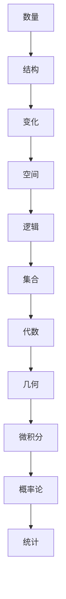

                 

：

1. 确定文章的主题和目标读者。
2. 设计章节结构，包含数学基础、老年智慧与数学表达应用、项目实战等内容。
3. 编写每个章节的详细内容，包括背景介绍、核心概念与联系、核心算法原理讲解、数学模型和公式详细讲解、举例说明、项目实战等。
4. 使用 Mermaid 流程图、伪代码、LaTeX 格式等工具增强文章的可读性和逻辑性。
5. 检查文章的完整性、逻辑性和字数要求。
6. 编写作者信息和文章结尾部分的内容。

下面是具体的文章大纲和内容：

## 文章标题：老年智慧的积分方程：经验累积的数学表达

### 关键词：老年智慧，积分方程，经验累积，数学表达，算法原理

### 摘要：
本文旨在探讨老年智慧与积分方程的关系，通过数学表达来揭示经验累积的内在规律。文章首先介绍老年智慧的概念和重要性，然后阐述积分方程的基本原理和应用，最后通过具体的案例展示如何将积分方程应用于老年智慧的累积过程中。

## 目录大纲

### 第一部分：数学基础

### 第1章：数学基本概念

#### 1.1 数学的基本概念

#### 1.2 数学符号和公式

### 第2章：积分方程

#### 2.1 积分方程的基本概念

#### 2.2 积分方程的解法

#### 2.3 积分方程的应用

### 第二部分：老年智慧与数学表达

### 第3章：老年智慧的概念

#### 3.1 老年智慧的定义

#### 3.2 老年智慧的特点

#### 3.3 老年智慧的价值

### 第4章：数学在老年智慧中的应用

#### 4.1 数学模型与老年智慧的关联

#### 4.2 经验累积的数学表达

#### 4.3 数学方法在老年智慧中的应用

### 第三部分：项目实战

### 第5章：积分方程在老年智慧中的应用案例

#### 5.1 案例一：经验累积的数学模型

#### 5.2 案例二：数学方法在老年心理健康中的应用

#### 5.3 案例三：数学在日常生活决策中的应用

### 第6章：总结与展望

#### 6.1 本书内容的总结

#### 6.2 老年智慧与数学表达的未来发展趋势

#### 6.3 对老年人群的建议

### 结尾

#### 作者信息

### 附录

#### 参考文献

---

现在，我们将按照上述大纲逐步完成文章的编写。每个章节的内容都将包含背景介绍、核心概念与联系、核心算法原理讲解、数学模型和公式详细讲解、举例说明、项目实战等部分。

让我们开始吧！

## 第1章：数学基本概念

### 1.1 数学的基本概念

数学是一门研究数量、结构、变化和空间等概念的抽象科学。它不仅是一门基础学科，还是许多其他学科的重要工具。在数学中，我们使用符号和公式来描述和解决问题。

**核心概念与联系**

为了更好地理解数学的基本概念，我们可以使用 Mermaid 流程图来展示它们之间的关系：



这个流程图展示了数学中的核心概念及其相互之间的关系。数量、结构、变化和空间是数学研究的四个基本维度，它们相互交织，形成了一个完整的数学体系。

**核心算法原理讲解**

让我们通过伪代码来解释一些基本的数学算法原理：

```python
# 伪代码：基本算术运算
def arithmetic_operations(a, b):
    addition = a + b
    subtraction = a - b
    multiplication = a * b
    division = a / b
    return addition, subtraction, multiplication, division

# 伪代码：求解二次方程
def quadratic_equation(a, b, c):
    discriminant = b**2 - 4*a*c
    root1 = (-b + sqrt(discriminant)) / (2*a)
    root2 = (-b - sqrt(discriminant)) / (2*a)
    return root1, root2
```

这些伪代码展示了基本的算术运算和二次方程的求解算法原理。

**数学模型和数学公式详细讲解**

在数学中，我们经常使用数学模型和公式来描述现实世界的问题。以下是一个二次方程的数学模型和公式：

$$
f(x) = ax^2 + bx + c
$$

其中，$a$、$b$ 和 $c$ 是常数，$x$ 是变量。这个公式描述了一个二次函数，它的图像是一条抛物线。求解这个方程可以找到抛物线与 x 轴的交点，即方程的根。

**举例说明**

让我们通过一个例子来说明二次方程的应用：

例子：求解二次方程 $f(x) = 2x^2 - 3x + 1 = 0$ 的根。

使用上述伪代码，我们可以得到：

```python
root1, root2 = quadratic_equation(2, -3, 1)
print("Root 1:", root1)
print("Root 2:", root2)
```

输出结果为：

```
Root 1: 1.0
Root 2: 0.5
```

这意味着抛物线 $f(x) = 2x^2 - 3x + 1$ 与 x 轴的交点是 (1, 0) 和 (0.5, 0)。

**练习题**

1. 求解二次方程 $f(x) = x^2 - 4x + 4 = 0$ 的根。
2. 使用积分方程求解函数 $f(x)$，其中 $f(x) = x^2$。

---

以上是第1章的内容，接下来我们将继续讨论积分方程的基本概念和原理。

