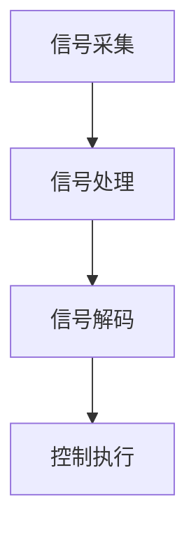

                 

## 脑机接口与外骨骼技术：扩展人类感知与交互能力的前沿

### 关键词

- **脑机接口（Brain-Computer Interface, BCI）**
- **外骨骼（Exoskeleton）**
- **感知扩展（Perceptual Extension）**
- **交互能力（Interactivity）**
- **人工智能（Artificial Intelligence, AI）**
- **生物力学（Biomechanics）**

### 摘要

脑机接口（BCI）与外骨骼技术正迅速发展成为两个前沿领域，它们共同的目标是扩展人类的感知与交互能力。脑机接口通过直接连接大脑与外部设备，实现了对人类意识、思维和感知的控制；而外骨骼则通过增强人体运动能力，提高了人类在行动、康复和劳动中的效率。本文将深入探讨这两项技术的核心概念、工作原理、关键技术以及它们在实际应用中的案例和未来发展趋势。通过详细的解析和示例，本文旨在提供一个全面的技术解读，帮助读者理解脑机接口与外骨骼技术如何共同塑造未来的人类交互模式。

## 第一部分 脑机接口技术基础

脑机接口（Brain-Computer Interface, BCI）是一种直接连接大脑与外部设备的技术，它通过解码大脑产生的神经信号来控制计算机或其他电子设备。这一技术的出现，不仅为传统的计算机控制方式带来了革命性的改变，还极大地扩展了人类的感知与交互能力。

### 第1章 脑机接口概述

#### 1.1 脑机接口的基本概念

脑机接口的定义可以追溯到其核心功能，即通过捕捉和解读大脑活动来控制外部设备。这种技术最早在20世纪60年代由美国科学家Joseph Engelberg等人提出。当时，他们的研究主要集中在利用电生理学技术记录大脑电信号，并通过这些信号来控制简单的电子设备。

脑机接口的应用领域非常广泛，涵盖了医疗、康复、辅助通信、娱乐等多个方面。在医疗领域，脑机接口被用于帮助患有运动障碍的患者进行日常活动；在康复领域，它帮助患者恢复运动能力；在辅助通信领域，脑机接口为无法使用传统交流方式的人提供了新的交流途径；在娱乐领域，脑机接口则使得虚拟现实和增强现实体验更加真实和互动。

#### 1.2 脑机接口的工作原理

脑机接口的工作原理可以简化为四个主要步骤：信号采集、信号处理、信号解码和控制执行。

1. **信号采集**：这一步骤的核心任务是捕捉大脑产生的神经信号。常用的方法包括脑电图（EEG）、功能性磁共振成像（fMRI）、脑磁图（MEG）和脑电图（ECOG）等。这些技术可以无创或有创地记录大脑的活动，从而获得神经信号。

2. **信号处理**：采集到的原始信号通常噪声较大，难以直接使用。因此，需要通过信号处理技术进行预处理，包括滤波、去噪、放大等步骤，以提高信号的质量和可靠性。

3. **信号解码**：经过处理的信号需要被解码，以提取出有用的信息。这一步骤通常涉及到机器学习和信号处理算法，如支持向量机（SVM）、神经网络（NN）和递归神经网络（RNN）等。

4. **控制执行**：解码后的信号被转换为控制指令，用于控制外部设备。这些指令可以是简单的开关动作，也可以是复杂的动作序列，如操作轮椅、控制假肢或操纵虚拟现实中的物体。

#### 1.3 脑机接口的技术挑战

尽管脑机接口技术在近年来取得了显著进展，但仍然面临许多技术挑战。

1. **信号噪声处理**：如何有效地去除噪声，提高信号质量，是一个长期的研究课题。噪声的存在会严重影响信号解码的准确性。

2. **解码算法优化**：如何设计更有效的解码算法，以提高解码的精度和速度，是另一个关键问题。现有的解码算法，如基于统计学习的算法，虽然已经取得了不错的效果，但仍然有较大的改进空间。

3. **实时性能提升**：脑机接口需要实时响应大脑信号，这对设备的计算能力和响应速度提出了高要求。如何实现低延迟、高精度的实时控制，是一个亟待解决的问题。

### 第2章 脑机接口的关键技术

脑机接口技术的实现涉及到多个关键组件和技术的协同工作。下面将详细介绍这些关键技术。

#### 2.1 信号采集技术

信号采集技术是脑机接口技术的核心，决定了信号的准确性和可靠性。以下是几种常用的信号采集技术：

1. **脑电图（EEG）**：脑电图通过放置在头皮上的电极记录大脑的电活动。它是一种无创、实时、便携的技术，常用于脑机接口的研究和应用。

2. **功能性磁共振成像（fMRI）**：fMRI通过检测大脑中的血液流动变化来推测大脑活动。它具有较高的空间分辨率，但设备昂贵，操作复杂。

3. **脑磁图（MEG）**：脑磁图通过检测大脑产生的磁场来记录大脑活动。它具有更高的时间分辨率，但受到磁场干扰的影响。

4. **脑电图（ECOG）**：ECOG是通过在手术中直接植入大脑中的电极来记录电活动。它具有较高的空间分辨率，但是一种有创技术。

#### 2.2 信号处理技术

信号处理技术在脑机接口中起着至关重要的作用。它主要包括以下几个步骤：

1. **滤波**：滤波是一种常用的信号处理技术，用于去除信号中的高频和低频噪声。常见的滤波方法包括带通滤波、低通滤波和高通滤波。

2. **去噪**：去噪技术用于进一步降低信号中的噪声。常用的去噪方法包括傅里叶变换（Fourier Transform）和小波变换（Wavelet Transform）。

3. **特征提取**：特征提取是将原始信号转换为特征向量，以便于后续的解码和处理。常用的特征提取方法包括时域特征提取和频域特征提取。

4. **降维**：降维技术用于减少特征向量的维度，从而提高计算效率和准确性。常用的降维方法包括主成分分析（PCA）和线性判别分析（LDA）。

#### 2.3 控制执行技术

控制执行技术是将解码后的信号转换为实际的控制动作。以下是几种常用的控制执行技术：

1. **机器控制**：机器控制是指通过解码后的信号直接控制外部设备。例如，通过解码大脑信号来控制假肢或轮椅。

2. **计算机模拟**：计算机模拟是指通过解码后的信号在计算机中模拟出相应的动作。例如，在虚拟现实环境中模拟出用户大脑控制的动作。

3. **机器人控制**：机器人控制是指通过解码后的信号控制机器人执行特定的任务。例如，通过解码大脑信号来控制机器人进行精细的操作。

### 第3章 脑机接口的应用实例

脑机接口技术在实际应用中已经取得了显著的成果，下面将介绍几个典型的应用实例。

#### 3.1 神经假肢

神经假肢是一种通过脑机接口技术连接大脑和外部假肢的系统。它能够实现大脑对假肢的直接控制，使患者能够更自然地使用假肢。例如，美国贝勒医学院的研究人员开发了一种神经假肢系统，该系统能够通过解码患者大脑的神经信号来控制假肢的运动。

#### 3.2 脑机接口与虚拟现实

脑机接口与虚拟现实（VR）的结合为用户提供了一种全新的交互体验。通过脑机接口技术，用户可以直接通过大脑信号来控制虚拟环境中的物体和角色。例如，美国麻省理工学院的研究人员开发了一种脑机接口VR系统，该系统允许用户通过大脑信号来控制虚拟手部运动，实现了高度交互的虚拟现实体验。

#### 3.3 脑机接口与智能交互

脑机接口与智能交互技术的结合为人类提供了新的交流方式。例如，美国斯坦福大学的研究人员开发了一种脑机接口智能音箱系统，该系统允许用户通过大脑信号来控制智能音箱的播放曲目和播放模式。这种技术为无法使用传统交流方式的人提供了新的交流途径。

## 第二部分 外骨骼技术基础

外骨骼技术是一种通过机械结构增强人体运动能力的装置。它广泛应用于医疗康复、军事和机器人领域，为人类提供了新的交互能力和工作效率。

### 第4章 外骨骼技术概述

#### 4.1 外骨骼技术的基本概念

外骨骼是一种机械装置，通过安装在人体的外部来增强或辅助人体的运动能力。它通常由机械结构、传感器、控制器和能量供应系统等组成。根据应用场景的不同，外骨骼可以分为多种类型，如医疗康复外骨骼、军事外骨骼和工业外骨骼等。

#### 4.2 外骨骼技术的工作原理

外骨骼技术的工作原理主要包括以下几个步骤：

1. **传感器采集数据**：外骨骼装置上的传感器用于采集人体的运动数据，包括关节角度、肌肉活动、身体位置等。

2. **控制器处理数据**：控制器接收传感器采集的数据，通过算法进行处理和分析，生成控制指令。

3. **机械结构执行动作**：控制指令被发送到机械结构，通过机械结构执行相应的动作，如关节转动、肌肉收缩等。

4. **能量供应系统提供动力**：外骨骼装置通常需要外部能量供应系统来提供动力，如电池、液压系统或电动系统等。

#### 4.3 外骨骼技术的应用领域

外骨骼技术在多个领域都得到了广泛应用，主要包括以下方面：

1. **医疗康复**：外骨骼技术可以帮助患者恢复运动能力，特别是在中风、骨折、肌肉萎缩等情况下。例如，康复外骨骼可以辅助患者进行行走、抓握等日常活动。

2. **军事应用**：外骨骼技术可以增强士兵的体能和战斗力，如提高负重能力、增强肌肉力量和速度等。此外，外骨骼还可以用于战场救援和军事训练。

3. **机器人应用**：外骨骼技术与机器人技术的结合为工业生产和救援行动提供了新的解决方案。例如，工业外骨骼可以帮助工人进行重复性和重体力劳动，而救援外骨骼则可以在灾难现场进行搜救和搬运工作。

### 第5章 外骨骼技术的关键组件

外骨骼技术的实现依赖于多个关键组件的协同工作。以下是外骨骼技术的几个关键组件及其功能：

#### 5.1 机械结构设计

机械结构是外骨骼的核心部分，它决定了外骨骼的运动范围、负载能力和稳定性。机械结构设计需要考虑以下因素：

1. **材料选择**：常用的材料包括金属、塑料和复合材料等。材料的选择决定了外骨骼的强度、重量和耐久性。

2. **结构设计**：结构设计需要根据应用场景和需求进行优化，如提高运动范围、降低重量和增加稳定性等。

3. **关节设计**：关节设计是机械结构设计的重点，它决定了外骨骼的灵活性和运动能力。常用的关节设计包括转动关节、滑动关节和铰链关节等。

#### 5.2 传感器与控制器

传感器与控制器是外骨骼技术的核心组件，它们共同决定了外骨骼的控制精度和响应速度。

1. **传感器**：传感器用于采集人体的运动数据，如关节角度、肌肉活动、身体位置等。常用的传感器包括加速度计、陀螺仪、力传感器和压力传感器等。

2. **控制器**：控制器接收传感器采集的数据，通过算法进行处理和分析，生成控制指令。控制器的设计需要考虑计算速度、处理能力和实时性等因素。

3. **算法**：算法是实现外骨骼控制的核心，它决定了数据的处理方式和控制策略。常用的算法包括机器学习、神经网络和模糊逻辑等。

#### 5.3 能量供应与传输

能量供应与传输是外骨骼技术的关键组件，它决定了外骨骼的续航能力和动力输出。

1. **能量来源**：外骨骼的能量来源可以是电池、液压系统或电动系统等。电池通常用于便携式外骨骼，而液压系统或电动系统则用于大型外骨骼装置。

2. **能量传输**：能量传输是通过电缆或管道进行的。电缆传输通常用于电池供电的外骨骼，而液压系统或电动系统则通过管道将能量传输到机械结构。

### 第6章 外骨骼技术的应用实例

外骨骼技术在实际应用中已经取得了显著成果，下面将介绍几个典型的应用实例。

#### 6.1 医疗康复应用

外骨骼技术在医疗康复中的应用非常广泛，可以帮助患者恢复运动能力。例如，日本的HAL（Hybrid Assistive Limb）外骨骼系统是一种医疗康复外骨骼，它能够帮助患者进行行走、站立和坐起等日常活动。

#### 6.2 军事应用

外骨骼技术在军事领域的应用主要集中在增强士兵的体能和战斗力。例如，美国的Landwarrior和Future Force Warrior等外骨骼系统可以增强士兵的负重能力、肌肉力量和速度等，提高其战斗效率和生存能力。

#### 6.3 机器人应用

外骨骼技术与机器人技术的结合为工业生产和救援行动提供了新的解决方案。例如，日本的Asimo机器人是一种工业外骨骼机器人，它可以帮助工人进行重体力劳动，提高生产效率。在救援行动中，外骨骼机器人可以协助救援人员搬运重物、进行搜救等任务。

## 第三部分 脑机接口与外骨骼技术的融合

脑机接口（BCI）与外骨骼技术的融合为人类扩展感知与交互能力提供了新的可能性。这种融合不仅提升了技术的实用性，还为医疗康复、军事应用和机器人技术等领域带来了革命性的变化。

### 第7章 脑机接口与外骨骼技术的结合

#### 7.1 结合原理

脑机接口与外骨骼技术的结合原理基于两者的互补性。脑机接口通过解码大脑信号，实现了对外部设备的直接控制，而外骨骼则提供了机械支撑和运动能力增强。两者的结合，使得用户可以通过大脑信号直接控制外骨骼的运动，从而实现高度自主和自然的交互体验。

具体来说，脑机接口技术采集并解码大脑信号，生成控制指令；这些指令被传输到外骨骼的控制系统中，控制系统根据指令调整机械结构的运动，从而实现人体动作的增强或替代。这种结合不仅提高了运动的精度和灵活性，还减少了对外部控制设备的依赖，使得用户可以更自然地与外界交互。

#### 7.2 应用场景

脑机接口与外骨骼技术的融合在多个应用场景中展现出巨大的潜力，以下为几个典型应用场景：

1. **医疗康复**：在医疗康复领域，脑机接口与外骨骼技术的结合可以帮助患者恢复运动能力。例如，患者可以通过大脑信号控制外骨骼装置，进行自主的行走训练，从而加快康复速度。

2. **军事应用**：在军事领域，这种结合可以增强士兵的体能和战斗力。例如，士兵可以通过大脑信号控制外骨骼装置，增加负重能力、提高机动性，从而在战场环境中更加灵活和高效。

3. **机器人交互**：在机器人交互领域，脑机接口与外骨骼技术的结合可以为机器人提供更加自然和直观的控制方式。例如，用户可以通过大脑信号直接控制外骨骼机器人，进行复杂任务的执行。

### 第8章 脑机接口与外骨骼技术的发展趋势

脑机接口与外骨骼技术正处于快速发展阶段，未来几年有望在多个方面取得重要突破。

#### 8.1 技术发展趋势

1. **高精度信号采集**：随着传感器技术的进步，脑机接口采集到的信号将更加精确，从而提高控制指令的准确性。

2. **智能解码算法**：机器学习和人工智能技术的应用将使解码算法更加智能，能够更好地适应不同用户的需求。

3. **实时性能提升**：随着计算能力的提升，外骨骼装置的处理速度将更快，实时性能将得到显著提升。

4. **融合技术的多样化**：脑机接口与外骨骼技术的融合将扩展到更多领域，如智能家居、虚拟现实和智能交通等。

#### 8.2 社会与伦理问题

1. **隐私保护**：随着脑机接口技术的发展，个人隐私保护成为一个重要议题。如何在保障用户隐私的前提下，实现脑机接口技术的广泛应用，是一个亟待解决的问题。

2. **伦理问题**：脑机接口与外骨骼技术可能带来的伦理问题，如人机融合、身体增强等，需要社会各界共同探讨和解决。

3. **法律监管**：随着技术的进步，脑机接口与外骨骼技术的监管也将成为一个重要的议题。如何制定合理、有效的法律法规，确保技术的安全、合规使用，是一个关键问题。

## 附录

### 附录 A 脑机接口与外骨骼技术常用工具与资源

#### 开发工具

- **MATLAB**：MATLAB是进行信号处理、算法开发等研究的常用工具。
- **Python**：Python是进行机器学习和数据处理等任务的常用编程语言。
- **OpenBCI**：OpenBCI提供了一系列开源的脑机接口开发工具和硬件设备。

#### 实验室与机构

- **麻省理工学院（MIT）**：MIT在脑机接口与外骨骼技术领域拥有众多研究项目。
- **斯坦福大学（Stanford University）**：斯坦福大学在脑机接口与智能交互领域有广泛的研究。
- **加州理工学院（Caltech）**：加州理工学院在脑机接口和机器人技术方面有显著的研究成果。

#### 学术论文与书籍

- **《脑机接口：基础与临床应用》（Brain-Computer Interfaces: Foundations and Clinical Applications）》**：这是一本关于脑机接口的综合性教材。
- **《外骨骼技术：设计、实现与应用》（Exoskeleton Technology: Design, Implementation, and Applications）》**：这是一本关于外骨骼技术的详细指南。
- **《神经工程》（Neural Engineering）》**：这是一本涵盖神经科学与工程交叉领域的期刊，经常发表脑机接口与外骨骼技术相关的研究论文。

### Mermaid 流程图



### 伪代码示例

```python
# 伪代码：信号处理算法
def process_signal(signal):
    # 去噪
    filtered_signal = noise_reduction(signal)
    # 特征提取
    features = feature_extraction(filtered_signal)
    # 神经编码
    encoded_signal = neural_encoding(features)
    return encoded_signal
```

### 数学公式与详细讲解

$$
f(x) = \frac{1}{1 + e^{-x}}
$$

**解释：**这是一个常见的激活函数，用于神经网络的输出层，可以转换为概率分布。

### 举例说明

**案例：脑机接口与外骨骼技术的结合在康复中的应用**

假设一个患者因中风导致右腿无法正常行走。医生建议使用结合了脑机接口与外骨骼技术的康复系统来帮助患者恢复行走能力。

1. **信号采集**：首先，通过脑电图（EEG）技术采集患者大脑的运动规划信号。
2. **信号处理**：采集到的信号经过滤波、去噪等处理，提取出有用的特征。
3. **信号解码**：利用机器学习算法解码信号，生成行走指令。
4. **控制执行**：解码后的指令被传输到外骨骼装置，控制装置协助患者进行行走训练。

通过这样的结合，患者可以逐步恢复行走能力，并最终实现独立行走。

### 结论与展望

脑机接口与外骨骼技术的结合为人类扩展感知与交互能力提供了新的途径。随着技术的不断进步，未来脑机接口与外骨骼技术将在医疗康复、军事应用、机器人交互等多个领域发挥更大的作用。同时，我们也需要关注技术发展带来的社会与伦理问题，确保技术的安全、合规和公平使用。

**作者：AI天才研究院/AI Genius Institute & 禅与计算机程序设计艺术 /Zen And The Art of Computer Programming**

