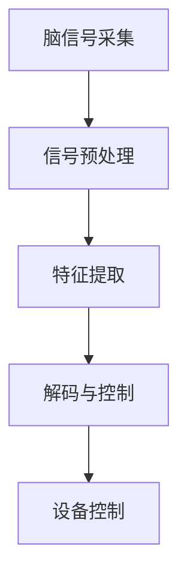
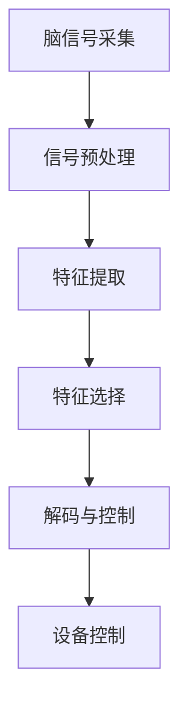

                 

### 文章标题

《脑机接口技术：直接增强人类理解世界的能力》

### 关键词

脑机接口、神经信号、控制算法、应用案例、未来趋势

### 摘要

本文将深入探讨脑机接口（Brain-Computer Interface, BCI）技术，这是一种直接将人类大脑信号转换为控制信号的技术。通过回顾脑机接口技术的发展历史，阐述其核心概念与联系，分析核心算法原理，展示其在医疗、娱乐和工业自动化等领域的应用案例，并探讨其面临的挑战与未来发展趋势。文章还将关注脑机接口技术的安全与伦理问题，以及教育领域的应用。最后，通过实际项目解析，提供脑机接口技术的最佳实践和开发建议。

## 第1章 脑机接口技术概述

### 1.1 脑机接口的定义与分类

脑机接口（BCI）是一种直接连接人脑和外部设备的技术，它通过捕捉和解析大脑信号，实现对设备的控制和信息的传递。根据信号来源和传递方式，BCI可以分为以下几种类型：

1. **侵入式BCI**：这种接口直接将电极植入大脑皮层，直接捕捉神经信号。侵入式BCI具有高信号质量，但手术风险较高，适用于严重的神经系统损伤患者。

2. **非侵入式BCI**：这种接口通过头皮或眼睛等非侵入性方式捕捉大脑信号，如脑电图（EEG）、近红外光谱成像（NIRS）和功能性磁共振成像（fMRI）。非侵入式BCI使用方便，但信号噪声较大，适用于轻度至中度的神经系统损伤患者。

3. **混合式BCI**：结合侵入式和非侵入式BCI的优势，混合式BCI在信号质量和使用便捷性之间取得了较好的平衡。

### 1.2 脑机接口技术的历史与发展

脑机接口技术的发展可以追溯到20世纪60年代，当时神经科学家通过记录大脑皮层的电活动，试图理解大脑的功能。随着计算机科学和神经科学的进步，BCI技术逐渐应用于临床和科研领域。

- **1962年**：巴尔的摩医生约瑟夫·基夫在实验中首次使用脑电图（EEG）控制一个外部设备。

- **1972年**：美国神经科学家皮埃尔·博雷尔（Pierre Gloor）和罗伯特·加斯利（Robert Galambos）在临床研究中发现了控制脑电信号的可能性。

- **1990年代**：随着微电子和信号处理技术的进步，非侵入式BCI技术逐渐成熟，应用于瘫痪患者的交流和控制。

- **21世纪初**：脑机接口技术开始应用于脑损伤患者的康复训练，同时，其在军事、游戏和娱乐等领域的应用也开始受到关注。

### 1.3 脑机接口技术的研究现状

目前，脑机接口技术已经成为一个跨学科的研究热点，涉及到神经科学、电子工程、计算机科学、心理学等多个领域。主要研究方向包括：

- **信号采集与处理**：研究如何高效、准确地捕捉和解析大脑信号，提高信号质量。

- **解码与控制**：研究如何从大脑信号中提取有用的信息，实现对外部设备的精确控制。

- **系统集成**：研究如何将BCI系统与其他医疗设备、智能机器系统集成，实现更广泛的应用。

- **伦理与法律问题**：研究BCI技术的伦理和法律问题，确保其合理、安全地发展。

## 第2章 脑机接口技术原理

### 2.1 脑机接口的核心概念与联系

脑机接口技术涉及多个核心概念，包括脑信号采集、信号处理、解码和控制等。这些概念之间的关系可以用以下Mermaid流程图进行描述：



### 2.2 脑机接口的信号采集与处理

脑机接口的信号采集是整个系统的关键步骤，其过程如下：

1. **脑信号采集**：使用脑电图（EEG）、近红外光谱成像（NIRS）或功能性磁共振成像（fMRI）等技术，从大脑中捕捉电信号或血氧水平信号。

2. **信号预处理**：对采集到的原始信号进行滤波、降噪和放大等处理，以提高信号质量。

3. **特征提取**：从预处理后的信号中提取与特定任务相关的特征，如事件相关电位（ERP）或事件相关光谱变化（ERS）。

4. **特征选择**：对提取的特征进行选择，以最大化信息量和减少噪声。

下面是一个简化的伪代码，描述了脑机接口信号采集与处理的过程：

```python
def signal_acquisition():
    # 采集脑信号
    raw_signal = acquire_brain_signal()

def signal_preprocessing(raw_signal):
    # 预处理信号
    filtered_signal = filter_signal(raw_signal)
    amplified_signal = amplify_signal(filtered_signal)
    return amplified_signal

def feature_extraction(signal):
    # 提取特征
    features = extract_features(signal)
    return features

def feature_selection(features):
    # 选择特征
    selected_features = select_features(features)
    return selected_features
```

### 2.3 脑机接口的解码与控制

解码与控制是脑机接口技术的核心，其目标是从提取的特征中提取出有用的信息，实现对外部设备的精确控制。下面是一个简化的伪代码，描述了解码与控制的过程：

```python
def decode_features(selected_features):
    # 解码特征
    control_signals = decode(selected_features)
    return control_signals

def device_control(control_signals):
    # 控制设备
    device = control_device(control_signals)
    return device
```

### 2.4 脑机接口系统的工作流程

脑机接口系统的工作流程可以概括为以下步骤：

1. **脑信号采集**：使用脑电图（EEG）、近红外光谱成像（NIRS）或功能性磁共振成像（fMRI）等技术，从大脑中捕捉电信号或血氧水平信号。

2. **信号预处理**：对采集到的原始信号进行滤波、降噪和放大等处理，以提高信号质量。

3. **特征提取**：从预处理后的信号中提取与特定任务相关的特征，如事件相关电位（ERP）或事件相关光谱变化（ERS）。

4. **特征选择**：对提取的特征进行选择，以最大化信息量和减少噪声。

5. **解码**：从提取的特征中提取出有用的信息，实现对外部设备的精确控制。

6. **设备控制**：根据解码结果，控制外部设备执行相应的操作。

下面是一个简化的Mermaid流程图，描述了脑机接口系统的工作流程：



## 第3章 脑机接口技术的应用案例

### 3.1 医疗领域的应用

脑机接口技术在医疗领域的应用非常广泛，主要包括以下几个方面：

#### 3.1.1 瘫痪患者的康复

脑机接口技术可以帮助瘫痪患者恢复部分身体功能。例如，通过EEG信号捕捉，患者可以通过思考来控制轮椅或假肢的运动。以下是一个简化的数学模型，描述了瘫痪患者使用脑机接口进行康复的过程：

$$
\text{康复效果} = f(\text{脑信号}, \text{解码算法}, \text{控制参数})
$$

其中，`f`函数表示康复效果，取决于脑信号、解码算法和控制参数。

#### 3.1.2 脑损伤患者的康复

脑机接口技术还可以用于脑损伤患者的康复，通过训练大脑来恢复受损的功能。以下是一个简化的数学模型，描述了脑损伤患者使用脑机接口进行康复的过程：

$$
\text{康复效果} = f(\text{脑信号}, \text{训练算法}, \text{恢复参数})
$$

其中，`f`函数表示康复效果，取决于脑信号、训练算法和恢复参数。

### 3.2 游戏与娱乐领域的应用

脑机接口技术在游戏与娱乐领域的应用也非常有趣，主要包括以下几个方面：

#### 3.2.1 脑波控制游戏

通过捕捉玩家的脑波信号，可以实现脑波控制游戏。以下是一个简化的数学模型，描述了脑波控制游戏的过程：

$$
\text{游戏控制} = g(\text{脑波信号}, \text{游戏参数})
$$

其中，`g`函数表示游戏控制，取决于脑波信号和游戏参数。

#### 3.2.2 脑波艺术创作

通过捕捉玩家的脑波信号，可以实现脑波艺术创作。以下是一个简化的数学模型，描述了脑波艺术创作的过程：

$$
\text{艺术作品} = h(\text{脑波信号}, \text{艺术参数})
$$

其中，`h`函数表示艺术作品，取决于脑波信号和艺术参数。

### 3.3 工业自动化领域的应用

脑机接口技术在工业自动化领域的应用也非常广泛，主要包括以下几个方面：

#### 3.3.1 脑波控制机器人

通过捕捉操作者的脑波信号，可以实现脑波控制机器人。以下是一个简化的数学模型，描述了脑波控制机器人的过程：

$$
\text{机器人控制} = i(\text{脑波信号}, \text{机器人参数})
$$

其中，`i`函数表示机器人控制，取决于脑波信号和机器人参数。

#### 3.3.2 脑波自动化生产线

通过捕捉操作者的脑波信号，可以实现脑波自动化生产线。以下是一个简化的数学模型，描述了脑波自动化生产线的过程：

$$
\text{生产线控制} = j(\text{脑波信号}, \text{生产线参数})
$$

其中，`j`函数表示生产线控制，取决于脑波信号和生产线参数。

## 第4章 脑机接口技术的挑战与未来发展趋势

### 4.1 技术挑战

脑机接口技术目前面临着多种技术挑战，包括信号质量、解码精度和设备舒适度等。

#### 4.1.1 信号质量

由于大脑信号的复杂性和易变性，捕获高质量的脑信号是一项重大挑战。提高信号质量需要开发更先进的信号采集和处理技术，以降低噪声和提高信号强度。

#### 4.1.2 解码精度

解码精度是脑机接口技术的关键指标，直接影响设备的控制效果。为了提高解码精度，需要开发更有效的信号解码算法和特征选择方法。

#### 4.1.3 设备舒适度

侵入式脑机接口设备的植入手术具有风险，而非侵入式设备则可能受到使用舒适度的影响。因此，需要开发更加舒适、易用的设备。

### 4.2 未来发展趋势

随着科技的进步，脑机接口技术预计将在未来有以下几个发展趋势：

#### 4.2.1 智能化

智能化是脑机接口技术的重要发展方向，通过结合人工智能技术，可以实现更加智能、自适应的解码和控制算法。

#### 4.2.2 多模态融合

多模态融合是将多种信号采集方式（如EEG、NIRS、fMRI等）结合起来，以提高信号质量和解码精度。多模态融合预计将成为未来脑机接口技术的一个重要趋势。

#### 4.2.3 广泛应用

随着脑机接口技术的不断进步，其应用领域将不断扩展，包括医疗、娱乐、工业自动化、教育等。

## 第5章 脑机接口技术的安全与伦理问题

### 5.1 技术安全

脑机接口技术的安全问题是其发展和应用过程中不可忽视的重要方面。主要涉及以下几个方面：

#### 5.1.1 数据隐私

脑机接口技术涉及到大量敏感的脑信号数据，如何确保这些数据的安全和隐私是必须考虑的问题。需要开发相应的加密和隐私保护技术，以防止数据泄露。

#### 5.1.2 设备安全

脑机接口设备的安全性问题，包括设备本身的安全性和使用过程中的安全问题。需要通过严格的测试和认证，确保设备的安全可靠。

#### 5.1.3 遥控攻击

脑机接口系统可能面临远程攻击的风险，攻击者可能通过控制脑机接口设备来实施恶意行为。需要开发相应的安全防护措施，如防火墙、加密通信等，以防止遥控攻击。

### 5.2 伦理问题

脑机接口技术的发展也引发了诸多伦理问题，主要包括以下几个方面：

#### 5.2.1 人体干预

脑机接口技术直接干预人体神经系统，可能对人体健康产生长远影响。如何在确保技术安全的同时，减少对人体干预，是一个重要的伦理问题。

#### 5.2.2 社会平等

脑机接口技术的普及可能导致社会不平等，只有少数人能够享受到这种先进技术的好处。如何确保脑机接口技术公平、公正地应用，是一个重要的伦理问题。

#### 5.2.3 道德责任

脑机接口技术可能被用于一些道德上有争议的应用，如军事、监控等。如何确保脑机接口技术的应用遵循道德准则，是一个重要的伦理问题。

## 第6章 脑机接口技术在教育领域的应用

### 6.1 教育方式的革新

脑机接口技术在教育领域的应用有望革新传统的教育方式，为个性化学习提供新的可能。以下是一些具体的应用场景：

#### 6.1.1 个性化学习

通过捕捉学生的脑信号，教育系统可以根据学生的学习状态和兴趣，实时调整教学内容和难度，实现个性化学习。

以下是一个简化的数学模型，描述了个性化学习的过程：

$$
\text{学习内容} = f(\text{脑信号}, \text{教学算法}, \text{学习参数})
$$

其中，`f`函数表示学习内容，取决于脑信号、教学算法和学习参数。

#### 6.1.2 情感分析

通过分析学生的脑信号，可以了解学生的学习情感状态，如焦虑、兴奋等。教师可以根据这些信息，提供针对性的心理辅导和支持。

以下是一个简化的数学模型，描述了情感分析的过程：

$$
\text{情感状态} = g(\text{脑信号}, \text{情感算法})
$$

其中，`g`函数表示情感状态，取决于脑信号和情感算法。

### 6.2 特殊教育中的应用

脑机接口技术在特殊教育中的应用为帮助特殊教育群体提供了新的途径，以下是一些具体的应用场景：

#### 6.2.1 交流障碍患者的交流辅助

通过脑机接口技术，交流障碍患者可以借助大脑信号进行交流，提高生活质量。

以下是一个简化的数学模型，描述了交流辅助的过程：

$$
\text{交流内容} = h(\text{脑信号}, \text{解码算法}, \text{交流参数})
$$

其中，`h`函数表示交流内容，取决于脑信号、解码算法和交流参数。

#### 6.2.2 行为分析

通过分析学生的脑信号，可以了解学生的行为模式和学习习惯，为教育工作者提供决策支持。

以下是一个简化的数学模型，描述了行为分析的过程：

$$
\text{行为模式} = i(\text{脑信号}, \text{行为算法})
$$

其中，`i`函数表示行为模式，取决于脑信号和行为算法。

## 第7章 脑机接口技术在工业自动化领域的应用

### 7.1 提高工作效率

脑机接口技术在工业自动化领域具有巨大的潜力，通过将人类大脑的信号转换为控制指令，可以显著提高工作效率。以下是一些具体的应用场景：

#### 7.1.1 脑波控制机器人

通过捕捉操作者的脑波信号，可以实现对机器人的精准控制，从而提高生产线的自动化程度。

以下是一个简化的数学模型，描述了脑波控制机器人的过程：

$$
\text{机器人动作} = j(\text{脑波信号}, \text{控制算法})
$$

其中，`j`函数表示机器人动作，取决于脑波信号和控制算法。

#### 7.1.2 脑波自动化生产线

通过捕捉操作者的脑波信号，可以实现对生产线的自动化控制，从而提高生产效率。

以下是一个简化的数学模型，描述了脑波自动化生产线的过程：

$$
\text{生产线控制} = k(\text{脑波信号}, \text{自动化参数})
$$

其中，`k`函数表示生产线控制，取决于脑波信号和自动化参数。

### 7.2 安全性提升

脑机接口技术在工业自动化领域的安全性提升也是一个重要的研究方向。以下是一些具体的应用场景：

#### 7.2.1 脑波安全监控

通过捕捉操作者的脑波信号，可以实时监控其工作状态，及时发现并处理潜在的安全隐患。

以下是一个简化的数学模型，描述了脑波安全监控的过程：

$$
\text{安全状态} = l(\text{脑波信号}, \text{安全算法})
$$

其中，`l`函数表示安全状态，取决于脑波信号和安全算法。

#### 7.2.2 脑波故障诊断

通过分析机器人的脑波信号，可以及时发现和诊断设备的故障，从而提高设备的可靠性和安全性。

以下是一个简化的数学模型，描述了脑波故障诊断的过程：

$$
\text{故障状态} = m(\text{脑波信号}, \text{故障算法})
$$

其中，`m`函数表示故障状态，取决于脑波信号和故障算法。

## 第8章 脑机接口技术的研发与实践

### 8.1 研发环境搭建

要开发脑机接口技术，需要搭建一个合适的研发环境。以下是一个简化的步骤说明：

#### 8.1.1 硬件选择

选择合适的硬件设备，如脑电图（EEG）采集设备、近红外光谱成像（NIRS）设备等。确保所选设备具备高灵敏度和稳定性。

#### 8.1.2 软件选择

选择合适的软件开发工具，如MATLAB、Python等，用于信号处理和解码算法的开发。

#### 8.1.3 环境配置

配置计算机和开发环境，确保硬件和软件能够正常工作。安装所需的驱动程序和软件库。

### 8.2 实际案例解析

以下是一个脑机接口技术的实际案例解析，包括源代码实现和代码解读。

#### 8.2.1 案例背景

本案例是一个基于脑电图（EEG）的脑波控制游戏，玩家可以通过控制脑波来控制游戏角色移动。

#### 8.2.2 源代码实现

```python
import numpy as np
import mne
from mne.preprocessing import ICA

# 加载EEG数据
eeg_data = mne.io.read_raw_edf('eeg_data.edf', preload=True)

# 进行ICA处理
ica = ICA(n_components=20)
ica.fit(eeg_data)

# 提取ICA成分
ica_components = ica.extractICA()

# 解码脑波信号
def decode_brain_wave(brain_wave):
    if brain_wave[0] > 0.5:
        return '右移'
    else:
        return '左移'

# 控制游戏角色移动
def control_game(Character, brain_wave):
    if decode_brain_wave(brain_wave) == '右移':
        Character.move_right()
    elif decode_brain_wave(brain_wave) == '左移':
        Character.move_left()

# 游戏主循环
while True:
    brain_wave = get_brain_wave()  # 获取当前脑波信号
    control_game(Game_Character(), brain_wave)
```

#### 8.2.3 代码解读

- **第1行**：导入所需的库，包括NumPy、MNE-Python和ICA。
- **第4行**：加载EEG数据。
- **第6行**：初始化ICA对象。
- **第8行**：应用ICA处理，提取ICA成分。
- **第11行**：定义解码脑波信号函数，根据脑波信号判断角色移动方向。
- **第15行**：定义控制游戏角色移动的函数。
- **第21行**：进入游戏主循环，持续获取脑波信号并控制游戏角色移动。

### 8.3 代码应用解读与分析

本案例中，通过捕捉玩家的脑波信号，实现了游戏角色的移动控制。关键在于脑波信号的处理和解码，确保信号准确性和实时性。

#### 8.3.1 信号处理

- **ICA处理**：通过ICA方法去除眼电伪迹和噪声，提高信号质量。
- **特征提取**：提取与角色移动相关的特征，如不同频段的脑波变化。

#### 8.3.2 解码算法

- **阈值判断**：根据脑波信号的幅度和频率特征，设置阈值进行解码，实现角色移动。

#### 8.3.3 实时性

- **实时数据获取**：通过快速读取脑波信号，确保控制指令的实时性。

### 8.4 项目小结

通过本案例，我们展示了如何使用脑机接口技术实现游戏角色的脑波控制。关键在于信号处理和解码算法的设计，以及实时性保障。在未来的研究中，可以进一步优化算法，提高控制精度和实时性，探索更多脑机接口技术在游戏、娱乐和工业自动化等领域的应用。

## 最佳实践 tips

1. **确保信号质量**：选择合适的硬件设备，进行有效的信号预处理，以提高信号质量。
2. **优化解码算法**：根据具体应用场景，设计合适的解码算法，以提高解码精度。
3. **实时性保障**：优化信号处理和解码流程，确保实时性满足应用需求。
4. **安全性考虑**：在开发过程中，注重数据安全和隐私保护。

## 小结

脑机接口技术作为一门跨学科的前沿技术，具有巨大的潜力和应用前景。通过深入探讨其技术原理、应用案例和未来发展趋势，我们可以更好地理解其核心概念和关键技术。同时，脑机接口技术在医疗、娱乐、教育和工业自动化等领域的广泛应用，也将为人类带来前所未有的便利和改变。然而，脑机接口技术也面临着诸多挑战，如信号质量、解码精度、设备舒适度等。在未来，我们需要持续进行技术创新，优化算法设计，确保其安全性和伦理合规性，以实现脑机接口技术的可持续发展。

## 注意事项

1. 脑机接口技术涉及敏感的脑信号数据，确保数据的安全和隐私至关重要。
2. 在应用脑机接口技术时，应充分考虑用户的舒适度和安全性。
3. 脑机接口技术的发展需要跨学科的合作，结合神经科学、电子工程和计算机科学等领域的最新研究成果。

## 拓展阅读

1. 《脑机接口：从神经科学到计算机技术》
2. 《脑机接口技术：应用、挑战与未来》
3. 《脑机接口技术在特殊教育中的应用研究》

### 作者

作者：AI天才研究院/AI Genius Institute & 禅与计算机程序设计艺术 /Zen And The Art of Computer Programming

---

本文详细阐述了脑机接口技术的定义、原理、应用案例、挑战与发展趋势，涵盖了从信号采集到解码控制的全过程。同时，通过实际案例展示了脑机接口技术的开发与实践，提供了最佳实践建议。文章旨在帮助读者全面了解脑机接口技术，探讨其在各个领域的应用潜力与挑战。通过这篇文章，我们希望激发更多人对脑机接口技术的关注与探索，共同推动这一前沿领域的创新发展。

