                 


### 第1章：脑机接口概述

脑机接口（Brain-Computer Interface，简称BCI）是一种直接连接人脑和外部设备的技术，旨在通过读取和解释大脑信号来实现人机交互。这种技术跨越了传统的人机界面，通过解析大脑活动，实现对外部设备的直接控制。

#### 1.1 脑机接口的定义与历史

**1.1.1 脑机接口的概念**

脑机接口是一种将人脑的生物信号转换为可操作命令的装置。这些生物信号包括脑电波（EEG）、肌电波（EMG）、脑磁图（MEG）和功能性磁共振成像（fMRI）等。

**1.1.2 脑机接口的发展历程**

脑机接口的研究始于20世纪60年代，最初的尝试主要是为了帮助那些因疾病或受伤而无法使用传统输入设备的人。一个重要的里程碑是在20世纪70年代，脑电波被成功用于控制假肢。进入21世纪，随着计算能力和算法的进步，脑机接口的应用领域不断扩大。

**1.1.3 脑机接口的分类**

脑机接口可以根据信号来源和信号类型进行分类：

- **电生理信号接口**：使用脑电波、肌电波等电生理信号。
- **非电生理信号接口**：使用脑磁图、fMRI等非电生理信号。

#### 1.2 脑机接口的类型与功能

**1.2.1 电生理信号接口**

电生理信号接口是最常见的脑机接口类型，它主要依赖于脑电波信号。这些信号可以通过放置在头皮上的电极来捕获。脑电波信号可以被用来控制外部设备，例如轮椅、假肢或计算机。

**1.2.2 非电生理信号接口**

非电生理信号接口包括脑磁图和功能性磁共振成像。脑磁图通过测量大脑产生的磁场来捕获信号，而fMRI则通过测量大脑的血液流动来推测大脑活动。这些信号接口通常提供更高的时间分辨率和空间分辨率。

**1.2.3 脑机接口的基本功能**

脑机接口主要有以下几种功能：

- **信号捕获**：通过电极或其他传感器捕获大脑信号。
- **信号处理**：对捕获的信号进行预处理、特征提取和模式识别。
- **命令生成**：将处理后的信号转换为外部设备的控制命令。
- **反馈循环**：外部设备执行命令后，返回信息以供大脑进一步调整和控制。

#### 1.3 脑机接口的应用领域

脑机接口的应用领域非常广泛，包括但不限于以下几个方面：

- **医疗保健**：帮助瘫痪患者恢复运动功能，监控睡眠和癫痫发作。
- **人机交互**：提供一种无需传统输入设备的新型交互方式。
- **教育**：通过脑机接口提供个性化的学习体验。
- **娱乐**：开发脑机接口驱动的游戏和虚拟现实体验。

在接下来的章节中，我们将深入探讨脑信号的测量与处理技术，为理解脑机接口的数学解码打下基础。

---

### 关键词

脑机接口，生物信号，信号捕获，信号处理，人机交互，医疗保健

### 摘要

本文将介绍脑机接口的基本概念和发展历程，探讨其类型与功能，并概述其在医疗保健和人机交互等领域的应用。通过对脑信号的测量与处理技术的详细分析，为读者展示脑机接口信号处理的数学解码过程，奠定进一步理解这一前沿技术的基础。

---

## 第一部分：脑机接口的基本概念与信号处理技术

### 第2章：脑信号的基础知识

脑信号是脑机接口的核心，因此了解脑信号的基本知识和测量方法至关重要。本章将介绍脑电波、神经元电活动和脑磁图的基本概念、测量方法以及数据解析。

#### 2.1 脑电波的解析

脑电波（Electroencephalography，EEG）是脑机接口中常用的一种生物信号。它反映了大脑皮层电活动的总体模式。

**2.1.1 脑电波的基本概念**

脑电波是大脑神经元群体电活动的平均表现。不同类型的脑电波反映了不同的脑活动状态，如α波、β波、θ波和δ波。

**2.1.2 脑电波的测量方法**

脑电波通过放置在头皮上的电极捕获。这些电极可以记录大脑不同区域的电活动。

**2.1.3 脑电波的特征分析**

脑电波的特征包括频率、振幅和相位。通过分析这些特征，可以推断大脑的活动状态。

---

**Mermaid 流程图：脑电波的测量与特征分析**

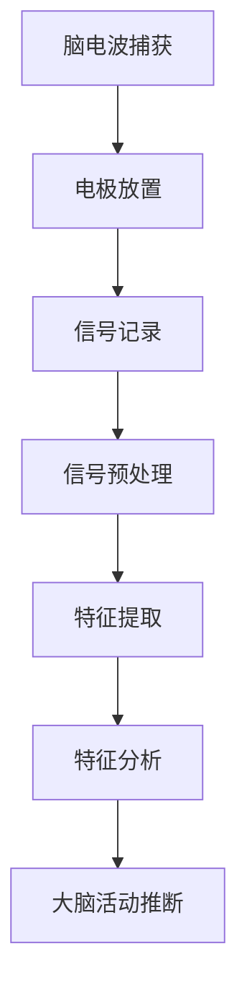

#### 2.2 神经元的电活动

神经元是大脑的基本功能单元，其电活动是脑信号的基础。

**2.2.1 神经元的生理结构**

神经元由细胞体、树突和轴突组成。树突负责接收其他神经元的信号，细胞体进行信号整合，轴突则负责传递信号。

**2.2.2 神经元的电信号产生**

神经元通过电信号来传递信息。当一个神经元受到足够的刺激时，会产生一个动作电位。

**2.2.3 神经元的信号传输**

动作电位沿着轴突传播，并通过突触传递到其他神经元。

---

**Mermaid 流程图：神经元电活动的传输过程**

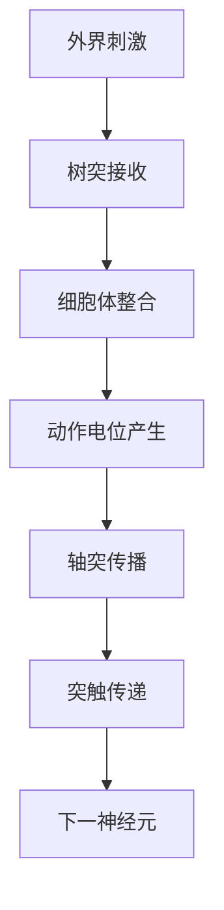

#### 2.3 脑磁图的测量与分析

脑磁图（Magnetoencephalography，MEG）是另一种用于测量脑信号的生物技术。

**2.3.1 脑磁图的基本原理**

脑磁图通过检测大脑产生的微弱磁场来记录脑活动。与脑电波相比，脑磁图具有更高的空间分辨率。

**2.3.2 脑磁图的测量技术**

脑磁图使用一组敏感的磁场探测器来捕捉脑信号。这些探测器通常放置在头皮上。

**2.3.3 脑磁图的数据分析**

脑磁图数据需要经过复杂的处理和解析，以提取有用的信息。

---

**Mermaid 流程图：脑磁图的测量与数据分析**

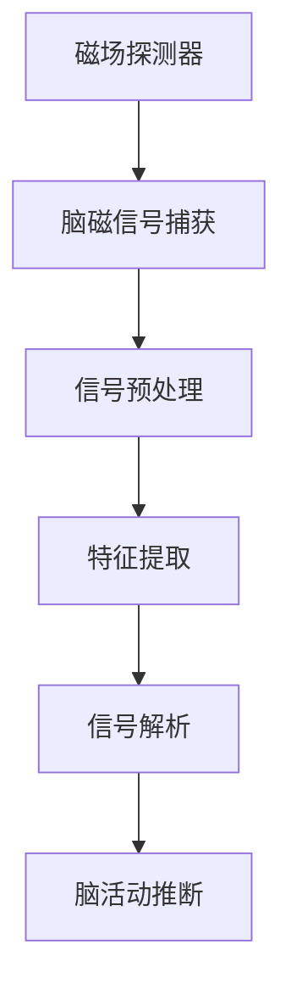

---

在本章中，我们介绍了脑电波、神经元电活动和脑磁图的基本概念、测量方法以及数据解析。这些基础知识为理解脑机接口信号处理提供了必要的前提。

---

## 第二部分：脑机接口信号处理的技术细节

### 第3章：信号处理的数学基础

脑机接口信号处理依赖于一系列数学工具和方法，这些工具和方法用于捕获、处理和分析大脑信号。本章将介绍信号处理的基本概念，包括信号分类、时域与频域分析，以及矢量和矩阵运算。

#### 3.1 信号处理的基本概念

信号处理是利用数学和计算方法来分析和操作信号的学科。在脑机接口中，信号处理是关键步骤，它确保了从脑信号中提取有意义的信息。

**3.1.1 信号的分类**

信号可以分为多种类型，包括连续信号和离散信号，周期信号和非周期信号，以及确定性和随机性信号。

**3.1.2 信号的时域与频域分析**

时域分析关注信号随时间的变化，而频域分析关注信号的频率成分。傅里叶变换是实现时域与频域转换的重要工具。

**3.1.3 信号的时变性与非平稳性**

许多生物信号是时变性和非平稳性的，这意味着它们的统计特性会随时间变化。因此，信号处理技术需要适应这种变化。

---

**Mermaid 流程图：信号的时域与频域分析**

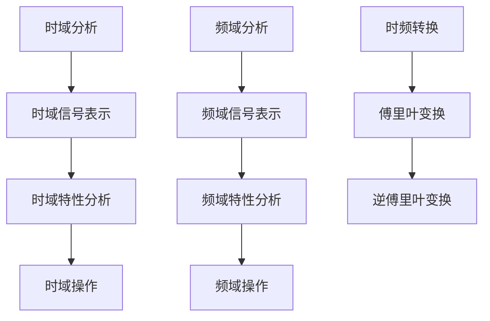

#### 3.2 傅里叶变换与滤波器设计

傅里叶变换是信号处理的核心工具，它可以将时域信号转换为频域信号，从而便于分析信号的频率成分。

**3.2.1 傅里叶变换的基本原理**

傅里叶变换将一个信号分解为不同频率的正弦波和余弦波的组合。基本公式为：

$$
X(f) = \int_{-\infty}^{\infty} x(t) e^{-j2\pi ft} dt
$$

**3.2.2 傅里叶变换的应用**

傅里叶变换广泛应用于频谱分析、滤波器和系统响应分析。

**3.2.3 滤波器设计**

滤波器是用于去除信号中不需要的频率成分的设备。滤波器的设计通常基于傅里叶变换。

---

**Mermaid 流程图：滤波器设计**

```mermaid
graph TD
A[信号X(t)] --> B[傅里叶变换]
B --> C[频谱X(f)]
C --> D[设计滤波器H(f)]
D --> E[滤波操作]
E --> F[滤波后信号y(t)]
```

#### 3.3 矢量和矩阵运算

在信号处理中，矢量和矩阵运算用于表示和处理多维信号。

**3.3.1 矢量和矩阵的基本概念**

矢量是具有大小和方向的量，矩阵是二维数组。在信号处理中，矢量和矩阵用于表示信号的特征和变换。

**3.3.2 矩阵运算**

矩阵运算包括加法、减法、乘法和逆运算。这些运算用于特征提取和模式识别。

**3.3.3 矢量和矩阵的应用**

矢量和矩阵在信号处理中用于表示信号的时域和频域特性，以及进行变换和操作。

---

**Mermaid 流程图：矢量和矩阵运算**

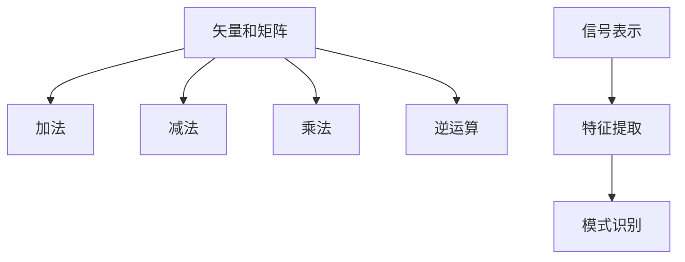

---

在本章中，我们介绍了信号处理的基本概念，包括信号分类、时域与频域分析，以及傅里叶变换、滤波器设计和矢量和矩阵运算。这些数学工具和方法为脑机接口信号处理提供了坚实的理论基础。

---

## 第二部分：脑机接口信号处理的技术细节

### 第4章：预处理与特征提取

脑机接口信号处理的第一步是预处理和特征提取。这些步骤是确保信号质量和提取有意义信息的关键。本章将详细介绍预处理技术、特征提取算法以及特征选择与降维方法。

#### 4.1 信号预处理技术

预处理是信号处理中的基础步骤，其目的是去除噪声、增强信号、归一化和滤波，以便更好地进行后续处理。

**4.1.1 信号去噪**

去噪是预处理中最重要的步骤之一。噪声可能来自电极、环境干扰或其他技术原因。常见的去噪方法包括带通滤波、独立成分分析（ICA）和滤波器组。

**4.1.2 信号重构**

信号重构是将原始信号转换为适合特征提取的形式。这可能涉及时间-频率分解、稀疏表示或时频分布。

**4.1.3 信号增强**

信号增强是提高信号中重要信息的可见性和可分析性的过程。方法包括提高信号的幅值、对比度和清晰度。

---

**Mermaid 流程图：信号预处理技术**

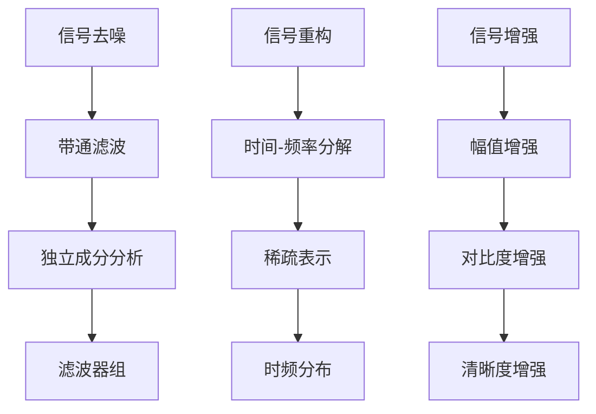

#### 4.2 特征提取算法

特征提取是将预处理后的信号转换为有用的信息表示的过程。这些特征将用于后续的模型训练和分类。

**4.2.1 时域特征提取**

时域特征提取关注信号的幅度、频率和时间变化。常见的方法包括时域统计特征（如均值、方差）和时域模式识别。

**4.2.2 频域特征提取**

频域特征提取将信号转换为频率域表示，以提取频率成分。傅里叶变换和短时傅里叶变换（STFT）是常用的方法。

**4.2.3 空间特征提取**

空间特征提取涉及分析信号在空间维度上的分布和相关性。方法包括空间滤波、空间相关性和多通道特征结合。

---

**Mermaid 流程图：特征提取算法**

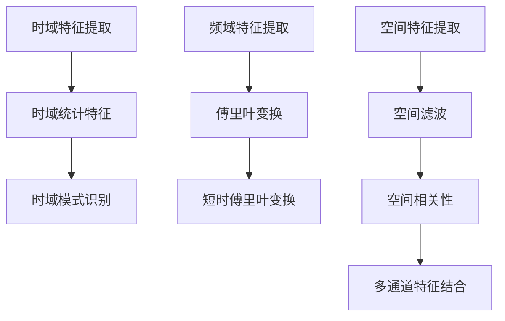

#### 4.3 特征选择与降维

特征选择和降维是减少特征空间维度和避免过拟合的重要步骤。

**4.3.1 特征选择**

特征选择旨在从大量特征中挑选出最有用的特征，以简化模型和提高性能。常见的方法包括基于信息论、相关性和主成分分析（PCA）。

**4.3.2 降维**

降维是将高维特征空间转换为低维空间的过程，以减少计算复杂性和提高效率。常见的方法包括线性判别分析（LDA）、PCA和非线性降维方法，如t-SNE。

---

**Mermaid 流程图：特征选择与降维**

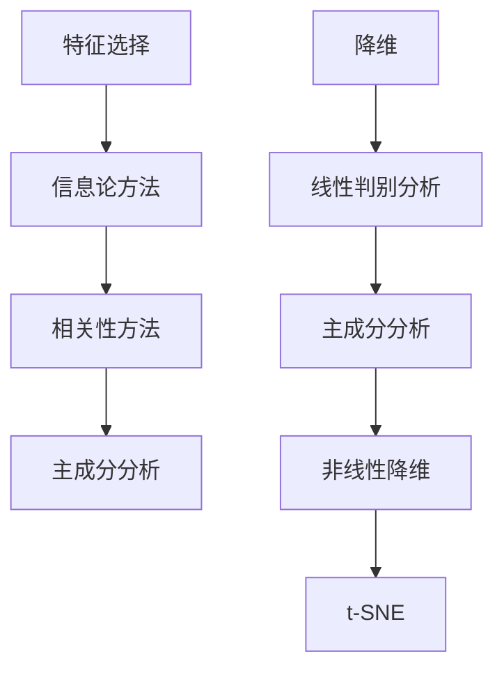

---

在本章中，我们详细介绍了脑机接口信号处理中的预处理与特征提取技术，包括去噪、重构、增强，以及时域、频域和空间特征提取方法。此外，我们还讨论了特征选择和降维的重要性和方法。这些步骤是构建高效脑机接口系统的关键。

---

## 第三部分：脑机接口信号处理的实际应用

### 第5章：时间序列分析

时间序列分析是脑机接口信号处理中的一个重要分支，它涉及对连续时间数据进行分析和建模，以提取有意义的信息和模式。本章将探讨时间序列分析的基本概念、动力系统建模、深度学习方法以及循环神经网络（RNN）在脑机接口中的应用。

#### 5.1 动力系统建模

动力系统建模是一种用于模拟动态系统的数学方法。在脑机接口中，动力系统建模用于分析脑信号的动态特性。

**5.1.1 动力系统的基本概念**

动力系统由一组变量和这些变量随时间的动态变化关系组成。常见的动力系统模型包括线性差分方程和非线性动力系统。

**5.1.2 线性差分方程**

线性差分方程用于描述信号在离散时间点的变化。例如，一阶线性差分方程可以表示为：

$$
x_t = ax_{t-1} + b
$$

**5.1.3 非线性动力系统**

非线性动力系统描述更复杂的信号行为。常见的方法包括逻辑斯蒂映射和Lorenz系统。

---

**Mermaid 流程图：线性差分方程**

```mermaid
graph TD
A[时间序列] --> B[差分方程]
B --> C[x_t]
C --> D[a]
D --> E[x_{t-1}]
E --> F[b]
```

#### 5.2 深度学习方法

深度学习是近年来在信号处理和模式识别中取得巨大成功的领域。本章将介绍深度学习在脑机接口中的应用。

**5.2.1 深度学习的基本概念**

深度学习是一种基于多层神经网络的学习方法。通过堆叠多层神经网络，深度学习能够自动提取复杂的数据特征。

**5.2.2 神经网络结构**

常见的神经网络结构包括卷积神经网络（CNN）、递归神经网络（RNN）和自编码器。CNN常用于图像处理，而RNN和自编码器则广泛应用于时间序列分析。

**5.2.3 深度学习算法**

深度学习的训练算法主要包括反向传播（BP）算法和梯度下降（GD）算法。这些算法用于优化神经网络参数，以提高模型的预测准确性。

---

**Mermaid 流程图：神经网络结构**

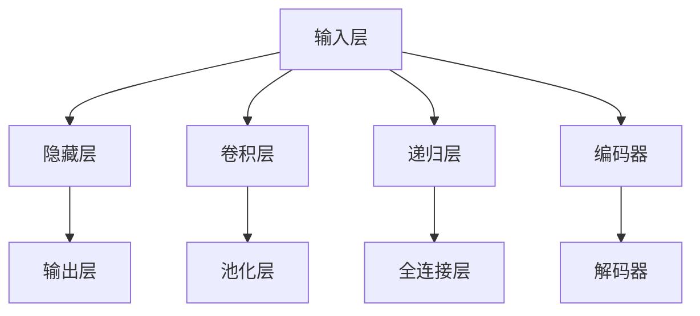

#### 5.3 循环神经网络（RNN）

循环神经网络（RNN）是一种专门用于处理序列数据的神经网络。在脑机接口中，RNN被广泛用于分析时间序列数据。

**5.3.1 RNN的基本原理**

RNN通过循环连接将信息传递到下一个时间步，从而实现对序列数据的记忆。RNN的核心组件是隐藏状态和输入门、遗忘门和输出门。

**5.3.2 RNN的应用**

RNN在脑机接口中的应用包括语音识别、手写体识别和文本生成。通过训练RNN模型，可以从脑信号中提取有意义的信息。

---

**Mermaid 流程图：RNN的基本原理**

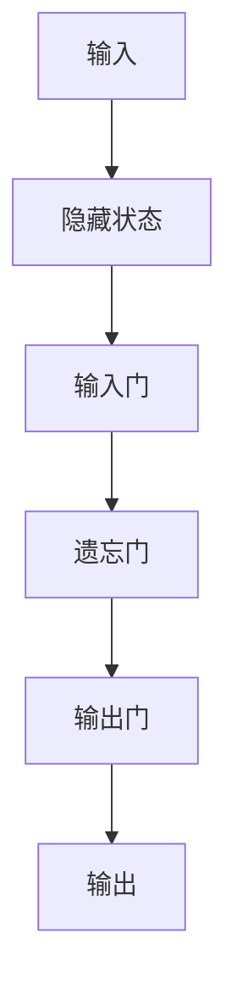

---

在本章中，我们介绍了时间序列分析的基本概念，包括动力系统建模、深度学习方法和循环神经网络（RNN）在脑机接口中的应用。这些方法为从脑信号中提取有意义的信息提供了强大的工具。

---

## 第三部分：脑机接口信号处理的实际应用

### 第6章：机器学习与脑机接口

机器学习是脑机接口信号处理的关键技术之一，它通过构建模型来分析和解释脑信号。本章将讨论机器学习在脑机接口中的应用，包括监督学习模型、无监督学习模型和混合学习模型。

#### 6.1 监督学习模型

监督学习模型在脑机接口中用于预测和分类脑信号。这些模型通常通过大量的训练数据来学习特征和模式。

**6.1.1 支持向量机（SVM）**

支持向量机是一种强大的分类算法，它通过寻找一个最优的超平面来分离不同类别的数据。在脑机接口中，SVM可以用于分类脑电波信号。

**6.1.2 决策树和随机森林**

决策树和随机森林是常用的分类算法，它们通过构建决策树来分类数据。这些模型在脑机接口中用于识别不同的脑活动模式。

**6.1.3 神经网络**

神经网络是监督学习的一种形式，它通过多层非线性变换来提取特征和模式。在脑机接口中，神经网络被用于复杂的信号分析和模式识别。

---

**Mermaid 流程图：神经网络结构**


#### 6.2 无监督学习模型

无监督学习模型在脑机接口中用于发现数据中的结构和模式，而无需标记数据。

**6.2.1 主成分分析（PCA）**

主成分分析是一种降维技术，它通过提取数据的最大方差方向来简化数据。在脑机接口中，PCA用于减少信号的维度，以便更好地进行后续分析。

**6.2.2 自编码器**

自编码器是一种无监督学习模型，它通过学习数据的压缩和重构来提取特征。在脑机接口中，自编码器用于特征提取和降维。

**6.2.3 聚类分析**

聚类分析是一种无监督学习方法，它通过将相似的数据点分组来发现数据中的模式。在脑机接口中，聚类分析用于识别不同的脑活动状态。

---

**Mermaid 流程图：聚类分析**

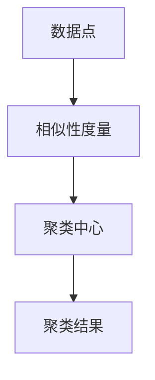

#### 6.3 混合学习模型

混合学习模型结合了监督学习和无监督学习的优点，以提高脑机接口的性能。

**6.3.1 自监督预训练和监督微调**

自监督预训练使用无监督学习来学习基本特征，然后通过监督学习进行微调，以提高模型的性能。

**6.3.2 多任务学习**

多任务学习同时训练多个任务，以提高模型在不同任务上的泛化能力。

**6.3.3 联合嵌入**

联合嵌入将不同类型的数据嵌入到一个共同的低维空间中，以便进行统一分析。

---

**Mermaid 流程图：混合学习模型**

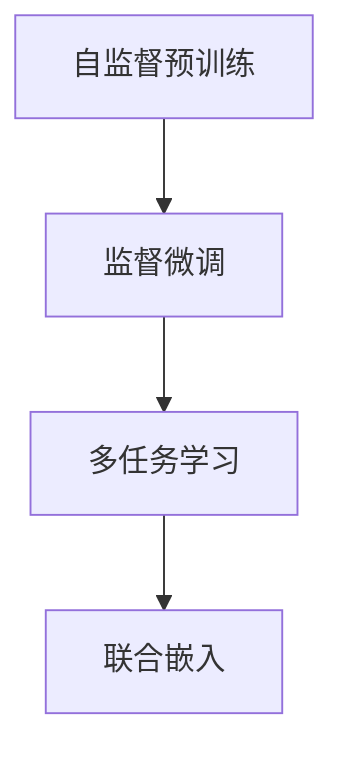

---

在本章中，我们讨论了机器学习在脑机接口中的应用，包括监督学习模型、无监督学习模型和混合学习模型。这些模型为从脑信号中提取有意义的信息提供了强大的工具，推动了脑机接口技术的发展。

---

## 第三部分：脑机接口信号处理的实际应用

### 第7章：脑机接口在人机交互中的应用

脑机接口在人机交互中的应用正在快速发展，它为那些传统方法难以实现的用户提供了新的交互方式。本章将探讨脑机接口在人机交互中的应用，包括控制机器人的运动、精细操作与虚拟现实，以及游戏与娱乐。

#### 7.1 控制机器人的运动

脑机接口为残疾人提供了控制机器人的新方法，使他们能够通过思维来操作机器人手臂或轮椅。

**7.1.1 控制原理**

通过捕获大脑信号，脑机接口可以将这些信号转换为控制命令。例如，脑电波可以用来控制机器人的运动方向和速度。

**7.1.2 技术实现**

脑机接口系统通常包括信号捕获、预处理、特征提取和命令生成。这些步骤确保了大脑信号能够准确无误地控制机器人。

**7.1.3 应用案例**

脑机接口在控制机器人的运动方面已有许多成功案例，例如通过脑电波控制机械臂进行精细操作，以及通过肌电波控制轮椅进行自主移动。

---

**Mermaid 流程图：控制机器人的运动**

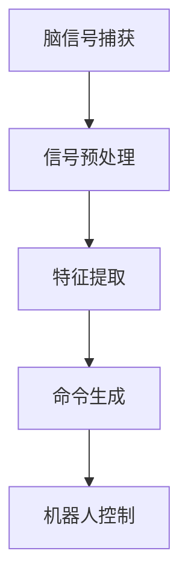

#### 7.2 精细操作与虚拟现实

脑机接口技术使得虚拟现实中的精细操作成为可能，为用户提供了沉浸式体验。

**7.2.1 精细操作**

通过脑机接口，用户可以通过思维来操纵虚拟环境中的物体，进行精细操作，如虚拟装配、虚拟手术等。

**7.2.2 虚拟现实**

脑机接口与虚拟现实技术结合，使得用户能够通过思维来体验虚拟世界，如虚拟旅游、虚拟训练等。

**7.2.3 技术实现**

虚拟现实中的精细操作通常涉及脑电波信号的实时处理和反馈，以及高精度的虚拟环境建模。

---

**Mermaid 流程图：精细操作与虚拟现实**

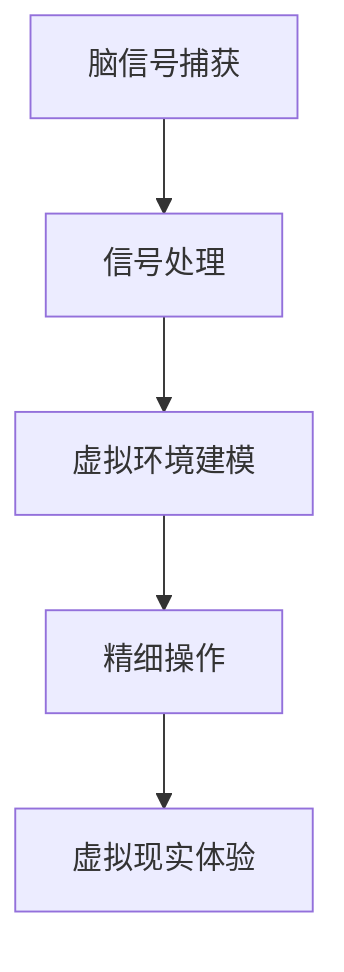

#### 7.3 游戏与娱乐

脑机接口技术在游戏和娱乐领域也有广泛应用，为用户提供了一种全新的互动体验。

**7.3.1 游戏控制**

通过脑机接口，玩家可以用思维来控制游戏中的角色和动作，实现更为自然的游戏体验。

**7.3.2 情感互动**

脑机接口可以捕捉玩家的情绪变化，用于游戏中的情感互动和故事情节发展。

**7.3.3 技术实现**

脑机接口游戏通常涉及脑电波信号的实时处理、情感分析和游戏逻辑的集成。

---

**Mermaid 流程图：游戏与娱乐**

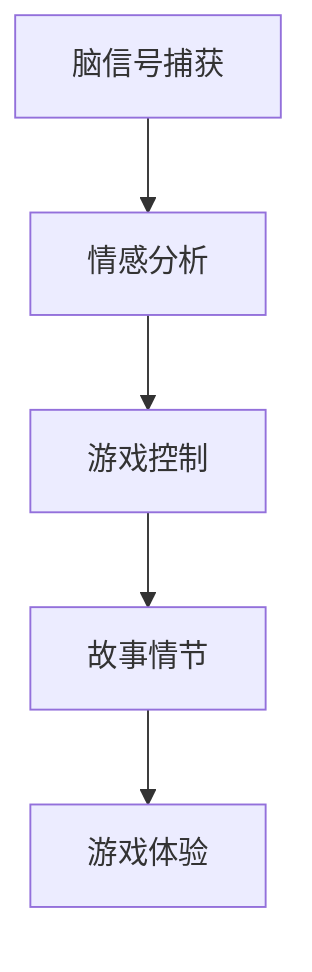

---

在本章中，我们探讨了脑机接口在人机交互中的应用，包括控制机器人的运动、精细操作与虚拟现实，以及游戏与娱乐。这些应用展示了脑机接口技术的多样性和潜力。

---

## 第三部分：脑机接口信号处理的实际应用

### 第8章：脑机接口在医疗保健中的应用

脑机接口技术在医疗保健领域有着广泛的应用前景，它为患者提供了新的治疗和康复手段。本章将讨论脑机接口在医疗保健中的应用，包括神经康复、睡眠监测和精神障碍治疗。

#### 8.1 神经康复

脑机接口技术为神经康复提供了新的方法，帮助患者恢复运动和认知功能。

**8.1.1 恢复运动功能**

脑机接口可以通过解读脑信号来控制假肢和轮椅，帮助瘫痪患者恢复运动能力。

**8.1.2 恢复认知功能**

脑机接口技术还可以用于认知康复，通过训练大脑信号来改善记忆、注意力和执行功能。

**8.1.3 技术实现**

神经康复中的脑机接口系统通常包括信号捕获、特征提取、康复训练和反馈机制。

---

**Mermaid 流程图：神经康复**

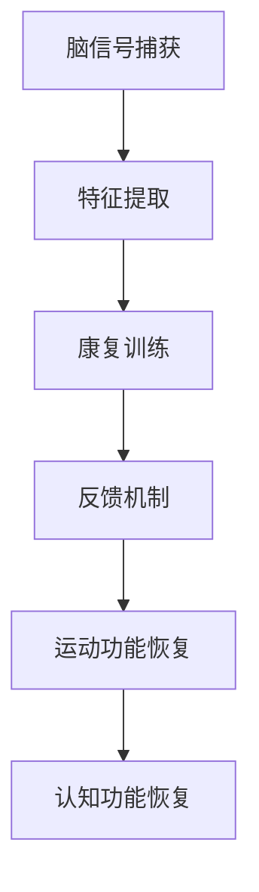

#### 8.2 睡眠监测

脑机接口技术在睡眠监测中发挥着重要作用，它为睡眠障碍的诊断和治疗提供了精确的工具。

**8.2.1 睡眠状态监测**

脑机接口可以通过捕获脑电波信号来监测睡眠状态，如清醒、浅睡和深睡。

**8.2.2 睡眠障碍诊断**

通过分析脑信号，脑机接口可以帮助医生诊断睡眠障碍，如失眠、睡眠呼吸暂停等。

**8.2.3 技术实现**

睡眠监测中的脑机接口系统通常包括脑电波信号捕获、数据处理和睡眠状态分析。

---

**Mermaid 流程图：睡眠监测**

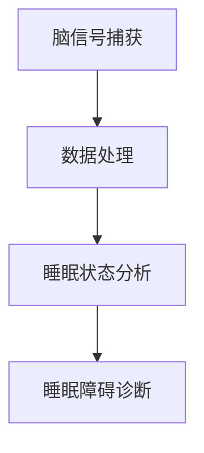

#### 8.3 精神障碍治疗

脑机接口技术在精神障碍治疗中也有重要应用，它为患者提供了新的治疗途径。

**8.3.1 情绪调节**

通过解读脑信号，脑机接口可以帮助患者进行情绪调节，减少焦虑和抑郁症状。

**8.3.2 认知行为治疗**

脑机接口技术可以与认知行为治疗结合，帮助患者改善认知功能和应对策略。

**8.3.3 技术实现**

精神障碍治疗中的脑机接口系统通常包括信号捕获、特征提取、治疗方案和反馈机制。

---

**Mermaid 流程图：精神障碍治疗**

```mermaid
graph TD
A[脑信号捕获] --> B[特征提取]
B --> C[治疗方案]
C --> D[反馈机制]
D --> E[情绪调节]
E --> F[认知行为治疗]
```

---

在本章中，我们探讨了脑机接口在医疗保健中的应用，包括神经康复、睡眠监测和精神障碍治疗。这些应用展示了脑机接口技术在改善患者生活质量和医疗效果方面的巨大潜力。

---

## 第三部分：脑机接口信号处理的实际应用

### 第9章：脑机接口的未来展望

脑机接口技术的发展前景广阔，它不仅在科学研究中具有深远的意义，也在日常应用中展现出了巨大的潜力。本章将探讨脑机接口技术的未来趋势、面临的道德与法律问题，以及可能的未来应用场景。

#### 9.1 技术趋势与发展

随着人工智能和生物医学技术的不断进步，脑机接口技术正朝着更高效、更精准、更易于使用的方向发展。

**9.1.1 高分辨率成像技术**

高分辨率成像技术，如功能性磁共振成像（fMRI）和光学脑成像，将为脑机接口提供更精细的脑信号捕捉能力。

**9.1.2 脑信号解码算法**

随着机器学习和深度学习算法的进步，脑信号的解码精度将得到显著提升，从而提高脑机接口的实用性和可靠性。

**9.1.3 脑机接口设备小型化**

脑机接口设备将变得越来越小型化和便携，使更多用户能够方便地使用这一技术。

---

#### 9.2 道德与法律问题

脑机接口技术的快速发展带来了诸多道德和法律问题，这些问题需要得到充分关注和解决。

**9.2.1 隐私保护**

脑机接口技术涉及个人生物信息的采集和利用，隐私保护成为关键问题。如何在保障用户隐私的同时利用脑机接口技术，是一个亟待解决的挑战。

**9.2.2 道德伦理**

脑机接口技术的应用引发了关于人机融合、意识控制等道德伦理问题。如何确保技术应用符合伦理标准，避免滥用，是脑机接口技术发展的重要课题。

**9.2.3 法律法规**

随着脑机接口技术的普及，相关的法律法规也需要不断完善，以保障技术的合法合规使用。

---

#### 9.3 未来应用场景预测

脑机接口技术将在未来改变人们的生活和工作方式，以下是一些可能的未来应用场景。

**9.3.1 人机融合**

脑机接口技术将推动人机融合的进程，使人类能够更自然地与计算机和机器人交互。

**9.3.2 教育与培训**

脑机接口技术可以用于个性化教育和培训，通过分析大脑信号来优化学习过程。

**9.3.3 智能家居**

脑机接口技术将使智能家居更加智能化，用户可以通过思维来控制家电和家居设备。

**9.3.4 精神健康监测与治疗**

脑机接口技术将在精神健康监测与治疗中发挥重要作用，通过实时监测大脑活动来预防和管理精神疾病。

---

在本章中，我们展望了脑机接口技术的未来发展趋势，探讨了可能面临的道德和法律问题，并预测了未来应用场景。脑机接口技术的发展将为我们带来前所未有的变革，同时也需要我们认真面对和解决相关问题。

---

## 总结

脑机接口的信号处理是一项复杂且关键的技术，它为人类提供了直接控制外部设备的新途径。从脑信号的捕获与测量，到预处理、特征提取和模式识别，每一步都充满了挑战与机遇。本章通过一步步的分析，详细介绍了脑机接口信号处理的全过程，展示了从理论到应用的完整框架。

我们首先概述了脑机接口的基本概念和发展历程，探讨了其类型与功能。接着，我们深入分析了脑信号的基础知识，包括脑电波、神经元电活动和脑磁图的解析。随后，我们介绍了信号处理的数学基础，包括信号分类、时域与频域分析，以及矢量和矩阵运算。

在技术细节部分，我们详细探讨了预处理与特征提取技术，包括信号去噪、重构、增强，以及时域、频域和空间特征提取方法。我们还介绍了时间序列分析、深度学习方法和循环神经网络（RNN）在脑机接口中的应用。

在应用部分，我们讨论了脑机接口在人机交互、医疗保健、神经康复、睡眠监测和精神障碍治疗等领域的实际应用，展示了脑机接口技术如何改变我们的生活方式和医疗实践。

最后，我们展望了脑机接口技术的未来，包括技术趋势、道德与法律问题以及可能的未来应用场景。脑机接口技术的进步将为人类带来前所未有的机遇，同时也需要我们谨慎应对其中的挑战。

---

### 作者信息

作者：AI天才研究院/AI Genius Institute & 禅与计算机程序设计艺术 /Zen And The Art of Computer Programming

---

本文系统性地探讨了脑机接口的信号处理技术，从基础概念到实际应用，逐步剖析了这一领域的核心知识和挑战。希望通过这篇文章，读者能够对脑机接口的信号处理有更深入的理解，并激发对这一前沿技术的兴趣和探索精神。让我们共同期待脑机接口技术在未来为人类社会带来的变革和进步。

