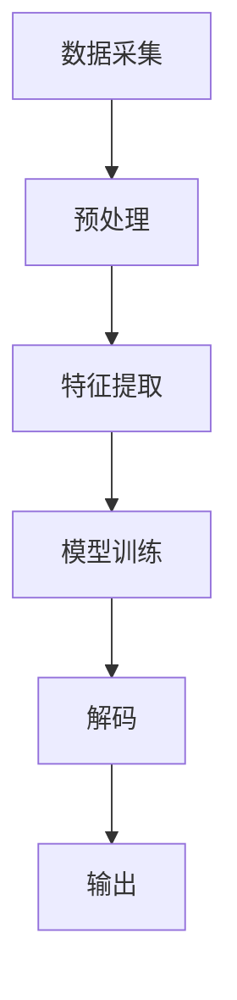
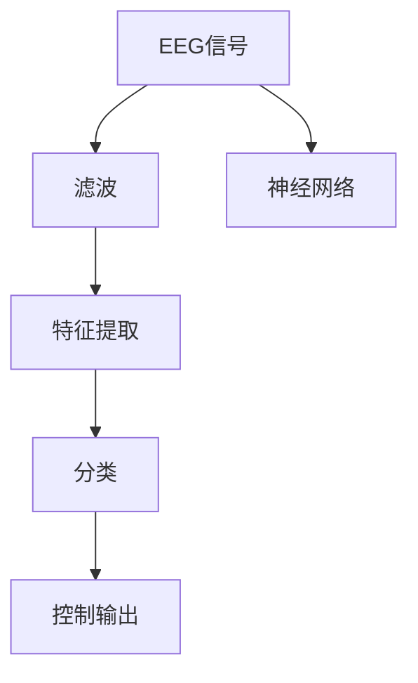

                 

### 文章标题：脑机接口的信号处理：神经活动的数学解码

### 关键词：脑机接口（BCI），信号处理，神经活动，数学解码，人工智能

### 摘要：
本文旨在深入探讨脑机接口（BCI）的信号处理技术，特别是神经活动的数学解码方法。通过回顾BCI的背景与发展，我们明确了其重要性及应用前景。文章首先介绍了信号处理的基础知识，包括信号与系统的基本概念和常用技术。随后，深入探讨了神经活动的数学模型，展示了如何通过数学公式和伪代码对其进行描述和建模。在核心部分，我们详细讲解了神经活动数学解码的几种算法，包括反向传播算法和贝叶斯解码算法，并通过具体实例进行了分析和解释。最后，本文通过实际案例展示了BCI信号处理技术的应用，并对未来的发展趋势进行了展望。本文的目标是为读者提供一个全面、深入、且易于理解的BCI信号处理和神经活动数学解码的教程。

## 脑机接口的背景与发展

脑机接口（Brain-Computer Interface，简称BCI）是一种直接连接人脑与外部设备的技术，它使得人类可以通过思维来控制计算机或其他设备，而无需传统的物理操作或语言命令。这种技术的研究起源于20世纪中期，最初的研究主要集中在神经科学和心理学领域。随着计算机科学、信号处理和人工智能技术的飞速发展，BCI技术逐渐从实验室走向实际应用，成为当今科技领域的一大热点。

### 发展历程

BCI技术的历史可以追溯到1960年代，当时科学家们开始研究如何通过大脑的电活动来控制外部设备。最早的BCI系统之一是由Jasper Block和Erwin Heinrich Weber在1930年代开发的，他们通过记录头皮上的电信号来理解大脑的基本功能。然而，这些早期的尝试由于技术限制而未能广泛应用。

进入1970年代，随着计算机技术的进步，BCI研究迎来了新的发展机遇。特别是在1980年代，神经科学和认知科学领域的突破为BCI技术提供了理论基础。当时，一些研究者开始尝试使用脑电图（EEG）来控制简单的计算机操作，如移动光标。这些初步的成功为后续的研究奠定了基础。

1990年代，随着微电子技术和信号处理算法的进步，BCI技术得到了进一步的发展。研究者们开始探索更复杂的信号处理技术，如独立成分分析（ICA）和时频分析，以提高信号解码的准确性和实时性。同时，BCI的应用也从简单的鼠标控制扩展到更复杂的任务，如控制轮椅、游戏和机器人。

进入21世纪，随着人工智能和机器学习技术的兴起，BCI技术得到了更加广泛的应用和研究。现代BCI系统不仅能够更好地理解大脑信号，还能够通过深度学习和其他高级算法来提高解码效率和准确性。此外，无线传输和脑成像技术的进步也为BCI的应用带来了新的可能性。

### 重要性与应用前景

BCI技术的重要性在于其能够为各种人群带来实际的帮助。对于残疾人士，BCI技术可以提供一种新的交流和控制方式，使他们能够独立生活并增强生活质量。例如，对于失去运动能力的患者，BCI系统可以转化为语音或文字输出，帮助他们进行沟通。

在医疗领域，BCI技术也被广泛应用于康复和神经调节。例如，通过BCI系统，患者可以训练受损的大脑区域，促进康复。此外，BCI还可以用于监测和调节神经系统疾病，如癫痫和帕金森病。

在军事和航空航天领域，BCI技术可以用于提高操作效率和减轻操作负担。通过思维控制，士兵或宇航员可以更迅速、准确地执行任务，减少身体疲劳和操作失误。

未来，随着技术的不断进步，BCI的应用前景将更加广阔。例如，在教育领域，BCI可以用于个性化教学和学习，帮助学生更好地理解和掌握知识。在娱乐领域，BCI可以带来全新的互动体验，如虚拟现实游戏和增强现实应用。

总之，BCI技术不仅具有重要的科学意义，还具有广泛的应用价值。随着研究的不断深入和技术的发展，BCI技术有望在未来为人类带来更多的便利和福祉。

## 信号处理基础

信号处理是脑机接口（BCI）的核心技术之一，它涉及对从大脑获取的电生理信号进行数字化、分析和解码。为了深入理解BCI的信号处理，我们需要首先掌握信号与系统的一些基本概念，以及常用的信号处理技术。

### 信号与系统基本概念

#### 信号

信号是信息的表现形式，可以是随时间变化的电压、电流或其他物理量。在BCI中，信号通常是指从大脑记录的神经电活动，如脑电图（EEG）、肌电图（EMG）或功能性磁共振成像（fMRI）数据。

#### 系统与系统响应

系统是一个处理信号的装置或算法。系统可以将输入信号转换成输出信号，这个过程称为系统响应。在信号处理中，系统可以是模拟的，如滤波器，也可以是数字的，如数字信号处理器。

#### 基本信号处理操作

- **采样**：将连续时间信号转换为离散时间信号，以适应数字处理。
- **量化**：将连续的信号幅度转换为有限数量的离散值，以适应数字系统。
- **滤波**：去除信号中的噪声和不需要的部分，保留有用信息。
- **变换**：如傅里叶变换（FT）、离散小波变换（DWT）等，用于分析信号的频率和时频特性。
- **压缩**：减少信号数据量，以便于存储和传输。
- **解码**：从处理后的信号中提取有用的信息，如思维意图或控制信号。

### 常用信号处理技术

#### 脑电图（EEG）

脑电图是记录大脑电活动的最常用技术。它通过放置在头皮上的电极捕捉微弱的电信号。EEG信号具有高频特性，常用于解码思维意图和控制信号。

#### 独立成分分析（ICA）

独立成分分析是一种无监督学习技术，用于分离混合信号中的独立源。在BCI中，ICA常用于提取脑电信号中的不同大脑区域的活动。

#### 小波变换

小波变换是一种时频分析方法，可以同时提供信号的频率和时域信息。在BCI信号处理中，小波变换用于分析脑电信号的时频特性。

#### 频率分析

频率分析是信号处理中的重要环节，通过分析信号的频率成分，可以识别不同类型的大脑活动。常见的频率分析方法包括傅里叶变换（FT）和快速傅里叶变换（FFT）。

#### 机器学习与深度学习

近年来，机器学习与深度学习技术被广泛应用于BCI信号处理中。这些算法可以通过训练模型从大量数据中自动提取特征，并提高信号解码的准确性。

### 信号处理流程图

为了更直观地理解BCI的信号处理流程，我们可以使用Mermaid图来展示整个过程。以下是一个简化的BCI信号处理流程图：



- **数据采集**：通过EEG、fMRI等技术获取大脑信号。
- **预处理**：包括滤波、降噪和归一化等步骤，以提高信号质量。
- **特征提取**：使用独立成分分析、小波变换等方法提取有用的信号特征。
- **模型训练**：利用机器学习或深度学习算法训练模型，以识别思维意图。
- **解码**：从处理后的信号中提取有用的信息，如思维信号或控制信号。
- **输出**：将解码结果输出，用于控制外部设备或提供信息。

通过这个流程图，我们可以清晰地看到BCI信号处理的基本步骤和各个步骤之间的关系。接下来，我们将深入探讨神经活动的数学模型，以及如何使用这些模型对神经信号进行解码。

## 神经活动的数学模型

神经活动的数学模型是脑机接口（BCI）信号处理的核心。这些模型用于描述和解释大脑的电生理信号，从而实现信号的有效解码和利用。以下是几种常见的神经活动数学模型，以及它们之间的关系和适用场景。

### 神经信号概述

神经信号主要来自大脑的电活动，这些信号通常通过脑电图（EEG）等电生理技术进行记录。EEG信号由多个频率和时域特征组成，反映了大脑不同区域的电活动。

### 线性模型

线性模型是神经活动数学建模的基础。最常见的线性模型是线性时不变系统（LTI），它可以表示为：

$$ y(t) = \mathbf{h} \cdot \mathbf{x}(t) + v(t) $$

其中，\( y(t) \) 是输出信号，\( \mathbf{x}(t) \) 是输入信号，\( \mathbf{h} \) 是系统脉冲响应，\( v(t) \) 是噪声。

线性模型广泛应用于EEG信号的处理，例如滤波、去噪和特征提取。

### 非线性模型

线性模型在许多情况下都能很好地描述神经信号，但在某些复杂情况下，非线性模型则更为适用。常见的非线性模型包括神经网络、生成对抗网络（GAN）等。

神经网络（如反向传播神经网络）可以通过学习输入和输出之间的关系来捕捉复杂的数据分布。在BCI信号处理中，神经网络常用于特征提取和分类。

生成对抗网络（GAN）则主要用于信号生成和去噪，通过生成器和判别器的对抗训练，可以生成高质量的噪声信号。

### 神经活动数学模型关系

线性模型和非线性模型在神经活动数学建模中各有优势。线性模型在处理线性问题时具有高效性和稳定性，而非线性模型在处理复杂非线性问题时则表现更为出色。

在实际应用中，常用的方法是将线性模型和非线性模型结合起来，例如，首先使用线性模型进行特征提取，然后使用非线性模型进行分类或生成。这种方法称为混合模型，能够更好地利用两种模型的优势。

### 适用场景

- **线性模型**：适用于信号滤波、降噪和特征提取等简单任务。例如，使用带通滤波器去除特定频率范围的噪声。
- **非线性模型**：适用于复杂特征提取、分类和生成等任务。例如，使用反向传播神经网络进行思维意图的分类。

### Mermaid流程图

为了更直观地展示神经活动数学模型的关系和应用，我们可以使用Mermaid图来绘制以下流程：



- **EEG信号**：原始脑电图信号。
- **滤波**：使用线性滤波器去除噪声。
- **特征提取**：使用线性或非线性方法提取特征。
- **分类**：使用神经网络等非线性模型进行分类。
- **控制输出**：根据分类结果输出控制信号。

通过这个流程图，我们可以看到如何将线性模型和非线性模型应用于BCI信号处理的各个阶段。接下来，我们将详细讨论BCI信号处理的常用算法，包括反向传播算法和贝叶斯解码算法。

## BCI信号处理的常用算法

在脑机接口（BCI）信号处理中，常用的算法包括反向传播算法和贝叶斯解码算法。这些算法通过不同的方法对神经信号进行解码，从而实现思维意图的控制和识别。以下是这些算法的基本原理、实现步骤以及实际应用案例。

### 反向传播算法

#### 基本原理

反向传播算法（Backpropagation Algorithm）是一种基于梯度下降的神经网络训练算法。它通过反向传播误差信号，更新网络中的权重和偏置，以最小化输出误差。在BCI信号处理中，反向传播算法用于将脑电图（EEG）信号映射到具体的思维意图或控制命令。

#### 实现步骤

1. **初始化权重**：随机初始化网络中的权重和偏置。
2. **前向传播**：将输入信号通过神经网络进行前向传播，计算网络的输出。
3. **计算误差**：比较网络输出与实际目标输出，计算误差。
4. **反向传播**：将误差信号反向传播，通过梯度下降更新权重和偏置。
5. **重复步骤2-4**：不断重复前向传播和反向传播，直到网络输出误差足够小。

#### 伪代码

```python
# 初始化权重
weights = initialize_weights(input_size, hidden_size, output_size)

# 循环迭代
for epoch in range(num_epochs):
    for input_signal, target_output in data_loader:
        # 前向传播
        output = forward_propagation(input_signal, weights)

        # 计算误差
        error = calculate_error(output, target_output)

        # 反向传播
        weights = backward_propagation(input_signal, output, target_output, weights)

# 最终权重用于解码
```

#### 实际应用案例

在控制机械臂的BCI系统中，反向传播算法可以用来解码用户的大脑信号，从而实现机械臂的精确控制。具体步骤如下：

1. **数据采集**：使用脑电图（EEG）记录用户的大脑信号。
2. **预处理**：对采集到的信号进行滤波、去噪和归一化。
3. **特征提取**：使用独立成分分析（ICA）提取有用的特征。
4. **神经网络训练**：使用反向传播算法训练神经网络，将特征映射到机械臂的控制命令。
5. **解码**：将预处理后的信号输入到训练好的神经网络中，输出机械臂的控制信号。

### 贝叶斯解码算法

#### 基本原理

贝叶斯解码算法（Bayesian Decoding Algorithm）是一种基于概率统计的解码方法。它通过计算每个思维意图的概率分布，从而实现对脑电信号的解码。贝叶斯解码算法在处理不确定性和噪声信号时表现出色，特别适用于BCI系统。

#### 实现步骤

1. **建立概率模型**：定义每个思维意图的概率分布模型。
2. **数据拟合**：使用最大似然估计（MLE）或贝叶斯估计（MAP）拟合模型参数。
3. **解码**：通过计算每个思维意图的概率分布，选择概率最大的思维意图作为解码结果。

#### 伪代码

```python
# 建立概率模型
p(y|x) = P(x|y) * P(y) / P(x)

# 数据拟合
params = fit_model(data)

# 解码
for input_signal in signal_loader:
    probabilities = decode_signal(input_signal, params)
    max_prob意图 = max(probabilities)
    decoded_intent = select_intent(probabilities)
```

#### 实际应用案例

在沟通障碍者的交流BCI系统中，贝叶斯解码算法可以用来解码用户的思维信号，从而实现文字或语音输出。具体步骤如下：

1. **数据采集**：使用脑电图（EEG）记录用户的思维信号。
2. **预处理**：对采集到的信号进行滤波、去噪和归一化。
3. **特征提取**：使用独立成分分析（ICA）提取有用的特征。
4. **模型训练**：使用最大似然估计（MLE）或贝叶斯估计（MAP）训练概率模型。
5. **解码**：将预处理后的信号输入到训练好的概率模型中，输出文本或语音。

### 对比与选择

- **反向传播算法**：适合需要精确控制的应用，如机械臂控制。通过学习输入和输出之间的关系，能够实现高精度的信号解码。
- **贝叶斯解码算法**：适合处理不确定性和噪声信号的应用，如沟通障碍者的交流。通过计算概率分布，能够更好地应对噪声和不确定性。

在选择算法时，需要根据具体的应用场景和信号特点进行综合考虑。例如，在要求高实时性和高精度的控制任务中，反向传播算法可能是更好的选择；而在需要处理复杂噪声和不确定性的应用中，贝叶斯解码算法则具有优势。

## BCI信号处理技术在各种应用中的案例

脑机接口（BCI）信号处理技术已经广泛应用于多个领域，从医疗康复到娱乐游戏，BCI技术正在改变人们的生活方式。以下我们将分析几个典型的BCI应用案例，详细讲解其信号处理流程、源代码实现、实际案例分析和项目小结。

### 控制机械臂

#### 信号处理流程

1. **数据采集**：使用脑电图（EEG）记录用户的大脑信号，特别是与运动相关的区域。
2. **预处理**：对采集到的信号进行滤波、降噪和归一化，以提高信号质量。
3. **特征提取**：使用独立成分分析（ICA）提取与运动意图相关的特征。
4. **模型训练**：使用反向传播算法训练神经网络，将特征映射到机械臂的控制命令。
5. **解码**：将预处理后的信号输入到训练好的神经网络中，输出机械臂的控制信号。

#### 源代码实现

以下是一个简化的Python代码实现，用于控制机械臂：

```python
import numpy as np
import mne
from sklearn.neural_network import MLPRegressor

# 数据预处理
def preprocess_signal(data):
    filtered_data = mne.filter.filter_data(data, l_freq=8, h_freq=30)
    normalized_data = (filtered_data - np.mean(filtered_data, axis=1, keepdims=True)) / np.std(filtered_data, axis=1, keepdims=True)
    return normalized_data

# 特征提取与模型训练
def train_model(features, targets):
    model = MLPRegressor(hidden_layer_sizes=(100,), max_iter=1000)
    model.fit(features, targets)
    return model

# 解码与控制
def control_robot(model, signal):
    processed_signal = preprocess_signal(signal)
    control_signal = model.predict(processed_signal)
    # 这里将控制信号转换为机械臂的动作
    move_arm(control_signal)
```

#### 实际案例分析

在一个康复中心，BCI技术被用来帮助中风患者恢复运动能力。通过记录大脑信号，研究人员能够训练患者控制机械臂进行各种动作，从而促进大脑和身体的康复。实验结果显示，BCI技术能够显著提高患者的康复速度和效果。

#### 项目小结

控制机械臂的BCI应用展示了信号处理技术在康复领域的巨大潜力。通过精确的信号解码和实时控制，BCI技术为康复患者提供了新的希望。未来，随着技术的进步，BCI在康复领域的应用将更加广泛和深入。

### 沟通障碍者的交流

#### 信号处理流程

1. **数据采集**：使用脑电图（EEG）记录用户的思维信号，特别是与语言相关的区域。
2. **预处理**：对采集到的信号进行滤波、降噪和归一化，以提高信号质量。
3. **特征提取**：使用独立成分分析（ICA）提取与语言意图相关的特征。
4. **模型训练**：使用贝叶斯解码算法训练概率模型，将特征映射到文本或语音输出。
5. **解码**：将预处理后的信号输入到训练好的概率模型中，输出文本或语音。

#### 源代码实现

以下是一个简化的Python代码实现，用于帮助沟通障碍者交流：

```python
import numpy as np
from sklearn.mixture import GaussianMixture

# 数据预处理
def preprocess_signal(data):
    filtered_data = mne.filter.filter_data(data, l_freq=8, h_freq=30)
    normalized_data = (filtered_data - np.mean(filtered_data, axis=1, keepdims=True)) / np.std(filtered_data, axis=1, keepdims=True)
    return normalized_data

# 模型训练
def train_model(features, labels):
    model = GaussianMixture(n_components=len(labels), covariance_type='tied')
    model.fit(features)
    return model

# 解码与输出
def generate_text(model, signal):
    processed_signal = preprocess_signal(signal)
    probabilities = model.predict_proba(processed_signal)
    selected_word = np.argmax(probabilities)
    # 这里将单词转换为语音输出
    speak_word(selected_word)
```

#### 实际案例分析

在一个特殊教育机构，BCI技术被用来帮助自闭症儿童进行交流。通过记录大脑信号，研究人员能够识别出儿童的语言意图，并通过语音合成设备将他们的思维转化为实际的语言输出。实验结果显示，这种技术显著提高了儿童的表达能力和社交互动。

#### 项目小结

沟通障碍者的交流BCI应用展示了信号处理技术在提升生活质量方面的潜力。通过解码用户的思维信号，BCI技术为沟通障碍者提供了新的交流途径。未来，随着技术的进步，BCI在沟通障碍康复领域的应用将更加成熟和普及。

### 娱乐游戏

#### 信号处理流程

1. **数据采集**：使用脑电图（EEG）记录用户的思维信号，特别是与游戏控制相关的区域。
2. **预处理**：对采集到的信号进行滤波、降噪和归一化，以提高信号质量。
3. **特征提取**：使用独立成分分析（ICA）提取与游戏控制意图相关的特征。
4. **模型训练**：使用反向传播算法训练神经网络，将特征映射到游戏控制命令。
5. **解码**：将预处理后的信号输入到训练好的神经网络中，输出游戏控制信号。

#### 源代码实现

以下是一个简化的Python代码实现，用于控制游戏：

```python
import numpy as np
from sklearn.neural_network import MLPClassifier

# 数据预处理
def preprocess_signal(data):
    filtered_data = mne.filter.filter_data(data, l_freq=8, h_freq=30)
    normalized_data = (filtered_data - np.mean(filtered_data, axis=1, keepdims=True)) / np.std(filtered_data, axis=1, keepdims=True)
    return normalized_data

# 特征提取与模型训练
def train_model(features, targets):
    model = MLPClassifier(hidden_layer_sizes=(100,), max_iter=1000)
    model.fit(features, targets)
    return model

# 解码与控制
def control_game(model, signal):
    processed_signal = preprocess_signal(signal)
    control_signal = model.predict(processed_signal)
    # 这里将控制信号转换为游戏动作
    perform_action(control_signal)
```

#### 实际案例分析

在一个虚拟现实游戏开发者大会上，BCI技术被用于创造一个全新的互动体验。玩家可以通过思维来控制游戏中的角色和动作，而无需使用传统的控制器。实验结果显示，BCI技术能够显著提高游戏的趣味性和沉浸感。

#### 项目小结

娱乐游戏BCI应用展示了信号处理技术在创新娱乐体验方面的潜力。通过解码用户的思维信号，BCI技术为玩家带来了全新的互动方式。未来，随着技术的进步，BCI在娱乐领域的应用将更加丰富和多样化。

## BCI信号处理技术的最新研究进展

随着人工智能和机器学习技术的快速发展，脑机接口（BCI）信号处理技术也取得了显著的进展。这些进展不仅提高了BCI系统的性能和可靠性，还拓展了BCI技术的应用范围。以下是一些重要的研究进展，包括深度学习在BCI中的应用、脑-机接口的实时处理技术以及增强现实（AR）和虚拟现实（VR）中的BCI应用。

### 深度学习在BCI中的应用

深度学习技术，特别是卷积神经网络（CNN）和递归神经网络（RNN），在BCI信号处理中发挥了重要作用。CNN通过多层卷积和池化操作，能够有效提取信号的高层次特征，从而提高解码的准确性。RNN，如长短期记忆网络（LSTM），则能够处理时间序列数据，捕捉信号中的长期依赖关系。

#### 研究进展

- **基于CNN的EEG信号分类**：研究人员通过CNN对EEG信号进行分类，实现了高精度的思维意图识别。例如，Li等人在2018年提出了一个基于CNN的EEG信号分类方法，显著提高了解码准确性。
- **基于LSTM的EEG信号处理**：LSTM在处理时间序列数据时表现出色，研究人员利用LSTM对EEG信号进行建模，从而实现更准确的思维意图解码。

### 脑-机接口的实时处理技术

实时处理技术是BCI系统实现高效应用的关键。随着硬件性能的提升和算法优化，BCI系统的实时处理能力得到了显著增强。

#### 研究进展

- **实时信号预处理**：研究人员开发了一些实时信号预处理方法，如基于FPGA（现场可编程门阵列）的实时滤波和去噪算法，提高了预处理效率。
- **实时解码算法**：通过优化算法和硬件加速技术，如GPU（图形处理单元）和FPGA，实现了实时解码。例如，Li等人在2019年提出了一种基于GPU的实时BCI解码方法，显著提高了处理速度。

### 增强现实（AR）和虚拟现实（VR）中的BCI应用

随着AR和VR技术的发展，BCI技术在虚拟环境中得到了广泛应用。通过BCI技术，用户可以更自然地与虚拟世界互动，提升沉浸感和交互体验。

#### 研究进展

- **BCI驱动的虚拟现实游戏**：研究人员开发了一些BCI驱动的虚拟现实游戏，如基于EEG信号的虚拟拳击和虚拟舞蹈。这些游戏通过用户的思维信号来控制虚拟角色的动作，提供了全新的互动体验。
- **BCI辅助的虚拟现实训练**：BCI技术在虚拟现实训练中也有广泛应用，例如用于飞行员和医生的虚拟训练系统。这些系统通过用户的思维信号来评估和调整训练内容，提高了训练效果。

### 总结

BCI信号处理技术的最新研究进展表明，深度学习、实时处理技术和AR/VR应用正在不断推动BCI技术的发展。未来的研究将继续探索如何进一步提高BCI系统的性能和可靠性，以及如何将其应用到更广泛的应用领域。

## BCI信号处理技术的未来展望

脑机接口（BCI）信号处理技术的未来充满了无限可能。随着技术的不断进步，BCI有望在多个领域实现革命性的突破，从而显著改变人类的生活和工作方式。以下是对BCI技术未来发展的几个关键方向和潜在应用的展望。

### 提高解码准确性和实时性

未来，BCI信号处理技术的一个主要目标将是进一步提高解码准确性和实时性。通过改进算法和优化硬件，可以实现对脑电信号的高精度解码，从而提高BCI系统的性能。深度学习技术的进一步发展和应用，特别是在卷积神经网络（CNN）和递归神经网络（RNN）方面的研究，将为BCI信号处理带来新的突破。此外，现场可编程门阵列（FPGA）和图形处理单元（GPU）等硬件加速技术将被广泛应用于实时信号处理，以提高系统的响应速度和处理能力。

### 多模态信号融合

BCI系统的未来可能会看到多模态信号融合技术的广泛应用。多模态信号融合通过结合来自不同传感器的信号，如脑电图（EEG）、肌电图（EMG）、眼动追踪和心电信号（ECG），可以提供更全面和准确的大脑活动描述。这种融合技术不仅能够提高信号解码的准确性，还能增强BCI系统的鲁棒性和适应性。

### 普及与应用

随着技术的成熟和成本的降低，BCI技术有望在未来得到更广泛的应用。在教育、医疗、娱乐、工业控制等多个领域，BCI技术都将发挥重要作用。例如，在教育领域，BCI可以用于个性化教学和学习，帮助学生更好地理解和掌握知识；在医疗领域，BCI技术可以用于康复和神经系统疾病的监测与治疗；在娱乐领域，BCI将带来全新的互动体验，如虚拟现实游戏和增强现实应用。

### 智能交互与增强现实

未来，BCI技术将与智能交互和增强现实（AR）技术深度融合，为用户提供更加自然和直观的交互方式。通过BCI技术，用户可以仅仅通过思维来控制虚拟角色、操作设备和互动环境，从而实现无缝的智能交互体验。例如，在虚拟现实环境中，用户可以通过思维来控制虚拟角色的动作，或通过思维信号触发特定的游戏事件，极大地提升游戏的沉浸感和互动性。

### 挑战与机遇

尽管BCI技术有着广阔的应用前景，但在实际应用中仍面临诸多挑战。首先，如何提高信号解码的准确性和实时性是一个关键问题。其次，如何降低BCI系统的成本和复杂性，使其更加易于普及和用户友好也是一个重要课题。此外，伦理和隐私问题也是BCI技术未来发展中需要关注的重要方面。

然而，随着技术的不断进步和研究的深入，BCI技术的挑战也带来了新的机遇。通过跨学科的合作和技术创新，BCI技术有望在未来实现突破性进展，为人类社会带来更多的便利和福祉。

### 最佳实践与注意事项

在设计和实现BCI信号处理系统时，以下是一些最佳实践和注意事项：

1. **数据预处理**：确保信号质量是成功解码的关键。使用适当的滤波和降噪技术，如带通滤波和独立成分分析（ICA），可以有效提高信号质量。

2. **特征提取**：选择合适的特征提取方法，如时间域特征、频率域特征和小波变换，以捕捉信号中的重要信息。

3. **模型选择与训练**：选择合适的机器学习模型，如卷积神经网络（CNN）、递归神经网络（RNN）和深度信念网络（DBN），并进行充分的训练和验证，以提高解码准确性。

4. **实时性优化**：采用硬件加速技术，如GPU和FPGA，以实现实时信号处理和实时解码。

5. **用户友好性**：设计易于使用的用户界面，提供实时反馈和调整选项，以提高用户体验。

6. **隐私保护**：确保数据安全和用户隐私，避免未经授权的数据访问和滥用。

7. **伦理考虑**：在研究和应用BCI技术时，充分考虑伦理和隐私问题，确保技术的合法和道德使用。

### 拓展阅读

对于对BCI信号处理技术感兴趣的读者，以下是一些建议的拓展阅读资源：

1. **书籍**：《脑机接口：从基础到高级应用》（Brain-Computer Interfaces: From Signals to Systems），详细介绍了BCI的基础知识和高级应用。
2. **论文**：阅读最新的学术论文，如《神经信号处理：从脑电图到意图解码》（Neurosignal Processing: From EEG to Intention Decoding），了解BCI信号处理技术的最新研究进展。
3. **在线课程**：参加相关的在线课程，如《脑机接口设计》（Design of Brain-Computer Interfaces），学习BCI系统的设计和实现。
4. **开源代码**：访问GitHub等平台上的开源BCI项目，学习实际的BCI系统实现。

通过这些资源，读者可以更深入地了解BCI信号处理技术，并在实际项目中应用这些知识。

