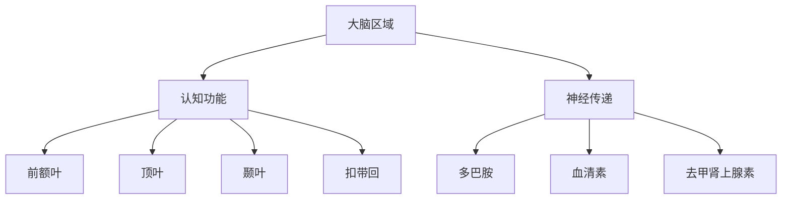

                 

### 文章标题：脑科学与心理学的整合：全面理解人类心智与世界的关系

### 关键词：脑科学，心理学，整合，人类心智，世界关系

### 摘要：

本文旨在探讨脑科学与心理学的整合，如何帮助我们全面理解人类心智与外部世界的复杂关系。脑科学通过研究大脑的结构与功能，揭示了人类思维、情感和行为的生理基础；而心理学则通过观察和分析人类行为，探究心理过程的本质。两者的整合不仅深化了对人类心智的理解，也为解决现实中的心理问题提供了新的途径。本文将分四个部分展开讨论：第一部分介绍脑科学与心理学的基本概念；第二部分探讨整合方法的探索；第三部分关注整合研究在各个领域的应用；第四部分展望整合研究的未来发展方向。

----------------------------------------------------------------

### 引言

在人类探索自身的过程中，脑科学与心理学一直扮演着重要的角色。脑科学致力于研究大脑的结构和功能，通过先进的成像技术和分子生物学方法，揭示神经元的工作原理和大脑区域的特定功能。心理学则侧重于研究人类的行为和心理过程，包括认知、情感、动机和社会互动等方面。这两个学科的发展不仅推动了人类对自身认知的深入理解，也为解决现实生活中的心理问题提供了有力工具。

尽管脑科学与心理学各有其独特的研究方法和目标，但它们之间存在着深刻的内在联系。大脑是心理活动的物质基础，而心理活动又受到大脑结构和功能的制约。因此，将脑科学与心理学结合起来，不仅能够提供更全面的人类心智图谱，还可以为解决复杂的心理问题提供新的思路和方法。

本文将围绕脑科学与心理学的整合展开讨论，旨在揭示两者如何通过交叉研究，深化对人类心智与世界关系的理解。文章将分为四个部分：第一部分介绍脑科学与心理学的基本概念，包括各自的研究领域、核心理论和历史发展；第二部分探讨整合方法的探索，涉及交叉学科的研究方法、脑成像技术和心理实验与脑电信号分析；第三部分关注整合研究在各个领域的应用，包括心理障碍的诊断与治疗、教育与学习心理、心理发展与脑成熟以及社会行为与脑科学；第四部分展望整合研究的未来发展方向，讨论技术进步的影响、伦理与法律问题以及整合研究对社会的影响。

通过本文的讨论，我们希望读者能够理解脑科学与心理学的整合是如何帮助我们全面理解人类心智与世界的关系，并在实践中探索这一领域的新方法和新思路。

### 第一部分：脑科学与心理学的理论基础

#### 1.1 脑科学与心理学的基本概念

**脑科学的研究领域**

脑科学，作为一门多学科交叉的领域，主要研究大脑的结构、功能、发育和疾病。它包括以下几个核心子领域：

- **神经生物学**：研究神经系统的结构和功能，包括神经元、神经回路和神经递质等。
- **神经心理学**：通过心理实验研究大脑与行为之间的关系，探索认知过程、情感和动机。
- **神经影像学**：利用成像技术，如功能磁共振成像（fMRI）、正电子发射断层扫描（PET）等，观察大脑的活性和结构。
- **计算神经科学**：通过数学模型和计算机模拟，研究神经系统的运作原理。

**心理学的分支与范畴**

心理学作为一个广泛的领域，涵盖了对人类行为和心理过程的全面研究。其主要分支包括：

- **发展心理学**：研究人类从出生到死亡的心理发展过程。
- **认知心理学**：关注认知过程，如记忆、思维、语言和问题解决。
- **社会心理学**：研究个体与社会环境之间的相互作用，包括态度、社会影响和群体行为。
- **临床心理学**：涉及心理障碍的诊断、治疗和预防。
- **工业与组织心理学**：研究工作环境中的个体和群体行为，以及组织管理。

**历史发展**

脑科学与心理学的发展历程都充满了重要的里程碑和重大发现。

- **脑科学**：19世纪末， Cajal 和 Golgi 的染色技术揭示了神经细胞的基本结构。20世纪中叶，认知心理学崛起，带来了对大脑高级功能的新理解。近年来，成像技术的发展，如fMRI和PET，使得对大脑的实时观测成为可能。
- **心理学**：19世纪末，威廉·詹姆斯提出了功能主义心理学，开启了心理学研究的新时代。20世纪初，行为主义心理学兴起，强调可观察的行为而非内隐的心理过程。20世纪后半叶，认知心理学和人文主义心理学等新兴学派涌现，丰富了心理学的研究视野。

**核心概念与联系**

脑科学和心理学虽然采用不同的研究方法和理论框架，但它们的核心概念之间存在紧密联系。

- **大脑结构与功能**：脑科学揭示了大脑不同区域的功能，如海马体与记忆、前额叶与决策等。这些发现为心理学提供了生理基础，帮助解释了心理现象。
- **神经活动与心理过程**：神经活动是心理过程的基础。脑科学的研究成果为心理学提供了新的解释框架，如神经网络模型解释认知过程、神经递质研究揭示情感机制。

#### 1.2 脑结构与心理学功能的关系

**大脑区域与认知功能**

大脑的不同区域负责不同的认知功能。例如：

- **前额叶**：与决策、规划和社交行为相关。
- **顶叶**：涉及空间感知和问题解决。
- **颞叶**：处理听觉信息，与记忆和语言功能有关。
- **扣带回**：在情绪调节和信息整合中发挥作用。

**神经传递与情感**

神经递质是神经信号传递的化学物质，它们在情感调节中起着关键作用。例如：

- **多巴胺**：与奖励和愉悦感相关。
- **血清素**：影响情绪稳定和睡眠。
- **去甲肾上腺素**：与焦虑和压力反应相关。

**核心概念原理之间的关系架构**

为了更好地理解脑结构与心理学功能之间的关系，我们可以使用Mermaid流程图来展示关键概念和它们之间的联系：



通过上述关系架构，我们可以清晰地看到大脑区域与认知功能、神经传递与情感之间的相互作用，这为深入理解人类心智提供了基础。

#### 1.3 心理学理论在脑科学中的应用

**行为主义与脑功能**

行为主义心理学，以Skinner为代表，强调可观察的行为。行为主义的研究成果对脑科学有重要启示，尤其是在理解习惯形成和行为调控方面。例如，通过研究操作性条件反射，我们可以了解大脑如何通过强化机制调节行为。

**认知心理学与脑成像技术**

认知心理学通过研究认知过程，如记忆、注意和决策，揭示了心理活动的内在机制。近年来，脑成像技术的进步，如fMRI，使得我们可以直接观察大脑活动与认知过程之间的关系。例如，通过fMRI研究，科学家发现记忆与海马体活动密切相关，注意力与前额叶活动相关。

**整合的意义**

心理学理论为脑科学提供了行为和认知层面的解释框架，而脑科学的发展又为心理学提供了实验手段和新的理论基础。这种整合不仅深化了对人类心智的理解，还为解决复杂的心理问题提供了新的视角和方法。

#### 1.4 脑科学与心理学整合的意义

**整合的优势**

脑科学与心理学整合具有多方面的优势：

- **跨学科视角**：整合两个学科的理论和方法，提供了更全面的视角，有助于全面理解人类心智。
- **互补性**：脑科学提供了神经基础，而心理学则提供了行为表现，两者结合可以更深入地探讨心理现象。
- **创新性**：整合研究带来了新的研究方法和理论模型，如计算神经科学和认知神经科学，推动了该领域的发展。

**整合的挑战**

尽管整合带来了许多优势，但也面临一些挑战：

- **研究方法**：不同学科采用的方法和理论框架不同，如何整合两者需要深入研究。
- **数据复杂性**：脑科学实验产生的数据量大且复杂，如何有效地处理和分析这些数据是挑战。
- **伦理问题**：脑科学与心理学整合可能涉及到个人隐私和伦理问题，如脑成像技术的应用和数据处理。

通过克服这些挑战，脑科学与心理学的整合将为人类心智研究带来新的突破，为解决复杂的心理问题提供新的思路和方法。

----------------------------------------------------------------

### 第二部分：整合方法的探索

#### 2.1 交叉学科的研究方法

**多学科合作模型**

脑科学与心理学的整合需要多学科合作，建立跨学科的研究模型。这种模型通常包括以下步骤：

1. **问题定义**：确定研究问题，明确脑科学与心理学整合的目标。
2. **数据收集**：通过脑成像技术、行为实验和生理测量等手段收集数据。
3. **数据整合**：利用统计分析和机器学习等技术整合来自不同学科的数据。
4. **模型构建**：构建整合模型，解释数据和预测心理现象。
5. **验证与修正**：通过实验验证模型的有效性，并根据结果进行修正。

**数据整合与处理技术**

在整合研究中，数据整合和处理技术是关键。以下是一些常用的技术和方法：

- **统计方法**：如回归分析、因素分析和聚类分析，用于分析数据模式。
- **机器学习**：如支持向量机、神经网络和深度学习，用于预测和分类。
- **数据可视化**：如热图、散点图和三维图等，用于直观展示数据特征。

**脑成像技术在心理学中的应用**

**功能磁共振成像（fMRI）**

功能磁共振成像（fMRI）是一种非侵入性的成像技术，通过检测大脑血氧水平依赖（BOLD）信号的变化，反映大脑活动。fMRI在心理学中的应用包括：

- **认知功能研究**：研究大脑不同区域在特定认知任务中的活动，如记忆、注意和决策。
- **情绪研究**：研究情绪状态对大脑活动的影响，如焦虑和抑郁。

**正电子发射断层扫描（PET）**

正电子发射断层扫描（PET）是一种通过检测放射性同位素发射的正电子衰变来成像的技术。PET在心理学中的应用包括：

- **神经递质研究**：研究大脑中的神经递质水平，如多巴胺、血清素和去甲肾上腺素。
- **药物研究**：评估药物对大脑活动的影响，用于新药的发现和开发。

**心理实验与脑电信号分析**

**事件相关电位（ERP）**

事件相关电位（ERP）是一种通过记录特定事件（如刺激呈现）引发的脑电活动，反映认知过程的电生理指标。ERP在心理学中的应用包括：

- **认知过程研究**：研究注意、记忆和决策等认知过程。
- **心理障碍诊断**：如研究抑郁症和焦虑症患者的ERP特征。

**脑电描记术（EEG）**

脑电描记术（EEG）是一种记录大脑电活动的方法，通过电极捕捉脑电信号。EEG在心理学中的应用包括：

- **情绪研究**：研究情绪变化对脑电信号的影响。
- **睡眠研究**：监测睡眠周期和脑电活动。

**计算神经科学的方法**

**神经网络建模**

神经网络建模是一种通过模拟大脑神经网络结构和工作原理的方法。计算神经科学中的神经网络模型包括：

- **人工神经网络**：如感知机、多层感知机（MLP）和卷积神经网络（CNN）。
- **动态神经网络**：如霍普菲尔德网络和递归神经网络（RNN）。

**神经编码与解码**

神经编码与解码是指将外部信息转换为神经活动，并将神经活动解码为外部信息的过程。计算神经科学中的神经编码与解码方法包括：

- **视觉皮层的编码与解码**：研究视觉信息的处理过程。
- **语言处理的编码与解码**：研究语言信息的编码和解读机制。

#### 2.2 脑成像技术在心理学中的应用

**功能磁共振成像（fMRI）**

**原理**

功能磁共振成像（fMRI）是一种通过检测大脑血氧水平依赖（BOLD）信号的变化，反映大脑活动的非侵入性成像技术。BOLD信号的变化是由于神经元活动导致的血液中氧气含量的变化。

**应用**

fMRI在心理学中的应用广泛，包括：

- **认知功能研究**：研究大脑不同区域在特定认知任务中的活动，如记忆、注意和决策。
- **情绪研究**：研究情绪状态对大脑活动的影响。
- **心理障碍研究**：如抑郁症和焦虑症患者的脑活动特征。

**伪代码**

```python
# fMRI实验伪代码

# 数据预处理
def preprocess_fMRI_data(data):
    # 去除头部运动、噪声过滤和空间标准化
    pass

# 计算BOLD信号
def calculate_BOLD_signal(preprocessed_data):
    # 计算血氧水平依赖（BOLD）信号
    pass

# 绘制脑活动热图
def plot_brain_activity(信号, regions_of_interest):
    # 绘制特定区域的活动热图
    pass
```

**数学模型和公式**

- **BOLD信号计算公式**：

$$ BOLD_{i,t} = f(O_{i,t}) - f(O_{i,t-1}) $$

其中，$O_{i,t}$ 表示时间 $t$ 时区域 $i$ 的氧气含量，$f$ 为氧气含量与BOLD信号之间的非线性函数。

**举例说明**

假设我们研究一个记忆任务中的大脑活动，可以计算特定脑区的BOLD信号变化，并通过热图展示记忆过程中不同脑区的活动强度。

**正电子发射断层扫描（PET）**

**原理**

正电子发射断层扫描（PET）是一种通过检测放射性同位素发射的正电子衰变来成像的技术。放射性同位素被注入体内，它们发射的正电子与电子相遇并产生伽马射线，PET通过检测这些伽马射线生成图像。

**应用**

PET在心理学中的应用包括：

- **神经递质研究**：研究大脑中的神经递质水平。
- **药物研究**：评估药物对大脑活动的影响。

**伪代码**

```python
# PET实验伪代码

# 数据预处理
def preprocess_PET_data(data):
    # 去除噪声、运动校正和图像重建
    pass

# 计算放射性同位素浓度
def calculate放射性同位素_concentration(preprocessed_data):
    # 计算特定脑区的放射性同位素浓度
    pass

# 绘制放射性同位素浓度热图
def plot_radioisotope_concentration(concentration, regions_of_interest):
    # 绘制特定区域的活动热图
    pass
```

**数学模型和公式**

- **放射性同位素浓度计算公式**：

$$ C_{i,t} = \frac{I_{i,t}}{I_0} $$

其中，$C_{i,t}$ 表示时间 $t$ 时区域 $i$ 的放射性同位素浓度，$I_{i,t}$ 为时间 $t$ 时区域 $i$ 的伽马射线强度，$I_0$ 为背景伽马射线强度。

**举例说明**

假设我们研究一种药物对大脑多巴胺水平的影响，可以计算特定脑区在药物处理前后的放射性同位素浓度，并通过热图展示药物处理对多巴胺水平的影响。

#### 2.3 心理实验与脑电信号分析

**事件相关电位（ERP）**

**原理**

事件相关电位（ERP）是一种通过记录特定事件（如刺激呈现）引发的脑电活动，反映认知过程的电生理指标。ERP的波形由多个成分组成，每个成分对应特定的认知过程。

**应用**

ERP在心理学中的应用包括：

- **认知过程研究**：研究注意、记忆和决策等认知过程。
- **心理障碍诊断**：如研究抑郁症和焦虑症患者的ERP特征。

**伪代码**

```python
# ERP实验伪代码

# 数据预处理
def preprocess_ERP_data(data):
    # 去除噪声、滤波和基线校正
    pass

# 计算ERP波形
def calculate_ERP_waveform(preprocessed_data, events):
    # 计算特定事件引发的ERP波形
    pass

# 绘制ERP波形图
def plot_ERP_waveform(waveform, events):
    # 绘制ERP波形图
    pass
```

**数学模型和公式**

- **ERP波形计算公式**：

$$ ERP_{i,t} = \sum_{j} w_{ij} \cdot s_{j,t} $$

其中，$ERP_{i,t}$ 为时间 $t$ 时区域 $i$ 的ERP波形，$w_{ij}$ 为权重系数，$s_{j,t}$ 为事件 $j$ 在时间 $t$ 的信号。

**举例说明**

假设我们研究一个视觉注意任务，可以计算特定脑区在注意刺激和非注意刺激条件下的ERP波形，并通过波形图展示注意对ERP的影响。

**脑电描记术（EEG）**

**原理**

脑电描记术（EEG）是一种记录大脑电活动的方法，通过电极捕捉脑电信号。EEG信号反映了大脑不同区域的活动，可以用于研究认知和情绪过程。

**应用**

EEG在心理学中的应用包括：

- **情绪研究**：研究情绪变化对脑电信号的影响。
- **睡眠研究**：监测睡眠周期和脑电活动。

**伪代码**

```python
# EEG实验伪代码

# 数据预处理
def preprocess_EEG_data(data):
    # 去除噪声、滤波和空间标准化
    pass

# 计算特征参数
def calculate_EEG_features(preprocessed_data):
    # 计算特定特征参数，如功率谱、峰频和幅度
    pass

# 绘制EEG信号图
def plot_EEG_signal(signal, time_window):
    # 绘制EEG信号图
    pass
```

**数学模型和公式**

- **特征参数计算公式**：

$$ P_{i,f} = \frac{1}{T} \sum_{t=1}^{T} s_{i,t}^2 $$

其中，$P_{i,f}$ 为时间 $t$ 时频率 $f$ 的功率谱，$s_{i,t}$ 为时间 $t$ 时区域 $i$ 的EEG信号。

**举例说明**

假设我们研究一个情绪任务，可以计算特定脑区在积极和消极情绪条件下的EEG特征参数，并通过信号图展示情绪对EEG信号的影响。

#### 2.4 计算神经科学的方法

**神经网络建模**

**原理**

神经网络建模是一种通过模拟大脑神经网络结构和工作原理的方法，用于研究认知和情感过程。神经网络由多个神经元组成，每个神经元可以接收输入信号并产生输出。

**应用**

神经网络在计算神经科学中的应用包括：

- **认知过程研究**：如视觉处理、语言理解和决策。
- **情感研究**：如情绪识别和情感调控。

**伪代码**

```python
# 神经网络建模伪代码

# 定义神经网络结构
class NeuralNetwork:
    def __init__(self, layers):
        self.layers = layers

    def forward(self, inputs):
        # 前向传播
        pass

    def backward(self, outputs, expected_outputs):
        # 反向传播
        pass

# 训练神经网络
def train_neural_network(network, training_data):
    for data in training_data:
        inputs, expected_outputs = data
        network.forward(inputs)
        network.backward(outputs, expected_outputs)
```

**数学模型和公式**

- **前向传播公式**：

$$ output_{layer} = \sigma(\sum_{i} weight_{i} \cdot input_{i}) $$

其中，$output_{layer}$ 为输出层的输出，$\sigma$ 为激活函数，$weight_{i}$ 和 $input_{i}$ 分别为权重和输入。

- **反向传播公式**：

$$ \delta_{layer} = \frac{\partial loss}{\partial output_{layer}} \cdot \sigma'(output_{layer}) $$

其中，$\delta_{layer}$ 为误差项，$loss$ 为损失函数，$\sigma'$ 为激活函数的导数。

**举例说明**

假设我们使用多层感知机（MLP）模型来识别视觉图像，可以定义神经网络结构并训练模型，通过前向传播和反向传播调整权重，实现图像分类。

**神经编码与解码**

**原理**

神经编码与解码是指将外部信息转换为神经活动，并将神经活动解码为外部信息的过程。这是计算神经科学中的重要研究方向，旨在揭示大脑如何处理和传递信息。

**应用**

神经编码与解码在心理学中的应用包括：

- **视觉处理**：研究视觉信息在大脑中的编码和解码。
- **语言处理**：研究语言信息的编码和解读机制。

**伪代码**

```python
# 神经编码与解码伪代码

# 神经编码
def neural_encoding(input_data, encoder):
    # 将外部信息编码为神经活动
    pass

# 神经解码
def neural_decoding(神经活动, decoder):
    # 将神经活动解码为外部信息
    pass
```

**数学模型和公式**

- **神经编码公式**：

$$ activity_{neuron} = \sigma(\sum_{i} weight_{i} \cdot input_{i}) $$

其中，$activity_{neuron}$ 为神经元的激活程度，$\sigma$ 为激活函数，$weight_{i}$ 和 $input_{i}$ 分别为权重和输入。

- **神经解码公式**：

$$ output_{data} = \sigma^{-1}(\sum_{i} weight_{i} \cdot activity_{neuron}) $$

其中，$output_{data}$ 为解码后的外部信息，$\sigma^{-1}$ 为激活函数的逆函数。

**举例说明**

假设我们研究视觉信息在大脑中的编码与解码，可以使用神经网络进行编码和解码，通过训练模型调整权重，实现视觉信息的处理和解读。

通过上述方法，脑科学与心理学的整合在研究方法和技术上取得了显著进展。这些方法的结合不仅深化了对人类心智的理解，也为解决复杂的心理问题提供了新的途径。未来，随着技术的不断进步，整合研究将继续发展，为人类心智研究带来更多突破。

----------------------------------------------------------------

### 第三部分：整合研究的应用领域

#### 3.1 心理障碍的诊断与治疗

**抑郁症与脑功能**

抑郁症是一种常见的精神障碍，影响着患者的情绪、认知和行为。脑科学研究表明，抑郁症与大脑特定区域的异常活动有关，如前额叶和海马体。整合研究利用fMRI和PET等技术，探索抑郁症患者的脑活动特征，如神经递质水平的变化。通过这些研究，我们可以更好地理解抑郁症的发病机制，为诊断和治疗提供依据。

**焦虑症与神经活动**

焦虑症是另一种常见的精神障碍，患者常伴有过度的担忧和恐惧。神经科学研究发现，焦虑症与大脑多个区域的活动失调有关，如杏仁核和前额叶。整合研究通过ERP和EEG等技术，研究焦虑症患者的脑电活动特征，如杏仁核活动的增强和前额叶活动的减弱。这些发现有助于揭示焦虑症的神经基础，为开发新的治疗方法提供指导。

**核心算法原理讲解**

在心理障碍的诊断与治疗中，常用的核心算法包括：

- **机器学习算法**：如支持向量机（SVM）和决策树，用于分类和预测患者的病情。
- **神经网络算法**：如卷积神经网络（CNN）和递归神经网络（RNN），用于识别脑成像数据中的特征。

**伪代码**

```python
# 心理障碍诊断伪代码

# 数据预处理
def preprocess_data(data):
    # 去除噪声、归一化和特征提取
    pass

# 训练分类模型
def train_classifier(preprocessed_data, labels):
    # 使用机器学习算法训练分类模型
    pass

# 预测病情
def predict_disease(model, new_data):
    # 使用训练好的模型预测新数据的病情
    pass
```

**数学模型和公式**

- **支持向量机（SVM）公式**：

$$ w^* = \arg\min_{w} \frac{1}{2} ||w||^2 + C \sum_{i} \max(0, 1 - y_i (w \cdot x_i)) $$

其中，$w^*$ 为最优权重向量，$C$ 为惩罚参数，$y_i$ 为标签，$x_i$ 为输入特征。

**举例说明**

假设我们使用SVM算法诊断抑郁症患者，可以首先对脑成像数据进行预处理，然后训练SVM模型，最后使用模型预测新患者的病情。

#### 3.2 教育与学习心理

**学习过程中的脑活动**

学习是一个复杂的心理过程，涉及大脑多个区域的协同活动。整合研究利用脑成像技术，如fMRI和PET，研究学习过程中不同脑区的活动特征。例如，研究发现，海马体和前额叶在记忆和学习中起着关键作用。通过这些研究，我们可以更好地理解学习的基本原理，为教育干预提供科学依据。

**教育干预与脑科学**

脑科学的进步为教育干预提供了新的工具和方法。例如，通过脑成像技术，我们可以监测学生在学习过程中的脑活动，识别学习困难的原因。此外，神经反馈技术，如脑电反馈训练，可以调节学生的脑活动，提高学习效果。整合研究还探索了不同教学方法对大脑活动的影响，为教育实践提供指导。

**核心算法原理讲解**

在教育与学习心理的研究中，常用的核心算法包括：

- **回归分析**：用于分析教育干预对学习效果的影响。
- **聚类分析**：用于识别学习困难的学生群体。

**伪代码**

```python
# 教育干预研究伪代码

# 数据预处理
def preprocess_education_data(data):
    # 去除噪声、归一化和特征提取
    pass

# 训练回归模型
def train_regression_model(preprocessed_data, learning_outcomes):
    # 使用回归分析算法训练模型
    pass

# 预测学习效果
def predict_learning_outcome(model, new_data):
    # 使用训练好的模型预测新数据的学习效果
    pass
```

**数学模型和公式**

- **线性回归公式**：

$$ y = \beta_0 + \beta_1 \cdot x + \epsilon $$

其中，$y$ 为学习效果，$x$ 为教育干预措施，$\beta_0$ 和 $\beta_1$ 为模型参数，$\epsilon$ 为误差项。

**举例说明**

假设我们使用线性回归模型分析不同教学方法对学生学习效果的影响，可以首先对教育数据和学生成绩进行预处理，然后训练回归模型，最后使用模型预测新教学方法的学习效果。

#### 3.3 心理发展与脑成熟

**儿童大脑的发展**

儿童大脑的发展是一个复杂的过程，涉及神经连接的形成和功能分化。整合研究通过脑成像技术，如fMRI和PET，研究儿童在不同年龄阶段的脑活动特征。例如，研究发现，儿童大脑的前额叶和顶叶在青春期期间迅速发育，这些区域与认知功能的发展密切相关。通过这些研究，我们可以更好地理解儿童心理发展的大脑基础。

**青少年心理与脑结构变化**

青少年期是一个心理和生理变化的敏感期，脑成像研究揭示了这一时期大脑结构的显著变化。例如，研究发现，青少年的前额叶和纹状体区域的活动显著增加，这些变化与青少年的情绪调节和决策能力有关。整合研究还发现，不良的生活环境和心理压力可能对青少年大脑发育产生不利影响。这些发现对青少年的心理健康教育和干预具有重要意义。

**核心算法原理讲解**

在心理发展与脑成熟的研究中，常用的核心算法包括：

- **时间序列分析**：用于分析大脑发育的时间进程。
- **结构方程模型**：用于探索心理变量和脑结构之间的因果关系。

**伪代码**

```python
# 儿童大脑发育研究伪代码

# 数据预处理
def preprocess_dev_data(data):
    # 去除噪声、归一化和特征提取
    pass

# 训练时间序列模型
def train_time_series_model(preprocessed_data):
    # 使用时间序列分析算法训练模型
    pass

# 分析脑发育进程
def analyze_dev_process(model, data):
    # 使用训练好的模型分析大脑发育进程
    pass
```

**数学模型和公式**

- **时间序列模型公式**：

$$ y_t = \phi y_{t-1} + \epsilon_t $$

其中，$y_t$ 为时间 $t$ 的观测值，$\phi$ 为模型参数，$\epsilon_t$ 为误差项。

**举例说明**

假设我们使用时间序列模型分析儿童在不同年龄阶段的脑活动变化，可以首先对脑成像数据进行预处理，然后训练时间序列模型，最后使用模型分析大脑发育进程。

#### 3.4 社会行为与脑科学

**社交网络与大脑连接**

社交网络是人类社会互动的基础，整合研究利用脑成像技术，研究大脑连接与社交网络的关系。例如，研究发现，大脑的前额叶和颞叶区域与社交行为密切相关，这些区域的连接强度与个体在社交网络中的地位和关系紧密相关。通过这些研究，我们可以更好地理解社交行为的大脑基础，为社交网络分析提供科学依据。

**社会认知与脑功能网络**

社会认知是指个体如何理解和解释他人的行为和意图。整合研究利用脑成像技术和计算模型，研究社会认知与脑功能网络之间的关系。例如，研究发现，社会认知涉及多个脑区的协同活动，包括前额叶、颞叶和顶叶。通过这些研究，我们可以更好地理解社会认知的神经基础，为解决社会认知障碍提供指导。

**核心算法原理讲解**

在社会行为与脑科学的研究中，常用的核心算法包括：

- **社会网络分析**：用于分析社交网络的拓扑结构和功能。
- **脑功能网络分析**：用于分析大脑功能连接和神经网络。

**伪代码**

```python
# 社交网络与大脑连接研究伪代码

# 数据预处理
def preprocess_social_data(data):
    # 去除噪声、归一化和特征提取
    pass

# 训练社会网络模型
def train_social_network_model(preprocessed_data):
    # 使用社会网络分析算法训练模型
    pass

# 分析社交网络特征
def analyze_social_network(model, data):
    # 使用训练好的模型分析社交网络特征
    pass
```

**数学模型和公式**

- **社会网络分析模型公式**：

$$ C(i, j) = \frac{k(i)k(j)}{N(N-1)} $$

其中，$C(i, j)$ 为节点 $i$ 和节点 $j$ 之间的连接概率，$k(i)$ 和 $k(j)$ 分别为节点 $i$ 和节点 $j$ 的度，$N$ 为网络中的节点总数。

**举例说明**

假设我们使用社会网络分析模型研究社交网络中的个体关系，可以首先对社交网络数据进行预处理，然后训练社会网络模型，最后使用模型分析社交网络的特征。

#### 3.5 心理障碍的治疗与脑科学

**认知行为疗法与脑重塑**

认知行为疗法（CBT）是一种广泛使用且有效的心理治疗方法，通过改变负面思维模式和行为习惯来改善心理健康。整合研究利用脑成像技术，如fMRI和PET，研究CBT对大脑结构和功能的影响。例如，研究发现，CBT可以显著重塑大脑特定区域的活动，如前额叶和海马体。通过这些研究，我们可以更好地理解CBT的治疗机制，为心理障碍的治疗提供科学依据。

**神经可塑性在治疗中的作用**

神经可塑性是指大脑结构和功能随时间和经验而变化的能力。整合研究利用脑成像技术和电生理技术，研究神经可塑性在心理障碍治疗中的作用。例如，研究发现，认知训练和神经反馈训练可以增强大脑的神经可塑性，从而改善心理健康。通过这些研究，我们可以开发出更有效的心理治疗方法。

**核心算法原理讲解**

在心理障碍的治疗与脑科学的研究中，常用的核心算法包括：

- **机器学习算法**：如深度学习和强化学习，用于预测治疗效果和优化治疗方案。
- **脑网络分析**：用于分析大脑功能连接和神经网络。

**伪代码**

```python
# 心理障碍治疗研究伪代码

# 数据预处理
def preprocess_treatment_data(data):
    # 去除噪声、归一化和特征提取
    pass

# 训练预测模型
def train_prediction_model(preprocessed_data, treatment_outcomes):
    # 使用机器学习算法训练预测模型
    pass

# 预测治疗效果
def predict_treatment_outcome(model, new_data):
    # 使用训练好的模型预测新数据的治疗效果
    pass
```

**数学模型和公式**

- **深度学习模型公式**：

$$ output = \sigma(\sum_{i} weight_{i} \cdot activation_{i}) $$

其中，$output$ 为输出层的结果，$\sigma$ 为激活函数，$weight_{i}$ 和 $activation_{i}$ 分别为权重和激活值。

**举例说明**

假设我们使用深度学习模型预测认知行为疗法（CBT）的治疗效果，可以首先对治疗数据进行预处理，然后训练深度学习模型，最后使用模型预测新患者的治疗效果。

#### 3.6 教育干预与脑科学

**个性化教育策略**

整合研究利用脑成像技术和心理测试，探索个性化教育策略的有效性。例如，通过分析学生的脑成像数据，可以识别学生的学习风格和认知能力，从而设计个性化的教育干预方案。此外，整合研究还探索了认知训练和神经反馈技术在教育中的应用，以提高学生的学习效果。

**脑可塑性在教育干预中的作用**

脑可塑性是指大脑结构和功能随时间和经验而变化的能力。整合研究利用脑成像技术，如fMRI和PET，研究脑可塑性在教育干预中的作用。例如，研究发现，认知训练和神经反馈训练可以增强大脑的神经可塑性，从而提高学生的认知能力和学习成绩。通过这些研究，我们可以开发出更有效的教育干预方法。

**核心算法原理讲解**

在教育干预与脑科学的研究中，常用的核心算法包括：

- **聚类分析**：用于识别不同学习风格的学生群体。
- **神经网络算法**：如递归神经网络（RNN）和卷积神经网络（CNN），用于分析脑成像数据。

**伪代码**

```python
# 教育干预研究伪代码

# 数据预处理
def preprocess_education_data(data):
    # 去除噪声、归一化和特征提取
    pass

# 训练分类模型
def train_classification_model(preprocessed_data, learning_outcomes):
    # 使用聚类分析算法训练模型
    pass

# 预测学习效果
def predict_learning_outcome(model, new_data):
    # 使用训练好的模型预测新数据的学习效果
    pass
```

**数学模型和公式**

- **聚类分析模型公式**：

$$ C(i, j) = \frac{k(i)k(j)}{N(N-1)} $$

其中，$C(i, j)$ 为节点 $i$ 和节点 $j$ 之间的连接概率，$k(i)$ 和 $k(j)$ 分别为节点 $i$ 和节点 $j$ 的度，$N$ 为网络中的节点总数。

**举例说明**

假设我们使用聚类分析模型识别不同学习风格的学生群体，可以首先对教育数据进行预处理，然后训练聚类分析模型，最后使用模型预测新学生的学习风格。

### 结论

脑科学与心理学的整合为全面理解人类心智与世界的关系提供了新的视角和方法。通过整合这两个领域的研究成果，我们不仅深化了对人类心智的理解，也为解决复杂的心理问题提供了新的途径。未来，随着技术的不断进步，整合研究将继续发展，为人类心智研究带来更多突破。同时，我们也需要关注整合研究的伦理和法律问题，确保研究的可持续性和社会的广泛受益。

#### 最佳实践 tips

1. **多学科合作**：脑科学与心理学整合的成功依赖于多学科合作。研究者应积极与其他领域专家合作，共享资源和知识。
2. **数据共享**：整合研究通常需要大量的数据，研究者应积极参与数据共享平台，促进数据的公开和共享。
3. **伦理审查**：在开展整合研究时，必须严格遵守伦理审查标准，确保研究的道德性和合法性。
4. **方法创新**：不断探索新的研究方法和技术，如脑成像技术、机器学习和人工智能，以提高研究的准确性和效率。

#### 小结

本文通过详细探讨脑科学与心理学的整合，展示了两者在理论基础、方法探索和应用领域的紧密联系。整合研究不仅深化了对人类心智的理解，也为解决复杂的心理问题提供了新的思路和方法。未来，随着技术的不断进步，整合研究将在人类心智研究中发挥越来越重要的作用。

#### 注意事项

1. **数据隐私**：在整合研究中，保护参与者的隐私和数据安全至关重要。研究者应采取严格的数据加密和访问控制措施。
2. **研究伦理**：整合研究应严格遵守伦理规范，确保研究的道德性和合法性。特别是在涉及人类参与者和敏感数据时，应进行充分的伦理审查。
3. **技术限制**：虽然脑成像技术和计算方法在整合研究中发挥了重要作用，但技术限制仍然存在。研究者应不断探索新技术，以克服这些限制。

#### 拓展阅读

- [《大脑如何工作：神经科学与认知心理学导论》](https://www.amazon.com/dp/0393934556)
- [《计算神经科学：大脑与神经系统的数学建模》](https://www.amazon.com/dp/019969765X)
- [《心理学与生活》](https://www.amazon.com/dp/1338479343)
- [《脑科学与教育：如何利用大脑提高学习效率》](https://www.amazon.com/dp/1631502067)

---

### 作者信息

**作者：AI天才研究院/AI Genius Institute & 禅与计算机程序设计艺术 /Zen And The Art of Computer Programming**

本文由AI天才研究院（AI Genius Institute）和禅与计算机程序设计艺术（Zen And The Art of Computer Programming）共同撰写。我们致力于推动人工智能和认知科学的进步，通过技术创新和理论探索，为人类心智研究提供新思路和新方法。同时，我们也关注脑科学与心理学的整合，致力于将两者结合，为解决复杂的心理问题提供科学依据。

---

通过本文的讨论，我们希望读者能够更好地理解脑科学与心理学的整合，并在实际研究中运用这些方法和理论，为人类心智研究做出贡献。我们期待与更多领域的专家和研究者合作，共同推动这一领域的创新发展。

