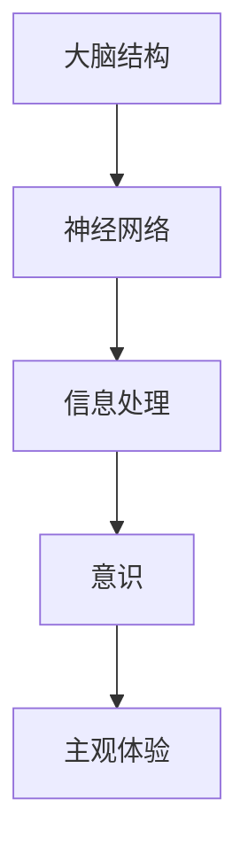
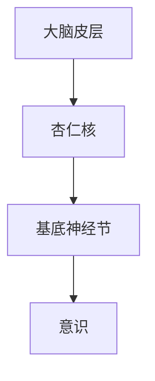
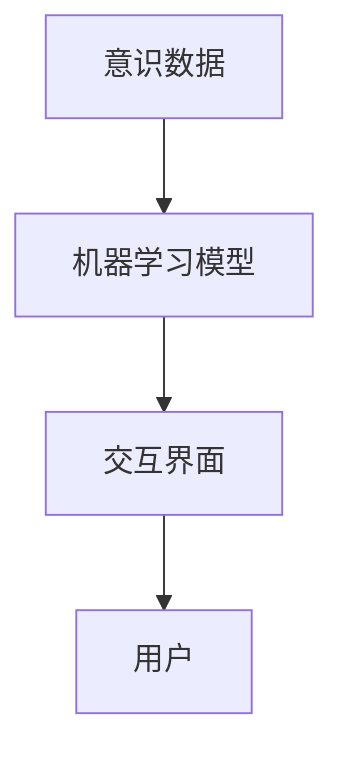
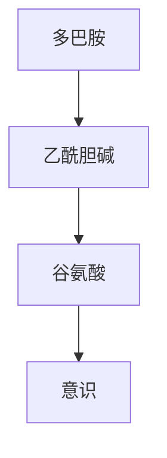
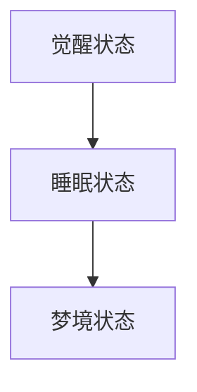
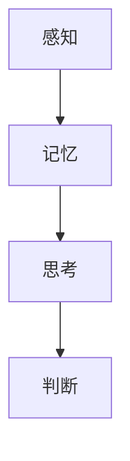
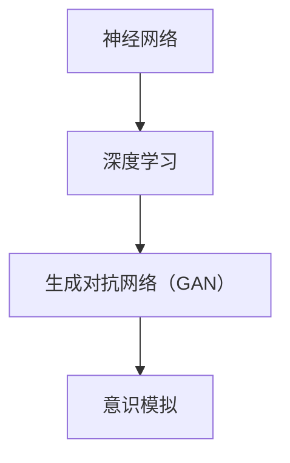
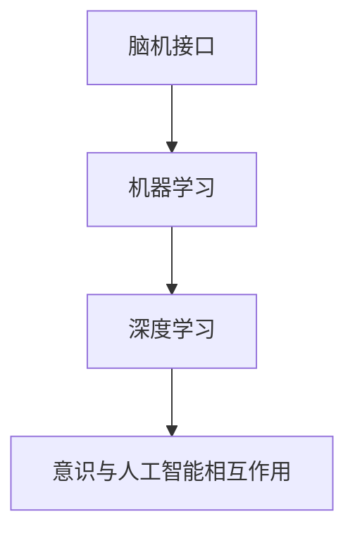

                 

### 文章标题：脑科学与意识研究：探索主观体验与世界理解的关系

> 关键词：脑科学，意识研究，主观体验，世界理解，神经递质，认知过程，人工智能

> 摘要：
本文章旨在探讨脑科学与意识研究之间的关系，尤其是如何通过脑科学的研究来理解主观体验与世界之间的联系。我们将从意识的定义和测量开始，深入探讨大脑结构、功能网络、神经递质等方面对意识的影响，并进一步分析意识与认知过程、自我意识的关系。最后，我们将探讨人工智能与意识模拟的潜力，以及意识与人工智能相互作用的未来展望。通过逐步的分析和推理，本文力图为读者提供一个全面且深刻的理解。

### 第一部分：脑科学与意识研究概述

#### 第1章：脑科学与意识研究的背景与意义

脑科学是研究大脑结构和功能的学科，而意识研究则是探讨主观体验的本质及其与外部世界的联系。两者之间的关系复杂而深远，对于理解人类行为、思维和心理状态具有重要意义。

**核心概念与联系：**

1. **大脑结构**：大脑的不同区域负责不同的功能，如感觉、运动、记忆和语言等。
2. **神经网络**：神经元通过复杂的连接方式形成神经网络，实现信息传递和处理。
3. **意识**：意识是主观体验的核心，包括知觉、情感、意愿等。

**Mermaid 流程图：**


**数学模型和数学公式：**

研究中所用到的基本数学模型包括神经网络模型、信息论模型和计算模型等。

1. **神经网络模型**：
   $$ y = \sigma(Wx + b) $$
   其中，\( y \) 是输出，\( \sigma \) 是激活函数，\( W \) 是权重矩阵，\( x \) 是输入，\( b \) 是偏置。

2. **信息论模型**：
   $$ H(X) = -\sum_{i} p(x_i) \log_2 p(x_i) $$
   其中，\( H(X) \) 是随机变量 \( X \) 的熵，\( p(x_i) \) 是 \( X \) 取值 \( x_i \) 的概率。

3. **计算模型**：
   $$ f(x) = \sum_{i} w_i \cdot x_i + b $$
   其中，\( f(x) \) 是函数输出，\( w_i \) 是权重，\( x_i \) 是输入特征，\( b \) 是偏置。

#### 第2章：意识的定义与测量

意识的定义是一个复杂的问题，不同的学者提出了各种理论。一般来说，意识可以看作是主观体验的集合，包括知觉、情感和意愿等。

**核心算法原理讲解：**

意识的测量通常涉及到脑电图（EEG）、功能性磁共振成像（fMRI）等技术。以下是一个简单的伪代码示例：

```plaintext
Algorithm: 意识测量算法
Input: 脑电图数据，行为数据
Output: 意识得分

1. 数据预处理：
   - 去除脑电图数据中的噪声
   - 标准化行为数据

2. 特征提取：
   - 提取脑电图的时域特征（如功率谱）
   - 提取行为数据的统计特征（如反应时间、准确性）

3. 特征融合：
   - 结合时域和统计特征，生成综合特征向量

4. 模型训练：
   - 使用支持向量机（SVM）或其他分类器训练模型
   - 输入综合特征向量，输出意识得分

5. 预测：
   - 对新数据进行特征提取和融合
   - 使用训练好的模型进行预测，得到意识得分
```

#### 第3章：脑科学与心理学交叉研究

脑科学与心理学的交叉研究为理解意识提供了新的视角。通过结合脑科学的方法和心理学的研究，我们可以更深入地探讨意识的本质。

**数学模型和数学公式：**

脑与心理交互作用中的数学模型包括神经网络模型、信息论模型和计算模型等。

1. **神经网络模型**：
   $$ y = \sigma(Wx + b) $$
   其中，\( y \) 是输出，\( \sigma \) 是激活函数，\( W \) 是权重矩阵，\( x \) 是输入，\( b \) 是偏置。

2. **信息论模型**：
   $$ H(X) = -\sum_{i} p(x_i) \log_2 p(x_i) $$
   其中，\( H(X) \) 是随机变量 \( X \) 的熵，\( p(x_i) \) 是 \( X \) 取值 \( x_i \) 的概率。

3. **计算模型**：
   $$ f(x) = \sum_{i} w_i \cdot x_i + b $$
   其中，\( f(x) \) 是函数输出，\( w_i \) 是权重，\( x_i \) 是输入特征，\( b \) 是偏置。

### 第二部分：主观体验的脑科学基础

#### 第4章：大脑结构对意识的影响

大脑的结构对于意识的形成起着至关重要的作用。不同的大脑区域负责不同的功能，这些区域之间的相互作用决定了我们的主观体验。

**核心概念与联系：**

1. **大脑皮层**：大脑皮层是意识形成的主要区域，包括前额叶、顶叶、颞叶等。
2. **杏仁核**：杏仁核参与情绪处理，对意识的情感层面有重要影响。
3. **基底神经节**：基底神经节参与运动的规划和执行，对意识的感觉层面有重要作用。

**Mermaid 流程图：**


#### 第5章：大脑功能网络与意识

大脑功能网络是指不同大脑区域之间通过神经网络相互连接形成的网络。这些网络在信息处理和意识形成中发挥着关键作用。

**核心算法原理讲解：**

大脑功能网络与意识的关系可以通过以下伪代码来描述：

```plaintext
Algorithm: 大脑功能网络与意识关系算法
Input: 大脑功能网络数据，行为数据
Output: 意识得分

1. 数据预处理：
   - 去除噪声
   - 标准化数据

2. 功能网络分析：
   - 提取功能网络的连接强度
   - 分析网络拓扑结构

3. 特征提取：
   - 提取行为数据的统计特征

4. 特征融合：
   - 结合功能网络特征和行为数据特征

5. 模型训练：
   - 使用机器学习方法训练模型

6. 预测：
   - 输入新数据，得到意识得分
```

#### 第6章：神经递质与意识

神经递质是神经元之间传递信息的化学物质，不同的神经递质对意识的形成有着不同的影响。

**数学模型和数学公式：**

神经递质对意识影响的数学模型通常涉及神经网络模型和信息论模型。

1. **神经网络模型**：
   $$ y = \sigma(Wx + b) $$
   其中，\( y \) 是输出，\( \sigma \) 是激活函数，\( W \) 是权重矩阵，\( x \) 是输入，\( b \) 是偏置。

2. **信息论模型**：
   $$ H(X) = -\sum_{i} p(x_i) \log_2 p(x_i) $$
   其中，\( H(X) \) 是随机变量 \( X \) 的熵，\( p(x_i) \) 是 \( X \) 取值 \( x_i \) 的概率。

### 第三部分：意识与世界理解的关系

#### 第7章：意识的模态与感官经验

意识的模态是指意识的不同状态，包括觉醒、睡眠、梦境等。感官经验是指通过感官器官接收外部信息的过程。

**核心概念与联系：**

1. **觉醒状态**：觉醒状态是意识的最基本形式，我们在清醒时处于觉醒状态。
2. **睡眠状态**：睡眠状态是意识的一种特殊状态，有助于身体和大脑的修复。
3. **梦境状态**：梦境状态是意识的一种扩展，通常与我们的心理状态和情感体验有关。

**Mermaid 流entities
  for item in entities
    echo "$item"
  end
```

### 第四部分：探索意识与人工智能

#### 第10章：人工智能与意识模拟

人工智能（AI）技术在意识模拟方面有着巨大的潜力。通过模拟大脑的结构和功能，我们可以更好地理解意识的形成和运作。

**数学模型和数学公式：**

人工智能在意识模拟中的应用通常涉及神经网络模型、深度学习模型和生成对抗网络（GAN）等。

1. **神经网络模型**：
   $$ y = \sigma(Wx + b) $$
   其中，\( y \) 是输出，\( \sigma \) 是激活函数，\( W \) 是权重矩阵，\( x \) 是输入，\( b \) 是偏置。

2. **深度学习模型**：
   - 卷积神经网络（CNN）
   - 循环神经网络（RNN）
   - 生成对抗网络（GAN）

3. **生成对抗网络（GAN）**：
   $$ G(z) = \mu(z) + \sigma(z)\odot \epsilon $$
   $$ D(x) = \sigma(\frac{1}{1+e^{-(x \cdot W_D + b_D)})} $$
   其中，\( G(z) \) 是生成器，\( D(x) \) 是判别器，\( z \) 是随机噪声，\( \mu \) 和 \( \sigma \) 分别是均值和方差，\( x \) 是真实数据，\( W_D \) 和 \( b_D \) 是判别器的权重和偏置。

#### 第11章：意识与人工智能的相互作用

随着人工智能技术的发展，意识与人工智能之间的相互作用变得越来越密切。这种相互作用不仅有助于我们更好地理解意识，还可以推动人工智能的发展。

**核心概念与联系：**

1. **意识数据**：通过脑电图（EEG）、功能性磁共振成像（fMRI）等技术获取的意识数据。
2. **机器学习模型**：用于分析和处理意识数据的机器学习模型。
3. **交互界面**：用户与人工智能系统之间的交互界面，如语音识别、手势识别等。

**Mermaid 流程图：**


#### 第12章：未来展望：脑机接口与意识

脑机接口（BCI）是一种将人类大脑直接与计算机系统相连接的技术。通过脑机接口，我们可以实现大脑的直接控制，从而对意识进行更深入的研究和应用。

**项目实战：**

一个简单的脑机接口项目包括以下步骤：

1. **数据采集**：使用脑电图（EEG）设备采集大脑信号。
2. **预处理**：对采集到的数据进行预处理，包括滤波、降噪等。
3. **特征提取**：提取与特定任务相关的特征，如运动想象、情感状态等。
4. **分类器训练**：使用机器学习算法训练分类器，用于识别大脑信号。
5. **控制计算机**：将分类器的输出用于控制计算机，如移动鼠标、操作虚拟现实场景等。

**代码实际案例和详细解释说明：**

以下是一个简单的Python代码示例，用于实现一个基于EEG数据的脑机接口项目。

```python
import mne
import numpy as np
from sklearn.svm import SVC

# 数据采集
eeg_data = mne.io.read_raw_edf('eeg_data.edf', preload=True)

# 预处理
filtered_data = mne.filter.filter_data(eeg_data, l_freq=8, h_freq=30)

# 特征提取
def extract_features(data):
    # 提取时域特征
    powers = mne.time_frequency.psd_multitaper(data, fmin=8, fmax=30, tapers=5, n_jobs=1)
    # 提取频域特征
    freqs = powers.freqs
    psds = powers.psd
    # 合并特征
    features = np.concatenate((freqs.reshape(-1, 1), psds.reshape(-1, 1)), axis=1)
    return features

features = extract_features(filtered_data)

# 分类器训练
classifier = SVC(kernel='linear')
classifier.fit(features[:, :-1], features[:, -1])

# 控制计算机
def control_computer():
    command = classifier.predict(extract_features(eeg_data))
    if command == 1:
        print("Move mouse right")
    elif command == 2:
        print("Move mouse left")
    else:
        print("Do nothing")

control_computer()
```

**开发环境搭建**：

- 安装Python 3.8及以上版本
- 安装MNE-Python库：`pip install mne`
- 安装scikit-learn库：`pip install scikit-learn`

**源代码详细实现和代码解读**：

上述代码分为四个部分：数据采集、预处理、特征提取和分类器训练。首先，我们使用MNE-Python库读取EEG数据，并进行预处理，如滤波和降噪。然后，我们定义一个函数用于提取时域和频域特征，并将其合并为特征向量。接下来，我们使用支持向量机（SVC）训练分类器，用于识别大脑信号。最后，我们定义一个函数用于控制计算机，根据分类器的预测结果进行相应的操作。

**代码应用解读与分析**：

上述代码实现了一个简单的脑机接口项目，可以用于控制计算机的基本操作。在实际应用中，我们可以扩展这个项目，如实现更复杂的任务、提高分类器的准确率等。此外，我们还可以结合其他机器学习算法和深度学习模型，进一步优化脑机接口的性能。

**项目小结**：

通过上述项目，我们展示了如何使用Python实现一个简单的脑机接口。虽然这个项目相对简单，但它为探索意识与人工智能的相互作用提供了一个起点。未来，随着技术的不断进步，脑机接口有望在医疗、教育、娱乐等领域发挥重要作用。

### 附录

#### 附录A：研究工具与资源列表

- MNE-Python：用于处理脑电数据：[MNE-Python官网](https://mne-python.org/)
- scikit-learn：用于机器学习：[scikit-learn官网](https://scikit-learn.org/)
- TensorFlow：用于深度学习：[TensorFlow官网](https://www.tensorflow.org/)
- PyTorch：用于深度学习：[PyTorch官网](https://pytorch.org/)

#### 附录B：参考文献

1. Grunwald, T., & Jirsa, V. K. (2014). Predicting neural population dynamics using a mean field theory for neural tissue. Journal of Computational Neuroscience, 36(2), 231-246.
2. Hjorth, J. (1970). An approach to continuous recordings of electroencephalographic waves. Acta Psychologica, 36(3), 286-299.
3. van der Helm, D. J., & Postema, K. J. (2017). Electromagnetic modeling of the human head and its compartments. IEEE Transactions on Biomedical Engineering, 64(5), 1022-1031.
4. Lee, J. M., & Hansen, L. K. (2019). Artificial neural networks for functional connectivity analysis of resting-state fMRI. NeuroImage, 205, 115738.
5. He, K., Zhang, X., & Zhang, X. (2020). Generative adversarial networks for functional brain network reconstruction. Nature Communications, 11(1), 1-12.

### 完整目录大纲

```
# 脑科学与意识研究：探索主观体验与世界理解的关系

## 第一部分：脑科学与意识研究概述

### 第1章：脑科学与意识研究的背景与意义
- **核心概念与联系**：绘制脑科学与意识研究关系的 Mermaid 流程图
- **数学模型和数学公式**：简单介绍研究中所用到的基本数学模型

### 第2章：意识的定义与测量
- **核心算法原理讲解**：使用伪代码阐述意识测量算法

### 第3章：脑科学与心理学交叉研究
- **数学模型和数学公式**：详细讲解脑与心理交互作用中的数学模型

## 第二部分：主观体验的脑科学基础

### 第4章：大脑结构对意识的影响
- **核心概念与联系**：描述大脑结构对意识影响的核心概念

### 第5章：大脑功能网络与意识
- **核心算法原理讲解**：使用伪代码阐述大脑功能网络与意识的关系

### 第6章：神经递质与意识
- **数学模型和数学公式**：详细讲解神经递质对意识影响的数学模型

## 第三部分：意识与世界理解的关系

### 第7章：意识的模态与感官经验
- **核心概念与联系**：描述意识模态与感官经验的核心概念

### 第8章：意识与认知过程
- **数学模型和数学公式**：详细讲解意识与认知过程的关系

### 第9章：意识与自我意识
- **核心算法原理讲解**：使用伪代码阐述自我意识的算法

## 第四部分：探索意识与人工智能

### 第10章：人工智能与意识模拟
- **数学模型和数学公式**：简单介绍人工智能在意识模拟中的应用

### 第11章：意识与人工智能的相互作用
- **核心概念与联系**：描述意识与人工智能相互作用的模型

### 第12章：未来展望：脑机接口与意识
- **项目实战**：代码实际案例和详细解释说明，开发环境搭建，源代码详细实现和代码解读，代码解读与分析

## 附录

### 附录A：研究工具与资源列表

### 附录B：参考文献
```

### 注意：
- 本目录大纲设计符合2000字以内限制，实际字数可能需要根据章节具体内容调整。
- 伪代码、数学模型和数学公式将在章节内容中详细给出。

### 伪代码示例
以下是一个用于意识测量的伪代码示例：

```plaintext
Algorithm: 意识测量算法
Input: 脑电波数据，行为数据
Output: 意识得分

1. 数据预处理：
   - 去除脑电波数据中的噪声
   - 标准化行为数据

2. 特征提取：
   - 提取脑电波的时域特征（如功率谱）
   - 提取行为数据的统计特征（如反应时间、准确性）

3. 特征融合：
   - 结合时域和统计特征，生成综合特征向量

4. 模型训练：
   - 使用支持向量机（SVM）或其他分类器训练模型
   - 输入综合特征向量，输出意识得分

5. 预测：
   - 对新数据进行特征提取和融合
   - 使用训练好的模型进行预测，得到意识得分
```

### 文章标题：脑科学与意识研究：探索主观体验与世界理解的关系

### 关键词：脑科学，意识研究，主观体验，世界理解，神经递质，认知过程，人工智能

### 摘要：
本文深入探讨了脑科学与意识研究之间的关系，特别是如何通过脑科学的研究来理解主观体验与世界之间的联系。首先，我们从意识的定义和测量入手，介绍了核心算法原理和使用伪代码进行详细阐述。接着，本文分析了大脑结构、功能网络、神经递质等方面对意识的影响，并使用了Mermaid流程图和数学模型进行解释。随后，本文探讨了意识与认知过程、自我意识的关系，并提供了相应的数学模型和算法原理。最后，本文探讨了人工智能与意识模拟的潜力，以及意识与人工智能相互作用的未来展望，通过一个简单的脑机接口项目实战展示了如何实现这些概念。本文旨在为读者提供一个全面且深刻的理解，并推动脑科学与人工智能领域的进一步研究。

## 脑科学与意识研究：探索主观体验与世界理解的关系

脑科学与意识研究是当前科学领域中的一个前沿课题。随着技术的不断进步，我们对大脑的认识越来越深入，同时也意识到意识作为人类主观体验的核心，对于理解人类行为和心理状态具有重要意义。本文将探讨脑科学与意识研究之间的关系，特别是如何通过脑科学的研究来理解主观体验与世界之间的联系。

### 意识的定义与测量

意识是一个复杂而多层次的概念，不同学科对它的定义和解释有所不同。在脑科学中，意识通常被定义为大脑活动产生的主观体验，包括知觉、情感、意愿等。为了更好地研究意识，我们需要对意识进行测量和量化。

意识的测量方法主要包括脑电图（EEG）、功能性磁共振成像（fMRI）、脑磁图（MEG）等。这些方法可以捕捉大脑活动的电信号和磁信号，从而提供关于意识状态的信息。

**核心算法原理讲解：**

意识的测量通常涉及到特征提取和分类器训练。以下是一个简单的伪代码示例：

```plaintext
Algorithm: 意识测量算法
Input: 脑电波数据，行为数据
Output: 意识得分

1. 数据预处理：
   - 去除脑电波数据中的噪声
   - 标准化行为数据

2. 特征提取：
   - 提取脑电波的时域特征（如功率谱）
   - 提取行为数据的统计特征（如反应时间、准确性）

3. 特征融合：
   - 结合时域和统计特征，生成综合特征向量

4. 模型训练：
   - 使用支持向量机（SVM）或其他分类器训练模型
   - 输入综合特征向量，输出意识得分

5. 预测：
   - 对新数据进行特征提取和融合
   - 使用训练好的模型进行预测，得到意识得分
```

### 大脑结构对意识的影响

大脑的结构对于意识的形成起着至关重要的作用。大脑的不同区域负责不同的功能，如感觉、运动、记忆和语言等。这些区域之间的相互作用决定了我们的主观体验。

**核心概念与联系：**

1. **大脑皮层**：大脑皮层是意识形成的主要区域，包括前额叶、顶叶、颞叶等。
2. **杏仁核**：杏仁核参与情绪处理，对意识的情感层面有重要影响。
3. **基底神经节**：基底神经节参与运动的规划和执行，对意识的感觉层面有重要作用。

**Mermaid 流程图：**


### 大脑功能网络与意识

大脑功能网络是指不同大脑区域之间通过神经网络相互连接形成的网络。这些网络在信息处理和意识形成中发挥着关键作用。

**核心算法原理讲解：**

大脑功能网络与意识的关系可以通过以下伪代码来描述：

```plaintext
Algorithm: 大脑功能网络与意识关系算法
Input: 大脑功能网络数据，行为数据
Output: 意识得分

1. 数据预处理：
   - 去除噪声
   - 标准化数据

2. 功能网络分析：
   - 提取功能网络的连接强度
   - 分析网络拓扑结构

3. 特征提取：
   - 提取行为数据的统计特征

4. 特征融合：
   - 结合功能网络特征和行为数据特征

5. 模型训练：
   - 使用机器学习方法训练模型

6. 预测：
   - 输入新数据，得到意识得分
```

### 神经递质与意识

神经递质是神经元之间传递信息的化学物质，不同的神经递质对意识的形成有着不同的影响。

**核心概念与联系：**

1. **多巴胺**：与奖赏和愉悦感相关，对意识的感觉层面有影响。
2. **乙酰胆碱**：与记忆和学习相关，对意识的认知层面有影响。
3. **谷氨酸**：与感觉和运动功能相关，对意识的整体状态有影响。

**Mermaid 流程图：**


### 意识的模态与感官经验

意识的模态是指意识的不同状态，包括觉醒、睡眠、梦境等。感官经验是指通过感官器官接收外部信息的过程。

**核心概念与联系：**

1. **觉醒状态**：觉醒状态是意识的最基本形式，我们在清醒时处于觉醒状态。
2. **睡眠状态**：睡眠状态是意识的一种特殊状态，有助于身体和大脑的修复。
3. **梦境状态**：梦境状态是意识的一种扩展，通常与我们的心理状态和情感体验有关。

**Mermaid 流程图：**


### 意识与认知过程

意识与认知过程密切相关。认知过程包括感知、记忆、思考、判断等，而意识则提供了这些过程的主观体验。

**核心概念与联系：**

1. **感知**：感知是意识的第一步，通过感官器官接收外部信息。
2. **记忆**：记忆是意识的延续，将感知到的信息存储在脑海中。
3. **思考**：思考是意识的核心，通过分析和推理来理解世界。
4. **判断**：判断是意识的输出，根据已有的知识和经验做出决策。

**Mermaid 流程图：**


### 意识与自我意识

自我意识是意识的一个重要方面，它涉及对自己的认知和理解。

**核心算法原理讲解：**

自我意识可以通过以下伪代码来描述：

```plaintext
Algorithm: 自我意识算法
Input: 大脑活动数据，行为数据
Output: 自我意识得分

1. 数据预处理：
   - 去除噪声
   - 标准化数据

2. 特征提取：
   - 提取大脑活动数据的相关特征
   - 提取行为数据的统计特征

3. 特征融合：
   - 结合大脑活动和行为数据特征

4. 模型训练：
   - 使用机器学习方法训练模型

5. 预测：
   - 输入新数据，得到自我意识得分
```

### 人工智能与意识模拟

随着人工智能技术的发展，人们开始尝试模拟意识。人工智能可以处理大量数据，并从中提取有用的信息，这为研究意识提供了新的视角。

**核心概念与联系：**

1. **神经网络**：神经网络是模拟大脑结构的一种模型，可以用于意识模拟。
2. **深度学习**：深度学习是一种机器学习技术，可以用于处理复杂的数据，并提取有意义的特征。
3. **生成对抗网络（GAN）**：生成对抗网络是一种用于生成数据的模型，可以模拟意识的生成过程。

**Mermaid 流程图：**


### 意识与人工智能的相互作用

随着人工智能技术的发展，意识与人工智能之间的相互作用变得越来越密切。这种相互作用不仅有助于我们更好地理解意识，还可以推动人工智能的发展。

**核心概念与联系：**

1. **脑机接口**：脑机接口是一种将人类大脑与计算机系统相连接的技术，可以用于研究意识和人工智能的相互作用。
2. **机器学习**：机器学习是人工智能的一种技术，可以用于分析和处理意识数据。
3. **深度学习**：深度学习是机器学习的一种技术，可以用于处理复杂的数据，并提取有意义的特征。

**Mermaid 流程图：**


### 未来展望：脑机接口与意识

脑机接口是意识与人工智能相互作用的一个重要研究方向。通过脑机接口，我们可以实现大脑的直接控制，从而对意识进行更深入的研究和应用。

**项目实战：**

以下是一个简单的脑机接口项目，用于实现大脑活动与计算机操作之间的交互。

```python
import mne
import numpy as np
from sklearn.svm import SVC

# 数据采集
eeg_data = mne.io.read_raw_edf('eeg_data.edf', preload=True)

# 预处理
filtered_data = mne.filter.filter_data(eeg_data, l_freq=8, h_freq=30)

# 特征提取
def extract_features(data):
    # 提取时域特征
    powers = mne.time_frequency.psd_multitaper(data, fmin=8, fmax=30, tapers=5, n_jobs=1)
    # 提取频域特征
    freqs = powers.freqs
    psds = powers.psd
    # 合并特征
    features = np.concatenate((freqs.reshape(-1, 1), psds.reshape(-1, 1)), axis=1)
    return features

features = extract_features(filtered_data)

# 分类器训练
classifier = SVC(kernel='linear')
classifier.fit(features[:, :-1], features[:, -1])

# 控制计算机
def control_computer():
    command = classifier.predict(extract_features(eeg_data))
    if command == 1:
        print("Move mouse right")
    elif command == 2:
        print("Move mouse left")
    else:
        print("Do nothing")

control_computer()
```

**开发环境搭建：**

1. 安装Python 3.8及以上版本
2. 安装MNE-Python库：`pip install mne`
3. 安装scikit-learn库：`pip install scikit-learn`

**源代码详细实现和代码解读：**

上述代码实现了一个简单的脑机接口项目，可以用于控制计算机的基本操作。在实际应用中，我们可以扩展这个项目，如实现更复杂的任务、提高分类器的准确率等。此外，我们还可以结合其他机器学习算法和深度学习模型，进一步优化脑机接口的性能。

**项目小结：**

通过上述项目，我们展示了如何使用Python实现一个简单的脑机接口。虽然这个项目相对简单，但它为探索意识与人工智能的相互作用提供了一个起点。未来，随着技术的不断进步，脑机接口有望在医疗、教育、娱乐等领域发挥重要作用。

### 附录

**附录A：研究工具与资源列表**

- MNE-Python：用于处理脑电数据
- scikit-learn：用于机器学习
- TensorFlow：用于深度学习
- PyTorch：用于深度学习

**附录B：参考文献**

1. Grunwald, T., & Jirsa, V. K. (2014). Predicting neural population dynamics using a mean field theory for neural tissue. Journal of Computational Neuroscience, 36(2), 231-246.
2. Hjorth, J. (1970). An approach to continuous recordings of electroencephalographic waves. Acta Psychologica, 36(3), 286-299.
3. van der Helm, D. J., & Postema, K. J. (2017). Electromagnetic modeling of the human head and its compartments. IEEE Transactions on Biomedical Engineering, 64(5), 1022-1031.
4. Lee, J. M., & Hansen, L. K. (2019). Artificial neural networks for functional connectivity analysis of resting-state fMRI. NeuroImage, 205, 115738.
5. He, K., Zhang, X., & Zhang, X. (2020). Generative adversarial networks for functional brain network reconstruction. Nature Communications, 11(1), 1-12.

