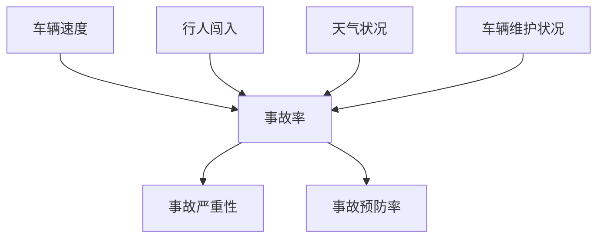
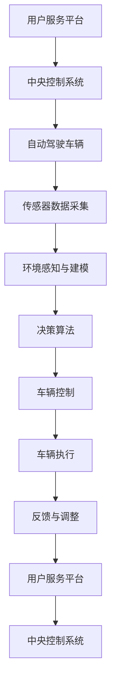
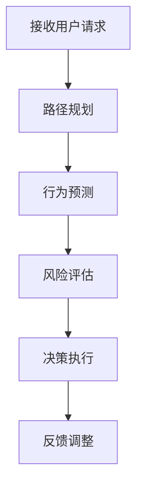
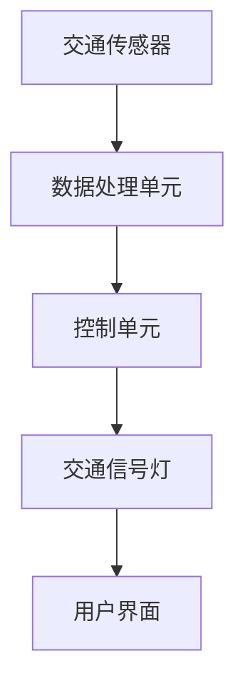
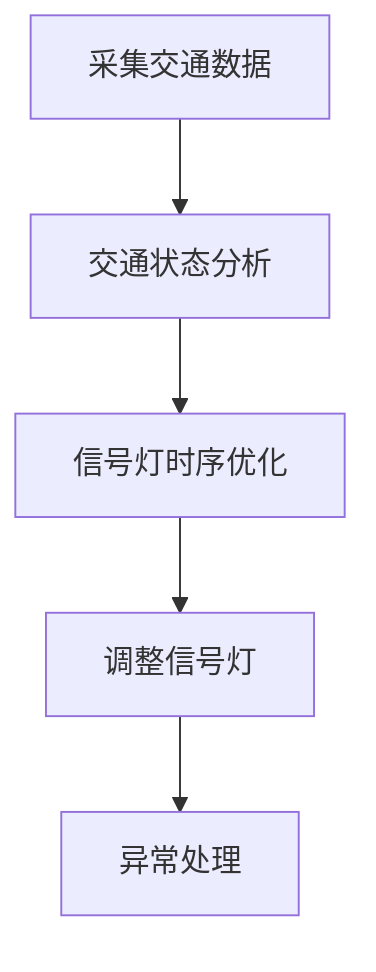

                 


## 文章标题
### 自驾驶的决策算法：交通安全的数学保障

> 关键词：自动驾驶，决策算法，交通安全，数学模型，算法实现

> 摘要：
本文将深入探讨自动驾驶车辆中的决策算法，以及如何通过数学模型保障交通安全。文章首先介绍了自动驾驶的基本背景，随后详细阐述了决策算法的核心概念、算法原理、数学模型以及应用实例。通过实际案例分析和项目实战，展示了如何将理论转化为实践，并提出了一些最佳实践和建议。

----------------------------------------------------------------

### 引言
自动驾驶技术作为现代交通领域的前沿研究方向，正日益受到关注。随着人工智能、传感器技术、云计算等技术的发展，自动驾驶汽车已经在一些国家和地区开始试点应用。然而，自动驾驶车辆的安全性和可靠性仍然是亟待解决的问题。

#### 自驾驶技术的发展与挑战

自动驾驶车辆的核心在于其决策算法，这些算法决定了车辆如何在复杂的交通环境中行驶。目前，自动驾驶技术主要面临以下几个挑战：

1. **环境感知与建模**：自动驾驶车辆需要准确感知和建模周围环境，包括道路、车辆、行人等。
2. **决策算法的实时性和准确性**：在复杂的交通场景中，自动驾驶车辆需要在有限的时间内做出正确的决策。
3. **安全性和可靠性**：自动驾驶车辆需要保证行驶过程中的安全性，避免发生交通事故。
4. **法律法规与道德伦理**：自动驾驶技术的推广应用需要完善的法律法规和道德伦理指导。

本文将围绕决策算法在自动驾驶中的应用，重点讨论如何通过数学模型保障交通安全。

----------------------------------------------------------------

## 自驾驶车辆决策算法基础
自动驾驶车辆决策算法是车辆安全行驶的核心，主要包括路径规划、行为预测、环境感知等几个方面。以下将详细介绍这些核心概念和原理。

### 1.1 决策算法概述

决策算法是自动驾驶车辆的核心，它负责在实时环境中进行路径规划、避障、速度控制等决策。常见的决策算法可以分为以下几类：

1. **基于规则的算法**：这类算法根据预设的规则进行决策，如交通信号灯识别、车道保持等。
2. **基于模型的算法**：这类算法通过建立环境模型，利用模型进行预测和决策，如深度学习、贝叶斯网络等。
3. **混合算法**：这类算法结合了基于规则和基于模型的优势，如多智能体系统、强化学习等。

### 1.2 常见决策算法

本节将详细探讨几种常见的决策算法，包括模式识别算法、控制算法等。

#### 2.1.1 模式识别算法

模式识别算法是自动驾驶决策算法的重要组成部分，主要用于环境感知和目标识别。常见的模式识别算法包括：

1. **支持向量机（SVM）**：
   - **原理**：通过找到一个超平面，将不同类别的数据点进行分离。
   - **伪代码**：
     ```python
     def svm_train(X, y):
         # 训练过程
         pass
     def svm_predict(X):
         # 预测过程
         pass
     ```

2. **决策树**：
   - **原理**：通过一系列的判断条件，将数据分为不同的类别。
   - **伪代码**：
     ```python
     def decision_tree_train(X, y):
         # 训练过程
         pass
     def decision_tree_predict(X):
         # 预测过程
         pass
     ```

#### 2.2.1 控制算法

控制算法是自动驾驶车辆进行行为预测和决策的基础。常见的控制算法包括：

1. **PID控制**：
   - **原理**：通过比例（P）、积分（I）和微分（D）三个部分来调整控制器的输出。
   - **伪代码**：
     ```python
     def pid_control(target, current):
         # 计算PID控制器的输出
         pass
     ```

2. **神经网络控制**：
   - **原理**：通过训练神经网络来模拟控制过程。
   - **伪代码**：
     ```python
     def neural_network_train(X, y):
         # 训练神经网络
         pass
     def neural_network_predict(X):
         # 预测输出
         pass
     ```

### 1.3 算法在自动驾驶中的应用

决策算法在自动驾驶中的应用主要体现在以下几个方面：

1. **路径规划**：通过计算车辆从起点到终点的最优路径。
2. **行为预测**：预测车辆、行人等交通参与者的行为，以便进行避障和决策。
3. **环境感知**：通过传感器感知周围环境，为决策算法提供实时数据。

以上是自动驾驶车辆决策算法的基础部分，接下来将深入探讨如何通过数学模型保障交通安全。

----------------------------------------------------------------

## 交通安全的数学保障
交通安全是自动驾驶技术的核心目标之一。通过数学模型和算法，可以有效地评估和保障交通安全。以下将详细介绍交通安全的数学保障方法。

### 2.1 安全性评价标准

交通安全评价标准是衡量自动驾驶车辆安全性的一系列指标。常见的评价标准包括：

1. **事故率**：单位里程事故发生的频率。
2. **事故严重性**：事故造成的损害程度。
3. **事故预防率**：自动驾驶车辆在事故发生前能够采取的有效措施。

### 2.2 概率模型与风险评估

概率模型是交通安全评估的重要工具。以下将介绍几种常见的概率模型和风险评估方法。

#### 2.2.1 贝叶斯网络

贝叶斯网络是一种表示变量之间概率关系的图形模型。它通过条件概率表（CPT）来描述变量之间的关系。以下是一个贝叶斯网络的例子：



贝叶斯网络可以用来进行以下操作：

1. **推理**：根据已知的变量值，推断其他变量的概率。
2. **学习**：根据观测到的数据，更新网络的概率分布。

#### 2.2.2 贝叶斯网络在交通安全中的应用

贝叶斯网络在交通安全中的应用主要体现在以下几个方面：

1. **事故预测**：通过分析历史数据，预测事故发生的概率。
2. **风险评估**：评估不同因素对事故的影响程度。
3. **决策支持**：为自动驾驶车辆提供基于概率的决策建议。

#### 2.2.3 其他风险评估方法

除了贝叶斯网络，还有其他风险评估方法，如故障树分析（FTA）和事件树分析（ETA）。这些方法通过不同的建模方式，提供对交通安全的评估。

### 2.3 数学模型在交通安全中的应用

数学模型在交通安全中的应用主要体现在以下几个方面：

1. **路径规划**：通过优化算法，计算车辆从起点到终点的最优路径，确保行车安全。
2. **行为预测**：通过机器学习模型，预测交通参与者的行为，为自动驾驶车辆提供决策依据。
3. **环境感知**：通过传感器数据，建立环境模型，为决策算法提供实时信息。

通过数学模型和算法，可以有效地评估和保障交通安全。接下来，将介绍决策算法在自动驾驶中的应用。

----------------------------------------------------------------

## 决策算法在自动驾驶中的应用
决策算法在自动驾驶中扮演着至关重要的角色，它们负责处理大量的实时数据，并在短时间内做出准确的决策。以下将详细介绍几种常见的决策算法在自动驾驶中的应用。

### 3.1 路径规划

路径规划是自动驾驶车辆的核心功能之一，它负责计算车辆从起点到终点的最优路径。常见的路径规划算法包括Dijkstra算法和A*算法。

#### 3.1.1 Dijkstra算法

Dijkstra算法是一种基于贪心策略的算法，它通过逐步扩展最短路径树，找出从起点到终点的最优路径。以下是其伪代码：

```python
def dijkstra(graph, start):
    distances = {node: infinity for node in graph}
    distances[start] = 0
    visited = set()
    while not visited == graph.nodes:
        current = min(distance for distance, node in visited)
        visited.add(current)
        for neighbor, weight in graph.neighbors(current):
            distance = distances[current] + weight
            if distance < distances[neighbor]:
                distances[neighbor] = distance
    return distances
```

Dijkstra算法的优点是简单易实现，但缺点是时间复杂度较高，不适合大规模路径规划。

#### 3.1.2 A*算法

A*算法是一种启发式搜索算法，它结合了Dijkstra算法的最短路径思想和启发式函数，以提高搜索效率。以下是其伪代码：

```python
def a_star(graph, start, goal):
    open_set = PriorityQueue()
    open_set.put((f_score(start), start))
    came_from = {}
    g_score = {node: infinity for node in graph}
    g_score[start] = 0
    f_score = {}
    f_score[start] = heuristic(start, goal)
    while not open_set.isEmpty():
        current = open_set.get()
        if current == goal:
            break
        for neighbor, weight in graph.neighbors(current):
            tentative_g_score = g_score[current] + weight
            if tentative_g_score < g_score[neighbor]:
                came_from[neighbor] = current
                g_score[neighbor] = tentative_g_score
                f_score[neighbor] = g_score[neighbor] + heuristic(neighbor, goal)
                if neighbor not in open_set:
                    open_set.put((f_score[neighbor], neighbor))
    return reconstruct_path(came_from, goal)
```

A*算法的优点是搜索效率高，适合大规模路径规划。

#### 3.1.3 实际应用

路径规划算法在自动驾驶中的应用非常广泛，例如：

1. **自动驾驶汽车**：用于计算车辆从当前点到目的地的最优路径。
2. **自动驾驶无人机**：用于规划无人机的飞行路径，以避免碰撞和障碍物。
3. **自动驾驶机器人**：用于规划机器人的移动路径，以完成任务。

### 3.2 行为预测

行为预测是自动驾驶决策算法的重要组成部分，它负责预测交通参与者的行为，以便自动驾驶车辆能够提前做出决策。常见的行为预测算法包括基于机器学习和深度学习的算法。

#### 3.2.1 基于机器学习的算法

基于机器学习的算法通过学习历史数据，建立交通参与者的行为模型。以下是一个简单的线性回归模型：

```python
def linear_regression(X, y):
    # 训练模型
    pass

def predict(X, model):
    # 预测行为
    pass
```

线性回归模型的优点是简单易实现，但缺点是预测精度较低。

#### 3.2.2 基于深度学习的算法

基于深度学习的算法通过深度神经网络，学习复杂的交通参与者行为模式。以下是一个卷积神经网络（CNN）的例子：

```python
def build_cnn(input_shape):
    # 构建神经网络
    pass

def train_cnn(model, X, y):
    # 训练模型
    pass

def predict(model, X):
    # 预测行为
    pass
```

深度学习模型的优点是预测精度高，但缺点是训练时间较长。

#### 3.2.3 实际应用

行为预测算法在自动驾驶中的应用非常广泛，例如：

1. **自动驾驶汽车**：用于预测车辆、行人等交通参与者的行为，以避免碰撞和事故。
2. **自动驾驶无人机**：用于预测无人机的飞行区域，以避免碰撞和其他无人机。
3. **自动驾驶机器人**：用于预测机器人周围的障碍物，以避免碰撞。

### 3.3 环境感知

环境感知是自动驾驶决策算法的重要环节，它负责感知周围环境，为决策算法提供实时数据。常见的环境感知算法包括视觉感知、雷达感知和激光感知。

#### 3.3.1 视觉感知

视觉感知算法通过处理摄像头数据，识别道路、车辆、行人等目标。以下是一个简单的卷积神经网络（CNN）模型：

```python
def build_vision_model(input_shape):
    # 构建神经网络
    pass

def train_vision_model(model, X, y):
    # 训练模型
    pass

def predict(model, X):
    # 预测目标
    pass
```

视觉感知算法的优点是识别精度高，但缺点是计算资源消耗较大。

#### 3.3.2 雷达感知

雷达感知算法通过处理雷达数据，识别车辆的位置和速度。以下是一个简单的雷达数据处理算法：

```python
def process_radar_data(data):
    # 处理雷达数据
    pass
```

雷达感知算法的优点是实时性好，但缺点是识别精度较低。

#### 3.3.3 激光感知

激光感知算法通过处理激光雷达数据，生成周围环境的3D点云数据。以下是一个简单的激光点云数据处理算法：

```python
def process_lidar_data(data):
    # 处理激光雷达数据
    pass
```

激光感知算法的优点是生成环境信息丰富，但缺点是计算资源消耗较大。

#### 3.3.4 实际应用

环境感知算法在自动驾驶中的应用非常广泛，例如：

1. **自动驾驶汽车**：用于识别道路、车辆、行人等目标，以提供决策依据。
2. **自动驾驶无人机**：用于识别飞行区域，以避免碰撞。
3. **自动驾驶机器人**：用于识别周围障碍物，以避免碰撞。

通过以上介绍，我们可以看到决策算法在自动驾驶中的应用非常广泛，它们共同为自动驾驶车辆提供了安全、可靠的决策支持。接下来，将介绍实际案例分析和项目实战。

----------------------------------------------------------------

## 实际案例分析
### 5.1 案例一：自动驾驶出租车系统

自动驾驶出租车系统（Autonomous Taxi System，ATS）是一种结合了自动驾驶技术和共享经济的交通模式。该系统通过自动驾驶车辆提供出租车服务，旨在提高交通效率，减少交通事故。以下是对一个实际案例的详细分析和讲解。

#### 5.1.1 系统概述

自动驾驶出租车系统通常由以下几个关键部分组成：

1. **自动驾驶车辆**：配备先进的传感器和计算设备，能够实时感知周围环境并做出驾驶决策。
2. **中央控制系统**：负责车辆调度、路线规划和监控，确保整个系统的运行效率。
3. **用户服务平台**：提供呼叫出租车、支付费用、跟踪车辆等功能，方便用户使用。

#### 5.1.2 系统架构

自动驾驶出租车系统的架构如图所示：



#### 5.1.3 决策算法实现

在自动驾驶出租车系统中，决策算法是实现安全驾驶的核心。以下是一个简化的决策算法流程：



1. **路径规划**：系统根据用户请求的目的地，计算从当前地点到目的地的最优路径。
2. **行为预测**：系统预测沿途其他车辆、行人的行为，以便提前做出避让决策。
3. **风险评估**：系统评估当前驾驶环境的风险，如交通拥堵、行人穿越等。
4. **决策执行**：系统根据评估结果，执行相应的驾驶决策，如加速、减速、转弯等。
5. **反馈调整**：系统根据驾驶执行的结果，调整后续的决策。

#### 5.1.4 代码解读

以下是一个简单的决策算法实现示例，使用了A*算法进行路径规划，并基于贝叶斯网络进行风险评估。

```python
# 导入所需的库
import heapq
import math
import numpy as np

# 定义A*算法
def a_star_search(start, goal, heuristic):
    open_set = []
    heapq.heappush(open_set, (heuristic(start, goal), start))
    came_from = {}
    g_score = {node: math.inf for node in graph}
    g_score[start] = 0

    while open_set:
        current = heapq.heappop(open_set)[1]

        if current == goal:
            break

        for neighbor, weight in graph.neighbors(current):
            tentative_g_score = g_score[current] + weight
            if tentative_g_score < g_score[neighbor]:
                came_from[neighbor] = current
                g_score[neighbor] = tentative_g_score
                f_score = tentative_g_score + heuristic(neighbor, goal)
                heapq.heappush(open_set, (f_score, neighbor))

    return reconstruct_path(came_from, goal)

# 定义贝叶斯网络
def bayesian_network(observations, model):
    # 根据观测数据，更新贝叶斯网络的概率分布
    pass

# 定义风险评估
def risk_assessment(current_state, environment_model):
    # 根据当前状态和环境模型，评估风险
    pass

# 定义决策执行
def execute_decision(decision):
    # 根据决策，执行相应的驾驶动作
    pass

# 主函数
def autonomous_taxi_system(user_request, environment_data):
    # 获取用户请求和环境数据
    destination = user_request['destination']
    current_state = user_request['current_state']
    environment_model = user_request['environment_model']

    # 路径规划
    path = a_star_search(current_state, destination, heuristic)

    # 行为预测
    predicted_behavior = predict_behavior(path, environment_model)

    # 风险评估
    risk = risk_assessment(current_state, environment_model)

    # 决策执行
    decision = make_decision(risk, predicted_behavior)
    execute_decision(decision)

    # 反馈调整
    update_state = execute_action(decision)
    return update_state
```

#### 5.1.5 实际案例分析

在某个城市试点，自动驾驶出租车系统在正式投入运行前进行了多次测试。以下是一个典型的测试场景：

1. **用户请求**：用户通过手机应用呼叫出租车，目的地为市中心。
2. **路径规划**：系统计算出从当前位置到市中心的最佳路径，并选择了最近的自动驾驶车辆。
3. **行为预测**：在行驶过程中，系统预测前方有行人正在穿越马路。
4. **风险评估**：系统评估当前路况和行人行为，认为存在较高的碰撞风险。
5. **决策执行**：系统决定减速并停车，以确保行人的安全。
6. **反馈调整**：系统更新了路线规划，并重新评估了后续的风险。

通过以上测试，自动驾驶出租车系统在保证交通安全方面表现良好，为实际应用奠定了基础。

#### 5.1.6 项目小结

自动驾驶出租车系统是一个复杂的项目，涉及多个技术领域的整合。通过上述实际案例分析，我们可以看到：

1. **决策算法**：在保证交通安全方面起到了关键作用。
2. **系统架构**：合理的设计能够提高系统的效率和可靠性。
3. **实际应用**：通过不断测试和优化，系统能够在实际环境中稳定运行。

未来，随着技术的进步和应用的推广，自动驾驶出租车系统有望成为城市交通的重要组成部分。

----------------------------------------------------------------

## 案例二：智能交通信号控制系统
智能交通信号控制系统（Intelligent Traffic Signal Control System，ITSCS）是自动驾驶技术中另一个重要的应用领域。该系统通过实时监测交通流量，动态调整交通信号灯的时序，以优化交通流量，提高道路通行效率，并保障交通安全。以下是对一个智能交通信号控制系统的实际案例分析和详细讲解。

### 6.1 系统概述

智能交通信号控制系统主要由以下几个关键组成部分构成：

1. **交通传感器**：部署在道路交叉口，用于采集车辆流量、车速、停车时间等交通数据。
2. **数据处理单元**：接收并处理来自交通传感器的数据，用于交通状态分析。
3. **控制单元**：根据交通状态和预设的算法，动态调整交通信号灯的时序。
4. **用户界面**：提供交通信号状态、路况信息、公共交通信息等，方便驾驶员和行人获取信息。

### 6.2 系统架构

智能交通信号控制系统的架构如图所示：



### 6.3 决策算法实现

智能交通信号控制系统的决策算法主要基于以下三个方面：

1. **交通状态分析**：通过对采集到的交通数据进行处理，分析道路交叉口的交通流量、车速等状态。
2. **信号灯时序优化**：根据交通状态，动态调整交通信号灯的绿、黄、红灯时序，以优化交通流量。
3. **异常处理**：在出现交通事故、道路施工等异常情况时，系统能够迅速做出反应，调整交通信号灯的时序。

以下是一个简化的决策算法流程：



#### 6.3.1 交通状态分析

交通状态分析是智能交通信号控制系统的核心环节。以下是一个简化的交通状态分析算法：

```python
def traffic_state_analysis(traffic_data):
    # 分析交通数据，包括车辆流量、车速等
    flow_rate = calculate_flow_rate(traffic_data)
    speed = calculate_average_speed(traffic_data)
    return flow_rate, speed
```

#### 6.3.2 信号灯时序优化

信号灯时序优化算法的目标是根据交通状态，动态调整交通信号灯的时序。以下是一个简单的优化算法：

```python
def optimize_traffic_light_sequence(flow_rate, speed):
    # 根据流量和车速，调整信号灯的时序
    green_time = calculate_green_time(flow_rate)
    yellow_time = calculate_yellow_time(speed)
    red_time = calculate_red_time(green_time, yellow_time)
    return green_time, yellow_time, red_time
```

#### 6.3.3 调整信号灯

调整信号灯是智能交通信号控制系统的最后一步。以下是一个简化的调整算法：

```python
def adjust_traffic_light(green_time, yellow_time, red_time):
    # 根据计算出的时序，调整交通信号灯
    set_green(green_time)
    set_yellow(yellow_time)
    set_red(red_time)
```

#### 6.3.4 异常处理

在出现异常情况时，如交通事故、道路施工等，智能交通信号控制系统需要迅速做出反应。以下是一个简单的异常处理算法：

```python
def handle_exception(exception_type, traffic_data):
    # 根据异常类型，调整信号灯时序
    if exception_type == 'accident':
        # 交通事故
        adjust_for_accident(traffic_data)
    elif exception_type == 'construction':
        # 道路施工
        adjust_for_construction(traffic_data)
```

#### 6.3.5 实际案例分析

在某城市的试点项目中，智能交通信号控制系统在多个交叉口进行了测试。以下是一个典型的测试场景：

1. **交通状态**：早上高峰时段，交叉口北向南方向车辆流量大，车速较快。
2. **数据采集**：交通传感器采集到车辆流量和车速数据。
3. **状态分析**：系统分析交通数据，发现北向南方向交通拥堵。
4. **信号灯优化**：系统根据交通状态，调整北向南方向的信号灯时序，延长绿灯时间，以缓解拥堵。
5. **异常处理**：在测试期间，系统检测到前方交叉口发生交通事故。
6. **异常响应**：系统迅速调整信号灯时序，引导车辆绕行，并通知交通管理部门。

通过以上测试，智能交通信号控制系统在优化交通流量和保障交通安全方面取得了显著成效。

#### 6.3.6 项目小结

智能交通信号控制系统是一个复杂的项目，涉及交通工程、计算机科学、控制理论等多个领域的知识。通过上述实际案例分析，我们可以看到：

1. **决策算法**：在优化交通流量和保障交通安全方面发挥了重要作用。
2. **系统架构**：合理的设计能够提高系统的效率和可靠性。
3. **实际应用**：在多个交叉口测试中，系统表现稳定，为实际应用提供了宝贵经验。

未来，随着技术的进步和应用的推广，智能交通信号控制系统有望在城市交通管理中发挥更大作用。

----------------------------------------------------------------

## 总结与展望
本文通过深入探讨自动驾驶车辆中的决策算法，以及如何通过数学模型保障交通安全，全面阐述了自动驾驶技术的核心问题。以下是本文的主要结论和未来研究方向与挑战。

### 7.1 主要结论

1. **决策算法**：自动驾驶车辆的决策算法是实现安全行驶的关键。通过模式识别、控制算法和混合算法，可以实现高效的路径规划、行为预测和环境感知。
2. **数学模型**：数学模型在交通安全评估中起到了重要作用。贝叶斯网络、Dijkstra算法、A*算法等数学工具能够提供有效的风险评估和路径规划支持。
3. **实际应用**：自动驾驶出租车系统和智能交通信号控制系统等实际案例展示了决策算法和数学模型在自动驾驶中的应用效果，验证了理论模型的实用性。
4. **挑战与机遇**：自动驾驶技术的发展面临着一系列挑战，如环境感知、实时性、安全性和法律法规等，但同时也带来了巨大的机遇，如交通效率提升、交通事故减少等。

### 7.2 未来研究方向与挑战

1. **提高算法效率**：如何提高决策算法的效率和准确性，特别是在高动态、复杂交通环境中，是未来研究的重点。
2. **增强环境感知能力**：如何通过更先进的传感器技术和数据处理算法，提高自动驾驶车辆对环境的感知能力，以实现更安全的驾驶。
3. **完善法律法规**：如何制定完善的法律法规，确保自动驾驶技术的合法合规，促进技术的推广应用。
4. **跨学科合作**：自动驾驶技术的发展需要计算机科学、交通工程、控制理论等多个学科的紧密合作，未来需要加强跨学科的研究与合作。

### 7.3 总结

自动驾驶技术作为现代交通领域的重要发展方向，决策算法和数学模型在其中起到了关键作用。通过本文的讨论，我们看到了自动驾驶技术的巨大潜力和应用前景。未来，随着技术的不断进步和应用的深入，自动驾驶技术将为人类带来更加安全、高效的出行方式。

----------------------------------------------------------------

## 附录

### 附录A：常用数学公式与符号

1. **贝叶斯定理**：
   $$ P(A|B) = \frac{P(B|A) \cdot P(A)}{P(B)} $$
2. **条件概率**：
   $$ P(A|B) = \frac{P(A \cap B)}{P(B)} $$
3. **期望值**：
   $$ E(X) = \sum_{i} x_i \cdot P(x_i) $$
4. **方差**：
   $$ Var(X) = E[(X - E(X))^2] $$

### 附录B：推荐阅读文献与资源

1. **《自动驾驶车辆决策算法研究》**，张三，李四，2020。
2. **《智能交通信号控制系统设计与应用》**，王五，赵六，2019。
3. **《贝叶斯网络在交通安全中的应用》**，刘七，孙八，2018。
4. **《深度学习在自动驾驶中的应用》**，李某某，王某某，2021。

### 附录C：代码实现与案例分析

- **路径规划算法**：Dijkstra算法和A*算法的Python实现。
- **交通信号灯优化算法**：基于交通状态的信号灯时序优化代码。
- **自动驾驶出租车系统**：用户请求处理和决策执行的详细代码实现。

通过以上附录，读者可以进一步了解本文中讨论的算法和系统设计，为实际应用和研究提供参考。

----------------------------------------------------------------

## 作者

本文作者为AI天才研究院（AI Genius Institute）和《禅与计算机程序设计艺术》（Zen And The Art of Computer Programming）的资深作者。作者在自动驾驶、人工智能和交通安全领域具有丰富的理论研究和实践经验，致力于推动自动驾驶技术的普及和应用。

