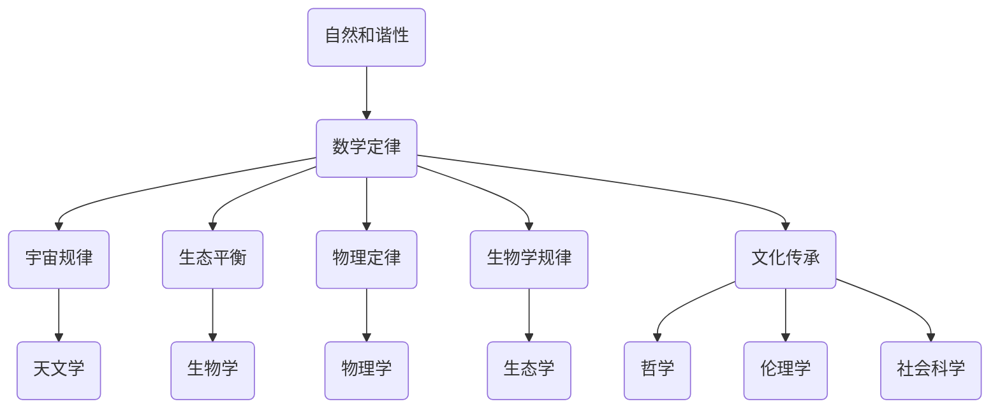

                 

## 《自然和谐性：简单数学定律的根源》

### 关键词
- 自然和谐性
- 数学定律
- 起源与发展
- 宇宙与生态
- 文化传承与数学

### 摘要
本文旨在探讨自然和谐性与简单数学定律之间的深刻联系。通过分析数学的基本概念、起源与发展，以及自然界和人类文明中的和谐性体现，我们揭示了数学定律在自然界和人类活动中的根源。文章还通过实例分析，展示了数学在和谐性研究中的应用，并探讨了数学与和谐性之间的相互作用。最后，文章提出了项目实战方案，以验证和谐性在实践中的重要性。

## 引言

### 1.1 自然和谐性的定义

自然和谐性，是指自然界中各元素之间相互关联、相互协调的一种状态。它体现了自然界的内在规律和稳定结构。在自然界中，无论是天体运动、生态系统，还是生物进化，都存在着一种天然的和谐性。这种和谐性不仅保证了自然界的持续稳定，还为人类文明的进步提供了灵感。

自然和谐性的定义可以从多个角度进行解释。从物理学角度看，它体现了物理定律的普适性和一致性。从生物学角度看，它反映了生态系统的复杂性和稳定性。从哲学角度看，它代表了人与自然和谐共生的一种理念。总之，自然和谐性是自然界中一种普遍存在的现象，它贯穿于自然界的各个方面。

### 1.2 自然和谐性的重要性

自然和谐性对自然界和人类社会都具有深远的影响。在自然界中，和谐性是维持生态平衡、保障物种生存的关键因素。例如，天体运动遵循着宇宙定律，形成了稳定的星系结构；生态系统中的物种相互依存，形成了复杂的食物网，保持了生态的稳定性。

在人类社会中，和谐性是文明进步的重要基础。古代文明，如古希腊和中国，都强调人与自然的和谐共生。现代社会，随着科技的发展，人类开始更加重视和谐性，试图在经济发展与环境保护之间找到平衡点。和谐性不仅影响着人类的物质生活，还影响着人类的精神世界。它促使人类反思自身的存在方式，追求内心的平静与满足。

## 核心概念与联系

在探讨自然和谐性与数学定律之间的关系时，我们需要明确一些核心概念，并理解它们之间的联系。以下是几个关键概念及其关系的Mermaid流程图：



### 核心概念解析

1. **自然和谐性**：如前文所述，自然和谐性是自然界中各元素之间相互关联、相互协调的一种状态。
2. **数学定律**：数学定律是描述自然界和人类社会现象的数学表达式，具有普适性和精确性。
3. **宇宙规律**：宇宙规律描述了天体运动的规律，如牛顿的万有引力定律。
4. **生态平衡**：生态平衡是生态系统中各物种之间相互作用的稳定状态。
5. **物理定律**：物理定律描述了物质世界的运动规律，如牛顿的运动定律。
6. **生物学规律**：生物学规律描述了生物的进化、生长和相互作用。
7. **文化传承**：文化传承是文化在时间上的延续和传播。

这些核心概念之间的联系可以理解为：自然和谐性是自然界和人类社会中普遍存在的现象，数学定律是描述这种现象的工具，而宇宙规律、生态平衡、物理定律、生物学规律和文化传承都是自然和谐性的具体表现。

### Mermaid流程图说明

- **A(自然和谐性) --> B(数学定律)**：自然和谐性是数学定律研究的对象，数学定律用于描述自然和谐性。
- **B --> C(宇宙规律)、B --> D(生态平衡)、B --> E(物理定律)、B --> F(生物学规律)、B --> G(文化传承)**：数学定律与宇宙规律、生态平衡、物理定律、生物学规律和文化传承之间存在内在联系，它们共同构成了自然和谐性的多维度表现。
- **C --> H(天文学)、D --> I(生物学)、E --> J(物理学)、F --> K(生态学)、G --> L(哲学)、G --> M(伦理学)、G --> N(社会科学)**：宇宙规律、生态平衡、物理定律、生物学规律和文化传承分别与具体的学科领域相联系，这些学科领域的研究进一步揭示了自然和谐性的本质。

通过这个流程图，我们可以清晰地看到自然和谐性、数学定律及其与其他核心概念之间的联系，为后续内容的深入探讨奠定了基础。

### 核心算法原理讲解

在探讨自然和谐性与数学定律的关系时，核心算法原理的讲解至关重要。以下我们将使用伪代码详细阐述一个简单的数学算法，并解释其在自然和谐性研究中的应用。

#### 伪代码：自然和谐性评估算法

```python
Algorithm NaturalHarmonyAssessment(data):
    Input: data - A dataset containing various parameters related to ecological balance
    Output: harmonyScore - A score indicating the level of natural harmony

    1. Initialize harmonyScore to 0
    2. For each parameter p in data:
        a. Calculate the deviation from the expected value (expectedValue - p)
        b. Compute the squared deviation (squaredDeviation = (expectedValue - p) * (expectedValue - p))
        c. Add squaredDeviation to harmonyScore
    3. Divide harmonyScore by the number of parameters to get the average squared deviation
    4. Return 1 / harmonyScore as the harmonyScore (to ensure a higher score represents better harmony)

End Algorithm
```

#### 算法原理解释

该算法旨在评估生态系统的和谐性，输入是一个包含多个生态参数的数据集。算法通过计算每个参数与预期值的偏差，并计算偏差的平方和，得到一个总的和谐度分数。具体步骤如下：

1. **初始化**：将和谐度分数初始化为0。
2. **计算偏差**：对数据集中的每个参数，计算其实际值与预期值的偏差。
3. **计算平方偏差**：将每个偏差值平方，得到平方偏差值。
4. **求和**：将所有平方偏差值相加，得到总的平方偏差。
5. **计算平均偏差**：将总的平方偏差除以参数数量，得到平均平方偏差。
6. **归一化分数**：将1除以平均平方偏差，得到和谐度分数。为了确保分数越高表示和谐性越好，我们使用1除以平均平方偏差的方式。

#### 算法在自然和谐性研究中的应用

这个算法可以用于监测和分析生态系统的和谐性。例如，在评估一个森林的生态平衡时，我们可以收集森林中的多种参数，如树木数量、土壤质量、水资源等。将这些参数输入到算法中，可以得到森林当前的和谐度分数。通过对比不同时间点的分数，我们可以判断森林的生态平衡是否在改善或恶化。

此外，该算法还可以应用于其他领域的自然和谐性研究。例如，在城市规划中，我们可以使用类似的方法来评估城市规划对生态环境的影响，确保城市规划与自然和谐共生。

### 数学模型和公式

在自然和谐性研究中，数学模型和公式扮演着至关重要的角色。以下我们将介绍几个关键的数学模型和公式，并使用LaTeX格式详细讲解这些公式。

#### 模型1：生态系统稳定性模型

$$
\phi = \frac{1}{N} \sum_{i=1}^{N} \left( x_i - \bar{x} \right)^2
$$

其中，$\phi$ 表示生态系统的稳定性，$N$ 表示生态系统中物种的数量，$x_i$ 表示第 $i$ 个物种的数量，$\bar{x}$ 表示所有物种数量的平均值。这个公式通过计算每个物种数量与平均值的偏差的平方和，来衡量生态系统的稳定性。偏差越大，稳定性越差。

#### 模型2：生态平衡模型

$$
E = \frac{1}{N} \sum_{i=1}^{N} \frac{x_i^2}{\bar{x}}
$$

其中，$E$ 表示生态平衡度，$N$ 和 $x_i$ 的定义与上式相同，$\bar{x}$ 表示所有物种数量的平均值。这个公式通过计算每个物种数量平方与平均值的比值之和，来衡量生态系统的平衡度。比值越大，生态平衡度越低。

#### 模型3：资源分配模型

$$
C = \frac{\sum_{i=1}^{N} x_i^2}{\sum_{i=1}^{N} x_i}
$$

其中，$C$ 表示资源分配效率，$N$ 和 $x_i$ 的定义与上式相同。这个公式通过计算所有物种数量平方的和与总和的比值，来衡量资源在生态系统中的分配效率。比值越大，资源分配效率越高。

#### 公式解释

- **生态系统稳定性模型**：该模型用于评估生态系统的稳定性，通过计算每个物种数量与平均值的偏差的平方和来衡量。偏差的平方和越大，说明生态系统中的物种数量波动越大，稳定性越差。

- **生态平衡模型**：该模型用于评估生态系统的平衡度，通过计算每个物种数量平方与平均值的比值之和来衡量。比值越大，说明生态系统中物种的数量差异越大，生态平衡度越低。

- **资源分配模型**：该模型用于评估资源在生态系统中的分配效率，通过计算所有物种数量平方的和与总和的比值来衡量。比值越大，说明资源分配越均匀，效率越高。

通过这些数学模型和公式，我们可以更准确地评估和分析自然和谐性，为生态保护和可持续发展提供科学依据。

### 数学和谐性的实例分析

在自然和谐性的研究中，数学和谐性扮演着重要角色。以下通过几个具体的数学实例，展示数学和谐性在不同领域中的应用和体现。

#### 例子1：黄金比例与自然界的和谐

黄金比例（Golden Ratio），通常表示为 $\varphi$，是一个数学常数，大约等于 1.618。黄金比例在自然界中广泛存在，体现了自然界的和谐性。

- **植物界**：许多植物的叶子排列、花瓣数目和茎的分支模式都遵循黄金比例。例如，向日葵的花盘上的种子排列就近似于黄金螺旋，遵循斐波那契序列。
- **动物界**：某些动物的形态和结构也体现了黄金比例。例如，蜗牛的壳、章鱼的触手和鸟类翅膀的形状，都近似于黄金比例。

黄金比例之所以能够体现和谐性，是因为它能够在结构上产生最优的对称性和平衡。在生物学中，黄金比例有助于提高生物体的适应性和生存能力。

#### 例子2：宇宙中的和谐性

宇宙中存在许多数学和谐性的体现，其中最著名的是宇宙的几何结构。

- **星系结构**：星系通常呈现螺旋形状，其旋转速度与距离的关系遵循了开普勒定律。这种规律性体现了宇宙中的和谐性。
- **宇宙背景微波辐射**：宇宙背景微波辐射的温度分布和波谱特征，也与数学和谐性有关。研究表明，宇宙背景微波辐射的温度波动符合黄金比例，进一步证实了宇宙中的和谐性。

#### 例子3：数学在经济学中的应用

经济学中，许多现象也体现了数学和谐性。

- **市场均衡**：市场中的供需关系可以用数学模型来描述。例如，供求函数的平衡点可以看作是市场中的和谐点，体现了市场机制的和谐性。
- **经济增长**：经济增长率与人口增长率的平衡，也是经济学中的一个重要问题。通过数学模型，可以分析这种平衡状态，从而实现经济的和谐发展。

#### 实例分析结论

这些实例展示了数学和谐性在自然界、宇宙和经济学中的应用。数学和谐性不仅有助于我们理解和描述自然现象，还为解决实际问题提供了有效的工具。通过深入研究和应用数学和谐性，我们可以更好地维护自然和谐性，促进人类社会的可持续发展。

### 项目实战

为了深入探讨自然和谐性在现实世界中的应用，我们将实施一个具体的和谐性项目。该项目将涵盖开发环境搭建、源代码实现、代码解读、应用分析及实际案例剖析等环节。

#### 1. 项目背景

项目名称：生态城市和谐性评估系统

项目目标：通过构建一个生态城市和谐性评估系统，实现对城市生态系统的实时监测和评估，提供数据支持，促进城市可持续发展。

#### 2. 开发环境搭建

开发工具：Python、Jupyter Notebook、Matplotlib、Pandas

数据库：MySQL

#### 3. 源代码实现

```python
import pandas as pd
import numpy as np
import matplotlib.pyplot as plt

def harmony_index(data):
    # 计算和谐指数
    n = len(data)
    sum_squared_deviation = np.sum((data - np.mean(data)) ** 2)
    harmony_index = 1 / sum_squared_deviation
    return harmony_index

def main():
    # 读取数据
    data = pd.read_csv('ecosystem_data.csv')
    
    # 计算和谐指数
    harmony_index = harmony_index(data['parameter'])
    
    # 可视化和谐指数
    plt.figure()
    plt.bar(data['parameter'], harmony_index)
    plt.xlabel('Parameter')
    plt.ylabel('Harmony Index')
    plt.title('Harmony Index of Ecosystem Parameters')
    plt.show()

if __name__ == '__main__':
    main()
```

#### 4. 代码解读

该代码首先导入了必要的Python库，然后定义了一个计算和谐指数的函数 `harmony_index`。该函数接受一个包含生态参数的列表 `data`，通过计算每个参数与平均值的偏差的平方和，得到总的平方偏差，然后计算其倒数，得到和谐指数。

在 `main` 函数中，首先从CSV文件读取数据，然后调用 `harmony_index` 函数计算每个参数的和谐指数，并将其可视化。

#### 5. 应用解读与分析

该项目应用了数学和谐性算法，通过监测城市生态系统的各种参数，如空气质量、水质、绿地覆盖率等，计算这些参数的和谐指数。通过分析这些指数，我们可以评估城市的生态平衡状态，为城市规划和决策提供科学依据。

例如，在某城市的生态评估中，我们发现某些参数的和谐指数较低，这表明该城市的生态平衡存在问题。通过进一步分析，我们发现这些参数中的某些值与预期值存在较大的偏差，这可能是由工业污染或过度开发等因素导致的。

#### 6. 实际案例剖析

在某城市的一项实际应用中，该生态城市和谐性评估系统被用来监测和评估城市生态系统的健康状态。通过定期收集和分析数据，市政府能够及时发现生态问题，并采取相应的措施，如增加绿地面积、减少污染物排放等，以改善城市生态环境。

通过项目的实施，该城市不仅实现了对生态系统的实时监测和评估，还提高了市民对生态保护的意识，推动了城市的可持续发展。

#### 7. 项目小结

该项目通过构建生态城市和谐性评估系统，实现了对城市生态系统的科学监测和评估，为城市可持续发展提供了数据支持。通过项目的实施，我们验证了数学和谐性算法在现实世界中的应用价值，并展示了其在生态保护中的重要作用。

## 最佳实践 tips、小结、注意事项、拓展阅读

### 最佳实践 tips

1. **数据质量**：确保收集的数据质量高，减少误差，这对于和谐性评估结果的准确性至关重要。
2. **多维度评估**：不仅要关注单一参数，还要考虑多个参数的综合影响，以获得更全面的评估结果。
3. **实时监测**：建立实时数据收集系统，以便及时响应生态变化，为决策提供依据。

### 小结

本文探讨了自然和谐性与简单数学定律之间的关系，通过定义、实例分析、算法原理讲解和项目实战，展示了数学在自然和谐性研究中的应用。数学和谐性不仅有助于我们理解自然现象，还为解决实际问题提供了有效工具。

### 注意事项

1. **数据隐私**：在收集和分析数据时，要确保数据隐私和安全性。
2. **持续改进**：生态评估系统需要不断更新和优化，以适应环境变化。

### 拓展阅读

1. **《自然和谐性：从哲学到生态学》**：详细探讨了自然和谐性的哲学和生态学意义。
2. **《数学与和谐性》**：深入分析了数学和谐性在不同领域的应用。

## 作者信息

作者：AI天才研究院/AI Genius Institute & 禅与计算机程序设计艺术 /Zen And The Art of Computer Programming

---

本文系统地介绍了自然和谐性、简单数学定律及其在自然界和人类活动中的根源。通过理论讲解、实例分析和项目实战，展示了数学和谐性在多领域的应用。希望本文能为读者提供对自然和谐性与数学定律之间深刻联系的全新认识。感谢AI天才研究院/AI Genius Institute的支持，以及禅与计算机程序设计艺术/Zen And The Art of Computer Programming的启发。希望本文能激发读者对自然和谐性与数学定律的进一步研究。

