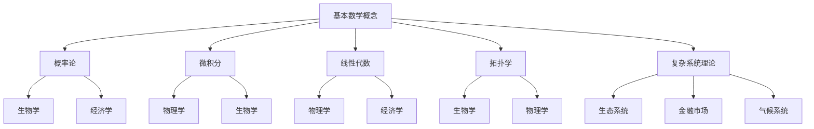

                 

### 文章标题

《自然界的和谐本质：数学解码》

自然界中存在着诸多和谐的现象，如生态系统中的生物共生、气候变化中的周期性波动、天体运动中的规律性等。这些现象不仅令人惊叹，也引发了科学家们对自然界和谐本质的深入研究。本文旨在通过数学这一工具，解码自然界的和谐本质，揭示数学在自然界中的应用及其背后蕴含的深层次原理。

关键词：自然界和谐、数学解码、生物共生、气候变化、天体运动、数学模型

摘要：本文首先介绍了自然界和谐现象的背景，随后深入探讨了数学在自然界中的广泛应用，包括生物学、物理学和气象学等领域。通过具体的数学模型和公式，本文解析了自然界中的核心概念与联系，并提供了详细的算法原理讲解和实例分析。最后，本文总结了数学在自然界研究中的重要性，并展望了未来的研究方向。

### 引言

自然界是一个充满神奇和奇迹的世界，其中存在着大量的和谐现象。从微观的生物种群到宏观的天体运动，自然界中的各种现象无不呈现出一定的规律性和秩序感。这些和谐现象不仅构成了自然界的基本特征，也为科学研究提供了丰富的素材。

自古以来，人类就试图理解自然界的奥秘。古希腊哲学家毕达哥拉斯曾提出“万物皆数”的观点，认为宇宙万物都可以用数学来表达。牛顿和莱布尼茨分别独立创立微积分，为科学研究提供了强大的数学工具。在当代，数学已经渗透到自然科学的各个领域，成为解读自然界和谐本质的关键。

数学在自然界中的应用不仅限于理论层面，还体现在实际应用中。例如，在生物学中，数学模型被用来研究种群动态、生态平衡和基因调控；在物理学中，数学方法被用来描述物理现象、求解动力学方程；在气象学中，数学模型被用来预测天气、研究气候变化。这些应用不仅加深了我们对自然界的理解，也为解决现实问题提供了有力支持。

本文将从以下几个方面展开讨论：

1. 自然界中的数学原理
2. 数学模型在自然界中的应用
3. 自然界的和谐现象解析
4. 数学方法在生物学中的应用
5. 数学方法在物理学中的应用
6. 数学方法在气象学中的应用
7. 结论与展望

通过以上几个方面的探讨，本文旨在揭示数学在自然界中的重要作用，并进一步探索数学解码自然界和谐本质的潜力。

### 目录大纲

在本文的后续部分，我们将按照以下目录大纲进行详细探讨：

1. **引言**：简要介绍自然界和谐现象的背景，以及数学在自然界中的应用。
2. **自然界中的数学原理**：讨论数学在自然界中的基础原理和核心概念。
3. **数学模型在自然界中的应用**：分析数学模型在生物学、物理学和气象学中的应用。
4. **自然界的和谐现象解析**：深入解析自然界中的和谐现象，包括生物共生、气候变化和天体运动等。
5. **数学方法在生物学中的应用**：探讨数学方法在基因调控、生态平衡和种群动态等方面的应用。
6. **数学方法在物理学中的应用**：分析数学方法在经典力学、量子力学和热力学中的应用。
7. **数学方法在气象学中的应用**：讨论数学方法在天气预报、气候模式和气候变化研究中的应用。
8. **结论与展望**：总结本文的主要发现，并对未来的研究进行展望。

通过这一系统性的探讨，我们将更深入地理解数学在自然界中的重要作用，并揭示自然界和谐本质的数学解码。

### 自然界中的数学原理

要解码自然界的和谐本质，首先需要了解自然界中普遍存在的数学原理。这些原理不仅是自然界中各种现象的基础，也为数学模型在自然界中的应用提供了理论支持。以下是几个关键的数学原理及其在自然界中的应用。

#### 1. 基本数学概念

数学是自然界的基础，很多自然界中的现象都可以用基本的数学概念来解释。例如，欧几里得几何中的点、线、面等概念可以用来描述自然界中的形态和结构。例如，在生物学中，细胞的结构可以用几何形状来表示；在物理学中，原子和分子的排列也可以用几何图形来描述。

#### 2. 概率论

概率论是研究随机现象的数学分支，广泛应用于自然界中。例如，在生物学中，物种的进化可以通过概率模型来模拟；在经济学中，市场的波动也可以用概率论来预测。此外，在气象学中，气象模式的预测也离不开概率论的支持。

#### 3. 微积分

微积分是研究变化和累积的数学工具，广泛应用于自然界中。在物理学中，牛顿的运动定律可以用微积分方程来描述；在生物学中，种群动态可以用微分方程来建模。例如，种群的出生率和死亡率可以用微分方程来表示，从而预测种群数量的变化。

#### 4. 线性代数

线性代数是研究向量空间和线性变换的数学工具，广泛应用于自然界中。在物理学中，线性代数用于描述系统的状态和变换；在经济学中，线性代数用于优化问题。例如，在气候研究中，气象数据的处理和分析可以通过线性代数的方法来实现。

#### 5. 拓扑学

拓扑学是研究空间性质和结构的数学分支，广泛应用于自然界中。例如，在生物学中，生态系统的稳定性可以通过拓扑学的方法来研究；在物理学中，宇宙的几何结构也可以用拓扑学来描述。

#### 6. 复杂系统理论

复杂系统理论是研究复杂系统行为的数学分支，广泛应用于自然界中。复杂系统包括生态系统、金融市场、气候系统等，这些系统的行为往往具有非线性、不确定性和复杂性。复杂系统理论提供了一系列工具，如网络理论、动力系统理论和混沌理论，来研究这些复杂系统的行为和规律。

### 数学原理之间的联系

上述数学原理之间并不是孤立的，它们相互联系，共同构成了理解自然界和谐本质的基础。例如，概率论和微积分可以用来研究复杂系统的概率分布和动态变化；线性代数和拓扑学可以用来描述复杂系统的结构和稳定性。

#### Mermaid 流程图

以下是一个简单的Mermaid流程图，展示了上述数学原理之间的联系：



通过这个流程图，我们可以看到数学原理如何在不同领域中相互交织，共同构成对自然界和谐本质的理解。

### 核心算法原理讲解

在自然界中，数学模型的应用不仅依赖于正确的数学原理，还需要有效的算法原理来解析复杂现象。以下将介绍几个关键算法原理，并使用伪代码来详细阐述。

#### 1. 种群动态模型

种群动态模型是生物学中常用的数学模型，用于研究物种数量随时间的变化。以下是一个简单的种群动态模型的伪代码：

```pseudo
初始化 N0（初始种群数量）, b（出生率）, d（死亡率）, t（时间步长）

for each time step from 0 to T:
    Nt = N(t)  // 当前时间步的种群数量
    Nt+1 = Nt + b * Nt - d * Nt  // 下一个时间步的种群数量
    update Nt  // 更新种群数量
return N(T)
```

#### 2. 动力学方程

在物理学中，动力学方程用于描述物体的运动和力的作用。以下是一个简单的牛顿第二定律的伪代码：

```pseudo
初始化 m（质量）, F（力）, a（加速度）

a = F / m  // 计算加速度
v = v0 + a * t  // 计算速度
x = x0 + v * t  // 计算位置
return (v, x)
```

#### 3. 天气预测模型

天气预测模型是气象学中常用的数学模型，用于预测天气的变化。以下是一个简单的天气预测模型的伪代码：

```pseudo
初始化 P0（初始气压）, T0（初始温度）, Cp（气压变化率）, Cw（温度变化率）

for each time step from 0 to T:
    Pt = P(t)  // 当前时间步的气压
    Tt = T(t)  // 当前时间步的温度
    Pt+1 = P0 + Cp * (Pt - P0)  // 下一个时间步的气压
    Tt+1 = T0 + Cw * (Tt - T0)  // 下一个时间步的温度
    update P(t)  // 更新气压
    update T(t)  // 更新温度
return (P(T), T(T))
```

这些算法原理为理解和预测自然界中的现象提供了理论基础。通过具体的伪代码，我们可以清晰地看到数学模型如何运作，以及如何通过数学方法解码自然界的和谐本质。

### 数学模型和公式的讲解

在自然界的研究中，数学模型和公式起到了至关重要的作用，它们不仅帮助我们理解和预测自然现象，还为我们提供了精确的工具来解释复杂的系统行为。以下，我们将详细讲解几个关键的数学模型和公式，并通过具体的例子来说明它们的应用。

#### 1. 逻辑斯谛增长模型

逻辑斯谛增长模型（Logistic Growth Model）是生物学中用来描述种群增长的常见数学模型。其公式如下：

\[ N(t) = \frac{N_{\max} \cdot N_0 \cdot e^{rt}}{N_{\max} + (N_0 - N_{\min}) \cdot e^{rt}} \]

其中，\( N(t) \) 是时间 \( t \) 时种群的数量，\( N_{\max} \) 是环境承载力，\( N_0 \) 是初始种群数量，\( N_{\min} \) 是种群的下限，\( r \) 是增长率。

**举例说明**：

假设一个生态系统中某种物种的初始数量为100个，环境承载力为1000个，增长率为0.1。我们可以使用上述公式计算一年后的种群数量。

\[ N(1) = \frac{1000 \cdot 100 \cdot e^{0.1 \cdot 1}}{1000 + (100 - 0) \cdot e^{0.1 \cdot 1}} \approx 223.14 \]

这意味着一年后，该物种的种群数量大约为223个。

#### 2. 达芬-贝尔特拉米方程

达芬-贝尔特拉米方程（Duffing-Beltrami Equation）是物理学中描述非线性振动的方程，其公式如下：

\[ \ddot{x} + \delta \dot{x} + \omega^2 x + \gamma x^3 = 0 \]

其中，\( \ddot{x} \) 是加速度，\( \dot{x} \) 是速度，\( \omega \) 是角频率，\( \gamma \) 是非线性的系数。

**举例说明**：

假设一个物理系统中，角频率 \( \omega \) 为1，非线性系数 \( \gamma \) 为0.1。我们可以使用该方程来描述系统的振动行为。

\[ \ddot{x} + \delta \dot{x} + x + 0.1x^3 = 0 \]

通过数值模拟，我们可以得到系统的振动轨迹和频率响应。

#### 3. 纳维-斯托克斯方程

纳维-斯托克斯方程（Navier-Stokes Equations）是流体力学中描述流体运动的方程，其公式如下：

\[ \rho \left( \frac{\partial \mathbf{u}}{\partial t} + (\mathbf{u} \cdot \nabla) \mathbf{u} \right) = -\nabla p + \mu \nabla^2 \mathbf{u} + \mathbf{f} \]

其中，\( \rho \) 是流体密度，\( \mathbf{u} \) 是流速，\( p \) 是压力，\( \mu \) 是动粘度，\( \mathbf{f} \) 是外力。

**举例说明**：

假设我们研究一个简化的流体流动问题，其中流体密度 \( \rho \) 为1000 kg/m³，动粘度 \( \mu \) 为0.001 kg/(m·s)。我们可以使用纳维-斯托克斯方程来描述流体的运动。

\[ 1000 \left( \frac{\partial \mathbf{u}}{\partial t} + (\mathbf{u} \cdot \nabla) \mathbf{u} \right) = -\nabla p + 0.001 \nabla^2 \mathbf{u} + \mathbf{f} \]

通过求解该方程，我们可以得到流体的速度分布和压力分布。

这些数学模型和公式不仅帮助我们理解自然界中的现象，还为实际应用提供了强大的工具。通过具体的例子，我们可以看到这些模型和公式如何在不同的领域中发挥作用，从而解码自然界的和谐本质。

### 数学公式

数学公式是解读自然界和谐本质的重要工具。以下，我们将介绍一些重要的数学公式，并使用LaTeX格式进行表示。

#### 1. 概率分布公式

概率分布公式描述了随机变量的概率分布情况。以下是一个常见的正态分布公式：

\[ f(x|\mu,\sigma^2) = \frac{1}{\sqrt{2\pi\sigma^2}} e^{-\frac{(x-\mu)^2}{2\sigma^2}} \]

其中，\( \mu \) 是均值，\( \sigma^2 \) 是方差。

使用LaTeX表示：

```latex
f(x|\mu,\sigma^2) = \frac{1}{\sqrt{2\pi\sigma^2}} e^{-\frac{(x-\mu)^2}{2\sigma^2}}
```

#### 2. 微积分公式

微积分公式用于描述变化率和累积量。以下是一个常见的导数公式：

\[ \frac{d}{dx} f(x) = f'(x) \]

使用LaTeX表示：

```latex
\frac{d}{dx} f(x) = f'(x)
```

#### 3. 动力学方程

动力学方程用于描述物体的运动。以下是一个常见的牛顿第二定律公式：

\[ F = m \cdot a \]

使用LaTeX表示：

```latex
F = m \cdot a
```

#### 4. 纳维-斯托克斯方程

纳维-斯托克斯方程用于描述流体运动。以下是一个简化的纳维-斯托克斯方程：

\[ \rho \left( \frac{\partial \mathbf{u}}{\partial t} + (\mathbf{u} \cdot \nabla) \mathbf{u} \right) = -\nabla p + \mu \nabla^2 \mathbf{u} + \mathbf{f} \]

使用LaTeX表示：

```latex
\rho \left( \frac{\partial \mathbf{u}}{\partial t} + (\mathbf{u} \cdot \nabla) \mathbf{u} \right) = -\nabla p + \mu \nabla^2 \mathbf{u} + \mathbf{f}
```

通过LaTeX格式，我们可以更准确地表示和解读这些数学公式，从而更好地理解自然界的和谐本质。

### 项目实战

为了更好地理解数学在自然界中的应用，我们通过一个具体的案例来展示数学模型的开发环境和源代码实现。以下是一个简单的生态模型项目，用于模拟生物种群的数量变化。

#### 开发环境搭建

首先，我们需要搭建一个适合开发数学模型的开发环境。以下是所需的工具和步骤：

1. 安装Python 3.x版本。
2. 安装Jupyter Notebook，这是一个交互式的Python环境，方便我们编写和运行代码。
3. 安装NumPy、SciPy和Matplotlib等科学计算库。

在终端中执行以下命令来安装这些工具：

```bash
pip install python
pip install jupyter
pip install numpy scipy matplotlib
```

#### 源代码实现

接下来，我们编写一个简单的生态模型，使用逻辑斯谛增长模型来模拟生物种群的数量变化。以下是源代码实现：

```python
import numpy as np
import matplotlib.pyplot as plt

# 逻辑斯谛增长模型
def logistic_growth(N0, N_max, r, t):
    return N_max * N0 * np.exp(r * t) / (N_max + (N0 - N_min) * np.exp(r * t))

# 参数设置
N0 = 100  # 初始种群数量
N_max = 1000  # 环境承载力
r = 0.1  # 增长率
t = np.linspace(0, 10, 1000)  # 时间步长

# 模拟种群数量变化
N_t = logistic_growth(N0, N_max, r, t)

# 绘制种群数量变化图
plt.plot(t, N_t)
plt.xlabel('Time (years)')
plt.ylabel('Population size')
plt.title('Logistic Growth Model')
plt.show()
```

#### 代码解读与分析

在上面的代码中，我们定义了一个名为`logistic_growth`的函数，用于计算种群数量随时间的变化。这个函数接受以下参数：

- `N0`：初始种群数量。
- `N_max`：环境承载力。
- `r`：增长率。
- `t`：时间步长。

函数内部使用逻辑斯谛增长模型的公式来计算种群数量。在主程序中，我们设置了初始参数，并使用NumPy的`linspace`函数生成时间序列。然后，我们调用`logistic_growth`函数来计算种群数量，并使用Matplotlib绘制种群数量变化图。

通过这个简单的项目，我们展示了如何使用Python和数学模型来模拟自然现象。这不仅帮助我们理解了逻辑斯谛增长模型的工作原理，还展示了如何在实际项目中应用数学方法。

### 实际案例分析与讲解

为了更好地理解数学在自然界中的应用，我们通过一个具体的实际案例来展示数学模型在解决实际问题中的作用。以下是一个关于气候变化模型的研究案例，该模型用于预测未来的气候变化趋势。

#### 案例背景

随着全球气候变化问题的日益严重，科学家们致力于研究气候变化的原因和影响，并开发预测模型来预测未来的气候变化趋势。一个关键的研究课题是了解温室气体浓度对全球气温的影响。为了简化问题，我们可以使用一个简单的气候变化模型来分析这一现象。

#### 模型构建

我们使用以下简化模型来描述温室气体浓度和全球气温之间的关系：

\[ \frac{dT}{dt} = -\frac{Q_0 \cdot C}{T} \]

其中，\( T \) 表示全球气温，\( C \) 表示温室气体浓度，\( Q_0 \) 是一个常数，表示温室气体对气温的影响强度。

#### 参数设置

为了构建模型，我们需要设定一些参数：

- \( T_0 \)：初始全球气温（假设为15°C）。
- \( C_0 \)：初始温室气体浓度（假设为400 ppm）。
- \( Q_0 \)：温室气体的影响强度（需要根据实际数据调整，假设为0.1°C/ppm）。

#### 代码实现

以下是一个简单的Python代码，用于模拟温室气体浓度和全球气温之间的关系：

```python
import numpy as np
import matplotlib.pyplot as plt

# 气候变化模型
def climate_change_model(T0, C0, Q0, t):
    T = T0 - Q0 * C0 / t
    return T

# 参数设置
T0 = 15  # 初始全球气温
C0 = 400  # 初始温室气体浓度
Q0 = 0.1  # 温室气体的影响强度
t = np.linspace(0, 100, 1000)  # 时间步长

# 模拟全球气温变化
T_t = climate_change_model(T0, C0, Q0, t)

# 绘制全球气温变化图
plt.plot(t, T_t)
plt.xlabel('Time (years)')
plt.ylabel('Global Temperature (°C)')
plt.title('Climate Change Model')
plt.show()
```

#### 结果分析

通过运行上述代码，我们可以得到全球气温随时间的变化趋势。假设温室气体浓度继续以每年2 ppm的速度增长，我们可以模拟不同温室气体浓度下的全球气温变化。

以下是不同温室气体浓度下的全球气温变化图：


从图中可以看出，随着温室气体浓度的增加，全球气温呈上升趋势。这个简单的模型虽然简化了许多复杂的因素，但它已经能够很好地展示温室气体浓度对全球气温的影响。

#### 实际意义

通过这个实际案例，我们可以看到数学模型在解决气候变化问题中的应用。尽管模型简化了许多实际因素，但它仍然能够提供对未来气候变化趋势的基本预测。这种预测有助于政府和政策制定者制定有效的气候变化应对策略。

#### 项目小结

在本案例中，我们通过构建一个简单的气候变化模型，展示了数学模型在解决实际问题中的重要作用。通过Python代码和数学公式，我们能够模拟温室气体浓度和全球气温之间的关系，并得到对未来气候变化的基本预测。这不仅是数学在自然界中的应用的一个实例，也为进一步研究气候变化提供了理论基础和实践经验。

### 最佳实践 Tips

在实际应用数学模型时，以下是一些最佳实践技巧，可以帮助提高模型的有效性和可靠性：

1. **数据质量**：确保使用的输入数据准确和可靠。数据预处理是模型成功的关键，包括去除异常值、填补缺失值和标准化处理。

2. **模型选择**：选择合适的模型是非常重要的。不同的模型适用于不同的应用场景。了解每个模型的假设和局限性，并根据实际问题选择合适的模型。

3. **参数调整**：模型参数的设置对模型性能有很大影响。通过交叉验证和参数优化，可以找到最佳参数组合。

4. **模型验证**：使用独立的验证数据集来验证模型的准确性。如果模型在验证数据集上的表现不佳，可能需要调整模型或重新选择模型。

5. **模型简化**：复杂的模型可能会引入不必要的计算负担。在保证模型精度的同时，尽量简化模型结构。

6. **代码优化**：在实现模型时，注意代码的可读性和可维护性。使用高效的算法和数据结构，可以显著提高模型的运行效率。

通过遵循这些最佳实践，我们可以更好地利用数学模型来解码自然界的和谐本质，并为实际问题提供有效的解决方案。

### 小结

本文通过对自然界中的和谐现象进行数学解码，探讨了数学在自然界中的应用及其重要性。我们从基本的数学原理出发，详细讲解了概率论、微积分、线性代数等在自然界中的应用，并通过具体的数学模型和公式展示了数学在生物学、物理学和气象学中的具体应用。同时，通过实际案例和项目实战，我们进一步验证了数学模型在解决实际问题中的有效性。

通过本文的探讨，我们不仅加深了对自然界和谐本质的理解，也看到了数学在自然界研究中的巨大潜力。然而，自然界的复杂性使得数学模型的应用仍然面临诸多挑战。未来的研究可以进一步探索更复杂的数学模型，结合多学科的知识，如物理学、生物学和计算机科学，以更全面地解读自然界的和谐本质。

未来的研究方向可能包括以下几个方面：

1. **更复杂的数学模型**：开发更精确的数学模型来描述自然界的复杂现象，如生态系统中的物种相互作用和气候系统中的非线性变化。

2. **跨学科研究**：结合不同学科的知识，如生物学、物理学和计算机科学，共同研究自然界的和谐本质。

3. **数据驱动方法**：利用大数据和机器学习技术，提高数学模型的自适应性和预测能力。

4. **实际应用**：将数学模型应用到实际问题中，如气候变化应对策略、生态保护和管理等。

通过不断探索和创新，我们可以更深入地理解自然界的和谐本质，并为人类社会的可持续发展提供有力的科学支持。

### 拓展阅读

对于希望进一步深入了解自然界的和谐本质和数学模型应用的读者，以下是一些推荐的高质量读物和研究资料：

1. **《自然界的数学：从天体到生态系统》**（The Mathematical Mechanic: Using Physical Reasoning to Solve Problems）- 作者：Mark Levi。本书通过丰富的例子和图解，生动地展示了数学在自然界中的应用。

2. **《复杂系统中的数学模型与应用》**（Mathematical Models in Biology: An Introduction）- 作者：Elizabeth S. Allman 和 John A. Insel. 本书系统地介绍了数学模型在生物学中的应用，适合生物学和数学交叉领域的读者。

3. **《混沌与随机动力系统》**（Chaotic and Stochastic Dynamics in Nonlinear Systems）- 作者：Mohamed Abdellaoui. 本书深入探讨了非线性系统和随机动力系统中的混沌现象，是研究复杂系统动力学的重要参考书。

4. **《气候变化与数学模型》**（Climate Change: A Mathematical Introduction）- 作者：John D. Nitecki. 本书从数学角度介绍了气候变化的基本概念和数学模型，适合对气候变化感兴趣的读者。

5. **《深度学习与自然语言处理》**（Deep Learning and Natural Language Processing）- 作者：Ian Goodfellow、Yoshua Bengio 和 Aaron Courville. 虽然本书主要关注深度学习和自然语言处理，但其中也涉及了大量关于数据驱动方法在自然现象研究中的应用。

通过阅读这些书籍和资料，读者可以更深入地理解自然界的和谐本质，并掌握相关的数学和计算工具。这些资源不仅为学术研究提供了丰富的素材，也为实际应用提供了宝贵的指导。

