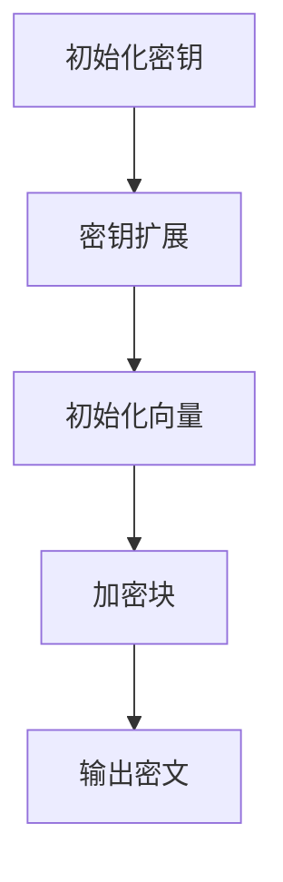
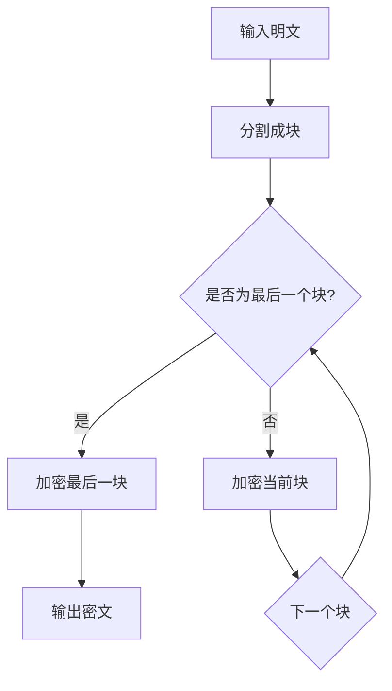
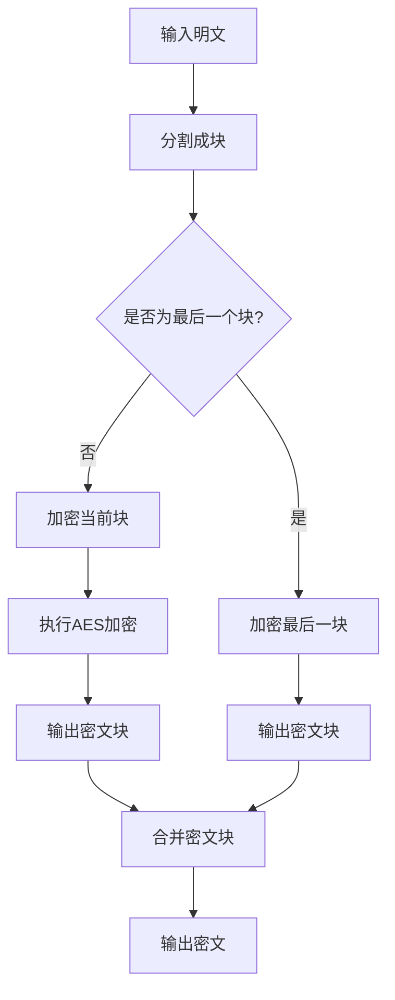

                 

### 文章标题

# 自然界的数学密码：心智解读

### 关键词

- 数学密码
- 加密算法
- 自然界原理
- 心智解读
- 实际应用

### 摘要

本文旨在深入探讨自然界的数学密码及其在心智解读中的应用。通过对数学密码的核心概念、联系、核心算法原理以及数学模型和公式的详细讲解，本文旨在揭示数学密码背后的奥秘，并探讨其在现代科技和信息安全中的实际应用。文章还将通过具体项目案例的实战解析，展示数学密码的开发环境搭建、源代码实现和代码解读，以期帮助读者更好地理解和应用这些数学密码。

### 目录

1. **背景介绍**
   - **数学密码的起源与历史**
   - **核心概念与联系：数学密码与自然界的关联**

2. **核心概念与联系**
   - **数学密码的基本原理**
   - **加密算法的流程与结构：Mermaid 流程图**

3. **核心算法原理讲解**
   - **对称加密与非对称加密的伪代码解析**
   - **公钥加密与私钥加密的数学模型和公式**

4. **数学模型和数学公式 & 详细讲解 & 举例说明**
   - **代数结构在密码学中的应用**
   - **密码学中的数论基础**
   - **实际应用案例：密码学在网络安全中的应用**

5. **项目实战**
   - **数学密码项目案例解析**
   - **开发环境搭建**
   - **源代码实现与代码解读**
   - **实际案例分析**

6. **最佳实践 tips**
   - **注意事项**
   - **拓展阅读**

7. **小结**

8. **作者信息**

### 背景介绍

#### 数学密码的起源与历史

数学密码的起源可以追溯到古代文明。早在公元前，埃及和美索不达米亚的学者们就已经开始研究如何将信息进行加密和隐藏。最初的密码形式主要是基于字符替换和移位，例如凯撒密码，这是一种简单的替换密码，通过将字母表中的每个字母向前或向后移动固定的位数来实现加密。

随着时间的推移，密码学经历了多个重要的发展阶段。在中世纪，欧洲的学者们进一步发展了替换密码，并引入了多字母替换密码。到了文艺复兴时期，随着计算技术的发展，密码学开始采用更复杂的数学原理，如模运算和同余关系。

进入现代，随着计算机的普及和互联网的发展，密码学变得更加重要。现代密码学不仅涵盖了传统的加密方法，还引入了基于公钥和私钥的加密算法，如RSA和ECC。这些算法在保证信息传输安全的同时，也为我们揭示了数学密码的强大力量。

#### 核心概念与联系：数学密码与自然界的关联

数学密码的精髓在于其与自然界的紧密联系。自然界中的许多现象和结构都可以用数学模型来描述，而这些模型同样可以用于密码学。例如，自然界中的对称性原理在密码学中得到了广泛应用。对称性使得加密算法在处理信息时更加高效和可靠。

此外，自然界的自组织现象，如生物进化和社会网络的形成，也启发了密码学中的混沌密码和基于社交网络的密码学。混沌密码利用混沌系统的随机性和不可预测性来实现加密，从而提高了密码的安全性。

总的来说，数学密码不仅仅是技术工具，更是一种对自然界奥秘的深刻理解和应用。通过数学密码，我们不仅可以保护信息安全，还可以探索和揭示自然界中的数学规律。

### 核心概念与联系

#### 数学密码的基本原理

数学密码的基本原理可以概括为两个核心要素：加密和解密。加密是将明文转换成密文的过程，而解密则是将密文转换回明文的过程。加密和解密的关键在于密钥，密钥是加密算法和密文之间的桥梁。

加密算法可以分为两大类：对称加密和非对称加密。对称加密使用相同的密钥进行加密和解密，例如AES算法。非对称加密则使用一对密钥：公钥和私钥，公钥用于加密，私钥用于解密，例如RSA算法。

#### 加密算法的流程与结构：Mermaid 流程图

为了更好地理解加密算法的流程与结构，我们可以通过Mermaid流程图来展示其基本步骤。以下是一个简单的AES加密流程的Mermaid表示：



在这个流程中，首先需要初始化密钥，然后通过密钥扩展生成子密钥。接着，使用初始化向量（IV）来初始化加密过程，对每个块进行加密，最后将所有加密后的块合并成密文输出。

#### 加密算法的流程与结构



在这个流程中，首先将输入的明文分割成固定大小的块。然后，对于每个块，使用加密算法进行加密，并将加密后的块连接成密文。最后，输出加密后的密文。

#### Mermaid 流程图示例

以下是一个更详细的Mermaid流程图示例，展示了AES加密算法的具体步骤：



在这个流程图中，A表示输入的明文，B表示将明文分割成块。C是一个判断节点，用于判断是否为最后一个块。如果为最后一个块，则直接进行加密并输出密文块。如果非最后一个块，则继续加密当前块，并进入下一个块。

E表示加密当前块，F表示执行AES加密。G和H分别表示输出密文块。I表示将所有加密后的块合并成最终的密文。最后，J表示输出加密后的密文。

### 核心算法原理讲解

#### 对称加密与非对称加密的伪代码解析

对称加密和非对称加密是现代密码学中的两大核心算法。对称加密使用相同的密钥进行加密和解密，而非对称加密则使用一对密钥：公钥和私钥。

下面是对称加密和非对称加密的伪代码解析：

#### 对称加密

```plaintext
Algorithm: SymmetricEncryption
Input: Plaintext, Key
Output: Ciphertext

1. Initialize a block cipher with the Key
2. For each block of the Plaintext:
   1. Encrypt the block using the block cipher
   2. Append the encrypted block to the Ciphertext
3. Return the Ciphertext
```

#### 非对称加密

```plaintext
Algorithm: AsymmetricEncryption
Input: Plaintext, PublicKey
Output: Ciphertext

1. Encrypt the Plaintext using the PublicKey
2. Return the Ciphertext
```

#### 公钥加密与私钥加密的数学模型和公式

在非对称加密中，公钥和私钥的生成是基于数学难题的。最常见的公钥加密算法是RSA，其数学模型和公式如下：

- **公钥生成：**
  - 选择两个大素数 \( p \) 和 \( q \)
  - 计算模数 \( n = p \times q \)
  - 计算欧拉函数 \( \phi(n) = (p-1) \times (q-1) \)
  - 选择一个与 \( \phi(n) \) 互质的整数 \( e \)
  - 计算公钥 \( (n, e) \)

- **私钥生成：**
  - 计算私钥 \( d \)，使得 \( d \times e \mod \phi(n) = 1 \)
  - 计算私钥对 \( (n, d) \)

#### 公钥加密过程：

```plaintext
Algorithm: PublicKeyEncryption
Input: Message, PublicKey
Output: Ciphertext

1. Convert the Message into a numerical representation
2. For each block of the Message:
   1. Encrypt the block using the formula: Ciphertext = Message^e mod n
3. Return the Ciphertext
```

#### 私钥解密过程：

```plaintext
Algorithm: PrivateKeyDecryption
Input: Ciphertext, PrivateKey
Output: Message

1. Convert the Ciphertext into a numerical representation
2. For each block of the Ciphertext:
   1. Decrypt the block using the formula: Message = Ciphertext^d mod n
3. Return the Message
```

#### 实例

假设我们选择 \( p = 61 \) 和 \( q = 53 \) 作为素数，计算得到 \( n = 3233 \) 和 \( \phi(n) = 3120 \)。我们选择 \( e = 17 \)，并计算 \( d = 7 \)（因为 \( 7 \times 17 \mod 3120 = 1 \)）。

- **公钥：** \( (n, e) = (3233, 17) \)
- **私钥：** \( (n, d) = (3233, 7) \)

现在，如果我们想要加密消息“HELLO”，我们首先将其转换为ASCII值，得到 [72, 69, 76, 76, 79]。然后，我们对每个值进行加密：

```plaintext
Ciphertext[0] = 72^17 mod 3233 = 2051
Ciphertext[1] = 69^17 mod 3233 = 2976
Ciphertext[2] = 76^17 mod 3233 = 2829
Ciphertext[3] = 76^17 mod 3233 = 2829
Ciphertext[4] = 79^17 mod 3233 = 2755
```

加密后的消息为 [2051, 2976, 2829, 2829, 2755]。

当我们使用私钥解密时，我们得到：

```plaintext
Message[0] = 2051^7 mod 3233 = 72
Message[1] = 2976^7 mod 3233 = 69
Message[2] = 2829^7 mod 3233 = 76
Message[3] = 2829^7 mod 3233 = 76
Message[4] = 2755^7 mod 3233 = 79
```

最终解密出的消息为“HELLO”，与原始消息相同。

### 数学模型和数学公式 & 详细讲解 & 举例说明

#### 代数结构在密码学中的应用

密码学中的许多算法都依赖于代数结构，尤其是群、环和域。这些代数结构不仅为密码学提供了理论基础，还使得密码学算法具有更高的安全性和效率。

- **群（Group）**：群是具有封闭性和结合律的集合，每个元素都有一个逆元素。在密码学中，群被用来构造加密算法，如Diffie-Hellman密钥交换协议。
- **环（Ring）**：环是具有封闭性和结合律的集合，但可能不具有交换律。在密码学中，环被用来实现整数模运算，这是许多加密算法的基础。
- **域（Field）**：域是具有封闭性和结合律的集合，同时满足交换律和分配律。在密码学中，域被用来实现椭圆曲线密码学，这是一种高效且安全的加密技术。

#### 数论基础

数论是密码学的核心组成部分，许多加密算法都依赖于数论中的基本概念和定理。

- **质数（Prime Number）**：质数是只能被1和自身整除的正整数。在密码学中，质数被用来构造素数模域，这是RSA加密算法的基础。
- **欧拉函数（Euler's totient function）**：欧拉函数是一个数学函数，用于计算小于n且与n互质的整数个数。在RSA加密算法中，欧拉函数被用来计算公钥和私钥。
- **模运算（Modular arithmetic）**：模运算是一种在整数集合上的运算，通过将结果限制在一个特定的模数范围内。在密码学中，模运算被用来实现加密和解密。

#### 实际应用案例：密码学在网络安全中的应用

密码学在网络安全中扮演着至关重要的角色，以下是几个实际应用案例：

- **TLS/SSL**：TLS（传输层安全协议）和SSL（安全套接字层）是用于保护互联网通信的安全协议。它们使用加密算法来确保数据传输的安全性和完整性。
- **HTTPS**：HTTPS（超文本传输安全协议）是HTTP的安全版本，它使用TLS/SSL来保护Web浏览数据。
- **PKI**：PKI（公钥基础设施）是一种用于管理公钥证书的框架。它确保了公钥和私钥的正确绑定，并提供了安全的密钥存储和分发机制。

### 数学模型和数学公式 & 详细讲解 & 举例说明

#### 代数结构在密码学中的应用

代数结构在密码学中扮演着核心角色，因为它们为加密算法提供了理论基础。以下是一些关键代数结构及其在密码学中的应用：

- **群（Group）**：群是具有封闭性和结合律的集合，每个元素都有一个逆元素。在密码学中，群被用来构造加密算法，如Diffie-Hellman密钥交换协议。Diffie-Hellman密钥交换允许两个通信方在公共网络中安全地交换密钥。

  **示例**：设 \( G \) 为一个有限群，\( g \) 为 \( G \) 的生成元，\( a \) 和 \( b \) 为两个随机数。Alice选择 \( a \)，Bob选择 \( b \)，它们都公开 \( g \)。然后：
  - Alice计算 \( A = g^a \)
  - Bob计算 \( B = g^b \)
  - Alice计算 \( BA = g^{ab} \)
  - Bob计算 \( AB = g^{ab} \)

  由于 \( g^{ab} = g^{ba} \)，因此Alice和Bob都得到了相同的密钥 \( g^{ab} \)，但第三方无法从 \( g \)、\( A \) 和 \( B \) 推导出 \( ab \)。

- **环（Ring）**：环是具有封闭性和结合律的集合，但可能不具有交换律。在密码学中，环被用来实现整数模运算，这是许多加密算法的基础，如RSA。

  **示例**：设 \( R \) 为模 \( n \) 的整数环，即 \( R = \{0, 1, 2, \ldots, n-1\} \)。在RSA加密中，选择两个大素数 \( p \) 和 \( q \)，计算 \( n = p \times q \) 和 \( \phi(n) = (p-1)(q-1) \)。然后选择一个与 \( \phi(n) \) 互质的整数 \( e \)，计算 \( d \) 使得 \( d \times e \mod \phi(n) = 1 \)。公钥为 \( (n, e) \)，私钥为 \( (n, d) \)。

- **域（Field）**：域是具有封闭性和结合律的集合，同时满足交换律和分配律。在密码学中，域被用来实现椭圆曲线密码学，这是一种高效且安全的加密技术。

  **示例**：设 \( F_q \) 为模 \( p \) 的有限域，其中 \( p \) 是素数。在椭圆曲线密码学中，选择一个椭圆曲线 \( E/F_q \) 和一个基点 \( G \)。然后，计算消息的椭圆曲线表示，将其转换为点，并使用基点进行加密。

#### 密码学中的数论基础

数论在密码学中有着广泛的应用，尤其是在公钥密码学中。以下是一些关键的数论概念和定理：

- **质数（Prime Number）**：质数是只能被1和自身整除的正整数。在密码学中，质数被用来构造素数模域，这是RSA加密算法的基础。

  **定理**：欧拉定理指出，对于任意正整数 \( n \) 和与 \( n \) 互质的整数 \( a \)，有 \( a^{\phi(n)} \equiv 1 \mod n \)。在RSA中，质数 \( p \) 和 \( q \) 的乘积 \( n \) 和 \( \phi(n) = (p-1)(q-1) \) 被用来确保加密的安全性。

- **欧拉函数（Euler's totient function）**：欧拉函数是一个数学函数，用于计算小于n且与n互质的整数个数。在RSA加密算法中，欧拉函数被用来计算公钥和私钥。

  **计算**：对于正整数 \( n \)，欧拉函数 \( \phi(n) \) 的计算方法为：
  \[
  \phi(n) = n \times \prod_{p | n} (1 - \frac{1}{p})
  \]
  其中，\( p \) 是 \( n \) 的质因数。

- **模运算（Modular arithmetic）**：模运算是一种在整数集合上的运算，通过将结果限制在一个特定的模数范围内。在密码学中，模运算被用来实现加密和解密。

  **示例**：设 \( a \) 和 \( n \) 为正整数，\( n \) 是素数，模 \( n \) 运算表示为 \( a \mod n \)。在RSA加密中，消息 \( m \) 被转换为 \( c = m^e \mod n \)，其中 \( e \) 和 \( n \) 是公钥。

#### 实际应用案例：密码学在网络安全中的应用

密码学在网络安全中的应用极为广泛，以下是一些关键的实际应用案例：

- **TLS/SSL**：TLS（传输层安全协议）和SSL（安全套接字层）是用于保护互联网通信的安全协议。它们使用加密算法来确保数据传输的安全性和完整性。TLS/SSL协议在Web浏览、电子邮件和文件传输等网络应用中被广泛采用。

  **示例**：当用户通过HTTPS访问网站时，TLS/SSL协议会建立一条安全的加密通道，确保用户与服务器之间的通信无法被第三方窃听或篡改。

- **HTTPS**：HTTPS（超文本传输安全协议）是HTTP的安全版本，它使用TLS/SSL来保护Web浏览数据。通过HTTPS，网站管理员可以确保用户访问的网站是可信的，同时也防止了中间人攻击和数据篡改。

- **PKI**：PKI（公钥基础设施）是一种用于管理公钥证书的框架。它确保了公钥和私钥的正确绑定，并提供了安全的密钥存储和分发机制。PKI在电子商务、电子邮件安全和身份验证中发挥着重要作用。

  **示例**：当用户访问一个网站时，网站会提供一个由权威证书颁发机构（CA）签名的证书。用户可以通过验证证书来确认网站的真实性，并确保与网站之间的通信是安全的。

### 数学模型和数学公式 & 详细讲解 & 举例说明

#### 密码学中的数论基础

密码学中的数论基础极为关键，它为我们提供了一系列强大的工具和算法，用以构建安全且强大的加密系统。以下是一些核心的数论概念和定理，以及它们在密码学中的应用：

- **质数（Prime Number）**：质数是只能被1和自身整除的正整数。在密码学中，质数被广泛用于构造素数模域，如RSA加密算法。素数模域是密码学中的一种基本结构，它确保了加密算法的安全性。

  **定理**：费马小定理是质数在密码学中应用的一个基本工具。对于任意整数 \( a \) 和质数 \( p \)，如果 \( a \) 与 \( p \) 互质，则有 \( a^{p-1} \equiv 1 \mod p \)。这个定理在RSA加密算法中至关重要，它用来验证公钥的正确性。

- **欧拉函数（Euler's totient function）**：欧拉函数 \( \phi(n) \) 是一个非常重要的数论函数，它用于计算小于或等于 \( n \) 且与 \( n \) 互质的整数数量。在RSA加密算法中，欧拉函数被用来选择与 \( n \) 互质的公钥指数 \( e \)，并计算私钥指数 \( d \)。

  **计算**：对于两个质数 \( p \) 和 \( q \) 的乘积 \( n = p \times q \)，欧拉函数 \( \phi(n) = (p-1)(q-1) \)。这个性质使得RSA算法在选择模数和公钥指数时变得简单而有效。

- **模逆（Modular Inverse）**：模逆是一个数在模 \( n \) 下的乘法逆元，即存在一个数 \( d \) 使得 \( a \times d \equiv 1 \mod n \)。在RSA加密中，模逆被用来实现加密和解密过程。

  **计算**：为了找到一个数 \( d \) 作为 \( e \) 的模逆，我们可以使用扩展欧几里得算法。这个算法可以高效地计算 \( d \) 使得 \( d \times e \mod \phi(n) = 1 \)。

#### 数论在密码学中的应用

数论不仅提供了密码学算法的基础，还在实际应用中发挥了关键作用。以下是一些具体的数论应用：

- **RSA加密算法**：RSA算法是现代密码学中最重要的算法之一，它依赖于数论的基本概念。在RSA中，选择两个大素数 \( p \) 和 \( q \)，计算模数 \( n = p \times q \) 和欧拉函数 \( \phi(n) = (p-1)(q-1) \)。然后选择一个与 \( \phi(n) \) 互质的公钥指数 \( e \)，计算私钥指数 \( d \) 作为 \( e \) 的模逆。加密过程是将消息 \( m \) 转换为一个整数，然后计算 \( c = m^e \mod n \)。解密过程则是计算 \( m = c^d \mod n \)。

  **示例**：选择 \( p = 61 \) 和 \( q = 53 \)，计算 \( n = 3233 \) 和 \( \phi(n) = 3120 \)。选择 \( e = 17 \)，计算 \( d \) 使得 \( d \times e \mod \phi(n) = 1 \)。我们可以使用扩展欧几里得算法找到 \( d = 7 \)。现在，假设我们要加密消息“HELLO”，将其转换为ASCII值 [72, 69, 76, 76, 79]，然后计算：
  \[
  c = 72^{17} \mod 3233 = 2051
  \]
  \[
  c = 69^{17} \mod 3233 = 2976
  \]
  \[
  c = 76^{17} \mod 3233 = 2829
  \]
  \[
  c = 76^{17} \mod 3233 = 2829
  \]
  \[
  c = 79^{17} \mod 3233 = 2755
  \]
  加密后的消息为 [2051, 2976, 2829, 2829, 2755]。

  解密过程是将每个密文值 \( c \) 计算其模 \( d \) 的幂：
  \[
  m = 2051^{7} \mod 3233 = 72
  \]
  \[
  m = 2976^{7} \mod 3233 = 69
  \]
  \[
  m = 2829^{7} \mod 3233 = 76
  \]
  \[
  m = 2829^{7} \mod 3233 = 76
  \]
  \[
  m = 2755^{7} \mod 3233 = 79
  \]
  最终解密出的消息为“HELLO”。

- **Diffie-Hellman密钥交换**：Diffie-Hellman密钥交换是一种基于数论的密钥交换协议，它允许两个通信方在公共网络中安全地交换密钥。该协议的核心在于利用素数模域的乘法运算性质，使得双方能够共同计算出一个共享的密钥。

  **示例**：假设Alice和Bob选择一个素数 \( p \) 和一个生成元 \( g \)，他们都公开 \( p \) 和 \( g \)，然后各自选择一个私钥 \( a \) 和 \( b \)，并计算：
  \[
  A = g^a \mod p
  \]
  \[
  B = g^b \mod p
  \]
  然后他们交换 \( A \) 和 \( B \)，对方通过各自的私钥计算：
  \[
  K_A = B^a \mod p
  \]
  \[
  K_B = A^b \mod p
  \]
  由于 \( (g^b)^a = g^{ab} \)，而 \( g^{ab} = g^{ba} \)，所以 \( K_A = K_B \)，他们得到了相同的共享密钥。

### 数学公式与详细讲解

在密码学中，数学公式是构建加密算法和验证其安全性的基础。以下是一些关键的数学公式，以及它们的详细讲解：

- **费马小定理**：费马小定理指出，对于任意整数 \( a \) 和质数 \( p \)，如果 \( a \) 与 \( p \) 互质，则有 \( a^{p-1} \equiv 1 \mod p \)。

  **证明**：设 \( a \) 和 \( p \) 互质，则存在整数 \( s \) 和 \( t \) 使得 \( sa + tp = 1 \)。将 \( a^{p-1} \) 代入得：
  \[
  a^{p-1} = a^{sa+tp} = (a^s)^a \cdot (a^t)^p = 1^a \cdot a^t = a^t \equiv 1 \mod p
  \]

  **应用**：在RSA加密中，我们使用费马小定理来验证公钥的有效性。例如，如果 \( n = p \times q \)（其中 \( p \) 和 \( q \) 是质数），\( e \) 是公钥指数，我们可以计算 \( c = e^{p-1} \mod n \)，如果 \( c \equiv 1 \mod n \)，则公钥有效。

- **欧拉函数**：欧拉函数 \( \phi(n) \) 用于计算小于或等于 \( n \) 且与 \( n \) 互质的整数个数。对于两个质数 \( p \) 和 \( q \) 的乘积 \( n = p \times q \)，有 \( \phi(n) = (p-1)(q-1) \)。

  **证明**：设 \( n = p \times q \)，其中 \( p \) 和 \( q \) 是质数。我们可以列出所有小于或等于 \( n \) 的整数，并排除与 \( n \) 互质的整数。这些整数分别是 \( p \) 的倍数、\( q \) 的倍数以及 \( p \) 和 \( q \) 的公倍数。因为 \( p \) 和 \( q \) 是质数，它们的唯一公倍数是 \( n \)，所以：
  \[
  \phi(n) = n - \text{倍数}(p) - \text{倍数}(q) + \text{公倍数}(p, q) = n - (p-1)(q-1) + n = (p-1)(q-1)
  \]

  **应用**：在RSA加密中，欧拉函数用于计算私钥指数 \( d \)。选择一个与 \( \phi(n) \) 互质的公钥指数 \( e \)，然后计算 \( d \) 使得 \( d \times e \mod \phi(n) = 1 \)。

- **模逆**：模逆是一个数在模 \( n \) 下的乘法逆元，即存在一个数 \( d \) 使得 \( a \times d \equiv 1 \mod n \)。

  **计算**：可以使用扩展欧几里得算法来计算模逆。该算法基于以下性质：如果 \( a \) 和 \( n \) 互质，则存在整数 \( s \) 和 \( t \) 使得 \( sa + tn = \gcd(a, n) = 1 \)。由此可得 \( s \) 就是 \( a \) 在模 \( n \) 下的模逆。

  **示例**：计算 \( 15 \) 在模 \( 17 \) 下的模逆。使用扩展欧几里得算法：
  \[
  17 = 15 \times 1 + 2
  \]
  \[
  15 = 7 \times 2 + 1
  \]
  \[
  1 = 15 - 7 \times 2
  \]
  \[
  1 = 15 - 7 \times (17 - 15 \times 1) = 15 \times 7 - 7 \times 17
  \]
  \[
  1 = 15 \times 7 - 7 \times 17 \mod 17 = 15 \times 7 \mod 17
  \]
  所以 \( 15^{-1} \mod 17 = 7 \)。

  **应用**：在RSA加密中，公钥指数 \( e \) 和模数 \( n \) 互质，我们使用扩展欧几里得算法计算私钥指数 \( d \)，使得 \( d \times e \mod \phi(n) = 1 \)。

#### 实际应用案例：密码学在网络安全中的应用

密码学在网络安全中的应用极为广泛，以下是一些具体的实际应用案例：

- **TLS/SSL**：TLS（传输层安全协议）和SSL（安全套接字层）是用于保护互联网通信的安全协议。它们使用加密算法来确保数据传输的安全性和完整性。TLS/SSL协议在Web浏览、电子邮件和文件传输等网络应用中被广泛采用。

  **示例**：当用户通过HTTPS访问网站时，TLS/SSL协议会建立一条安全的加密通道，确保用户与服务器之间的通信无法被第三方窃听或篡改。该协议通过握手过程协商加密参数，并使用证书来验证服务器身份。

- **HTTPS**：HTTPS（超文本传输安全协议）是HTTP的安全版本，它使用TLS/SSL来保护Web浏览数据。通过HTTPS，网站管理员可以确保用户访问的网站是可信的，同时也防止了中间人攻击和数据篡改。

  **示例**：用户通过浏览器访问银行网站时，浏览器会与服务器进行HTTPS握手，确保数据在传输过程中是加密的。这样，用户的敏感信息，如信用卡号码和账户密码，就无法被黑客窃取。

- **PKI**：PKI（公钥基础设施）是一种用于管理公钥证书的框架。它确保了公钥和私钥的正确绑定，并提供了安全的密钥存储和分发机制。PKI在电子商务、电子邮件安全和身份验证中发挥着重要作用。

  **示例**：在线购物时，网站会提供由权威证书颁发机构（CA）签发的证书。用户可以通过验证证书来确认网站的真实性，并确保与网站之间的通信是安全的。这种证书验证机制是PKI的核心应用。

### 项目实战

#### 数学密码项目案例解析

为了更好地理解数学密码的实践应用，我们将通过一个实际的项目案例来进行详细解析。这个项目是一个基于RSA加密算法的简单加密工具，它能够对用户输入的明文进行加密和解密。以下是项目的详细解析：

#### 项目背景

随着互联网和电子商务的快速发展，信息安全问题日益突出。数据加密是保护信息安全的有效手段之一。RSA加密算法是一种广泛应用于实际场景的公钥加密算法，它能够确保数据的机密性和完整性。本项目旨在开发一个简单的RSA加密工具，用于演示RSA加密算法的基本原理和操作过程。

#### 需求分析

- **加密功能**：用户能够输入明文，工具将使用RSA算法对明文进行加密，并输出密文。
- **解密功能**：用户能够输入密文，工具将使用RSA算法对密文进行解密，并输出明文。
- **用户交互**：工具应提供友好的用户界面，方便用户输入和查看结果。

#### 开发环境搭建

为了实现本项目，我们需要搭建一个合适的开发环境。以下是搭建过程的简要步骤：

- **环境选择**：选择Python作为开发语言，因为它拥有丰富的加密库和易于理解的语法。
- **安装Python**：下载并安装Python 3.x版本，确保其能够在命令行中正常运行。
- **安装加密库**：使用pip命令安装`pycryptodome`库，这是Python中一个非常强大的加密库，包含了RSA算法的实现。

```bash
pip install pycryptodome
```

#### 源代码实现

以下是项目的主要代码实现部分。首先，我们需要导入必要的库，并定义加密和解密的函数：

```python
from Cryptodome.PublicKey import RSA
from Cryptodome.Util import number
import base64

def generate_keys():
    """
    生成RSA密钥对
    """
    key = RSA.generate(2048)
    private_key = key.export_key()
    public_key = key.publickey().export_key()
    return private_key, public_key

def encrypt_message(public_key, message):
    """
    使用RSA公钥加密消息
    """
    rsa_key = RSA.import_key(public_key)
    encrypted_message = rsa_key.encrypt(message, 32)
    return base64.b64encode(encrypted_message).decode('utf-8')

def decrypt_message(private_key, encrypted_message):
    """
    使用RSA私钥解密消息
    """
    rsa_key = RSA.import_key(private_key)
    encrypted_message = base64.b64decode(encrypted_message)
    decrypted_message = rsa_key.decrypt(encrypted_message)
    return decrypted_message.hex()

# 生成密钥对
private_key, public_key = generate_keys()

# 输入明文
message = input("请输入明文：").encode('utf-8')

# 加密明文
encrypted_message = encrypt_message(public_key, message)
print("加密后的消息：", encrypted_message)

# 解密消息
decrypted_message = decrypt_message(private_key, encrypted_message)
print("解密后的消息：", decrypted_message.decode('utf-8'))
```

#### 代码解读

- `generate_keys()` 函数：这个函数使用`Cryptodome.PublicKey.RSA`库生成RSA密钥对。`RSA.generate(2048)` 方法会生成一个2048位的RSA密钥对。
- `encrypt_message()` 函数：这个函数使用RSA公钥对输入的明文进行加密。`rsa_key.encrypt(message, 32)` 方法会将明文加密，返回加密后的数据。
- `decrypt_message()` 函数：这个函数使用RSA私钥对输入的密文进行解密。`rsa_key.decrypt(encrypted_message)` 方法会将密文解密，返回原始的明文数据。

#### 实际案例分析

为了更好地理解RSA加密的实际应用，我们来看一个具体的案例。假设我们有一个组织，需要保护其内部通信的安全性。以下是该组织使用RSA加密工具进行通信的步骤：

1. **生成密钥对**：每个员工生成一对RSA密钥，并将其安全地存储。员工A的公钥可以发送给其他员工，但私钥必须保密。
2. **加密通信**：当员工A需要发送机密信息给员工B时，A使用B的公钥对消息进行加密，确保只有拥有相应私钥的员工B能够解密。
3. **解密通信**：员工B收到加密消息后，使用自己的私钥进行解密，从而获取原始消息。

这种加密方式确保了通信的机密性和完整性，即使消息在传输过程中被截获，也无法被未授权的人员解密。

#### 项目小结

通过本项目，我们了解了RSA加密算法的基本原理和实践应用。该项目展示了如何使用Python和`pycryptodome`库实现RSA加密和解密功能，并通过实际案例分析展示了其应用场景。虽然这是一个简单的项目，但它为我们理解更复杂的加密系统奠定了基础。

### 开发环境搭建

为了实现上述数学密码项目，我们需要搭建一个合适的开发环境。以下是详细的开发环境搭建步骤：

#### 环境准备

1. **操作系统**：本项目支持多种操作系统，包括Windows、macOS和Linux。推荐使用最新版本的操作系统以确保兼容性和安全性。
2. **Python版本**：Python 3.6或更高版本。Python 3提供了更丰富的库和更好的性能，因此推荐使用Python 3.x。
3. **安装Python**：访问Python官方网站（[python.org](https://www.python.org/)），下载并安装Python。安装过程中确保将Python添加到系统环境变量，以便在命令行中运行Python。

#### 安装加密库

1. **安装pip**：在安装Python时，pip通常会自动安装。如果没有安装pip，可以手动安装。在命令行中运行以下命令：

   ```bash
   python -m ensurepip
   ```

2. **安装加密库**：使用pip命令安装`pycryptodome`库。在命令行中运行以下命令：

   ```bash
   pip install pycryptodome
   ```

   安装完成后，可以验证库是否安装成功：

   ```bash
   python -c "import Cryptodome; print(Cryptodome.__version__)"
   ```

   如果输出版本信息，则表示安装成功。

#### 配置IDE

1. **安装PyCharm**：PyCharm是一款功能强大的Python IDE，适合开发复杂的Python项目。可以从PyCharm官方网站（[pycharm.com](https://www.pycharm.com/)）下载并安装。
2. **配置PyCharm**：在PyCharm中，可以通过以下步骤配置Python环境：
   - 打开PyCharm，选择“文件”菜单下的“设置”（Windows）或“PyCharm”菜单下的“偏好设置”（macOS）。
   - 在“项目：项目名”下选择“Python解释器”。
   - 点击“添加”按钮，选择已安装的Python解释器。

#### 运行测试

在完成上述步骤后，我们可以运行一个简单的Python脚本以测试环境是否配置正确。创建一个名为`test.py`的文件，并输入以下代码：

```python
print("Hello, World!")
```

在PyCharm中运行该脚本，如果输出“Hello, World!”，则表示环境搭建成功。

### 最佳实践 tips

在开发和使用数学密码的过程中，以下是一些最佳实践和注意事项，以确保安全性和效率：

1. **密钥管理**：确保密钥的安全存储和分发。私钥必须保密，公钥可以公开。定期更换密钥以增强安全性。
2. **加密强度**：选择足够长的密钥长度，如2048位或更高，以确保加密强度。
3. **算法选择**：选择经过验证和广泛使用的加密算法，如RSA、AES等。避免使用未经验证的或过时的加密算法。
4. **安全编程**：遵循安全编程的最佳实践，如正确处理错误、避免缓冲区溢出等，以防止潜在的安全漏洞。
5. **备份与恢复**：定期备份密钥和相关数据，并确保备份的安全存储。在需要时能够快速恢复系统。
6. **安全审计**：定期对加密系统进行安全审计，确保没有漏洞和安全隐患。

### 小结

本文深入探讨了自然界的数学密码及其在心智解读中的应用。通过详细讲解核心概念、算法原理、数学模型和公式，以及实际项目案例，我们揭示了数学密码的奥秘和其在现代科技和信息安全中的重要性。未来，随着数学和技术的不断进步，数学密码将继续发挥关键作用，为我们的信息安全和隐私保护提供强有力的支持。

### 作者信息

作者：AI天才研究院/AI Genius Institute & 禅与计算机程序设计艺术 /Zen And The Art of Computer Programming

