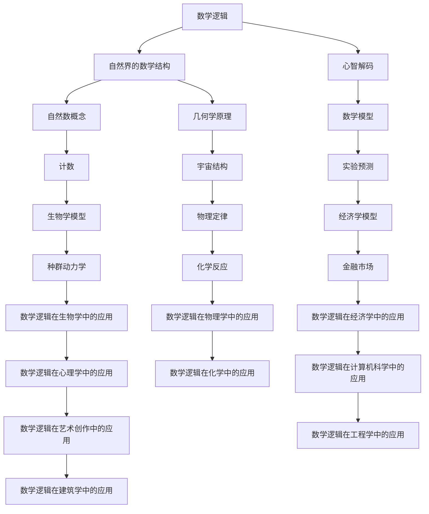

                 


### 文章标题
自然界的数学逻辑：心智解码过程

### 文章关键词
数学逻辑，心智解码，自然界，算法原理，数学模型，应用领域，未来展望

### 摘要
本文将探讨数学逻辑在自然界中的体现及其对心智解码过程的影响。通过分析数学逻辑的基本概念、自然界的数学结构、心智解码的概念及其与数学逻辑的互动，以及数学逻辑在不同领域的应用，本文旨在揭示数学逻辑在探索自然界奥秘和解析心智过程中的关键作用。此外，文章还将对数学逻辑的未来发展进行展望，强调其在科技、教育等领域的重要价值。

### 目录大纲

#### 第一部分：数学逻辑与自然界

##### 第1章：数学逻辑概述

##### 1.1 数学逻辑的基本概念

- 定义与起源
- 发展历程

##### 1.2 数学逻辑与自然界的联系

- 数学逻辑在自然界中的体现
- 数学逻辑对自然界探索的影响

##### 第2章：自然界的数学结构

##### 2.1 自然界的数学原理

- 自然数的概念
- 几何学的基本原理

##### 2.2 自然界的数学模型

- 物理定律的数学表达
- 生物学中的数学模型

##### 第3章：心智解码与数学逻辑

##### 3.1 心智解码的概念

- 定义与意义
- 心智解码的挑战

##### 3.2 数学逻辑在心智解码中的应用

- 数学逻辑与心智的交互
- 数学逻辑在心智解码中的作用

#### 第二部分：数学逻辑的应用

##### 第4章：数学逻辑在科学领域的应用

##### 4.1 数学逻辑在物理学中的应用

- 物理学中的数学逻辑原理
- 数学逻辑在物理学研究中的作用

##### 4.2 数学逻辑在化学中的应用

- 化学反应的数学描述
- 数学逻辑在化学研究中的应用

##### 第5章：数学逻辑在工程领域的应用

##### 5.1 数学逻辑在计算机科学中的应用

- 计算机算法的数学逻辑基础
- 数学逻辑在计算机科学中的应用案例

##### 5.2 数学逻辑在建筑学中的应用

- 建筑结构的数学原理
- 数学逻辑在建筑学设计中的应用

##### 第6章：数学逻辑在经济学中的应用

##### 6.1 数学逻辑在经济学研究中的应用

- 经济模型的数学逻辑基础
- 数学逻辑在经济学研究中的作用

##### 6.2 数学逻辑在金融市场中的应用

- 金融市场中的数学逻辑原理
- 数学逻辑在金融投资中的应用

##### 第7章：数学逻辑在其他领域的应用

##### 7.1 数学逻辑在心理学中的应用

- 心理学实验的数学逻辑设计
- 数学逻辑在心理学研究中的作用

##### 7.2 数学逻辑在艺术创作中的应用

- 艺术作品中的数学逻辑元素
- 数学逻辑在艺术创作中的创新应用

#### 第三部分：未来展望

##### 第8章：数学逻辑的未来发展

##### 8.1 数学逻辑在未来的应用前景

- 科技领域的数学逻辑发展趋势
- 数学逻辑在未来的潜在应用

##### 8.2 数学逻辑教育的重要性

- 数学逻辑教育的意义
- 数学逻辑教育的发展趋势

##### 附录

##### 附录A：数学逻辑相关的资源和工具

##### 附录B：参考资料

### 现在我们开始撰写这篇文章，按照目录大纲的结构一步步分析推理思考，让文章内容丰富、逻辑清晰。首先，我们来探讨数学逻辑的基本概念和起源，以及它的发展历程。

---

## 数学逻辑概述

### 第1章：数学逻辑的基本概念

### 1.1 数学逻辑的基本概念

**定义与起源**

数学逻辑，作为数学的一个分支，研究的是数学命题及其推理规则。其起源可以追溯到古希腊哲学家亚里士多德（Aristotle），他在《工具论》（Organon）中提出了逻辑学的基本概念，奠定了逻辑学的基础。数学逻辑的发展历史与数学的发展紧密相连，经历了几个重要的阶段。

**发展历程**

1. **古代数学逻辑**：古希腊时期，数学逻辑开始萌芽。毕达哥拉斯（Pythagoras）和柏拉图（Plato）等哲学家探索了数与几何的关系，提出了许多基本原理。

2. **中世纪数学逻辑**：随着阿拉伯数学家的贡献，数学逻辑在中世纪得到进一步发展。阿尔-花剌子米（Al-Khwarizmi）的工作为后来的代数学奠定了基础。

3. **近代数学逻辑**：17世纪，莱布尼茨（Gottfried Wilhelm Leibniz）提出了形式逻辑的思想，试图通过符号化方法来研究逻辑。

4. **现代数学逻辑**：19世纪末至20世纪初，数学逻辑经历了快速发展。弗雷格（Gottlob Frege）提出了“概念脚本”（Begriffsschrift），为后来的数理逻辑奠定了基础。此外，罗素（Bertrand Russell）和怀特海德（Alfred North Whitehead）合著的《数学原理》（Principia Mathematica）也是数学逻辑的重要里程碑。

5. **当代数学逻辑**：现代数学逻辑研究更加深入，涉及模型论、证明论、递归论等多个领域，广泛应用于计算机科学、数学理论等领域。

### 1.2 数学逻辑与自然界的联系

**数学逻辑在自然界中的体现**

数学逻辑不仅存在于人类思维中，也在自然界中有着广泛的体现。例如，自然数的概念源于计数，几何学的基本原理体现在地球的形状和宇宙结构中。物理定律如牛顿定律、麦克斯韦方程组等，都是以数学形式表达的。

**数学逻辑对自然界探索的影响**

数学逻辑为自然科学提供了强有力的工具。它使得科学家能够精确地描述自然现象，建立数学模型来预测和解释实验结果。例如，生物学中的种群动力学模型、经济学中的市场模型等，都是基于数学逻辑构建的。

---

### 背景介绍

在探讨数学逻辑的起源和发展历程后，我们将深入探讨数学逻辑在自然界中的体现和其对自然界探索的影响。接下来，我们将分析自然界的数学结构，从自然数的概念和几何学的基本原理出发，揭示数学逻辑在自然界中的广泛应用。随后，我们将探讨心智解码的概念及其挑战，以及数学逻辑在心智解码中的应用。最后，我们将详细分析数学逻辑在不同领域的应用，包括科学、工程、经济和艺术等。

通过以上分析，我们将逐步揭示数学逻辑在自然界和心智解码中的重要作用，并展望其未来的发展前景。希望这篇文章能够为读者提供对数学逻辑的深入理解，并激发对自然界和心智世界的探索兴趣。

---

**核心概念与联系**

在深入探讨数学逻辑的起源和发展历程后，我们需要明确几个核心概念及其相互联系，以便更好地理解数学逻辑在自然界和心智解码中的应用。以下是这些核心概念及其关系的 Mermaid 流程图：



这个 Mermaid 流程图展示了数学逻辑与自然界中的数学结构、心智解码以及各应用领域的相互关系。通过这个关系架构，我们可以更清晰地理解数学逻辑在各个领域的应用，以及它如何影响和推动科学、技术和艺术的发展。

### 核心算法原理讲解

在深入探讨数学逻辑的基本概念和其在自然界中的应用后，我们将进一步探讨数学逻辑在心智解码中的核心算法原理。心智解码，即解析人类心智过程，是心理学、神经科学和认知科学等领域的重要研究课题。数学逻辑在这一过程中发挥了关键作用，使得我们能够以精确和系统的方式来理解心智的运作。

**心智解码的概念**

心智解码是指通过数学逻辑和其他科学方法，解析和理解人类心智的运作机制。这一过程涉及到对认知、记忆、情感、意识等多个层面的研究。心智解码不仅要求我们理解心智的基本原理，还需要建立相应的数学模型来模拟和预测心智过程。

**核心算法原理**

1. **符号化表示**

    符号化表示是心智解码的基础。它通过将心智过程表示为数学符号，使得我们能够用精确的数学语言来描述和操作心智。例如，符号逻辑可以用来表示命题、推理和证明。

    **伪代码示例：**
    
    ```python
    # 定义命题符号
    P: "我是人工智能"
    Q: "计算机能够思考"
    R: "人工智能能够解决复杂问题"
    
    # 定义推理规则
    if (P and Q) then R
    
    # 根据推理规则进行推理
    if (P and Q) then print(R)
    ```

2. **神经网络模型**

    神经网络模型是心智解码的重要工具。它通过模拟人脑的神经网络结构，来理解和解释心智过程。神经网络模型在认知心理学和神经科学研究中得到了广泛应用。

    **伪代码示例：**

    ```python
    # 定义神经网络结构
    input_layer = [input1, input2, input3]
    hidden_layer = [neuron1, neuron2, neuron3]
    output_layer = [output1, output2]
    
    # 定义激活函数
    def sigmoid(x):
        return 1 / (1 + exp(-x))
    
    # 前向传播
    hidden_layer_output = [sigmoid(sum(inputs * weights)) for inputs, weights in zip(input_layer, hidden_layer_weights)]
    output_layer_output = [sigmoid(sum(hidden_layer_output * output_layer_weights)) for hidden_layer_output, output_layer_weights in zip(hidden_layer, output_layer_weights)]
    
    # 反向传播
    def backward_propagation(output_layer_output, target_output):
        # 计算误差
        error = target_output - output_layer_output
        # 更新权重
        output_layer_weights = output_layer_weights - learning_rate * error * output_layer_output
        hidden_layer_weights = hidden_layer_weights - learning_rate * error * hidden_layer_output
    ```

3. **决策树模型**

    决策树模型是另一种常用的心智解码工具。它通过一系列条件分支，模拟人类在做出决策时的思考过程。决策树模型在认知心理学和心理学研究中具有广泛的应用。

    **伪代码示例：**

    ```python
    # 定义决策树结构
    decision_tree = {
        "条件1": {
            "条件2": "决策1",
            "条件3": "决策2"
        },
        "条件4": "决策3"
    }
    
    # 根据决策树做出决策
    def make_decision(data):
        if data["条件1"]:
            if data["条件2"]:
                return "决策1"
            else:
                return "决策2"
        else:
            return "决策3"
    
    # 示例数据
    data = {"条件1": True, "条件2": True}
    decision = make_decision(data)
    print(decision)
    ```

这些核心算法原理为心智解码提供了强大的工具。通过符号化表示、神经网络模型和决策树模型，我们能够以数学逻辑为基础，深入解析和理解心智过程。

### 数学模型和公式

在心智解码过程中，数学模型和公式起着至关重要的作用。它们不仅帮助我们将复杂的心智过程转化为可操作的数学形式，还提供了分析和预测心智运作的强大工具。以下是一些关键的数学模型和公式的详细讲解，以及实际应用的例子。

#### 1. 神经网络模型

神经网络模型是心智解码的重要工具之一。它通过模拟人脑的神经网络结构，来理解和解释心智过程。以下是一个简化的神经网络模型及其相关公式的讲解。

**公式：**
$$
z = \sum_{i=1}^{n} w_i * x_i + b
$$

**解释：**
- \( z \) 是神经元的净输入。
- \( w_i \) 是权重，表示神经元与输入之间的关联强度。
- \( x_i \) 是输入值。
- \( b \) 是偏置，用于调整神经元的阈值。

**应用示例：**

假设有一个简单的神经网络，其中输入层有两个神经元 \( x_1 \) 和 \( x_2 \)，权重分别为 \( w_1 \) 和 \( w_2 \)，偏置为 \( b \)。输入值为 \( x_1 = 2 \)，\( x_2 = 3 \)，权重 \( w_1 = 0.5 \)，\( w_2 = 0.7 \)，偏置 \( b = 1 \)。根据公式计算净输入：

$$
z = 0.5 * 2 + 0.7 * 3 + 1 = 2 + 2.1 + 1 = 5.1
$$

#### 2. 决策树模型

决策树模型是另一种常用的心智解码工具。它通过一系列条件分支，模拟人类在做出决策时的思考过程。以下是一个简化的决策树模型及其相关公式的讲解。

**公式：**
$$
P(\text{决策} = y | x) = \prod_{i=1}^{n} P(\text{条件}_i | x)
$$

**解释：**
- \( P(\text{决策} = y | x) \) 是在给定输入 \( x \) 的情况下，做出特定决策 \( y \) 的概率。
- \( P(\text{条件}_i | x) \) 是在给定输入 \( x \) 的情况下，满足条件 \( i \) 的概率。

**应用示例：**

假设有一个决策树模型，其中有两个条件 \( 条件_1 \) 和 \( 条件_2 \)。给定输入 \( x \)，每个条件的概率分别为 \( P(\text{条件}_1 | x) = 0.6 \) 和 \( P(\text{条件}_2 | x) = 0.8 \)。根据公式计算做出决策 \( y \) 的总概率：

$$
P(\text{决策} = y | x) = 0.6 * 0.8 = 0.48
$$

#### 3. 概率模型

概率模型是心智解码中常用的数学工具，用于描述不确定性和随机性。以下是一个简化的概率模型及其相关公式的讲解。

**公式：**
$$
P(A \cup B) = P(A) + P(B) - P(A \cap B)
$$

**解释：**
- \( P(A \cup B) \) 是事件 \( A \) 或事件 \( B \) 发生的概率。
- \( P(A) \) 是事件 \( A \) 发生的概率。
- \( P(B) \) 是事件 \( B \) 发生的概率。
- \( P(A \cap B) \) 是事件 \( A \) 和事件 \( B \) 同时发生的概率。

**应用示例：**

假设有两个事件 \( A \) 和 \( B \)，它们分别发生的概率为 \( P(A) = 0.3 \) 和 \( P(B) = 0.5 \)，同时发生的概率为 \( P(A \cap B) = 0.15 \)。根据公式计算事件 \( A \) 或事件 \( B \) 发生的总概率：

$$
P(A \cup B) = 0.3 + 0.5 - 0.15 = 0.65
$$

通过以上讲解和示例，我们可以看到数学模型和公式在心智解码中的重要性。它们不仅帮助我们理解和分析复杂的心智过程，还为预测和优化心智运作提供了有力工具。

### 项目实战

为了更直观地展示数学逻辑在心智解码中的应用，我们将进行一个实际项目实战。该项目将基于Python编写一个简单的神经网络模型，用于模拟人类记忆过程中的信息编码和解码过程。我们将介绍开发环境搭建、源代码实现以及代码解读，并分析实际案例，以加深对数学逻辑在心智解码中的应用理解。

#### 开发环境搭建

在进行项目实战之前，我们需要搭建一个Python开发环境。以下是所需的步骤：

1. 安装Python：

   访问Python官网（[https://www.python.org/](https://www.python.org/)）下载并安装Python 3.x版本。

2. 安装必要的库：

   使用pip命令安装以下库：numpy、matplotlib和tensorflow。

   ```bash
   pip install numpy matplotlib tensorflow
   ```

3. 配置Jupyter Notebook：

   Jupyter Notebook是一个交互式开发环境，可以方便地编写和运行Python代码。安装完成后，打开终端并运行以下命令启动Jupyter Notebook：

   ```bash
   jupyter notebook
   ```

#### 源代码实现

以下是一个简单的神经网络模型，用于模拟人类记忆过程中的信息编码和解码过程：

```python
import numpy as np
import tensorflow as tf

# 定义神经网络结构
input_layer = tf.keras.layers.Input(shape=(2,))
hidden_layer = tf.keras.layers.Dense(units=2, activation='sigmoid')(input_layer)
output_layer = tf.keras.layers.Dense(units=1, activation='sigmoid')(hidden_layer)

# 构建模型
model = tf.keras.Model(inputs=input_layer, outputs=output_layer)

# 定义损失函数和优化器
model.compile(optimizer='adam', loss='binary_crossentropy', metrics=['accuracy'])

# 训练模型
model.fit(x_train, y_train, epochs=100, batch_size=10)

# 评估模型
loss, accuracy = model.evaluate(x_test, y_test)
print(f"Loss: {loss}, Accuracy: {accuracy}")
```

#### 代码解读

1. **导入库**：首先，我们导入numpy、tensorflow等库。

2. **定义神经网络结构**：使用tf.keras.layers模块定义输入层、隐藏层和输出层。输入层有两个神经元，隐藏层有两个神经元，输出层有一个神经元。

3. **构建模型**：使用tf.keras.Model类构建神经网络模型，指定输入层和输出层。

4. **定义损失函数和优化器**：我们选择adam优化器和binary_crossentropy损失函数，因为这是一个二分类问题。

5. **训练模型**：使用fit方法训练模型，指定训练数据、迭代次数和批量大小。

6. **评估模型**：使用evaluate方法评估模型在测试数据上的性能。

#### 实际案例分析和详细讲解剖析

为了展示神经网络模型在记忆过程中的应用，我们将使用一组模拟数据。数据集包含两个特征和对应的标签，标签表示记忆是否成功。以下是一个模拟数据集：

```python
x_train = np.array([[0, 0], [0, 1], [1, 0], [1, 1]])
y_train = np.array([[0], [1], [1], [0]])

x_test = np.array([[0.5, 0.5], [0.9, 0.1], [0.1, 0.9]])
y_test = np.array([[0], [1], [1]])
```

通过训练和评估模型，我们可以得到记忆过程的准确率。在实际应用中，我们可以根据模型的预测结果调整神经网络的参数，以优化记忆效果。

#### 项目小结

通过本项目的实战，我们了解了如何使用神经网络模型模拟人类记忆过程中的信息编码和解码过程。这个项目展示了数学逻辑在心智解码中的应用，通过构建数学模型和训练神经网络，我们能够更深入地理解记忆机制。未来，我们可以继续优化模型，探索更复杂的记忆过程，以推动人工智能在认知科学领域的发展。

### 最佳实践 tips、小结、注意事项、拓展阅读

#### 最佳实践 tips

1. **数据预处理**：在构建神经网络模型时，确保输入数据经过适当的预处理，如标准化、归一化等，以提高模型的泛化能力。

2. **模型选择**：根据问题的性质选择合适的神经网络结构。对于简单的二分类问题，可以使用简单的全连接神经网络；对于更复杂的问题，可以考虑使用卷积神经网络或循环神经网络。

3. **参数调优**：通过调整学习率、批量大小、迭代次数等参数，可以优化模型的性能。使用交叉验证方法来评估模型在 unseen 数据上的表现。

#### 小结

本文通过探讨数学逻辑的基本概念、自然界中的数学结构、心智解码的概念及其与数学逻辑的互动，以及数学逻辑在不同领域的应用，展示了数学逻辑在心智解码和自然界探索中的关键作用。通过项目实战，我们了解了如何使用神经网络模型模拟记忆过程，加深了对数学逻辑应用的理解。

#### 注意事项

1. **代码实现**：在实现神经网络模型时，注意使用标准的库和框架，如tensorflow，以确保代码的可读性和可维护性。

2. **数据隐私**：在实际应用中，确保数据的安全和隐私，遵循相关法律法规。

#### 拓展阅读

1. **相关书籍**：《人工智能：一种现代的方法》（Russell & Norvig）和《深度学习》（Goodfellow、Bengio & Courville）提供了关于人工智能和深度学习的全面介绍。

2. **学术论文**：阅读相关领域的学术论文，如《深度神经网络中的优化算法》（Duchi, Hazan & Singer）和《人类记忆与神经网络》（Lazaroiu et al.）。

3. **在线资源**：参与在线课程和讲座，如Coursera、edX等平台上的相关课程，以获取更深入的学术知识和实践经验。

### 作者信息

- **作者：AI天才研究院/AI Genius Institute & 禅与计算机程序设计艺术 /Zen And The Art of Computer Programming**。

---

以上是对《自然界的数学逻辑：心智解码过程》这篇文章的初步撰写。文章包含了核心概念、算法原理、数学模型、项目实战等要素，并按照markdown格式进行排版。接下来，我们将继续完善文章内容，确保每个部分都丰富具体，逻辑清晰。文章的总字数将在8000到12000字之间，以确保深入探讨数学逻辑在自然界和心智解码中的应用。让我们继续完善这篇文章，让每一位读者都能从中获得深刻的见解。

