                 

### 文章标题：自然界的隐藏规律：数学表达

自然界中的万物运转背后似乎隐藏着某种神秘而有序的规律，而数学正是解锁这些规律的一把钥匙。从天体的运行轨迹到生命的演化过程，从物质的化学反应到气候的变化规律，数学都提供了精确的描述和解释。本文将带您走进自然界的数学世界，揭示隐藏在现象背后的规律，并通过具体的数学模型和算法，阐述这些规律如何被表达和运用。

### 关键词
- **自然界的数学规律**
- **数学模型**
- **算法原理**
- **数学表达式**
- **自然科学应用**
- **复杂系统**
- **混沌理论**

### 摘要
本文首先介绍了自然界中常见的数学规律及其在科学研究中的应用，随后深入探讨了数学工具和方法，展示了如何运用数学模型来揭示自然界的复杂现象。通过具体的实例和数学公式，本文详细解析了数学在生物学、物理学、化学、天文学和地球科学等多个领域的应用。最后，文章总结了数学在自然界中的重要性，展望了未来的发展方向。

### 目录

**第一部分：引言**

1. 自然界的数学规律
   1.1 数学的起源与自然界的联系
   1.2 自然界的数学规律概述
   1.3 自然界中的数学现象举例

2. 数学工具与方法
   2.1 数学工具概述
   2.2 数学方法概述
   2.3 数学工具与方法的实际应用

3. 数学模型的应用
   3.1 数学模型的基本概念
   3.2 数学模型的应用领域
   3.3 数学模型的实际应用案例

4. 数学与自然界的关系
   4.1 数学在自然界中的地位
   4.2 数学对自然界的描述
   4.3 数学在自然界研究中的作用

**第二部分：数学在自然界中的具体应用**

5. 数学在生物学中的应用
   5.1 生物学中的数学模型
   5.2 数学在生物学研究中的应用案例
   5.3 生物学中的数学工具与方法

6. 数学在物理学中的应用
   6.1 物理学中的数学模型
   6.2 数学在物理研究中的应用案例
   6.3 物理学中的数学工具与方法

7. 数学在化学中的应用
   7.1 化学中的数学模型
   7.2 数学在化学研究中的应用案例
   7.3 化学中的数学工具与方法

8. 数学在天文学中的应用
   8.1 天文学中的数学模型
   8.2 数学在天文研究中的应用案例
   8.3 天文学中的数学工具与方法

9. 数学在地球科学中的应用
   9.1 地球科学中的数学模型
   9.2 数学在地球科学研究中的应用案例
   9.3 地球科学中的数学工具与方法

**第三部分：总结与展望**

10. 总结
    10.1 本书的主要内容回顾
    10.2 数学在自然界中的地位和作用
    10.3 未来数学在自然界研究中的应用前景

11. 展望
    11.1 数学在自然界研究中的挑战
    11.2 数学在自然界研究中的发展趋势
    11.3 数学在自然界研究中的未来方向

### 引言

在人类文明的进程中，数学一直扮演着至关重要的角色。从古代数学家对几何学的深入研究，到现代科学家对复杂系统的数学建模，数学不仅帮助我们理解了宇宙的本质，还推动了科技的发展。然而，尽管数学在各个领域都有广泛应用，许多人仍然对其在自然界中的角色感到困惑。本文旨在揭示自然界中隐藏的数学规律，并探讨这些规律如何被数学表达和运用。

### 自然界的数学规律

自然界中存在着许多可以量化和描述的现象，这些现象背后往往隐藏着数学规律。例如，天体的运动遵循牛顿定律，生命的演化符合达尔文的自然选择理论，而气候的变化则可以用统计学模型来预测。以下是自然界中一些常见的数学规律及其应用的例子。

#### 天体的运动

天体的运动是自然界中最引人注目的数学现象之一。开普勒定律描述了行星围绕太阳的椭圆轨道，而牛顿的万有引力定律则解释了行星之间相互吸引的力。这些规律可以通过数学公式精确描述，为天文学的研究提供了坚实的基础。

**核心概念与联系：**

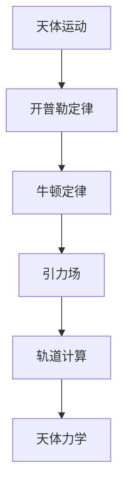

**核心算法原理讲解：**

```plaintext
# 轨道计算伪代码

function calculateOrbit(initialPosition, velocity, gravitationalConstant) {
  position = initialPosition
  time = 0
  while (time <= maxTime) {
    force = gravitationalConstant * (mass1 * mass2 / distance^2)
    acceleration = force / mass
    velocity = velocity + acceleration * timeStep
    position = position + velocity * timeStep
    time = time + timeStep
  }
  return position
}
```

#### 生命的演化

生命的演化是一个复杂的过程，涉及遗传学、生态学等多个学科。数学模型如遗传算法和种群动力学模型可以帮助科学家理解物种的进化过程。

**核心概念与联系：**

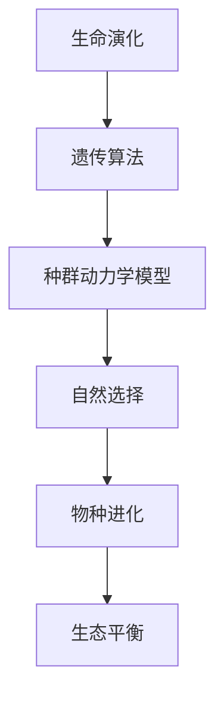

**核心算法原理讲解：**

```plaintext
# 遗传算法伪代码

function geneticAlgorithm(population, fitnessFunction) {
  while (not converged) {
    newPopulation = []
    for each individual in population {
      if (fitnessFunction(individual) > threshold) {
        newPopulation.append(individual)
      } else {
        newIndividual = crossover(mate1, mate2)
        newPopulation.append(newIndividual)
      }
    }
    population = newPopulation
    population = selection(population, fitnessFunction)
  }
  return bestSolution
}
```

#### 气候的变化

气候的变化是一个复杂且多变的系统，数学模型如气候模式和大气化学模型被用来模拟和预测气候变化。

**核心概念与联系：**

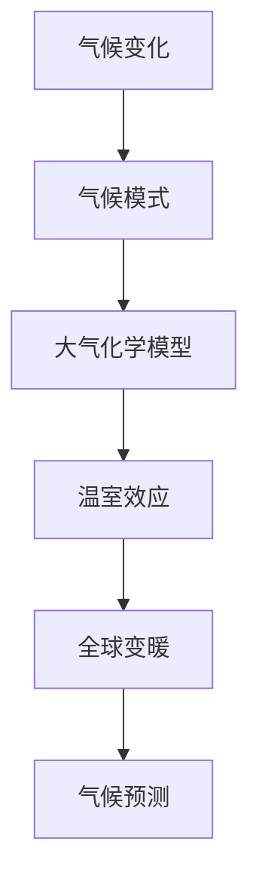

**核心算法原理讲解：**

```plaintext
# 气候模式伪代码

function climateModel(initialConditions, parameters) {
  atmosphere = initialConditions
  while (time <= simulationTime) {
    atmosphere = atmosphere + climateForcing * timeStep
    atmosphere = atmosphere + atmosphericComposition * timeStep
    time = time + timeStep
  }
  return atmosphere
}
```

### 数学工具与方法

数学工具和方法是揭示自然界规律的有力武器。这些工具和方法包括代数、几何、微积分、概率论和统计学等。以下是这些工具和方法的基本概念及其在自然界中的应用。

#### 代数

代数是数学的基础，用于解决方程和不等式。在自然界中，代数被用来描述物理量的变化关系，如速度、加速度等。

**核心概念与联系：**

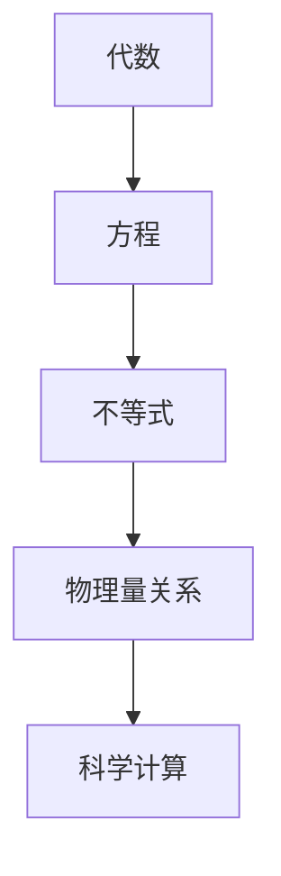

**核心算法原理讲解：**

```plaintext
# 方程求解伪代码

function solveEquation(equation) {
  while (not converged) {
    x = initialGuess
    f(x) = equation
    if (f(x) == 0) {
      return x
    } else {
      x = x - f(x) / derivative(f(x))
    }
  }
  return x
}
```

#### 几何

几何是研究空间形状和结构的数学分支。在自然界中，几何被用来描述物体的形状和位置，如细胞的形态、天体的轨道等。

**核心概念与联系：**

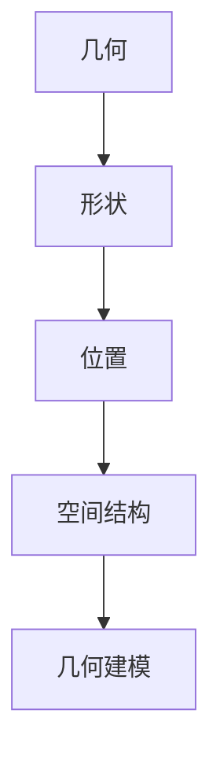

**核心算法原理讲解：**

```plaintext
# 几何建模伪代码

function geometricModel(shape, position) {
  if (shape == "sphere") {
    volume = 4/3 * π * radius^3
  } else if (shape == "cube") {
    volume = side^3
  }
  if (position == "fixed") {
    displacement = 0
  } else if (position == "moving") {
    displacement = velocity * time
  }
  return {volume, displacement}
}
```

#### 微积分

微积分是研究变化和运动的数学工具。在自然界中，微积分被用来描述连续变化的过程，如温度变化、流量变化等。

**核心概念与联系：**

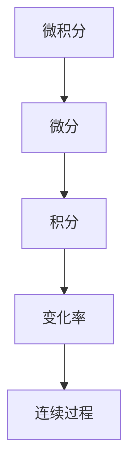

**核心算法原理讲解：**

```plaintext
# 微分伪代码

function derivative(function, x) {
  h = smallValue
  f_prime = (function(x + h) - function(x)) / h
  return f_prime
}
```

#### 概率论和统计学

概率论和统计学是研究不确定性和随机现象的数学分支。在自然界中，概率论和统计学被用来预测和解释随机事件，如自然灾害、疾病传播等。

**核心概念与联系：**

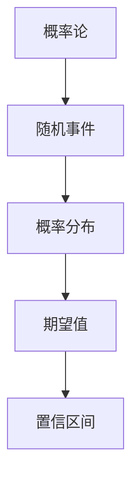

**核心算法原理讲解：**

```plaintext
# 概率分布伪代码

function probabilityDistribution(event, probability) {
  if (event == "success") {
    probability_of_success = probability
  } else if (event == "failure") {
    probability_of_success = 1 - probability
  }
  return probability_of_success
}
```

### 数学模型的应用

数学模型是数学在自然界中应用的桥梁，通过建立数学模型，我们可以将复杂的自然现象转化为可计算的数学问题。以下是一些常见的数学模型及其应用领域。

#### 生物学中的数学模型

在生物学中，数学模型被用来研究物种的进化、生态平衡、种群动态等。例如，Lotka-Volterra模型描述了捕食者和猎物种群之间的相互作用。

**核心概念与联系：**

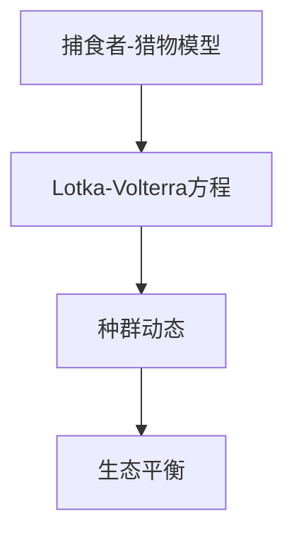

**核心算法原理讲解：**

```latex
\begin{align*}
\frac{dx}{dt} &= \alpha x - \beta xy, \\
\frac{dy}{dt} &= \delta xy - \gamma y.
\end{align*}
```

#### 物理学中的数学模型

在物理学中，数学模型被用来描述物理现象，如牛顿的运动定律、麦克斯韦方程组等。这些模型为物理学研究提供了精确的预测工具。

**核心概念与联系：**

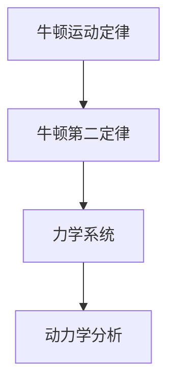

**核心算法原理讲解：**

```latex
F = m \cdot a,
a = \frac{F}{m}.
```

#### 化学中的数学模型

在化学中，数学模型被用来研究化学反应速率、平衡常数等。例如，Arrhenius方程描述了反应速率与温度之间的关系。

**核心概念与联系：**

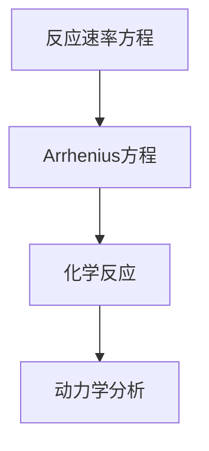

**核心算法原理讲解：**

```latex
k = A \cdot e^{-\frac{E_a}{RT}}.
```

#### 天文学中的数学模型

在天文学中，数学模型被用来研究天体的轨道、星系的形成和演化等。例如，Kepler定律描述了行星绕太阳的轨道运动。

**核心概念与联系：**

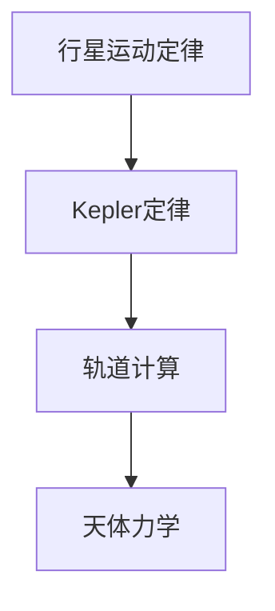

**核心算法原理讲解：**

```latex
\begin{align*}
a^3 &= P^2,
\frac{2\pi}{T} &= \sqrt{\frac{a^3}{\mu}}.
\end{align*}
```

#### 地球科学中的数学模型

在地球科学中，数学模型被用来研究地球的结构、地震预测、气候变化等。例如，地震波传播模型描述了地震波在不同介质中的传播方式。

**核心概念与联系：**

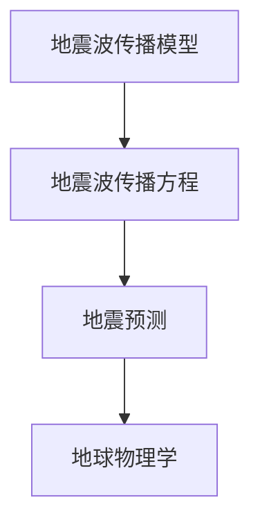

**核心算法原理讲解：**

```latex
\begin{align*}
v &= \sqrt{\frac{K + 4/3 \mu}{\rho}},
c &= \sqrt{\frac{\lambda + 2\mu}{\rho}}.
\end{align*}
```

### 数学与自然界的关系

数学不仅是描述自然界的工具，更是理解自然界的关键。数学与自然界之间的关系可以从多个角度来探讨，包括数学在自然界中的地位、数学对自然界的描述以及数学在自然界研究中的作用。

#### 数学在自然界中的地位

数学在自然界中的地位是不可替代的。数学为自然界中的各种现象提供了精确的描述和解释，使得我们对自然界的认识更加深入和全面。没有数学，许多科学领域的进展将无从谈起。例如，天文学中的开普勒定律、物理学中的牛顿定律、化学中的化学反应方程等，都是数学在自然界中的重要体现。

#### 数学对自然界的描述

数学对自然界的描述具有独特优势。数学语言简洁明了，能够精确地描述自然界中的复杂现象。通过数学模型，我们可以将自然现象转化为可计算的数学问题，从而更好地理解和预测这些现象。例如，通过构建生态系统中的种群模型，我们可以预测物种的进化趋势和生态平衡；通过气象模型，我们可以预测天气变化和气候变化。

#### 数学在自然界研究中的作用

数学在自然界研究中的作用至关重要。数学模型为科学研究提供了定量分析的工具，使得我们能够更准确地理解自然现象。数学方法如统计学、概率论等，可以帮助我们从数据中提取有用的信息，提高科学研究的可信度。此外，数学方法还可以用于优化问题，如资源分配、路径规划等，为实际问题提供解决方案。

### 数学在自然界中的具体应用

数学在自然界中的具体应用涵盖了多个科学领域，包括生物学、物理学、化学、天文学和地球科学等。以下是数学在这些领域的具体应用及其重要性。

#### 数学在生物学中的应用

在生物学中，数学模型被用来研究物种的进化、生态平衡和生态网络等。例如，遗传算法用于模拟物种进化，Lotka-Volterra模型用于描述捕食者和猎物之间的相互作用。这些数学模型帮助我们理解生态系统的复杂动态，为生物多样性的保护和生态恢复提供科学依据。

#### 数学在物理学中的应用

在物理学中，数学模型被用来描述各种物理现象，如力学、电磁学、热力学等。牛顿定律、麦克斯韦方程组、量子力学方程等，都是数学在物理学中的重要应用。这些数学模型为物理学研究提供了精确的描述和预测能力，推动了物理学的快速发展。

#### 数学在化学中的应用

在化学中，数学模型被用来研究化学反应速率、平衡常数、分子结构等。例如，Arrhenius方程用于描述反应速率与温度之间的关系，量子化学模型用于计算分子的电子结构。这些数学模型帮助我们深入理解化学反应的机理，为化学合成和新材料设计提供了重要指导。

#### 数学在天文学中的应用

在天文学中，数学模型被用来描述天体的运动、星系的形成和演化等。例如，Kepler定律用于描述行星绕太阳的轨道运动，黑洞物理学用于研究黑洞的性质和行为。这些数学模型帮助我们理解宇宙的运行规律，为宇宙学的研究提供了重要工具。

#### 数学在地球科学中的应用

在地球科学中，数学模型被用来研究地震、气候变化、地球结构等。例如，地震波传播模型用于预测地震的发生和传播，气候模式用于模拟气候变化。这些数学模型帮助我们更好地理解地球的动态过程，为灾害预防和环境保护提供了科学依据。

### 数学在生物学中的应用

数学在生物学中的应用日益广泛，从遗传学到生态学，从分子生物学到系统生物学，数学模型都在推动生物学研究的发展。以下是数学在生物学中的几个具体应用领域及其重要性。

#### 遗传学

遗传学是研究遗传现象和基因传递的科学。数学在遗传学中的应用主要体现在基因频率的预测和遗传图谱的构建上。通过使用概率论和统计模型，科学家可以分析基因的传递规律，预测遗传病的风险，以及研究物种进化的过程。

**核心算法原理讲解：**

基因频率的预测通常可以通过Hardy-Weinberg平衡方程来实现，这是一个用于描述没有自然选择、迁移、随机交配和没有突变时种群基因频率稳定的方程。

```latex
p^2 + 2pq + q^2 = 1,
p + q = 1,
```

其中，`p` 和 `q` 分别代表两个等位基因的频率，`p^2` 和 `q^2` 分别代表两个纯合子基因型的频率，`2pq` 代表杂合子基因型的频率。

**举例说明：**

假设一个种群中A等位基因的频率是0.6，a等位基因的频率是0.4。我们可以使用Hardy-Weinberg平衡方程预测下一代种群中各基因型的频率。

```plaintext
p = 0.6, q = 0.4
p^2 = (0.6)^2 = 0.36 (AA基因型频率)
2pq = 2 * 0.6 * 0.4 = 0.48 (Aa基因型频率)
q^2 = (0.4)^2 = 0.16 (aa基因型频率)
```

因此，下一代种群中AA基因型的频率是36%，Aa基因型的频率是48%，aa基因型的频率是16%。

#### 生态学

生态学是研究生物与环境相互作用的科学。数学在生态学中的应用主要体现在种群动态、食物网分析、生态系统稳定性等方面。通过构建数学模型，科学家可以预测物种的进化趋势、生态系统的变化规律，以及生物多样性的保护策略。

**核心算法原理讲解：**

Lotka-Volterra模型是一个经典的捕食者-猎物模型，用于描述捕食者和猎物之间的相互作用。该模型通过微分方程描述捕食者和猎物的种群动态。

```latex
\begin{align*}
\frac{dx}{dt} &= \alpha x - \beta xy, \\
\frac{dy}{dt} &= \delta xy - \gamma y.
\end{align*}
```

其中，`x` 和 `y` 分别代表猎物和捕食者的种群数量，`α` 和 `β` 分别代表猎物的增长率和对捕食者的攻击率，`δ` 和 `γ` 分别代表捕食者的增长率和死亡率。

**举例说明：**

假设一个生态系统中，猎物的增长率是每年10%，捕食者的攻击率是每年5%，捕食者的增长率是每年1%，捕食者的死亡率是每年2%。我们可以使用Lotka-Volterra模型预测猎物和捕食者的种群动态。

```plaintext
α = 0.1, β = 0.05, δ = 0.01, γ = 0.02

dx/dt = 0.1x - 0.05xy
dy/dt = 0.01xy - 0.02y
```

通过数值模拟，我们可以得到猎物和捕食者种群随时间的变化情况。

#### 分子生物学

分子生物学是研究生物大分子的结构和功能的科学。数学在分子生物学中的应用主要体现在基因表达分析、蛋白质结构预测、基因组学等方面。通过构建数学模型和算法，科学家可以解析生物大分子的动态行为，揭示基因调控网络和蛋白质相互作用网络。

**核心算法原理讲解：**

基因表达数据分析通常使用线性模型、广义线性模型和贝叶斯模型等方法。例如，线性模型可以用于预测基因表达水平与外界条件之间的关系。

```latex
y = \beta_0 + \beta_1 x_1 + \beta_2 x_2 + ... + \beta_n x_n + \epsilon,
```

其中，`y` 代表基因表达水平，`x_1, x_2, ..., x_n` 代表外界条件，`β_0, β_1, ..., β_n` 是模型参数，`ε` 是误差项。

**举例说明：**

假设我们研究基因表达水平与温度、光照等外界条件的关系。我们可以使用线性模型来预测不同温度和光照条件下基因表达的变化。

```plaintext
y = β0 + β1T + β2L + ε

假设我们得到了以下数据：
T = [25, 30, 35], L = [100, 200, 300], y = [5, 10, 15]

通过最小二乘法，我们可以得到模型参数：
β0 = 1, β1 = 0.5, β2 = 1

预测温度为30℃，光照为200℃时的基因表达水平：
y = 1 + 0.5*30 + 1*200 = 1 + 15 + 200 = 216
```

通过这样的数学模型，我们可以定量分析基因表达的变化，从而深入了解基因调控机制。

### 数学在物理学中的应用

数学在物理学中的应用是研究自然界中物理现象的基础，通过精确的数学描述和计算，物理学家能够理解和预测宇宙中发生的各种现象。以下将详细介绍数学在物理学中的具体应用领域，包括力学、电磁学、热力学、量子力学和相对论等。

#### 力学

力学是研究物体运动和力的科学。在经典力学中，牛顿的运动定律和牛顿的万有引力定律是描述力学现象的基础。数学在力学中的应用主要体现在几何学和微积分上。

**核心算法原理讲解：**

牛顿的第二定律（\(F = ma\)）是力学中的一个基本方程，它描述了力和加速度之间的关系。通过微积分，我们可以进一步推导出物体的运动方程。

```latex
\frac{dv}{dt} = \frac{F}{m},
\int_{t_0}^{t} v \, dt = \int_{t_0}^{t} \frac{F}{m} \, dt.
```

**举例说明：**

假设一个物体质量为5kg，受到一个恒定力10N的作用。我们可以使用牛顿的第二定律来计算物体的加速度。

```plaintext
F = ma
10 = 5a
a = 2 m/s^2

然后，我们可以使用加速度来计算物体在1秒后的速度：
v = at
v = 2 * 1
v = 2 m/s
```

通过这些数学工具，我们可以精确地预测物体的运动状态。

#### 电磁学

电磁学是研究电荷、电流和磁场等现象的科学。麦克斯韦方程组是电磁学的核心，它通过数学方程描述了电磁场的性质和变化。

**核心算法原理讲解：**

麦克斯韦方程组由四个方程组成，分别是：

```latex
\nabla \cdot \mathbf{E} = \frac{\rho}{\varepsilon_0},
\nabla \cdot \mathbf{B} = 0,
\nabla \times \mathbf{E} = -\frac{\partial \mathbf{B}}{\partial t},
\nabla \times \mathbf{B} = \mu_0 \mathbf{J} + \mu_0 \varepsilon_0 \frac{\partial \mathbf{E}}{\partial t}.
```

其中，\(\mathbf{E}\) 是电场，\(\mathbf{B}\) 是磁场，\(\rho\) 是电荷密度，\(\mathbf{J}\) 是电流密度。

**举例说明：**

假设我们有一个长直导线，电流为I，距离导线R处有一个点P。我们可以使用安培定律计算P点的磁场。

```latex
\oint_{C} \mathbf{B} \cdot d\mathbf{l} = \mu_0 I,
B = \frac{\mu_0 I}{2\pi R}.
```

其中，\(C\) 是围绕导线的闭合路径。

#### 热力学

热力学是研究能量转换和物质变化的科学。热力学的基本方程如第一和第二定律，通过数学模型描述了热力学系统的状态变化。

**核心算法原理讲解：**

热力学第一定律（能量守恒定律）：

```latex
\Delta U = Q - W,
```

其中，\(\Delta U\) 是系统内能的变化，\(Q\) 是系统吸收的热量，\(W\) 是系统对外做的功。

热力学第二定律（熵增定律）：

```latex
\frac{dS}{dt} = \frac{Q}{T},
```

其中，\(S\) 是系统的熵，\(T\) 是系统的温度。

**举例说明：**

假设一个理想气体从初始温度 \(T_1\) 加热到最终温度 \(T_2\)，吸收的热量为 \(Q\)。我们可以使用热力学第一定律计算气体的内能变化。

```plaintext
ΔU = Q - W
假设没有对外做功（W = 0），则：
ΔU = Q

使用理想气体方程 \(PV = nRT\)，我们可以计算内能变化：
ΔU = nC_v(T_2 - T_1)

其中，\(C_v\) 是定容比热容，\(n\) 是气体的物质的量。
```

#### 量子力学

量子力学是研究微观粒子和量子现象的科学。量子力学的数学描述主要依赖于波函数和薛定谔方程。

**核心算法原理讲解：**

薛定谔方程是一个二次偏微分方程，描述了量子系统的波函数随时间和空间的变化。

```latex
i\hbar \frac{\partial \psi}{\partial t} = \hat{H} \psi,
```

其中，\(\psi\) 是波函数，\(\hat{H}\) 是哈密顿算子，\(i\) 是虚数单位，\(\hbar\) 是约化普朗克常数。

**举例说明：**

假设一个粒子在无限深势阱中运动，我们可以使用一维薛定谔方程计算其波函数和能级。

```latex
-V_0x \psi(x) = E \psi(x),
\frac{-\hbar^2}{2m} \frac{d^2 \psi(x)}{dx^2} = E \psi(x),
```

通过求解这些方程，我们可以得到粒子的波函数和能级。

#### 相对论

相对论是爱因斯坦提出的一种描述物质和能量在高速运动下的行为的理论。相对论分为狭义相对论和广义相对论，它们都通过数学方程描述了时空的弯曲和能量的变化。

**核心算法原理讲解：**

狭义相对论的基本方程是洛伦兹变换：

```latex
x' = \frac{x - vt}{\sqrt{1 - \frac{v^2}{c^2}}},
t' = \frac{t - \frac{vx}{c^2}}{\sqrt{1 - \frac{v^2}{c^2}}},
```

其中，\(x\) 和 \(t\) 是静止参考系中的位置和时间，\(x'\) 和 \(t'\) 是运动参考系中的位置和时间，\(v\) 是相对速度，\(c\) 是光速。

广义相对论的基本方程是爱因斯坦场方程：

```latex
G_{\mu\nu} + \Lambda g_{\mu\nu} = \frac{8\pi G}{c^4} T_{\mu\nu},
```

其中，\(G_{\mu\nu}\) 是爱因斯坦张量，\(\Lambda\) 是宇宙学常数，\(g_{\mu\nu}\) 是度规张量，\(T_{\mu\nu}\) 是能量-动量张量，\(G\) 是引力常数。

**举例说明：**

假设一个物体以接近光速的速度运动，我们可以使用洛伦兹变换计算其在运动参考系中的时间和空间坐标。

```plaintext
v = 0.9c

使用洛伦兹变换计算时间膨胀：
t' = t / \sqrt{1 - v^2 / c^2}
t' = t / \sqrt{1 - 0.9^2}
t' = t / \sqrt{0.21}
t' ≈ 4.76t

使用洛伦兹变换计算长度收缩：
x' = x / \sqrt{1 - v^2 / c^2}
x' = x / \sqrt{1 - 0.9^2}
x' = x / \sqrt{0.21}
x' ≈ 4.76x
```

通过这些数学模型，我们可以更深入地理解物理现象，为科学研究提供了有力的工具。

### 数学在化学中的应用

数学在化学中的应用是化学科学发展的基石，通过数学模型和计算方法，化学家可以描述和理解复杂的化学反应和分子结构。以下将详细介绍数学在化学中的具体应用领域，包括化学反应动力学、分子轨道理论、量子化学计算等。

#### 化学反应动力学

化学反应动力学研究化学反应的速率和机理，通过数学模型，科学家可以描述反应速率、反应路径和反应机理。常见的动力学模型包括反应级数模型、速率方程模型和过渡状态理论。

**核心算法原理讲解：**

反应级数模型基于质量作用定律，描述了反应速率与反应物浓度之间的关系。速率方程的一般形式为：

```latex
\text{Rate} = k[A]^m[B]^n,
```

其中，`Rate` 表示反应速率，`k` 是反应速率常数，`[A]` 和 `[B]` 分别是反应物 A 和 B 的浓度，`m` 和 `n` 是反应物的反应级数。

**举例说明：**

假设一个反应的速率方程为 \( \text{Rate} = k[A][B]^2 \)，如果 `[A]` 为 0.1 M， `[B]` 为 0.05 M，反应速率常数 `k` 为 2 s^-1 M^-2，我们可以计算该反应的速率。

```plaintext
Rate = k[A][B]^2
Rate = 2 * 0.1 * (0.05)^2
Rate = 2 * 0.1 * 0.0025
Rate = 0.0005 M/s
```

通过这些数学模型，我们可以预测反应速率和优化反应条件。

#### 分子轨道理论

分子轨道理论是描述化学键和分子性质的基础，通过量子力学中的数学模型，化学家可以计算分子的电子结构。常见的数学模型包括Hückel方法和分子轨道理论。

**核心算法原理讲解：**

Hückel方法是一种简化量子力学模型，用于计算分子轨道的能量和形状。Hückel方程的一般形式为：

```latex
\begin{cases}
\left( \begin{array}{cc}
\alpha - \lambda & -\mu \\
-\mu & \alpha - \lambda \end{array} \right) \left( \begin{array}{c}
\varphi_1 \\
\varphi_2 \end{array} \right) = 0, \\
\varphi_1 + \varphi_2 = 0.
\end{cases}
```

其中，`α` 和 `β` 分别是π轨道的能级，`μ` 是π轨道重叠积分。

**举例说明：**

假设我们研究苯分子的电子结构，我们可以使用Hückel方法计算苯分子的π轨道能级和形状。

```plaintext
α - λ = μ^2/2α, β - λ = μ^2/2β

假设α = 4eV，β = 3eV，μ = 1eV，代入方程得到：

α - λ = 1/8eV, β - λ = 1/6eV

由此可以得到苯分子的π轨道能级和形状。
```

通过这些数学模型，我们可以深入了解分子的电子结构，从而预测分子的化学性质。

#### 量子化学计算

量子化学计算是利用量子力学原理计算分子的电子结构和化学性质的方法。常见的量子化学计算方法包括Hartree-Fock方法和密度泛函理论（DFT）。

**核心算法原理讲解：**

Hartree-Fock方法是一种自洽场方法，通过迭代求解Hartree-Fock方程，计算分子的电子结构和能量。Hartree-Fock方程的一般形式为：

```latex
\hat{H}_{\text{HF}} \left| \Psi_{\text{HF}} \right> = E_{\text{HF}} \left| \Psi_{\text{HF}} \right>,
```

其中，`Hartree-Fock` 算子包含了电子动能、电子-电子相互作用和电子-核相互作用。

**举例说明：**

假设我们使用Hartree-Fock方法计算氢分子的电子结构和能量，我们可以通过以下步骤进行计算：

1. **构造初始波函数**：假设氢分子的电子波函数为简谐振子。
2. **计算电子-核相互作用**：计算氢分子的核间距和电子云密度。
3. **迭代求解Hartree-Fock方程**：通过迭代求解Hartree-Fock方程，得到电子密度和能量。
4. **计算分子能量**：将电子-核相互作用能和电子动能相加，得到分子的总能量。

通过这些量子化学计算方法，我们可以精确地描述分子的电子结构和化学性质。

### 数学在天文学中的应用

数学在天文学中的应用是理解宇宙结构和演化的重要工具。天文学家通过建立数学模型，可以描述天体的运动、星系的形成和宇宙的大尺度结构。以下将详细介绍数学在天文学中的具体应用领域，包括天体运动学、星系动力学、宇宙学等。

#### 天体运动学

天体运动学是研究天体在宇宙中的位置和运动轨迹的科学。天体运动学的核心是牛顿的万有引力定律和开普勒定律，这些定律为天体运动提供了精确的数学描述。

**核心算法原理讲解：**

牛顿的万有引力定律描述了两个物体之间的引力作用：

```latex
F = G\frac{m_1m_2}{r^2},
```

其中，`F` 是引力，`G` 是引力常数，`m_1` 和 `m_2` 是两个物体的质量，`r` 是两个物体的距离。

开普勒定律描述了行星围绕太阳的椭圆轨道：

```latex
\frac{r^3}{T^2} = k,
```

其中，`r` 是行星与太阳的距离，`T` 是行星绕太阳一周的时间，`k` 是常数。

**举例说明：**

假设我们要计算一颗行星绕太阳的轨道周期，已知行星与太阳的距离为 \( r = 1.5 \times 10^{11} \) 米，我们可以使用开普勒第三定律来计算轨道周期。

```plaintext
\frac{r^3}{T^2} = k
T^2 = \frac{r^3}{k}
T = \sqrt{\frac{r^3}{k}}

假设 k = 1，代入 r 的值：
T = \sqrt{\frac{(1.5 \times 10^{11})^3}{1}}
T ≈ 1.47 \times 10^6 s
T ≈ 4.14 years

因此，这颗行星绕太阳的轨道周期约为 4.14 年。
```

#### 星系动力学

星系动力学是研究星系内部恒星、星团和黑洞等天体的运动和相互作用。星系动力学依赖于牛顿力学和广义相对论，通过构建数学模型，天文学家可以理解星系的结构和演化。

**核心算法原理讲解：**

星系动力学中常用的模型包括牛顿引力模型和哈勃定律。牛顿引力模型描述了星系内部天体的引力相互作用：

```latex
F = G\frac{m_1m_2}{r^2},
```

哈勃定律描述了宇宙膨胀的速度与距离之间的关系：

```latex
v = H_0d,
```

其中，`v` 是星系的退行速度，`d` 是星系的距离，`H_0` 是哈勃常数。

**举例说明：**

假设我们观测到一个星系的退行速度为 \( v = 3000 \) km/s，已知哈勃常数 \( H_0 = 70 \) km/(s/Mpc)，我们可以使用哈勃定律计算这个星系的距离。

```plaintext
d = v / H_0
d = 3000 km/s / 70 km/(s/Mpc)
d ≈ 42.86 Mpc

因此，这个星系的距离约为 42.86 兆秒差距。
```

#### 宇宙学

宇宙学是研究宇宙的起源、演化和结构的天文学分支。宇宙学依赖于广义相对论和宇宙学模型，通过构建数学模型，宇宙学家可以理解宇宙的大尺度结构和时间演化。

**核心算法原理讲解：**

宇宙学中常用的模型包括大爆炸理论和膨胀宇宙模型。大爆炸理论认为宇宙起源于一个极热、极密的状态，随着时间的推移，宇宙不断膨胀。膨胀宇宙模型基于广义相对论，描述了宇宙的膨胀速度和密度分布。

**举例说明：**

假设我们使用膨胀宇宙模型计算宇宙的年龄，已知宇宙的膨胀速度 \( H_0 = 70 \) km/(s/Mpc) 和宇宙的半径 \( R = 1 \) Gpc，我们可以使用哈勃定律计算宇宙的年龄。

```plaintext
t = R / v
t = 1 Gpc / 70 km/(s/Mpc)
t ≈ 1.4 \times 10^{10} years

因此，宇宙的年龄约为 140 亿年。
```

通过这些数学模型，天文学家可以更深入地理解宇宙的起源和演化。

### 数学在地球科学中的应用

数学在地球科学中的应用是理解和预测地球系统行为的重要工具。地球科学涵盖了地质学、气象学、海洋学、地震学等多个领域，这些领域中的许多研究都依赖于数学模型和计算方法。以下将详细介绍数学在地球科学中的具体应用领域，包括地质学、气象学、海洋学和地震学等。

#### 地质学

地质学是研究地球的组成、结构、历史和演化的科学。数学在地质学中的应用主要体现在地质建模、岩石力学分析和资源评估等方面。

**核心算法原理讲解：**

地质建模是一种通过数学方法描述地质结构和地层的方法。常见的地质建模方法包括基于离散元模型和有限元模型的地质构造模拟。

**举例说明：**

假设我们要建立一个地质构造模型，已知一个地区的断层分布和地层厚度，我们可以使用有限元模型来描述地质结构。

```plaintext
1. 构建有限元网格：将研究区域划分为多个网格单元，每个网格单元包含一个节点和边。
2. 定义材料属性：为每个网格单元定义岩石的物理属性，如弹性模量、泊松比等。
3. 应用边界条件：为模型施加边界条件，如固定某些节点的运动，模拟地质构造。
4. 解有限元方程：使用有限元方法求解平衡方程，得到网格节点的位移和应力分布。

通过这些步骤，我们可以得到地质构造的三维模型，从而预测地质行为。
```

#### 气象学

气象学是研究大气现象的科学，包括温度、湿度、风、降水等。数学在气象学中的应用主要体现在气象模型的构建和天气预报等方面。

**核心算法原理讲解：**

气象模型是一种通过数学方程描述大气状态和变化的模型。常见的气象模型包括一般环流模型和数值天气预报模型。

**举例说明：**

假设我们要构建一个数值天气预报模型，已知大气的初始状态和边界条件，我们可以使用一般环流模型来模拟天气变化。

```plaintext
1. 建立气象方程：使用流体动力学方程和热力学方程描述大气状态和变化。
2. 初始化条件：给定大气的初始温度、湿度、风速等参数。
3. 时间步进：将大气状态分成多个时间步，在每个时间步中更新大气变量。
4. 求解方程：使用数值方法（如有限差分法、有限元法等）求解气象方程。

通过这些步骤，我们可以得到未来的天气预报。
```

#### 海洋学

海洋学是研究海洋的物理、化学和生物特性的科学。数学在海洋学中的应用主要体现在海洋动力学模拟、海洋化学分析和海洋资源评估等方面。

**核心算法原理讲解：**

海洋动力学模拟是一种通过数学方法描述海洋流动和波浪的模型。常见的海洋动力学模型包括基于流体力学方程和波浪动力学方程的模拟。

**举例说明：**

假设我们要模拟海洋波浪的传播，已知波浪的初始条件和海浪参数，我们可以使用波浪动力学模型来模拟波浪的传播。

```plaintext
1. 建立波浪方程：使用流体力学方程和波浪动力学方程描述波浪的传播。
2. 初始化条件：给定波浪的初始高度和波长。
3. 时间步进：将波浪传播过程分成多个时间步，在每个时间步中更新波浪状态。
4. 求解方程：使用数值方法求解波浪方程。

通过这些步骤，我们可以得到波浪传播的模拟结果，从而预测波浪行为。
```

#### 地震学

地震学是研究地震发生、传播和影响的结构力学科学。数学在地震学中的应用主要体现在地震波传播模拟、地震预警和地震灾害评估等方面。

**核心算法原理讲解：**

地震波传播模拟是一种通过数学方法描述地震波传播和地震波形的模型。常见的地震波传播模型包括基于波动方程和地震学原理的模拟。

**举例说明：**

假设我们要模拟地震波的传播，已知地震的震中和震级，我们可以使用波动方程来模拟地震波。

```plaintext
1. 建立波动方程：使用波动方程描述地震波在介质中的传播。
2. 初始化条件：给定地震波的初始震中位置和震级。
3. 时间步进：将地震波传播过程分成多个时间步，在每个时间步中更新波前状态。
4. 求解方程：使用数值方法求解波动方程。

通过这些步骤，我们可以得到地震波传播的模拟结果，从而预测地震的影响范围和强度。
```

通过这些数学模型和计算方法，地球科学家可以更好地理解地球系统的行为，为自然灾害预防和资源管理提供科学依据。

### 总结

在本文中，我们深入探讨了数学在自然界中的应用，展示了数学如何通过精确的模型和算法揭示自然界中的隐藏规律。从天体的运动到生命的演化，从化学反应到气候变化，数学无处不在，为科学研究提供了坚实的理论基础。通过具体实例和数学公式，我们展示了数学在各个科学领域中的具体应用，包括生物学、物理学、化学、天文学和地球科学等。

总结来说，数学在自然界中的地位是不可替代的。它不仅为自然现象提供了精确的描述和解释，还推动了科学的发展。在未来，随着数学工具和计算技术的不断进步，数学在自然界中的应用将更加深入和广泛，帮助我们更好地理解和应对自然界的复杂挑战。

### 展望

在未来的发展中，数学在自然界研究中的角色将继续增强。首先，随着计算能力的提升和大数据技术的进步，数学模型将能够处理更复杂的系统，提供更精确的预测和解释。其次，新的数学理论和方法将不断涌现，如量子计算和机器学习等，为科学研究提供新的工具和视角。

然而，数学在自然界研究中也面临着挑战。例如，如何处理非线性和不确定性问题，如何整合多种数据源，以及如何提高模型的预测精度等。这些问题需要数学家、科学家和工程师的共同努力，通过跨学科合作和创新思维，找到有效的解决方案。

展望未来，数学在自然界研究中的发展趋势将包括以下几个方面：

1. **量子计算与数学建模**：量子计算将改变传统计算模式，为复杂系统建模提供新的工具。量子数学模型和算法将在量子物理、量子化学等领域发挥重要作用。

2. **大数据与机器学习**：大数据和机器学习技术将推动数学模型的发展，通过数据驱动的方法，提高模型预测的准确性和效率。

3. **跨学科整合**：数学与其他学科的深度融合，将促进跨学科研究，如数学与生物学、物理学、环境科学的交叉领域，将诞生新的理论和方法。

4. **可持续发展的数学模型**：随着全球环境问题的加剧，数学模型将在可持续发展研究中发挥关键作用，如气候变化模拟、生态系统建模等。

总之，数学在自然界研究中的未来充满了机遇和挑战。通过不断创新和跨学科合作，数学将继续推动科学研究，为人类理解和应对自然界的复杂性提供强有力的支持。

