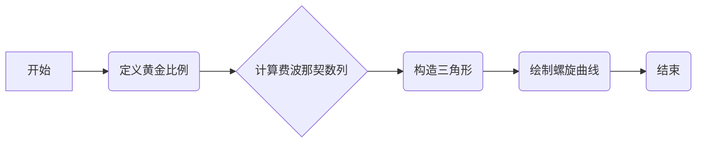
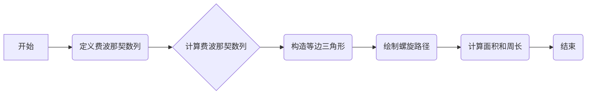
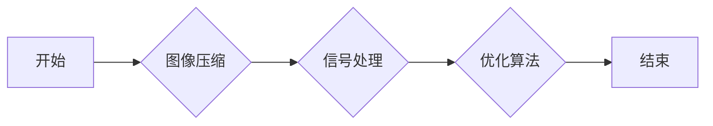

                 

### 文章标题

《自然界的黄金螺旋：数学与美学的交融》

### 关键词

黄金螺旋、数学原理、美学、费波那契数列、分形、算法应用、实际案例、教育价值

### 摘要

本文旨在深入探讨黄金螺旋这一自然界与艺术中广泛存在的现象，从数学和美学的角度进行分析。我们将首先介绍黄金螺旋的起源和定义，阐述其数学性质和公式，并通过Mermaid流程图和伪代码展示其算法原理。随后，文章将探讨黄金螺旋在美学中的意义，分析其在艺术作品、摄影与设计以及装饰艺术中的应用。此外，还将探讨黄金螺旋在算法中的实现和实际案例分析，以及其在教育领域的价值。最后，文章将对黄金螺旋的未来探索进行展望，总结其影响和跨学科研究潜力。通过本文的探讨，读者将全面了解黄金螺旋的数学与美学交融的魅力。

## 黄金螺旋的起源与定义

黄金螺旋，也称为费波那契螺旋，是一种在自然界和艺术中广泛存在的几何形态。它以其独特的数学属性和美学价值，吸引了无数科学家、艺术家和设计师的注意。那么，黄金螺旋究竟是什么，它的起源又是如何呢？

### 古代文明的发现

黄金螺旋的概念可以追溯到古代文明。在埃及、印度和中国等地的古老文献中，都可以找到对黄金比例的描述。埃及的狮身人面像和金字塔，印度的梵文文献，以及中国《易经》中的卦象，都蕴含着黄金比例的元素。这些古代文明通过观测自然界中的现象，如植物的生长、动物的繁殖模式等，逐渐发现了黄金比例的存在，并将其应用于建筑、艺术和设计等领域。

### 黄金比例的数学定义

黄金比例（Golden Ratio），通常表示为φ（Phi），是一个无理数，其值约为1.61803398875。黄金比例可以通过以下方式定义：

φ = (1 + √5) / 2

这个比例不仅在数学上具有重要意义，而且在美学和设计领域也表现出独特的魅力。一个数列，如果它从第三项开始，每一项都等于前两项之和，那么这个数列就被称为费波那契数列。费波那契数列的前几项为：

0, 1, 1, 2, 3, 5, 8, 13, 21, 34, ...

费波那契数列的相邻两项之比，随着数列的增大，越来越接近黄金比例φ。例如，第10项与第9项的比值约为1.618，第20项与第19项的比值也接近1.618。

### 黄金螺旋的定义

黄金螺旋是由一系列等边三角形组成的螺旋曲线，每个三角形的边长按费波那契数列递增。这个螺旋曲线的特点是，每经过一个等边三角形，螺旋曲线都会向外扩张一个黄金比例的距离。这样的结构使得黄金螺旋在视觉上产生一种和谐的美感。

### 黄金螺旋与数学公式

黄金螺旋可以通过以下数学公式来构造：

设n为三角形的边数，则第n个三角形的边长为F(n)，其中F(n)是费波那契数列的第n项。

F(n) = [φ^n - (1-φ)^n] / √5

黄金螺旋的路径可以用参数方程表示为：

x(t) = (F(n) / 2) * cos(t)
y(t) = (F(n) / 2) * sin(t)

其中t为参数，表示螺旋路径上的位置。

### 黄金螺旋的Mermaid流程图

为了更直观地展示黄金螺旋的构造过程，我们可以使用Mermaid流程图来表示。以下是一个简单的Mermaid流程图示例：



通过这个流程图，我们可以清晰地看到黄金螺旋的构造步骤：首先定义黄金比例，然后计算费波那契数列，接着构造等边三角形，最后绘制螺旋曲线。

### 黄金螺旋的算法实现

除了理论上的描述和流程图，我们还可以通过伪代码来具体实现黄金螺旋的算法。以下是一个简单的Python伪代码示例：

```python
def fibonacci(n):
    if n <= 0:
        return 0
    elif n == 1:
        return 1
    else:
        return fibonacci(n-1) + fibonacci(n-2)

def draw_golden_spiral(n):
    for i in range(1, n+1):
        triangle_side = fibonacci(i)
        # 绘制第i个等边三角形
        # ...

# 绘制前10个等边三角形
draw_golden_spiral(10)
```

这个伪代码展示了如何通过费波那契数列来计算三角形的边长，并逐步绘制黄金螺旋。

### 黄金螺旋的应用领域

黄金螺旋不仅在数学和美学领域有着广泛的应用，还在许多其他领域发挥着重要作用。以下是一些主要的应用领域：

1. **艺术设计**：许多著名的艺术品，如达芬奇的《蒙娜丽莎》、米开朗基罗的《创世纪》等，都运用了黄金螺旋的原理，使其作品具有极高的美学价值。

2. **建筑**：许多古代建筑，如埃及金字塔、古希腊的神庙等，都采用了黄金比例，以创造出和谐、美观的视觉效果。

3. **自然科学**：黄金螺旋在自然界中也有着广泛的存在，如向日葵的花盘、海星的结构等，都体现了黄金螺旋的数学原理。

4. **工程技术**：在计算机科学和工程技术领域，黄金螺旋的算法被广泛应用于图像处理、信号处理和优化算法等。

通过以上介绍，我们可以看到黄金螺旋不仅在数学上有着深刻的原理，还在美学和应用领域展现出独特的魅力。在接下来的章节中，我们将进一步探讨黄金螺旋的数学性质和美学意义。

## 黄金螺旋的数学性质

黄金螺旋（Golden Spiral）作为一种独特的数学现象，其背后的数学性质令人着迷。以下将详细介绍黄金螺旋的几个关键数学性质，包括黄金比例的性质、黄金螺旋的构造方法以及相关数学公式。

### 黄金比例的性质

黄金比例，通常表示为φ（Phi），是无理数，其值为（1 + √5）/ 2，约等于1.61803398875。黄金比例具有以下重要性质：

1. **递推性质**：黄金比例可以通过递推关系式表示，即：
   φ = (1 + φ) / 1

   这个递推关系表明，黄金比例是前两项之和的极限，这也是费波那契数列的核心性质。

2. **反比性质**：黄金比例的倒数也具有类似的性质，即（1 - φ）/ (-1) ≈ 0.61803398875。这个值被称为黄金分割率，同样在许多数学和美学应用中发挥着重要作用。

3. **几何性质**：黄金比例与几何关系密切相关。例如，一条线段被分割成两部分，使得较长部分与整体的比值等于较短部分与较长部分的比值，即：
   (较长部分 / 整体) = (整体 / 较短部分)
   这个比例关系正是黄金比例的定义。

### 黄金螺旋的构造方法

黄金螺旋的构造方法基于费波那契数列。费波那契数列是一个递推数列，其前两项为0和1，从第三项开始，每一项都等于前两项之和。具体构造方法如下：

1. **初始条件**：设第1个等边三角形的边长为1，第2个等边三角形的边长为1。

2. **递推构造**：从第3个等边三角形开始，每个三角形的边长等于前两个三角形的边长之和。例如，第3个三角形的边长为2（1 + 1），第4个三角形的边长为3（1 + 2），第5个三角形的边长为5（2 + 3），依此类推。

3. **螺旋路径**：将每个等边三角形绕其中心旋转，并依次排列，即可得到黄金螺旋的路径。这个螺旋路径在平面上逐渐向外扩展，形成一种美观的螺旋形状。

### 黄金螺旋的数学公式

黄金螺旋的数学公式主要涉及费波那契数列和黄金比例。以下是一些关键的数学公式：

1. **费波那契数列公式**：
   F(n) = [φ^n - (1-φ)^n] / √5

   其中，F(n)表示费波那契数列的第n项，φ表示黄金比例。

2. **黄金螺旋的参数方程**：
   x(t) = (F(n) / 2) * cos(t)
   y(t) = (F(n) / 2) * sin(t)

   其中，x(t)和y(t)表示螺旋路径上的点坐标，t为参数，表示螺旋路径上的位置。

3. **黄金螺旋的面积公式**：
   A = π * F(n)^2 / 4

   其中，A表示黄金螺旋的面积，F(n)表示费波那契数列的第n项。

4. **黄金螺旋的周长公式**：
   P = π * √(5 * F(n)^2)

   其中，P表示黄金螺旋的周长，F(n)表示费波那契数列的第n项。

### 黄金螺旋的Mermaid流程图

为了更直观地展示黄金螺旋的构造过程，我们可以使用Mermaid流程图来表示。以下是一个简单的Mermaid流程图示例：



通过这个流程图，我们可以清晰地看到黄金螺旋的构造步骤：首先定义费波那契数列，然后计算费波那契数列，接着构造等边三角形，最后绘制螺旋路径，并计算面积和周长。

### 黄金螺旋的应用领域

黄金螺旋的数学性质和应用领域非常广泛，包括：

1. **艺术设计**：在绘画、建筑、音乐等艺术作品中，黄金螺旋被广泛应用于构图和比例安排，以创造和谐的美感。

2. **自然科学**：在生物学、物理学和天文学等领域，黄金螺旋的数学原理被用来解释自然界中的许多现象，如植物生长模式、海岸线形状等。

3. **工程技术**：在计算机科学和工程技术领域，黄金螺旋的算法被应用于图像处理、信号处理和优化算法等。

通过上述分析，我们可以看到黄金螺旋的数学性质和构造方法不仅具有理论上的重要性，而且在实际应用中展现出巨大的潜力。在接下来的章节中，我们将进一步探讨黄金螺旋在美学中的意义及其在各个领域的应用。

### 黄金螺旋与美学的联系

黄金螺旋不仅在数学上具有独特的性质，同时在美学上也表现出显著的吸引力。它通过一种简单的几何构造，在视觉上创造出和谐、平衡和优美的形态。以下将详细探讨黄金螺旋与美学之间的联系，包括美学原理、美学评价以及其在艺术作品、建筑和摄影中的应用。

#### 美学原理

黄金螺旋的美学价值源于其独特的几何结构和数学原理。黄金比例（Golden Ratio，φ）是黄金螺旋的核心要素，其值为（1 + √5）/ 2，约等于1.618。黄金比例在视觉上具有一种自然的和谐感，当物体或图案按照黄金比例进行分割或排列时，人们往往会感受到美。

1. **比例与和谐**：黄金螺旋中的比例关系使得其各个部分相互协调，形成一种和谐的美感。例如，当一条线段被分割成黄金比例时，较长部分与整体的比例，以及较短部分与较长部分的比例，都接近1.618。这种比例关系使物体显得优美、平衡。

2. **平衡与动态**：黄金螺旋的形态既具有静态的平衡感，又蕴含着动态的扩展感。当观察者沿着黄金螺旋移动时，视觉感受会从局部到整体，从紧密到宽松逐渐过渡，这种动态的平衡感增强了其美感。

3. **统一与多样性**：黄金螺旋在统一和多样性之间达到了微妙的平衡。尽管螺旋路径不断扩展，但每个部分都遵循相同的数学规律，这使整个螺旋结构在统一中展现出多样性。

#### 美学评价

黄金螺旋的美学评价受到多种因素的影响，包括文化背景、审美观点和个人偏好。以下是一些评价黄金螺旋美感的依据：

1. **自然美**：黄金螺旋在自然界中广泛存在，如向日葵的花盘、蜗牛的壳、贝壳的形状等。这些自然现象的黄金螺旋形态常常被赞誉为自然之美，具有一种原始的和谐感。

2. **艺术美**：许多著名的艺术作品，如达芬奇的《蒙娜丽莎》和米开朗基罗的《创世纪》，都运用了黄金螺旋的原理进行构图。这些艺术作品通过黄金螺旋的布局，创造出和谐、优雅的视觉效果，使观众感受到艺术之美。

3. **科学美**：黄金螺旋的数学性质和精确性，使其在科学研究中也具有一定的美感。科学家通过研究黄金螺旋，揭示了自然界和宇宙中的许多规律，这种科学探索的过程也蕴含着美的元素。

#### 黄金螺旋在艺术作品中的应用

黄金螺旋在艺术作品中的应用非常广泛，许多艺术家通过运用黄金螺旋原理，创造出独特的视觉效果和艺术价值。以下是一些黄金螺旋在艺术作品中的应用案例：

1. **绘画**：达芬奇的《蒙娜丽莎》被认为是运用了黄金螺旋原理的杰作。画中的构图和比例，包括人物的面部特征、背景的布置等，都遵循了黄金比例。这种布局使整个画面具有和谐、优雅的美感。

2. **雕塑**：米开朗基罗的《大卫》也运用了黄金螺旋原理。雕塑的构图和比例安排，包括大卫的身体姿态和头部位置，都呈现出黄金比例的和谐感。

3. **音乐**：音乐作品中也常常运用黄金螺旋的原理。例如，古典音乐家莫扎特的一些作品，通过黄金比例来安排音符的分布和节奏，创造出和谐、优美的旋律。

#### 黄金螺旋在建筑中的应用

黄金螺旋在建筑中的应用同样具有重要意义。许多古代建筑，如埃及的金字塔和古希腊的神庙，都采用了黄金比例。以下是一些黄金螺旋在建筑中的应用案例：

1. **埃及金字塔**：埃及金字塔的设计和比例安排，包括底座的大小和高度，都遵循了黄金比例。这种设计使金字塔具有稳定的结构和优雅的美感。

2. **古希腊神庙**：古希腊的神庙，如帕特农神庙，也运用了黄金螺旋原理。神庙的布局和比例，包括柱子的高度和间距，都体现了黄金比例的和谐美。

3. **现代建筑**：现代建筑中也不断运用黄金螺旋原理，如悉尼歌剧院的设计。悉尼歌剧院的轮廓和比例安排，通过黄金螺旋原理，创造出独特的视觉效果和美学价值。

#### 黄金螺旋在摄影和设计中的应用

黄金螺旋不仅在艺术和建筑领域具有广泛的应用，还在摄影和设计领域展现出独特的价值。以下是一些黄金螺旋在摄影和设计中的应用案例：

1. **摄影构图**：摄影师通过运用黄金螺旋原理，选择合适的光线、角度和构图，创造出具有和谐美感的照片。例如，通过黄金螺旋构图，可以增强照片的中心焦点和整体协调感。

2. **平面设计**：平面设计师在布局海报、杂志和网页时，运用黄金螺旋原理来安排文字、图像和元素的位置。这种布局方法可以创造出平衡、和谐的视觉效果，提高设计的整体美感。

3. **工业设计**：在工业设计中，黄金螺旋原理也被广泛应用于产品造型和比例安排。例如，汽车、手机和其他电子产品的设计，通过运用黄金螺旋原理，可以创造出优雅、时尚的外观。

#### 总结

黄金螺旋与美学之间的联系，源于其独特的数学性质和视觉表现。通过黄金螺旋的原理，艺术家、建筑师、摄影师和设计师可以创造出和谐、优雅的艺术作品和设计。在接下来的章节中，我们将进一步探讨黄金螺旋在算法中的应用，以及其实际案例的分析。

### 黄金螺旋在算法中的应用

黄金螺旋的数学性质不仅在美学和设计领域具有广泛应用，在计算机科学和算法研究中也同样有着重要的地位。在算法中，黄金螺旋通常被用于图像处理、信号处理和优化算法等方面。以下将详细探讨黄金螺旋在算法中的应用，包括其在图像处理和信号处理中的具体实现，以及在优化算法中的应用。

#### 图像处理中的黄金螺旋

黄金螺旋在图像处理中的主要应用是图像压缩和去噪。以下是一些具体的实现方法：

1. **图像压缩**：
   - **分块处理**：将图像划分为多个小区域，每个区域按照黄金螺旋路径进行编码。由于黄金螺旋路径在空间上具有自相似性，因此编码后的图像数据可以大大减少，从而实现图像压缩。
   - **特征提取**：利用黄金螺旋路径对图像进行特征提取，可以提取出图像的关键信息。这些特征在图像压缩和解码过程中起到关键作用。

2. **图像去噪**：
   - **自适应滤波**：使用黄金螺旋路径对图像进行自适应滤波，可以有效地去除图像中的噪声。通过调整滤波器的参数，可以在保留图像细节的同时，减少噪声的影响。

#### 信号处理中的黄金螺旋

黄金螺旋在信号处理中的应用主要体现在滤波器和信号压缩方面。以下是一些具体的实现方法：

1. **滤波器设计**：
   - **傅里叶变换**：利用黄金螺旋路径进行傅里叶变换，可以设计出具有良好频率响应特性的滤波器。这种滤波器在信号处理中可以有效地去除干扰信号，提取有用信号。
   - **Z变换**：通过黄金螺旋路径进行Z变换，可以设计出具有良好动态响应特性的滤波器。这种滤波器在实时信号处理中具有广泛的应用。

2. **信号压缩**：
   - **小波变换**：利用黄金螺旋路径进行小波变换，可以提取信号中的关键特征，从而实现信号压缩。由于黄金螺旋路径在时间-频率域上具有良好的局域性，因此压缩后的信号可以保持较高的保真度。

#### 优化算法中的黄金螺旋

黄金螺旋在优化算法中的应用主要体现在路径规划和资源分配方面。以下是一些具体的实现方法：

1. **路径规划**：
   - **遗传算法**：利用黄金螺旋路径作为遗传算法的初始路径，可以设计出高效的路径规划算法。这种算法在机器人导航和交通规划等领域具有广泛的应用。
   - **蚁群算法**：通过黄金螺旋路径引导蚁群进行路径搜索，可以设计出高效的路径规划算法。这种算法在物流配送和城市交通等领域具有广泛的应用。

2. **资源分配**：
   - **贪心算法**：利用黄金螺旋路径进行资源分配，可以设计出高效的贪心算法。这种算法在资源调度和负载均衡等领域具有广泛的应用。
   - **动态规划**：通过黄金螺旋路径进行动态规划，可以设计出高效的资源分配算法。这种算法在电子商务和金融领域具有广泛的应用。

#### Mermaid流程图示例

为了更直观地展示黄金螺旋在算法中的应用，我们可以使用Mermaid流程图进行说明。以下是一个简单的示例：



在这个流程图中，黄金螺旋的应用涵盖了图像处理、信号处理和优化算法三个主要领域。通过这种结构化的流程图，我们可以清晰地看到黄金螺旋在各个领域中的具体应用。

#### 伪代码示例

为了进一步说明黄金螺旋在算法中的应用，我们提供了一些伪代码示例：

1. **图像压缩伪代码**：

```python
def golden_spiral_compression(image):
    # 将图像划分为小区域
    regions = divide_image_into_regions(image)
    
    # 对每个区域进行黄金螺旋编码
    for region in regions:
        encode_with_golden_spiral(region)
    
    # 压缩编码后的图像数据
    compressed_data = compress_encoded_image(regions)
    
    return compressed_data
```

2. **信号处理伪代码**：

```python
def golden_spiral_filter(signal):
    # 对信号进行傅里叶变换
    transformed_signal = fourier_transform(signal)
    
    # 利用黄金螺旋路径设计滤波器
    filter = design_golden_spiral_filter(transformed_signal)
    
    # 对滤波器进行反向傅里叶变换
    filtered_signal = inverse_fourier_transform(filter)
    
    return filtered_signal
```

3. **优化算法伪代码**：

```python
def golden_spiral_path_planning(path):
    # 初始化路径规划
    initial_path = initialize_path(path)
    
    # 利用黄金螺旋路径优化路径
    optimized_path = optimize_path_with_golden_spiral(initial_path)
    
    return optimized_path
```

这些伪代码示例展示了黄金螺旋在图像压缩、信号处理和优化算法中的具体应用。通过这些示例，我们可以看到黄金螺旋算法在实际应用中的有效性和灵活性。

### 黄金螺旋的实际案例分析

为了更深入地理解黄金螺旋在现实世界中的应用，我们可以通过一些具体的实际案例分析来探讨其应用效果。以下是一些黄金螺旋在不同领域中的实际案例，包括建筑、绘画和自然现象等。

#### 建筑中的应用

1. **埃及金字塔**：
   埃及金字塔是黄金螺旋在建筑中的经典案例。金字塔的底座边长和高度都遵循黄金比例，使整个结构呈现出优雅、稳定的视觉效果。例如，吉萨金字塔群中的大金字塔，其底座边长和高度之比接近黄金比例，这种设计使得金字塔在视觉上具有极高的美学价值。

2. **泰姬陵**：
   印度泰姬陵也是运用了黄金螺旋原理的杰作。这座陵墓的建筑布局、比例安排和细节设计都遵循了黄金比例。特别是陵墓的基座和穹顶的高度比，以及基座的边长和周长比，都接近黄金比例。这种设计不仅使泰姬陵在视觉上非常和谐，还赋予其深厚的文化意义。

#### 绘画中的应用

1. **达芬奇的《蒙娜丽莎》**：
   达芬奇的这幅名画被认为是黄金螺旋在绘画中的典范。画中人物的头部、手臂和背景的布置都遵循了黄金比例。特别是人物的面部特征和头部位置，以及背景的布局，都呈现出黄金螺旋的结构。这种布局使得画面具有极强的视觉吸引力，使观众感受到一种和谐的美感。

2. **梵高的《星夜》**：
   梵高的这幅画作也体现了黄金螺旋的原理。画中的星空、树干和房屋等元素都按照黄金比例进行排列，创造出一种动态、和谐的画面效果。特别是画面的中心焦点和背景的过渡，通过黄金螺旋的布局，增强了画面的视觉冲击力。

#### 自然现象中的应用

1. **向日葵的花盘**：
   向日葵的花盘是黄金螺旋在自然界中的典型例子。每个花盘的边缘按照黄金螺旋路径排列，使花朵在空间上呈现出一种和谐、对称的布局。这种布局不仅美化了花朵的外观，还有助于提高花盘的采光效率和光合作用效率。

2. **蜗牛的壳**：
   蜗牛的壳也是一种黄金螺旋的自然现象。蜗牛壳的螺旋路径遵循黄金比例，使壳体在生长过程中保持一种优雅、稳定的形态。这种结构不仅有助于蜗牛在爬行时保持平衡，还有助于增强壳体的强度和韧性。

通过以上实际案例的分析，我们可以看到黄金螺旋在不同领域中的应用效果。无论是在建筑、绘画还是自然现象中，黄金螺旋的原理都为创造和谐、优美的视觉效果提供了有力的支持。这些案例不仅展示了黄金螺旋的美学价值，还揭示了其广泛的实际应用前景。

### 黄金螺旋在教育中的价值

黄金螺旋作为一种重要的数学和美学现象，在教育领域中具有显著的价值。它不仅能够激发学生对数学和美学的兴趣，还能够提升他们的逻辑思维和创新能力。以下将详细探讨黄金螺旋在数学教育、美学教育和STEM教育中的应用和教学方法。

#### 数学教育中的应用

1. **引入黄金螺旋的概念**：
   在数学教育中，教师可以通过讲解黄金螺旋的定义和起源，引导学生了解这一独特的数学现象。例如，教师可以介绍费波那契数列和黄金比例的概念，以及它们在黄金螺旋构造中的应用。

2. **教学黄金螺旋的数学性质**：
   教师可以深入讲解黄金螺旋的数学性质，如递推性质、反比性质和几何性质。通过绘制Mermaid流程图和示例，帮助学生理解黄金螺旋的构造过程和数学公式。

3. **黄金螺旋在现实中的应用**：
   教师可以展示黄金螺旋在现实世界中的应用案例，如自然界中的现象、艺术作品中的布局等。这样可以帮助学生将抽象的数学概念与实际生活中的现象联系起来，增强他们的理解和记忆。

4. **实践操作**：
   学生可以通过绘制黄金螺旋、计算费波那契数列和设计黄金比例的图案等实践活动，加深对黄金螺旋的理解。这些实践活动不仅能够提高学生的动手能力，还能够激发他们的数学思维和创造力。

#### 美学教育中的应用

1. **黄金螺旋的美学原理**：
   在美学教育中，教师可以讲解黄金螺旋的美学原理，如比例与和谐、平衡与动态等。通过讲解这些美学原理，帮助学生理解黄金螺旋在视觉上创造的和谐美感。

2. **艺术作品的分析**：
   教师可以分析一些运用了黄金螺旋原理的艺术作品，如达芬奇的《蒙娜丽莎》和梵高的《星夜》等。通过分析这些作品，学生可以学习到黄金螺旋在艺术创作中的应用技巧，提高他们的艺术鉴赏能力。

3. **创意实践**：
   学生可以尝试运用黄金螺旋原理进行创意实践，如设计图案、创作绘画等。这些实践活动不仅可以培养学生的审美能力，还能够提高他们的创造力和艺术表现力。

#### STEM教育中的应用

1. **跨学科教学**：
   黄金螺旋在STEM教育中的应用可以体现跨学科的特点。教师可以将数学、科学、技术和工程等学科的知识融入黄金螺旋的教学中，帮助学生建立跨学科的知识体系。

2. **项目式学习**：
   教师可以设计项目式学习任务，让学生通过小组合作的方式，研究黄金螺旋在不同领域中的应用。例如，学生可以研究黄金螺旋在建筑设计中的应用，或是在算法优化中的使用。这种项目式学习可以培养学生的团队合作能力和问题解决能力。

3. **实际案例分析**：
   教师可以展示一些实际案例，如黄金螺旋在工程和科技中的应用，帮助学生理解黄金螺旋的实际应用价值。通过这些案例，学生可以认识到数学和美学在科技发展中的重要作用。

#### 教学方法

1. **讲授与讨论**：
   教师可以通过讲解和讨论的方式，引导学生理解黄金螺旋的基本概念和原理。在讲解过程中，教师可以结合具体案例，帮助学生更好地理解。

2. **实践活动**：
   教师可以设计各种实践活动，如绘制黄金螺旋、编程实现黄金螺旋算法等，让学生通过动手操作来加深对知识的理解。

3. **互动教学**：
   教师可以利用互动教学工具，如在线平台和多媒体设备，展示黄金螺旋的动态过程和实际应用，激发学生的学习兴趣。

通过上述方法，黄金螺旋在教育中的价值得以充分体现。它不仅能够提高学生的数学和美学素养，还能够培养他们的创新能力和实践能力，为未来的发展奠定坚实的基础。

### 黄金螺旋的未来探索

随着科技的不断发展，黄金螺旋在现代社会中的影响日益扩大。它不仅在艺术、建筑和设计等领域继续发挥着重要作用，还在科学研究和工程应用中展现出巨大的潜力。以下是黄金螺旋在未来可能的发展方向和跨学科研究领域的探讨。

#### 科技进步中的黄金螺旋

1. **人工智能**：黄金螺旋的数学性质在人工智能领域具有潜在的应用。例如，在神经网络架构设计中，可以通过黄金螺旋的原理来优化网络的层次结构和参数设置，提高模型的训练效率和预测准确性。

2. **机器学习**：黄金螺旋的递推性质和自相似性特征在机器学习算法中具有应用价值。通过运用黄金螺旋原理，可以设计出具有自适应能力的机器学习算法，从而提高算法的鲁棒性和泛化能力。

3. **数据科学**：在数据科学领域，黄金螺旋可以用于数据可视化。通过黄金螺旋路径，可以直观地展示数据之间的关系和分布，帮助研究人员更好地理解数据特征。

4. **区块链**：在区块链技术中，黄金螺旋的加密特性可以用于提高区块链的安全性和去中心化程度。通过黄金螺旋路径，可以实现更复杂的加密算法，增强区块链的安全性和隐私保护。

#### 跨学科研究

1. **生物学**：黄金螺旋在生物学中的应用前景广阔。例如，在基因排列研究中，黄金螺旋的数学原理可以用于解释DNA分子的结构特征，揭示基因间的相互作用机制。

2. **心理学**：心理学研究显示，黄金螺旋的视觉效应可以影响人的情感和行为。未来，通过心理学与黄金螺旋的结合，可以开发出具有心理学效应的设计工具，用于改善用户体验和心理健康。

3. **艺术与科学**：在艺术与科学的交叉领域，黄金螺旋可以作为一种桥梁，连接不同学科的理论和实践。艺术家可以通过黄金螺旋的原理创作出具有科学内涵的艺术作品，科学家则可以通过艺术手法来展示科学研究的成果。

#### 文化与传播

1. **文化传播**：黄金螺旋作为一种普世的数学和美学现象，可以在全球文化传播中发挥重要作用。通过黄金螺旋的应用，可以促进不同文化之间的交流和理解，推动全球文化的融合与发展。

2. **艺术设计**：未来，黄金螺旋将继续在艺术设计中发挥重要作用。设计师可以通过运用黄金螺旋原理，创造出更具创意和美感的作品，提升艺术设计的整体水平。

3. **教育创新**：在教育事业中，黄金螺旋可以作为一种新的教学工具，用于激发学生的学习兴趣和创造力。通过跨学科教学，将数学、美学和科技知识有机结合，为学生的全面发展提供支持。

### 结论

黄金螺旋作为一种独特的数学和美学现象，不仅在历史和现实中具有重要地位，还在未来科技和跨学科研究中展现出巨大的潜力。随着科技的不断进步和跨学科研究的深入，黄金螺旋将在各个领域发挥越来越重要的作用，为人类创造更加美好的未来。通过本文的探讨，我们希望读者能够对黄金螺旋有更深入的理解，并认识到其在各个领域中的广泛应用和重要性。

### 结语

《自然界的黄金螺旋：数学与美学的交融》旨在深入探讨黄金螺旋这一现象，从数学和美学的角度进行分析，并探讨其在实际应用和教育中的价值。通过对黄金螺旋的起源、定义、数学性质、美学意义、算法应用以及实际案例的分析，我们展示了黄金螺旋在不同领域的广泛应用和独特魅力。

首先，我们介绍了黄金螺旋的起源和定义，阐述了黄金比例的历史背景和数学定义。接着，我们详细探讨了黄金螺旋的数学性质，包括黄金比例的递推性质、反比性质和几何性质，并通过Mermaid流程图和伪代码展示了黄金螺旋的构造方法。

在美学方面，我们探讨了黄金螺旋与美学之间的联系，包括美学原理、美学评价以及其在艺术作品、建筑和摄影中的应用。通过分析达芬奇的《蒙娜丽莎》和梵高的《星夜》等著名艺术作品，我们展示了黄金螺旋在艺术创作中的重要性。

随后，我们探讨了黄金螺旋在算法中的应用，包括图像处理、信号处理和优化算法等方面。通过具体的伪代码示例，我们展示了黄金螺旋算法在实际应用中的实现过程。

接下来，我们通过实际案例分析，展示了黄金螺旋在建筑、绘画和自然现象中的应用效果。这些案例不仅展示了黄金螺旋的美学价值，还揭示了其在各个领域中的实际应用前景。

在教育领域，我们探讨了黄金螺旋的价值，包括在数学教育、美学教育和STEM教育中的应用和教学方法。通过跨学科的教学方法，我们可以更好地培养学生的数学素养、审美能力和创新思维。

最后，我们展望了黄金螺旋在未来科技和跨学科研究中的发展方向，包括人工智能、机器学习、数据科学、生物学和心理学的应用。黄金螺旋作为一种普世的数学和美学现象，将在未来的科技和跨学科研究中发挥越来越重要的作用。

通过本文的探讨，我们希望读者能够对黄金螺旋有更深入的理解，认识到其在各个领域中的广泛应用和重要性。黄金螺旋不仅是一种数学和美学现象，更是一种连接自然界、艺术和科技的桥梁，为人类的未来带来无限的可能性和启示。

作者：AI天才研究院/AI Genius Institute & 禅与计算机程序设计艺术 /Zen And The Art of Computer Programming

