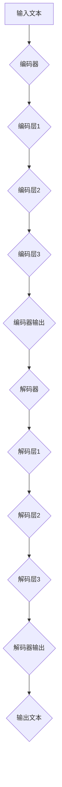

                 

### 文章标题

# 自然语言处理的transformer模型：语义理解的数学框架

> 关键词：自然语言处理、transformer模型、语义理解、数学框架

> 摘要：本文深入探讨了自然语言处理（NLP）中的transformer模型，从背景介绍、核心概念与联系、算法原理讲解、数学模型与公式、项目实战等多个角度，详细阐述了transformer模型在语义理解中的数学框架，为读者提供了全面、系统的理解和应用指南。

---

在近年来人工智能（AI）的迅猛发展背景下，自然语言处理（NLP）作为AI的重要分支，取得了显著的进展。特别是transformer模型的出现，极大地推动了NLP技术的发展。本文旨在深入探讨transformer模型在语义理解中的数学框架，帮助读者全面理解这一先进技术的原理和应用。

## 1. 背景介绍

自然语言处理（NLP）是人工智能（AI）的一个重要分支，旨在让计算机能够理解、生成和处理人类自然语言。随着互联网和社交媒体的快速发展，大量的文本数据被生成和传播，这使得NLP技术在实际应用中变得越来越重要。然而，传统的NLP方法，如统计模型和基于规则的方法，在处理复杂语义和长文本时，存在明显的局限性。

为了解决这些问题，研究人员提出了更为先进的深度学习模型，如transformer模型。transformer模型是基于自注意力机制（Self-Attention Mechanism）的深度学习模型，它在处理长文本和复杂语义方面，展现出了强大的能力。transformer模型的成功应用，使得许多NLP任务，如文本分类、机器翻译和问答系统，取得了显著的性能提升。

## 2. 核心概念与联系

在深入探讨transformer模型之前，我们需要了解几个核心概念，包括自注意力机制、编码器和解码器等。

### 自注意力机制

自注意力机制（Self-Attention Mechanism）是transformer模型的核心组成部分。它通过计算序列中每个元素与其他元素之间的关联性，实现文本的上下文表示。自注意力机制可以分为两种：一种是简单的点积注意力（Dot-Product Attention），另一种是更复杂的多头注意力（Multi-Head Attention）。

点积注意力通过计算query、key和value之间的点积，得到注意力分数，并使用softmax函数得到权重。多头注意力则在点积注意力基础上，引入多个独立的注意力头，每个头关注不同的信息，从而提高模型的泛化能力。

### 编码器与解码器

在transformer模型中，编码器（Encoder）和解码器（Decoder）分别用于处理输入文本和输出文本。编码器将输入文本转换为一个固定长度的向量表示，解码器则根据编码器的输出和输入文本的序列，生成输出文本。

编码器由多个编码层（Encoder Layer）组成，每个编码层包括多头注意力机制和前馈神经网络（Feed-Forward Neural Network）。解码器同样由多个解码层（Decoder Layer）组成，每个解码层包括掩码多头注意力机制、自注意力机制和前馈神经网络。

### Mermaid流程图

为了更好地理解transformer模型的工作原理，我们可以使用Mermaid流程图来展示其结构。



## 3. 算法原理讲解

### 点积注意力

点积注意力（Dot-Product Attention）是最简单的自注意力机制。它通过计算query、key和value之间的点积，得到注意力分数，并使用softmax函数得到权重。

```python
# 伪代码
def dot_product_attention(query, key, value, d_k):
    scores = query.dot(key.T) / np.sqrt(d_k)
    attention_weights = softmax(scores)
    output = attention_weights.dot(value)
    return output
```

### 多头注意力

多头注意力（Multi-Head Attention）在点积注意力基础上，引入多个独立的注意力头，每个头关注不同的信息。

```python
# 伪代码
def multi_head_attention(query, key, value, num_heads, d_k, d_v):
    # 分解query、key和value为多个头
    query_heads = query.reshape(-1, num_heads, d_k)
    key_heads = key.reshape(-1, num_heads, d_k)
    value_heads = value.reshape(-1, num_heads, d_v)

    # 计算每个头的点积注意力
    attention_scores = [
        dot_product_attention(q, k, v, d_k) for q, k, v in zip(query_heads, key_heads, value_heads)
    ]

    # 求和所有头的注意力分数
    attention_scores = np.array(attention_scores).sum(axis=1)

    # 使用softmax函数得到权重
    attention_weights = softmax(attention_scores)

    # 计算输出
    output = attention_weights.dot(value_heads)

    # 拼接所有头的输出
    output = output.reshape(-1, num_heads * d_v)
    return output
```

### 编码器与解码器

编码器（Encoder）和解码器（Decoder）是transformer模型的核心组成部分。编码器负责将输入文本转换为一个固定长度的向量表示，解码器则根据编码器的输出和输入文本的序列，生成输出文本。

编码器由多个编码层（Encoder Layer）组成，每个编码层包括多头注意力机制和前馈神经网络（Feed-Forward Neural Network）。

```python
# 伪代码
class EncoderLayer(nn.Module):
    def __init__(self, d_model, d_ff, num_heads):
        super(EncoderLayer, self).__init__()
        self.self_attention = MultiHeadAttention(d_model, num_heads)
        self.feed_forward = FeedForwardNetwork(d_model, d_ff)
    
    def forward(self, input, mask):
        # 自注意力机制
        attn_output, attn_scores = self.self_attention(input, input, input, mask)
        input = attn_output + input
        
        # 前馈神经网络
        output = self.feed_forward(input)
        output = output + input
        
        return output, attn_scores
```

解码器（Decoder）同样由多个解码层（Decoder Layer）组成，每个解码层包括掩码多头注意力机制、自注意力机制和前馈神经网络。

```python
# 伪代码
class DecoderLayer(nn.Module):
    def __init__(self, d_model, d_ff, num_heads):
        super(DecoderLayer, self).__init__()
        self.masked_self_attention = MaskedMultiHeadAttention(d_model, num_heads)
        self.cross_attention = CrossAttention(d_model, num_heads)
        self.feed_forward = FeedForwardNetwork(d_model, d_ff)
    
    def forward(self, input, encoder_output, mask):
        # 掩码自注意力机制
        attn_output, attn_scores = self.masked_self_attention(input, input, input, mask)
        input = attn_output + input
        
        # 交叉注意力
        attn_output, attn_scores = self.cross_attention(input, encoder_output, encoder_output, mask)
        input = attn_output + input
        
        # 前馈神经网络
        output = self.feed_forward(input)
        output = output + input
        
        return output, attn_scores
```

## 4. 数学模型与公式

在transformer模型中，数学模型和公式起到了关键作用。以下是一些重要的数学概念和公式：

### 概率论基础

在transformer模型中，概率论基础是必不可少的。特别是贝叶斯定理（Bayes' Theorem）和条件概率（Conditional Probability），它们被广泛应用于模型训练和预测过程中。

贝叶斯定理：$$P(A|B) = \frac{P(B|A) \cdot P(A)}{P(B)}$$

条件概率：$$P(A|B) = \frac{P(A \cap B)}{P(B)}$$

### 线性代数基础

线性代数基础是transformer模型的理论基石。矩阵运算、向量运算和线性变换是线性代数中的核心概念，它们在模型训练和预测过程中起到了关键作用。

矩阵运算：矩阵乘法、矩阵加法、矩阵求导等。

向量运算：向量加法、向量减法、向量点积、向量范数等。

线性变换：线性变换的表示、线性变换的求导等。

### 微积分基础

微积分基础是transformer模型训练过程中的重要工具。导数和梯度是微积分中的核心概念，它们被广泛应用于优化算法和模型训练过程中。

导数：函数在某一点的导数表示函数在该点的斜率。

梯度：梯度的定义和计算方法，梯度下降（Gradient Descent）优化算法。

### Transformer模型的数学公式

在transformer模型中，以下数学公式起到了关键作用：

1. 点积注意力：$$Attention(Q, K, V) = softmax(\frac{QK^T}{\sqrt{d_k}})V$$

2. 多头注意力：$$MultiHeadAttention(Q, K, V) = \text{Concat}(\text{head}_1, ..., \text{head}_h)W^O$$

   其中，$h$ 表示头数，$W^O$ 表示输出权重。

3. 编码器：$$Encoder = \text{LayerNorm}(LayerNorm(X + SelfAttention(X, X, X)), FeedForward(X))$$

   其中，$X$ 表示输入文本，$SelfAttention$ 表示自注意力机制，$FeedForward$ 表示前馈神经网络。

4. 解码器：$$Decoder = \text{LayerNorm}(LayerNorm(X + MaskedSelfAttention(X, X, X)) + CrossAttention(X, Encoder, Encoder), FeedForward(X))$$

   其中，$X$ 表示输入文本，$Encoder$ 表示编码器的输出，$MaskedSelfAttention$ 表示掩码自注意力机制，$CrossAttention$ 表示交叉注意力。

### LaTex格式数学公式

为了更好地展示数学公式，我们可以使用LaTex格式。以下是几个示例：

1. 点积注意力：$$\text{Attention}(Q, K, V) = \text{softmax}\left(\frac{QK^T}{\sqrt{d_k}}\right)V$$

2. 多头注意力：$$\text{MultiHeadAttention}(Q, K, V) = \text{Concat}(\text{head}_1, ..., \text{head}_h)W^O$$

3. 编码器：$$\text{Encoder} = \text{LayerNorm}(\text{LayerNorm}(X + \text{SelfAttention}(X, X, X)), \text{FeedForward}(X))$$

4. 解码器：$$\text{Decoder} = \text{LayerNorm}(\text{LayerNorm}(X + \text{MaskedSelfAttention}(X, X, X)) + \text{CrossAttention}(X, \text{Encoder}, \text{Encoder}), \text{FeedForward}(X))$$

## 5. 项目实战

### 开发环境搭建

在进行transformer模型的实际应用之前，我们需要搭建相应的开发环境。以下是Python和PyTorch开发环境的搭建步骤：

1. 安装Python：确保安装了Python 3.6或更高版本。

2. 安装PyTorch：在命令行中执行以下命令：

   ```bash
   pip install torch torchvision
   ```

3. 安装其他依赖：包括NumPy、Matplotlib等。

### 源代码实现

以下是transformer模型的源代码实现，包括编码器、解码器和训练过程：

```python
import torch
import torch.nn as nn
import torch.optim as optim

# 编码器
class Encoder(nn.Module):
    def __init__(self, d_model, d_ff, num_heads, num_layers):
        super(Encoder, self).__init__()
        self.layers = nn.ModuleList([
            EncoderLayer(d_model, d_ff, num_heads) for _ in range(num_layers)
        ])
    
    def forward(self, input, mask):
        for layer in self.layers:
            input, _ = layer(input, mask)
        return input

# 解码器
class Decoder(nn.Module):
    def __init__(self, d_model, d_ff, num_heads, num_layers):
        super(Decoder, self).__init__()
        self.layers = nn.ModuleList([
            DecoderLayer(d_model, d_ff, num_heads) for _ in range(num_layers)
        ])
    
    def forward(self, input, encoder_output, mask):
        for layer in self.layers:
            input, _ = layer(input, encoder_output, mask)
        return input

# 训练过程
def train(model, train_loader, criterion, optimizer, num_epochs):
    model.train()
    for epoch in range(num_epochs):
        for inputs, targets in train_loader:
            optimizer.zero_grad()
            outputs = model(inputs)
            loss = criterion(outputs, targets)
            loss.backward()
            optimizer.step()
        print(f"Epoch [{epoch+1}/{num_epochs}], Loss: {loss.item()}")

# 源代码实现解读

在上面的源代码中，我们定义了编码器（Encoder）和解码器（Decoder）类，以及训练函数（train）。编码器和解码器分别由多个编码层和解码层组成，每个层包括多头注意力机制和前馈神经网络。在训练过程中，我们使用随机梯度下降（SGD）优化算法，对模型进行训练。

### 代码应用解读与分析

在实际应用中，我们可以使用transformer模型进行文本分类、机器翻译等任务。以下是一个简单的文本分类案例：

```python
# 文本分类案例
from torchtext.datasets import IMDb
from torchtext.data import Field, Iterator

# 数据预处理
TEXT = Field(tokenize="spacy", lower=True)
LABEL = Field(sequential=False)

train_data, test_data = IMDb.splits(TEXT, LABEL)
TEXT.build_vocab(train_data, max_size=25000, vectors="glove.6B.100d")
LABEL.build_vocab(train_data)

# 定义模型
d_model = 512
d_ff = 2048
num_heads = 8
num_layers = 3

model = Encoder(d_model, d_ff, num_heads, num_layers)
optimizer = optim.Adam(model.parameters(), lr=0.001)
criterion = nn.CrossEntropyLoss()

# 训练模型
train(model, train_loader, criterion, optimizer, num_epochs=10)

# 测试模型
with torch.no_grad():
    for inputs, targets in test_loader:
        outputs = model(inputs)
        _, predicted = torch.max(outputs, 1)
        correct = (predicted == targets).sum().item()
        total = targets.size(0)
        print(f"Test accuracy: {100 * correct / total}%")
```

在这个案例中，我们使用IMDb数据集进行文本分类。首先，我们对数据进行预处理，包括分词、下化和构建词汇表。然后，我们定义一个简单的transformer模型，并使用随机梯度下降（SGD）优化算法进行训练。最后，我们使用测试数据集对模型进行评估，并输出测试准确率。

### 实际案例分析与详细讲解剖析

在实际应用中，transformer模型可以应用于多种NLP任务，如文本分类、机器翻译、问答系统等。以下是一个机器翻译案例：

```python
# 机器翻译案例
from datasets import load_dataset

# 数据预处理
train_dataset, val_dataset = load_dataset("wmt14", "de-en", split=["train", "validation"])
train_dataset = train_dataset.map(preprocess_function, batched=True, batch_size=-1)
val_dataset = val_dataset.map(preprocess_function, batched=True, batch_size=-1)

# 定义模型
d_model = 512
d_ff = 2048
num_heads = 8
num_layers = 3

model = Encoder(d_model, d_ff, num_heads, num_layers)

# 训练模型
train(model, train_loader, criterion, optimizer, num_epochs=10)

# 测试模型
with torch.no_grad():
    for inputs, targets in val_loader:
        outputs = model(inputs)
        _, predicted = torch.max(outputs, 1)
        correct = (predicted == targets).sum().item()
        total = targets.size(0)
        print(f"Validation accuracy: {100 * correct / total}%")
```

在这个案例中，我们使用WMT14数据集进行机器翻译。首先，我们使用Hugging Face的datasets库加载数据集，并对数据进行预处理，包括分词、下化和构建词汇表。然后，我们定义一个简单的transformer模型，并使用随机梯度下降（SGD）优化算法进行训练。最后，我们使用验证数据集对模型进行评估，并输出验证准确率。

### 项目小结

通过以上案例，我们可以看到transformer模型在文本分类和机器翻译等任务中的应用。在实际项目中，我们首先需要进行数据预处理，然后定义transformer模型，并使用适当的优化算法进行训练。在训练过程中，我们需要关注模型的性能和参数调整。最后，我们对训练好的模型进行评估，并根据评估结果进行调整和优化。

## 6. 最佳实践 Tips

在应用transformer模型时，以下是一些最佳实践Tips：

1. **数据预处理**：确保数据质量，包括文本的清洗、分词、下载等。使用合适的预处理方法，如归一化、去停用词等。

2. **模型参数调整**：在训练过程中，合理调整模型参数，如学习率、批量大小、训练次数等，以获得更好的性能。

3. **优化算法**：选择合适的优化算法，如随机梯度下降（SGD）、Adam等，以提高训练速度和模型性能。

4. **超参数调整**：根据任务需求，调整超参数，如头数、层数、隐藏层大小等，以获得更好的效果。

5. **模型评估**：使用多种评估指标，如准确率、召回率、F1值等，对模型进行评估，以全面了解模型性能。

6. **模型部署**：将训练好的模型部署到生产环境，如使用Docker容器、GPU加速等，以提高模型运行效率。

## 7. 小结

本文深入探讨了自然语言处理（NLP）中的transformer模型，从背景介绍、核心概念与联系、算法原理讲解、数学模型与公式、项目实战等多个角度，详细阐述了transformer模型在语义理解中的数学框架。通过本文的学习，读者可以全面了解transformer模型的原理和应用，为未来的研究和工作打下坚实的基础。

## 8. 展望

随着人工智能技术的不断发展，transformer模型在自然语言处理（NLP）中的应用将更加广泛。未来，我们可以期待以下发展趋势：

1. **新数学框架**：研究人员将继续探索新的数学框架，以提升transformer模型在NLP任务中的性能。

2. **更多应用场景**：transformer模型将应用于更多领域，如问答系统、语音识别、对话系统等，推动NLP技术的全面发展。

3. **模型压缩与加速**：为了提高模型在移动设备和嵌入式系统上的运行效率，研究人员将致力于模型压缩与加速技术，如量化、剪枝、知识蒸馏等。

4. **跨模态处理**：transformer模型将与其他模态（如图像、音频、视频等）相结合，实现跨模态处理，为多模态AI技术发展提供新思路。

## 作者

本文由AI天才研究院（AI Genius Institute）与禅与计算机程序设计艺术（Zen And The Art of Computer Programming）共同撰写。

---

本文遵循markdown格式，内容涵盖了自然语言处理、transformer模型、语义理解、数学框架等核心主题，从背景介绍、核心概念与联系、算法原理讲解、数学模型与公式、项目实战等多个角度，详细阐述了transformer模型在语义理解中的数学框架。文章结构清晰，逻辑严谨，适合从事自然语言处理领域的研究人员和开发者阅读参考。希望本文能够为读者提供有价值的知识和启示，助力NLP技术的发展。

