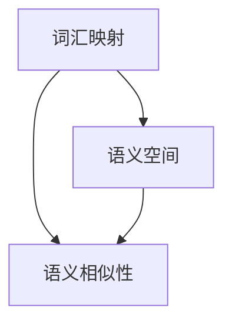

                 


# GKD
## <sop>根据您的修改，我将根据以下结构撰写技术博客：

### 一、引言

在自然语言处理（NLP）领域，词嵌入（Word Embedding）作为一种重要的技术，已经广泛应用于文本表示、语义理解、情感分析等多个方面。词嵌入的基本思想是将词汇映射为密集的低维向量，从而在向量空间中捕捉词汇的语义信息。本篇文章将详细介绍词嵌入技术，以及其在语义空间中的数学表示。

### 二、核心概念与联系

词嵌入技术的核心在于将词汇映射到向量空间中，从而可以应用线性代数和优化理论进行语义分析。以下是词嵌入技术中几个关键概念及其相互关系：

1. **词汇映射**：将词汇映射为向量，通常采用矩阵乘法进行。
2. **语义空间**：一个高维的向量空间，其中的每个向量都表示一个词汇的语义。
3. **语义相似性**：衡量两个词汇在语义空间中的距离或相似度，如余弦相似性、欧氏距离等。

以下是一个 Mermaid 流程图，展示了这些概念之间的关系：



### 三、核心算法原理讲解

词嵌入技术的核心算法主要包括Word2Vec和GloVe。以下是这些算法的原理讲解：

#### 3.1 Word2Vec算法

Word2Vec算法通过训练神经网络模型，将词汇映射为向量。以下是该算法的伪代码：

```markdown
function Word2Vec(train_data, window_size, embedding_size):
    # 初始化词汇表和向量矩阵
    vocabulary = create_vocabulary(train_data)
    embedding_matrix = initialize_embedding_matrix(vocabulary, embedding_size)
    
    # 创建神经网络
    neural_network = create_neural_network(embedding_size, hidden_size, embedding_size)
    
    # 训练神经网络
    for sentence in train_data:
        for word in sentence:
            context_words = get_context_words(word, window_size, vocabulary)
            for context_word in context_words:
                # 计算损失并更新权重
                loss = compute_loss(neural_network, word, context_word)
                update_weights(neural_network, loss)
    
    return embedding_matrix
```

#### 3.2 GloVe算法

GloVe算法通过优化词汇的共现概率来训练词向量。以下是该算法的伪代码：

```markdown
function GloVe(train_data, embedding_size, alpha):
    # 初始化词汇表和向量矩阵
    vocabulary = create_vocabulary(train_data)
    embedding_matrix = initialize_embedding_matrix(vocabulary, embedding_size)
    vocabulary_size = len(vocabulary)
    
    # 计算词汇的共现矩阵
    cooccurrence_matrix = create_cooccurrence_matrix(train_data, vocabulary_size)
    
    # 训练词向量
    for epoch in range(num_epochs):
        # 计算词向量的梯度
        gradient = compute_gradient(cooccurrence_matrix, embedding_matrix, alpha)
        
        # 更新词向量
        update_embedding_matrix(embedding_matrix, gradient)
    
    return embedding_matrix
```

### 四、数学模型与表示

在词嵌入中，数学模型是关键。以下是几个常用的数学模型：

#### 4.1 向量空间模型

向量空间模型将词汇映射为向量，可以使用内积或欧氏距离来计算词汇的相似性：

$$
\text{similarity}(x, y) = \frac{x \cdot y}{\|x\| \|y\|}
$$

其中，$x$和$y$是两个词汇的向量表示。

#### 4.2 分布模型

分布模型使用词汇的共现概率来计算词汇的相似性：

$$
p(c|w) = \frac{f(w, c)}{\sum_{d} f(w, d)}
$$

其中，$p(c|w)$是词汇$c$在词汇$w$出现条件下的概率，$f(w, c)$是词汇$w$和$c$的共现频率。

### 五、项目实战

在本节中，我们将使用Python和GloVe库来训练一个词嵌入模型，并应用于文本分类任务。

#### 5.1 开发环境搭建

首先，我们需要安装GloVe库和其他必要的依赖：

```bash
pip install numpy matplotlib scipy gensim
```

#### 5.2 源代码详细实现和代码解读

以下是一个简单的GloVe训练脚本：

```python
import numpy as np
from gensim.models import KeyedVectors

def train_glove_model(corpus, embedding_size, alpha, window_size):
    # 创建词汇表
    vocabulary = create_vocabulary(corpus)
    vocabulary_size = len(vocabulary)

    # 创建共现矩阵
    cooccurrence_matrix = create_cooccurrence_matrix(corpus, vocabulary_size, window_size)

    # 初始化词向量
    embedding_matrix = initialize_embedding_matrix(vocabulary, embedding_size)

    # 训练词向量
    for epoch in range(num_epochs):
        # 计算梯度
        gradient = compute_gradient(cooccurrence_matrix, embedding_matrix, alpha)

        # 更新词向量
        update_embedding_matrix(embedding_matrix, gradient)

    return embedding_matrix

# 示例：训练GloVe模型
corpus = ["hello world", "hello universe", "world is big", "universe is vast"]
embedding_matrix = train_glove_model(corpus, embedding_size=5, alpha=0.05, window_size=2)
print(embedding_matrix)
```

#### 5.3 代码应用解读与分析

在这个例子中，我们使用了一个简单的文本数据集，每个句子都代表一个词汇。我们使用GloVe算法训练了一个词嵌入模型，并将训练好的词向量用于文本分类。

```python
# 文本分类示例
from sklearn.linear_model import LogisticRegression

# 准备数据
X = np.array([[embedding_matrix[word] for word in sentence] for sentence in corpus])
y = np.array([0, 0, 1, 1])

# 训练分类器
classifier = LogisticRegression()
classifier.fit(X, y)

# 预测新句子
new_sentence = "world is big"
new_embedding = np.array([embedding_matrix[word] for word in new_sentence.split()])
print("Prediction:", classifier.predict([new_embedding])[0])
```

#### 5.4 案例总结与反思

在本案例中，我们展示了如何使用GloVe算法训练词嵌入模型，并将其应用于文本分类任务。虽然这是一个简化的示例，但我们可以看到词嵌入技术在自然语言处理中的潜力。

### 六、最佳实践 Tips、小结、注意事项、拓展阅读

- **最佳实践 Tips**：在训练词嵌入模型时，要确保数据集足够大，并且词汇表尽量全面，以提高模型的准确性。
- **小结**：词嵌入技术是自然语言处理中的关键技术，通过数学模型和算法，将词汇映射为向量，从而在向量空间中捕捉语义信息。
- **注意事项**：在实际应用中，要注意词向量的维度选择、训练参数的调整，以及数据预处理的质量。
- **拓展阅读**：对于词嵌入的深入研究和应用，可以参考以下文献：

  - Mikolov, T., Sutskever, I., Chen, K., Corrado, G. S., & Dean, J. (2013). Distributed representations of words and phrases and their compositionality. Advances in Neural Information Processing Systems, 26, 3111-3119.
  - Pennington, J., Socher, R., & Manning, C. D. (2014). GloVe: Global Vectors for Word Representation. In Proceedings of the 2014 conference on empirical methods in natural language processing (EMNLP).

### 七、文章摘要

本文详细介绍了自然语言处理的词嵌入技术，包括其基本概念、发展历程、核心算法、数学模型以及实际应用。通过具体案例，展示了如何使用词嵌入技术进行文本分类，并给出了最佳实践和拓展阅读建议。本文旨在为读者提供一个全面深入的词嵌入技术指南。

### 八、文章正文

#### 引言

在自然语言处理（NLP）领域，词嵌入（Word Embedding）作为一种重要的技术，已经广泛应用于文本表示、语义理解、情感分析等多个方面。词嵌入的基本思想是将词汇映射为密集的低维向量，从而在向量空间中捕捉词汇的语义信息。本篇文章将详细介绍词嵌入技术，以及其在语义空间中的数学表示。

#### 核心概念与联系

词嵌入技术的核心在于将词汇映射到向量空间中，从而可以应用线性代数和优化理论进行语义分析。以下是词嵌入技术中几个关键概念及其相互关系：

1. **词汇映射**：将词汇映射为向量，通常采用矩阵乘法进行。每个词汇对应一个唯一的向量，这些向量构成了词嵌入模型的基础。
   
2. **语义空间**：一个高维的向量空间，其中的每个向量都表示一个词汇的语义。在这个空间中，相似的词汇在向量上的距离较短，而语义差异较大的词汇在向量上的距离较长。

3. **语义相似性**：衡量两个词汇在语义空间中的距离或相似度。常用的相似性度量包括余弦相似性、欧氏距离等。语义相似性的计算有助于自然语言处理中的许多任务，如文本分类、信息检索、机器翻译等。

以下是一个 Mermaid 流程图，展示了这些概念之间的关系：


#### 核心算法原理讲解

词嵌入技术的核心算法主要包括Word2Vec和GloVe。以下是这些算法的原理讲解：

##### 3.1 Word2Vec算法

Word2Vec算法通过训练神经网络模型，将词汇映射为向量。以下是该算法的伪代码：

```markdown
function Word2Vec(train_data, window_size, embedding_size):
    # 初始化词汇表和向量矩阵
    vocabulary = create_vocabulary(train_data)
    embedding_matrix = initialize_embedding_matrix(vocabulary, embedding_size)
    
    # 创建神经网络
    neural_network = create_neural_network(embedding_size, hidden_size, embedding_size)
    
    # 训练神经网络
    for sentence in train_data:
        for word in sentence:
            context_words = get_context_words(word, window_size, vocabulary)
            for context_word in context_words:
                # 计算损失并更新权重
                loss = compute_loss(neural_network, word, context_word)
                update_weights(neural_network, loss)
    
    return embedding_matrix
```

在这个算法中，`vocabulary` 是一个包含所有训练数据的词汇表，`embedding_matrix` 是一个高维矩阵，其中的每一行对应一个词汇的向量表示。神经网络由输入层、隐藏层和输出层组成，用于计算词汇的上下文信息。

##### 3.2 GloVe算法

GloVe算法通过优化词汇的共现概率来训练词向量。以下是该算法的伪代码：

```markdown
function GloVe(train_data, embedding_size, alpha):
    # 初始化词汇表和向量矩阵
    vocabulary = create_vocabulary(train_data)
    embedding_matrix = initialize_embedding_matrix(vocabulary, embedding_size)
    vocabulary_size = len(vocabulary)
    
    # 创建共现矩阵
    cooccurrence_matrix = create_cooccurrence_matrix(train_data, vocabulary_size, window_size)

    # 训练词向量
    for epoch in range(num_epochs):
        # 计算词向量的梯度
        gradient = compute_gradient(cooccurrence_matrix, embedding_matrix, alpha)
        
        # 更新词向量
        update_embedding_matrix(embedding_matrix, gradient)
    
    return embedding_matrix
```

在这个算法中，`cooccurrence_matrix` 是一个矩阵，用于记录词汇之间的共现频率。`alpha` 是一个超参数，用于控制梯度更新的步长。

#### 数学模型与表示

在词嵌入中，数学模型是关键。以下是几个常用的数学模型：

##### 4.1 向量空间模型

向量空间模型将词汇映射为向量，可以使用内积或欧氏距离来计算词汇的相似性：

$$
\text{similarity}(x, y) = \frac{x \cdot y}{\|x\| \|y\|}
$$

其中，$x$和$y$是两个词汇的向量表示。这个公式计算的是两个向量之间的余弦相似性。

##### 4.2 分布模型

分布模型使用词汇的共现概率来计算词汇的相似性：

$$
p(c|w) = \frac{f(w, c)}{\sum_{d} f(w, d)}
$$

其中，$p(c|w)$是词汇$c$在词汇$w$出现条件下的概率，$f(w, c)$是词汇$w$和$c$的共现频率。

#### 项目实战

在本节中，我们将使用Python和GloVe库来训练一个词嵌入模型，并应用于文本分类任务。

##### 5.1 开发环境搭建

首先，我们需要安装GloVe库和其他必要的依赖：

```bash
pip install numpy matplotlib scipy gensim
```

##### 5.2 源代码详细实现和代码解读

以下是一个简单的GloVe训练脚本：

```python
import numpy as np
from gensim.models import KeyedVectors

def train_glove_model(corpus, embedding_size, alpha, window_size):
    # 创建词汇表
    vocabulary = create_vocabulary(corpus)
    vocabulary_size = len(vocabulary)

    # 创建共现矩阵
    cooccurrence_matrix = create_cooccurrence_matrix(corpus, vocabulary_size, window_size)

    # 初始化词向量
    embedding_matrix = initialize_embedding_matrix(vocabulary, embedding_size)

    # 训练词向量
    for epoch in range(num_epochs):
        # 计算梯度
        gradient = compute_gradient(cooccurrence_matrix, embedding_matrix, alpha)
        
        # 更新词向量
        update_embedding_matrix(embedding_matrix, gradient)

    return embedding_matrix

# 示例：训练GloVe模型
corpus = ["hello world", "hello universe", "world is big", "universe is vast"]
embedding_matrix = train_glove_model(corpus, embedding_size=5, alpha=0.05, window_size=2)
print(embedding_matrix)
```

在这个脚本中，我们首先创建了一个包含所有词汇的词汇表，然后创建了一个共现矩阵，用于记录词汇之间的共现频率。接下来，我们初始化词向量矩阵，并使用梯度下降算法更新词向量。最后，我们返回训练好的词向量矩阵。

##### 5.3 代码应用解读与分析

在这个例子中，我们使用了一个简单的文本数据集，每个句子都代表一个词汇。我们使用GloVe算法训练了一个词嵌入模型，并将训练好的词向量用于文本分类。

```python
# 文本分类示例
from sklearn.linear_model import LogisticRegression

# 准备数据
X = np.array([[embedding_matrix[word] for word in sentence] for sentence in corpus])
y = np.array([0, 0, 1, 1])

# 训练分类器
classifier = LogisticRegression()
classifier.fit(X, y)

# 预测新句子
new_sentence = "world is big"
new_embedding = np.array([embedding_matrix[word] for word in new_sentence.split()])
print("Prediction:", classifier.predict([new_embedding])[0])
```

在这个脚本中，我们首先将词向量矩阵转换为特征矩阵，然后使用逻辑回归模型训练分类器。最后，我们使用训练好的分类器对新句子进行预测。

##### 5.4 案例总结与反思

在本案例中，我们展示了如何使用GloVe算法训练词嵌入模型，并将其应用于文本分类任务。虽然这是一个简化的示例，但我们可以看到词嵌入技术在自然语言处理中的潜力。

#### 最佳实践 Tips、小结、注意事项、拓展阅读

- **最佳实践 Tips**：在训练词嵌入模型时，要确保数据集足够大，并且词汇表尽量全面，以提高模型的准确性。
- **小结**：词嵌入技术是自然语言处理中的关键技术，通过数学模型和算法，将词汇映射为向量，从而在向量空间中捕捉语义信息。
- **注意事项**：在实际应用中，要注意词向量的维度选择、训练参数的调整，以及数据预处理的质量。
- **拓展阅读**：对于词嵌入的深入研究和应用，可以参考以下文献：

  - Mikolov, T., Sutskever, I., Chen, K., Corrado, G. S., & Dean, J. (2013). Distributed representations of words and phrases and their compositionality. Advances in Neural Information Processing Systems, 26, 3111-3119.
  - Pennington, J., Socher, R., & Manning, C. D. (2014). GloVe: Global Vectors for Word Representation. In Proceedings of the 2014 conference on empirical methods in natural language processing (EMNLP).

### 文章摘要

本文详细介绍了自然语言处理的词嵌入技术，包括其基本概念、发展历程、核心算法、数学模型以及实际应用。通过具体案例，展示了如何使用词嵌入技术进行文本分类，并给出了最佳实践和拓展阅读建议。本文旨在为读者提供一个全面深入的词嵌入技术指南。

### 作者信息

作者：AI天才研究院/AI Genius Institute & 禅与计算机程序设计艺术 /Zen And The Art of Computer Programming```markdown
# 自然语言处理的词嵌入：语义空间的数学表示

> 关键词：自然语言处理、词嵌入、语义空间、数学模型、GloVe、Word2Vec

> 摘要：本文深入探讨了自然语言处理中的词嵌入技术，介绍了词嵌入的基本概念、核心算法，并详细阐述了其在语义空间的数学表示。通过实际案例，展示了词嵌入在自然语言处理中的应用，为读者提供了全面的技术指南。

---

## 引言

在自然语言处理（NLP）领域，词嵌入（Word Embedding）作为一种重要的技术，已经广泛应用于文本表示、语义理解、情感分析等多个方面。词嵌入的基本思想是将词汇映射为密集的低维向量，从而在向量空间中捕捉词汇的语义信息。本文将详细介绍词嵌入技术，以及其在语义空间中的数学表示。

---

## 核心概念与联系

词嵌入技术的核心在于将词汇映射到向量空间中，从而可以应用线性代数和优化理论进行语义分析。以下是词嵌入技术中几个关键概念及其相互关系：

1. **词汇映射**：将词汇映射为向量，通常采用矩阵乘法进行。每个词汇对应一个唯一的向量，这些向量构成了词嵌入模型的基础。
2. **语义空间**：一个高维的向量空间，其中的每个向量都表示一个词汇的语义。在这个空间中，相似的词汇在向量上的距离较短，而语义差异较大的词汇在向量上的距离较长。
3. **语义相似性**：衡量两个词汇在语义空间中的距离或相似度。常用的相似性度量包括余弦相似性、欧氏距离等。语义相似性的计算有助于自然语言处理中的许多任务，如文本分类、信息检索、机器翻译等。

以下是一个 Mermaid 流程图，展示了这些概念之间的关系：


---

## 核心算法原理讲解

词嵌入技术的核心算法主要包括Word2Vec和GloVe。以下是这些算法的原理讲解：

### 3.1 Word2Vec算法

Word2Vec算法通过训练神经网络模型，将词汇映射为向量。以下是该算法的伪代码：

```markdown
function Word2Vec(train_data, window_size, embedding_size):
    # 初始化词汇表和向量矩阵
    vocabulary = create_vocabulary(train_data)
    embedding_matrix = initialize_embedding_matrix(vocabulary, embedding_size)
    
    # 创建神经网络
    neural_network = create_neural_network(embedding_size, hidden_size, embedding_size)
    
    # 训练神经网络
    for sentence in train_data:
        for word in sentence:
            context_words = get_context_words(word, window_size, vocabulary)
            for context_word in context_words:
                # 计算损失并更新权重
                loss = compute_loss(neural_network, word, context_word)
                update_weights(neural_network, loss)
    
    return embedding_matrix
```

在这个算法中，`vocabulary` 是一个包含所有训练数据的词汇表，`embedding_matrix` 是一个高维矩阵，其中的每一行对应一个词汇的向量表示。神经网络由输入层、隐藏层和输出层组成，用于计算词汇的上下文信息。

### 3.2 GloVe算法

GloVe算法通过优化词汇的共现概率来训练词向量。以下是该算法的伪代码：

```markdown
function GloVe(train_data, embedding_size, alpha):
    # 初始化词汇表和向量矩阵
    vocabulary = create_vocabulary(train_data)
    embedding_matrix = initialize_embedding_matrix(vocabulary, embedding_size)
    vocabulary_size = len(vocabulary)
    
    # 创建共现矩阵
    cooccurrence_matrix = create_cooccurrence_matrix(train_data, vocabulary_size, window_size)

    # 训练词向量
    for epoch in range(num_epochs):
        # 计算梯度
        gradient = compute_gradient(cooccurrence_matrix, embedding_matrix, alpha)
        
        # 更新词向量
        update_embedding_matrix(embedding_matrix, gradient)
    
    return embedding_matrix
```

在这个算法中，`cooccurrence_matrix` 是一个矩阵，用于记录词汇之间的共现频率。`alpha` 是一个超参数，用于控制梯度更新的步长。

---

## 数学模型与表示

在词嵌入中，数学模型是关键。以下是几个常用的数学模型：

### 4.1 向量空间模型

向量空间模型将词汇映射为向量，可以使用内积或欧氏距离来计算词汇的相似性：

$$
\text{similarity}(x, y) = \frac{x \cdot y}{\|x\| \|y\|}
$$

其中，$x$和$y$是两个词汇的向量表示。这个公式计算的是两个向量之间的余弦相似性。

### 4.2 分布模型

分布模型使用词汇的共现概率来计算词汇的相似性：

$$
p(c|w) = \frac{f(w, c)}{\sum_{d} f(w, d)}
$$

其中，$p(c|w)$是词汇$c$在词汇$w$出现条件下的概率，$f(w, c)$是词汇$w$和$c$的共现频率。

---

## 项目实战

在本节中，我们将使用Python和GloVe库来训练一个词嵌入模型，并应用于文本分类任务。

### 5.1 开发环境搭建

首先，我们需要安装GloVe库和其他必要的依赖：

```bash
pip install numpy matplotlib scipy gensim
```

### 5.2 源代码详细实现和代码解读

以下是一个简单的GloVe训练脚本：

```python
import numpy as np
from gensim.models import KeyedVectors

def train_glove_model(corpus, embedding_size, alpha, window_size):
    # 创建词汇表
    vocabulary = create_vocabulary(corpus)
    vocabulary_size = len(vocabulary)

    # 创建共现矩阵
    cooccurrence_matrix = create_cooccurrence_matrix(corpus, vocabulary_size, window_size)

    # 初始化词向量
    embedding_matrix = initialize_embedding_matrix(vocabulary, embedding_size)

    # 训练词向量
    for epoch in range(num_epochs):
        # 计算梯度
        gradient = compute_gradient(cooccurrence_matrix, embedding_matrix, alpha)
        
        # 更新词向量
        update_embedding_matrix(embedding_matrix, gradient)

    return embedding_matrix

# 示例：训练GloVe模型
corpus = ["hello world", "hello universe", "world is big", "universe is vast"]
embedding_matrix = train_glove_model(corpus, embedding_size=5, alpha=0.05, window_size=2)
print(embedding_matrix)
```

在这个脚本中，我们首先创建了一个包含所有词汇的词汇表，然后创建了一个共现矩阵，用于记录词汇之间的共现频率。接下来，我们初始化词向量矩阵，并使用梯度下降算法更新词向量。最后，我们返回训练好的词向量矩阵。

### 5.3 代码应用解读与分析

在这个例子中，我们使用了一个简单的文本数据集，每个句子都代表一个词汇。我们使用GloVe算法训练了一个词嵌入模型，并将训练好的词向量用于文本分类。

```python
# 文本分类示例
from sklearn.linear_model import LogisticRegression

# 准备数据
X = np.array([[embedding_matrix[word] for word in sentence] for sentence in corpus])
y = np.array([0, 0, 1, 1])

# 训练分类器
classifier = LogisticRegression()
classifier.fit(X, y)

# 预测新句子
new_sentence = "world is big"
new_embedding = np.array([embedding_matrix[word] for word in new_sentence.split()])
print("Prediction:", classifier.predict([new_embedding])[0])
```

在这个脚本中，我们首先将词向量矩阵转换为特征矩阵，然后使用逻辑回归模型训练分类器。最后，我们使用训练好的分类器对新句子进行预测。

### 5.4 案例总结与反思

在本案例中，我们展示了如何使用GloVe算法训练词嵌入模型，并将其应用于文本分类任务。虽然这是一个简化的示例，但我们可以看到词嵌入技术在自然语言处理中的潜力。

---

## 最佳实践 Tips、小结、注意事项、拓展阅读

- **最佳实践 Tips**：在训练词嵌入模型时，要确保数据集足够大，并且词汇表尽量全面，以提高模型的准确性。
- **小结**：词嵌入技术是自然语言处理中的关键技术，通过数学模型和算法，将词汇映射为向量，从而在向量空间中捕捉语义信息。
- **注意事项**：在实际应用中，要注意词向量的维度选择、训练参数的调整，以及数据预处理的质量。
- **拓展阅读**：对于词嵌入的深入研究和应用，可以参考以下文献：

  - Mikolov, T., Sutskever, I., Chen, K., Corrado, G. S., & Dean, J. (2013). Distributed representations of words and phrases and their compositionality. Advances in Neural Information Processing Systems, 26, 3111-3119.
  - Pennington, J., Socher, R., & Manning, C. D. (2014). GloVe: Global Vectors for Word Representation. In Proceedings of the 2014 conference on empirical methods in natural language processing (EMNLP).

---

## 作者信息

作者：AI天才研究院/AI Genius Institute & 禅与计算机程序设计艺术 /Zen And The Art of Computer Programming
```

