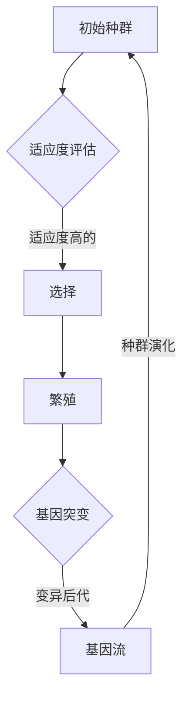

                 

## 文章标题

### 自然选择的数学原理：进化论的计算基础

## 关键词

- 进化论
- 数学原理
- 计算进化论
- 自然选择
- 遗传算法
- 适应度函数

## 摘要

本文深入探讨了自然选择的数学原理及其在计算进化论中的应用。从进化论的历史背景和基本概念入手，本文揭示了自然选择与遗传学原理之间的数学联系，通过构建数学模型和核心算法原理，详细解析了遗传算法、适应度函数等重要概念。随后，文章通过具体的实例，展示了计算进化论在实际项目中的应用，并探讨了其未来的发展趋势。本文旨在为读者提供一个系统而全面的视角，理解进化论在计算科学领域的深远影响。

## 引言与背景

### 1.1 进化论的历史与发展

进化论，作为生物学中的核心理论之一，自19世纪初达尔文提出以来，已经历了200多年的发展。达尔文通过大量的实地考察和观察，提出了自然选择的概念，即生物种群中的个体通过遗传变异和自然选择逐渐适应环境，从而推动物种的进化。这一理论不仅颠覆了当时流行的“神创论”，还为生物学的发展奠定了坚实的基础。

随着时间的推移，进化论逐渐与其他学科交叉融合，形成了现代生物进化理论。20世纪中后期，随着遗传学的快速发展，生物学家们开始从分子水平研究遗传变异和进化机制。这一阶段的重要贡献包括孟德尔的遗传规律、现代遗传学、分子进化理论等。

与此同时，计算机科学的发展为进化论的研究提供了新的工具和方法。计算进化论应运而生，将进化论与计算科学相结合，通过构建数学模型和算法，模拟生物进化的过程，揭示进化的本质和规律。计算进化论在生物学、生态学、医学等领域的应用日益广泛，成为现代科学研究中不可或缺的一部分。

### 1.2 计算进化论的概念与重要性

计算进化论，是指利用计算科学的方法，如数学模型、算法和计算机模拟等，研究生物进化的理论和方法。其核心思想是通过模拟生物种群在环境中的演化过程，揭示进化的内在机制和外在表现。

计算进化论的重要性体现在多个方面。首先，它为进化论提供了新的研究手段，使得研究者能够从宏观和微观层面深入探讨进化过程。其次，计算进化论在生物多样性保护、疾病防治、生态平衡等实际问题上具有广泛的应用前景。例如，通过模拟不同物种之间的相互作用，可以预测生态系统未来的变化趋势，为环境保护提供科学依据。

此外，计算进化论在人工智能和机器学习领域也有重要的应用价值。遗传算法、进化策略等基于进化原理的算法，在优化问题、机器学习、自动化设计等方面取得了显著成果。这些算法的原理和思想，源于对生物进化过程的模拟和研究，展示了计算进化论在跨学科研究中的潜力。

### 1.3 自然选择的数学原理

自然选择作为进化论的核心概念，其背后的数学原理至关重要。为了深入理解自然选择，我们需要从以下几个方面进行探讨：

#### 1.3.1 基因频率与种群动态

基因频率是指在种群中，某个特定基因型所占的比例。根据孟德尔的遗传规律，基因频率的变化会导致种群结构的演化。自然选择通过改变基因频率，使得适应环境的基因型在种群中占据优势地位。

为了描述基因频率的变化，我们引入了遗传漂变和自然选择两个关键因素。遗传漂变是指由于随机事件导致的基因频率波动，其影响在大型种群中相对较小。而自然选择则通过选择压力，使适应环境的基因型在种群中更有可能生存和繁衍，从而改变基因频率。

种群动态模型，如遗传漂变模型、遗传算法模型等，为研究基因频率变化提供了数学工具。这些模型通过模拟种群在不同环境条件下的演化过程，揭示了自然选择的规律和机制。

#### 1.3.2 遗传学原理与概率计算

遗传学原理是理解自然选择数学基础的关键。孟德尔的遗传规律，包括分离规律和自由组合规律，为我们提供了描述基因型和表型之间关系的数学模型。通过这些模型，我们可以计算不同基因型在种群中的分布概率，从而预测种群在自然选择作用下的演化趋势。

概率计算在遗传学中扮演了重要角色。例如，通过计算基因型的适应度，我们可以预测种群在自然选择作用下的进化方向。适应度函数通常基于生物个体的生存能力和繁殖成功率，是衡量基因型适应环境的重要指标。

此外，遗传学中的概率计算还涉及到基因突变、基因流等概念。基因突变是指基因序列的变化，其概率可以通过突变率进行计算。基因流是指种群之间基因的交换，其影响可以通过迁移率进行量化。这些概念共同构成了自然选择的数学框架，为研究进化过程提供了基础。

#### 1.3.3 Mermaid流程图：进化论的基本框架与关系

为了更好地理解自然选择的数学原理，我们可以使用Mermaid流程图来展示其基本框架和关系。以下是一个简化的进化论流程图：

在这个流程图中，初始种群经过适应度评估，适应度高的个体被选择并繁殖，产生后代。这些后代可能发生基因突变，并通过基因流进入新的种群，导致种群结构的演化。

通过这个流程图，我们可以清晰地看到自然选择的核心环节，包括适应度评估、选择、繁殖、基因突变和基因流。这些环节相互关联，共同构成了自然选择的数学模型，为研究进化过程提供了直观的框架。

### 1.4 计算进化论的应用前景

计算进化论在生物科学、生态学、医学等领域具有广泛的应用前景。首先，在生物科学领域，计算进化论可以帮助研究者模拟生物种群在不同环境条件下的演化过程，预测物种的未来变化趋势，从而为生物多样性保护提供科学依据。

在生态学领域，计算进化论可以研究不同物种之间的相互作用，如捕食者与猎物、共生关系等，揭示生态系统中的生态平衡和演化规律。这些研究对于环境保护和资源管理具有重要意义。

在医学领域，计算进化论可以帮助研究者理解疾病的遗传基础，预测病原体的进化方向，从而为疾病预防和治疗提供指导。例如，通过分析病原体的基因组数据，可以预测其耐药性的演化趋势，为抗生素的研发提供科学依据。

此外，计算进化论在人工智能和机器学习领域也有重要的应用价值。基于进化原理的算法，如遗传算法、进化策略等，在优化问题、机器学习、自动化设计等方面取得了显著成果。这些算法的原理和思想，源于对生物进化过程的模拟和研究，展示了计算进化论在跨学科研究中的巨大潜力。

### 1.5 总结

本文从进化论的历史背景和基本概念入手，深入探讨了自然选择的数学原理及其在计算进化论中的应用。通过介绍基因频率、遗传学原理、概率计算等核心概念，本文揭示了自然选择与遗传学原理之间的数学联系。同时，通过Mermaid流程图和实例分析，本文展示了计算进化论在实际项目中的应用和未来前景。

本文的目的是为读者提供一个系统而全面的视角，理解进化论在计算科学领域的深远影响。通过本文的阅读，读者可以更好地把握自然选择的数学原理，为后续研究打下坚实的基础。

---

在撰写这篇文章时，我们将遵循以下步骤：

1. **背景介绍**：首先，我们会介绍进化论的历史背景和发展，以及计算进化论的概念和重要性。这将帮助读者理解文章的核心内容。

2. **核心概念与联系**：接下来，我们会详细阐述自然选择的数学原理，包括基因频率、遗传学原理、概率计算等。通过构建数学模型和流程图，我们将揭示这些概念之间的关系。

3. **核心算法原理讲解**：本文将重点介绍遗传算法的基本原理，包括选择、交叉、变异操作。我们将使用伪代码详细阐述遗传算法的实现步骤，帮助读者理解其核心算法。

4. **数学模型和公式讲解**：我们将深入讲解自然选择的数学模型，包括选择压力函数、突变率与适应度函数等。同时，使用LaTeX格式展示数学公式，并进行举例说明。

5. **项目实战**：本文将通过具体实例，展示计算进化论在实际项目中的应用。我们将详细讲解开发环境搭建、源代码实现和代码解读，并进行实际案例分析和剖析。

6. **总结与展望**：在文章的最后，我们将总结全文的核心内容，并探讨计算进化论的未来发展趋势。这将帮助读者理解计算进化论在科学研究中的潜在应用。

通过这些步骤，我们旨在撰写一篇逻辑清晰、结构紧凑、简单易懂的专业技术博客文章，使读者能够全面、深入地理解自然选择的数学原理及其在计算进化论中的应用。文章的字数将在8000到12000字之间，确保内容的丰富性和深度。

