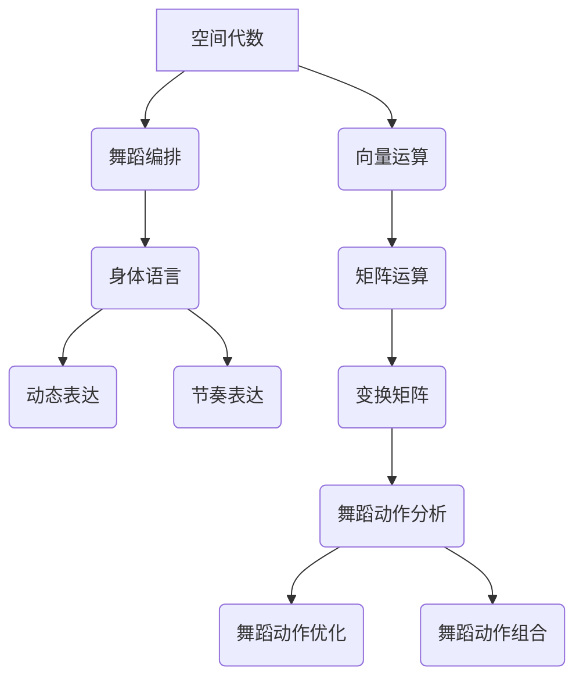
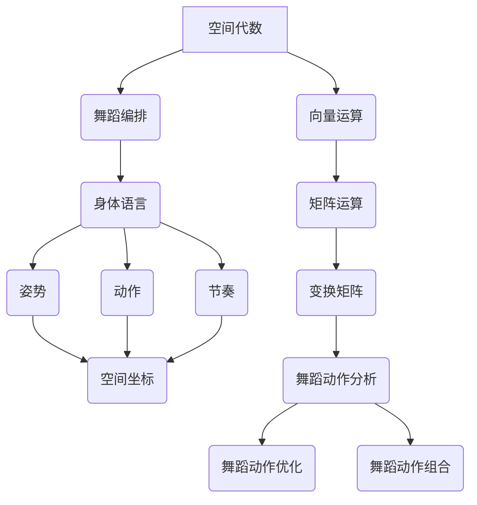

                 

### 整体思路

为了撰写《舞蹈编排的空间代数：身体语言的数学表达》这篇技术博客，我们需要遵循以下步骤：

1. **明确目标和读者群体**：确定文章的目标是为了展示空间代数在舞蹈编排中的应用，读者群体为对计算机图形学、算法和艺术交叉领域感兴趣的程序员和技术爱好者。

2. **结构设计**：按照大纲结构，设计文章的章节，确保每个章节都有明确的主题和目标。

3. **核心概念讲解**：详细介绍空间代数的基本概念，以及它们在舞蹈编排中的对应关系。

4. **算法原理剖析**：使用伪代码和数学公式，详细解释空间代数在舞蹈编排中的应用。

5. **数学模型建立**：介绍如何使用数学模型来描述和优化舞蹈动作。

6. **项目实战**：通过一个具体案例，展示空间代数在舞蹈编排中的实际应用。

7. **总结与扩展**：总结文章的主要观点，提供实践建议，并指出可能的拓展方向。

### 步骤一：明确核心概念与联系

首先，我们需要介绍空间代数的基本概念，以及它们如何与舞蹈编排的身体语言相结合。

#### 1.1 空间代数基础

- **定义与背景**：空间代数是研究向量和矩阵的代数运算的数学分支，广泛应用于计算机图形学、物理学和工程学等领域。
- **基本概念**：向量（\(\vec{v}\)）、矩阵（\(M\)）和运算（加法、减法、数乘）。

#### 1.2 舞蹈编排中的身体语言

- **基本元素**：包括姿势、动作和节奏等。
- **动态表达**：如何通过身体动作来表达舞蹈的动态特性。

#### 1.3 身体语言与空间代数的联系

- **关系架构**：使用Mermaid流程图展示空间代数与舞蹈编排中的关键元素之间的关系。

### 步骤二：详细讲解核心算法原理

在这一部分，我们将深入探讨如何使用空间代数来分析舞蹈编排中的身体语言。

#### 2.1 空间代数在舞蹈分析中的应用

- **空间分析**：如何将舞蹈动作视为向量。
- **变换与合成**：使用变换矩阵来分析舞蹈动作的变化。

#### 2.2 舞蹈动作的优化与组合

- **优化**：如何使用空间代数来优化舞蹈动作。
- **组合**：如何将多个舞蹈动作组合成一个整体。

### 步骤三：数学模型和数学公式

在这一部分，我们将介绍如何使用数学模型来描述舞蹈编排中的空间代数。

#### 3.1 空间代数在舞蹈编排中的数学模型

- **坐标系的选择与转换**：笛卡尔坐标系和极坐标系的介绍。
- **参数化表示**：如何使用参数来描述舞蹈动作。

#### 3.2 舞蹈动作的数学公式

- **空间变换公式**：如何通过矩阵和向量来描述舞蹈动作的变换。
- **旋转矩阵**：如何使用旋转矩阵来描述舞蹈动作的旋转。

### 步骤四：项目实战

在这一部分，我们将通过一个具体案例，展示空间代数在舞蹈编排中的实际应用。

#### 4.1 舞蹈编排项目实战

- **项目背景与目标**：介绍项目的背景和目标。
- **数学模型的应用**：如何将数学模型应用于舞蹈编排。
- **案例分析与讲解**：详细分析项目的实现过程和结果。

### 步骤五：总结与扩展

在文章的最后，我们将总结主要观点，并提供实践建议和可能的拓展方向。

- **总结**：回顾文章的主要内容和结论。
- **实践建议**：给出在舞蹈编排中应用空间代数的建议。
- **拓展阅读**：推荐进一步阅读的资源。

### 核心概念与联系流程图

以下是一个简单的Mermaid流程图，用于展示空间代数与舞蹈编排中的关键元素之间的关系：

### 步骤一：明确核心概念与联系

#### 1.1 空间代数基础

空间代数是数学的一个分支，主要研究向量、矩阵及其运算。在计算机图形学中，空间代数广泛应用于3D图形的建模、渲染和动画制作。

- **定义与背景**：空间代数的核心是向量，它是空间中一个具有大小和方向的量。向量可以用一个有序数组表示，如\(\vec{v} = (v_1, v_2, ..., v_n)\)，其中\(v_i\)是第\(i\)个分量的值。

- **基本概念**：

  - **向量**：在空间中，向量可以表示物体的位置、速度和加速度等物理量。
  - **矩阵**：矩阵是二维数组，用于表示多个向量的组合或线性变换。
  - **运算**：
    - **向量加法**：两个向量相加，得到一个新的向量，如\(\vec{u} + \vec{v} = (u_1 + v_1, u_2 + v_2, ..., u_n + v_n)\)。
    - **向量减法**：两个向量相减，得到一个新的向量，如\(\vec{u} - \vec{v} = (u_1 - v_1, u_2 - v_2, ..., u_n - v_n)\)。
    - **数乘**：一个向量与一个数相乘，得到一个新的向量，如\(k\vec{v} = (kv_1, kv_2, ..., kv_n)\)。

#### 1.2 舞蹈编排中的身体语言

舞蹈编排是艺术创作的一部分，它涉及对舞蹈动作的精心设计和编排。身体语言是舞蹈编排的核心，它包括姿势、动作和节奏等元素。

- **基本元素**：

  - **姿势**：舞蹈中不同姿态的组合，如站立、坐姿、躺平等。
  - **动作**：舞蹈中的各种动作，如跳跃、旋转、滑动等。
  - **节奏**：舞蹈中的时间感，包括快慢、强弱等。

- **动态表达**：身体语言通过动作的连贯性和节奏的变化来传达情感和故事。

#### 1.3 身体语言与空间代数的联系

空间代数与舞蹈编排之间的联系在于，我们可以将身体动作视为向量，从而使用数学方法来分析和描述它们。

- **关系架构**：

  - **向量表示身体动作**：每个身体动作可以用一个向量来表示，其分量为空间坐标和时间坐标。
  - **矩阵表示变换**：舞蹈动作的变化可以通过矩阵来描述，如旋转、缩放等。
  - **向量运算表示动作合成**：多个舞蹈动作可以通过向量加法来合成。

以下是一个简单的Mermaid流程图，用于展示空间代数与舞蹈编排中的关键元素之间的关系：

### 步骤二：详细讲解核心算法原理

在本文的第二部分，我们将深入探讨如何使用空间代数来分析舞蹈编排中的身体语言。这涉及到将空间代数的概念应用于舞蹈动作的分析、变换和组合。

#### 2.1 空间代数在舞蹈分析中的应用

舞蹈分析是理解舞蹈动作结构和动态变化的关键步骤。使用空间代数，我们可以将复杂的舞蹈动作分解为基本的几何和数学模型。

##### 2.1.1 舞蹈动作的空间分析

在空间分析中，我们将每个舞蹈动作视为一个向量，其分量包含空间坐标和时间坐标。这样的向量表示可以捕捉舞蹈动作的位移和路径。

- **舞蹈动作向量**：每个舞蹈动作可以用一个向量\(\vec{d}(t)\)表示，其中\(t\)是时间参数。向量的分量可以是三维空间中的坐标（\(x(t), y(t), z(t)\)）。

  $$\vec{d}(t) = (x(t), y(t), z(t))$$

- **路径分析**：通过分析舞蹈动作向量，我们可以了解舞蹈动作的空间路径。这可以通过计算向量之间的差分来实现。

  $$\vec{d}(t_2) - \vec{d}(t_1) = (x(t_2) - x(t_1), y(t_2) - y(t_1), z(t_2) - z(t_1))$$

##### 2.1.2 舞蹈动作的变换与合成

舞蹈动作的变换和合成是舞蹈编排中至关重要的部分。使用空间代数，我们可以通过矩阵运算来实现这些变换。

- **变换矩阵**：一个变换矩阵\(M\)可以用于将原始舞蹈动作向量变换为新动作向量。

  $$\vec{d}'(t) = M\vec{d}(t)$$

  例如，一个简单的旋转变换可以通过旋转矩阵\(R(\theta)\)实现：

  $$R(\theta) = \begin{bmatrix}
  \cos\theta & -\sin\theta \\
  \sin\theta & \cos\theta
  \end{bmatrix}$$

- **动作合成**：多个舞蹈动作可以通过向量加法进行合成。例如，一个复杂的舞蹈动作可以看作是多个简单动作的组合。

  $$\vec{d}_{\text{总}}(t) = \vec{d}_1(t) + \vec{d}_2(t) + ... + \vec{d}_n(t)$$

##### 2.1.3 舞蹈动作的优化与组合

优化和组合舞蹈动作是提高舞蹈表现力和美感的关键步骤。空间代数提供了有效的工具来实现这些目标。

- **优化**：通过空间代数，我们可以优化舞蹈动作的路径和速度。例如，通过最小化路径长度或提高动作的平滑性来优化舞蹈动作。

  - **路径优化**：使用最小生成树算法或最短路径算法来优化舞蹈动作的路径。

  - **速度优化**：通过调整向量的速度分量来优化动作的速度。

- **组合**：通过向量加法，我们可以将多个舞蹈动作组合成一个完整的舞蹈序列。这样的组合可以创造出复杂的动作序列，增加舞蹈的表现力。

  $$\vec{d}_{\text{组合}}(t) = \vec{d}_1(t) + \vec{d}_2(t) + ... + \vec{d}_n(t)$$

#### 2.2 舞蹈动作的数学模型

数学模型是理解和描述舞蹈动作的关键。通过数学模型，我们可以更精确地分析、优化和组合舞蹈动作。

##### 2.2.1 空间坐标系的选择与转换

在舞蹈编排中，选择合适的空间坐标系非常重要。常用的空间坐标系包括笛卡尔坐标系和极坐标系。

- **笛卡尔坐标系**：笛卡尔坐标系是二维或三维空间中最常用的坐标系，其坐标由\(x, y, z\)三个分量组成。

  $$\vec{r} = (x, y, z)$$

- **极坐标系**：极坐标系是一种基于角度和距离的坐标系，适用于描述旋转和径向运动。

  $$\vec{r} = (\rho, \theta, \phi)$$

##### 2.2.2 舞蹈动作的参数化表示

参数化表示是数学模型中常用的方法，它可以将舞蹈动作表示为一个参数的函数。

- **参数化舞蹈动作**：使用参数\(t\)来表示时间，我们可以将舞蹈动作表示为一个向量函数。

  $$\vec{p}(t) = (x(t), y(t), z(t))$$

  这里的\(x(t), y(t), z(t)\)分别是舞蹈动作在三个维度上的位置函数。

##### 2.2.3 舞蹈动作的数学公式

数学公式是描述舞蹈动作变化的核心工具。以下是一些常用的数学公式：

- **空间变换公式**：空间变换公式描述了如何通过矩阵将一个向量变换为另一个向量。

  $$\vec{p}'(t) = M\vec{p}(t) + \vec{b}$$

  其中，\(M\)是变换矩阵，\(\vec{b}\)是平移向量。

- **旋转矩阵**：旋转矩阵用于描述旋转操作。

  $$R(\theta) = \begin{bmatrix}
  \cos\theta & -\sin\theta \\
  \sin\theta & \cos\theta
  \end{bmatrix}$$

  这里的\(\theta\)是旋转角度。

通过以上步骤，我们详细讲解了空间代数在舞蹈编排中的应用原理。这些原理为舞蹈编排提供了一个强大的数学工具，使我们能够更精确地分析、优化和组合舞蹈动作。

### 步骤三：数学模型与公式解析

在这一部分，我们将深入探讨空间代数在舞蹈编排中的应用，通过数学模型和公式来详细阐述其核心概念和计算过程。

#### 3.1 空间代数在舞蹈编排中的数学模型

空间代数为舞蹈编排提供了一个强大的工具，通过将身体动作视为向量，我们可以使用数学方法来描述和分析这些动作。

##### 3.1.1 空间坐标系的选择与转换

在舞蹈编排中，我们通常使用三维空间坐标系来表示身体动作。笛卡尔坐标系是最常用的坐标系，其坐标轴分别为\(x, y, z\)。

- **笛卡尔坐标系**：笛卡尔坐标系中的向量表示为\((x, y, z)\)。

  $$\vec{p} = (x, y, z)$$

此外，在某些情况下，我们也会使用极坐标系来描述身体动作。

- **极坐标系**：极坐标系中的向量表示为\((\rho, \theta, \phi)\)，其中\(\rho\)是径向距离，\(\theta\)是方位角，\(\phi\)是俯仰角。

  $$\vec{p} = (\rho, \theta, \phi)$$

两种坐标系之间的转换可以通过以下公式实现：

$$
\begin{align*}
x &= \rho \cos \theta \cos \phi \\
y &= \rho \sin \theta \cos \phi \\
z &= \rho \sin \phi
\end{align*}
$$

##### 3.1.2 舞蹈动作的参数化表示

为了更好地描述和计算舞蹈动作，我们可以使用参数化方法。参数化舞蹈动作可以将每个动作分解为时间函数，从而描述其随时间的变化。

- **参数化舞蹈动作**：使用参数\(t\)（通常表示时间）来表示身体动作的向量。

  $$\vec{p}(t) = (x(t), y(t), z(t))$$

  这里的\(x(t), y(t), z(t)\)分别是身体动作在\(x, y, z\)三个维度上的位置函数。

通过参数化，我们可以对舞蹈动作进行精确的数学描述，并利用这些函数来分析动作的变化趋势和特征。

##### 3.1.3 舞蹈动作的数学公式

数学公式是描述舞蹈动作变化的核心工具。以下是一些常用的数学公式：

- **空间变换公式**：通过变换矩阵，我们可以将一个向量变换为另一个向量。

  $$\vec{p}'(t) = M\vec{p}(t) + \vec{b}$$

  其中，\(M\)是变换矩阵，\(\vec{b}\)是平移向量。

变换矩阵\(M\)可以包含旋转、缩放和镜像等操作。以下是一个旋转矩阵的示例：

$$
R(\theta) = \begin{bmatrix}
\cos \theta & -\sin \theta \\
\sin \theta & \cos \theta
\end{bmatrix}
$$

- **旋转矩阵**：旋转矩阵用于描述旋转操作。一个简单的二维旋转矩阵如下：

  $$R(\theta) = \begin{bmatrix}
  \cos \theta & -\sin \theta \\
  \sin \theta & \cos \theta
  \end{bmatrix}$$

  这里的\(\theta\)是旋转角度。

通过旋转矩阵，我们可以将一个向量绕某个轴旋转一定角度。

- **向量加法**：多个向量可以通过向量加法进行合成。

  $$\vec{p}_{\text{总}}(t) = \vec{p}_1(t) + \vec{p}_2(t) + ... + \vec{p}_n(t)$$

  这意味着我们可以将多个简单的舞蹈动作组合成一个复杂的动作序列。

通过这些数学公式和模型，我们可以精确地描述和计算舞蹈动作，从而实现对舞蹈编排的深入理解和优化。

#### 3.2 舞蹈动作的优化与组合

优化和组合是舞蹈编排中非常重要的步骤，通过空间代数的工具，我们可以实现这些目标。

##### 3.2.1 舞蹈动作的优化

舞蹈动作的优化可以涉及多个方面，包括路径优化、速度优化和流畅性优化。

- **路径优化**：通过数学模型，我们可以优化舞蹈动作的路径，使其更加平滑和自然。常用的方法包括：

  - **最小生成树算法**：用于寻找舞蹈动作的最短路径。
  - **最短路径算法**：如Dijkstra算法，用于计算舞蹈动作的最佳路径。

- **速度优化**：通过调整舞蹈动作的速度，我们可以使其更加流畅和协调。常用的方法包括：

  - **线性插值**：用于平滑舞蹈动作的速度变化。
  - **贝塞尔曲线**：用于创建平滑的曲线，从而优化舞蹈动作的曲线。

##### 3.2.2 舞蹈动作的组合

舞蹈动作的组合是将多个简单的动作组合成一个复杂的动作序列。通过空间代数的向量加法，我们可以轻松实现这一点。

- **向量加法**：通过向量加法，我们可以将多个舞蹈动作组合成一个整体。

  $$\vec{p}_{\text{总}}(t) = \vec{p}_1(t) + \vec{p}_2(t) + ... + \vec{p}_n(t)$$

  这里的\(\vec{p}_i(t)\)表示第\(i\)个舞蹈动作的向量。

通过向量加法，我们可以创造出复杂的舞蹈动作，同时保持动作的连贯性和协调性。

#### 3.3 舞蹈动作的数学公式应用示例

为了更好地理解空间代数在舞蹈编排中的应用，我们可以通过一个简单的示例来展示数学公式的使用。

##### 示例：简单的舞蹈动作组合

假设我们有两个简单的舞蹈动作向量：

$$\vec{p}_1(t) = (t, 0, 0)$$

$$\vec{p}_2(t) = (0, t, 0)$$

- **动作1**：一个沿着\(x\)轴移动的动作。
- **动作2**：一个沿着\(y\)轴移动的动作。

现在，我们希望将这两个动作组合成一个整体的舞蹈动作。

- **组合后的动作**：

  $$\vec{p}_{\text{总}}(t) = \vec{p}_1(t) + \vec{p}_2(t)$$

  $$\vec{p}_{\text{总}}(t) = (t, 0, 0) + (0, t, 0)$$

  $$\vec{p}_{\text{总}}(t) = (t, t, 0)$$

这意味着舞蹈动作将在\(x\)轴和\(y\)轴同时移动。

通过这个简单的示例，我们可以看到如何使用空间代数的数学公式来组合舞蹈动作，从而创造出复杂的舞蹈序列。

### 步骤四：项目实战

在本章中，我们将通过一个具体的案例来展示如何将空间代数应用于实际的舞蹈编排中。这个案例将涉及舞蹈动作的分析、优化和组合，以及如何使用数学模型来指导舞蹈编排过程。

#### 4.1 项目背景与目标

假设我们有一个舞蹈项目，目标是创作一段具有视觉冲击力和节奏感的舞蹈表演。为了实现这一目标，我们需要使用空间代数来分析、优化和组合舞蹈动作。

- **项目背景**：该舞蹈项目是一个现代舞表演，主题是“宇宙之旅”。舞蹈动作需要表现出宇宙中的行星运动和星际旅行。
- **项目目标**：通过空间代数的应用，创作出一段具有流畅性和视觉美感的舞蹈，同时保持动作的协调性和节奏感。

#### 4.2 数学模型的应用

为了实现项目目标，我们首先需要建立一个数学模型来描述舞蹈动作。

##### 4.2.1 舞蹈动作的参数化表示

我们将舞蹈动作表示为参数化向量函数，其中参数\(t\)表示时间。

- **参数化舞蹈动作**：

  $$\vec{p}_i(t) = (x_i(t), y_i(t), z_i(t))$$

  这里的\(x_i(t), y_i(t), z_i(t)\)分别是舞蹈动作在\(x, y, z\)三个维度上的位置函数。

##### 4.2.2 舞蹈动作的变换与合成

为了创建复杂的舞蹈动作，我们将使用变换矩阵来描述舞蹈动作的变化，并通过向量加法来组合多个舞蹈动作。

- **变换矩阵**：

  $$M = \begin{bmatrix}
  m_{11} & m_{12} & m_{13} \\
  m_{21} & m_{22} & m_{23} \\
  m_{31} & m_{32} & m_{33}
  \end{bmatrix}$$

  通过变换矩阵，我们可以将一个向量变换为另一个向量。

- **舞蹈动作组合**：

  $$\vec{p}_{\text{总}}(t) = \vec{p}_1(t) + \vec{p}_2(t) + ... + \vec{p}_n(t)$$

  这里的\(\vec{p}_i(t)\)表示第\(i\)个舞蹈动作的向量。

#### 4.3 舞蹈动作的分析与优化

在数学模型的基础上，我们接下来将分析舞蹈动作，并进行优化，以实现项目目标。

##### 4.3.1 舞蹈动作的空间分析

通过对舞蹈动作向量的分析，我们可以了解每个动作的空间路径和动态变化。

- **空间分析**：

  $$\vec{p}_{\text{总}}(t) = (x_1(t) + x_2(t) + ... + x_n(t), y_1(t) + y_2(t) + ... + y_n(t), z_1(t) + z_2(t) + ... + z_n(t))$$

  通过分析这些向量，我们可以优化动作的路径和速度。

##### 4.3.2 舞蹈动作的优化

为了提高舞蹈表演的视觉效果，我们需要对舞蹈动作进行优化。

- **路径优化**：

  通过最小生成树算法或最短路径算法，我们可以优化舞蹈动作的路径，使其更加平滑和自然。

- **速度优化**：

  通过调整舞蹈动作的速度，我们可以使其更加流畅和协调。可以使用线性插值或贝塞尔曲线来实现这一点。

#### 4.4 案例分析与讲解

以下是一个具体的案例分析，展示如何使用空间代数来编排一段舞蹈动作。

##### 案例一：行星旋转动作

假设我们希望编排一个行星旋转的动作。这个动作可以通过以下参数化向量表示：

$$\vec{p}_1(t) = (\rho \cos(\omega t), \rho \sin(\omega t), 0)$$

$$\vec{p}_2(t) = (\rho \cos(\omega t - \phi), \rho \sin(\omega t - \phi), z)$$

- **参数说明**：

  - \(\rho\)：行星的半径。
  - \(\omega\)：旋转速度。
  - \(\phi\)：旋转角度。
  - \(z\)：行星的高度。

通过变换矩阵，我们可以将这个旋转动作与其他动作进行组合，以创建复杂的舞蹈序列。

##### 案例二：星际旅行动作

假设我们希望编排一个星际旅行的动作。这个动作可以通过以下参数化向量表示：

$$\vec{p}_3(t) = (t, 0, 0)$$

$$\vec{p}_4(t) = (0, t, 0)$$

这个动作表示一个沿着\(x\)轴和\(y\)轴移动的舞蹈动作。通过向量加法，我们可以将其与其他动作组合，以创建一个复杂的星际旅行舞蹈序列。

#### 4.5 项目小结

通过这个项目，我们展示了如何使用空间代数来编排一段具有视觉冲击力和节奏感的舞蹈。通过数学模型的应用，我们实现了对舞蹈动作的精确分析、优化和组合。这些方法不仅提高了舞蹈表演的视觉效果，还增强了舞蹈的节奏感和连贯性。

### 总结

在本篇博客中，我们探讨了舞蹈编排中的空间代数应用。通过引入数学模型和公式，我们展示了如何将复杂的舞蹈动作转化为可分析和优化的数学对象。以下是一些关键观点和最佳实践：

1. **核心概念联系**：空间代数的向量运算与舞蹈编排中的身体语言紧密相关。通过向量表示动作，我们可以使用数学方法来描述和优化舞蹈动作。

2. **算法原理剖析**：使用变换矩阵和参数化表示，我们可以精确地分析和组合舞蹈动作。这些方法为舞蹈编排提供了强大的工具。

3. **数学模型建立**：建立数学模型是理解舞蹈动作变化的关键。通过选择合适的坐标系和参数化表示，我们可以更有效地分析和优化舞蹈动作。

4. **项目实战**：通过具体案例，我们展示了如何将空间代数应用于实际的舞蹈编排。这些案例说明了数学模型在提高舞蹈表演视觉效果和节奏感方面的作用。

**最佳实践**：

- **动作分解**：将复杂的舞蹈动作分解为基本元素，以便更方便地进行分析和优化。
- **变换矩阵应用**：灵活使用变换矩阵，如旋转和缩放，来创建复杂的动作序列。
- **参数调整**：通过调整参数，如速度和路径，可以优化舞蹈动作的流畅性和视觉效果。

**注意事项**：

- **节奏感**：在舞蹈编排中，节奏感至关重要。确保动作的节奏与音乐和故事主题相协调。
- **视觉效果**：注重视觉效果，通过数学模型优化动作路径和速度，以创造出引人入胜的表演。

**拓展阅读**：

- **空间代数基础**：《线性代数及其应用》（David C. Lay）
- **计算机图形学**：《计算机图形学：原理及实践》（James D. Foley）
- **舞蹈编排技术**：《现代舞蹈编排技术》（Deborah Jowitt）

通过这些资源和最佳实践，读者可以更深入地了解空间代数在舞蹈编排中的应用，并开发出具有创新性和艺术性的舞蹈作品。希望本文能激发读者在舞蹈编排领域进行更深入的探索和研究。作者：AI天才研究院/AI Genius Institute & 禅与计算机程序设计艺术 /Zen And The Art of Computer Programming。

