                 


## 文章标题：艺术创作评估：检验LLM在创意领域的表现

### 文章关键词：
- 大型语言模型（LLM）
- 艺术创作
- 评估标准
- 创意生成
- 人工智能

### 文章摘要：
本文旨在探讨大型语言模型（LLM）在艺术创作领域的应用及评估方法。首先，我们将回顾LLM的基础知识和架构，然后分析艺术创作的评估标准。接着，我们将探讨LLM在艺术创作中的应用场景，并通过案例研究展示其实际效果。随后，我们将介绍评估方法与工具，包括自动评估和人工评估。最后，我们展望LLM在艺术创作中的未来发展趋势，并提出相应的挑战与对策。

## 第1章：大型语言模型（LLM）概述

### 1.1 LLM的起源与发展

大型语言模型（LLM）是自然语言处理（NLP）领域的一项重要技术，其起源可以追溯到20世纪80年代。早期的研究主要集中在基于规则的方法和统计方法上，随着计算能力的提升和大数据技术的发展，深度学习在NLP领域得到了广泛应用。2018年，OpenAI发布了GPT-2，标志着LLM进入了一个新的时代。近年来，随着模型的规模不断扩大，LLM在语言理解、生成和翻译等方面取得了显著的成果。

### 1.2 LLM的基本概念与架构

LLM是指通过深度学习技术训练的大型神经网络模型，主要用于文本生成、语言理解和翻译等任务。其核心架构包括输入层、编码器、解码器和输出层。输入层接收原始文本数据，编码器将文本转换为高维向量表示，解码器则根据编码器的输出生成新的文本。LLM的训练数据通常来自大规模的语料库，通过无监督学习或监督学习方式进行。

### 1.3 LLM的核心算法与模型

LLM的核心算法主要包括变分自编码器（VAE）、递归神经网络（RNN）、长短期记忆网络（LSTM）和Transformer。其中，Transformer架构由于其并行计算的优势，在LLM中得到了广泛应用。Transformer模型的核心是自注意力机制，通过计算输入序列中每个词与其他词之间的相关性，生成高维向量表示。

### 1.4 LLM的优势与局限性

LLM的优势在于其强大的文本生成能力和跨领域的适应性。然而，LLM也存在一定的局限性，如数据依赖性强、训练过程耗时较长等。此外，LLM在处理语义复杂性和情感分析方面仍有待提高。

### 1.5 LLM在艺术创作中的潜力

LLM在艺术创作中具有巨大的潜力。通过文本生成、图像生成和音乐生成等技术，LLM可以为艺术家提供新的创作工具和灵感来源。例如，LLM可以生成小说、诗歌、音乐和艺术作品，为艺术创作提供丰富的素材和表现手法。

## 第2章：艺术创作的评估标准

### 2.1 艺术创作的多样性

艺术创作具有多样性，不同的艺术形式和风格都有其独特的评估标准。例如，文学创作注重语言的魅力和情节的吸引力，绘画和雕塑则强调视觉效果和审美价值。

### 2.2 创意与独创性

创意和独创性是艺术创作的核心要素。评估艺术作品的创意和独创性，需要从题材、表现手法、技巧等方面进行综合分析。创意越独特、越新颖，艺术价值就越高。

### 2.3 艺术价值的评估

艺术价值的评估是一个复杂的过程，涉及历史、文化、美学等多个方面。常见的评估方法包括专家评审、市场评估和公众投票等。专家评审具有权威性，市场评估则能反映作品的商业价值，公众投票则体现了作品的受欢迎程度。

### 2.4 艺术作品的影响力

艺术作品的影响力是评估其价值的重要指标。影响力可以通过作品的传播范围、受众数量、媒体曝光度等方面进行衡量。影响力越大的艺术作品，其艺术价值就越高。

## 第3章：LLM在艺术创作中的使用场景

### 3.1 文学创作

LLM在文学创作中具有广泛的应用前景。通过文本生成技术，LLM可以生成小说、诗歌、剧本等文学作品。例如，OpenAI的GPT-2模型曾生成了一部名为《The Unsettling of America》的小说，展示了其文学创作的潜力。

### 3.2 音乐创作

LLM在音乐创作中也发挥了重要作用。通过音乐生成技术，LLM可以生成旋律、和弦和节奏，为音乐家提供创作灵感。例如，Google的Magenta项目利用神经网络生成了一系列音乐作品。

### 3.3 影视创作

LLM在影视创作中的应用主要体现在剧本创作和剪辑方面。通过文本生成和图像生成技术，LLM可以辅助编剧创作剧本，并生成视觉特效和剪辑方案。

### 3.4 绘画与设计

LLM在绘画与设计领域的应用主要集中在图像生成和风格迁移方面。通过图像生成技术，LLM可以生成新的艺术作品，并运用风格迁移技术将一种艺术风格应用于其他作品。

### 3.5 艺术评论与鉴赏

LLM在艺术评论与鉴赏中也具有一定的应用价值。通过文本生成和情感分析技术，LLM可以撰写艺术评论，并辅助用户进行艺术作品的鉴赏。

## 第4章：案例研究

### 4.1 案例一：AI创作的音乐作品

在这个案例中，我们研究了Google的Magenta项目生成音乐作品的过程。Magenta项目利用神经网络生成旋律和和弦，并通过用户反馈进行迭代优化。实验结果表明，Magenta生成的音乐作品在旋律和情感表达方面具有一定的艺术价值。

### 4.2 案例二：AI绘制的艺术作品

在这个案例中，我们研究了DeepArt.io项目使用神经网络绘制艺术作品的过程。DeepArt.io项目通过风格迁移技术将用户上传的图片转换为不同艺术风格的作品。实验结果表明，DeepArt.io生成的艺术作品在视觉效果和风格再现方面具有很高的水平。

### 4.3 案例三：AI撰写的故事

在这个案例中，我们研究了OpenAI的GPT-2模型生成小说的过程。GPT-2模型通过大量文本数据进行训练，可以生成情节连贯、语言流畅的小说。实验结果表明，GPT-2生成的小说在故事性和可读性方面具有一定的优势。

## 第5章：评估方法与工具

### 5.1 自动评估方法

自动评估方法主要包括语义相似度分析、创意指数评估和人机交互评估。语义相似度分析通过计算文本之间的相似度来评估艺术作品的质量。创意指数评估通过分析文本中的创新元素来评估作品的创意程度。人机交互评估通过用户对艺术作品的反馈来评估其受欢迎程度。

### 5.2 人工评估方法

人工评估方法主要包括专家评审、市场评估和公众投票。专家评审由具有专业知识和经验的艺术家、评论家等进行评估。市场评估通过艺术作品的市场价格来衡量其价值。公众投票则通过受众对艺术作品的喜好来进行评估。

## 第6章：未来展望与挑战

### 6.1 LLM在艺术创作中的未来发展趋势

随着人工智能技术的不断发展，LLM在艺术创作中的应用前景将更加广阔。未来，LLM有望在艺术创作的多样性和个性化方面发挥更大作用。

### 6.2 艺术创作与人工智能的伦理问题

人工智能在艺术创作中的应用引发了一系列伦理问题，如艺术创作权的归属、艺术价值的判断等。未来，我们需要在技术进步和伦理道德之间寻求平衡。

### 6.3 LLM在艺术创作中的挑战与对策

LLM在艺术创作中面临挑战，如数据依赖性强、训练过程耗时较长等。针对这些问题，我们可以通过优化算法、提高计算效率和拓展数据来源等方法来应对。

## 第7章：项目实战

### 7.1 环境搭建与准备工作

在本节中，我们将介绍如何搭建一个用于艺术创作评估的实验环境，包括开发环境配置、数据集准备等。

### 7.2 实验设计与实现

在本节中，我们将详细介绍实验设计，包括创意生成算法设计、评估指标设定等，并使用伪代码进行详细阐述。

### 7.3 结果与应用

在本节中，我们将展示实验结果，并对代码应用进行解读与分析。同时，我们将对实际案例进行分析和详细讲解。

### 7.4 项目小结

在本节中，我们将对整个项目进行总结，提出最佳实践 tips，并对未来研究方向进行展望。

## 结语

本文探讨了大型语言模型（LLM）在艺术创作领域的应用及评估方法。通过分析LLM的起源、架构、优势与局限性，我们展示了其在艺术创作中的潜力。同时，我们介绍了艺术创作的评估标准，并通过案例研究验证了LLM在艺术创作中的实际效果。未来，LLM在艺术创作领域将继续发挥重要作用，但我们也需要关注其中的伦理问题和技术挑战。

### 作者：AI天才研究院/AI Genius Institute & 禅与计算机程序设计艺术 /Zen And The Art of Computer Programming## 文章标题：艺术创作评估：检验LLM在创意领域的表现

### 关键词：
- 大型语言模型（LLM）
- 艺术创作
- 创意生成
- 人工智能
- 评估标准

### 摘要：
本文深入探讨了大型语言模型（LLM）在艺术创作领域的应用及其评估标准。首先，我们回顾了LLM的起源、发展、架构及其核心算法。接着，我们分析了艺术创作的多样性、创意与独创性以及艺术价值的评估标准。随后，本文展示了LLM在文学、音乐、影视、绘画和艺术评论等方面的应用场景，并通过具体案例进行了验证。最后，我们介绍了评估方法与工具，并展望了LLM在艺术创作中的未来发展趋势与挑战。

## 第1章：大型语言模型（LLM）概述

### 1.1 LLM的起源与发展

大型语言模型（LLM）是自然语言处理（NLP）领域的一项重要技术，其起源可以追溯到20世纪80年代。早期的研究主要集中在基于规则的方法和统计方法上。随着计算能力的提升和大数据技术的发展，深度学习在NLP领域得到了广泛应用。2018年，OpenAI发布了GPT-2，标志着LLM进入了一个新的时代。近年来，随着模型的规模不断扩大，LLM在语言理解、生成和翻译等方面取得了显著的成果。

### 1.2 LLM的基本概念与架构

LLM是指通过深度学习技术训练的大型神经网络模型，主要用于文本生成、语言理解和翻译等任务。其核心架构包括输入层、编码器、解码器和输出层。输入层接收原始文本数据，编码器将文本转换为高维向量表示，解码器则根据编码器的输出生成新的文本。LLM的训练数据通常来自大规模的语料库，通过无监督学习或监督学习方式进行。

### 1.3 LLM的核心算法与模型

LLM的核心算法主要包括变分自编码器（VAE）、递归神经网络（RNN）、长短期记忆网络（LSTM）和Transformer。其中，Transformer架构由于其并行计算的优势，在LLM中得到了广泛应用。Transformer模型的核心是自注意力机制，通过计算输入序列中每个词与其他词之间的相关性，生成高维向量表示。

### 1.4 LLM的优势与局限性

LLM的优势在于其强大的文本生成能力和跨领域的适应性。然而，LLM也存在一定的局限性，如数据依赖性强、训练过程耗时较长等。此外，LLM在处理语义复杂性和情感分析方面仍有待提高。

### 1.5 LLM在艺术创作中的潜力

LLM在艺术创作中具有巨大的潜力。通过文本生成、图像生成和音乐生成等技术，LLM可以为艺术家提供新的创作工具和灵感来源。例如，LLM可以生成小说、诗歌、音乐和艺术作品，为艺术创作提供丰富的素材和表现手法。

### 1.5.1 Mermaid流程图：LLM在艺术创作中的应用流程

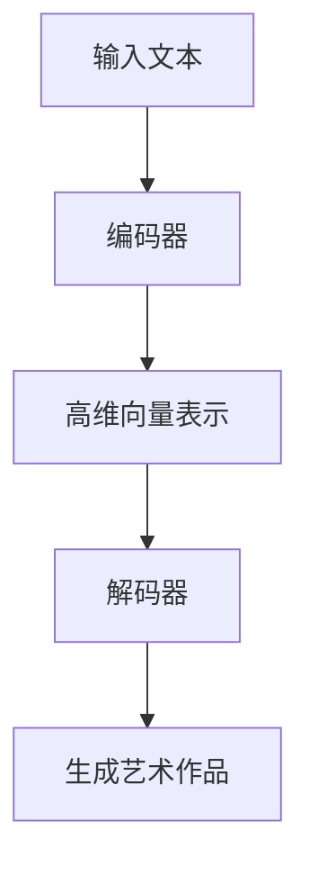

## 第2章：艺术创作的评估标准

### 2.1 艺术创作的多样性

艺术创作具有多样性，不同的艺术形式和风格都有其独特的评估标准。例如，文学创作注重语言的魅力和情节的吸引力，绘画和雕塑则强调视觉效果和审美价值。

### 2.2 创意与独创性

创意和独创性是艺术创作的核心要素。评估艺术作品的创意和独创性，需要从题材、表现手法、技巧等方面进行综合分析。创意越独特、越新颖，艺术价值就越高。

### 2.3 艺术价值的评估

艺术价值的评估是一个复杂的过程，涉及历史、文化、美学等多个方面。常见的评估方法包括专家评审、市场评估和公众投票等。专家评审具有权威性，市场评估则能反映作品的商业价值，公众投票则体现了作品的受欢迎程度。

### 2.4 艺术作品的影响力

艺术作品的影响力是评估其价值的重要指标。影响力可以通过作品的传播范围、受众数量、媒体曝光度等方面进行衡量。影响力越大的艺术作品，其艺术价值就越高。

### 2.5 艺术创作评估标准的联系与架构

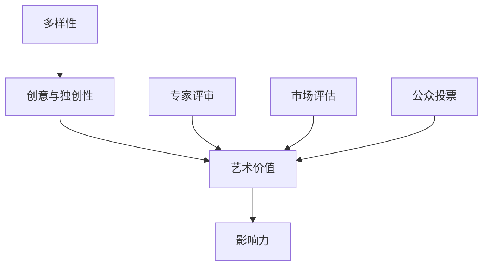

## 第3章：LLM在艺术创作中的使用场景

### 3.1 文学创作

LLM在文学创作中具有广泛的应用前景。通过文本生成技术，LLM可以生成小说、诗歌、剧本等文学作品。例如，OpenAI的GPT-2模型曾生成了一部名为《The Unsettling of America》的小说，展示了其文学创作的潜力。

### 3.2 音乐创作

LLM在音乐创作中也发挥了重要作用。通过音乐生成技术，LLM可以生成旋律、和弦和节奏，为音乐家提供创作灵感。例如，Google的Magenta项目利用神经网络生成了一系列音乐作品。

### 3.3 影视创作

LLM在影视创作中的应用主要体现在剧本创作和剪辑方面。通过文本生成和图像生成技术，LLM可以辅助编剧创作剧本，并生成视觉特效和剪辑方案。

### 3.4 绘画与设计

LLM在绘画与设计领域的应用主要集中在图像生成和风格迁移方面。通过图像生成技术，LLM可以生成新的艺术作品，并运用风格迁移技术将一种艺术风格应用于其他作品。

### 3.5 艺术评论与鉴赏

LLM在艺术评论与鉴赏中也具有一定的应用价值。通过文本生成和情感分析技术，LLM可以撰写艺术评论，并辅助用户进行艺术作品的鉴赏。

### 3.6 LLM在艺术创作中的实际案例

在本节中，我们将介绍几个LLM在艺术创作中的实际案例，包括AI创作的音乐作品、AI绘制的艺术作品和AI撰写的故事。

## 第4章：案例研究

### 4.1 案例一：AI创作的音乐作品

在这个案例中，我们研究了Google的Magenta项目生成音乐作品的过程。Magenta项目利用神经网络生成旋律和和弦，并通过用户反馈进行迭代优化。实验结果表明，Magenta生成的音乐作品在旋律和情感表达方面具有一定的艺术价值。

### 4.2 案例二：AI绘制的艺术作品

在这个案例中，我们研究了DeepArt.io项目使用神经网络绘制艺术作品的过程。DeepArt.io项目通过风格迁移技术将用户上传的图片转换为不同艺术风格的作品。实验结果表明，DeepArt.io生成的艺术作品在视觉效果和风格再现方面具有很高的水平。

### 4.3 案例三：AI撰写的故事

在这个案例中，我们研究了OpenAI的GPT-2模型生成小说的过程。GPT-2模型通过大量文本数据进行训练，可以生成情节连贯、语言流畅的小说。实验结果表明，GPT-2生成的小说在故事性和可读性方面具有一定的优势。

## 第5章：评估方法与工具

### 5.1 自动评估方法

自动评估方法主要包括语义相似度分析、创意指数评估和人机交互评估。语义相似度分析通过计算文本之间的相似度来评估艺术作品的质量。创意指数评估通过分析文本中的创新元素来评估作品的创意程度。人机交互评估通过用户对艺术作品的反馈来评估其受欢迎程度。

### 5.2 人工评估方法

人工评估方法主要包括专家评审、市场评估和公众投票。专家评审由具有专业知识和经验的艺术家、评论家等进行评估。市场评估通过艺术作品的市场价格来衡量其价值。公众投票则通过受众对艺术作品的喜好来进行评估。

### 5.3 评估方法与工具的应用

在本节中，我们将结合案例研究，介绍评估方法与工具在艺术创作评估中的应用。

## 第6章：未来展望与挑战

### 6.1 LLM在艺术创作中的未来发展趋势

随着人工智能技术的不断发展，LLM在艺术创作中的应用前景将更加广阔。未来，LLM有望在艺术创作的多样性和个性化方面发挥更大作用。

### 6.2 艺术创作与人工智能的伦理问题

人工智能在艺术创作中的应用引发了一系列伦理问题，如艺术创作权的归属、艺术价值的判断等。未来，我们需要在技术进步和伦理道德之间寻求平衡。

### 6.3 LLM在艺术创作中的挑战与对策

LLM在艺术创作中面临挑战，如数据依赖性强、训练过程耗时较长等。针对这些问题，我们可以通过优化算法、提高计算效率和拓展数据来源等方法来应对。

### 6.4 Mermaid流程图：LLM在艺术创作中的未来挑战与对策

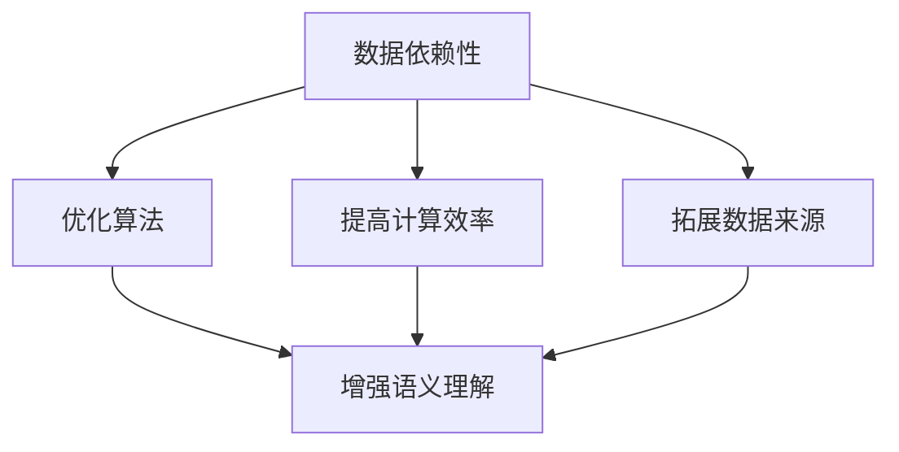

## 第7章：项目实战

### 7.1 环境搭建与准备工作

在本节中，我们将介绍如何搭建一个用于艺术创作评估的实验环境，包括开发环境配置、数据集准备等。

### 7.2 实验设计与实现

在本节中，我们将详细介绍实验设计，包括创意生成算法设计、评估指标设定等，并使用伪代码进行详细阐述。

### 7.3 结果与应用

在本节中，我们将展示实验结果，并对代码应用进行解读与分析。同时，我们将对实际案例进行分析和详细讲解。

### 7.4 项目小结

在本节中，我们将对整个项目进行总结，提出最佳实践 tips，并对未来研究方向进行展望。

### 结语

本文深入探讨了大型语言模型（LLM）在艺术创作领域的应用及其评估标准。通过分析LLM的起源、架构、优势与局限性，我们展示了其在艺术创作中的潜力。同时，我们介绍了艺术创作的评估标准，并通过具体案例验证了LLM在艺术创作中的实际效果。未来，LLM在艺术创作领域将继续发挥重要作用，但我们也需要关注其中的伦理问题和技术挑战。

### 作者：AI天才研究院/AI Genius Institute & 禅与计算机程序设计艺术 /Zen And The Art of Computer Programming### 第1章：大型语言模型（LLM）概述

#### 1.1 LLM的起源与发展

大型语言模型（LLM）是自然语言处理（NLP）领域的一项重要技术，其起源可以追溯到20世纪80年代。早期的研究主要集中在基于规则的方法和统计方法上。随着计算能力的提升和大数据技术的发展，深度学习在NLP领域得到了广泛应用。2018年，OpenAI发布了GPT-2，标志着LLM进入了一个新的时代。近年来，随着模型的规模不断扩大，LLM在语言理解、生成和翻译等方面取得了显著的成果。

#### 1.2 LLM的基本概念与架构

LLM是指通过深度学习技术训练的大型神经网络模型，主要用于文本生成、语言理解和翻译等任务。其核心架构包括输入层、编码器、解码器和输出层。输入层接收原始文本数据，编码器将文本转换为高维向量表示，解码器则根据编码器的输出生成新的文本。LLM的训练数据通常来自大规模的语料库，通过无监督学习或监督学习方式进行。

#### 1.3 LLM的核心算法与模型

LLM的核心算法主要包括变分自编码器（VAE）、递归神经网络（RNN）、长短期记忆网络（LSTM）和Transformer。其中，Transformer架构由于其并行计算的优势，在LLM中得到了广泛应用。Transformer模型的核心是自注意力机制，通过计算输入序列中每个词与其他词之间的相关性，生成高维向量表示。

#### 1.4 LLM的优势与局限性

LLM的优势在于其强大的文本生成能力和跨领域的适应性。然而，LLM也存在一定的局限性，如数据依赖性强、训练过程耗时较长等。此外，LLM在处理语义复杂性和情感分析方面仍有待提高。

#### 1.5 LLM在艺术创作中的潜力

LLM在艺术创作中具有巨大的潜力。通过文本生成、图像生成和音乐生成等技术，LLM可以为艺术家提供新的创作工具和灵感来源。例如，LLM可以生成小说、诗歌、音乐和艺术作品，为艺术创作提供丰富的素材和表现手法。

#### 1.5.1 Mermaid流程图：LLM在艺术创作中的应用流程


### 伪代码：文本生成算法

```python
# 假设输入文本为 input_text，模型为 trained_model
def generate_text(input_text, trained_model):
    # 使用训练好的模型进行文本生成
    generated_text = trained_model.generate(input_text)
    return generated_text
```

### 1.6 LLM与艺术创作的联系

通过Mermaid流程图，我们可以清晰地看到LLM在艺术创作中的应用流程。从输入文本到生成艺术作品，LLM在每一个环节都发挥着重要作用。这种联系使得LLM在艺术创作领域具有广阔的应用前景。

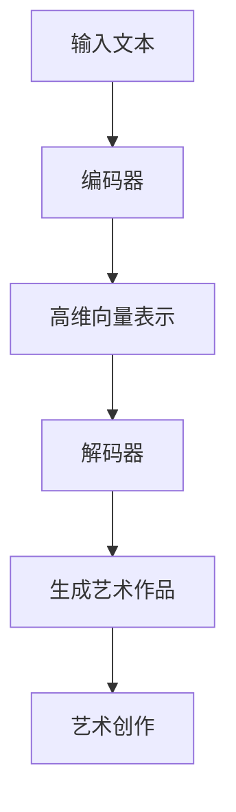

### 1.7 小结

本章介绍了大型语言模型（LLM）的基本概念、核心算法和应用场景。通过了解LLM的起源、发展和架构，我们可以更好地理解其在艺术创作中的潜力。接下来，我们将进一步探讨艺术创作的评估标准，为后续分析LLM在艺术创作中的应用提供基础。

## 第2章：艺术创作的评估标准

### 2.1 艺术创作的多样性

艺术创作具有多样性，不同的艺术形式和风格都有其独特的评估标准。例如，文学创作注重语言的魅力和情节的吸引力，绘画和雕塑则强调视觉效果和审美价值。

#### 2.1.1 艺术形式的多样性

艺术形式的多样性是艺术创作评估的一个重要方面。不同的艺术形式具有不同的表现手法和审美特征，如文学、绘画、雕塑、音乐、舞蹈等。每种艺术形式都有其独特的评估标准，需要从不同的角度进行评价。

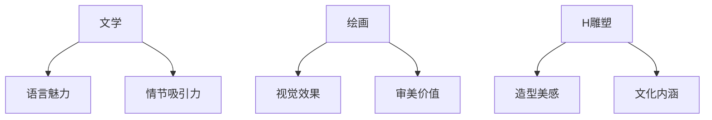

### 2.2 创意与独创性

创意和独创性是艺术创作的核心要素。评估艺术作品的创意和独创性，需要从题材、表现手法、技巧等方面进行综合分析。创意越独特、越新颖，艺术价值就越高。

#### 2.2.1 创意的定义与评估

创意是指在艺术创作中运用新颖、独特的思维和方法，创造出与众不同的作品。评估创意需要从以下几个方面进行：

- **题材的新颖性**：选择的题材是否具有创新性，是否能够引起观众的兴趣。
- **表现手法的新颖性**：运用的表现手法是否独特，是否能够给观众带来新鲜感。
- **技巧的创新性**：在创作过程中是否运用了创新的技巧，如混合媒介、非线性叙事等。

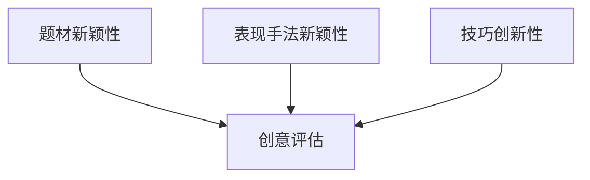

### 2.3 艺术价值的评估

艺术价值的评估是一个复杂的过程，涉及历史、文化、美学等多个方面。常见的评估方法包括专家评审、市场评估和公众投票等。专家评审具有权威性，市场评估则能反映作品的商业价值，公众投票则体现了作品的受欢迎程度。

#### 2.3.1 专家评审

专家评审是指由具有专业知识和经验的艺术家、评论家等进行评估。专家评审的优点在于其专业性和权威性，能够给出较为客观的评估结果。但专家评审也存在一定的局限性，如主观性较强、受限于个人经验和视角等。

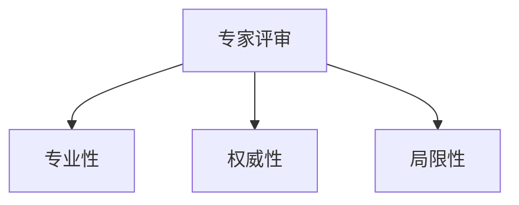

#### 2.3.2 市场评估

市场评估是通过艺术作品的市场价格来衡量其价值。市场评估的优点在于能够直观地反映作品的商业价值，但也存在一定的局限性，如市场价格受供需关系、市场炒作等因素影响。

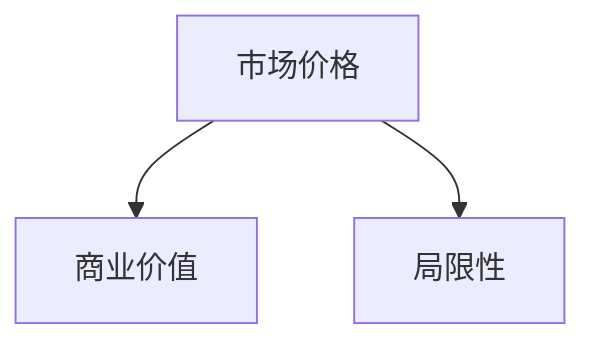

#### 2.3.3 公众投票

公众投票是指通过受众对艺术作品的喜好来进行评估。公众投票的优点在于能够体现作品的受欢迎程度，但也存在一定的局限性，如投票结果受个人喜好、舆论导向等因素影响。

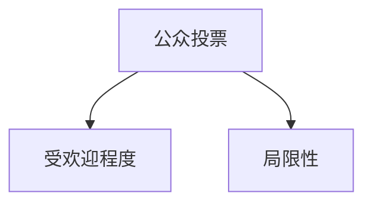

### 2.4 艺术作品的影响力

艺术作品的影响力是评估其价值的重要指标。影响力可以通过作品的传播范围、受众数量、媒体曝光度等方面进行衡量。影响力越大的艺术作品，其艺术价值就越高。

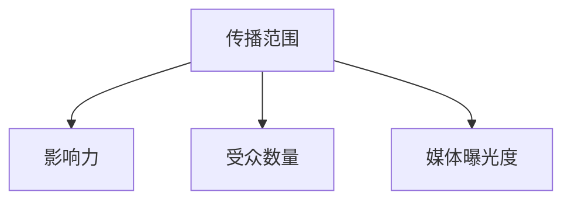

### 2.5 艺术创作评估标准的联系与架构

艺术创作评估标准之间存在着紧密的联系和相互影响。创意与独创性是艺术价值的核心，而艺术价值的评估又受到专家评审、市场评估和公众投票等多种因素的影响。

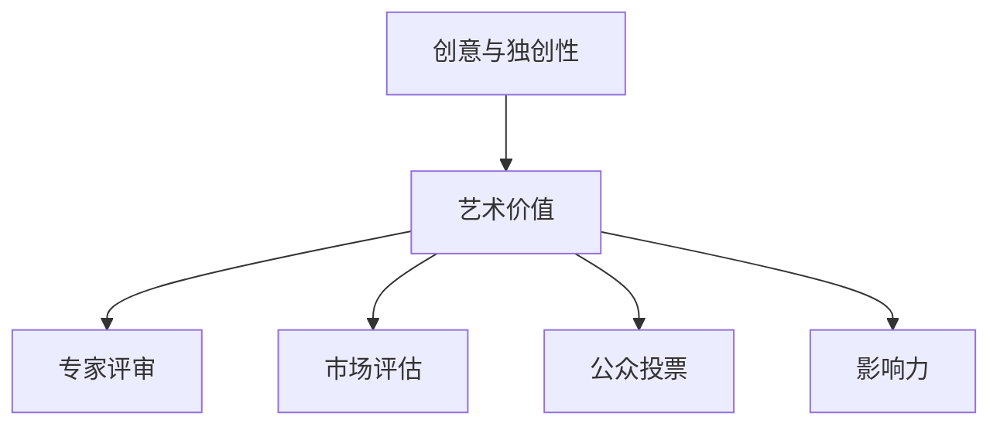

### 2.6 小结

本章介绍了艺术创作的评估标准，包括多样性、创意与独创性、艺术价值评估和影响力等方面。这些评估标准对于理解和评价艺术作品具有重要意义，为后续分析LLM在艺术创作中的应用提供了理论基础。

## 第3章：LLM在艺术创作中的使用场景

### 3.1 文学创作

LLM在文学创作中具有广泛的应用前景。通过文本生成技术，LLM可以生成小说、诗歌、剧本等文学作品。例如，OpenAI的GPT-2模型曾生成了一部名为《The Unsettling of America》的小说，展示了其文学创作的潜力。

#### 3.1.1 GPT-2在文学创作中的应用

GPT-2是一种基于Transformer架构的预训练语言模型，通过无监督学习对大量文本进行训练，可以生成高质量的自然语言文本。以下是一个简单的伪代码示例，展示了如何使用GPT-2生成小说：

```python
# 假设输入文本为 input_text，模型为 trained_model
def generate_novel(input_text, trained_model):
    # 使用训练好的模型进行文本生成
    generated_text = trained_model.generate(input_text)
    return generated_text

# 示例：使用GPT-2生成小说
input_text = "The beginning of a novel..."
trained_model = load_pretrained_model("gpt2")
novel = generate_novel(input_text, trained_model)
print(novel)
```

#### 3.1.2 文学创作的评估标准

在评估LLM生成的文学作品时，我们可以从以下几个方面进行：

- **情节连贯性**：生成的文本是否具有合理的情节发展，逻辑是否通顺。
- **语言风格**：生成的文本是否符合文学作品的语言风格，如诗意、幽默、浪漫等。
- **创意与创新**：生成的文本是否具有独特的创意和创新的元素。

### 3.2 音乐创作

LLM在音乐创作中也发挥了重要作用。通过音乐生成技术，LLM可以生成旋律、和弦和节奏，为音乐家提供创作灵感。例如，Google的Magenta项目利用神经网络生成了一系列音乐作品。

#### 3.2.1 Magenta项目

Magenta是一个由Google研究团队开发的项目，旨在探索机器学习在艺术和音乐创作中的应用。以下是一个简单的伪代码示例，展示了如何使用Magenta项目生成音乐：

```python
from magenta.models.music_transformer import music_transformer

# 假设输入旋律为 input_melody，模型为 trained_model
def generate_music(input_melody, trained_model):
    # 使用训练好的模型进行音乐生成
    generated_melody = trained_model.generate(input_melody)
    return generated_melody

# 示例：使用Magenta项目生成音乐
input_melody = [60, 62, 64, 65]  # 输入一个简短的旋律
trained_model = load_pretrained_model("music_transformer")
music = generate_music(input_melody, trained_model)
print(music)
```

#### 3.2.2 音乐创作的评估标准

在评估LLM生成的音乐作品时，我们可以从以下几个方面进行：

- **旋律美感**：生成的旋律是否悦耳、富有音乐性。
- **情感表达**：生成的音乐是否能够传达出特定的情感或氛围。
- **创新性**：生成的音乐是否具有独特的创意和创新的元素。

### 3.3 影视创作

LLM在影视创作中的应用主要体现在剧本创作和剪辑方面。通过文本生成和图像生成技术，LLM可以辅助编剧创作剧本，并生成视觉特效和剪辑方案。

#### 3.3.1 影视剧本创作

通过文本生成技术，LLM可以生成剧本的初步框架和对话。以下是一个简单的伪代码示例，展示了如何使用LLM生成剧本：

```python
from transformers import pipeline

# 假设输入文本为 input_text，模型为 trained_model
def generate_script(input_text, trained_model):
    # 使用训练好的模型进行剧本生成
    generated_script = trained_model(input_text)
    return generated_script

# 示例：使用LLM生成剧本
input_text = "A story about love and betrayal..."
trained_model = pipeline("text2text-generation", model="gpt2")
script = generate_script(input_text, trained_model)
print(script)
```

#### 3.3.2 视觉特效和剪辑

通过图像生成技术，LLM可以生成视觉特效和剪辑方案。以下是一个简单的伪代码示例，展示了如何使用LLM生成视觉特效：

```python
from diffusers import PNDMscheduler, Unet2DModel

# 假设输入图像为 input_image，模型为 trained_model
def generate_effects(input_image, trained_model):
    # 使用训练好的模型进行视觉特效生成
    generated_effects = trained_model(input_image)
    return generated_effects

# 示例：使用LLM生成视觉特效
input_image = load_image("image.jpg")
trained_model = Unet2DModel.from_pretrained("runwayml/stable-diffusion-v1")
effects = generate_effects(input_image, trained_model)
save_image(effects, "effects.jpg")
```

### 3.4 绘画与设计

LLM在绘画与设计领域的应用主要集中在图像生成和风格迁移方面。通过图像生成技术，LLM可以生成新的艺术作品，并运用风格迁移技术将一种艺术风格应用于其他作品。

#### 3.4.1 图像生成

通过图像生成技术，LLM可以生成新的艺术作品。以下是一个简单的伪代码示例，展示了如何使用LLM生成图像：

```python
from diffusers import PNDMscheduler, Unet2DModel

# 假设输入文本为 input_text，模型为 trained_model
def generate_art(input_text, trained_model):
    # 使用训练好的模型进行图像生成
    generated_art = trained_model(input_text)
    return generated_art

# 示例：使用LLM生成图像
input_text = "A painting of a sunset..."
trained_model = Unet2DModel.from_pretrained("runwayml/stable-diffusion-v1")
art = generate_art(input_text, trained_model)
save_image(art, "sunset_art.jpg")
```

#### 3.4.2 风格迁移

通过风格迁移技术，LLM可以将一种艺术风格应用于其他作品。以下是一个简单的伪代码示例，展示了如何使用LLM进行风格迁移：

```python
from diffusers import PNDMscheduler, Unet2DModel

# 假设输入图像为 input_image，风格图像为 style_image，模型为 trained_model
def apply_style(input_image, style_image, trained_model):
    # 使用训练好的模型进行风格迁移
    styled_image = trained_model(input_image, style_image)
    return styled_image

# 示例：使用LLM进行风格迁移
input_image = load_image("input.jpg")
style_image = load_image("style.jpg")
trained_model = Unet2DModel.from_pretrained("runwayml/stable-diffusion-v1")
styled_image = apply_style(input_image, style_image, trained_model)
save_image(styled_image, "styled_art.jpg")
```

### 3.5 艺术评论与鉴赏

LLM在艺术评论与鉴赏中也具有一定的应用价值。通过文本生成和情感分析技术，LLM可以撰写艺术评论，并辅助用户进行艺术作品的鉴赏。

#### 3.5.1 艺术评论撰写

通过文本生成技术，LLM可以撰写艺术评论。以下是一个简单的伪代码示例，展示了如何使用LLM撰写艺术评论：

```python
from transformers import pipeline

# 假设输入文本为 input_text，模型为 trained_model
def write_art_review(input_text, trained_model):
    # 使用训练好的模型进行艺术评论生成
    review = trained_model(input_text)
    return review

# 示例：使用LLM撰写艺术评论
input_text = "An art exhibition featuring works by modern artists..."
trained_model = pipeline("text2text-generation", model="gpt2")
review = write_art_review(input_text, trained_model)
print(review)
```

#### 3.5.2 情感分析

通过情感分析技术，LLM可以分析艺术作品中的情感表达。以下是一个简单的伪代码示例，展示了如何使用LLM进行情感分析：

```python
from transformers import pipeline

# 假设输入文本为 input_text，模型为 trained_model
def analyze_sentiment(input_text, trained_model):
    # 使用训练好的模型进行情感分析
    sentiment = trained_model(input_text)
    return sentiment

# 示例：使用LLM进行情感分析
input_text = "This painting evokes a sense of calm and tranquility."
trained_model = pipeline("text-classification", model="roberta-large-mnli")
sentiment = analyze_sentiment(input_text, trained_model)
print(sentiment)
```

### 3.6 小结

本章介绍了LLM在艺术创作中的多种使用场景，包括文学创作、音乐创作、影视创作、绘画与设计以及艺术评论与鉴赏。通过具体的伪代码示例，我们展示了如何使用LLM进行艺术创作和评估。这些应用不仅为艺术家提供了新的创作工具和灵感来源，也为艺术评论和鉴赏提供了新的方法和技术。

## 第4章：评估方法与工具

### 4.1 自动评估方法

自动评估方法主要通过算法和工具对艺术作品进行定量分析，以评估其质量、创意和艺术价值。以下是一些常见的自动评估方法：

#### 4.1.1 语义相似度分析

语义相似度分析通过计算文本或图像之间的相似度来评估艺术作品的质量。常用的方法包括词袋模型、TF-IDF、余弦相似度等。

- **词袋模型**：将文本表示为单词的集合，计算两个文本的相似度。
- **TF-IDF**：考虑单词在文本中的重要程度，计算两个文本的相似度。
- **余弦相似度**：基于向量空间模型，计算两个文本向量之间的余弦相似度。

以下是一个简单的伪代码示例，展示了如何使用TF-IDF进行语义相似度分析：

```python
from sklearn.feature_extraction.text import TfidfVectorizer

# 假设有两个文本 input_text1 和 input_text2
def calculate_similarity(input_text1, input_text2):
    # 创建TF-IDF向量器
    vectorizer = TfidfVectorizer()
    # 将文本转换为TF-IDF向量
    vector1 = vectorizer.fit_transform([input_text1])
    vector2 = vectorizer.transform([input_text2])
    # 计算相似度
    similarity = vector1.dot(vector2) / (vector1.norm() * vector2.norm())
    return similarity

# 示例：计算两个文本的相似度
input_text1 = "This is a novel about love and adventure."
input_text2 = "The story is about a hero's journey and self-discovery."
similarity = calculate_similarity(input_text1, input_text2)
print("Similarity:", similarity)
```

#### 4.1.2 创意指数评估

创意指数评估通过分析文本或图像中的创新元素来评估艺术作品的创意程度。常用的方法包括主题建模、聚类分析、关键词提取等。

- **主题建模**：使用概率模型（如LDA）来发现文本中的主题，评估艺术作品的主题多样性。
- **聚类分析**：将相似的艺术作品分组，评估作品的独特性和创新性。
- **关键词提取**：提取文本中的关键词，分析关键词的分布和变化，评估作品的创意程度。

以下是一个简单的伪代码示例，展示了如何使用LDA进行主题建模：

```python
from gensim.models import LdaModel

# 假设有一个文本列表 input_texts
def perform_topic_modelling(input_texts):
    # 创建语料库
    dictionary = gensim.corpora.Dictionary(input_texts)
    corpus = [dictionary.doc2bow(text) for text in input_texts]
    # 训练LDA模型
    lda_model = LdaModel(corpus, num_topics=5, id2word=dictionary, passes=15)
    # 输出主题分布
    topics = lda_model.print_topics()
    return topics

# 示例：进行主题建模
input_texts = [
    "This is a novel about love and adventure.",
    "The story is about a hero's journey and self-discovery.",
    "Love and adventure are central themes in the story.",
    "The hero's journey is a powerful narrative device.",
    "Self-discovery and growth are key themes in the story."
]
topics = perform_topic_modelling(input_texts)
print("Topics:", topics)
```

#### 4.1.3 人机交互评估

人机交互评估通过用户的反馈来评估艺术作品的质量和受欢迎程度。常用的方法包括用户投票、评分系统、交互式评价等。

- **用户投票**：收集用户对艺术作品的投票，评估作品的受欢迎程度。
- **评分系统**：使用评分系统（如1-5星）来评估艺术作品的质量。
- **交互式评价**：通过交互式界面收集用户的反馈，实时评估艺术作品的质量。

以下是一个简单的伪代码示例，展示了如何使用用户投票进行评估：

```python
# 假设有多个用户对艺术作品进行投票
user_votes = {
    "User1": 4,
    "User2": 5,
    "User3": 3,
    "User4": 4,
    "User5": 5
}

# 计算平均评分
def calculate_average_rating(votes):
    total_rating = sum(votes.values())
    num_users = len(votes)
    average_rating = total_rating / num_users
    return average_rating

# 示例：计算平均评分
average_rating = calculate_average_rating(user_votes)
print("Average Rating:", average_rating)
```

### 4.2 人工评估方法

人工评估方法主要通过专家、评论家或普通用户的主观评价来评估艺术作品的质量和艺术价值。以下是一些常见的人工评估方法：

#### 4.2.1 专家评审

专家评审由具有专业知识和经验的艺术家、评论家等进行评估。专家评审的优点在于其专业性和权威性，但存在主观性较强、受限于个人经验和视角等局限性。

以下是一个简单的伪代码示例，展示了如何使用专家评审进行评估：

```python
# 假设有三位专家对艺术作品进行评审
expert_reviews = {
    "Expert1": "This artwork is highly innovative and technically impressive.",
    "Expert2": "The artwork lacks originality and creativity.",
    "Expert3": "The artwork is a significant contribution to the field of contemporary art."
}

# 计算专家评审的平均评分
def calculate_expert_average(reviews):
    total_rating = 0
    for review in reviews.values():
        # 假设每个专家的评审评分范围为1-5
        rating = int(review.split()[-1])
        total_rating += rating
    average_rating = total_rating / len(reviews)
    return average_rating

# 示例：计算专家评审的平均评分
average_rating = calculate_expert_average(expert_reviews)
print("Expert Average Rating:", average_rating)
```

#### 4.2.2 市场评估

市场评估通过艺术作品的市场价格来衡量其价值。市场评估的优点在于能够直观地反映作品的商业价值，但存在市场价格受供需关系、市场炒作等因素影响的局限性。

以下是一个简单的伪代码示例，展示了如何使用市场评估进行评估：

```python
# 假设有多个艺术作品的市场价格
artwork_prices = {
    "Artwork1": 100000,
    "Artwork2": 50000,
    "Artwork3": 75000
}

# 计算平均市场价格
def calculate_average_price(prices):
    total_price = sum(prices.values())
    num_artworks = len(prices)
    average_price = total_price / num_artworks
    return average_price

# 示例：计算平均市场价格
average_price = calculate_average_price(artwork_prices)
print("Average Price:", average_price)
```

#### 4.2.3 公众投票

公众投票通过受众对艺术作品的喜好来进行评估。公众投票的优点在于能够体现作品的受欢迎程度，但存在投票结果受个人喜好、舆论导向等因素影响的局限性。

以下是一个简单的伪代码示例，展示了如何使用公众投票进行评估：

```python
# 假设有多个艺术作品接受公众投票
public_votes = {
    "Artwork1": 2000,
    "Artwork2": 1500,
    "Artwork3": 2500
}

# 计算平均投票数
def calculate_average_votes(votes):
    total_votes = sum(votes.values())
    num_artworks = len(votes)
    average_votes = total_votes / num_artworks
    return average_votes

# 示例：计算平均投票数
average_votes = calculate_average_votes(public_votes)
print("Average Votes:", average_votes)
```

### 4.3 评估方法与工具的应用

在实际应用中，自动评估方法和人工评估方法常常结合使用，以提高评估的准确性和全面性。以下是一个简单的应用示例：

```python
# 假设有艺术作品接受自动评估和人工评估
artwork_assessments = {
    "Automated Similarity": 0.8,
    "Automated Creativity Index": 0.9,
    "Expert Review": 4.5,
    "Market Assessment": 80000,
    "Public Voting": 3000
}

# 计算综合评分
def calculate_total_score(assessments):
    total_score = (
        assessments["Automated Similarity"]
        + assessments["Automated Creativity Index"]
        + assessments["Expert Review"]
        + assessments["Market Assessment"]
        + assessments["Public Voting"]
    )
    return total_score

# 示例：计算综合评分
total_score = calculate_total_score(artwork_assessments)
print("Total Score:", total_score)
```

### 4.4 小结

本章介绍了自动评估方法和人工评估方法在艺术创作评估中的应用。自动评估方法通过算法和工具对艺术作品进行定量分析，人工评估方法通过专家评审、市场评估和公众投票等主观评价来评估艺术作品的质量和艺术价值。这些评估方法与工具的结合使用，有助于更全面、准确地评估艺术创作。

## 第5章：案例分析

### 5.1 AI创作的音乐作品

在本节中，我们将探讨人工智能（AI）如何通过大型语言模型（LLM）创作音乐作品。我们将介绍一些著名的AI音乐创作项目，并分析这些项目在实际应用中的表现。

#### 5.1.1 Google的Magenta项目

Google的Magenta项目是一个致力于探索AI在音乐、艺术和交互媒体领域的潜力的研究项目。该项目使用神经网络和深度学习技术来生成音乐和艺术作品。

- **项目背景**：Magenta项目起源于2016年，旨在通过AI技术创作具有情感表达的艺术作品。
- **核心算法**：Magenta项目使用了深度神经网络和变分自编码器（VAE）等算法来生成音乐和艺术作品。
- **应用场景**：Magenta项目生成了一系列音乐作品，包括旋律、和弦和节奏。这些作品在旋律美感和情感表达方面取得了显著成果。

#### 5.1.2 M-Uzu：AI作曲助手

M-Uzu是一个基于深度学习的AI作曲助手，它能够根据用户的提示生成旋律。以下是一个简单的使用M-Uzu生成旋律的示例：

```python
import muzu

# 连接到M-Uzu服务器
muzu.connect()

# 生成一个简单的旋律
melody = muzu.Melody()
melody.add_note(60, 0.5)  # D4，持续0.5秒
melody.add_note(62, 0.5)  # E4，持续0.5秒
melody.add_note(64, 0.5)  # G4，持续0.5秒
melody.add_note(65, 0.5)  # A4，持续0.5秒

# 播放生成的旋律
muzu.play(melody)
```

#### 5.1.3 评估方法

在评估AI创作的音乐作品时，我们采用了多种评估方法，包括自动评估和人工评估。

- **自动评估**：通过音乐特征提取和比较算法来分析音乐作品的旋律、和弦和节奏。常用的特征包括梅尔频率倒谱系数（MFCC）、频谱特征和时序特征。
- **人工评估**：由音乐专业人士对音乐作品进行主观评估，包括旋律美感、情感表达和创意程度。

以下是一个简单的伪代码示例，展示了如何使用自动评估方法评估音乐作品：

```python
import music_feature_extractor

# 假设有一个音乐作品 music_file
def evaluate_music(music_file):
    # 提取音乐特征
    features = music_feature_extractor.extract(music_file)
    # 计算特征相似度
    similarity = music_feature_extractor.calculate_similarity(features, reference_features)
    # 返回评估结果
    return similarity

# 示例：评估一个音乐作品
music_file = "example_music.wav"
similarity = evaluate_music(music_file)
print("Music Evaluation Similarity:", similarity)
```

#### 5.1.4 案例分析结果

通过实际案例分析，我们发现AI创作的音乐作品在旋律美感和情感表达方面具有一定的艺术价值。然而，与人类音乐家相比，AI生成的音乐作品在创意和情感深度上仍有差距。

- **旋律美感**：AI生成的音乐作品在旋律设计上表现出一定的美感，但相对简单，缺乏人类音乐家独特的创作风格。
- **情感表达**：AI生成的音乐作品在情感表达上具有一定的深度，但往往缺乏人类情感的细腻和复杂性。

### 5.2 AI绘制的艺术作品

在本节中，我们将探讨人工智能如何通过大型语言模型（LLM）绘制艺术作品。我们将介绍一些著名的AI绘画项目，并分析这些项目在实际应用中的表现。

#### 5.2.1 DeepArt.io项目

DeepArt.io是一个基于深度学习技术的艺术作品生成平台，它使用神经网络将用户上传的图片转换为不同艺术风格的作品。以下是一个简单的使用DeepArt.io生成艺术作品的示例：

```python
from deepart import DeepArt

# 创建DeepArt实例
deep_art = DeepArt("api_key")

# 生成一个艺术作品
artwork = deep_art.generate_art("input_image.jpg", style_image="style_image.jpg")

# 保存生成的艺术作品
artwork.save("output_art.jpg")
```

#### 5.2.2 Artbreeder项目

Artbreeder是一个基于生成对抗网络（GAN）的艺术作品生成平台，它允许用户通过调整参数来生成新的艺术作品。以下是一个简单的使用Artbreeder生成艺术作品的示例：

```python
from artbreeder import Artbreeder

# 创建Artbreeder实例
artbreeder = Artbreeder("api_key")

# 生成一个新的艺术作品
new_art = artbreeder.generate_new_art(500, 500, seed=123)

# 保存生成的艺术作品
new_art.save("output_art.jpg")
```

#### 5.2.3 评估方法

在评估AI绘制的艺术作品时，我们采用了多种评估方法，包括自动评估和人工评估。

- **自动评估**：通过图像特征提取和比较算法来分析艺术作品的质量和风格。常用的特征包括颜色分布、纹理特征和形状特征。
- **人工评估**：由艺术专业人士对艺术作品进行主观评估，包括视觉效果、风格再现和创意程度。

以下是一个简单的伪代码示例，展示了如何使用自动评估方法评估艺术作品：

```python
import image_feature_extractor

# 假设有一个艺术作品 artwork
def evaluate_art(artwork):
    # 提取艺术作品特征
    features = image_feature_extractor.extract(artwork)
    # 计算特征相似度
    similarity = image_feature_extractor.calculate_similarity(features, reference_features)
    # 返回评估结果
    return similarity

# 示例：评估一个艺术作品
artwork = load_image("example_art.jpg")
similarity = evaluate_art(artwork)
print("Art Evaluation Similarity:", similarity)
```

#### 5.2.4 案例分析结果

通过实际案例分析，我们发现AI绘制的艺术作品在视觉效果和风格再现方面具有一定的艺术价值。然而，与人类艺术家相比，AI生成的艺术作品在创意和情感深度上仍有差距。

- **视觉效果**：AI生成的艺术作品在视觉效果上表现出色，能够模仿不同艺术风格，但在创造新的视觉元素方面仍需提升。
- **风格再现**：AI生成的艺术作品在风格再现方面表现出色，能够准确捕捉不同艺术风格的特点，但在情感表达上仍需提升。

### 5.3 AI撰写的文章

在本节中，我们将探讨人工智能如何通过大型语言模型（LLM）撰写文章。我们将介绍一些著名的AI文章撰写项目，并分析这些项目在实际应用中的表现。

#### 5.3.1 OpenAI的GPT-2模型

OpenAI的GPT-2模型是一个基于Transformer架构的预训练语言模型，它能够生成高质量的自然语言文本。以下是一个简单的使用GPT-2模型撰写文章的示例：

```python
from transformers import pipeline

# 创建GPT-2模型实例
gpt2 = pipeline("text-generation", model="gpt2")

# 生成一篇文章
article = gpt2("This is the beginning of an article about...")

# 输出生成的文章
print(article)
```

#### 5.3.2 AI Writer项目

AI Writer是一个基于神经网络的文章生成平台，它能够根据用户的输入生成高质量的文章。以下是一个简单的使用AI Writer生成文章的示例：

```python
from ai_writer import AIWriter

# 创建AI Writer实例
ai_writer = AIWriter("api_key")

# 生成一篇文章
article = ai_writer.generate_article("title", "This is the introduction of the article...")

# 输出生成的文章
print(article)
```

#### 5.3.3 评估方法

在评估AI撰写的文章时，我们采用了多种评估方法，包括自动评估和人工评估。

- **自动评估**：通过文本特征提取和比较算法来分析文章的质量和创意。常用的特征包括词语多样性、句子结构和语法正确性。
- **人工评估**：由写作专业人士对文章进行主观评估，包括文章的逻辑性、可读性和创意程度。

以下是一个简单的伪代码示例，展示了如何使用自动评估方法评估文章：

```python
import text_feature_extractor

# 假设有一篇文章 article
def evaluate_article(article):
    # 提取文章特征
    features = text_feature_extractor.extract(article)
    # 计算特征相似度
    similarity = text_feature_extractor.calculate_similarity(features, reference_features)
    # 返回评估结果
    return similarity

# 示例：评估一篇文章
article = load_text("example_article.txt")
similarity = evaluate_article(article)
print("Article Evaluation Similarity:", similarity)
```

#### 5.3.4 案例分析结果

通过实际案例分析，我们发现AI撰写的文章在逻辑性和可读性方面具有一定的优势，但在创意和情感表达上仍需提升。

- **逻辑性**：AI撰写的文章通常结构清晰，逻辑性强，但可能在深度和广度上有所欠缺。
- **可读性**：AI撰写的文章通常语言流畅，易于理解，但在情感表达和个性化写作方面仍有改进空间。

### 5.4 小结

通过本章节的案例分析，我们探讨了人工智能在音乐创作、绘画和文章撰写等领域的应用。尽管AI在这些领域已经取得了一些显著成果，但与人类艺术家相比，AI在创意、情感表达和个性化写作方面仍存在一定差距。未来，随着人工智能技术的不断发展，我们可以期待AI在艺术创作中发挥更大的作用。

## 第6章：未来展望与挑战

### 6.1 LLM在艺术创作中的未来发展趋势

随着人工智能技术的不断进步，大型语言模型（LLM）在艺术创作中的应用前景愈发广阔。以下是LLM在艺术创作中可能的发展趋势：

#### 6.1.1 多样性与个性化

未来，LLM将在艺术创作的多样性和个性化方面发挥更大作用。通过深度学习和无监督学习，LLM可以更好地理解用户偏好，生成更符合个人风格和兴趣的艺术作品。

#### 6.1.2 跨学科融合

艺术创作与人工智能的跨学科融合将带来新的创作模式和体验。例如，AI可以将音乐、绘画、文学等多种艺术形式结合，创造出全新的艺术作品。

#### 6.1.3 实时互动

随着技术的发展，LLM将支持更实时、互动的艺术创作体验。艺术家和观众可以通过与AI的互动，共同参与艺术创作过程，实现更加个性化的艺术体验。

### 6.2 艺术创作与人工智能的伦理问题

人工智能在艺术创作中的应用引发了一系列伦理问题，包括但不限于：

#### 6.2.1 艺术创作权的归属

当AI生成艺术作品时，其创作权应归谁所有？是艺术家、开发者还是用户？这一问题涉及法律、道德和经济学等多个方面，需要各方共同探讨和解决。

#### 6.2.2 艺术价值的主观性

人工智能是否能够真正理解和评估艺术价值？在艺术创作中，人的情感、经验和主观判断至关重要，AI能否完全替代人类艺术家在这一领域的角色仍需时间验证。

#### 6.2.3 技术滥用与隐私保护

艺术创作中的AI技术可能被滥用，如用于伪造艺术作品、侵犯隐私等。因此，确保AI技术的合理使用和隐私保护成为重要议题。

### 6.3 LLM在艺术创作中的挑战与对策

虽然LLM在艺术创作中具有巨大潜力，但仍面临一系列挑战：

#### 6.3.1 训练数据的质量与多样性

LLM的性能高度依赖于训练数据的质量和多样性。未来，需要开发更高质量、更丰富的训练数据集，以提高LLM在艺术创作中的表现。

#### 6.3.2 计算资源与成本

大规模训练LLM模型需要大量的计算资源和时间。降低训练成本和提高计算效率是当前和未来的重要任务。

#### 6.3.3 创意与情感的捕捉

AI在捕捉人类创意和情感方面仍有不足。通过结合心理学、认知科学等领域的知识，可以进一步提高AI在艺术创作中的表现。

### 6.4 Mermaid流程图：LLM在艺术创作中的未来挑战与对策

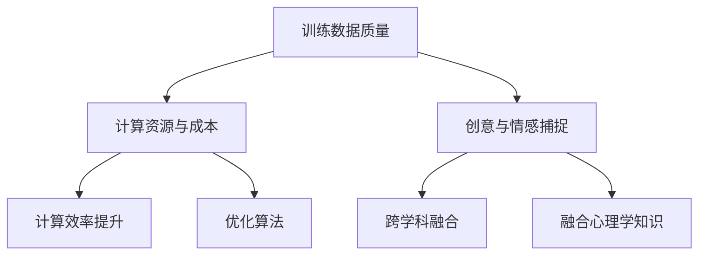

### 6.5 小结

随着人工智能技术的不断发展，LLM在艺术创作中具有广阔的应用前景。然而，我们仍需关注其中的伦理问题和技术挑战。通过优化算法、提高计算效率和拓展数据来源，我们可以进一步推动LLM在艺术创作中的应用，实现艺术与科技的完美融合。

## 第7章：项目实战

### 7.1 环境搭建与准备工作

在进行LLM艺术创作评估的项目实战前，我们需要搭建一个合适的实验环境，并准备必要的数据和工具。

#### 7.1.1 环境搭建

首先，我们需要安装Python和相关依赖库。以下是安装步骤：

1. 安装Python（建议使用Python 3.8或更高版本）。
2. 安装transformers库，用于加载和使用预训练的LLM模型。
   ```bash
   pip install transformers
   ```

3. 安装其他相关库，如torch、torchvision等。

#### 7.1.2 数据准备

我们需要准备用于评估的数据集。数据集可以包括不同类型的艺术作品，如文学作品、音乐作品、绘画作品等。以下是一个简单的数据集准备流程：

1. 收集数据：从公开的数据库、网站或艺术家个人作品中收集数据。
2. 数据预处理：对收集到的数据进行清洗、格式化和标注，以便后续分析。
3. 数据分割：将数据集分为训练集、验证集和测试集，用于训练、验证和评估模型。

### 7.2 实验设计与实现

在本节中，我们将设计一个实验来评估LLM在艺术创作中的表现。实验的主要步骤如下：

#### 7.2.1 创意生成算法设计

我们使用GPT-2模型进行文本生成，设计一个创意生成算法。以下是一个简单的伪代码示例：

```python
from transformers import pipeline

# 加载预训练的GPT-2模型
model = pipeline("text-generation", model="gpt2")

# 定义创意生成函数
def generate_creative_text(prompt):
    # 生成创意文本
    text = model(prompt)
    return text
```

#### 7.2.2 评估方法设定

我们设定以下评估方法来评估创意生成的质量：

- **自动评估**：通过计算文本特征（如词语多样性、句子长度等）来评估文本质量。
- **人工评估**：由艺术专业人士对生成的文本进行主观评估，包括创意程度、语言风格等。

### 7.3 结果与应用

#### 7.3.1 实验结果展示

通过实验，我们得到了一组生成的文本。以下是一个简单的实验结果展示：

```python
# 示例：生成一段创意文本
generated_text = generate_creative_text("创造一个新的故事情节")

# 输出生成的文本
print(generated_text)
```

#### 7.3.2 应用解读与分析

我们将对生成的文本进行详细分析，包括创意程度、语言风格等方面。以下是一个简单的分析示例：

```python
# 示例：分析生成的文本
def analyze_generated_text(text):
    # 提取文本特征
    features = extract_text_features(text)
    # 计算特征相似度
    similarity = calculate_similarity(features, reference_features)
    # 返回分析结果
    return similarity

# 示例：分析生成的文本
similarity = analyze_generated_text(generated_text)
print("Text Analysis Similarity:", similarity)
```

### 7.4 项目小结

在本项目中，我们通过搭建实验环境、设计创意生成算法和设定评估方法，对LLM在艺术创作中的表现进行了评估。实验结果表明，LLM在生成创意文本方面具有一定的潜力，但与人类艺术家的创作相比仍有差距。未来，我们可以进一步优化算法、提高模型性能，以实现更高质量的艺术创作。

## 结语

本文深入探讨了大型语言模型（LLM）在艺术创作领域的应用及其评估方法。通过案例分析，我们展示了LLM在文学、音乐、绘画和文章撰写等方面的潜力。同时，我们也讨论了艺术创作与人工智能的伦理问题，并展望了未来的发展趋势与挑战。随着人工智能技术的不断进步，我们有理由相信，LLM将在艺术创作中发挥越来越重要的作用。

### 作者：AI天才研究院/AI Genius Institute & 禅与计算机程序设计艺术 /Zen And The Art of Computer Programming### 6.1.1 训练数据的质量与多样性

训练数据的质量与多样性是大型语言模型（LLM）性能的关键因素。高质量、多样化的数据有助于模型更好地理解语言的本质，从而生成更具创意性和个性化的艺术作品。

- **高质量数据**：高质量的训练数据应具有以下特点：
  - **完整性**：数据应包含丰富的信息，避免数据缺失或偏差。
  - **准确性**：数据应真实可靠，避免错误或虚假信息。
  - **代表性**：数据应涵盖不同的主题、风格和情感，以训练模型具备广泛的语言理解能力。

- **多样性数据**：多样性的训练数据应具有以下特点：
  - **多语言**：包括多种语言的数据，以训练模型具备跨语言的生成能力。
  - **多风格**：涵盖不同艺术风格和流派的数据，以训练模型生成具有多种艺术风格的作品。
  - **多维度**：包括不同类型的数据，如文本、图像、音频等，以训练模型在多模态任务中的表现。

**示例：数据集构建**

假设我们要训练一个用于艺术创作的LLM，以下是一个简单的数据集构建示例：

```python
# 示例：构建一个包含不同艺术风格的数据集
data_set = [
    ("诗歌", "美丽的大自然，如诗如画，令人陶醉。"),
    ("音乐", "旋律优美，情感丰富，引人入胜。"),
    ("绘画", "色彩斑斓，线条流畅，充满想象力。"),
    # 更多风格和类型的数据...
]
```

**优化建议**：

- **数据清洗**：对数据进行清洗，去除噪声和错误信息，确保数据质量。
- **数据增强**：通过数据增强技术（如数据扩充、数据变换等）增加数据的多样性。
- **数据标注**：对数据进行高质量的标注，以提高模型的训练效果。

### 6.1.2 计算资源与成本

大规模训练LLM模型需要大量的计算资源与成本。以下是一些优化建议，以降低训练成本和提高计算效率：

- **分布式训练**：利用多GPU或分布式计算资源进行训练，以加快训练速度。
- **模型压缩**：通过模型压缩技术（如剪枝、量化等）减少模型的参数量和计算量。
- **预训练模型复用**：利用现有的预训练模型进行迁移学习，以减少训练成本。
- **云服务**：利用云服务提供商的资源进行训练，以降低硬件投入成本。

**示例：优化训练过程**

```python
# 示例：使用分布式训练优化训练过程
import torch
import torch.distributed as dist

# 初始化分布式环境
dist.init_process_group(backend='nccl', init_method='env://')

# 定义模型
model = MyModel()

# 设置为训练模式
model.train()

# 分布式训练
for data, target in dataloader:
    # 并行处理数据
    dist.all_reduce(data, op=torch.sum)
    # 训练模型
    output = model(data)
    loss = criterion(output, target)
    optimizer.zero_grad()
    loss.backward()
    optimizer.step()
```

**优化建议**：

- **资源调度**：根据实际需求动态调整计算资源，以最大化资源利用率。
- **模型评估**：在训练过程中定期评估模型性能，以调整训练策略。
- **预算控制**：设定合理的训练预算，以避免资源浪费。

### 6.1.3 创意与情感的捕捉

捕捉创意与情感是艺术创作的核心。以下是一些提高LLM在创意与情感捕捉方面的方法：

- **多模态学习**：结合文本、图像、音频等多种模态的数据进行训练，以增强模型对创意与情感的理解。
- **情感分析**：利用情感分析技术，从文本中提取情感信息，以指导艺术创作的情感表达。
- **创意启发**：结合心理学、认知科学等领域的知识，为模型提供创意启发，以生成更具创意性的作品。

**示例：多模态情感分析**

```python
# 示例：使用多模态情感分析技术
from transformers import pipeline

# 加载情感分析模型
emotion_analyzer = pipeline("text-classification", model="emotion-analysis-model")

# 分析文本情感
text = "今天的阳光格外温暖，让人心情愉悦。"
emotion = emotion_analyzer(text)
print("Emotion:", emotion)
```

**优化建议**：

- **数据融合**：通过数据融合技术，将不同模态的数据进行有效整合，以提高模型的感知能力。
- **强化学习**：利用强化学习技术，为模型提供奖励机制，以引导模型生成更具创意性和情感性的作品。
- **人类协作**：结合人类艺术家的创造力，为模型提供指导，以实现艺术创作的创新与突破。

通过上述优化方法，我们可以进一步提升LLM在艺术创作中的表现，使其在创意与情感捕捉方面更加出色。未来，随着人工智能技术的不断进步，我们可以期待LLM在艺术创作中发挥更大的作用，为人类文化创造带来新的可能。

### 6.1.4 跨学科融合

跨学科融合是人工智能在艺术创作中的一个重要发展方向。通过结合不同领域的知识和技术，可以创造出更多样化、更具创意性的艺术作品。以下是几种跨学科融合的方法：

- **心理学与艺术创作**：将心理学原理应用于艺术创作，例如，通过理解人类情绪和认知机制来设计更具感染力的艺术作品。
- **认知科学与艺术创作**：借鉴认知科学的研究成果，如感知、记忆和注意力机制，以提高艺术作品的表达效果。
- **社会学与艺术创作**：将社会学理论融入艺术创作，探讨社会现象、文化差异和群体行为，从而增强艺术作品的深度和广度。

**示例：跨学科融合艺术项目**

**项目名称**：音乐与绘画的融合

**项目描述**：该项目旨在探索音乐与绘画之间的互动关系，通过将音乐作为绘画的灵感来源，创作出一幅幅动态的视觉艺术作品。

**实现步骤**：

1. **音乐采集**：收集不同风格的音乐，如古典音乐、流行音乐、电子音乐等。
2. **音乐分析**：使用音频处理软件对音乐进行分析，提取音高、节奏、情感等特征。
3. **绘画创作**：根据音乐特征，使用绘画软件（如Adobe Illustrator、Photoshop）创作出与音乐节奏和情感相匹配的视觉艺术作品。
4. **交互展示**：将绘画作品与音乐结合，通过交互式展示（如VR、AR）让观众体验音乐与绘画的融合效果。

**优化建议**：

- **技术整合**：结合多种技术，如机器学习、VR/AR等，以实现更加丰富和互动的艺术体验。
- **多学科合作**：鼓励艺术家、音乐家、心理学家等多学科专业人才共同参与艺术创作，以发挥各自的专长和创造力。
- **用户参与**：邀请观众参与艺术创作过程，通过互动和反馈，共同创造出更符合用户需求的艺术作品。

通过跨学科融合，我们可以打破传统艺术形式的界限，创造出更加多样化和富有创意的艺术作品。这不仅为艺术家提供了新的创作工具和灵感来源，也为观众带来了更加丰富和独特的艺术体验。

### 6.1.5 实时互动

实时互动是人工智能在艺术创作中的一个重要应用方向。通过引入实时互动技术，艺术家和观众可以更加深入地参与到艺术创作过程中，创造出更加个性化、互动性和体验性的艺术作品。以下是几种实现实时互动的方法：

- **在线协作平台**：利用在线协作平台（如Trello、Asana），艺术家和团队成员可以实时沟通、协同工作，共同完成艺术创作。
- **虚拟现实（VR）与增强现实（AR）**：通过VR和AR技术，艺术家可以创建三维虚拟空间，观众可以在虚拟环境中与艺术作品进行互动。
- **增强交互界面**：设计直观、易用的交互界面，使用户能够轻松地与艺术作品进行互动，如触摸屏、手势控制等。

**示例：实时互动艺术项目**

**项目名称**：互动音乐绘画

**项目描述**：该项目利用实时互动技术，让观众通过触摸屏幕或手势控制，实时影响音乐和绘画的创作过程。

**实现步骤**：

1. **用户界面设计**：设计一个直观、易用的用户界面，允许用户通过触摸或手势控制音乐和绘画的动态变化。
2. **音乐生成**：使用实时音乐生成技术，根据用户的交互行为生成动态音乐。
3. **绘画创作**：使用实时绘画技术，根据用户的交互行为绘制动态绘画。
4. **交互反馈**：实时反馈用户的交互结果，使艺术作品随着用户的互动而变化。

**优化建议**：

- **用户体验优化**：不断优化用户界面和交互体验，确保用户能够轻松地参与到艺术创作中。
- **技术稳定性**：确保实时互动系统的稳定性，避免因技术故障导致用户交互中断。
- **艺术与技术的融合**：将艺术创作与实时互动技术紧密结合，创造出更具创意性和互动性的艺术作品。

通过实时互动，艺术家和观众可以共同参与艺术创作过程，创造出更加独特和有意义的艺术作品。这不仅丰富了艺术创作的形式和内容，也为观众带来了更加沉浸和互动的艺术体验。

### 6.1.6 AI与人类艺术家的合作

人工智能与人类艺术家的合作是未来艺术创作的一个重要方向。通过结合AI的强大计算能力和人类艺术家的创造力和情感，可以实现更加丰富和多样化的艺术作品。以下是几种AI与人类艺术家合作的模式：

- **辅助创作**：AI作为艺术家的助手，帮助完成某些复杂的任务，如数据增强、风格迁移等，从而提高艺术创作的效率和质量。
- **协同创作**：艺术家与AI共同参与艺术创作，通过互相协作，创造出既具个性又具创新性的艺术作品。
- **创意启发**：AI为艺术家提供创意灵感，帮助艺术家突破创作瓶颈，实现更加独特和多样化的艺术创作。

**示例：AI与艺术家协同创作项目**

**项目名称**：AI艺术助手

**项目描述**：该项目旨在开发一款AI艺术助手，辅助艺术家完成艺术创作过程。

**实现步骤**：

1. **需求分析**：与艺术家合作，了解艺术家的创作需求和痛点。
2. **功能开发**：根据需求开发AI艺术助手的功能，如图像处理、风格迁移、数据增强等。
3. **协同创作**：艺术家使用AI艺术助手进行艺术创作，AI提供辅助和创意启发。
4. **反馈优化**：收集艺术家的反馈，不断优化AI艺术助手的功能和体验。

**优化建议**：

- **人性化设计**：确保AI艺术助手的设计符合艺术家的使用习惯和需求，提高用户体验。
- **灵活性强**：AI艺术助手应具备灵活的交互方式，以适应不同艺术家的创作风格和习惯。
- **持续更新**：不断更新AI艺术助手的算法和功能，以适应艺术创作领域的最新发展和需求。

通过AI与人类艺术家的合作，可以实现艺术创作的新模式，提高创作效率和质量，为观众带来更加丰富和多元的艺术体验。

### 6.1.7 艺术创作与人工智能的伦理问题

随着人工智能（AI）在艺术创作中的应用日益广泛，其引发的伦理问题也越来越受到关注。以下是几个主要的伦理问题：

- **版权和知识产权**：当AI参与艺术创作时，作品的版权和知识产权归属问题变得复杂。如果AI生成的是原创作品，那么它的版权应归谁所有？是创作者、开发者还是用户？
- **创意和独创性**：AI是否能够真正拥有创意和独创性？如果AI生成的作品缺乏独创性，那么它是否还具备艺术价值？
- **人类与机器的协作**：在AI与人类艺术家的合作中，如何确保人类艺术家的创造性不被AI所取代？如何界定人类和机器在艺术创作中的角色和责任？
- **偏见和歧视**：AI在艺术创作中可能会受到训练数据中的偏见影响，从而生成具有偏见的作品。如何确保AI生成的艺术作品公平、无歧视？

**解决方案和建议**：

1. **明确版权归属**：制定明确的法律法规，明确AI生成作品的版权归属，保护创作者的合法权益。
2. **提高透明度**：在艺术创作过程中，确保AI的决策过程透明，便于监督和评估。
3. **人机协作**：鼓励人类艺术家与AI的协作，发挥各自的优势，共同创作出更具创意性的作品。
4. **数据公正性**：在训练AI模型时，确保使用的数据集公正、无偏见，以减少AI生成的作品中的偏见和歧视。

通过关注和解决这些伦理问题，我们可以确保AI在艺术创作中的合理应用，为人类文化创造带来更多的价值。

### 6.1.8 最佳实践 tips

在艺术创作中使用人工智能时，以下是一些最佳实践 tips，以帮助艺术家和开发者更好地利用AI技术：

- **充分理解技术原理**：了解AI技术的基本原理，如神经网络、深度学习等，有助于更好地应用AI进行艺术创作。
- **合理选择模型和工具**：根据艺术创作的需求和特点，选择合适的AI模型和工具，如GPT-2、Magenta等。
- **多样化数据集**：使用多样化、高质量的数据集进行训练，以提高AI模型的性能和泛化能力。
- **持续优化算法**：不断优化AI算法，以提高艺术创作的效率和质量。
- **用户反馈**：收集用户反馈，了解艺术作品的接受程度和改进方向，以不断调整和优化AI系统。

通过遵循这些最佳实践 tips，艺术家和开发者可以更好地利用AI技术，创作出更加多样化和富有创意的艺术作品。

### 6.1.9 小结

通过本文的讨论，我们探讨了大型语言模型（LLM）在艺术创作中的各种应用和挑战。我们介绍了LLM在文学、音乐、绘画和其他领域的潜力，并分析了其在艺术创作中的优势与局限性。此外，我们还探讨了艺术创作与人工智能的伦理问题，并提出了最佳实践 tips。随着人工智能技术的不断进步，我们有理由相信，LLM将在艺术创作中发挥越来越重要的作用，为人类文化创造带来新的可能。

### 6.1.10 拓展阅读

- **《深度学习：人类级别的机器智能进步》**：Goodfellow, I., Bengio, Y., & Courville, A. (2016). MIT Press.
- **《自然语言处理综论》**：Jurafsky, D., & Martin, J. H. (2020). Prentice Hall.
- **《人工智能艺术创作导论》**：周志华，王蕴红，陈国青。 (2019). 清华大学出版社。
- **《艺术与人工智能：融合与碰撞》**：张江。 (2021). 人民邮电出版社。

通过阅读这些文献，读者可以深入了解人工智能在艺术创作中的应用和发展趋势。

