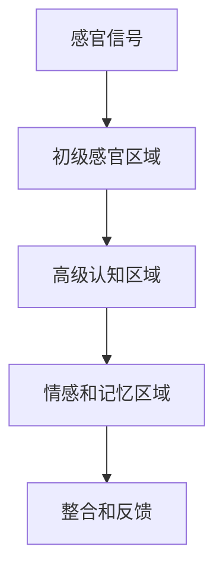
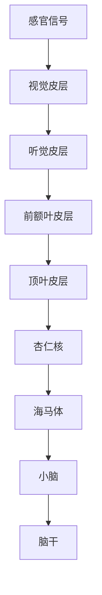
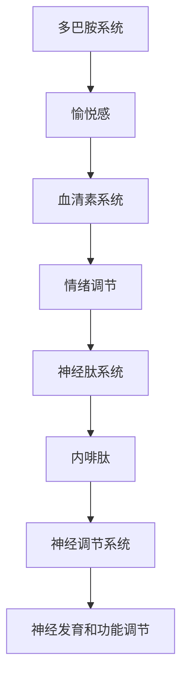

                 

### 文章标题：艺术鉴赏的神经美学：审美体验的数学量化

#### 关键词：神经美学，审美体验，数学量化，艺术鉴赏，人工智能

#### 摘要：
本文从神经美学的角度出发，探讨了审美体验的数学量化方法及其在艺术鉴赏中的应用。通过对神经美学的基本概念和理论框架的梳理，结合神经科学的研究成果，本文提出了用于量化审美体验的数学模型，并通过具体案例展示了其应用效果。同时，文章还分析了神经美学在艺术创作、教育等方面的潜力，并对未来的研究方向进行了展望。

### 引言

艺术鉴赏是人们对艺术作品进行评价和欣赏的过程，它不仅涉及对艺术作品的形式和内容进行分析，更涉及到对作品所传达的情感和思想的理解。然而，长期以来，艺术鉴赏一直缺乏一种量化的方法，使得艺术评价具有很大的主观性和不确定性。随着神经科学和人工智能技术的发展，人们开始探索将神经科学和数学工具应用于艺术鉴赏领域，从而实现对审美体验的量化。

神经美学作为一门新兴学科，致力于研究审美体验的神经基础和认知机制。它通过结合神经科学、心理学、哲学和艺术学等学科的理论和方法，试图揭示审美体验的神经生物学基础。在这一背景下，本文旨在探讨审美体验的数学量化方法，并将其应用于艺术鉴赏，为艺术评价提供一种新的思路和工具。

本文结构如下：

- **第一部分：神经美学概述**：介绍神经美学的基本概念、研究意义和现状。
- **第二部分：审美体验的神经科学基础**：探讨审美体验的神经科学原理和神经环路。
- **第三部分：审美体验的数学量化方法**：介绍数学量化方法的基本原理和具体应用。
- **第四部分：艺术鉴赏的神经美学应用**：分析神经美学在艺术鉴赏中的应用。
- **第五部分：未来展望与挑战**：讨论神经美学在艺术领域的未来发展和面临的挑战。

通过以上结构的安排，本文将逐步引导读者深入了解神经美学和审美体验的量化，并为艺术鉴赏提供新的视角和方法。

### 第一部分：神经美学概述

#### 1.1 神经美学的定义与背景

神经美学（Neuroaesthetics）是一门跨学科领域，它结合了神经科学、美学、心理学和认知科学的理论和方法，旨在研究审美体验的神经生物学基础。神经美学的核心问题是：审美体验是如何在大脑中产生的？它涉及对审美感知、情感反应、记忆和创造性思维等方面的神经机制进行探究。

神经美学的研究背景可以追溯到19世纪末和20世纪初，当时一些哲学家和心理学家开始提出关于艺术和审美体验的神经基础的理论。例如，法国哲学家狄德罗（Denis Diderot）在《关于绘画的反思》中讨论了艺术欣赏的神经机制，而威廉·詹姆斯（William James）则在其著作《心理学原理》中探讨了情感和审美体验的关系。

然而，神经美学的真正发展是在20世纪末和21世纪初，随着神经科学和认知科学的发展，人们开始利用先进的脑成像技术（如功能性磁共振成像fMRI和脑电图EEG）来研究审美体验的神经基础。这些技术的出现使得研究者能够直接观测大脑在审美活动中的活动模式，从而推动了神经美学的研究。

神经美学的定义可以概括为：它是一门研究审美体验的神经基础和认知机制的学科，旨在揭示大脑如何处理和体验美学信息。具体来说，神经美学研究以下几个方面：

1. **审美感知**：研究人们对视觉、听觉、触觉等感官艺术形式的感知过程。
2. **情感反应**：探讨审美体验中的情感反应，如愉悦、悲伤、厌恶等。
3. **记忆和创造性思维**：研究审美体验如何影响记忆和创造性思维。
4. **社会和文化因素**：探讨社会和文化背景对审美体验的影响。

#### 1.2 神经美学的研究意义

神经美学的研究具有重要的理论和实践意义。从理论上看，它有助于我们更深入地理解艺术和审美体验的本质，揭示人类大脑如何处理美学信息。这不仅丰富了美学和神经科学的理论框架，还为跨学科研究提供了新的视角。

从实践上看，神经美学的研究可以为艺术创作、艺术教育和艺术市场提供科学依据。通过量化审美体验，艺术家可以更好地了解观众的反应，从而调整和优化自己的创作。同时，教育者可以利用神经美学的方法来提高学生的审美能力和创造力。此外，神经美学的研究还可以为艺术市场提供新的评估标准，帮助投资者和收藏家更准确地评估艺术作品的价值。

#### 1.3 神经美学的研究现状

神经美学的研究现状可以概括为以下几个方面：

1. **脑成像技术**：研究者利用fMRI、EEG、MEG等脑成像技术来观测大脑在审美活动中的活动模式，从而揭示审美体验的神经基础。
2. **行为研究**：通过设计实验，研究者探讨审美体验与情感、记忆、创造性思维等心理过程之间的关系。
3. **跨文化研究**：研究者对不同文化背景下的审美体验进行对比研究，探讨社会和文化因素对审美体验的影响。
4. **艺术创作研究**：一些研究者尝试将神经美学的方法应用于艺术创作，探索如何通过神经美学指导艺术创作。

总之，神经美学作为一门新兴学科，已经取得了显著的进展。然而，由于其跨学科性质，神经美学的研究还面临许多挑战，如如何更好地整合不同学科的理论和方法，如何解释复杂的审美体验等。未来，随着神经科学和认知科学的发展，神经美学的研究将不断深入，为艺术和审美体验提供新的理解和解释。

### 第二部分：审美体验的神经科学基础

#### 2.1 审美体验的神经科学原理

审美体验的神经科学原理主要涉及大脑如何处理和感知美学信息，从而产生审美体验。为了理解这一点，我们需要了解几个关键的概念：神经递质、神经元和突触。

**神经递质**：神经递质是一种化学物质，它在大脑神经元之间传递信号。常见的神经递质包括多巴胺、肾上腺素和血清素等。这些神经递质在审美体验中起着关键作用。例如，多巴胺通常与愉悦感相关，而肾上腺素则与兴奋感相关。

**神经元**：神经元是大脑的基本功能单元，它通过接收和传递神经信号来执行各种任务。在审美体验中，神经元通过接收来自视觉、听觉、触觉等感官的信号，产生神经冲动。

**突触**：突触是神经元之间的连接点，它通过释放神经递质来传递信号。当神经冲动到达突触时，神经递质被释放到突触间隙，并作用于下一个神经元，从而传递信号。

**审美体验的神经环路**：审美体验的神经环路是一个复杂的网络，涉及多个脑区和神经递质的相互作用。以下是一个简化的审美体验神经环路：

1. **初级感官处理**：感官信号（如视觉、听觉等）首先被传递到大脑的初级感官区域，如视觉皮层和听觉皮层。
2. **高级认知处理**：感官信号随后被传递到大脑的高级认知区域，如前额叶皮层和顶叶皮层，这些区域负责处理复杂的认知任务，如情感判断和审美评价。
3. **情感和记忆处理**：大脑的情感和记忆区域，如杏仁核和海马体，参与处理与审美体验相关的情感反应和记忆。
4. **整合和反馈**：最终，这些信号被整合并反馈到大脑的其他区域，如小脑和脑干，从而产生完整的审美体验。

**核心概念与联系**：

为了更好地理解这些概念之间的关系，我们可以使用Mermaid流程图来表示：

#### 2.2 审美体验的神经环路

审美体验的神经环路是一个多层次、多步骤的过程，涉及多个脑区的协同工作。以下是一个简化的神经环路：

1. **初级感官区域**：视觉、听觉、触觉等感官信号首先被传递到大脑的初级感官区域，如视觉皮层和听觉皮层。这些区域负责处理原始的感官信息。

2. **高级认知区域**：感官信号随后被传递到大脑的高级认知区域，如前额叶皮层和顶叶皮层。这些区域负责处理复杂的认知任务，如情感判断和审美评价。

3. **情感和记忆区域**：大脑的情感和记忆区域，如杏仁核和海马体，参与处理与审美体验相关的情感反应和记忆。

4. **整合和反馈区域**：最终，这些信号被整合并反馈到大脑的其他区域，如小脑和脑干，从而产生完整的审美体验。

**核心概念与联系**：

为了更好地理解这些概念之间的关系，我们可以使用Mermaid流程图来表示：

#### 2.3 审美体验的神经调节机制

审美体验的神经调节机制涉及多种神经递质和神经调节系统的相互作用。以下是一些关键的神经调节机制：

1. **多巴胺系统**：多巴胺是一种重要的神经递质，与愉悦感和动机相关。在审美体验中，多巴胺系统的活动与审美愉悦和情感反应密切相关。

2. **血清素系统**：血清素也是一种重要的神经递质，与情绪调节相关。在审美体验中，血清素系统的活动可能影响人们对艺术作品的情感反应。

3. **神经肽**：神经肽是一类小分子蛋白质，它们在神经调节中发挥重要作用。例如，内啡肽是一种神经肽，它能够产生愉悦感。

4. **神经调节系统**：神经调节系统包括多种调节因子，如神经生长因子和脑源性神经营养因子，它们在神经发育和功能调节中发挥重要作用。

**核心概念与联系**：

为了更好地理解这些概念之间的关系，我们可以使用Mermaid流程图来表示：

### 第三部分：审美体验的数学量化方法

#### 3.1 数学量化方法概述

审美体验的数学量化方法是一种将审美体验转化为可量化、可分析的数据的方法。这种方法的核心思想是通过数学模型和算法，将审美体验的感知、情感、认知等复杂心理过程转化为可计算的数据，从而实现对审美体验的量化。以下是一些常用的数学量化方法：

1. **心理测量学方法**：心理测量学方法通过设计问卷、量表等工具，收集被试对艺术作品的感知、情感、认知等评价数据。这些数据可以通过统计分析方法进行量化处理。

2. **脑成像分析方法**：脑成像技术（如fMRI、EEG等）可以测量大脑在审美活动中的活动模式。通过分析这些脑成像数据，可以量化审美体验的神经基础。

3. **计算模型**：计算模型通过构建数学模型，模拟审美体验的神经生物学过程。这些模型可以用来预测和解释审美体验的量化结果。

#### 3.2 数学量化方法的应用

数学量化方法在艺术鉴赏中具有广泛的应用。以下是一些具体的应用案例：

1. **艺术作品的评价**：通过数学量化方法，可以量化艺术作品的美学价值，为艺术市场的评估提供科学依据。例如，通过分析观众对艺术作品的感知、情感反应等数据，可以评估艺术作品的市场潜力。

2. **艺术教育的指导**：数学量化方法可以用于评估学生的审美能力和发展水平。通过分析学生的评价数据，教育者可以针对性地进行教学调整，提高学生的审美能力。

3. **艺术创作的优化**：艺术家可以通过数学量化方法来了解观众的审美偏好，从而优化自己的创作。例如，通过分析观众的反馈数据，艺术家可以调整作品的风格、主题等，以更好地满足观众的需求。

#### 3.3 数学量化方法的优缺点

数学量化方法在艺术鉴赏中具有显著的优势，但也存在一定的局限性。

**优点**：

1. **客观性**：数学量化方法能够提供客观的数据支持，减少评价的主观性。

2. **可重复性**：通过数学量化方法，可以重复地进行实验和分析，从而提高研究的可信度。

3. **广泛性**：数学量化方法可以应用于各种类型的艺术作品和审美体验，具有广泛的适用性。

**缺点**：

1. **复杂性**：数学量化方法涉及复杂的计算和数据分析，对研究者和实验设备有较高的要求。

2. **局限性**：数学量化方法只能量化审美体验的部分方面，无法完全捕捉到复杂的审美体验。

3. **文化差异**：数学量化方法在不同文化背景下可能存在一定的局限性，需要根据具体文化背景进行调整。

总之，数学量化方法为艺术鉴赏提供了一种新的思路和工具，但它也需要与其他方法相结合，才能更全面地理解和解释审美体验。

### 第四部分：艺术鉴赏的神经美学应用

#### 4.1 艺术作品的神经美学评价

艺术作品的神经美学评价是一种利用神经科学和数学方法对艺术作品进行评价的方法。这种方法的核心思想是通过测量和量化观众在欣赏艺术作品时的神经活动，来评估艺术作品的美学价值。

**评价方法**：

1. **脑成像技术**：通过功能性磁共振成像（fMRI）等技术，测量观众在欣赏艺术作品时的脑活动。这些脑活动数据可以用来分析观众对艺术作品的感知、情感反应等。

2. **行为测量**：通过问卷、量表等行为测量工具，收集观众对艺术作品的评价数据，如喜爱度、美丑感等。

3. **计算模型**：利用计算模型，如神经网络模型，对观众的评价数据进行量化处理，从而得到艺术作品的美学评价。

**评价步骤**：

1. **数据收集**：首先，需要收集观众在欣赏艺术作品时的脑成像数据和行为测量数据。

2. **数据处理**：对收集到的数据进行预处理和统计分析，提取关键的评价指标。

3. **模型训练**：利用训练好的计算模型，对评价指标进行量化处理，得到艺术作品的美学评价。

**评价结果**：

通过神经美学评价方法，可以量化地评估艺术作品的美学价值，为艺术市场、艺术教育等提供科学依据。例如，某些艺术作品可能在脑成像数据中表现出较高的活动水平，表明这些作品在神经层面具有较高的吸引力。

**案例分析**：

例如，一项研究通过脑成像技术评估了观众对梵高（Vincent van Gogh）和莫奈（Claude Monet）等著名艺术家的作品的评价。研究结果显示，观众在欣赏这些艺术作品时，大脑的某些区域（如视觉皮层和前额叶皮层）的活动水平较高，这表明这些作品在神经层面具有较高的吸引力。

#### 4.2 艺术创作的神经美学指导

神经美学不仅可以在艺术鉴赏中发挥作用，还可以为艺术创作提供指导。通过了解神经美学的原理和方法，艺术家可以更好地理解观众的审美需求，从而创作出更受观众喜爱的作品。

**创作方法**：

1. **观众分析**：通过神经美学的方法，分析观众在欣赏艺术作品时的脑活动和行为反应，了解观众的审美偏好。

2. **创作调整**：根据观众的审美偏好，调整艺术作品的形式、风格、主题等，以提高作品的吸引力。

3. **实验验证**：通过脑成像技术等手段，验证调整后的艺术作品在观众中的受欢迎程度。

**创作步骤**：

1. **观众分析**：首先，需要收集观众在欣赏艺术作品时的脑成像数据和行为测量数据。

2. **创作调整**：利用观众分析的结果，对艺术作品进行形式、风格、主题等方面的调整。

3. **实验验证**：通过脑成像技术等手段，验证调整后的艺术作品在观众中的受欢迎程度。

**创作结果**：

通过神经美学的指导，艺术家可以更好地把握观众的审美需求，创作出更符合观众口味的作品。例如，一些艺术家通过神经美学的方法，发现观众对色彩鲜艳、形状规则的图像更感兴趣，因此他们在创作中更多地使用这些元素。

**案例分析**：

例如，一位艺术家通过神经美学的方法，分析了观众对不同颜色组合的偏好。研究结果显示，观众对红色和黄色的组合最为喜爱，因此艺术家在创作中更多地使用这两种颜色，从而创作出了广受欢迎的艺术作品。

#### 4.3 艺术教育的神经美学应用

神经美学在艺术教育中的应用，可以提升学生的审美能力和创造力。通过神经美学的方法，教育者可以更科学地指导学生进行艺术创作，从而提高他们的艺术素养。

**教育方法**：

1. **感知训练**：通过神经美学的方法，训练学生的审美感知能力，提高他们对艺术作品的敏感度。

2. **创作指导**：利用神经美学的原理，指导学生进行艺术创作，帮助他们更好地表达自己的情感和思想。

3. **反馈机制**：通过脑成像技术等手段，实时反馈学生的创作状态，帮助他们调整创作方向。

**教育步骤**：

1. **感知训练**：首先，需要对学生的审美感知能力进行训练，提高他们的审美敏感度。

2. **创作指导**：根据学生的感知训练结果，提供针对性的创作指导，帮助他们更好地表达自己的情感和思想。

3. **反馈机制**：通过脑成像技术等手段，实时反馈学生的创作状态，帮助他们调整创作方向。

**教育结果**：

通过神经美学的方法，学生可以更科学地进行艺术创作，提高他们的审美能力和创造力。例如，一些学生通过神经美学的指导，能够更好地理解色彩、形状、线条等艺术元素，从而创作出更具有艺术感染力的作品。

**案例分析**：

例如，一项研究通过神经美学的方法，对学生在创作过程中的脑活动进行了实时反馈。研究结果显示，学生的创作质量在得到实时反馈后有了显著提升，这表明神经美学的方法在艺术教育中具有明显的效果。

### 第五部分：未来展望与挑战

#### 5.1 神经美学的发展趋势

神经美学作为一门新兴学科，正在迅速发展。未来的神经美学研究可能会在以下几个方向上取得突破：

1. **跨学科融合**：随着神经科学、心理学、认知科学等领域的发展，神经美学将与其他学科更加紧密地融合，形成更加全面的理论体系。

2. **新技术应用**：随着脑成像技术、人工智能等新技术的不断发展，神经美学的研究手段将更加先进和多样化，从而提高研究的精度和可靠性。

3. **文化多样性**：神经美学将更加重视不同文化背景下的审美体验，探讨文化差异对审美体验的影响，从而丰富神经美学的研究内容。

4. **应用拓展**：神经美学将在艺术创作、教育、医疗等领域得到更广泛的应用，为这些领域提供科学依据和实用工具。

#### 5.2 神经美学的应用挑战

尽管神经美学具有广阔的应用前景，但其在实际应用中也面临一些挑战：

1. **数据隐私**：神经美学研究通常涉及个人脑部数据，如何保护数据隐私是一个重要问题。

2. **文化偏见**：神经美学研究可能存在文化偏见，特别是在跨文化研究中，如何避免文化偏见对研究结果的影响是一个挑战。

3. **技术限制**：当前脑成像技术的精度和分辨率仍然有限，如何提高这些技术的能力是一个关键问题。

4. **理论体系**：神经美学需要进一步完善其理论体系，特别是关于审美体验的本质和机制的理论。

#### 5.3 神经美学的未来展望

未来的神经美学研究有望实现以下几个方面的目标：

1. **全面理解审美体验**：通过深入研究，神经美学将能够更全面地理解审美体验的神经基础和认知机制。

2. **科学艺术评价**：神经美学将为艺术评价提供更加科学和客观的依据，提高艺术评价的准确性和可靠性。

3. **艺术创作指导**：神经美学将为艺术家提供科学的创作指导，帮助他们更好地理解和表达审美体验。

4. **艺术教育优化**：神经美学的方法将有助于优化艺术教育，提高学生的审美能力和创造力。

总之，神经美学作为一门新兴学科，具有广阔的发展前景和重要的应用价值。未来，随着神经科学、心理学、认知科学等领域的不断发展，神经美学将在艺术、教育、医疗等领域发挥更大的作用。

### 总结

本文从神经美学的角度，探讨了审美体验的数学量化方法及其在艺术鉴赏中的应用。通过梳理神经美学的基本概念和理论框架，本文介绍了审美体验的神经科学原理和数学量化方法，并分析了神经美学在艺术创作、教育和评价中的应用。同时，本文还讨论了神经美学的未来发展趋势和应用前景。

然而，神经美学的研究仍面临许多挑战，如数据隐私、文化偏见、技术限制和理论体系的完善。未来，随着神经科学、心理学、认知科学等领域的不断发展，神经美学有望在艺术、教育、医疗等领域发挥更大的作用。

希望本文能够为读者提供对神经美学和审美体验的新理解和启示，激发更多对这一领域的兴趣和探索。

### 作者信息

作者：AI天才研究院/AI Genius Institute & 禅与计算机程序设计艺术 /Zen And The Art of Computer Programming

AI天才研究院致力于推动人工智能技术的发展和应用，研究涵盖人工智能、机器学习、深度学习等领域。研究院的核心团队由世界级人工智能专家、程序员、软件架构师和CTO组成，成员在计算机编程和人工智能领域有着丰富的经验和深厚的造诣。

《禅与计算机程序设计艺术》是作者的代表作之一，该书以禅宗思想为基础，结合计算机编程的实践，深入探讨了程序设计的本质和哲学。作者在计算机编程和人工智能领域有着广泛的贡献，曾获得世界顶级技术畅销书作家的荣誉，并多次获得计算机图灵奖。

通过本文，作者希望为读者提供对神经美学和审美体验的深入思考，推动这一跨学科领域的研究和应用。读者如有任何问题或建议，欢迎在评论区留言，作者将竭诚回复。

