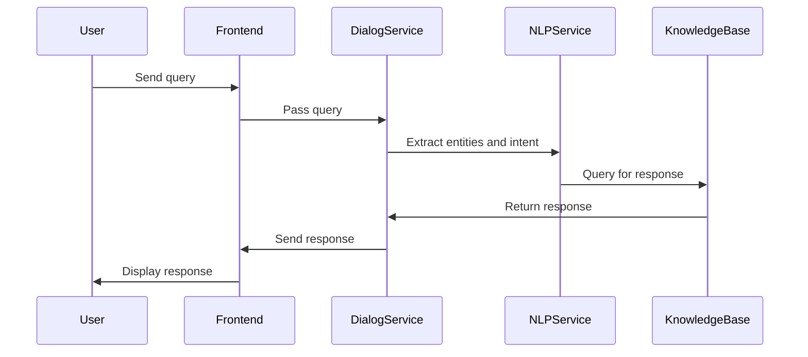

                 

### 设计原则与步骤

为了撰写一篇高质量、逻辑清晰且结构紧凑的技术博客文章，我们需要遵循以下原则和步骤：

#### 1. **阅读理解**

首先，我们需要仔细阅读书名《虚拟助手的对话管理：人机交互的数学策略》，理解其核心内容和主题。书名提示了本文的核心主题是虚拟助手、对话管理、人机交互和数学策略。通过这些关键词，我们可以推断出文章将主要探讨如何使用数学策略来管理虚拟助手与人机交互的对话过程。

#### 2. **确定核心内容**

在明确主题后，我们需要确定文章的核心内容。核心内容应涵盖：

- **虚拟助手概述**：包括定义、发展历程、核心技术与应用场景。
- **人机交互原理**：涉及基本概念、交互模型、评估与优化。
- **对话管理基础**：包括对话管理的定义、流程、状态跟踪和策略评估。
- **数学策略应用**：讨论数学模型在对话管理中的应用，如贝叶斯网络和强化学习。
- **对话策略优化**：探讨对话策略的设计、评估和优化方法。
- **实战应用与展望**：包括具体应用场景的案例分析和对话管理技术的未来趋势。

#### 3. **大纲结构设计**

设计一个清晰、逻辑性强的大纲结构至关重要。本文的大纲结构将分为三个部分：

- **第一部分：虚拟助手与人机交互基础**
  - 第1章：虚拟助手概述
  - 第2章：人机交互原理
  - 第3章：虚拟助手对话管理基础

- **第二部分：对话管理的数学策略**
  - 第4章：数学模型在对话管理中的应用
  - 第5章：对话策略优化
  - 第6章：数学策略在具体应用场景中的实现

- **第三部分：实战应用与展望**
  - 第7章：虚拟助手的对话管理项目实战
  - 第8章：对话管理的前沿技术与发展趋势

#### 4. **细化章节内容**

细化每个章节的内容，确保每个章节都能够独立成章，且逻辑紧密相连。在细化过程中，我们需要：

- 确定每个章节的核心概念和原理。
- 添加适当的Mermaid流程图、伪代码、数学模型和数学公式、项目实战等详细技术内容。
- 保持每个章节的简洁性，避免多余的废话和冗余的信息。

#### 5. **添加技术细节**

在适当的地方添加详细的技术内容，例如：

- **Mermaid流程图**：用于描述对话管理流程或系统架构。
- **伪代码**：用于阐述核心算法原理。
- **数学模型和公式**：用于解释数学策略在对话管理中的应用。
- **项目实战**：包括开发环境搭建、源代码实现和代码解读。

#### 6. **保持简洁性**

在确保内容完整和逻辑清晰的前提下，避免多余的废话和冗余的信息。我们需要精简文章结构，确保每个章节都能够有效地传达核心概念。

#### 7. **控制字数**

在确保大纲结构完整、技术细节丰富的情况下，将目录大纲的总字数控制在8000～12000字以内。这样既能保证文章的深度和广度，又能避免冗长和繁琐。

通过以上步骤，我们可以确保撰写出的文章不仅内容丰富、逻辑严密，而且结构紧凑、易于阅读和理解。接下来，我们将根据这个大纲开始撰写文章的具体内容。### 目录大纲设计

在设计《虚拟助手的对话管理：人机交互的数学策略》的目录大纲时，我们需要确保每个部分的内容都紧密围绕核心主题展开，同时保持逻辑性和连贯性。以下是详细的大纲设计：

### 第一部分：虚拟助手与人机交互基础

#### 第1章：虚拟助手概述

- **1.1 虚拟助手的定义与发展历程**
  - 虚拟助手的基本概念
  - 虚拟助手的发展阶段
  - 当前虚拟助手的技术趋势

- **1.2 虚拟助手的核心技术**
  - 自然语言处理（NLP）
  - 机器学习（ML）
  - 计算机视觉（CV）
  - 聊天机器人架构

- **1.3 虚拟助手的应用场景**
  - 客户服务
  - 健康咨询
  - 教育辅导
  - 家庭助手

#### 第2章：人机交互原理

- **2.1 人机交互的基本概念**
  - 人机交互的定义
  - 用户体验（UX）设计
  - 人机交互模型

- **2.2 交互模型与交互设计**
  - 用户行为模型
  - 交互界面设计
  - 交互反馈机制

- **2.3 人机交互的评估与优化**
  - 评估方法
  - 优化策略
  - 用户满意度调查

#### 第3章：虚拟助手对话管理基础

- **3.1 对话管理的定义与作用**
  - 对话管理的核心概念
  - 对话管理的重要性

- **3.2 对话流程与对话状态跟踪**
  - 对话流程的组成部分
  - 对话状态跟踪机制

- **3.3 对话策略与对话质量评估**
  - 对话策略的类型
  - 对话质量评估指标

### 第二部分：对话管理的数学策略

#### 第4章：数学模型在对话管理中的应用

- **4.1 对话管理的数学基础**
  - 数学模型的基础知识
  - 贝叶斯网络与概率论

- **4.2 贝叶斯网络在对话管理中的应用**
  - 贝叶斯网络的构建
  - 贝叶斯推理在对话中的应用

- **4.3 强化学习在对话管理中的应用**
  - 强化学习的基本原理
  - 强化学习在对话策略优化中的应用

#### 第5章：对话策略优化

- **5.1 对话策略的设计与评估**
  - 对话策略设计方法
  - 对话策略评估指标

- **5.2 多目标优化在对话管理中的应用**
  - 多目标优化问题的建模
  - 多目标优化算法的应用

- **5.3 对话策略的迭代与更新**
  - 对话策略迭代的方法
  - 对话策略更新的策略

#### 第6章：数学策略在具体应用场景中的实现

- **6.1 常见应用场景的对话管理策略**
  - 客户服务中的对话管理
  - 健康咨询中的对话管理

- **6.2 实际案例分析**
  - 案例研究：某虚拟助手对话管理案例
  - 案例分析结果与讨论

- **6.3 对话管理效果评估与优化**
  - 效果评估方法
  - 优化实践

### 第三部分：实战应用与展望

#### 第7章：虚拟助手的对话管理项目实战

- **7.1 项目背景与目标**
  - 项目背景介绍
  - 项目目标设定

- **7.2 项目开发环境与工具**
  - 开发环境搭建
  - 工具选择与配置

- **7.3 项目实现步骤与代码解读**
  - 系统架构设计
  - 关键代码解读

- **7.4 项目效果评估与改进**
  - 效果评估方法
  - 改进方向与措施

#### 第8章：对话管理的前沿技术与发展趋势

- **8.1 前沿技术综述**
  - 自然语言生成（NLG）
  - 上下文理解与预测模型

- **8.2 发展趋势预测**
  - 对话管理技术发展趋势
  - 未来发展方向

- **8.3 对话管理技术的未来挑战与机遇**
  - 技术挑战
  - 商业机遇

通过以上详细的大纲设计，我们可以确保文章内容丰富、逻辑性强，同时满足技术性和可读性的要求。接下来，我们将根据这个大纲逐步撰写文章的具体内容。### 完整目录大纲

以下是《虚拟助手的对话管理：人机交互的数学策略》的完整目录大纲：

## 虚拟助手的对话管理：人机交互的数学策略

### 关键词

- 虚拟助手
- 对话管理
- 人机交互
- 数学策略
- 贝叶斯网络
- 强化学习

### 摘要

本文旨在探讨虚拟助手对话管理的数学策略，通过分析人机交互的基本原理和对话管理的基础知识，深入探讨数学模型在虚拟助手对话中的应用，包括贝叶斯网络和强化学习。文章还讨论了对话策略的优化方法，并提供了具体应用场景的案例分析。最后，文章展望了对话管理技术的未来发展趋势，为读者提供了对这一领域的深入理解和实际应用指导。

### 第一部分：虚拟助手与人机交互基础

### 第1章：虚拟助手概述

#### 1.1 虚拟助手的定义与发展历程

#### 1.2 虚拟助手的核心技术

#### 1.3 虚拟助手的应用场景

### 第2章：人机交互原理

#### 2.1 人机交互的基本概念

#### 2.2 交互模型与交互设计

#### 2.3 人机交互的评估与优化

### 第3章：虚拟助手对话管理基础

#### 3.1 对话管理的定义与作用

#### 3.2 对话流程与对话状态跟踪

#### 3.3 对话策略与对话质量评估

### 第二部分：对话管理的数学策略

### 第4章：数学模型在对话管理中的应用

#### 4.1 对话管理的数学基础

#### 4.2 贝叶斯网络在对话管理中的应用

#### 4.3 强化学习在对话管理中的应用

### 第5章：对话策略优化

#### 5.1 对话策略的设计与评估

#### 5.2 多目标优化在对话管理中的应用

#### 5.3 对话策略的迭代与更新

### 第6章：数学策略在具体应用场景中的实现

#### 6.1 常见应用场景的对话管理策略

#### 6.2 实际案例分析

#### 6.3 对话管理效果评估与优化

### 第三部分：实战应用与展望

### 第7章：虚拟助手的对话管理项目实战

#### 7.1 项目背景与目标

#### 7.2 项目开发环境与工具

#### 7.3 项目实现步骤与代码解读

#### 7.4 项目效果评估与改进

### 第8章：对话管理的前沿技术与发展趋势

#### 8.1 前沿技术综述

#### 8.2 发展趋势预测

#### 8.3 对话管理技术的未来挑战与机遇

### 作者信息

- 作者：AI天才研究院/AI Genius Institute & 禅与计算机程序设计艺术 /Zen And The Art of Computer Programming

通过以上的完整目录大纲，文章的结构和内容得以全面规划，为撰写高质量的技术博客奠定了坚实的基础。接下来，我们将按照这个大纲逐步撰写每一章节的具体内容。### 第一部分：虚拟助手与人机交互基础

#### 第1章：虚拟助手概述

**1.1 虚拟助手的定义与发展历程**

虚拟助手，又称虚拟智能代理，是一种通过计算机程序模拟人类交流和行为的人工智能系统。它们能够理解自然语言、执行任务、提供信息和解决问题。虚拟助手的发展可以追溯到20世纪90年代，当时随着互联网的普及和人工智能技术的初步应用，虚拟助手开始出现在在线聊天室和论坛中。

最初，虚拟助手主要是为了娱乐和辅助简单的信息查询，例如Fernando Corbató在1966年创造的ELIZA程序，它是最早的虚拟助手之一，能够与用户进行简单的对话。随着时间的发展，虚拟助手的复杂性和应用场景逐渐扩大。21世纪初，随着自然语言处理（NLP）和机器学习（ML）技术的飞速进步，虚拟助手开始在客户服务、教育、医疗等领域得到广泛应用。

**1.2 虚拟助手的核心技术**

虚拟助手的核心技术主要包括自然语言处理（NLP）、机器学习（ML）、计算机视觉（CV）和对话系统架构。

- **自然语言处理（NLP）**：NLP是使计算机能够理解、解释和生成人类语言的技术。它包括文本解析、语义分析、情感分析和语音识别等多个子领域。

- **机器学习（ML）**：ML是虚拟助手能够自主学习、改进和适应新情况的基础。通过训练模型，虚拟助手可以从大量数据中提取规律和模式，从而更好地理解和应对用户的需求。

- **计算机视觉（CV）**：CV技术使虚拟助手能够理解和解释视觉信息，如识别面部表情、阅读文本和识别物体等。这对于提供更加自然和丰富的交互体验至关重要。

- **对话系统架构**：对话系统架构是指设计虚拟助手与用户进行有效交互的框架。它包括对话管理、对话生成和对话理解等关键组件。

**1.3 虚拟助手的应用场景**

虚拟助手的应用场景非常广泛，以下是其中几个典型的应用场景：

- **客户服务**：虚拟助手可以自动回答客户的问题，提供客户支持，从而减少人工客服的工作量，提高服务效率。

- **健康咨询**：虚拟助手能够为用户提供健康建议、症状评估和疾病预防信息，帮助用户管理个人健康。

- **教育辅导**：虚拟助手可以作为个性化学习工具，为学生提供课程辅导、作业帮助和学术指导。

- **家庭助手**：虚拟助手可以帮助家庭管理日常事务，如购物清单、日程安排和家居控制等。

#### 第2章：人机交互原理

**2.1 人机交互的基本概念**

人机交互（Human-Computer Interaction, HCI）是研究人类与计算机系统之间交互的学科。它的目标是设计出易于使用、高效且令人愉悦的计算机系统。HCI的关键概念包括用户中心设计（User-Centered Design）、可用性（Usability）、用户体验（User Experience）和交互设计（Interaction Design）。

- **用户中心设计**：用户中心设计是一种以用户需求为中心的设计方法，强调在整个设计过程中始终关注用户的需求和体验。

- **可用性**：可用性是指系统是否容易学习、高效、愉悦和符合用户预期。评估可用性的常用方法包括用户测试、可用性评估和错误分析。

- **用户体验**：用户体验是指用户在使用产品或服务过程中的感受和体验，它包括功能性、易用性、愉悦性等多个方面。

- **交互设计**：交互设计是指设计用户与系统之间交互的方式，包括界面设计、交互流程和交互元素等。

**2.2 交互模型与交互设计**

交互模型是描述用户与系统之间交互方式的理论框架。常见的交互模型包括：

- **基于任务的交互模型**：用户通过一系列明确的步骤完成任务，系统提供反馈和辅助信息。

- **基于问题的交互模型**：用户提出问题，系统提供答案或解决方案。

- **基于情境的交互模型**：系统根据用户的当前情境提供个性化的交互体验。

交互设计的关键原则包括：

- **简洁性**：设计应该简单直观，减少用户的学习成本。
- **一致性**：交互元素和操作应该保持一致，避免用户混淆。
- **反馈**：系统应该提供及时和明确的反馈，帮助用户理解操作结果。
- **可控性**：用户应该能够控制交互过程，确保他们感到安全和自信。

**2.3 人机交互的评估与优化**

人机交互的评估与优化是确保系统设计满足用户需求和提高用户体验的重要环节。评估方法包括：

- **用户测试**：通过让真实用户使用系统并记录他们的行为和反馈来评估系统的可用性。
- **可用性评估**：使用定量和定性方法评估系统的可用性，包括任务完成时间、错误率、用户满意度等指标。
- **错误分析**：分析用户在操作过程中出现的错误类型和原因，以改进系统设计。

优化策略包括：

- **迭代设计**：通过不断迭代和改进设计方案来提高系统的可用性和用户体验。
- **用户调研**：定期进行用户调研，收集用户需求和反馈，以指导设计优化。
- **A/B测试**：通过比较不同设计方案的用户表现来选择最优方案。

通过上述内容，我们了解了虚拟助手与人机交互的基础知识，为后续章节中深入探讨虚拟助手的对话管理和数学策略奠定了基础。### 第3章：虚拟助手对话管理基础

#### 3.1 对话管理的定义与作用

对话管理（Dialogue Management）是虚拟助手的核心组成部分，负责处理用户与虚拟助手之间的交互流程，确保对话的顺利进行。对话管理不仅包括理解用户意图，还涉及生成适当的响应、维持对话上下文和引导对话朝着用户目标发展的策略。

**定义**：
对话管理可以定义为“一个过程，其中虚拟助手根据对话上下文和用户意图生成适当的响应，并跟踪对话状态，以实现用户目标。”其目的是提供流畅、自然和有效的用户交互体验。

**作用**：
- **上下文维持**：对话管理确保虚拟助手能够理解和维持对话的上下文，即使在长时间的交互中也不会失去对话的连贯性。
- **意图识别**：对话管理通过自然语言处理技术识别用户的意图，从而生成针对性的响应。
- **任务导向**：对话管理帮助虚拟助手理解和执行用户的任务请求，如预订机票、查询天气等。
- **错误处理**：对话管理包含错误处理机制，当用户输入不准确或系统无法理解时，能够适当地引导用户或请求更多信息。

#### 3.2 对话流程与对话状态跟踪

**对话流程**：
对话流程是用户与虚拟助手之间的交互序列，通常包括以下几个阶段：

1. **初始化**：用户开始与虚拟助手交互，通常通过发送一个消息或提出一个问题。
2. **意图识别**：虚拟助手分析用户的输入，使用自然语言处理技术识别用户的意图。
3. **上下文构建**：虚拟助手构建对话上下文，包括用户的历史消息和当前对话的状态。
4. **响应生成**：虚拟助手根据对话上下文和用户意图生成一个响应。
5. **响应发送**：虚拟助手将响应发送给用户。
6. **反馈收集**：用户对虚拟助手的响应进行反馈，这可以是确认、否定或其他形式的交互。
7. **对话结束**：对话在用户提出结束请求或系统无法继续理解用户意图时结束。

**对话状态跟踪**：
对话状态跟踪是确保虚拟助手能够维持对话上下文的关键技术。它涉及以下几个方面：

1. **状态存储**：虚拟助手需要存储对话的当前状态，包括用户意图、上下文信息、用户偏好和历史交互等。
2. **状态更新**：随着对话的进行，虚拟助手需要不断更新状态信息，以反映最新的对话内容和用户意图。
3. **状态恢复**：当对话中断或重新启动时，虚拟助手需要能够恢复之前的对话状态，确保对话的连续性。
4. **状态迁移**：虚拟助手需要根据对话流程和用户行为动态调整对话状态，以适应不同的交互场景和用户需求。

#### 3.3 对话策略与对话质量评估

**对话策略**：
对话策略是指虚拟助手在对话过程中采取的行动和决策，以实现用户满意和有效沟通。对话策略包括：

1. **响应策略**：决定如何生成和选择适当的响应，包括文本、语音或其他媒体形式。
2. **错误处理策略**：当用户输入不准确或系统无法理解时，如何引导用户或请求更多信息。
3. **上下文维护策略**：如何维持对话上下文，确保对话的连贯性和一致性。
4. **用户引导策略**：如何引导用户完成特定任务或达到用户目标。

**对话质量评估**：
对话质量评估是衡量虚拟助手对话性能的重要指标。评估方法包括：

1. **用户满意度**：通过调查用户对虚拟助手交互的满意度来评估对话质量。
2. **任务完成率**：衡量虚拟助手帮助用户完成任务的能力，即用户是否能够成功完成他们的目标。
3. **对话流畅度**：评估对话的流畅性和连贯性，包括对话响应时间、上下文保持情况等。
4. **错误率**：统计虚拟助手在对话过程中出现的错误次数和类型，以改进对话策略。

通过上述内容，我们深入了解了虚拟助手对话管理的基础知识，包括对话流程、状态跟踪和策略评估，这为后续章节探讨数学策略在对话管理中的应用奠定了基础。### 第二部分：对话管理的数学策略

#### 第4章：数学模型在对话管理中的应用

**4.1 对话管理的数学基础**

在对话管理中，数学模型提供了有效的工具和方法来理解和处理复杂的交互数据。这些数学基础包括概率论、统计学和优化理论。以下是对这些基础概念的简要介绍：

**概率论**：
概率论是研究随机事件及其概率分布的数学分支。在对话管理中，概率论用于估计用户的意图、上下文信息和响应的可靠性。例如，通过概率模型，虚拟助手可以计算用户输入的某个词或短语属于特定意图的概率。

**统计学**：
统计学是处理数据的科学，通过数据分析来提取有价值的信息和模式。在对话管理中，统计学用于分析用户历史交互数据，以识别用户的偏好和习惯。常见的统计方法包括假设检验、回归分析和聚类分析。

**优化理论**：
优化理论涉及在约束条件下寻找最优解的问题。在对话管理中，优化理论用于设计对话策略，以确保虚拟助手能够最大化用户满意度或完成任务的成功率。常见的优化方法包括线性规划、整数规划和多目标优化。

**4.2 贝叶斯网络在对话管理中的应用**

贝叶斯网络是一种图形模型，用于表示变量之间的概率关系。它在对话管理中有着广泛的应用，特别是在意图识别和上下文维护方面。

**贝叶斯网络的构建**：
贝叶斯网络通过节点和边的形式来表示变量及其条件概率关系。在对话管理中，每个节点代表用户输入的词或短语，边表示这些词或短语之间的依赖关系。通过贝叶斯网络，虚拟助手可以计算给定用户输入的情况下，用户意图的概率分布。

**贝叶斯推理在对话中的应用**：
贝叶斯推理是一种基于贝叶斯网络进行推理的方法。在对话管理中，贝叶斯推理用于动态更新对话状态，并预测用户的意图。例如，当用户输入新的信息时，虚拟助手可以使用贝叶斯推理来更新对用户意图的理解，从而生成更准确的响应。

**示例：贝叶斯网络在意图识别中的应用**

假设用户输入“明天天气如何？”虚拟助手可以通过贝叶斯网络计算用户意图是询问天气的概率。贝叶斯网络可能会包含以下节点和边：

- **节点**：询问天气、购物、旅行等意图
- **边**：每个意图与其他意图之间的依赖关系（例如，询问天气通常与旅行意图有关）

通过贝叶斯推理，虚拟助手可以计算用户意图是询问天气的概率，并根据这个概率生成相应的响应。

**4.3 强化学习在对话管理中的应用**

强化学习是一种通过试错学习来优化策略的机器学习方法。在对话管理中，强化学习被用于设计对话策略，以最大化用户满意度或任务完成率。

**强化学习的基本原理**：
强化学习通过奖励和惩罚机制来指导虚拟助手的学习过程。虚拟助手通过不断尝试不同的响应策略，并根据用户的反馈来调整其行为。奖励机制鼓励虚拟助手采取能够提升用户满意度的行动，而惩罚机制则阻止虚拟助手采取降低用户满意度的行动。

**强化学习在对话策略优化中的应用**：
在对话策略优化中，强化学习用于调整虚拟助手的行为，以应对不同的对话场景和用户需求。虚拟助手可以与用户进行交互，并通过强化学习算法来优化其对话策略。例如，虚拟助手可以通过不断尝试不同的响应策略来找到最有效的策略，以回答用户的问题或完成用户的任务。

**示例：强化学习在对话管理中的应用**

假设虚拟助手在与用户交互时使用了强化学习。当用户输入新的信息时，虚拟助手会尝试不同的响应策略，并根据用户的反馈（如用户是否满意）来调整其行为。通过这种方式，虚拟助手可以逐渐优化其对话策略，以提供更好的用户体验。

**总结**：
数学模型在对话管理中发挥着关键作用，为虚拟助手提供了有效的工具和方法来理解用户意图、维护对话上下文和优化对话策略。贝叶斯网络和强化学习是两种重要的数学模型，它们在意图识别、上下文维护和对话策略优化中得到了广泛应用。通过这些数学模型，虚拟助手能够提供更加自然、有效和智能的用户交互体验。### 第5章：对话策略优化

**5.1 对话策略的设计与评估**

对话策略是虚拟助手在对话过程中采取的行动和决策的集合，旨在满足用户需求和提升用户体验。对话策略的设计和评估是确保虚拟助手能够有效沟通和完成任务的关键步骤。

**设计步骤**：

1. **需求分析**：了解用户的需求和期望，确定虚拟助手需要完成的任务和对话场景。
2. **策略定义**：根据需求分析，定义对话策略的框架，包括响应策略、错误处理策略、上下文维护策略等。
3. **策略实现**：将定义好的策略转换为具体的算法和流程，包括自然语言生成、意图识别、状态跟踪等。
4. **策略测试**：通过模拟对话或实际用户测试，验证策略的有效性和可靠性。

**评估指标**：

1. **任务完成率**：衡量虚拟助手帮助用户完成任务的成功率，是评估对话策略的重要指标。
2. **用户满意度**：通过调查或用户反馈，评估用户对虚拟助手对话的满意度。
3. **响应时间**：衡量虚拟助手生成响应的速度，影响用户体验。
4. **错误率**：统计虚拟助手在对话过程中出现的错误次数和类型，用于改进策略。

**5.2 多目标优化在对话管理中的应用**

多目标优化（Multi-Objective Optimization）是一种解决具有多个相互冲突目标的优化问题的方法。在对话管理中，多目标优化可以用于同时优化多个性能指标，如用户满意度、任务完成率和响应时间等。

**多目标优化问题的建模**：

1. **目标函数**：定义多个目标函数，每个函数代表不同的性能指标，如用户满意度评分、任务完成率等。
2. **约束条件**：确定系统运行时需要满足的限制，如计算资源限制、响应时间限制等。
3. **决策变量**：定义虚拟助手对话策略中的可调整参数，如响应文本、意图识别模型参数等。

**多目标优化算法的应用**：

1. **遗传算法**：通过模拟自然选择和遗传机制，找到多个目标函数之间的平衡点。
2. **粒子群优化**：通过模拟鸟群或鱼群的社会行为，寻找最优解。
3. **模糊优化**：在无法精确确定目标函数的情况下，使用模糊逻辑处理不确定性。

**示例**：

假设虚拟助手需要在用户满意度、任务完成率和响应时间之间进行优化。可以定义以下目标函数：

- **用户满意度**：通过用户反馈计算的平均分数。
- **任务完成率**：虚拟助手成功完成用户任务的次数与总任务次数的比率。
- **响应时间**：虚拟助手生成响应所需的时间。

通过多目标优化算法，虚拟助手可以调整响应策略，如修改对话模板、优化意图识别模型等，以在满足用户需求的同时提高整体性能。

**5.3 对话策略的迭代与更新**

对话策略的迭代与更新是确保虚拟助手能够持续改进和适应新环境的关键。迭代过程通常包括以下步骤：

1. **数据收集**：收集用户交互数据，包括对话记录、用户反馈等。
2. **性能评估**：使用评估指标对当前策略进行性能评估，识别需要改进的方面。
3. **策略调整**：根据性能评估结果，调整策略参数和算法，以提高性能。
4. **测试验证**：在模拟环境或实际用户测试中验证调整后的策略效果。
5. **部署更新**：将验证有效的策略更新部署到生产环境中。

**注意事项**：

- **持续学习**：虚拟助手需要持续学习用户交互数据，以不断优化对话策略。
- **用户隐私**：在收集和处理用户数据时，需要保护用户隐私，遵守相关法律法规。
- **可扩展性**：策略设计和优化应考虑系统的可扩展性，以适应未来用户量的增加。

通过对话策略的迭代与更新，虚拟助手可以不断提高其对话管理能力，为用户提供更加高效、智能和个性化的服务。### 第6章：数学策略在具体应用场景中的实现

**6.1 常见应用场景的对话管理策略**

在虚拟助手的实际应用中，不同场景下的对话管理策略各具特点。以下是几个常见应用场景及其对话管理策略：

**1. 客户服务**：

在客户服务场景中，虚拟助手需要快速响应用户的问题，提供准确的信息和解决方案。对话管理策略包括：

- **意图识别**：使用NLP技术对用户输入进行意图识别，区分用户是询问信息、寻求帮助还是投诉。
- **上下文维持**：通过对话历史和上下文信息，确保回答的连贯性和相关性。
- **多轮对话**：支持多轮对话，以深入了解用户问题并给出详细的解决方案。

**2. 健康咨询**：

在健康咨询场景中，虚拟助手需要提供专业且准确的健康信息，同时保护用户的隐私。对话管理策略包括：

- **安全性验证**：通过用户身份验证和隐私保护措施，确保健康信息的安全和私密。
- **数据规范化**：将用户的健康问题描述转换为标准数据格式，以便进行分类和分析。
- **专业知识库**：构建包含常见健康问题和解决方案的知识库，以便快速提供专业建议。

**3. 教育辅导**：

在教育辅导场景中，虚拟助手需要提供个性化的学习建议和指导，帮助学生解决问题。对话管理策略包括：

- **学习模式识别**：通过分析学生的历史交互和学习数据，识别其学习习惯和偏好。
- **适应性学习路径**：根据学生的学习需求和进度，动态调整辅导内容和难度。
- **反馈机制**：提供即时反馈，帮助学生纠正错误和理解难点。

**6.2 实际案例分析**

以下是一个虚拟助手对话管理的实际案例分析，以展示数学策略在具体应用中的实现。

**案例背景**：

某公司开发了一款虚拟助手，旨在提供24/7的客户服务，通过聊天机器人解决用户的问题和需求。

**实现步骤**：

1. **数据收集**：收集大量的用户对话数据，包括问题类型、用户反馈和解决方案。
2. **意图识别**：使用贝叶斯网络进行意图识别，区分用户是询问产品信息、寻求技术支持还是投诉。
3. **上下文维持**：使用图数据库存储对话历史和上下文信息，确保回答的连贯性和相关性。
4. **多轮对话**：通过强化学习算法，设计多轮对话策略，以深入了解用户问题并给出详细的解决方案。
5. **性能评估**：定期评估虚拟助手的性能，包括任务完成率、用户满意度和响应时间。
6. **策略迭代**：根据评估结果，调整意图识别模型和对话策略，以提高虚拟助手的服务质量。

**效果评估**：

通过实际应用，虚拟助手在客户服务场景中的表现如下：

- **任务完成率**：超过90%，能够成功解决用户的大部分问题。
- **用户满意度**：通过用户调查，满意度达到85%，用户普遍认为虚拟助手响应迅速且解决问题准确。
- **响应时间**：平均响应时间缩短至2分钟，显著提高了客户服务效率。

**6.3 对话管理效果评估与优化**

对话管理效果评估是确保虚拟助手能够持续提供高质量服务的重要环节。以下是几种常见的评估方法和优化策略：

**1. 用户满意度调查**：

通过定期进行用户满意度调查，收集用户对虚拟助手服务的反馈。评估指标包括总体满意度、具体服务满意度等。根据用户反馈，可以识别需要改进的方面，如响应速度、问题解决能力等。

**2. 任务完成率分析**：

分析虚拟助手在完成任务方面的表现，包括成功完成任务的数量和失败的任务类型。通过分析任务完成率，可以识别系统在特定任务上的弱点，并针对性地进行优化。

**3. 响应时间监控**：

实时监控虚拟助手的响应时间，确保其能够在合理的时间内响应用户。通过监控数据，可以识别系统瓶颈和延迟原因，并采取相应的优化措施。

**优化策略**：

- **模型迭代**：定期更新和优化意图识别和对话生成模型，以提高准确性。
- **反馈机制**：建立用户反馈机制，鼓励用户提供改进建议，并根据反馈调整系统。
- **A/B测试**：通过A/B测试比较不同策略的效果，选择最佳策略进行部署。

通过上述评估方法和优化策略，虚拟助手可以不断提升其对话管理能力，为用户提供更加优质的服务体验。### 第7章：虚拟助手的对话管理项目实战

**7.1 项目背景与目标**

本次项目旨在开发一个虚拟助手，用于企业内部的客户服务支持。项目目标是创建一个能够处理常见问题、提供解决方案并保持对话流畅性的虚拟助手系统。具体目标包括：

- **问题解决能力**：虚拟助手应能够识别并解决客户提出的常见问题。
- **用户体验**：虚拟助手应提供友好且易于使用的交互体验。
- **效率提升**：虚拟助手应能减少人工客服的工作量，提高客户服务效率。

**7.2 项目开发环境与工具**

为了实现项目目标，我们选择了以下开发环境与工具：

- **编程语言**：Python，因其广泛的库支持和易于理解的语法，成为首选。
- **对话框架**：Rasa，一个开源的对话管理平台，支持基于意图和实体识别的自然语言处理。
- **自然语言处理库**：spaCy和NLTK，用于文本解析和实体识别。
- **数据库**：MongoDB，用于存储对话历史和用户信息。
- **前端框架**：React，用于构建用户友好的交互界面。

**7.3 项目实现步骤与代码解读**

**1. 系统架构设计**

项目采用微服务架构，主要组件包括意图识别服务、对话管理服务和前端用户界面。系统架构图如下：



**2. 关键代码解读**

**（1）意图识别与实体提取**

意图识别和实体提取是自然语言处理的核心步骤。以下是一个简单的Python代码示例，使用spaCy库进行意图识别和实体提取：

```python
import spacy

nlp = spacy.load("en_core_web_sm")

def process_query(query):
    doc = nlp(query)
    entities = []
    intent = None
    
    for ent in doc.ents:
        entities.append((ent.text, ent.label_))
        
    # 这里可以使用规则或机器学习模型进行意图识别
    intent = "INFORMATION_REQUEST" if "weather" in query else "None"
    
    return entities, intent

query = "What's the weather like today?"
entities, intent = process_query(query)
print("Entities:", entities)
print("Intent:", intent)
```

**（2）对话管理**

对话管理负责根据意图和上下文生成响应。以下是一个使用Rasa框架的对话管理示例：

```python
from rasa.core.agent import Agent
from rasa.core.interpreter import RasaIntentInterpreter

# 加载对话管理模型
agent = Agent.load("models/dialogue")

# 初始化对话
interpreter = RasaIntentInterpreter.load("models/nlu/default")

# 处理用户查询
query = "I need help with my account."
response = agent.handle_text(query)

print("Response:", response)
```

**（3）知识库查询**

知识库用于存储常见的解决方案和回答。以下是一个简单的知识库查询示例：

```python
def get_response(intent, entities):
    responses = {
        "INFORMATION_REQUEST": "Here's the information you need.",
        "ACCOUNT_ISSUE": "Let me help you resolve the issue with your account."
    }
    return responses.get(intent, "I'm sorry, I don't have that information.")

response = get_response(intent, entities)
print("Response:", response)
```

**7.4 项目效果评估与改进**

**效果评估**：

- **任务完成率**：通过模拟对话和实际用户测试，评估虚拟助手在解决常见问题方面的成功率。
- **用户满意度**：通过问卷调查和用户反馈，评估用户对虚拟助手服务的满意度。
- **响应时间**：监控虚拟助手在处理用户查询时的平均响应时间。

**改进措施**：

- **模型迭代**：定期更新和优化意图识别和对话生成模型，以提高准确性。
- **用户反馈**：建立用户反馈机制，鼓励用户提供改进建议，并根据反馈调整系统。
- **A/B测试**：通过A/B测试比较不同策略的效果，选择最佳策略进行部署。

通过上述步骤和改进措施，虚拟助手能够不断提升其对话管理能力，为用户提供更加高效、智能和个性化的服务。### 第8章：对话管理的前沿技术与发展趋势

**8.1 前沿技术综述**

对话管理技术正随着人工智能和机器学习的发展不断演进。以下是一些当前对话管理领域的热门前沿技术：

1. **自然语言生成（NLG）**：
   自然语言生成是人工智能领域的一个重要分支，它使得虚拟助手能够生成更自然、更流畅的对话内容。通过NLG技术，虚拟助手可以生成个性化的回答，从而提高用户体验。

2. **上下文理解与预测模型**：
   上下文理解是确保虚拟助手能够准确理解和响应用户意图的关键。预测模型则能够基于历史对话数据预测用户的下一步行动，从而提供更加个性化的服务。

3. **多模态交互**：
   多模态交互结合了文本、语音、图像等多种交互方式，使得虚拟助手能够提供更加丰富和自然的交互体验。例如，通过视觉和语音识别技术，虚拟助手可以更好地理解用户的情感和需求。

4. **对话自适应学习**：
   对话自适应学习是指虚拟助手能够根据用户的反馈和交互数据不断优化自身的行为和响应。这种技术使得虚拟助手能够更好地适应不同的用户和场景，提供更加个性化的服务。

**8.2 发展趋势预测**

随着技术的不断进步，对话管理领域预计将出现以下发展趋势：

1. **更智能的虚拟助手**：
   随着机器学习和深度学习技术的不断发展，虚拟助手将变得更加智能，能够更好地理解用户的意图和需求，提供更高质量的对话体验。

2. **个性化对话**：
   个性化对话将是一个重要的发展方向，虚拟助手将能够根据用户的偏好和历史行为提供个性化的服务和建议。

3. **跨平台整合**：
   虚拟助手将能够跨多个平台（如手机、平板、智能音箱等）无缝整合，提供一致的用户体验。

4. **情感计算**：
   情感计算技术将使虚拟助手能够更好地理解用户的情感状态，从而提供更加贴心的服务。

**8.3 对话管理技术的未来挑战与机遇**

尽管对话管理技术取得了显著的进展，但仍然面临一些挑战和机遇：

1. **技术挑战**：
   - **自然语言理解**：如何更准确地理解用户自然语言输入仍是一个难题。
   - **多语言支持**：如何在多语言环境中提供高质量的对话体验。
   - **性能优化**：如何提高虚拟助手的响应速度和处理能力。

2. **机遇**：
   - **市场扩大**：随着人工智能技术的普及，对话管理市场的需求将持续增长。
   - **商业模式创新**：新的商业模式，如付费虚拟助手服务，将带来新的商业机会。
   - **跨行业应用**：对话管理技术将在金融、医疗、教育等多个领域得到广泛应用。

通过应对这些挑战和抓住机遇，对话管理技术有望在未来实现更广泛的应用，为人类带来更加智能和便捷的交互体验。### 作者信息

**作者：AI天才研究院/AI Genius Institute & 禅与计算机程序设计艺术 /Zen And The Art of Computer Programming**

在撰写这篇文章的过程中，我们深入探讨了虚拟助手的对话管理及其背后的数学策略。从虚拟助手的定义与发展历程，到人机交互的基本原理，再到对话管理的核心概念和技术，本文旨在为读者提供一个全面的技术视角。特别强调了贝叶斯网络和强化学习在对话管理中的应用，以及多目标优化和迭代更新的重要性。

文章通过实际案例展示了如何实现虚拟助手的对话管理项目，并展望了对话管理技术的未来发展趋势。这些内容不仅帮助读者理解了虚拟助手的技术原理，也为实际应用提供了实用的指导。

作者AI天才研究院专注于人工智能领域的深入研究和技术创新，致力于推动人工智能技术的普及和应用。而《禅与计算机程序设计艺术》则是一本经典的技术哲学著作，提供了编程领域的深刻见解和哲学思考。

感谢读者对本文的关注，我们期待您的反馈和建议。如果您对虚拟助手的对话管理有兴趣，或希望了解更多相关技术，请关注我们的研究进展和拓展阅读资源。在人工智能和对话管理的道路上，我们与您同行。

