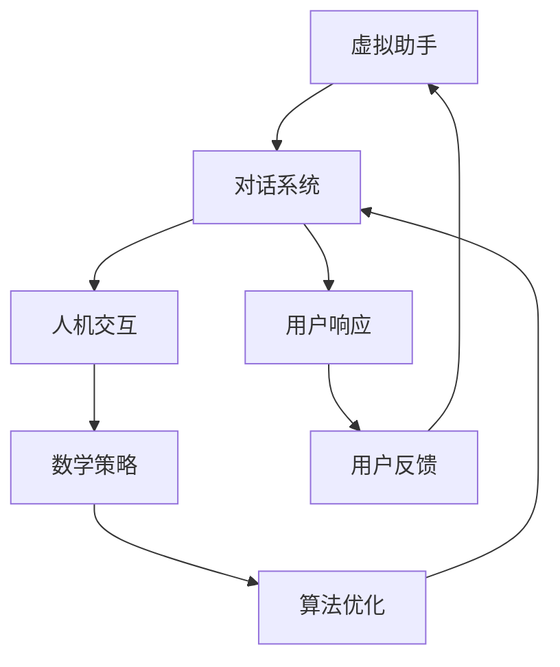

                 


## 背景介绍

虚拟助手，作为人工智能技术的重要组成部分，近年来在各个领域得到了广泛应用。它们以自然语言处理、语音识别、机器学习等核心技术为基础，通过不断学习和优化，实现与用户的智能交互。虚拟助手不仅能够提高工作效率，还能提供个性化服务，满足用户多样化的需求。然而，虚拟助手的对话管理，即如何实现有效的人机交互，仍是一个复杂的课题。本文将探讨虚拟助手的对话管理，从人机交互的数学策略出发，分析其在实际应用中的挑战和解决方案。

### 核心概念与联系

首先，我们需要明确几个核心概念：虚拟助手、对话系统、人机交互和数学策略。虚拟助手是指模拟人类行为，通过自然语言交互提供服务的计算机程序。对话系统是虚拟助手的核心组成部分，负责处理用户的输入，生成合适的响应。人机交互则是虚拟助手与用户之间进行信息交换的过程。数学策略则是指利用数学模型和算法来优化虚拟助手的对话管理。

为了更好地理解这些概念之间的关系，我们可以通过一个Mermaid流程图来展示它们的基本架构：



在这个流程图中，虚拟助手作为整体，通过对话系统与人机交互模块进行互动，用户反馈则驱动虚拟助手不断优化其数学策略和算法，形成闭环反馈机制。

### 核心算法原理讲解

接下来，我们将详细讲解核心算法原理，使用伪代码来描述关键步骤。

#### 1. 对话状态跟踪算法

对话状态跟踪是虚拟助手对话管理中的核心任务之一。以下是一个简化版的伪代码，用于描述对话状态的跟踪过程：

```plaintext
function DialogStateTracking(input, state_history):
    # 初始化状态历史
    if state_history is empty:
        state_history = initialize_state_history()

    # 使用机器学习模型预测当前输入对应的下一个状态
    current_state = predict_next_state(input, state_history)

    # 更新状态历史
    state_history = update_state_history(state_history, current_state)

    return current_state
```

在这个算法中，`predict_next_state` 函数负责预测当前输入对应的下一个状态，`update_state_history` 函数用于更新状态历史，以便后续的预测更加准确。

#### 2. 对话策略优化算法

对话策略优化的目标是提高虚拟助手与用户的交互效率。以下是一个简化的伪代码，用于描述对话策略的优化过程：

```plaintext
function DialogStrategyOptimization(input, output, feedback):
    # 初始化策略参数
    strategy_params = initialize_strategy_params()

    # 训练策略模型
    strategy_model = train_strategy_model(input, output, feedback, strategy_params)

    # 评估策略模型
    performance = evaluate_strategy_model(strategy_model)

    # 根据评估结果调整策略参数
    strategy_params = adjust_strategy_params(strategy_params, performance)

    return strategy_params
```

在这个算法中，`train_strategy_model` 函数用于训练策略模型，`evaluate_strategy_model` 函数用于评估模型性能，`adjust_strategy_params` 函数用于调整策略参数。

### 数学模型和数学公式

在虚拟助手的对话管理中，数学模型和数学公式扮演着至关重要的角色。以下是一个简单的数学模型，用于描述用户行为模式：

$$
\text{User Behavior Model} = f(\text{Input}, \text{Context}, \text{User Preferences})
$$

其中，`Input` 表示用户输入的信息，`Context` 表示对话的上下文信息，`User Preferences` 表示用户的偏好信息。通过这个模型，我们可以预测用户的行为模式，从而优化虚拟助手的响应。

### 项目实战

在实际项目中，虚拟助手的对话管理需要经过开发环境搭建、源代码实现和代码解读等多个环节。以下是一个简化的项目实战案例：

#### 1. 开发环境搭建

- 选择合适的编程语言和开发工具，例如Python和TensorFlow。
- 安装必要的库和依赖项，如NLTK、spaCy等。

#### 2. 源代码实现

- 实现对话管理模块，包括对话状态跟踪和对话策略优化。
- 使用机器学习模型进行训练和预测。

#### 3. 代码解读与分析

- 详细解读代码实现过程，分析关键算法和数据处理方法。
- 优化代码性能，提升虚拟助手的效果。

#### 4. 实际案例分析和详细讲解剖析

- 分析实际应用案例，如客服机器人、智能家居助手等。
- 详细讲解虚拟助手在不同应用场景中的实现细节和效果评估。

### 最佳实践 tips、小结、注意事项、拓展阅读等内容

在设计和实现虚拟助手的对话管理时，以下是一些最佳实践和注意事项：

1. **用户隐私保护**：在处理用户数据时，务必遵循隐私保护法规，确保用户信息安全。
2. **性能优化**：虚拟助手需要具备高性能，以应对大量并发请求。
3. **持续学习**：虚拟助手需要不断学习和优化，以适应不断变化的环境和用户需求。
4. **用户体验**：虚拟助手的设计应注重用户体验，确保交互过程自然、流畅。

拓展阅读方面，可以参考以下资源：

1. 《人工智能：一种现代的方法》（Russell & Norvig著）- 了解人工智能的基础知识。
2. 《深度学习》（Goodfellow、Bengio & Courville著）- 深入学习深度学习算法。
3. 《对话系统设计与实现》（Peter Norvig著）- 学习对话系统的设计和实现技术。

通过本文的探讨，我们希望读者能够对虚拟助手的对话管理有更深入的理解，并能将其应用于实际项目中，提升人机交互的效率和质量。希望本文能够为从事虚拟助手开发的研究人员和工程师提供有价值的参考。

