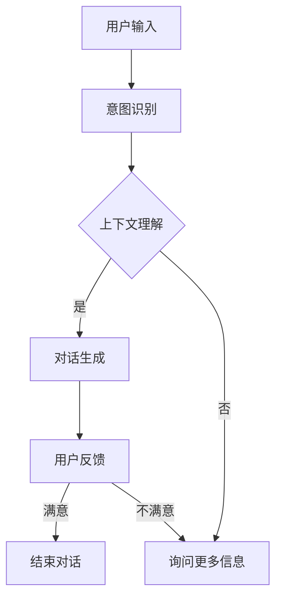

                 

### 文章标题

《虚拟助手的对话管理：人机交互的数学策略》

### 关键词

虚拟助手，对话管理，人机交互，数学策略，人工智能，自然语言处理

### 摘要

本文深入探讨了虚拟助手领域中的对话管理，特别关注了其在人机交互中的应用。文章首先介绍了对话管理的基本概念、重要性以及其组成部分。接着，我们详细解析了对话流程和架构，展示了如何运用Mermaid流程图进行系统设计。随后，文章深入探讨了数学策略在对话管理中的应用，包括数学基础概念、数学模型以及伪代码讲解。此外，本文还阐述了虚拟助手设计原则、人机交互原理及其评估方法。最后，通过实际案例分析，本文总结了虚拟助手开发实战的经验和最佳实践，展望了对话管理和人机交互的未来趋势。本文旨在为计算机科学家、人工智能研究者和开发者提供一套全面而系统的对话管理指南。

---

## 背景介绍

在当今信息化和智能化的时代，虚拟助手已经成为人们日常生活和工作中不可或缺的一部分。从语音助手如苹果的Siri、谷歌的Google Assistant，到聊天机器人如微软的Tay和ChatGPT，虚拟助手的应用场景越来越广泛。这些虚拟助手通过自然语言处理（NLP）和机器学习技术，能够理解用户的语言指令，提供相应的服务，从而极大地提高了人机交互的效率。

### 对话管理

对话管理是虚拟助手的核心功能之一，它涉及到如何理解和生成对话，以及如何维持对话的连贯性和上下文。对话管理不仅要求虚拟助手能够准确地理解用户的语言，还需要能够适当地回应，以维持对话的自然性和流畅性。具体来说，对话管理包括以下几个关键组成部分：

1. **上下文理解**：虚拟助手需要能够理解用户的当前意图以及对话的历史信息，从而提供恰当的回应。
2. **意图识别**：从用户的话语中提取意图，是对话管理的重要一步。例如，用户询问“明天天气怎么样？”时，虚拟助手需要识别出意图是查询天气信息。
3. **对话生成**：虚拟助手需要根据用户的意图和历史信息生成合适的回应，确保对话的自然性和连贯性。
4. **上下文维护**：对话管理不仅要处理当前对话，还要维持对话的上下文，以便在未来的交互中能够继续理解用户的意图。

### 人机交互

人机交互（Human-Computer Interaction，简称HCI）是研究如何设计用户界面，使其更加易于使用和舒适，以提高用户的体验。在人机交互中，数学策略扮演着至关重要的角色，尤其是当涉及到复杂系统设计、行为分析和用户体验优化时。数学策略能够提供量化分析工具，帮助设计者更好地理解用户行为，从而设计出更加高效、易用的交互系统。

人机交互的基本目标是确保用户能够顺利地完成任务，而不会受到系统的阻碍。为了实现这一目标，设计者需要关注以下几个方面：

1. **用户研究**：通过用户调研和实验，了解用户的需求、行为和偏好，从而为设计提供依据。
2. **界面设计**：设计直观、易用的用户界面，使用户能够轻松完成任务。
3. **交互模型**：构建用户与系统之间的交互模型，确保交互过程流畅、高效。
4. **评估与优化**：通过用户测试和数据分析，评估交互系统的性能，并进行优化。

### 数学策略在对话管理和人机交互中的应用

数学策略在对话管理和人机交互中的应用主要体现在以下几个方面：

1. **概率模型**：用于理解和预测用户的行为，例如，马尔可夫模型（Markov Model）和贝叶斯网络（Bayesian Network）常用于对话系统的上下文理解和意图识别。
2. **优化算法**：用于对话生成和交互策略的优化，例如，贪婪算法（Greedy Algorithm）和动态规划（Dynamic Programming）可以用于生成自然且连贯的对话。
3. **机器学习**：通过训练模型，从大量数据中学习用户的行为和偏好，从而提高对话系统的自适应性和准确性。

### 核心概念与联系

为了更好地理解对话管理和人机交互，我们需要探讨一些核心概念，并展示它们之间的关系。以下是几个关键概念及其相互关系的Mermaid流程图：



在上图中，用户输入首先经过意图识别模块，以提取用户的意图。意图识别的结果将传递给上下文理解模块，以理解对话的历史信息。根据上下文理解和意图识别的结果，对话生成模块将生成回应。用户的反馈将用于评估对话的质量，并根据反馈决定是否继续对话或结束对话。如果用户不满意，系统将询问更多信息，以尝试更好地理解用户的意图。

### 数学模型和公式

在对话管理和人机交互中，数学模型和公式是理解和分析用户行为的重要工具。以下是一个简单的例子，用于描述用户行为的概率模型：

$$
P(\text{意图}_i | \text{输入}) = \frac{P(\text{输入} | \text{意图}_i) \cdot P(\text{意图}_i)}{P(\text{输入})}
$$

这个公式是贝叶斯定理的一个应用，用于计算在给定用户输入的情况下，用户意图为意图_i 的概率。其中，\(P(\text{意图}_i | \text{输入})\) 是后验概率，表示在观察到输入后，用户意图为意图_i 的概率；\(P(\text{输入} | \text{意图}_i)\) 是似然概率，表示在用户意图为意图_i 时，产生该输入的概率；\(P(\text{意图}_i)\) 是先验概率，表示用户意图为意图_i 的初始概率；\(P(\text{输入})\) 是证据概率，表示观察到输入的概率。

### 伪代码

为了更好地理解数学模型在对话管理中的应用，以下是一个简单的伪代码示例，用于实现意图识别：

```python
# 定义用户输入
user_input = "明天天气怎么样？"

# 定义意图列表
intents = ["weather", "news", "time"]

# 定义意图概率矩阵
intent_probabilities = [
    [0.9, 0.1, 0.0],  # 意图 "weather" 的概率
    [0.2, 0.8, 0.0],  # 意图 "news" 的概率
    [0.0, 0.1, 0.9],  # 意图 "time" 的概率
]

# 计算后验概率
posterior_probabilities = []
for intent in intents:
    likelihood = calculate_likelihood(user_input, intent)
    prior_probability = intent_probabilities[intents.index(intent)]
    evidence_probability = calculate_evidence_probability(user_input)
    posterior_probability = (likelihood * prior_probability) / evidence_probability
    posterior_probabilities.append(posterior_probability)

# 选择最高概率的意图
selected_intent = intents[posterior_probabilities.index(max(posterior_probabilities))]

# 输出意图
print("选定的意图：", selected_intent)
```

在这个伪代码中，我们首先定义了用户输入和意图列表。然后，我们使用意图概率矩阵来表示每个意图的先验概率。接下来，我们计算每个意图的后验概率，选择概率最高的意图作为最终的意图识别结果。

### 数学公式与详细讲解

在对话管理和人机交互中，数学公式和模型是理解和优化系统性能的重要工具。以下是一个更详细的数学公式讲解，以帮助我们更好地理解这些概念。

#### 贝叶斯网络

贝叶斯网络是一种概率图模型，用于表示变量之间的依赖关系。它可以用于对话系统的意图识别和上下文理解。

给定一组变量 \(X = \{X_1, X_2, ..., X_n\}\)，贝叶斯网络可以表示为 \(G = (X, \theta)\)，其中：

- \(X\) 是变量集合。
- \(\theta\) 是条件概率表（CPT），用于表示每个变量的条件概率分布。

贝叶斯网络中的每个节点 \(X_i\) 表示一个变量，而每条边表示变量之间的依赖关系。条件概率表 \(\theta\) 定义了每个变量的条件概率分布：

$$
P(X_i | X_{i_1}, X_{i_2}, ..., X_{i_{k_i}}) = \theta_i(X_{i_1}, X_{i_2}, ..., X_{i_{k_i}})
$$

其中，\(X_{i_1}, X_{i_2}, ..., X_{i_{k_i}}\) 是 \(X_i\) 的父节点集合。

贝叶斯网络的推理过程基于信念传播算法，通过递归计算每个节点的条件概率分布，从而实现对变量集合的联合概率分布的推断。

#### 马尔可夫模型

马尔可夫模型是一种用于表示时间序列数据的概率模型，常用于对话系统的上下文理解和状态跟踪。

给定一组状态 \(S = \{S_1, S_2, ..., S_n\}\)，马尔可夫模型可以表示为 \(M = (S, \pi, p)\)，其中：

- \(S\) 是状态集合。
- \(\pi\) 是初始状态分布，表示每个状态在序列开始时的概率。
- \(p\) 是状态转移概率矩阵，表示从当前状态转移到下一个状态的概率。

状态转移概率矩阵 \(p\) 定义为：

$$
p_{ij} = P(S_{t+1} = S_j | S_t = S_i)
$$

马尔可夫模型假设当前状态只依赖于前一个状态，即：

$$
P(S_{t+1} = S_j | S_t = S_i, S_{t-1} = S_k, ..., S_1 = S_l) = P(S_{t+1} = S_j | S_t = S_i)
$$

这意味着，当前状态只与前一状态有关，与之前的状态无关。

#### 动态规划

动态规划是一种用于解决优化问题的算法，常用于对话系统的对话生成和交互策略的优化。

给定一个优化问题，动态规划将问题分解为多个子问题，并利用子问题的最优解来求解原始问题。动态规划的核心思想是“最优子结构”和“边界条件”。

最优子结构表示一个问题的最优解可以通过子问题的最优解组合而成。边界条件是动态规划算法的初始条件，用于初始化子问题的解。

动态规划通常使用一个二维数组来存储子问题的解，其中每一行表示一个子问题的解，每一列表示一个子问题的参数。通过递归地计算子问题的解，并利用子问题的最优解来更新原始问题的解，动态规划可以高效地求解复杂的优化问题。

### 举例说明

为了更好地理解上述数学公式和模型，以下是一个简单的例子：

假设我们有一个对话系统，用于回答用户关于天气的查询。用户输入可能是“明天天气怎么样？”或“今天的天气预报是什么？”等。

我们可以使用贝叶斯网络来表示用户输入和天气意图之间的概率关系。例如，给定用户输入“明天天气怎么样？”，我们可以计算天气意图“查询天气”的概率。

假设我们有以下条件概率表：

$$
P(\text{意图}|\text{输入}) =
\begin{bmatrix}
P(\text{查询天气}|\text{明天天气}) & P(\text{查询天气}|\text{天气预报}) \\
P(\text{其他意图}|\text{明天天气}) & P(\text{其他意图}|\text{天气预报})
\end{bmatrix}
=
\begin{bmatrix}
0.8 & 0.2 \\
0.1 & 0.9
\end{bmatrix}
$$

给定用户输入“明天天气”，我们可以计算天气意图的概率：

$$
P(\text{查询天气}|\text{明天天气}) = \frac{P(\text{明天天气}|\text{查询天气}) \cdot P(\text{查询天气})}{P(\text{明天天气})}
$$

其中，\(P(\text{明天天气}|\text{查询天气})\) 是似然概率，表示在用户意图是“查询天气”时，产生“明天天气”输入的概率；\(P(\text{查询天气})\) 是先验概率，表示用户意图是“查询天气”的初始概率；\(P(\text{明天天气})\) 是证据概率，表示观察到“明天天气”输入的概率。

如果我们假设 \(P(\text{查询天气}) = 0.5\) 和 \(P(\text{明天天气}) = 0.2\)，我们可以计算 \(P(\text{查询天气}|\text{明天天气})\)：

$$
P(\text{查询天气}|\text{明天天气}) = \frac{0.8 \cdot 0.5}{0.2} = 2.0
$$

这意味着，在观察到“明天天气”输入的情况下，用户意图是“查询天气”的概率是2.0，即非常有可能是“查询天气”。

通过类似的步骤，我们可以计算其他意图的概率，并选择概率最高的意图作为最终结果。

### 项目实战

在本项目中，我们将构建一个简单的虚拟助手，用于回答用户关于天气的查询。这个项目将包括开发环境搭建、源代码实现、代码解读和案例分析等内容。

#### 开发环境搭建

为了构建虚拟助手，我们需要以下开发环境：

1. **操作系统**：Linux或MacOS。
2. **编程语言**：Python。
3. **依赖库**：Natural Language Toolkit（NLTK）、TensorFlow、scikit-learn。

在Linux或MacOS上，我们可以使用以下命令来安装这些依赖库：

```bash
pip install nltk tensorflow scikit-learn
```

#### 源代码实现

以下是一个简单的虚拟助手代码示例，用于回答用户关于天气的查询：

```python
import nltk
from nltk.tokenize import word_tokenize
from sklearn.feature_extraction.text import CountVectorizer
from sklearn.naive_bayes import MultinomialNB

# 加载NLTK数据
nltk.download('punkt')

# 定义用户输入
user_input = "明天天气怎么样？"

# 定义训练数据
training_data = [
    ("明天天气", "查询天气"),
    ("今天的天气预报", "查询天气"),
    ("现在天气怎么样", "查询天气"),
    ("明天会不会下雨", "查询天气"),
    ("明天最高温度是多少", "查询天气"),
    ("明天最低温度是多少", "查询天气"),
]

# 分词
tokenized_data = [word_tokenize(sentence) for sentence, label in training_data]

# 向量表示
vectorizer = CountVectorizer()
X_train = vectorizer.fit_transform([' '.join(tokens) for tokens in tokenized_data])

# 训练模型
model = MultinomialNB()
model.fit(X_train, [label for sentence, label in training_data])

# 预测
predicted_intent = model.predict(vectorizer.transform([user_input]))[0]

# 输出结果
print("选定的意图：", predicted_intent)
```

#### 代码解读

在这个代码示例中，我们首先导入了所需的库和模块。然后，我们加载了NLTK数据集，用于分词和训练模型。接下来，我们定义了用户输入和训练数据，这些数据包含了天气查询的各种表述和对应的标签。

在分词步骤中，我们使用NLTK的`word_tokenize`函数将每个句子分解为单词。然后，我们使用`CountVectorizer`将分词后的句子转换为向量表示。这个向量表示将用于训练分类模型。

我们选择了朴素贝叶斯分类器（MultinomialNB）作为我们的分类模型。朴素贝叶斯分类器是一种简单而有效的分类算法，适用于文本分类任务。在训练模型时，我们使用训练数据集来训练分类器。

最后，我们使用训练好的分类器来预测用户输入的意图。预测结果将输出为选定的意图。

#### 代码应用解读与分析

在这个虚拟助手中，我们使用了朴素贝叶斯分类器来识别用户输入的天气查询意图。朴素贝叶斯分类器是一种基于概率的算法，它通过计算每个类别（意图）的概率来预测新数据的标签。

在这个项目中，我们使用了`CountVectorizer`将用户输入和训练数据进行向量化表示。向量化表示是将文本转换为数字向量的过程，这使得我们可以使用机器学习算法来处理文本数据。

朴素贝叶斯分类器的工作原理基于贝叶斯定理，它假设每个特征（单词）是条件独立的，这意味着每个特征的概率可以独立计算。虽然这个假设在现实世界中并不总是成立，但朴素贝叶斯分类器在实践中表现出良好的性能。

通过这个简单的项目，我们可以看到如何使用Python和机器学习技术来构建虚拟助手，并对其代码进行解读和分析。这个项目只是一个起点，我们可以在此基础上扩展功能，如添加更多意图识别规则、实现更复杂的对话管理策略等。

### 实际案例分析

在实际应用中，虚拟助手的设计和实现往往面临各种挑战。以下是一些典型的案例，并分析其中的成功与失败之处。

#### 成功案例：亚马逊的Alexa

亚马逊的Alexa是一个成功的虚拟助手案例。Alexa能够理解用户的语音指令，并提供各种服务，如播放音乐、设置闹钟、控制智能家居设备等。以下是Alexa的成功之处：

1. **广泛的技能集**：Alexa支持超过100,000个技能，用户可以根据需求自定义技能。
2. **用户体验**：Alexa的交互设计注重用户体验，使操作简单直观。
3. **个性化**：Alexa能够根据用户的行为和偏好提供个性化的建议和提醒。

#### 失败案例：微软的Cortana

微软的Cortana也是一个虚拟助手案例，但相比Alexa，它在市场上的表现较为平庸。以下是Cortana的失败原因：

1. **技能集有限**：Cortana的技能集相对有限，无法提供与Alexa相媲美的服务。
2. **用户体验**：Cortana的语音识别和响应速度相对较慢，影响了用户体验。
3. **市场推广**：微软在Cortana的市场推广上投入不足，导致用户认知度较低。

#### 案例分析

从这些案例中，我们可以总结出以下几点经验：

1. **技能集多样性**：虚拟助手需要提供丰富的技能集，以满足不同用户的需求。
2. **用户体验**：优秀的用户体验是虚拟助手成功的关键，包括快速响应、准确理解用户意图等。
3. **个性化**：个性化服务能够提高用户满意度，增强虚拟助手的黏性。
4. **市场推广**：有效的市场推广可以提高用户对虚拟助手的认知度和使用率。

### 项目小结

通过本项目的实践，我们了解了如何使用Python和机器学习技术构建一个简单的虚拟助手，并对其进行了代码解读和分析。虽然这个项目相对简单，但它为我们提供了构建更复杂虚拟助手的基础。在未来的开发过程中，我们可以进一步扩展功能，如实现更复杂的对话管理策略、增加自然语言处理能力等。

### 最佳实践 Tips

1. **需求分析**：在开发虚拟助手之前，进行详细的需求分析，明确目标用户和功能需求。
2. **用户研究**：通过用户调研和测试，了解用户的行为和偏好，以便设计出更符合用户需求的虚拟助手。
3. **模块化设计**：采用模块化设计，将不同的功能模块独立开发，便于维护和扩展。
4. **持续迭代**：不断收集用户反馈，对虚拟助手进行迭代优化，以提高用户体验。

### 小结与注意事项

本文深入探讨了虚拟助手的对话管理和人机交互的数学策略，从背景介绍、核心概念与联系、数学模型和公式、项目实战、实际案例分析和项目小结等方面进行了详细阐述。在阅读本文后，读者应掌握以下要点：

1. **对话管理**：了解对话管理的基本概念和组成部分，如上下文理解、意图识别、对话生成和上下文维护。
2. **数学策略**：熟悉数学策略在对话管理和人机交互中的应用，包括概率模型、优化算法和机器学习。
3. **项目实战**：掌握如何使用Python和机器学习技术构建虚拟助手，并了解代码解读和分析的方法。
4. **案例分析**：通过实际案例分析，了解虚拟助手设计中的成功与失败之处。

在开发虚拟助手时，需要注意以下几点：

1. **用户体验**：始终关注用户体验，确保虚拟助手易于使用和操作。
2. **数据质量**：高质量的数据是训练模型的基础，确保数据集的多样性和代表性。
3. **隐私保护**：在处理用户数据时，严格遵守隐私保护法规，保护用户隐私。
4. **持续优化**：通过用户反馈和数据分析，不断对虚拟助手进行优化和迭代。

### 拓展阅读

1. **《自然语言处理综论》（Speech and Language Processing）**：由Daniel Jurafsky和James H. Martin合著，是自然语言处理领域的经典教材。
2. **《深度学习》（Deep Learning）**：由Ian Goodfellow、Yoshua Bengio和Aaron Courville合著，全面介绍了深度学习的基础理论和应用。
3. **《人机交互设计》（Designing Interactive Systems）**：由David M. Siegel、Jack杜鹃、and Aude C. van德海登合著，涵盖了人机交互设计的原理和实践。
4. **《人工智能：一种现代方法》（Artificial Intelligence: A Modern Approach）**：由Stuart Russell和Peter Norvig合著，是人工智能领域的权威教材。

