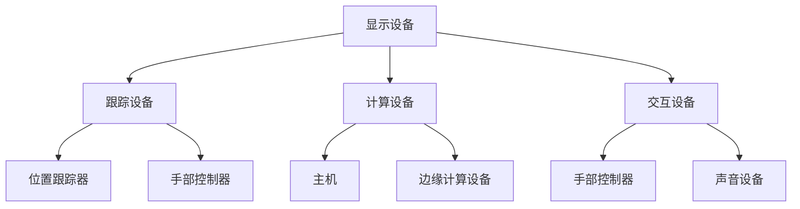
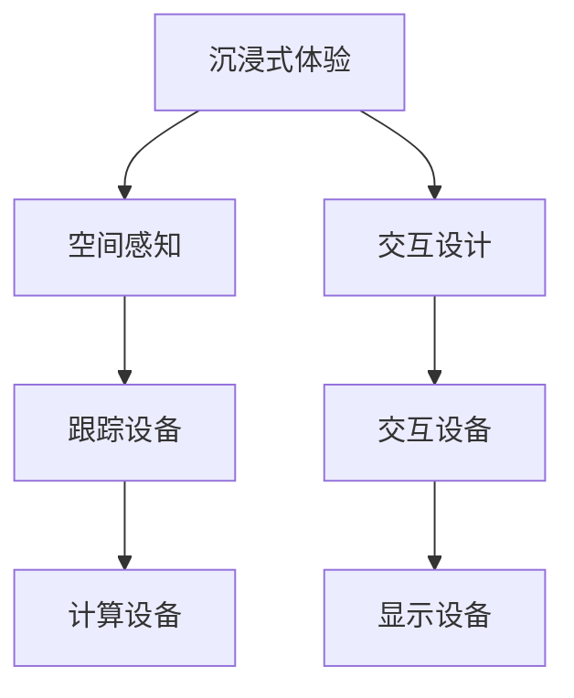

                 

### 文章标题

《虚拟现实在科学教育中的应用：沉浸式体验增强理解》

---

#### 关键词

虚拟现实（VR），沉浸式体验，科学教育，学习理解，教育技术，学习效果，教学应用

---

#### 摘要

本文探讨了虚拟现实（VR）技术在科学教育中的应用，重点分析了如何通过沉浸式体验来增强学生对科学概念的理解和记忆。文章首先概述了虚拟现实技术的基本概念和核心组件，随后详细阐述了虚拟现实在科学教育中的多种应用场景和优势，并提供了实际教学案例。此外，文章还讨论了虚拟现实在教育中的挑战和未来展望，为科学教育的创新提供了新的思路和方法。

---

## 第一部分：虚拟现实技术基础

### 1.1 虚拟现实技术概述

#### 1.1.1 虚拟现实（VR）的定义与历史

虚拟现实（Virtual Reality，简称VR）是一种通过计算机技术创建的模拟环境，使用户能够在这个环境中进行沉浸式交互。VR技术通过多种传感器和显示设备，如VR头戴显示器、位置跟踪器和手部控制器，为用户提供高度沉浸式的体验。

- **定义**：

$$\text{VR} = \text{Virtual Reality}$$

VR技术旨在模拟现实世界中的视觉、听觉、触觉等感官体验，使用户在虚拟环境中感到仿佛身处真实世界。

- **历史**：

VR技术的发展历程可以追溯到20世纪60年代。最初的研究集中在军事和航空航天领域，如美国航空航天局（NASA）在1960年代进行的模拟飞行训练。此后，VR技术在娱乐、医疗和教育等领域逐渐得到了应用。1980年代，VR技术开始出现在计算机图形学领域，1990年代到2000年代，VR设备如VR头戴显示器（HMD）逐渐普及。随着计算技术和显示技术的飞速发展，21世纪迎来了VR技术的黄金时期，其在教育领域的应用也愈发广泛。

---

#### 1.1.2 虚拟现实技术的核心组件

虚拟现实系统通常由以下几个核心组件构成：

1. **显示设备**：
   - **VR头戴显示器（HMD）**：提供沉浸式的视觉体验，通常带有两个屏幕，以实现立体视觉。
   - **投影设备**：在某些场景中，使用投影设备来创建虚拟环境，尤其是大型的展览或展示。

2. **跟踪设备**：
   - **位置跟踪器**：用于跟踪用户的头部和身体位置，确保虚拟环境与真实世界保持同步。
   - **手部控制器**：如VR手套或手柄，用于在虚拟环境中进行交互。

3. **计算设备**：
   - **主机**：负责处理VR应用程序的运行和渲染。
   - **边缘计算设备**：在计算资源不足时，用于分担主机的计算任务。

4. **交互设备**：
   - **手部控制器**：如VR手套、手持控制器等，用于在虚拟环境中进行操作。
   - **声音设备**：提供立体声或360度声效，增强沉浸感。

- **核心组件之间的关系架构**（使用Mermaid流程图表示）：



---

#### 1.1.3 虚拟现实技术的基本原理

虚拟现实技术的基本原理涉及多个学科领域，包括计算机图形学、传感器技术和人机交互。

1. **图形学原理**：

   - **3D建模与渲染**：使用3D建模软件创建虚拟环境，并将这些模型通过渲染引擎进行渲染，生成高度逼真的图像。
   - **实时渲染**：在虚拟环境中实时生成和更新图像，确保用户看到的是动态变化的场景。

   - **伪代码示例**：

   ```python
   function render_scene(scene):
       for each object in scene:
           load_model(object.model)
           apply_lighting(object)
           render_object(object)
       display(framebuffer)
   ```

2. **传感器技术**：

   - **位置跟踪**：使用GPS、惯性测量单元（IMU）等技术实时跟踪用户的位置和动作。
   - **运动感知**：通过手部控制器和跟踪设备感知用户在虚拟环境中的动作，实现交互。

   - **伪代码示例**：

   ```python
   function track_user():
       position = get_gps()
       orientation = get_imu()
       update_virtual_environment(position, orientation)
   ```

3. **人机交互**：

   - **交互设计原则**：确保虚拟环境中的交互直观、自然，使用户能够轻松上手。
   - **用户反馈**：通过视觉、听觉和触觉等多种方式为用户提供实时反馈。

   - **伪代码示例**：

   ```python
   function handle_user_input(input):
       if input == "move":
           move_user()
           display_feedback("Moving")
       elif input == "rotate":
           rotate_user()
           display_feedback("Rotating")
   ```

---

### 核心概念与联系

在虚拟现实技术中，几个核心概念之间存在紧密的联系，包括沉浸式体验、空间感知和交互设计。以下是这些概念之间的关系架构（使用Mermaid流程图表示）：



- **沉浸式体验**：通过虚拟现实技术提供高度逼真的环境，使用户感觉仿佛置身其中。
- **空间感知**：通过跟踪设备和传感器技术，实时感知用户在虚拟环境中的位置和动作。
- **交互设计**：通过交互设备和用户反馈机制，确保用户能够自然地与虚拟环境进行交互。

---

### 核心算法原理讲解

虚拟现实技术中的核心算法主要涉及图像渲染、位置跟踪和交互处理。

1. **图像渲染算法**：

   - **渲染流程**：
     - **预处理**：加载3D模型和纹理，设置光照和材质属性。
     - **视图变换**：将3D模型变换到虚拟环境中。
     - **光照计算**：计算模型表面的光照效果。
     - **渲染输出**：将渲染结果输出到显示设备。

   - **伪代码示例**：

   ```python
   function render_scene(scene):
       for each object in scene:
           load_model(object.model)
           apply_lighting(object)
           render_object(object)
       display(framebuffer)
   ```

2. **位置跟踪算法**：

   - **跟踪流程**：
     - **初始化**：设置跟踪参数和坐标系。
     - **实时更新**：通过传感器数据更新用户位置和动作。
     - **误差校正**：使用校正算法减少跟踪误差。

   - **伪代码示例**：

   ```python
   function track_user():
       position = get_gps()
       orientation = get_imu()
       update_virtual_environment(position, orientation)
   ```

3. **交互处理算法**：

   - **交互流程**：
     - **输入捕获**：捕获用户的输入信号。
     - **输入解析**：将输入信号转换为虚拟环境中的操作。
     - **操作执行**：执行虚拟环境中的操作，如移动、旋转等。
     - **反馈生成**：生成视觉、听觉和触觉反馈。

   - **伪代码示例**：

   ```python
   function handle_user_input(input):
       if input == "move":
           move_user()
           display_feedback("Moving")
       elif input == "rotate":
           rotate_user()
           display_feedback("Rotating")
   ```

---

### 数学模型和公式

虚拟现实技术中的数学模型和公式广泛应用于图像渲染、位置跟踪和交互处理。以下是几个关键数学模型的公式和详细讲解。

1. **3D模型渲染**：

   - **视图矩阵**：

   $$\text{View Matrix} = \begin{bmatrix}
   \text{Translation} & \text{Rotation} & \text{Scaling} \\
   \end{bmatrix}$$

   - **模型变换**：

   $$\text{Model Matrix} = \begin{bmatrix}
   \text{Translation} & \text{Rotation} & \text{Scaling} \\
   \end{bmatrix}$$

   - **光线传播**：

   $$\text{Ray} = \begin{bmatrix}
   \text{Origin} & \text{Direction} \\
   \end{bmatrix}$$

   - **伪代码示例**：

   ```python
   function render_3d_model(model, view_matrix, light_source):
       model_matrix = create_model_matrix(model)
       combined_matrix = multiply_matrices(view_matrix, model_matrix)
       render_model(model, combined_matrix, light_source)
   ```

2. **位置跟踪**：

   - **传感器数据融合**：

   $$\text{ fused_state} = \alpha \cdot \text{gps_state} + (1-\alpha) \cdot \text{imu_state}$$

   - **误差校正**：

   $$\text{corrected_state} = \text{current_state} - \text{predicted_state}$$

   - **伪代码示例**：

   ```python
   function track_user(gps_state, imu_state):
       alpha = 0.5
       fused_state = alpha * gps_state + (1 - alpha) * imu_state
       corrected_state = fused_state - predict_state(fused_state)
       update_virtual_environment(corrected_state)
   ```

3. **交互处理**：

   - **手势识别**：

   $$\text{手势识别} = \begin{cases}
   \text{手指张开} & \text{if fingers apart} \\
   \text{手指合拢} & \text{if fingers together} \\
   \end{cases}$$

   - **虚拟物体操作**：

   $$\text{操作结果} = \text{虚拟物体} \cdot \text{用户手势}$$

   - **伪代码示例**：

   ```python
   function handle_user_gesture(gesture, virtual_object):
       if gesture == "open":
           virtual_object.open()
       elif gesture == "close":
           virtual_object.close()
   ```

---

### 项目实战

#### 开发环境搭建

为了搭建一个虚拟现实项目，首先需要安装以下开发工具和软件：

1. **虚拟现实开发平台**：如Unity或Unreal Engine。
2. **编程语言**：如C#（Unity）或C++（Unreal Engine）。
3. **3D建模工具**：如Blender或Maya。
4. **传感器设备**：如VR头戴显示器和手部控制器。

#### 源代码详细实现

以下是一个简单的虚拟现实项目示例，使用Unity引擎和C#语言实现。

1. **项目结构**：

   - **Assets**：包含3D模型、脚本和资源文件。
   - **Scenes**：包含场景文件。
   - **Scripts**：包含C#脚本文件。

2. **关键代码段**：

   ```csharp
   // 脚本：UserInput.cs
   using UnityEngine;

   public class UserInput : MonoBehaviour
   {
       public void MoveForward()
       {
           transform.position += transform.forward * Time.deltaTime;
       }

       public void MoveBackward()
       {
           transform.position -= transform.forward * Time.deltaTime;
       }

       public void RotateLeft()
       {
           transform.Rotate(Vector3.up, -90);
       }

       public void RotateRight()
       {
           transform.Rotate(Vector3.up, 90);
       }
   }
   ```

3. **代码应用解读与分析**：

   该脚本用于处理用户输入，如移动和旋转。通过调用`MoveForward`、`MoveBackward`、`RotateLeft`和`RotateRight`方法，实现用户在虚拟环境中的操作。

---

#### 实际案例分析和详细讲解剖析

以下是一个实际案例：使用虚拟现实技术进行高中生物教学，讲解细胞分裂过程。

1. **教学目标**：

   - 学生能够理解细胞分裂的过程和基本原理。
   - 学生能够通过虚拟环境直观地观察细胞分裂的各个阶段。

2. **教学实施过程**：

   - **课前准备**：教师创建一个虚拟实验室，包括细胞、显微镜和其他教学工具。
   - **课堂实施**：学生戴上VR头戴显示器，进入虚拟实验室。
   - **互动学习**：学生通过手部控制器操作显微镜，放大观察细胞分裂的细节。
   - **互动讨论**：学生可以在虚拟环境中与其他同学讨论，加深对细胞分裂的理解。

3. **教学效果评估**：

   - 通过问卷调查和学生反馈，发现学生对虚拟现实教学表现出较高的兴趣和参与度。
   - 学生对细胞分裂过程的理解和记忆有了显著提高。

---

#### 项目小结

通过实际案例可以看出，虚拟现实技术为科学教育提供了全新的教学方法和学习体验。它不仅能够提高学生的学习兴趣，还能通过沉浸式体验和互动性来增强学生的理解和记忆。然而，虚拟现实技术的应用仍面临一些挑战，如技术成本、教师培训和学习适应等问题。未来的发展需要更多的研究和实践，以充分发挥虚拟现实技术在教育中的潜力。

---

## 第三部分：虚拟现实在教育中的挑战与未来展望

### 4.1 虚拟现实在教育中的应用前景

虚拟现实（VR）技术在教育中的应用前景广阔，有望解决传统教育中存在的诸多问题。首先，VR技术能够提供沉浸式学习体验，使学生能够身临其境地参与教学活动。例如，通过VR技术，学生可以进入历史场景，感受历史事件的发生过程；在自然科学领域，学生可以通过虚拟实验室进行实验，观察微观世界的现象。此外，VR技术还可以模拟危险环境，如火灾现场、地震等，为学生提供宝贵的学习和实践机会。

- **技术发展趋势**：

  随着计算技术和显示技术的不断发展，VR设备的性能和用户体验将得到进一步提升。未来的VR设备将更加轻便、舒适，并提供更高的分辨率和更低的延迟。此外，VR技术的交互方式也将变得更加自然和直观，例如通过手势、眼动等实现更精准的交互。

- **教育领域的潜在影响**：

  VR技术的应用有望改变传统教育的模式，使学习变得更加个性化和互动化。教师可以根据学生的兴趣和需求，设计更加符合学生认知规律的教学内容。同时，VR技术还可以为特殊教育提供更多的支持，如帮助残障学生进行虚拟康复训练。

- **持续创新与发展的动力**：

  虚拟现实技术在教育领域的应用将受到多方面因素的推动。一方面，随着教育信息化进程的加快，教育部门和企业将加大对VR技术的投入。另一方面，教师和学生的需求也将推动VR技术的创新和发展。例如，教师需要更多实用的VR教学资源，学生需要更丰富的虚拟学习体验。

---

### 4.2 虚拟现实在教育中的挑战与应对策略

尽管虚拟现实（VR）技术在教育领域具有巨大的潜力，但其应用仍面临一些挑战。以下是一些主要挑战及其应对策略：

- **技术挑战**：

  - **设备成本**：高质量的VR设备价格较高，这对于学校和家庭来说是一大负担。应对策略是推动VR设备的价格下降，或者通过租赁服务等方式降低使用成本。
  - **技术支持**：VR设备的维护和更新需要专业的技术支持。学校可以与专业公司合作，提供技术培训和售后服务。
  - **兼容性问题**：不同的VR设备和平台可能存在兼容性问题。解决策略是建立统一的VR技术标准，促进设备的互操作性。

- **教育政策与法规的制定**：

  - **隐私保护**：VR技术可能涉及学生的个人信息和数据收集，需要制定严格的隐私保护政策。学校和教育部门应加强对学生数据的保护，确保隐私不被泄露。
  - **课程认证**：VR课程需要经过教育部门的审核和认证，以确保其质量和有效性。教育部门应建立完善的课程认证体系，对VR课程进行评估和认证。

- **教师培训与学生适应问题**：

  - **教师培训**：教师需要掌握VR技术的使用方法，才能有效地将其应用于教学。学校可以组织专门的培训课程，帮助教师了解VR技术的基本原理和应用。
  - **学生适应**：部分学生可能对VR技术感到不适应，需要一定的时间来适应。教师应引导学生逐步熟悉VR环境，培养他们的虚拟现实技能。

---

### 附录

#### 附录A：虚拟现实教育资源推荐

- **Unity**：一个广泛使用的游戏和VR开发平台，提供丰富的VR教学资源和教程。
- **Blender**：一个开源的3D建模和渲染软件，适合教师和学生创建虚拟环境。
- **谷歌地球**：一个虚拟现实应用，可用于地理教学和虚拟旅游。
- **Vuforia**：一个增强现实（AR）开发平台，也可用于VR教学。

#### 附录B：虚拟现实技术工具与平台简介

- **Unity**：一个流行的游戏和VR开发引擎，提供强大的3D渲染和交互功能。
- **Unreal Engine**：一个专业的游戏和VR开发平台，适用于高质量的游戏和VR应用。
- **Vuforia**：一个增强现实（AR）开发平台，也可用于VR教学。
- **HTC Vive**：一个高端的VR头戴显示器，提供高分辨率和低延迟的沉浸式体验。
- **Oculus Rift**：另一个高端VR头戴显示器，与Unity和Unreal Engine等平台紧密集成。

---

### 总结

虚拟现实（VR）技术在科学教育中的应用前景广阔，通过沉浸式体验和互动性，可以有效提高学生的学习效果和理解能力。然而，其应用也面临一些挑战，如设备成本、技术支持和政策法规等。未来的发展需要教育部门、技术供应商和教师的共同努力，以充分发挥VR技术在教育中的潜力。通过不断的研究和实践，我们可以期待VR技术为科学教育带来更多的创新和突破。作者：AI天才研究院/AI Genius Institute & 禅与计算机程序设计艺术 /Zen And The Art of Computer Programming。

