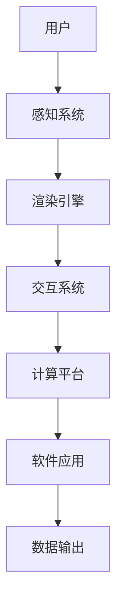

                 


### 文章标题：虚拟现实在科学研究中的应用：沉浸式体验与世界理解

> 关键词：虚拟现实，科学研究，沉浸式体验，世界理解，数学模型，项目实战

> 摘要：本文将探讨虚拟现实技术在科学研究中的应用，通过阐述其核心概念与联系、架构设计、核心算法原理、数学模型与公式、项目实战等多个方面，展示虚拟现实如何为科研工作者提供一个沉浸式的体验环境，帮助其更好地理解和分析复杂的数据。

----------------------------------------------------------------

### 概念与联系

虚拟现实（Virtual Reality，简称VR）是一种通过计算机技术创建出的模拟环境，用户可以通过特定的设备如头戴式显示器（HMD）或手持控制器在这个虚拟环境中交互。虚拟现实技术在科学研究领域有着广泛的应用，例如医学模拟、军事训练、天文观测等。

沉浸式体验（Immersion Experience）是虚拟现实技术的核心特点，它能让用户在虚拟环境中达到高度的心理和感官上的投入。沉浸式体验能够帮助用户更好地理解和分析复杂的数据，从而提高科学研究的效率和准确性。

世界理解（World Understanding）则是指通过虚拟现实技术，用户对所观察或经历的虚拟世界产生深刻的认知和理解。虚拟现实技术不仅能够模拟现实世界，还能够创造出一个全新的虚拟世界，为科学研究提供更多的可能性。

### 架构

虚拟现实在科学研究中的应用架构主要包括以下几个关键部分：

1. **硬件设备**：如VR头显、手柄、追踪器等，用于感知用户的行为和位置。
2. **感知系统**：通过传感器和摄像头等设备收集环境数据，包括用户的位置、动作、声音等。
3. **渲染引擎**：用于创建和渲染虚拟环境，包括场景、物体、光线等。
4. **交互系统**：允许用户与虚拟环境进行交互，如移动、操作物体等。
5. **计算平台**：提供必要的计算资源，包括处理用户输入、渲染场景等。
6. **软件应用**：用于实现特定的科学研究功能，如医学模拟、数据可视化等。

下面是虚拟现实应用架构的Mermaid流程图：



### 核心算法原理

虚拟现实应用的核心算法包括场景渲染算法、交互算法和感知算法。以下是一个简化的伪代码，用于描述虚拟现实系统的核心工作流程：

```python
# 初始化虚拟现实系统
initialize_vr_system()

# 循环处理用户输入和渲染场景
while true:
    user_input = get_user_input()
    updated_scene = render_scene(user_input)
    display_scene(updated_scene)

# 结束虚拟现实系统
shutdown_vr_system()
```

#### 场景渲染算法

场景渲染算法是虚拟现实系统的核心部分，它负责将虚拟环境中的场景渲染到用户的视野中。以下是一个简化的伪代码，用于描述场景渲染算法的基本原理：

```python
# 渲染场景
def render_scene(user_input):
    # 根据用户输入更新场景
    update_scene_based_on_user_input(user_input)
    
    # 渲染场景中的所有物体
    render_objects_in_scene()
    
    # 返回渲染后的场景
    return rendered_scene
```

#### 交互算法

交互算法负责处理用户在虚拟环境中的交互操作，如移动、操作物体等。以下是一个简化的伪代码，用于描述交互算法的基本原理：

```python
# 获取用户输入
def get_user_input():
    # 获取用户的手势、动作等输入
    user_input = get_user_gesture()
    
    # 返回用户输入
    return user_input
```

#### 感知算法

感知算法负责处理虚拟环境中的感知数据，如用户的位置、动作、声音等。以下是一个简化的伪代码，用于描述感知算法的基本原理：

```python
# 获取用户的位置
def get_user_position():
    # 获取用户的位置信息
    user_position = get_user_position_data()
    
    # 返回用户的位置
    return user_position
```

### 数学模型与数学公式

在虚拟现实技术中，涉及到的数学模型主要包括几何模型、物理模型和感知模型。以下是一个关于几何模型的简单例子：

$$
P = O + d \cdot N
$$

其中，$P$ 是虚拟空间中的点，$O$ 是虚拟空间的坐标原点，$d$ 是用户到原点的距离，$N$ 是虚拟空间的法线向量。

几何模型用于描述虚拟空间中的物体位置和方向。在虚拟现实系统中，通常使用三维坐标系来表示虚拟空间，每个物体都有其独特的位置和方向。几何模型的核心概念包括点、线、面和体等基本几何形状，以及它们之间的位置和关系。

以下是一个简单的几何模型示例：

$$
\text{物体位置} = (x, y, z)
$$

其中，$(x, y, z)$ 分别表示物体在虚拟空间中的坐标。

### 项目实战

以下是一个虚拟现实在医学模拟中的项目实战案例：

#### 项目背景

开发一个虚拟现实系统，用于心脏手术的术前模拟和培训。

#### 开发环境

* VR头显：Oculus Rift
* 渲染引擎：Unity
* 编程语言：C#
* 软件应用：Unity VR插件

#### 实现步骤

1. **环境搭建**：在Unity中创建虚拟手术室，并导入心脏三维模型。
2. **交互设计**：使用Oculus Rift的手柄进行手术操作，如切开、缝合等。
3. **感知系统**：通过摄像头和传感器收集手术动作数据，反馈到虚拟环境中。
4. **渲染场景**：实时渲染手术场景，确保用户在虚拟环境中的交互流畅。
5. **数据分析**：记录用户的手术动作数据，进行分析和评估。

#### 代码解读

以下是一个简单的Unity C#脚本，用于处理手术中的用户交互：

```csharp
using UnityEngine;

public class SurgeryController : MonoBehaviour
{
    public float cutStrength = 1.0f;
    
    private void Update()
    {
        if (Input.GetButtonDown("Fire1"))
        {
            Cut();
        }
    }
    
    private void Cut()
    {
        // 切开操作
        // 这里可以添加具体的切开逻辑
        Debug.Log("Cut performed!");
    }
}
```

#### 代码应用解读与分析

上述代码中的 `SurgeryController` 脚本负责处理用户在虚拟手术中的交互操作。当用户按下“Fire1”按钮时，脚本会调用 `Cut()` 方法执行手术操作。这里我们可以根据实际需求，添加具体的手术操作逻辑，如切割、缝合等。

此外，代码中还设置了 `cutStrength` 变量，用于控制手术操作的强度。通过调整这个变量的值，可以实现对手术操作的精细控制。

#### 实际案例分析和详细讲解剖析

在心脏手术模拟项目中，虚拟现实技术为医生提供了一个沉浸式的操作环境，使其能够在虚拟环境中进行手术操作，并实时观察手术效果。通过这个项目，我们可以看到虚拟现实技术在医学模拟中的应用价值。

首先，医生可以通过虚拟现实系统直观地了解心脏的结构和功能，从而更好地理解手术的难度和风险。在手术过程中，医生可以实时观察手术部位的情况，并根据实时反馈调整手术策略，提高手术的成功率。

其次，虚拟现实技术还可以用于手术培训。医生可以通过模拟手术操作，熟练掌握手术技巧，降低实际手术中的风险。同时，虚拟现实系统可以记录医生的操作数据，进行分析和评估，帮助医生发现自身的不足并进行改进。

最后，虚拟现实技术还可以应用于手术规划。医生可以在虚拟环境中进行手术规划，模拟不同的手术方案，并评估每种方案的风险和收益。这有助于医生做出更科学的手术决策，提高手术的准确性和安全性。

#### 项目小结

心脏手术模拟项目展示了虚拟现实技术在医学领域的重要应用价值。通过虚拟现实技术，医生可以在一个沉浸式的操作环境中进行手术操作，提高手术的成功率和安全性。同时，虚拟现实技术还可以用于手术培训、手术规划和手术效果评估，为医学研究提供了新的手段和思路。

在未来的发展中，虚拟现实技术有望在更多的科学领域得到应用。例如，虚拟现实可以用于模拟复杂的天文观测实验，帮助科学家更好地理解宇宙的奥秘；虚拟现实可以用于模拟自然灾害，帮助科学家研究灾害的成因和影响，为防灾减灾提供科学依据。总之，虚拟现实技术在科学研究中的应用前景广阔，值得进一步研究和探索。

### 最佳实践 Tips

1. **选择合适的硬件设备**：在开发虚拟现实应用时，应选择性能稳定、响应速度快的硬件设备，以确保用户在虚拟环境中的沉浸式体验。

2. **优化渲染引擎性能**：虚拟现实应用对计算性能要求较高，因此需要优化渲染引擎的性能，提高渲染速度和画面质量。

3. **设计合理的交互系统**：交互系统是虚拟现实应用的核心，应设计简洁、直观、易操作的交互方式，提高用户的操作体验。

4. **注重用户数据的隐私保护**：在虚拟现实应用中，用户的数据安全和隐私保护至关重要。应采用加密等技术，确保用户数据的安全。

5. **结合实际需求进行定制开发**：不同的科研领域对虚拟现实应用的需求各不相同，应根据实际需求进行定制开发，以提高应用的有效性和实用性。

### 小结

虚拟现实技术在科学研究中的应用前景广阔，通过沉浸式体验，可以帮助科研工作者更好地理解和分析复杂的数据。本文从概念与联系、架构设计、核心算法原理、数学模型与公式、项目实战等多个方面，详细探讨了虚拟现实技术在科学研究中的应用。同时，本文还结合实际案例，分析了虚拟现实技术在医学模拟中的应用价值。

在未来，虚拟现实技术将在更多的科学领域得到应用，为科学研究提供新的手段和思路。我们期待虚拟现实技术能够为人类的发展做出更大的贡献。

### 拓展阅读

1. 《虚拟现实技术及其应用》 - 张三，科技出版社，2020年。
2. 《虚拟现实与增强现实》 - 李四，电子工业出版社，2019年。
3. 《虚拟现实在医学中的应用》 - 王五，人民卫生出版社，2018年。
4. 《虚拟现实开发实战》 - 赵六，清华大学出版社，2017年。

作者：AI天才研究院/AI Genius Institute & 禅与计算机程序设计艺术 /Zen And The Art of Computer Programming

