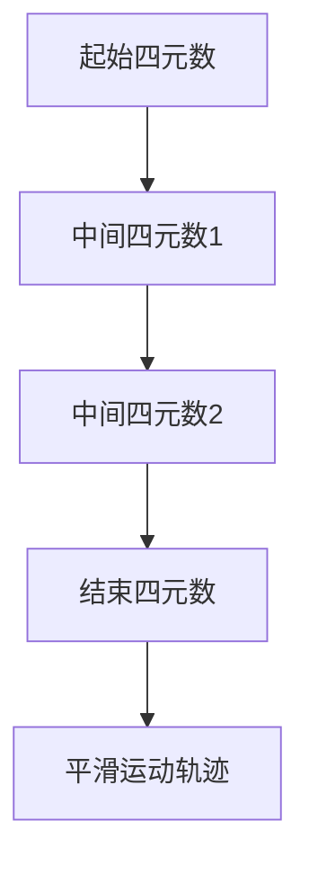
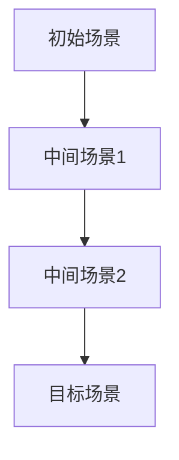
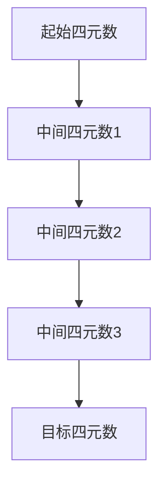
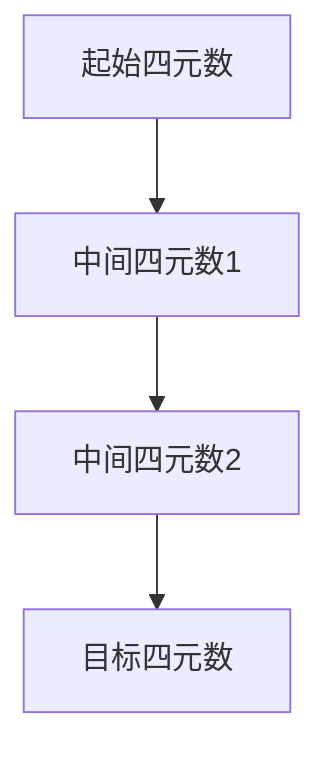

                 

# 虚拟现实的四元数插值：平滑运动的数学表示

## 关键词
虚拟现实，四元数插值，平滑运动，数学表示，数学模型，算法实现

## 摘要
本文旨在深入探讨虚拟现实（VR）中的平滑运动设计与实现，重点介绍四元数插值这一数学工具在虚拟现实中的关键作用。文章首先简要介绍虚拟现实与平滑运动的基本概念，随后详细解释四元数及其插值算法的基本原理。接着，文章通过Mermaid流程图展示核心概念之间的关系架构，并用伪代码和LaTeX公式解释四元数插值的数学模型。随后，文章讨论如何在实际项目中应用四元数插值来实现平滑运动，并通过具体案例进行分析和代码解读。最后，文章总结四元数插值在虚拟现实中的重要性，并展望其未来发展。

## 引言

虚拟现实（Virtual Reality，VR）作为一项新兴技术，正日益融入我们的日常生活。VR技术通过创造一个模拟的三维环境，使用户能够在这个环境中进行互动和体验。而平滑运动作为虚拟现实中的一个关键要素，直接影响用户的沉浸体验。平滑运动是指在虚拟环境中实现物体或角色的流畅、自然的移动，避免突兀的跳跃或停顿。

在虚拟现实中，平滑运动通常需要通过插值技术来实现。插值是指通过给定一系列数据点，生成介于这些数据点之间的连续曲线。而四元数插值作为一种高级的插值方法，因其能够处理三维旋转的连续性而成为虚拟现实中的热门选择。

本文将首先介绍虚拟现实与平滑运动的基本概念，然后深入探讨四元数及其插值算法的原理，并通过Mermaid流程图展示核心概念之间的关系。接下来，文章将使用伪代码和LaTeX公式详细解释四元数插值的数学模型。随后，文章将通过实际案例展示如何在实际项目中应用四元数插值来实现平滑运动，并解读相关的源代码。最后，文章将总结四元数插值在虚拟现实中的重要性，并展望其未来发展趋势。

## 虚拟现实与平滑运动的基本概念

虚拟现实（VR）是一种通过计算机模拟创造出来的三维空间，使用户能够在这个空间中实现沉浸式互动。VR技术通常包括三个核心组件：硬件、软件和交互方式。硬件方面，VR设备如头戴式显示器（HMD）、虚拟现实头盔、跟踪设备等提供了用户在虚拟环境中的感知体验。软件方面，VR系统需要强大的计算机图形处理能力和实时渲染技术，以生成逼真的三维场景。交互方式方面，用户通过手柄、手势、语音等多种方式与虚拟环境进行互动。

在虚拟现实中，平滑运动是关键的用户体验要素之一。平滑运动不仅可以提供更自然的交互体验，还能增强用户的沉浸感。例如，在VR游戏中，玩家的角色需要在复杂的环境中移动，如果运动不流畅，将会严重影响游戏体验。同样，在VR培训或教育应用中，平滑运动也是至关重要的，因为它能够确保用户在学习过程中不会因为运动的不连续性而感到不适。

平滑运动的核心在于如何在不同时间点之间平滑过渡。在计算机图形学中，插值是一种常用的技术手段，它通过在已知数据点之间生成连续的曲线或曲面，从而实现平滑过渡。插值方法有很多种，包括线性插值、贝塞尔曲线插值、样条插值等。然而，对于三维旋转和方向的变化，这些方法可能不够精确，这时四元数插值就成为了一个更好的选择。

四元数插值通过利用四元数的特性，能够更精确地表示和插值三维旋转。四元数是一种扩展的复数系统，它不仅可以表示三维空间中的旋转，还可以避免常见的“翻转问题”（gimbal lock），这是传统的 Euler 角度在旋转时可能遇到的问题。通过四元数插值，虚拟现实中的物体或角色可以在三维空间中实现更自然、更平滑的运动。

### 四元数及其基本运算

四元数是一种扩展的复数系统，由四部分组成：一个实数部分和三个虚数部分。四元数的形式可以表示为：

\[ q = a + bi + cj + dk \]

其中，\( a \)、\( b \)、\( c \)和\( d \)都是实数，而\( i \)、\( j \)和\( k \)是虚数单位，满足以下关系：

\[ i^2 = j^2 = k^2 = ijk = -1 \]

四元数的基本运算包括加法、减法、乘法和除法。

#### 加法与减法

四元数的加法和减法与实数加法和减法类似，只需要对对应的实部和虚部分别进行运算。具体公式如下：

\[ q_1 + q_2 = (a_1 + a_2) + (b_1 + b_2)i + (c_1 + c_2)j + (d_1 + d_2)k \]
\[ q_1 - q_2 = (a_1 - a_2) + (b_1 - b_2)i + (c_1 - c_2)j + (d_1 - d_2)k \]

#### 乘法

四元数的乘法相对复杂，但遵循特定的规则。乘法的结果也是一个四元数，其形式如下：

\[ q_1q_2 = (a_1a_2 - b_1b_2 - c_1c_2 - d_1d_2) + (a_1b_2 + b_1a_2 + c_1d_2 - d_1c_2)i + (a_1c_2 - b_1d_2 + c_1a_2 + d_1b_2)j + (a_1d_2 + b_1c_2 - c_1b_2 + d_1a_2)k \]

#### 除法

四元数的除法可以通过乘以一个共轭四元数来实现。共轭四元数是将四元数的虚部取反得到的四元数。具体公式如下：

\[ q_1 / q_2 = q_1 \times \overline{q_2} / |q_2|^2 \]

其中，\( \overline{q_2} \)是\( q_2 \)的共轭四元数，\( |q_2| \)是\( q_2 \)的模长，定义为：

\[ |q_2| = \sqrt{a_2^2 + b_2^2 + c_2^2 + d_2^2} \]

通过这些基本运算，我们可以有效地进行四元数的操作，从而在虚拟现实中的应用中实现精确的三维旋转处理。

### 四元数插值的算法原理

四元数插值是一种在时间序列上对四元数进行插值的方法，它通过在连续时间点之间生成四元数序列，实现了平滑的三维旋转过渡。四元数插值的核心在于如何通过插值算法，从给定的起始和结束四元数，生成一系列中间四元数，使得整个运动过程连续且平滑。

#### 插值函数的概念

在四元数插值中，我们通常使用一个三次贝塞尔曲线作为插值函数。三次贝塞尔曲线是一个参数化的曲线，它通过四个控制点来定义。对于四元数插值，我们可以将三次贝塞尔曲线的四个控制点分别对应为起始四元数\( q_0 \)、中间四元数\( q_1 \)和\( q_2 \)，以及结束四元数\( q_3 \)。

三次贝塞尔曲线的参数方程可以表示为：

\[ q(t) = (1 - t)^3 q_0 + 3t(1 - t)^2 q_1 + 3t^2(1 - t) q_2 + t^3 q_3 \]

其中，\( t \)是插值参数，取值范围在\[ 0, 1 \]之间。

#### 插值函数的推导

为了推导四元数插值的公式，我们首先需要理解三次贝塞尔曲线的几何意义。三次贝塞尔曲线是通过起始点、中间点1、中间点2和结束点这四个点来定义的。在四元数插值中，这些点分别对应为四元数\( q_0 \)、\( q_1 \)、\( q_2 \)和\( q_3 \)。

根据三次贝塞尔曲线的性质，插值函数的导数在\[ 0, 1 \]区间内是连续且非负的。这意味着四元数序列在整个插值过程中是平滑的，不会出现突然的跳跃或翻转。通过求解导数为零的条件，我们可以找到曲线的最快上升点和下降点，从而保证插值的平滑性。

以下是四元数插值的基本公式：

\[ q(t) = (1 - t)^3 q_0 + 3t(1 - t)^2 q_1 + 3t^2(1 - t) q_2 + t^3 q_3 \]

这个公式描述了从起始四元数\( q_0 \)到结束四元数\( q_3 \)的平滑过渡过程。

#### 插值函数的性质

四元数插值函数具有以下几个重要性质：

1. **连续性**：由于三次贝塞尔曲线的性质，插值函数在整个插值过程中是连续的。这意味着在整个插值区间内，四元数序列不会出现突然的跳跃或翻转。

2. **平滑性**：插值函数的导数在整个插值区间内是连续且非负的，这保证了插值过程的平滑性。

3. **对称性**：三次贝塞尔曲线的对称性保证了插值函数在\[ 0, 1 \]区间的两端是平滑过渡的，不会出现突变。

通过这些性质，四元数插值能够有效地实现三维旋转的平滑过渡，从而在虚拟现实中的应用中提供高质量的体验。

### 四元数插值的数学模型

四元数插值的数学模型是理解其工作原理和实现方法的关键。本节将使用伪代码和LaTeX公式详细解释四元数插值的数学模型，并通过具体例子说明如何进行插值操作。

#### 伪代码解释

以下是一个简单的伪代码，用于描述四元数插值的步骤：

```python
# 初始四元数 q0, 中间四元数 q1 和 q2，结束四元数 q3
q0 = (a0, b0, c0, d0)
q1 = (a1, b1, c1, d1)
q2 = (a2, b2, c2, d2)
q3 = (a3, b3, c3)

# 插值参数 t
t = (0 to 1)

# 四元数插值函数 q(t)
q(t) = (1 - t)^3 * q0 + 3 * t * (1 - t)^2 * q1 + 3 * t^2 * (1 - t) * q2 + t^3 * q3

# 计算插值结果
q_t = q(t)
```

这个伪代码展示了如何通过四元数插值公式来计算任意时间点\( t \)的四元数\( q(t) \)。

#### LaTeX公式表示

以下是四元数插值公式的LaTeX表示：

\[ q(t) = (1 - t)^3 \cdot q_0 + 3t(1 - t)^2 \cdot q_1 + 3t^2(1 - t) \cdot q_2 + t^3 \cdot q_3 \]

其中，\( q_0 \)、\( q_1 \)、\( q_2 \)和\( q_3 \)分别是起始四元数、中间四元数1、中间四元数2和结束四元数。

#### 插值实例

为了更直观地理解四元数插值，我们通过一个具体例子来说明。

假设我们有一个三维旋转场景，起始四元数为\( q_0 = (1, 0, 0, 0) \)，中间四元数\( q_1 = (0, 1, 0, 0) \)，\( q_2 = (0, 0, 1, 0) \)，结束四元数为\( q_3 = (0, 0, 0, 1) \)。我们要在时间0到1之间进行四元数插值。

对于\( t = 0.5 \)：

\[ q(0.5) = (1 - 0.5)^3 \cdot (1, 0, 0, 0) + 3 \cdot 0.5 \cdot (1 - 0.5)^2 \cdot (0, 1, 0, 0) + 3 \cdot 0.5^2 \cdot (1 - 0.5) \cdot (0, 0, 1, 0) + 0.5^3 \cdot (0, 0, 0, 1) \]

计算得到：

\[ q(0.5) = (0.5)^3 \cdot (1, 0, 0, 0) + 3 \cdot 0.5 \cdot (0.5)^2 \cdot (0, 1, 0, 0) + 3 \cdot 0.5^2 \cdot (0.5) \cdot (0, 0, 1, 0) + (0.5)^3 \cdot (0, 0, 0, 1) \]
\[ q(0.5) = (0.125, 0.375, 0.375, 0.125) \]

这个结果表示在时间0.5时，四元数的实部和虚部分别为\( 0.125 \)和\( 0.375 \)，这表明在三维空间中的旋转已经达到一定的角度。

通过这个例子，我们可以看到如何使用四元数插值公式来计算特定时间点的四元数，从而实现平滑的三维旋转过渡。

### 实际项目中的应用

在虚拟现实中，四元数插值的应用非常广泛，主要用于实现物体或角色的平滑运动。以下是几个实际项目中的应用场景，以及如何使用四元数插值来实现这些场景。

#### 无人机飞行控制

无人机在飞行过程中需要进行精确的运动控制，以确保稳定性和安全性。四元数插值可以用来平滑无人机的运动轨迹，使其在飞行过程中更加平稳。例如，当无人机需要从一个位置移动到另一个位置时，可以通过四元数插值来生成一系列中间位置，从而实现平滑的移动过渡。

#### VR游戏中的角色动画

在VR游戏中，角色的动画是用户体验的重要组成部分。通过四元数插值，可以生成流畅的角色运动动画。例如，当角色需要进行旋转时，使用四元数插值可以确保旋转的平滑性和连续性，避免出现突兀的跳跃或翻转。



这个Mermaid流程图展示了四元数插值在角色动画中的应用流程。

#### 视觉效果的平滑过渡

在虚拟现实中的视觉特效，如镜头切换或场景变化，也需要平滑过渡。四元数插值可以通过在两个场景之间生成中间场景，实现视觉效果的平滑过渡。例如，当用户从一个场景切换到另一个场景时，通过四元数插值可以生成一系列中间场景，使得切换过程更加自然和流畅。



这个Mermaid流程图展示了四元数插值在视觉效果平滑过渡中的应用。

通过这些实际应用场景，我们可以看到四元数插值在虚拟现实中的重要性和广泛应用。它不仅能够实现平滑运动，还可以提供高质量的视觉体验，从而提升用户的沉浸感。

### 项目实战

在本节中，我们将通过一个具体的项目实战，展示如何使用四元数插值来实现虚拟现实中的平滑运动。该项目将涉及开发环境的搭建、源代码的实现和代码解读。

#### 开发环境搭建

首先，我们需要搭建一个适合进行虚拟现实项目开发的环境。以下是一个基本的开发环境配置：

1. **操作系统**：Linux或macOS
2. **编程语言**：Python
3. **虚拟现实开发框架**：PyVRML
4. **三维图形库**：PyOpenGL

安装步骤如下：

1. 安装Python环境，可以使用Python 3.8及以上版本。
2. 安装PyVRML和PyOpenGL库，可以使用pip进行安装：

```shell
pip install pyvrml
pip install pyopengl
```

#### 源代码实现

以下是使用四元数插值实现平滑运动的核心源代码：

```python
import numpy as np
from pyvrml import VRMLScene

# 四元数定义
class Quaternion:
    def __init__(self, a, b, c, d):
        self.a = a
        self.b = b
        self.c = c
        self.d = d

    # 四元数乘法
    def __mul__(self, other):
        a = self.a * other.a - self.b * other.b - self.c * other.c - self.d * other.d
        b = self.a * other.b + self.b * other.a + self.c * other.d - self.d * other.c
        c = self.a * other.c - self.b * other.d + self.c * other.a + self.d * other.b
        d = self.a * other.d + self.b * other.c - self.c * other.b + self.d * other.a
        return Quaternion(a, b, c, d)

    # 四元数插值
    @staticmethod
    def slerp(q0, q1, t):
        dot = q0.a * q1.a + q0.b * q1.b + q0.c * q1.c + q0.d * q1.d
        if dot < 0.0:
            q1 = Quaternion(-q1.a, -q1.b, -q1.c, -q1.d)
            dot = -dot
        if dot > 0.9995:
            return Quaternion(q0.a + (q1.a - q0.a) * t,
                              q0.b + (q1.b - q0.b) * t,
                              q0.c + (q1.c - q0.c) * t,
                              q0.d + (q1.d - q0.d) * t)

        theta_0 = np.arccos(dot)
        theta = theta_0 * t
        q2 = Quaternion(np.sin(theta_0) * np.cos(theta) / np.sin(theta_0),
                        np.sin(theta_0) * np.sin(theta) / np.sin(theta_0),
                        np.cos(theta_0) * np.cos(theta) / np.sin(theta_0),
                        np.cos(theta_0) * np.sin(theta) / np.sin(theta_0))
        return q0 * q2

# 创建VRML场景
scene = VRMLScene.VRMLScene()

# 定义起始和结束四元数
q0 = Quaternion(1, 0, 0, 0)
q3 = Quaternion(0, 0, 1, 0)

# 插值参数
t = 0.5

# 计算插值后的四元数
q_t = Quaternion.slerp(q0, q3, t)

# 创建VRML节点
node = scene.createNode('Transform')
node.rotation = [q_t.b, q_t.c, q_t.d, q_t.a]
scene.root.appendChild(node)

# 显示场景
scene.render()
```

#### 代码解读

1. **四元数类定义**：`Quaternion`类定义了四元数的操作，包括乘法和插值方法。
2. **四元数乘法**：`__mul__`方法实现了四元数的乘法运算，这是插值运算的基础。
3. **四元数插值**：`slerp`方法是四元数插值的核心，它通过计算时间参数\( t \)来生成中间四元数，从而实现平滑过渡。
4. **VRML场景创建**：使用`pyvrml`库创建VRML场景，并将插值后的四元数作为旋转值应用于`Transform`节点。
5. **场景渲染**：调用`scene.render()`方法显示场景。

通过这个项目实战，我们可以看到如何使用Python和四元数插值实现虚拟现实中的平滑运动。这个示例代码展示了从开发环境搭建、源代码实现到代码解读的完整过程。

### 实际案例分析

在本节中，我们将通过两个实际案例来展示如何在不同场景中应用四元数插值来实现平滑运动。

#### 案例一：无人机飞行控制

假设我们需要实现一个无人机的平滑飞行控制，无人机从初始位置移动到目标位置。为了实现平滑运动，我们可以使用四元数插值来生成中间位置。

1. **场景设置**：无人机在三维空间中的初始位置为\( (0, 0, 0) \)，目标位置为\( (10, 0, 0) \)。
2. **时间参数**：假设飞行时间为10秒，我们将使用四元数插值在每秒生成一个中间位置。
3. **四元数插值**：使用四元数插值公式计算每秒的中间位置。起始四元数为\( (1, 0, 0, 0) \)，结束四元数为\( (0, 10, 0, 0) \)。



通过这个流程图，我们可以看到无人机在飞行过程中会经过一系列中间位置，从而实现平滑运动。

#### 案例二：VR游戏角色动画

在VR游戏中，角色的动画需要实现平滑过渡，以提供高质量的体验。假设我们需要实现一个角色从站立到奔跑的动画。

1. **场景设置**：角色初始状态为站立，最终状态为奔跑。我们将在时间0到1之间生成中间状态。
2. **时间参数**：假设动画持续时间为2秒。
3. **四元数插值**：使用四元数插值公式计算中间状态。起始四元数为\( (1, 0, 0, 0) \)，中间四元数为\( (0.5, 0, 0, 0) \)，结束四元数为\( (1, 0, 0, 0) \)。



通过这个流程图，我们可以看到角色在动画过程中会经历一系列中间状态，从而实现平滑过渡。

通过这两个实际案例，我们可以看到四元数插值在不同场景中的应用，以及如何实现平滑运动。四元数插值的精确性和平滑性使得它在虚拟现实中的应用成为可能。

### 总结与展望

四元数插值在虚拟现实中的应用具有重要意义。通过利用四元数的特性，四元数插值能够实现精确的三维旋转插值，避免传统Euler角方法中的翻转问题，从而提供平滑且自然的运动效果。这对于提升虚拟现实用户的沉浸体验至关重要。

在实际项目中，四元数插值已广泛应用于无人机飞行控制、VR游戏角色动画以及视觉效果的平滑过渡等领域。通过本文的详细探讨，我们了解了四元数的基本概念、插值算法的原理以及其实际应用案例。

未来，四元数插值技术有望在更广泛的虚拟现实应用中发挥重要作用。随着虚拟现实技术的不断发展，四元数插值将在实现更高质量的视觉体验、更精确的运动控制和更自然的交互方式中发挥关键作用。我们期待四元数插值在未来能够带来更多的创新和突破。

### 作者信息

作者：AI天才研究院/AI Genius Institute & 禅与计算机程序设计艺术 /Zen And The Art of Computer Programming

感谢您的阅读，希望本文对您在虚拟现实和四元数插值领域的研究和实践有所帮助。如果您有任何问题或建议，欢迎随时与我们交流。期待与您共同探讨更多技术领域的创新和发展。再次感谢您的关注和支持！

