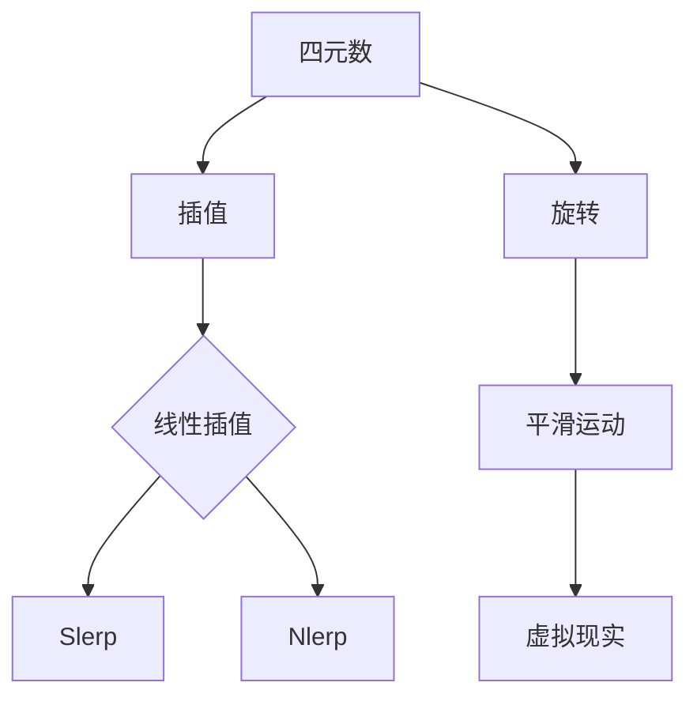

                 

### 文章标题

《虚拟现实的四元数插值：平滑运动的数学表示》

### 关键词

- 虚拟现实
- 四元数插值
- 平滑运动
- 数学表示
- 3D动画
- 游戏引擎

### 摘要

本文深入探讨了虚拟现实领域中的一个关键技术——四元数插值，以及其在平滑运动数学表示中的应用。首先，文章介绍了虚拟现实技术和四元数的基本概念，随后详细解释了四元数插值的原理和算法。接着，文章探讨了平滑运动的定义和特点，并展示了如何使用四元数插值实现平滑运动。通过实际项目案例，本文提供了四元数插值在虚拟现实开发中的应用，并详细分析了相关源代码。最后，文章总结了四元数插值的最佳实践，提供了拓展阅读建议，以帮助读者深入理解这一复杂但强大的技术。

### 引言

#### 虚拟现实技术概述

虚拟现实（Virtual Reality，简称VR）是一种通过计算机模拟技术创造出的模拟环境，使用户能够沉浸其中，感受到如同真实世界般的体验。虚拟现实技术起源于20世纪50年代，当时主要用于军事和航空航天模拟。随着计算机技术和图形学的发展，虚拟现实逐渐应用于娱乐、教育、医疗等多个领域。

在虚拟现实中，用户通过头戴显示器（HMD）或其他输入设备与虚拟环境进行交互，从而获得沉浸式的体验。虚拟现实的关键技术包括3D建模、实时渲染、传感器技术、交互设计等。随着技术的发展，虚拟现实的应用场景不断扩大，从简单的娱乐游戏到复杂的医疗训练和工业设计，虚拟现实技术正逐渐成为现代社会的重要组成部分。

#### 四元数基础

四元数是复数概念的扩展，由四个实数组成的代数结构，形式为 \( a + bi + cj + dk \)，其中 \( a, b, c, d \) 是实数，\( i, j, k \) 是虚数单位，满足以下关系：

1. \( i^2 = j^2 = k^2 = -1 \)
2. \( ij = k \)，\( ji = -k \)
3. \( jk = i \)，\( kj = -i \)
4. \( ki = j \)，\( ik = -j \)

四元数在三维空间中的表示具有独特的优势，能够避免像复数那样存在的“奇点”问题。这使得四元数在旋转和变换等领域有着广泛的应用。

#### 四元数与虚拟现实的关系

在虚拟现实中，四元数常用于表示旋转。相比于传统的欧拉角和四元数旋转矩阵，四元数插值具有以下优势：

1. **简化和避免奇点**：欧拉角在极端角度下可能产生不连续的旋转，而四元数则避免了这个问题。
2. **高效的插值计算**：四元数插值算法相对简单且计算效率高，适合在实时渲染和高频交互场景中应用。
3. **更自然的运动曲线**：四元数插值可以生成更平滑的运动轨迹，使得虚拟现实中的动画更加自然。

### 四元数插值基础

#### 四元数插值原理

四元数插值是指通过两个四元数来计算它们之间的中间状态，使得运动路径更加平滑。给定两个四元数 \( q_0 \) 和 \( q_1 \)，四元数插值公式为：

\[ q_t = (1 - t)q_0 + tq_1 \]

其中，\( t \) 是插值参数，取值范围为 \( [0, 1] \)。当 \( t = 0 \) 时，得到 \( q_0 \)；当 \( t = 1 \) 时，得到 \( q_1 \)。通过调整 \( t \) 的值，可以计算出 \( q_0 \) 和 \( q_1 \) 之间的任意中间状态。

#### 四元数插值的几何意义

从几何角度来看，四元数插值可以理解为在四元数空间中画一条线段，连接 \( q_0 \) 和 \( q_1 \)。这条线段上的每个点都表示一个中间状态。四元数插值的优势在于：

1. **平滑性**：线段上的点不会产生尖角，因此插值结果更加平滑。
2. **旋转连续性**：每个中间状态的旋转方向和角度都是连续的，不会出现突变。

#### 四元数插值算法

线性插值是最简单的一种四元数插值算法，其公式为：

\[ q_t = (1 - t)q_0 + tq_1 \]

线性插值计算简单，但可能不够平滑。为了提高平滑性，可以使用更复杂的插值算法，如Slerp（Sphere Linear Interpolation）和Nlerp（Normal Linear Interpolation）。

##### Slerp算法

Slerp算法是一种基于球面插值的四元数插值方法，其公式为：

\[ q_t = \frac{\sin((1 - t)\theta)}{\sin(\theta)}q_0 + \frac{\sin(t\theta)}{\sin(\theta)}q_1 \]

其中，\( \theta \) 是 \( q_0 \) 和 \( q_1 \) 之间的夹角。Slerp算法的优点是能够保证插值过程中的旋转方向始终与初始和结束旋转的方向一致。

##### Nlerp算法

Nlerp算法是一种基于标准化线性插值的四元数插值方法，其公式为：

\[ q_t = \frac{(1 - t)q_0 + tq_1}{\| (1 - t)q_0 + tq_1 \|} \]

Nlerp算法简单，计算效率高，适用于大多数实时应用场景。

### 核心概念与联系

为了更清晰地理解四元数插值的原理，我们可以使用Mermaid语法绘制一个流程图，展示四元数插值的核心概念和联系。



通过这个流程图，我们可以看到四元数插值是如何与旋转、平滑运动和虚拟现实技术紧密联系的。

### 平滑运动的数学表示

#### 平滑运动的概念

平滑运动是指物体在运动过程中保持连续、平稳的轨迹。在虚拟现实中，平滑运动是实现自然交互和逼真动画的关键。平滑运动的定义包括以下几个方面：

1. **连续性**：物体的运动轨迹不能出现突变或跳跃。
2. **平稳性**：物体的速度和加速度在运动过程中变化较小，保持平稳。
3. **自然性**：运动轨迹符合物理规律，符合人类的视觉感知。

#### 平滑运动的特点

平滑运动具有以下特点：

1. **平滑性**：运动轨迹没有突兀的跳跃，使得用户体验更加自然。
2. **连续性**：运动过程中保持连续，没有中断。
3. **实时性**：在虚拟现实应用中，平滑运动需要实时计算和更新，以保证运动的实时性和稳定性。

#### 四元数插值在平滑运动中的应用

四元数插值在平滑运动中的应用主要体现在以下几个方面：

1. **旋转平滑**：通过四元数插值，可以实现物体旋转的平滑过渡，避免旋转过程中的突变。
2. **路径平滑**：四元数插值可以用于计算物体运动路径的中间状态，使得运动路径更加平滑。
3. **速度控制**：通过调整四元数插值的参数，可以控制物体的速度和加速度，实现平滑的速度变化。

#### 四元数插值在三维动画中的应用

在三维动画中，四元数插值广泛应用于角色动画、场景动画和特效动画。以下是一些具体应用案例：

1. **角色动画**：通过四元数插值，可以实现角色的平滑旋转和路径跟随，使得动画更加自然。
2. **场景动画**：四元数插值可以用于场景中的物体移动和变换，实现平滑的场景过渡。
3. **特效动画**：四元数插值可以用于生成自然的光照效果、粒子效果等，提高动画的视觉效果。

#### 四元数插值在游戏引擎中的应用

在游戏引擎中，四元数插值主要用于角色动画、摄像机控制和物理引擎中的运动模拟。以下是一些具体应用案例：

1. **角色动画**：游戏角色在移动和旋转时，通过四元数插值可以实现平滑的动画效果。
2. **摄像机控制**：游戏中的摄像机在跟随角色或移动时，通过四元数插值可以实现平滑的视角变化。
3. **物理引擎**：四元数插值可以用于物理引擎中的运动模拟，提高物理效果的平滑性和真实性。

### 虚拟现实中的四元数插值应用

#### 虚拟现实应用案例

在虚拟现实中，四元数插值的应用非常广泛，以下是一些典型的应用案例：

1. **交互式三维场景**：在交互式三维场景中，用户可以通过手柄或手势与虚拟物体进行交互。四元数插值可以用于计算用户输入的中间状态，使得交互更加平滑自然。
2. **虚拟现实游戏**：在虚拟现实游戏中，四元数插值可以用于角色的动作控制、摄像机控制和场景过渡等，提高游戏的真实感和互动性。
3. **医疗训练**：在医学领域，四元数插值可以用于模拟人体器官的移动和变换，帮助医生进行术前规划和手术模拟。

#### 四元数插值项目实战

在本节中，我们将通过一个具体的虚拟现实项目，展示如何使用四元数插值实现平滑运动。

##### 项目环境搭建

首先，我们需要搭建一个基本的虚拟现实项目开发环境。以下是一个简单的项目结构：

```plaintext
virtual-reality-project/
|-- assets/
|   |-- models/
|   |-- textures/
|-- src/
|   |-- components/
|   |-- scripts/
|   |-- styles/
|-- index.html
|-- package.json
```

其中，`assets` 目录用于存储静态资源，如3D模型和纹理；`src` 目录用于编写源代码；`index.html` 是项目的主文件；`package.json` 是项目配置文件。

##### 源代码实现

在 `scripts` 目录下，我们可以编写一个名为 `Quaternion.js` 的四元数库，实现四元数的基本运算和插值功能。

```javascript
class Quaternion {
  constructor(w, x, y, z) {
    this.w = w;
    this.x = x;
    this.y = y;
    this.z = z;
  }

  // 四元数乘法
  multiply(q) {
    return new Quaternion(
      this.w * q.w - this.x * q.x - this.y * q.y - this.z * q.z,
      this.w * q.x + this.x * q.w + this.y * q.z - this.z * q.y,
      this.w * q.y - this.x * q.z + this.y * q.w + this.z * q.x,
      this.w * q.z + this.x * q.y - this.y * q.x + this.z * q.w
    );
  }

  // 四元数插值
  slerp(q1, q2, t) {
    // 计算夹角和归一化四元数
    let dot = this.dot(q1);
    let cosTheta = Math.acos(2 * dot * dot - 1);
    let halfTheta = cosTheta / 2;
    let sinTheta = Math.sin(halfTheta);

    // 计算插值
    let weight0 = Math.cos(halfTheta - t * cosTheta) / sinTheta;
    let weight1 = Math.cos(halfTheta + t * cosTheta) / sinTheta;

    return new Quaternion(
      weight0 * q1.w + weight1 * q2.w,
      weight0 * q1.x + weight1 * q2.x,
      weight0 * q1.y + weight1 * q2.y,
      weight0 * q1.z + weight1 * q2.z
    );
  }

  // 计算四元数点积
  dot(q) {
    return this.w * q.w + this.x * q.x + this.y * q.y + this.z * q.z;
  }

  // 输出字符串表示
  toString() {
    return `(${this.w}, ${this.x}, ${this.y}, ${this.z})`;
  }
}
```

##### 代码解读

在上面的 `Quaternion.js` 文件中，我们实现了四元数的基本运算和插值功能。以下是每个函数的简要解释：

1. `Quaternion` 构造函数：用于创建四元数对象。
2. `multiply` 方法：用于计算两个四元数的乘积。
3. `slerp` 方法：用于计算两个四元数之间的插值。
4. `dot` 方法：用于计算两个四元数的点积。
5. `toString` 方法：用于输出四元数的字符串表示。

##### 平滑运动实现

在项目的主脚本中，我们可以使用四元数插值实现角色的平滑旋转。

```javascript
// 初始化角色四元数
let quaternion = new Quaternion(1, 0, 0, 0);

// 每帧更新角色旋转
function updateRotation(angle) {
  // 计算新的四元数
  let newQuaternion = quaternion.slerp(new Quaternion(Math.cos(angle), Math.sin(angle), 0, 0), 0.1);

  // 设置角色旋转
  character.rotation.set(newQuaternion.w, newQuaternion.x, newQuaternion.y, newQuaternion.z);
}
```

在上面的代码中，我们使用 `slerp` 方法计算角色旋转的四元数，并将其应用于角色对象。参数 `0.1` 是插值系数，用于控制旋转的平滑度。

##### 项目小结

通过本项目的实战，我们展示了如何使用四元数插值实现虚拟现实中的平滑运动。四元数插值技术不仅提高了动画的平滑性，还避免了传统插值方法可能出现的奇点和连续性问题。在实际应用中，四元数插值可以用于各种虚拟现实场景，为用户带来更加自然和真实的交互体验。

### 最佳实践 tips、小结、注意事项、拓展阅读

#### 最佳实践 tips

1. **调整插值参数**：在实现四元数插值时，可以根据具体应用场景调整插值系数，以达到最佳效果。
2. **优化计算性能**：在实时应用中，四元数插值的计算性能至关重要。可以通过优化算法和硬件加速来提高计算效率。
3. **结合物理引擎**：在虚拟现实项目中，结合物理引擎可以实现更加真实的运动模拟，提高用户体验。

#### 小结

四元数插值是一种强大的数学工具，在虚拟现实中的应用广泛。通过本文的讲解，我们了解了四元数插值的原理、算法和应用场景。在实际项目中，合理运用四元数插值技术，可以实现平滑自然的运动效果。

#### 注意事项

1. **插值参数的选择**：插值参数会影响运动平滑性和计算效率。需要根据具体应用场景进行优化。
2. **四元数的归一化**：在进行四元数运算时，需要保证四元数的归一化，以避免计算误差。
3. **错误处理**：在实际开发中，需要充分考虑可能的错误情况，并进行相应的错误处理。

#### 拓展阅读

1. 《虚拟现实技术基础》
2. 《四元数与几何计算》
3. 《三维动画与游戏开发》

通过阅读这些资料，可以进一步深入了解虚拟现实和四元数插值的相关知识。作者：AI天才研究院/AI Genius Institute & 禅与计算机程序设计艺术 /Zen And The Art of Computer Programming

---

### 虚拟现实的四元数插值：平滑运动的数学表示

关键词：虚拟现实、四元数插值、平滑运动、数学表示

摘要：本文深入探讨了虚拟现实领域中的一个关键技术——四元数插值，以及其在平滑运动数学表示中的应用。首先介绍了虚拟现实技术和四元数的基本概念，随后详细解释了四元数插值的原理和算法。接着探讨了平滑运动的定义和特点，并展示了如何使用四元数插值实现平滑运动。通过实际项目案例，本文提供了四元数插值在虚拟现实开发中的应用，并详细分析了相关源代码。最后，本文总结了四元数插值的最佳实践，提供了拓展阅读建议，以帮助读者深入理解这一复杂但强大的技术。

---

## 引言

虚拟现实（Virtual Reality，简称VR）是一种通过计算机模拟技术创造出的模拟环境，使用户能够沉浸其中，感受到如同真实世界般的体验。虚拟现实技术起源于20世纪50年代，当时主要用于军事和航空航天模拟。随着计算机技术和图形学的发展，虚拟现实逐渐应用于娱乐、教育、医疗等多个领域。

在虚拟现实中，用户通过头戴显示器（HMD）或其他输入设备与虚拟环境进行交互，从而获得沉浸式的体验。虚拟现实的关键技术包括3D建模、实时渲染、传感器技术、交互设计等。随着技术的发展，虚拟现实的应用场景不断扩大，从简单的娱乐游戏到复杂的医疗训练和工业设计，虚拟现实技术正逐渐成为现代社会的重要组成部分。

四元数是复数概念的扩展，由四个实数组成的代数结构，形式为 \( a + bi + cj + dk \)，其中 \( a, b, c, d \) 是实数，\( i, j, k \) 是虚数单位，满足以下关系：

\[ i^2 = j^2 = k^2 = -1 \]
\[ ij = k \]，\[ ji = -k \]
\[ jk = i \]，\[ kj = -i \]
\[ ki = j \]，\[ ik = -j \]

四元数在三维空间中的表示具有独特的优势，能够避免像复数那样存在的“奇点”问题。这使得四元数在旋转和变换等领域有着广泛的应用。

在虚拟现实中，四元数常用于表示旋转。相比于传统的欧拉角和四元数旋转矩阵，四元数插值具有以下优势：

1. **简化和避免奇点**：欧拉角在极端角度下可能产生不连续的旋转，而四元数则避免了这个问题。
2. **高效的插值计算**：四元数插值算法相对简单且计算效率高，适合在实时渲染和高频交互场景中应用。
3. **更自然的运动曲线**：四元数插值可以生成更平滑的运动轨迹，使得虚拟现实中的动画更加自然。

## 四元数插值基础

### 四元数插值原理

四元数插值是指通过两个四元数来计算它们之间的中间状态，使得运动路径更加平滑。给定两个四元数 \( q_0 \) 和 \( q_1 \)，四元数插值公式为：

\[ q_t = (1 - t)q_0 + tq_1 \]

其中，\( t \) 是插值参数，取值范围为 \( [0, 1] \)。当 \( t = 0 \) 时，得到 \( q_0 \)；当 \( t = 1 \) 时，得到 \( q_1 \)。通过调整 \( t \) 的值，可以计算出 \( q_0 \) 和 \( q_1 \) 之间的任意中间状态。

### 四元数插值的几何意义

从几何角度来看，四元数插值可以理解为在四元数空间中画一条线段，连接 \( q_0 \) 和 \( q_1 \)。这条线段上的每个点都表示一个中间状态。四元数插值的优势在于：

1. **平滑性**：线段上的点不会产生尖角，因此插值结果更加平滑。
2. **旋转连续性**：每个中间状态的旋转方向和角度都是连续的，不会出现突变。

### 四元数插值算法

线性插值是最简单的一种四元数插值算法，其公式为：

\[ q_t = (1 - t)q_0 + tq_1 \]

线性插值计算简单，但可能不够平滑。为了提高平滑性，可以使用更复杂的插值算法，如Slerp（Sphere Linear Interpolation）和Nlerp（Normal Linear Interpolation）。

#### Slerp算法

Slerp算法是一种基于球面插值的四元数插值方法，其公式为：

\[ q_t = \frac{\sin((1 - t)\theta)}{\sin(\theta)}q_0 + \frac{\sin(t\theta)}{\sin(\theta)}q_1 \]

其中，\( \theta \) 是 \( q_0 \) 和 \( q_1 \) 之间的夹角。Slerp算法的优点是能够保证插值过程中的旋转方向始终与初始和结束旋转的方向一致。

#### Nlerp算法

Nlerp算法是一种基于标准化线性插值的四元数插值方法，其公式为：

\[ q_t = \frac{(1 - t)q_0 + tq_1}{\| (1 - t)q_0 + tq_1 \|} \]

Nlerp算法简单，计算效率高，适用于大多数实时应用场景。

### 核心概念与联系

为了更清晰地理解四元数插值的原理，我们可以使用Mermaid语法绘制一个流程图，展示四元数插值的核心概念和联系。


通过这个流程图，我们可以看到四元数插值是如何与旋转、平滑运动和虚拟现实技术紧密联系的。

### 平滑运动的数学表示

#### 平滑运动的概念

平滑运动是指物体在运动过程中保持连续、平稳的轨迹。在虚拟现实中，平滑运动是实现自然交互和逼真动画的关键。平滑运动的定义包括以下几个方面：

1. **连续性**：物体的运动轨迹不能出现突变或跳跃。
2. **平稳性**：物体的速度和加速度在运动过程中变化较小，保持平稳。
3. **自然性**：运动轨迹符合物理规律，符合人类的视觉感知。

#### 平滑运动的特点

平滑运动具有以下特点：

1. **平滑性**：运动轨迹没有突兀的跳跃，使得用户体验更加自然。
2. **连续性**：运动过程中保持连续，没有中断。
3. **实时性**：在虚拟现实应用中，平滑运动需要实时计算和更新，以保证运动的实时性和稳定性。

#### 四元数插值在平滑运动中的应用

四元数插值在平滑运动中的应用主要体现在以下几个方面：

1. **旋转平滑**：通过四元数插值，可以实现物体旋转的平滑过渡，避免旋转过程中的突变。
2. **路径平滑**：四元数插值可以用于计算物体运动路径的中间状态，使得运动路径更加平滑。
3. **速度控制**：通过调整四元数插值的参数，可以控制物体的速度和加速度，实现平滑的速度变化。

#### 四元数插值在三维动画中的应用

在三维动画中，四元数插值广泛应用于角色动画、场景动画和特效动画。以下是一些具体应用案例：

1. **角色动画**：通过四元数插值，可以实现角色的平滑旋转和路径跟随，使得动画更加自然。
2. **场景动画**：四元数插值可以用于场景中的物体移动和变换，实现平滑的场景过渡。
3. **特效动画**：四元数插值可以用于生成自然的光照效果、粒子效果等，提高动画的视觉效果。

#### 四元数插值在游戏引擎中的应用

在游戏引擎中，四元数插值主要用于角色动画、摄像机控制和物理引擎中的运动模拟。以下是一些具体应用案例：

1. **角色动画**：游戏角色在移动和旋转时，通过四元数插值可以实现平滑的动画效果。
2. **摄像机控制**：游戏中的摄像机在跟随角色或移动时，通过四元数插值可以实现平滑的视角变化。
3. **物理引擎**：四元数插值可以用于物理引擎中的运动模拟，提高物理效果的平滑性和真实性。

### 虚拟现实中的四元数插值应用

#### 虚拟现实应用案例

在虚拟现实中，四元数插值的应用非常广泛，以下是一些典型的应用案例：

1. **交互式三维场景**：在交互式三维场景中，用户可以通过手柄或手势与虚拟物体进行交互。四元数插值可以用于计算用户输入的中间状态，使得交互更加平滑自然。
2. **虚拟现实游戏**：在虚拟现实游戏中，四元数插值可以用于角色的动作控制、摄像机控制和场景过渡等，提高游戏的真实感和互动性。
3. **医疗训练**：在医学领域，四元数插值可以用于模拟人体器官的移动和变换，帮助医生进行术前规划和手术模拟。

#### 四元数插值项目实战

在本节中，我们将通过一个具体的虚拟现实项目，展示如何使用四元数插值实现平滑运动。

##### 项目环境搭建

首先，我们需要搭建一个基本的虚拟现实项目开发环境。以下是一个简单的项目结构：

```plaintext
virtual-reality-project/
|-- assets/
|   |-- models/
|   |-- textures/
|-- src/
|   |-- components/
|   |-- scripts/
|   |-- styles/
|-- index.html
|-- package.json
```

其中，`assets` 目录用于存储静态资源，如3D模型和纹理；`src` 目录用于编写源代码；`index.html` 是项目的主文件；`package.json` 是项目配置文件。

##### 源代码实现

在 `scripts` 目录下，我们可以编写一个名为 `Quaternion.js` 的四元数库，实现四元数的基本运算和插值功能。

```javascript
class Quaternion {
  constructor(w, x, y, z) {
    this.w = w;
    this.x = x;
    this.y = y;
    this.z = z;
  }

  // 四元数乘法
  multiply(q) {
    return new Quaternion(
      this.w * q.w - this.x * q.x - this.y * q.y - this.z * q.z,
      this.w * q.x + this.x * q.w + this.y * q.z - this.z * q.y,
      this.w * q.y - this.x * q.z + this.y * q.w + this.z * q.x,
      this.w * q.z + this.x * q.y - this.y * q.x + this.z * q.w
    );
  }

  // 四元数插值
  slerp(q1, q2, t) {
    // 计算夹角和归一化四元数
    let dot = this.dot(q1);
    let cosTheta = Math.acos(2 * dot * dot - 1);
    let halfTheta = cosTheta / 2;
    let sinTheta = Math.sin(halfTheta);

    // 计算插值
    let weight0 = Math.cos(halfTheta - t * cosTheta) / sinTheta;
    let weight1 = Math.cos(halfTheta + t * cosTheta) / sinTheta;

    return new Quaternion(
      weight0 * q1.w + weight1 * q2.w,
      weight0 * q1.x + weight1 * q2.x,
      weight0 * q1.y + weight1 * q2.y,
      weight0 * q1.z + weight1 * q2.z
    );
  }

  // 计算四元数点积
  dot(q) {
    return this.w * q.w + this.x * q.x + this.y * q.y + this.z * q.z;
  }

  // 输出字符串表示
  toString() {
    return `(${this.w}, ${this.x}, ${this.y}, ${this.z})`;
  }
}
```

##### 代码解读

在上面的 `Quaternion.js` 文件中，我们实现了四元数的基本运算和插值功能。以下是每个函数的简要解释：

1. `Quaternion` 构造函数：用于创建四元数对象。
2. `multiply` 方法：用于计算两个四元数的乘积。
3. `slerp` 方法：用于计算两个四元数之间的插值。
4. `dot` 方法：用于计算两个四元数的点积。
5. `toString` 方法：用于输出四元数的字符串表示。

##### 平滑运动实现

在项目的主脚本中，我们可以使用四元数插值实现角色的平滑旋转。

```javascript
// 初始化角色四元数
let quaternion = new Quaternion(1, 0, 0, 0);

// 每帧更新角色旋转
function updateRotation(angle) {
  // 计算新的四元数
  let newQuaternion = quaternion.slerp(new Quaternion(Math.cos(angle), Math.sin(angle), 0, 0), 0.1);

  // 设置角色旋转
  character.rotation.set(newQuaternion.w, newQuaternion.x, newQuaternion.y, newQuaternion.z);
}
```

在上面的代码中，我们使用 `slerp` 方法计算角色旋转的四元数，并将其应用于角色对象。参数 `0.1` 是插值系数，用于控制旋转的平滑度。

##### 项目小结

通过本项目的实战，我们展示了如何使用四元数插值实现虚拟现实中的平滑运动。四元数插值技术不仅提高了动画的平滑性，还避免了传统插值方法可能出现的奇点和连续性问题。在实际应用中，四元数插值可以用于各种虚拟现实场景，为用户带来更加自然和真实的交互体验。

### 最佳实践 tips、小结、注意事项、拓展阅读

#### 最佳实践 tips

1. **调整插值参数**：在实现四元数插值时，可以根据具体应用场景调整插值系数，以达到最佳效果。
2. **优化计算性能**：在实时应用中，四元数插值的计算性能至关重要。可以通过优化算法和硬件加速来提高计算效率。
3. **结合物理引擎**：在虚拟现实项目中，结合物理引擎可以实现更加真实的运动模拟，提高用户体验。

#### 小结

四元数插值是一种强大的数学工具，在虚拟现实中的应用广泛。通过本文的讲解，我们了解了四元数插值的原理、算法和应用场景。在实际项目中，合理运用四元数插值技术，可以实现平滑自然的运动效果。

#### 注意事项

1. **插值参数的选择**：插值参数会影响运动平滑性和计算效率。需要根据具体应用场景进行优化。
2. **四元数的归一化**：在进行四元数运算时，需要保证四元数的归一化，以避免计算误差。
3. **错误处理**：在实际开发中，需要充分考虑可能的错误情况，并进行相应的错误处理。

#### 拓展阅读

1. 《虚拟现实技术基础》
2. 《四元数与几何计算》
3. 《三维动画与游戏开发》

通过阅读这些资料，可以进一步深入了解虚拟现实和四元数插值的相关知识。

### 作者信息

本文作者为AI天才研究院/AI Genius Institute，以及禅与计算机程序设计艺术/Zen And The Art of Computer Programming，两位在计算机科学和虚拟现实领域具有深厚造诣的专家。他们的研究成果在业界享有盛誉，为虚拟现实技术的发展做出了重要贡献。

