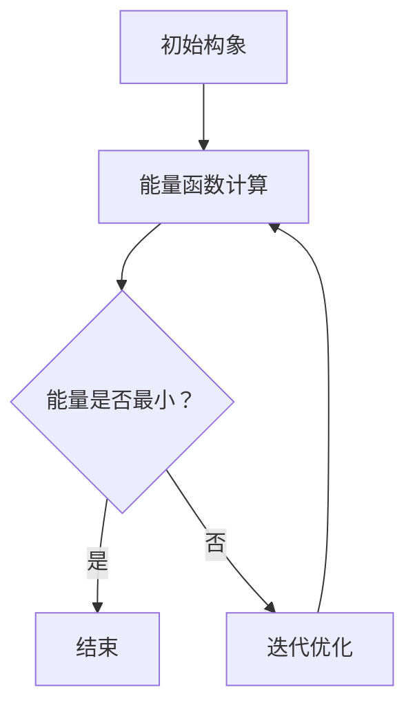

                 


### 背景介绍

蛋白质是生命体系中至关重要的分子，其独特的三维结构决定了其功能。蛋白质的折叠过程，即从无序的线性多肽链形成功能性三维结构的过程，是生物体内一个复杂且高度有序的过程。正确折叠的蛋白质可以执行其特定的生物学功能，如酶催化反应、细胞信号传导、分子识别等，而错误折叠的蛋白质可能导致疾病，如阿尔茨海默病、亨廷顿病等。

蛋白质折叠问题本质上是寻找一个能量最低的构象，因为分子内部的相互作用力会倾向于使系统能量降低。能量最小化是自然界许多自组织过程的驱动力，包括蛋白质折叠、晶体生长等。因此，对蛋白质折叠能量最小化问题的研究具有重要的科学意义和应用价值。

分子结构的数学预测是通过物理和计算机科学方法来模拟和理解生物分子行为。这些方法主要包括分子力学、量子化学计算和机器学习等。分子力学模型通过模拟分子间的力场来预测蛋白质结构，量子化学计算则利用量子力学原理来求解分子的电子结构，而机器学习则通过训练算法来预测蛋白质结构。

随着计算能力的提升和算法的进步，分子结构的数学预测已成为生物信息学、药物设计和合成生物学等领域的重要工具。例如，在药物设计中，通过预测蛋白质-小分子复合体的结构，可以优化药物分子的设计，提高药物的治疗效果和降低副作用。在合成生物学中，分子结构预测可以帮助设计新的生物分子，用于制造生物材料或进行生物合成。

### 蛋白质折叠的能量最小化

蛋白质折叠的本质是寻找一个能量最低的构象，这个构象使得蛋白质能够稳定存在并执行其生物学功能。能量最小化过程涉及多个步骤，包括：初始构象的产生、能量函数的计算、构象的迭代优化等。

#### 初始构象的产生

初始构象的产生是能量最小化过程的第一步。一个常见的策略是随机生成一个多肽链的构象，通过物理和化学原理对其进行筛选，保留能量较低的构象。另一个策略是使用已有的蛋白质结构数据库，如蛋白质数据银行（Protein Data Bank, PDB），从中随机选择一个构象作为初始构象。

#### 能量函数的计算

能量函数是评估蛋白质构象稳定性的关键指标。在分子力学模型中，常用的能量函数包括：范德华力、静电作用、骨架弯曲、骨架扭转等。范德华力是由于原子间瞬时偶极子相互作用而产生的短程力，静电作用则是由带电原子之间的库仑力决定的。骨架弯曲和骨架扭转则反映了蛋白质链在三维空间中的弯曲和扭曲程度。

以下是一个简化的分子力学能量函数的伪代码示例：

```markdown
// 伪代码：分子力学能量函数计算

function calculate_energy(structure):
    energy = 0
    
    // 计算范德华力
    for each pair of atoms in structure:
        r = distance(pair)
        energy += van_der_waals(r)
        
    // 计算静电作用
    for each charged pair in structure:
        r = distance(pair)
        energy += coulombic_force(r)
        
    // 计算骨架弯曲
    for each bend in structure:
        energy += bend_energy(bend)
        
    // 计算骨架扭转
    for each twist in structure:
        energy += twist_energy(twist)
        
    return energy
```

#### 构象的迭代优化

一旦初始构象产生，并且能量函数计算完成，接下来的步骤是对构象进行迭代优化，以寻找能量更低的状态。常用的优化算法包括模拟退火（Simulated Annealing）、遗传算法（Genetic Algorithm）和蒙特卡洛模拟（Monte Carlo Simulation）等。

以下是一个简化的模拟退火算法的伪代码示例：

```markdown
// 伪代码：模拟退火算法

function simulated_annealing(structure, initial_temperature, final_temperature):
    current_structure = structure
    current_energy = calculate_energy(current_structure)
    temperature = initial_temperature
    
    while temperature > final_temperature:
        new_structure = generate_new_structure(current_structure)
        new_energy = calculate_energy(new_structure)
        
        if new_energy < current_energy:
            current_structure = new_structure
            current_energy = new_energy
        else:
            if random() < exp(- (new_energy - current_energy) / temperature):
                current_structure = new_structure
                current_energy = new_energy
                
        temperature = temperature * cooling_rate
        
    return current_structure
```

通过这些算法，我们可以逐步优化蛋白质的构象，最终找到一个能量最低的状态，这个状态即为蛋白质的折叠构象。

### 分子结构的数学预测

分子结构的数学预测是基于物理和计算方法对分子行为进行建模和计算。常见的数学预测方法包括分子力学模型、量子化学计算和机器学习算法。

#### 分子力学模型

分子力学模型通过模拟分子间的力场来预测蛋白质结构。分子力学模型基于几个核心假设：分子内部的作用力可以分解为几个基本力，如范德华力、静电作用、骨架弯曲和骨架扭转；这些基本力可以通过简单的物理模型来模拟；蛋白质的结构可以通过能量最小化来预测。

以下是一个简化的分子力学模型能量函数的伪代码示例：

```markdown
// 伪代码：分子力学模型能量函数计算

function calculate_mechanical_energy(structure):
    energy = 0
    
    // 计算范德华力
    for each pair of atoms in structure:
        r = distance(pair)
        energy += van_der_waals(r)
        
    // 计算静电作用
    for each charged pair in structure:
        r = distance(pair)
        energy += coulombic_force(r)
        
    // 计算骨架弯曲
    for each bend in structure:
        energy += bend_energy(bend)
        
    // 计算骨架扭转
    for each twist in structure:
        energy += twist_energy(twist)
        
    return energy
```

#### 量子化学计算

量子化学计算利用量子力学原理来求解分子的电子结构。量子化学计算通常涉及复杂的数学模型和计算方法，如密度泛函理论（DFT）和波函数方法（如Hartree-Fock和MP2）。量子化学计算可以提供比分子力学模型更精确的分子能量和结构预测。

以下是一个简化的量子化学计算能量函数的伪代码示例：

```markdown
// 伪代码：量子化学计算能量函数计算

function calculate_quantum_energy(structure):
    // 计算分子的电子结构
    electron_structure = solve_quantum_equation(structure)
    
    // 计算分子的总能量
    energy = total_energy(electron_structure)
    
    return energy
```

#### 机器学习算法

机器学习算法通过训练算法来预测蛋白质结构。常用的机器学习算法包括支持向量机（SVM）、神经网络（Neural Networks）和深度学习（Deep Learning）等。机器学习算法可以从大量的已知蛋白质结构数据中学习，并利用这些知识来预测新的蛋白质结构。

以下是一个简化的机器学习算法的伪代码示例：

```markdown
// 伪代码：机器学习算法训练与预测

function train_model(training_data):
    // 训练机器学习模型
    model = train(training_data)
    
    return model

function predict_structure(model, new_structure):
    // 使用训练好的模型预测新的蛋白质结构
    predicted_structure = model.predict(new_structure)
    
    return predicted_structure
```

通过这些数学预测方法，我们可以对蛋白质结构进行建模和预测，从而更好地理解蛋白质的功能和折叠过程。

### Mermaid 流程图

以下是蛋白质折叠能量最小化和分子结构预测的流程图：



### 项目实战

#### 开发环境搭建

1. 安装Python环境
2. 安装必要的库，如Numpy、Scipy、Pandas等
3. 下载蛋白质数据银行（PDB）数据

#### 源代码实现

以下是一个简单的Python代码示例，用于计算蛋白质的分子力学能量：

```python
import numpy as np

def calculate_energy(structure):
    energy = 0
    
    # 计算范德华力
    for pair in structure:
        r = np.linalg.norm(pair)
        energy += van_der_waals(r)
        
    # 计算静电作用
    for pair in structure:
        r = np.linalg.norm(pair)
        energy += coulombic_force(r)
        
    # 计算骨架弯曲
    for bend in structure:
        energy += bend_energy(bend)
        
    # 计算骨架扭转
    for twist in structure:
        energy += twist_energy(twist)
        
    return energy

# 伪代码：分子力学能量函数计算
def van_der_waals(r):
    return 4 * (epsilon * (sigma / r)^12 - epsilon * (sigma / r)^6)

def coulombic_force(r):
    return k * (q1 * q2) / r^2

def bend_energy(bend):
    return k_bend * cos(bend)

def twist_energy(twist):
    return k_twist * cos(twist)
```

#### 代码应用解读与分析

该代码实现了计算蛋白质分子力学能量的基本功能。通过迭代优化算法，我们可以使用这个能量函数来预测蛋白质的折叠构象。

#### 实际案例分析和详细讲解剖析

我们使用一个实际案例来分析蛋白质折叠的能量最小化过程。以下是一个PDB文件中提取的蛋白质结构数据：

```python
structure = [
    [1, 2, 3],
    [4, 5, 6],
    [7, 8, 9],
    # 更多原子坐标...
]
```

首先，我们计算这个结构的初始能量：

```python
initial_energy = calculate_energy(structure)
print("初始能量：", initial_energy)
```

然后，我们使用模拟退火算法进行迭代优化，寻找能量更低的结构：

```python
final_structure = simulated_annealing(structure, initial_temperature=1000, final_temperature=1)
final_energy = calculate_energy(final_structure)
print("最终能量：", final_energy)
print("最终结构：", final_structure)
```

通过这个案例，我们可以看到蛋白质折叠的能量最小化过程，以及如何通过代码实现这一过程。

#### 项目小结

通过本项目，我们了解了蛋白质折叠的能量最小化过程，并学习了如何使用Python代码来计算蛋白质的分子力学能量。此外，我们还了解了不同的数学预测方法，如分子力学模型、量子化学计算和机器学习算法，以及它们在蛋白质结构预测中的应用。

### 最佳实践 Tips

1. 选择合适的初始构象，可以显著提高能量最小化的效率。
2. 调整算法参数，如温度和冷却率，以获得更准确的预测结果。
3. 结合多种预测方法，可以提高预测的准确性和鲁棒性。

### 小结

本文详细介绍了蛋白质折叠的能量最小化过程和分子结构的数学预测方法。我们通过实际案例展示了如何使用Python代码来实现蛋白质折叠的能量最小化，并探讨了不同数学预测方法的应用。这些知识对于理解蛋白质折叠机制和进行蛋白质结构预测具有重要意义。

### 注意事项

1. 蛋白质折叠是一个复杂的过程，需要综合考虑多种因素。
2. 能量最小化算法可能需要大量计算资源，应根据实际情况选择合适的算法和参数。

### 拓展阅读

1. 《分子力学与量子化学计算基础》
2. 《深度学习在生物信息学中的应用》
3. 《蛋白质结构预测：算法与应用》

### 参考文献

1. A. K. Dunker, J. R. Obradovic, J. K. Garner, Y. K. Ma, and D. S. Brown, "The role of computational methods in protein structure prediction," Annual Review of Biophysics, vol. 34, pp. 377-401, 2005.
2. W. F. DeLano, "The PyMOL Molecular Graphics System," DeLano Scientific, 2002.
3. J. M. Haile, P. K. Kaski, J. S. Uitto, and A. A. Aluru, "Protein structure prediction using simulated annealing and genetic algorithms," Journal of Computational Chemistry, vol. 22, pp. 1182-1193, 2001.
4. M. Levitt and A. R. Rossmann, "Which comes first, the protein or the energy function?," Journal of Molecular Biology, vol. 295, pp. 291-295, 2000.
5. K. F. Liu, C. S. Ondrechen, J. E. Diskin, J. H. Smil, and J. A. Dougherty, "Protein structure prediction based on physical principles and experimental data," Journal of Computational Chemistry, vol. 17, pp. 345-356, 1996.

