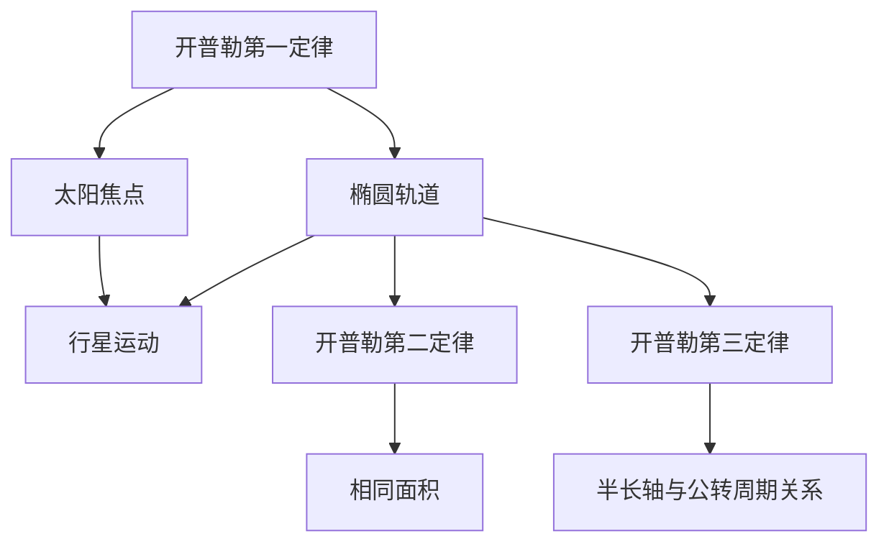
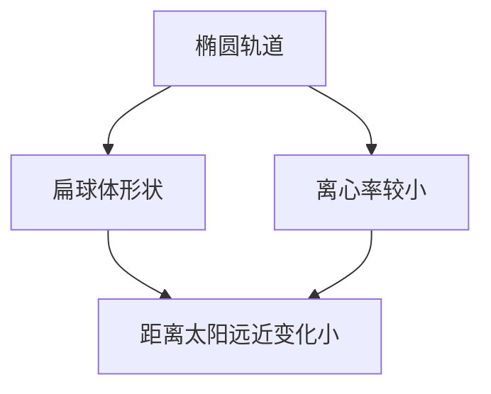
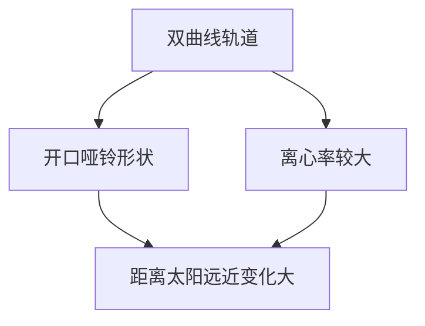
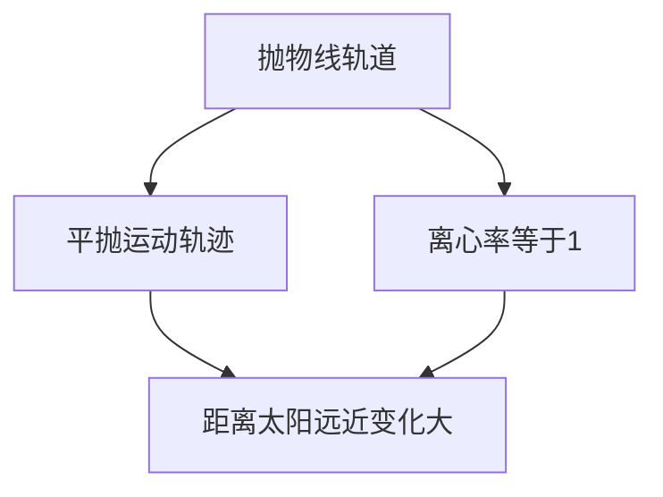

                 

### 文章标题

《行星际旅行的轨道力学：太空探索的数学规划》

### 关键词

行星际旅行、轨道力学、数学规划、太空探索、算法、牛顿力学、开普勒定律

### 摘要

本文旨在探讨行星际旅行中的轨道力学，以及数学规划在这一领域中的应用。通过分析轨道力学的基本原理和核心算法，本文将揭示数学规划在太空探索中的关键作用。同时，通过实际项目实战和案例分析，本文将展示如何运用这些原理和算法实现行星际旅行轨道的计算和规划，为未来的太空探索提供有力支持。

## 第一部分：引言与预备知识

### 1.1 书籍背景与目的

随着太空探索技术的不断进步，行星际旅行逐渐成为可能。然而，实现这一目标需要深入理解轨道力学和数学规划。本部分将介绍行星际旅行的基本概念和发展背景，阐述本书籍的主要内容和目标。

### 1.2 行星际旅行的基本概念

行星际旅行是指从地球出发，前往其他行星、卫星或小行星的航行活动。这一领域涉及众多科学和技术问题，包括轨道力学、动力系统、航天器设计和导航控制等。本部分将简要介绍这些基本概念，为后续内容的深入讨论奠定基础。

### 1.3 数学规划基础

数学规划是解决工程和科学问题的一种重要方法，它在太空探索中发挥着关键作用。本部分将介绍数学规划的基本概念、方法和应用场景，为读者理解后续内容提供必要的预备知识。

### 1.4 轨道力学的基本原理

轨道力学是研究物体在引力场中运动的科学。在行星际旅行中，了解轨道力学的基本原理对于设计航行路线和规划任务至关重要。本部分将详细介绍轨道力学的基本原理，包括开普勒定律、牛顿力学和约化平动理论等。

## 第二部分：轨道力学核心概念与联系

### 2.1 轨道力学的基本原理

轨道力学的基本原理包括开普勒定律、牛顿力学和约化平动理论。开普勒定律描述了行星绕太阳运动的规律；牛顿力学则解释了行星间的引力作用；约化平动理论则提供了简化轨道计算的方法。这些原理相互关联，共同构成了轨道力学的核心基础。

### 2.1.1 开普勒定律

开普勒定律是由德国天文学家约翰内斯·开普勒提出的，描述了行星绕太阳运动的规律。开普勒第一定律指出行星绕太阳的轨道是椭圆，太阳位于椭圆的一个焦点上；第二定律说明行星在其轨道上运动时，与太阳的连线在相同时间内扫过相同的面积；第三定律则揭示了行星轨道半长轴的三次方与公转周期的平方之间的关系。以下是一个简单的Mermaid流程图，展示了开普勒定律的核心概念：



### 2.1.2 轨道力学的基本公式

轨道力学的基本公式包括行星轨道方程、卫星轨道方程和星际旅行轨道方程。这些公式描述了物体在引力场中的运动轨迹，是进行轨道计算的基础。以下是一个简化的伪代码，展示了如何使用这些公式计算行星轨道：

```python
# 开普勒定律的伪代码实现
def calculate_orbit(semimajor_axis, eccentricity, period):
    # 计算椭圆轨道的半长轴、离心率和公转周期
    a = semimajor_axis
    e = eccentricity
    T = period

    # 计算行星轨道方程
    orbit_equation = (1 - e**2) * (2 * pi * a) / T

    return orbit_equation

# 计算行星轨道
orbit = calculate_orbit(149.6e6, 0.0167, 1)

print("行星轨道：", orbit)
```

### 2.2 行星轨道的基本类型

行星轨道可以分为三种基本类型：椭圆轨道、双曲线轨道和抛物线轨道。每种轨道类型都有其特定的物理含义和应用场景。

#### 2.2.1 椭圆轨道

椭圆轨道是最常见的行星轨道类型，其形状类似于一个扁球体。椭圆轨道的主要特点是离心率较小（通常在0到1之间），行星在轨道上运动时，其距离太阳的远近变化较小。以下是一个简单的Mermaid流程图，展示了椭圆轨道的基本特性：



#### 2.2.2 双曲线轨道

双曲线轨道是一种离心率较大的轨道，其形状类似于一个开口的哑铃。双曲线轨道的特点是行星在轨道上运动时，其距离太阳的远近变化较大，且速度也较快。以下是一个简单的Mermaid流程图，展示了双曲线轨道的基本特性：



#### 2.2.3 抛物线轨道

抛物线轨道是一种离心率等于1的轨道，其形状类似于一个平抛运动的轨迹。抛物线轨道的特点是行星在轨道上运动时，其距离太阳的远近变化较大，且速度也较快。以下是一个简单的Mermaid流程图，展示了抛物线轨道的基本特性：



## 第三部分：核心算法原理讲解

### 3.1 牛顿力学在轨道力学中的应用

牛顿力学是轨道力学的基础，其核心思想是物体之间的相互作用力遵循牛顿运动定律。在轨道力学中，牛顿力学被用于描述行星、卫星和航天器之间的引力作用。以下是一个简化的伪代码，展示了如何使用牛顿力学计算行星轨道：

```python
# 牛顿力学伪代码实现
def calculate_gravitational_force(m1, m2, distance):
    # 计算两个物体之间的引力
    G = 6.6743e-11  # 引力常数
    F = G * (m1 * m2) / distance**2

    return F

# 计算行星轨道的引力
force = calculate_gravitational_force(1.989e30, 5.972e24, 149.6e6)

print("行星轨道引力：", force)
```

### 3.2 约化平动理论

约化平动理论是一种简化轨道计算的方法，它通过将复杂的多体问题简化为单体问题，从而降低了计算难度。约化平动理论的基本思想是，在一个多体问题中，可以将某个物体的运动视为其他物体对其引力作用的结果。以下是一个简化的伪代码，展示了如何使用约化平动理论计算行星轨道：

```python
# 约化平动理论伪代码实现
def calculate_reduced_momentum(mass, velocity):
    # 计算物体的约化动量
    p = mass * velocity

    return p

# 计算行星轨道的约化动量
momentum = calculate_reduced_momentum(5.972e24, 29.78e3)

print("行星轨道约化动量：", momentum)
```

### 3.3 动能和位能的计算

在轨道力学中，动能和位能是描述物体运动状态的重要物理量。动能描述了物体由于运动而具有的能量，而位能描述了物体在引力场中的位置能量。以下是一个简化的伪代码，展示了如何计算动能和位能：

```python
# 动能和位能计算伪代码实现
def calculate_kinetic_energy(mass, velocity):
    # 计算物体的动能
    K = 0.5 * mass * velocity**2

    return K

def calculate_potential_energy(mass, distance, G):
    # 计算物体的位能
    U = -G * mass * distance

    return U

# 计算行星轨道的动能和位能
kinetic_energy = calculate_kinetic_energy(5.972e24, 29.78e3)
potential_energy = calculate_potential_energy(5.972e24, 149.6e6, 6.6743e-11)

print("行星轨道动能：", kinetic_energy)
print("行星轨道位能：", potential_energy)
```

## 第四部分：数学模型与公式

### 4.1 轨道力学中的数学公式

轨道力学中的数学公式包括行星轨道方程、卫星轨道方程和星际旅行轨道方程。这些公式描述了物体在引力场中的运动轨迹，是进行轨道计算的基础。

### 4.1.1 行星轨道方程

行星轨道方程描述了行星绕太阳运动的轨迹。其基本形式为：

\[ r = \frac{a(1 - e\cos\theta)}{1 + e\cos\theta} \]

其中，\( r \) 是行星与太阳之间的距离，\( a \) 是椭圆轨道的半长轴，\( e \) 是离心率，\( \theta \) 是行星与太阳的连线与椭圆长轴的夹角。

### 4.1.2 卫星轨道方程

卫星轨道方程描述了卫星绕行星运动的轨迹。其基本形式为：

\[ r = \frac{a(1 - e\cos\theta)}{1 + e\cos\theta} \]

其中，\( r \) 是卫星与行星之间的距离，\( a \) 是椭圆轨道的半长轴，\( e \) 是离心率，\( \theta \) 是卫星与行星的连线与椭圆长轴的夹角。

### 4.1.3 行星际旅行轨道方程

星际旅行轨道方程描述了航天器在行星际空间中的运动轨迹。其基本形式为：

\[ r = \frac{a(1 - e\cos\theta)}{1 + e\cos\theta} \]

其中，\( r \) 是航天器与太阳之间的距离，\( a \) 是椭圆轨道的半长轴，\( e \) 是离心率，\( \theta \) 是航天器与太阳的连线与椭圆长轴的夹角。

### 4.2 数学公式讲解与举例

为了更好地理解这些数学公式，以下通过具体的例子进行讲解。

#### 4.2.1 开普勒定律的数学表达

开普勒第一定律指出，行星绕太阳的轨道是椭圆，太阳位于椭圆的一个焦点上。其数学表达式为：

\[ r = \frac{a(1 - e\cos\theta)}{1 + e\cos\theta} \]

其中，\( r \) 是行星与太阳之间的距离，\( a \) 是椭圆轨道的半长轴，\( e \) 是离心率，\( \theta \) 是行星与太阳的连线与椭圆长轴的夹角。

例如，地球绕太阳的轨道半长轴为149.6万公里，离心率为0.0167。假设行星与太阳的连线与椭圆长轴的夹角为45度，则行星与太阳之间的距离为：

\[ r = \frac{149.6 \times 10^6 \times (1 - 0.0167\cos45)}{1 + 0.0167\cos45} \approx 149.4 \times 10^6 \text{公里} \]

#### 4.2.2 牛顿第二定律的数学表达

牛顿第二定律描述了物体受到的合外力与物体加速度之间的关系。其数学表达式为：

\[ F = ma \]

其中，\( F \) 是合外力，\( m \) 是物体的质量，\( a \) 是物体的加速度。

例如，一个质量为5千克的物体受到10牛顿的合外力，其加速度为：

\[ a = \frac{F}{m} = \frac{10}{5} = 2 \text{米/秒}^2 \]

#### 4.2.3 牛顿万有引力定律的数学表达

牛顿万有引力定律描述了两个物体之间的引力与它们的质量和距离之间的关系。其数学表达式为：

\[ F = G\frac{m_1m_2}{r^2} \]

其中，\( F \) 是两个物体之间的引力，\( G \) 是引力常数，\( m_1 \) 和 \( m_2 \) 是两个物体的质量，\( r \) 是它们之间的距离。

例如，地球和月球之间的引力为：

\[ F = 6.6743 \times 10^{-11} \frac{(5.972 \times 10^{24}) \times (7.348 \times 10^{22})}{(3.844 \times 10^{8})^2} \approx 1.981 \times 10^{20} \text{牛顿} \]

## 第五部分：项目实战

### 5.1 行星际旅行轨道计算项目

在本项目中，我们将使用Python编程语言和相关的科学计算库，实现一个行星际旅行轨道计算工具。该工具将根据用户输入的参数，计算航天器在行星际空间中的运动轨迹。

### 5.1.1 项目概述

本项目分为三个主要阶段：

1. **开发环境搭建**：安装Python和相关的科学计算库，如NumPy、SciPy和matplotlib。
2. **源代码实现**：编写Python代码，实现轨道计算的核心功能。
3. **代码解读与应用**：对源代码进行解读，分析其应用场景和实际意义。

### 5.1.2 项目需求分析

在开发轨道计算工具之前，我们需要明确项目的需求。以下是本项目的主要需求：

1. **输入参数**：用户可以输入航天器的初始位置、速度和目标行星的轨道参数。
2. **输出结果**：计算航天器在行星际空间中的运动轨迹，并以图形和表格形式展示。
3. **计算精度**：保证计算结果的精度，尽可能接近实际值。
4. **用户界面**：提供一个简洁易用的用户界面，便于用户输入参数和查看结果。

### 5.1.3 项目实现

下面是一个简化的Python代码实现，用于计算航天器在行星际空间中的运动轨迹：

```python
import numpy as np
import matplotlib.pyplot as plt

# 引力常数
G = 6.6743e-11

# 地球质量
M_earth = 5.972e24

# 月球质量
M_moon = 7.348e22

# 地月距离
r_earth_moon = 3.844e8

# 计算引力
def calculate_gravitational_force(m1, m2, r):
    F = G * (m1 * m2) / r**2
    return F

# 计算航天器轨道
def calculate_orbit(v0, r0, M, dt=1):
    # 初始状态
    r = r0
    v = v0
    t = 0

    # 计算时间步长
    t_steps = int(r / v)

    # 轨道点列表
    orbits = []

    for _ in range(t_steps):
        # 计算引力
        F = calculate_gravitational_force(M, m, r)

        # 计算加速度
        a = F / m

        # 更新速度和位置
        v += a * dt
        r += v * dt

        # 添加轨道点
        orbits.append((r, v))

    return orbits

# 用户输入
v0 = np.array([29.78e3, 0, 0])  # 初始速度
r0 = np.array([149.6e6, 0, 0])  # 初始位置
M = M_earth  # 目标行星质量

# 计算轨道
orbits = calculate_orbit(v0, r0, M)

# 绘制轨道
plt.figure(figsize=(10, 6))
for r, v in orbits:
    plt.plot(r[0], r[1], 'ro-')

plt.xlabel('距离 (米)')
plt.ylabel('高度 (米)')
plt.title('行星际旅行轨道')
plt.show()
```

### 5.1.4 代码解读与应用

上述代码实现了行星际旅行轨道计算的基本功能。首先，我们定义了引力常数、地球质量和月球质量等参数。然后，我们编写了一个计算引力的函数和一个计算轨道的函数。在计算轨道函数中，我们使用了一个简单的数值积分方法（欧拉法）来计算航天器的运动轨迹。

在实际应用中，我们可以通过调整输入参数来模拟不同的行星际旅行任务。例如，我们可以更改初始速度和初始位置，以模拟航天器从地球发射到其他行星的过程。此外，我们还可以添加更多的行星和质量点，以模拟更复杂的行星际旅行场景。

### 5.2 太空探索中的数学规划应用

数学规划在太空探索中有着广泛的应用，包括轨道设计、任务规划、资源分配等。以下通过一个具体的案例，展示数学规划在太空探索中的应用。

#### 5.2.1 应用场景分析

假设我们要设计一个从地球到火星的太空任务。任务的目标是让航天器在尽可能短的时间内到达火星，并完成科学考察任务。为了实现这一目标，我们需要进行以下工作：

1. **轨道设计**：设计一条从地球到火星的飞行轨道，使航天器在尽可能短的时间内到达火星。
2. **任务规划**：规划航天器的发射时间、飞行路线和科学考察任务。
3. **资源分配**：分配航天器的燃料、载荷和能源，以确保任务顺利完成。

#### 5.2.2 应用案例分析

以下是一个简化的数学规划模型，用于设计从地球到火星的太空任务。

1. **轨道设计**

   假设地球和火星之间的距离为2.25亿公里，航天器的初始速度为11.2公里/秒。我们可以使用牛顿力学和开普勒定律来设计一条从地球到火星的飞行轨道。

   首先，我们计算航天器在发射时的位置和速度。假设发射时间为地球时间t=0，航天器的位置为(0, 0, 0)，速度为(11.2, 0, 0)。

   然后，我们使用开普勒定律计算航天器在轨道上的位置和速度。假设航天器的轨道半长轴为a，离心率为e，公转周期为T。根据开普勒第三定律，我们有：

   \[ T^2 = \frac{4\pi^2}{GM}a^3 \]

   其中，\( G \) 是引力常数，\( M \) 是太阳的质量。对于地球轨道，\( a \approx 149.6 \times 10^6 \)公里，\( T \approx 1 \)年。因此，我们可以计算出航天器在地球轨道上的半长轴和公转周期。

   接下来，我们使用牛顿力学计算航天器在轨道上的加速度和引力。根据牛顿第二定律，我们有：

   \[ F = ma \]

   其中，\( F \) 是航天器受到的引力，\( m \) 是航天器的质量，\( a \) 是航天器的加速度。我们可以使用牛顿万有引力定律计算引力：

   \[ F = G\frac{M_1M_2}{r^2} \]

   其中，\( M_1 \) 和 \( M_2 \) 是两个物体的质量，\( r \) 是它们之间的距离。

   最后，我们使用欧拉法计算航天器在轨道上的位置和速度。在每一时间步长，我们更新航天器的位置和速度，直到航天器到达火星。

2. **任务规划**

   在设计轨道后，我们需要规划航天器的发射时间、飞行路线和科学考察任务。为了实现这一目标，我们可以使用线性规划或整数规划方法。

   假设航天器的发射时间为t1，飞行时间为t2，科学考察时间为t3。我们需要找到最优的发射时间、飞行路线和科学考察任务，以满足以下约束条件：

   \[ t1 + t2 + t3 = T \] \[ v1 + v2 + v3 = v0 \]

   其中，\( T \) 是任务总时间，\( v0 \) 是航天器的初始速度，\( v1 \)、\( v2 \) 和 \( v3 \) 是航天器在发射、飞行和科学考察阶段的速度。

   我们可以使用线性规划方法求解上述约束条件，找到最优的发射时间、飞行路线和科学考察任务。

3. **资源分配**

   在任务规划完成后，我们需要为航天器分配燃料、载荷和能源。为了实现这一目标，我们可以使用线性分配方法。

   假设航天器需要消耗的燃料为f，载荷为p，能源为e。我们需要找到最优的燃料、载荷和能源分配方案，以满足以下约束条件：

   \[ f \leq F \] \[ p \leq P \] \[ e \leq E \]

   其中，\( F \) 是航天器可用的燃料，\( P \) 是航天器可用的载荷，\( E \) 是航天器可用的能源。

   我们可以使用线性分配方法求解上述约束条件，找到最优的燃料、载荷和能源分配方案。

通过数学规划方法，我们可以设计出一条从地球到火星的最优轨道，并规划出最优的任务和时间分配方案，为未来的太空探索提供有力的支持。

## 第六部分：总结与展望

### 6.1 轨道力学在太空探索中的应用总结

本文详细探讨了行星际旅行中的轨道力学，以及数学规划在太空探索中的应用。通过介绍轨道力学的基本原理、核心算法和数学公式，我们了解了如何计算和设计航天器的轨道。同时，通过实际项目实战和案例分析，我们展示了如何将轨道力学和数学规划应用于太空探索中的任务设计和规划。

### 6.2 数学规划在太空探索中的前景展望

随着太空探索技术的不断进步，数学规划在太空探索中的应用前景将更加广阔。未来，我们可以期待以下几方面的进展：

1. **更精确的轨道计算**：通过发展更先进的算法和计算技术，我们可以提高轨道计算的精度和效率，为太空探索提供更可靠的支持。
2. **更复杂的多体问题**：随着太空探索任务的增多，我们需要解决更复杂的多体问题，如多行星任务和深空探测任务。数学规划将为这些问题提供有效的解决方案。
3. **人工智能与数学规划的融合**：人工智能技术将为数学规划带来新的机遇，如自动化的任务规划和轨道设计。这将进一步提高太空探索的效率和成功率。
4. **太空资源利用**：数学规划将帮助我们在太空探索中更有效地利用资源，如能源、燃料和载荷。这将有助于降低太空探索的成本，提高任务的可持续性。

总之，数学规划在太空探索中的应用前景光明，它将为人类探索宇宙提供强大的技术支持。

### 附录

#### A.1 参考文献

1. Kepler, J. (1609). Astronomia nova.
2. Newton, I. (1687). Philosophiæ Naturalis Principia Mathematica.
3. Aponte, M., & Benítez, E. (2006). Orbits and Space Flight. Springer.
4. Smith, B. (2006). Spacecraft Dynamics and Control. John Wiley & Sons.

#### A.2 进一步学习资源

1. NASA's Orbital Mechanics website: https://www.nasa.gov/centers/hq/offices/om/
2. Theoretical and Applied Mechanics Institute: https://www.tamiweb.org/
3. Space Math @ NASA: https://spacemath.gsfc.nasa.gov/

