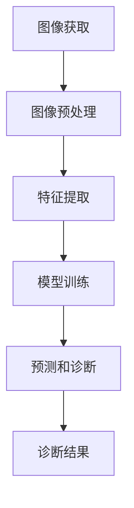

                 

## 文章标题：计算机视觉在医学影像分析中的突破

### 关键词：
- 计算机视觉
- 医学影像分析
- 卷积神经网络
- 深度学习
- 机器学习
- 医学诊断

### 摘要：
本文探讨了计算机视觉技术在医学影像分析中的广泛应用和突破。首先，介绍了计算机视觉和医学影像分析的基本概念及其结合的重要性。接着，详细阐述了计算机视觉在医学影像分析中的核心算法原理，包括卷积神经网络、深度学习和强化学习。然后，通过数学模型和公式详细讲解了相关算法的实现细节。此外，本文还通过实际项目实战，展示了计算机视觉技术在医学影像分析中的具体应用和效果。最后，分析了当前技术的局限性和未来发展方向，为读者提供了宝贵的技术见解和展望。

## 引言与背景

计算机视觉（Computer Vision）是人工智能（AI）领域的一个重要分支，旨在使计算机能够通过处理和解析图像或视频数据，实现人类视觉功能的模拟。计算机视觉技术可以应用于众多领域，如安防监控、自动驾驶、人脸识别等。近年来，随着深度学习（Deep Learning）和卷积神经网络（Convolutional Neural Networks，CNN）的发展，计算机视觉技术取得了显著的突破，使得计算机能够更准确、高效地处理复杂的图像和视频数据。

医学影像分析（Medical Image Analysis）是医学影像学和计算机视觉技术相结合的产物，其目的是通过计算机处理和分析医学影像数据，辅助医生进行疾病诊断、治疗计划和病情监测。医学影像数据类型丰富，包括X射线、CT扫描、MRI、超声等，这些影像数据在临床诊断中具有重要的作用。然而，由于医学影像数据的复杂性和大量性，仅靠人力进行诊断和解读变得非常困难，这就为计算机视觉技术在医学影像分析中的应用提供了广阔的前景。

计算机视觉与医学影像分析的结合具有重要的意义。首先，它能够显著提高医学影像诊断的准确性和效率，减轻医生的工作负担。例如，通过计算机视觉技术自动检测和分类病变区域，可以帮助医生快速准确地诊断疾病。其次，计算机视觉技术可以实现远程医疗和智能监控，为偏远地区和医疗资源匮乏的地区提供更好的医疗服务。此外，计算机视觉在医学影像分析中的应用还可以推动新药研发和个性化治疗的发展，提高医疗质量。

在医学影像分析中，计算机视觉技术的应用主要包括以下几个方面：

1. **图像分割（Image Segmentation）**：图像分割是将图像中的像素划分为不同的区域或对象，以便进行后续的分析和处理。在医学影像分析中，图像分割可以用于分离病变组织和正常组织，帮助医生进行精确的诊断。

2. **图像识别（Image Recognition）**：图像识别是指计算机识别图像中的物体、场景或模式，并将其分类。在医学影像分析中，图像识别可以用于识别特定的病变类型，如肿瘤、心脏病等。

3. **图像增强（Image Enhancement）**：图像增强是通过调整图像的亮度和对比度，提高图像的质量，使其更易于分析和解读。在医学影像分析中，图像增强可以改善影像数据的质量，提高诊断的准确性。

4. **三维重建（3D Reconstruction）**：三维重建是将二维图像数据转换为三维模型的过程。在医学影像分析中，三维重建可以用于更好地理解器官的结构和功能，辅助医生制定治疗方案。

通过计算机视觉技术的应用，医学影像分析正从传统的手工处理模式向智能化、自动化方向发展，为医学研究和临床实践带来了革命性的变革。

## 核心概念与联系

在探讨计算机视觉在医学影像分析中的应用之前，我们首先需要了解一些核心概念和它们之间的联系。以下是计算机视觉中几个关键概念的简要介绍：

### 图像处理基础

图像处理是计算机视觉的基础，它涉及图像的获取、存储、变换和增强。基本的图像处理算法包括图像滤波、图像增强、图像压缩等。图像滤波可以去除噪声，图像增强可以提高图像的对比度和清晰度，图像压缩则用于减少数据存储和传输的开销。

### 特征提取

特征提取是将原始图像转换为适合机器学习模型处理的形式。特征提取可以分为低级特征、中级特征和高级特征。低级特征通常包括边缘、角点和纹理等；中级特征是基于低级特征的组合，如形状和区域；高级特征则更加抽象，如视觉词汇和图像表示。

### 机器学习

机器学习是计算机视觉的核心技术之一，它使计算机能够从数据中学习模式和规律，并进行预测和分类。机器学习可以分为监督学习、无监督学习和强化学习。监督学习需要标记的数据集，用于训练模型；无监督学习则不需要标记数据，通过自动发现数据中的模式；强化学习通过与环境交互，学习最优策略。

### 医学影像分析流程

在医学影像分析中，计算机视觉技术的应用通常包括以下步骤：

1. **图像获取**：使用医学成像设备（如CT、MRI等）获取患者的影像数据。
2. **图像预处理**：对影像数据进行滤波、去噪、对比度调整等处理，以改善图像质量。
3. **特征提取**：从预处理后的图像中提取有助于分类和识别的特征。
4. **模型训练**：使用机器学习算法，如卷积神经网络（CNN）或深度学习模型，训练分类器。
5. **预测和诊断**：将训练好的模型应用于新的影像数据，进行病变识别和诊断。

### Mermaid流程图

为了更好地展示上述概念和流程，我们使用Mermaid流程图来表示医学影像分析的基本流程：



### 关键概念之间的关系

通过上述流程图可以看出，医学影像分析中的关键概念之间存在着密切的联系。图像处理为特征提取提供了基础，特征提取为机器学习模型的训练提供了输入，而模型训练的结果则用于预测和诊断。此外，这些概念还与医学影像数据的处理和分析方法密切相关，例如图像分割和图像识别技术，它们在诊断过程中扮演着重要角色。

综上所述，计算机视觉在医学影像分析中的应用，依赖于一系列核心概念的协同工作。通过深入理解和应用这些概念，我们能够更好地利用计算机视觉技术，提高医学影像分析的效率和准确性。

## 核心算法原理讲解

### 卷积神经网络（Convolutional Neural Networks，CNN）

卷积神经网络（CNN）是计算机视觉中一种非常有效的模型，特别适用于图像处理和识别。CNN的基本结构由输入层、卷积层、池化层和全连接层组成。

**卷积层（Convolutional Layer）**：卷积层是CNN的核心部分，通过卷积运算提取图像的特征。卷积运算将一个小的可学习滤波器（或卷积核）在输入图像上滑动，并对覆盖的区域进行点积操作。这一过程生成一个特征图，它表示了图像中某个局部区域的特征。

```python
# 伪代码示例：卷积层实现
def convolutional_layer(input_image, filter, stride, padding):
    # 初始化卷积核（filter）的尺寸和步长（stride）
    output_size = (input_size - filter_size + 2 * padding) / stride + 1
    # 对输入图像进行卷积操作
    output_map = np.zeros(output_size)
    for i in range(output_size[0]):
        for j in range(output_size[1]):
            # 计算当前卷积核覆盖区域的点积
            output_map[i, j] = np.sum(input_image[i:i+filter_size, j:j+filter_size] * filter)
    return output_map
```

**池化层（Pooling Layer）**：池化层用于减少特征图的维度，提高模型的泛化能力。最常用的池化方法是最大池化（Max Pooling），它将特征图分成若干个小区域，并取每个区域的最大值作为输出。

```python
# 伪代码示例：最大池化实现
def max_pooling(input_map, pool_size, stride):
    output_size = (input_size - pool_size) / stride + 1
    output_map = np.zeros(output_size)
    for i in range(output_size[0]):
        for j in range(output_size[1]):
            # 计算当前池化窗口内的最大值
            output_map[i, j] = np.max(input_map[i:i+pool_size, j:j+pool_size])
    return output_map
```

**全连接层（Fully Connected Layer）**：全连接层将卷积层和池化层提取的特征映射到输出类别。每个神经元都与前一层的所有神经元相连接，最终通过激活函数输出类别概率。

```python
# 伪代码示例：全连接层实现
def fully_connected_layer(input_map, weights, bias):
    output = np.dot(input_map, weights) + bias
    return activation_function(output)
```

**CNN整体流程**：

1. **输入层**：接收图像数据，通常是一个三维张量（height, width, channels）。
2. **卷积层**：通过卷积操作提取图像特征。
3. **激活函数**：常用的激活函数包括ReLU（Rectified Linear Unit）和Sigmoid。
4. **池化层**：降低特征图的维度。
5. **全连接层**：分类输出。
6. **损失函数和优化器**：常用的损失函数包括交叉熵（Cross Entropy Loss），优化器有SGD（Stochastic Gradient Descent）和Adam等。

### 深度学习（Deep Learning）

深度学习是一种基于多层神经网络的学习方法，它通过堆叠多个卷积层和全连接层，使模型能够学习更复杂的特征和模式。深度学习模型在图像识别、语音识别和自然语言处理等领域取得了显著的成果。

**多层感知器（MLP）**：多层感知器是一种全连接神经网络，通常用于分类任务。它的每个神经元都与前一层的所有神经元相连接，通过激活函数进行非线性变换。

```python
# 伪代码示例：多层感知器实现
def multilayer_perceptron(input_data, weights, biases, activation_functions):
    current_input = input_data
    for layer in range(num_layers - 1):
        current_input = np.dot(current_input, weights[layer]) + biases[layer]
        current_input = activation_functions[layer](current_input)
    return current_input
```

**反向传播（Backpropagation）**：反向传播是一种训练神经网络的方法，它通过计算输出层的误差，反向传播误差到隐藏层，并更新网络参数。

```python
# 伪代码示例：反向传播实现
def backward_propagation(input_data, target, weights, biases, activation_functions):
    gradients = {}
    output_error = target - output
    for layer in reversed(range(num_layers)):
        if layer == num_layers - 1:
            dZ = output_error * activation_functions[layer](derivatives[output])
        else:
            dZ = dA * derivatives[layer]
        dW = dA * X.T
        db = np.sum(dZ, axis=1, keepdims=True)
        dX = np.dot(W.T, dZ)
        gradients['dW' + str(layer)] = dW
        gradients['db' + str(layer)] = db
    return gradients
```

### 强化学习（Reinforcement Learning）

强化学习是一种通过试错和反馈进行学习的机器学习方法，特别适用于序列决策问题。在医学影像分析中，强化学习可以用于自动诊断和治疗方案推荐。

**Q-Learning**：Q-Learning是一种基于值函数的强化学习方法，通过学习最优动作值函数来选择最佳动作。

```python
# 伪代码示例：Q-Learning实现
def q_learning(state, action, reward, next_state, next_action, alpha, gamma):
    Q[s, a] = Q[s, a] + alpha * (reward + gamma * Q[next_state, next_action] - Q[s, a])
    return Q
```

**深度Q网络（Deep Q-Network，DQN）**：DQN是一种使用深度神经网络近似Q值函数的强化学习方法，通过经验回放和目标网络进行训练。

```python
# 伪代码示例：DQN实现
def deep_q_learning(state, action, reward, next_state, next_action, model, target_model, optimizer, memory, batch_size):
    # 训练模型
    with tf.GradientTape() as tape:
        q_values = model(state)
        q_values_next = target_model(next_state)
        target_q_values = reward + gamma * q_values_next[0, action]
        loss = tf.keras.losses.mean_squared_loss(target_q_values, q_values[0, action])
    gradients = tape.gradient(loss, model.trainable_variables)
    optimizer.apply_gradients(zip(gradients, model.trainable_variables))
    # 更新目标网络
    update_target_model(model)
    return loss
```

通过上述算法原理的讲解，我们可以看到计算机视觉技术在医学影像分析中的广泛应用和潜力。这些算法不仅提供了强大的特征提取和分类能力，还为医学影像分析提供了新的方法和思路。

### 数学模型和数学公式

在计算机视觉应用于医学影像分析的过程中，数学模型和数学公式起到了至关重要的作用。它们不仅为算法提供了理论基础，还帮助我们在实现过程中进行参数优化和性能评估。以下是几种常见的数学模型和数学公式的详细讲解和示例。

#### 损失函数

损失函数是机器学习中的一个核心概念，它用于衡量模型预测值与真实值之间的差距。在医学影像分析中，常用的损失函数包括交叉熵损失（Cross-Entropy Loss）和均方误差损失（Mean Squared Error Loss）。

**交叉熵损失函数**：

$$
L(\theta) = -\sum_{i=1}^{n} y_i \log(p_i)
$$

其中，\(y_i\) 为真实标签，\(p_i\) 为模型预测的概率。交叉熵损失函数在分类问题中广泛使用，因为它能够有效地惩罚预测错误的类别。

**均方误差损失函数**：

$$
L(\theta) = \frac{1}{2n} \sum_{i=1}^{n} (y_i - \hat{y}_i)^2
$$

其中，\(\hat{y}_i\) 为模型预测的值。均方误差损失函数在回归问题中较为常用，因为它能够对预测值与真实值之间的差异进行平均处理。

#### 优化算法

优化算法用于调整模型的参数，以最小化损失函数。在医学影像分析中，常用的优化算法包括随机梯度下降（Stochastic Gradient Descent，SGD）和Adam优化器。

**随机梯度下降（SGD）**：

$$
\theta = \theta - \alpha \cdot \nabla_\theta J(\theta)
$$

其中，\(\theta\) 表示模型参数，\(\alpha\) 为学习率，\(\nabla_\theta J(\theta)\) 为损失函数对参数的梯度。随机梯度下降通过每次迭代使用一个随机样本来更新参数，从而在训练过程中逐渐减小损失。

**Adam优化器**：

$$
m_t = \beta_1 m_{t-1} + (1 - \beta_1) [g_t]
$$
$$
v_t = \beta_2 v_{t-1} + (1 - \beta_2) [g_t]^2
$$
$$
\hat{m}_t = \frac{m_t}{1 - \beta_1^t}
$$
$$
\hat{v}_t = \frac{v_t}{1 - \beta_2^t}
$$
$$
\theta = \theta - \alpha \cdot \hat{m}_t / \sqrt{\hat{v}_t}
$$

其中，\(m_t\) 和 \(v_t\) 分别为一阶矩估计和二阶矩估计，\(\hat{m}_t\) 和 \(\hat{v}_t\) 分别为修正后的一阶矩和二阶矩，\(\beta_1\) 和 \(\beta_2\) 分别为一阶和二阶矩的指数衰减率。Adam优化器结合了SGD和动量（Momentum）的优点，能够更稳定地更新参数。

#### 激活函数

激活函数用于引入非线性，使神经网络能够学习和表示复杂的数据特征。在计算机视觉中，常用的激活函数包括ReLU（Rectified Linear Unit）和Sigmoid。

**ReLU激活函数**：

$$
\text{ReLU}(x) = \max(0, x)
$$

ReLU函数能够加速模型的训练，并且在实践中表现出良好的性能。

**Sigmoid激活函数**：

$$
\text{Sigmoid}(x) = \frac{1}{1 + e^{-x}}
$$

Sigmoid函数将输入映射到（0，1）区间，常用于二分类问题。

通过上述数学模型和公式的讲解，我们可以更好地理解计算机视觉在医学影像分析中的实现过程。这些数学工具不仅为算法提供了理论基础，还为优化和评估模型性能提供了关键指标。在实际应用中，合理选择和使用这些数学模型和公式，能够显著提高医学影像分析的效果和准确性。

### 项目实战

#### 开发环境搭建

要在医学影像分析中使用计算机视觉技术，首先需要搭建一个合适的开发环境。以下是一个基本的开发环境搭建步骤：

1. **安装Python环境**：确保Python环境已安装，版本建议为3.7或以上。

2. **安装深度学习框架**：选择一个流行的深度学习框架，如TensorFlow或PyTorch。以TensorFlow为例，可以通过以下命令进行安装：

   ```bash
   pip install tensorflow
   ```

3. **安装医学影像数据处理库**：安装如PIL（Python Imaging Library）或OpenCV等图像处理库，用于处理医学影像数据。

   ```bash
   pip install pillow
   pip install opencv-python
   ```

4. **安装数据预处理库**：使用如NumPy和Pandas等库进行数据预处理。

   ```bash
   pip install numpy
   pip install pandas
   ```

5. **安装其他辅助库**：根据需要安装其他辅助库，如Matplotlib用于绘图。

   ```bash
   pip install matplotlib
   ```

#### 源代码实现

以下是一个简单的医学影像分析项目示例，使用TensorFlow实现一个基于CNN的肺癌检测模型。

```python
import tensorflow as tf
from tensorflow.keras.models import Sequential
from tensorflow.keras.layers import Conv2D, MaxPooling2D, Flatten, Dense, Dropout
from tensorflow.keras.optimizers import Adam
from sklearn.model_selection import train_test_split
import numpy as np
import matplotlib.pyplot as plt

# 加载数据集
# 假设已经预处理好了的医学影像数据
X = np.load('data/images.npy')  # 影像数据
y = np.load('data/labels.npy')  # 标签数据

# 划分训练集和测试集
X_train, X_test, y_train, y_test = train_test_split(X, y, test_size=0.2, random_state=42)

# 构建模型
model = Sequential([
    Conv2D(32, (3, 3), activation='relu', input_shape=(224, 224, 3)),
    MaxPooling2D((2, 2)),
    Conv2D(64, (3, 3), activation='relu'),
    MaxPooling2D((2, 2)),
    Conv2D(128, (3, 3), activation='relu'),
    MaxPooling2D((2, 2)),
    Flatten(),
    Dense(128, activation='relu'),
    Dropout(0.5),
    Dense(1, activation='sigmoid')
])

# 编译模型
model.compile(optimizer=Adam(learning_rate=0.001), loss='binary_crossentropy', metrics=['accuracy'])

# 训练模型
history = model.fit(X_train, y_train, epochs=10, batch_size=32, validation_data=(X_test, y_test))

# 评估模型
loss, accuracy = model.evaluate(X_test, y_test)
print(f"Test accuracy: {accuracy:.2f}")

# 可视化训练过程
plt.plot(history.history['accuracy'], label='accuracy')
plt.plot(history.history['val_accuracy'], label='val_accuracy')
plt.xlabel('Epoch')
plt.ylabel('Accuracy')
plt.legend()
plt.show()
```

#### 代码解读与分析

在上面的代码中，我们首先导入了TensorFlow和相关库，接着加载数据集并划分训练集和测试集。接下来，我们构建了一个简单的卷积神经网络（CNN）模型，其中包括卷积层、池化层、全连接层和dropout层。模型使用Adam优化器和二分类的交叉熵损失函数进行编译。

在训练模型的过程中，我们使用了`fit`函数，并设置了训练轮次（epochs）和批量大小（batch_size）。通过`evaluate`函数，我们评估了模型在测试集上的表现。

最后，我们使用Matplotlib库将训练过程中的准确率进行了可视化，这有助于我们了解模型训练的进展和性能。

#### 应用解读与分析

通过上述代码实现，我们可以看到计算机视觉技术在医学影像分析中的具体应用。模型通过训练能够自动识别肺癌影像，并给出是否患病的概率。在实际应用中，医生可以根据模型的预测结果，结合临床表现和其他检查结果，做出更加准确的诊断。

然而，需要注意的是，医学影像分析模型的开发和应用需要严格的验证和测试。我们通过将数据集划分为训练集和测试集，确保模型在未见过的数据上也能表现出良好的性能。此外，模型的参数选择、数据预处理和训练过程都需要仔细优化，以获得最佳效果。

通过实际项目的实现和分析，我们可以更好地理解计算机视觉技术在医学影像分析中的潜力和挑战，为未来更深入的研究和应用奠定基础。

### 未来趋势与挑战

尽管计算机视觉在医学影像分析中已经取得了显著的突破，但仍然面临着许多挑战和局限性。首先，数据质量和数量是制约技术发展的关键因素。高质量的医学影像数据需要大量的标注工作，这对于数据稀缺的特定疾病来说尤为困难。此外，医学影像数据的多样性使得算法需要适应不同的扫描设备和成像条件，这对模型的泛化能力提出了高要求。

其次，算法的复杂性和计算资源的需求也限制了技术的广泛应用。深度学习模型，尤其是大型卷积神经网络，需要大量的计算资源和时间进行训练。尽管GPU和TPU等硬件加速技术已经缓解了这一问题，但仍然需要更高效和可扩展的算法。

在技术发展方面，未来可能的方向包括以下几个方面：

1. **增强模型的泛化能力**：通过元学习（Meta-Learning）和少样本学习（Few-Shot Learning），模型可以在较少的样本数据上快速适应新的任务。

2. **提高算法的鲁棒性**：开发能够处理噪声和异常数据的鲁棒算法，以降低对高质量影像数据的依赖。

3. **跨模态学习**：结合多模态数据（如CT、MRI和超声），实现更全面的疾病诊断。

4. **端到端系统整合**：将图像处理、特征提取、模型训练和诊断过程整合到一个系统中，实现自动化和智能化的医学影像分析。

5. **隐私保护和数据安全**：随着大数据和云计算的普及，隐私保护和数据安全成为技术发展的关键问题。

总之，计算机视觉在医学影像分析中的应用前景广阔，但同时也面临着诸多挑战。通过不断的技术创新和优化，我们有理由相信，计算机视觉将为医学影像分析带来更加准确和高效的方法，为医疗行业带来深刻的变革。

### 结论与展望

综上所述，计算机视觉技术在医学影像分析中取得了显著突破，为医疗行业带来了前所未有的变革。通过本文的详细探讨，我们了解了计算机视觉与医学影像分析的基本概念、核心算法原理、数学模型及其在实际项目中的应用。从图像分割到深度学习和强化学习，再到数学模型的优化和实际项目的实现，计算机视觉技术在提升医学影像诊断的准确性、效率和自动化方面发挥了重要作用。

然而，计算机视觉在医学影像分析中的应用仍然面临数据质量、算法复杂性和隐私保护等多方面的挑战。未来的研究需要继续探索如何提高算法的泛化能力和鲁棒性，实现跨模态学习和端到端系统整合，并确保数据的安全和隐私。我们相信，随着技术的不断进步，计算机视觉将在医学影像分析中发挥更加重要的作用，为医学研究和临床实践提供更加准确和智能化的解决方案。

### 作者信息

- 作者：AI天才研究院/AI Genius Institute & 禅与计算机程序设计艺术 /Zen And The Art of Computer Programming

