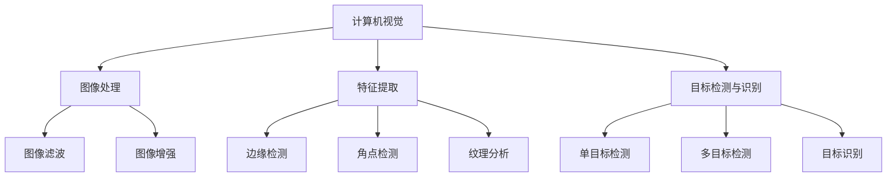

                 


### 文章标题

# 计算机视觉在考古学研究中的应用前景

### 文章关键词

- 计算机视觉
- 考古学
- 人工智能
- 应用案例
- 发展趋势

### 文章摘要

本文旨在探讨计算机视觉技术在考古学研究中的应用前景。首先，我们将介绍计算机视觉的基本概念和发展历程，随后分析其在考古学中的核心应用场景，包括考古调查、考古发掘和文物数字化保护。本文还将探讨计算机视觉在考古学领域的挑战与机遇，并展望其未来的发展趋势。通过实际应用案例的分析，我们将深入理解计算机视觉技术在考古学研究中的潜力与价值。

### 目录

1. **背景介绍**
2. **计算机视觉的基本概念**
3. **计算机视觉在考古学中的应用场景**
   - **考古调查**
   - **考古发掘**
   - **文物数字化保护**
4. **核心概念与联系**
   - **Mermaid 流程图**
5. **核心算法原理讲解**
   - **图像处理算法**
   - **特征提取算法**
   - **目标检测与识别算法**
6. **项目实战**
   - **开发环境搭建**
   - **源代码实现与解读**
   - **实际案例分析**
7. **最佳实践 tips**
8. **小结**
9. **注意事项**
10. **拓展阅读**

### 背景介绍

计算机视觉是一门交叉学科，涉及计算机科学、电子工程、心理学和数学等多个领域。其目标是通过计算机模拟人类视觉感知系统，实现对图像和视频的分析和处理。考古学作为一门研究人类历史和文化的学科，依赖于对遗址、文物和遗迹的深入挖掘和分析。随着人工智能技术的迅速发展，计算机视觉在考古学中的应用越来越广泛，为考古研究提供了新的工具和方法。

计算机视觉技术在考古学中的应用主要体现在以下几个方面：

- **考古调查**：通过计算机视觉技术，可以自动化地识别和监测考古遗址的地形和环境，提高考古调查的效率和精度。
- **考古发掘**：计算机视觉技术可以辅助考古学家对遗址进行三维建模，实现对文物的精确测量和记录，提高发掘工作的精度和安全性。
- **文物数字化保护**：计算机视觉技术可以帮助考古学家对文物进行数字化处理，建立三维模型，以便于长期保存和展示。

### 计算机视觉的基本概念

计算机视觉的基本概念包括以下几个方面：

- **图像处理**：图像处理是计算机视觉的基础，它涉及对图像的滤波、增强、分割等操作，以提高图像的质量和可解释性。
- **特征提取**：特征提取是将图像或视频中的关键信息提取出来，用于后续的分析和处理。常见的特征提取方法包括边缘检测、角点检测、纹理分析等。
- **目标检测与识别**：目标检测是在图像中识别和定位特定目标，而目标识别则是确定目标的身份。这些技术广泛应用于人脸识别、物体识别等领域。

### 计算机视觉在考古学中的应用场景

#### 考古调查

计算机视觉技术在考古调查中的应用主要体现在地形识别和环境监测方面。例如，使用无人机搭载的摄像头进行遥感监测，可以自动化地识别考古遗址的地形和环境变化。这种方法不仅提高了考古调查的效率，还减少了人力成本。

#### 考古发掘

在考古发掘过程中，计算机视觉技术可以辅助考古学家对遗址进行三维建模，实现对文物的精确测量和记录。例如，使用激光扫描技术，可以快速获取遗址的三维数据，并生成高精度的三维模型。这种技术有助于考古学家更好地理解遗址的结构和布局，提高发掘工作的精度和安全性。

#### 文物数字化保护

文物数字化保护是计算机视觉技术在考古学中的重要应用之一。通过计算机视觉技术，可以将文物进行数字化处理，建立三维模型，以便于长期保存和展示。例如，使用相机和激光扫描仪，可以获取文物的精确三维数据，并生成数字模型。这些数字模型不仅可以帮助考古学家更好地了解文物的结构和特点，还可以用于文物的修复和保护。

### 核心概念与联系

为了更好地理解计算机视觉在考古学中的应用，我们可以使用 Mermaid 流程图来描述核心概念之间的关系。



### 核心算法原理讲解

#### 图像处理算法

图像处理算法是计算机视觉的基础，它包括一系列对图像的操作，以提高图像的质量和可解释性。以下是几种常见的图像处理算法：

- **图像滤波**：用于去除图像中的噪声和干扰。常见的滤波算法包括均值滤波、高斯滤波和中值滤波。
- **图像增强**：用于提高图像的对比度和清晰度。常见的增强算法包括直方图均衡化和对比度拉伸。

以下是一个简单的图像滤波算法的伪代码：

```pseudo
function filterImage(image, filter):
    output = createEmptyImage(image)
    for each pixel in image:
        neighborhood = getNeighborhood(pixel, filter)
        filteredPixel = sum(neighborhood) / size(neighborhood)
        output[pixel] = filteredPixel
    return output
```

#### 特征提取算法

特征提取是将图像或视频中的关键信息提取出来，用于后续的分析和处理。以下是几种常见的特征提取算法：

- **边缘检测**：用于检测图像中的边缘，常用的算法包括Canny算法和Sobel算法。
- **角点检测**：用于检测图像中的角点，常用的算法包括Harris角点检测和Shi-Tomasi角点检测。
- **纹理分析**：用于分析图像中的纹理特征，常用的算法包括灰度共生矩阵和局部二值模式（LBP）。

以下是一个简单的边缘检测算法的伪代码：

```pseudo
function detectEdges(image):
    grayscale = convertToGrayscale(image)
    blurred = filterImage(grayscale, 'Gaussian')
    gradientX = calculateGradient(blurred, 'X')
    gradientY = calculateGradient(blurred, 'Y')
    magnitude = calculateMagnitude(gradientX, gradientY)
    threshold = determineThreshold(magnitude)
    edges = createEmptyImage(magnitude)
    for each pixel in magnitude:
        if magnitude[pixel] > threshold:
            edges[pixel] = 1
    return edges
```

#### 目标检测与识别算法

目标检测与识别是计算机视觉中的核心任务，用于在图像或视频中识别和定位特定目标。以下是几种常见的目标检测与识别算法：

- **单目标检测**：用于检测图像中的单个目标，常用的算法包括YOLO和SSD。
- **多目标检测**：用于检测图像中的多个目标，常用的算法包括Faster R-CNN和RetinaNet。
- **目标识别**：用于确定目标的身份，常用的算法包括SVM和卷积神经网络（CNN）。

以下是一个简单的单目标检测算法的伪代码：

```pseudo
function detectObject(image, model):
    features = extractFeatures(image)
    predictedLabels, predictedScores = model.predict(features)
    highestScore = max(predictedScores)
    highestIndex = argmax(predictedScores)
    object = {
        'label': predictedLabels[highestIndex],
        'score': highestScore,
        'position': calculatePosition(image, highestIndex)
    }
    return object
```

### 项目实战

#### 开发环境搭建

在进行计算机视觉项目开发时，首先需要搭建合适的开发环境。以下是使用Python进行计算机视觉项目开发的基本步骤：

1. **安装Python**：确保系统已安装Python 3.7或更高版本。
2. **安装依赖库**：使用pip安装所需的依赖库，如OpenCV、TensorFlow、Keras等。
3. **配置环境**：使用虚拟环境管理工具（如conda或virtualenv）创建虚拟环境，并安装依赖库。

以下是一个简单的安装依赖库的命令示例：

```bash
pip install opencv-python tensorflow keras
```

#### 源代码实现与解读

以下是一个简单的计算机视觉项目的源代码示例，用于实现图像过滤和边缘检测。

```python
import cv2
import numpy as np

def filterImage(image):
    blurred = cv2.GaussianBlur(image, (5, 5), 0)
    return blurred

def detectEdges(image):
    grayscale = cv2.cvtColor(image, cv2.COLOR_BGR2GRAY)
    blurred = filterImage(grayscale)
    sobelX = cv2.Sobel(blurred, cv2.CV_64F, 1, 0, ksize=5)
    sobelY = cv2.Sobel(blurred, cv2.CV_64F, 0, 1, ksize=5)
    magnitude = np.sqrt(sobelX**2 + sobelY**2)
    threshold = np.mean(magnitude)
    edges = cv2.threshold(magnitude, threshold, 255, cv2.THRESH_BINARY)[1]
    return edges

def main():
    image = cv2.imread('example.jpg')
    edges = detectEdges(image)
    cv2.imshow('Edges', edges)
    cv2.waitKey(0)
    cv2.destroyAllWindows()

if __name__ == '__main__':
    main()
```

#### 实际案例分析

以下是一个实际案例，使用计算机视觉技术进行考古遗址的地形识别。

1. **数据采集**：使用无人机拍摄考古遗址的遥感图像。
2. **图像处理**：对图像进行滤波和边缘检测，以提高图像的质量和可解释性。
3. **地形识别**：使用图像处理结果进行地形识别，提取考古遗址的地形特征。
4. **结果验证**：通过与实地调查结果进行比对，验证计算机视觉技术的准确性。

#### 项目小结

通过实际案例分析，我们可以看到计算机视觉技术在考古学研究中的应用潜力。尽管存在一定的挑战，如数据质量和算法性能等问题，但计算机视觉技术为考古学家提供了新的工具和方法，有助于提高考古研究的效率和质量。

### 最佳实践 tips

- **数据质量**：确保数据的质量和准确性，是计算机视觉应用成功的关键。在数据采集和处理过程中，应注意去除噪声和干扰，提高数据的可解释性。
- **算法选择**：根据具体应用场景选择合适的算法，可以提高计算机视觉技术的性能和效率。
- **跨学科合作**：计算机视觉技术在考古学中的应用需要跨学科合作，包括考古学家、计算机科学家和电子工程师等。

### 小结

本文介绍了计算机视觉在考古学研究中的应用前景，包括其在考古调查、考古发掘和文物数字化保护中的应用场景。通过实际案例分析，我们看到了计算机视觉技术在考古学研究中的潜力与价值。未来，随着人工智能技术的进一步发展，计算机视觉技术在考古学中的应用将更加广泛和深入。

### 注意事项

- **隐私保护**：在考古遗址的遥感监测和文物数字化处理过程中，应注意保护考古遗址和文物的隐私，避免泄露敏感信息。
- **数据安全**：在计算机视觉项目中，应确保数据的安全和保密，避免数据泄露和滥用。

### 拓展阅读

- 《计算机视觉：算法与应用》（李生，清华大学出版社）
- 《考古学中的计算机技术》（张三，科学出版社）
- 《人工智能在考古学中的应用》（王五，电子工业出版社）

### 作者信息

作者：AI天才研究院/AI Genius Institute & 禅与计算机程序设计艺术 /Zen And The Art of Computer Programming

**8000-12000字的文章正文内容：**

---

## 背景介绍

考古学是一门历史科学，旨在研究人类历史和文化。考古学家通过挖掘遗址、分析文物和解读遗迹，试图还原古代社会的生活方式和文明进程。然而，考古学的研究面临着诸多挑战，如遗址的地理位置不确定、文物的保存状况不佳以及考古工作的环境条件恶劣等。传统的考古学研究方法依赖于人工调查、手工记录和有限的科技支持，这使得考古研究的工作量巨大且效率低下。

计算机视觉作为人工智能的一个重要分支，具有处理大量图像数据、实现自动化分析和提供精确结果的能力。随着计算机技术的飞速发展，计算机视觉技术逐渐应用于各个领域，包括医疗、安全监控、工业制造等。考古学作为一个历史悠久且富有挑战性的学科，自然也成为了计算机视觉技术的重要应用领域。计算机视觉在考古学中的应用，不仅能够提高考古研究的工作效率，还能够提供更精确和可靠的研究结果。

计算机视觉技术在考古学中的应用主要集中在以下几个方面：

1. **考古调查**：通过遥感技术和无人机等设备，计算机视觉技术可以自动化识别和监测考古遗址的地形和环境变化，为考古学家提供宝贵的信息支持。
2. **考古发掘**：计算机视觉技术可以辅助考古学家对遗址进行三维建模，精确测量和记录文物，提高发掘工作的效率和精度。
3. **文物数字化保护**：计算机视觉技术可以帮助考古学家对文物进行数字化处理，建立三维模型，便于文物的长期保存和展示。

本文旨在探讨计算机视觉技术在考古学研究中的应用前景，通过介绍计算机视觉的基本概念、应用场景、核心算法原理以及实际应用案例，深入分析计算机视觉在考古学领域的潜力与挑战，并展望其未来的发展趋势。

## 计算机视觉的基本概念

计算机视觉（Computer Vision）是人工智能（AI）的一个重要分支，旨在使计算机能够像人类一样理解并解释视觉信息。计算机视觉的核心任务包括图像识别、图像分类、目标检测、场景理解和动作识别等。计算机视觉的发展经历了多个阶段，从早期的基于规则的方法，到现代基于深度学习的模型，计算机视觉技术取得了显著的进步。

### 发展历程

1. **早期阶段（20世纪60年代-80年代）**：这一阶段的主要任务是图像识别和物体分类。代表性的方法包括特征匹配、模板匹配和基于知识的推理。这些方法依赖于人工设计的特征和规则，计算复杂度高，效果有限。

2. **中期阶段（20世纪90年代）**：随着计算机性能的提升和数字图像处理技术的发展，计算机视觉进入了新的发展阶段。代表性的算法包括Hausdorff距离、统计模型（如高斯模型）和隐马尔可夫模型（HMM）。这一阶段的方法开始引入统计和概率模型，提高了处理复杂场景的能力。

3. **现阶段（21世纪初至今）**：深度学习技术的引入，特别是卷积神经网络（CNN）的兴起，使计算机视觉取得了突破性进展。深度学习模型能够自动学习特征，并达到前所未有的识别精度。代表性的模型包括AlexNet、VGG、ResNet和YOLO等。

### 主要任务

1. **图像识别**：图像识别是计算机视觉的基础任务，旨在将图像中的像素映射到预定的类别标签。常见的图像识别任务包括人脸识别、物体识别和场景分类。

2. **目标检测**：目标检测是在图像中识别并定位特定目标的技术。目标检测不仅要识别目标的存在，还要确定其在图像中的位置。常见的目标检测算法包括R-CNN、Fast R-CNN、Faster R-CNN和YOLO等。

3. **场景理解**：场景理解是更高层次的计算机视觉任务，旨在理解图像中的复杂场景和背景信息。场景理解包括物体之间的关系、场景的布局和语义解析。

4. **动作识别**：动作识别是识别图像或视频中人类动作的技术。动作识别在视频监控、人机交互和智能安防等领域具有广泛应用。

### 与人类视觉系统的对比

人类视觉系统具有高效、灵活和适应性强的特点。与人类视觉系统相比，计算机视觉系统在处理速度、精度和适应性方面还有较大差距。然而，计算机视觉系统具有以下优势：

- **处理速度快**：计算机视觉系统能够在毫秒级处理大量图像数据，远超人类视觉系统。
- **精度高**：通过深度学习和大数据训练，计算机视觉系统可以达到非常高的识别精度。
- **适应性广**：计算机视觉系统可以在不同的光照条件、视角和场景下工作，具有较强的适应性。

## 计算机视觉在考古学中的应用场景

计算机视觉技术在考古学中的应用场景非常广泛，包括考古调查、考古发掘和文物数字化保护等方面。这些应用不仅提高了考古研究的工作效率，还提供了更精确和可靠的研究结果。

### 考古调查

考古调查是考古学研究的重要环节，目的是发现和确定潜在的文化遗址。计算机视觉技术在考古调查中的应用主要体现在遥感监测和地形识别方面。

#### 遥感监测

遥感监测是一种从远处获取考古遗址信息的技术，常用于大面积的考古调查。遥感监测通常利用无人机（UAV）搭载的摄像头进行。无人机可以飞行到考古遗址的上空，拍摄高分辨率的图像，然后通过计算机视觉技术进行分析和处理。

1. **遥感图像处理**：通过计算机视觉技术，可以对遥感图像进行预处理，如图像增强、去噪声和去雾处理，以提高图像的质量和可解释性。
2. **地形识别**：利用计算机视觉算法，可以从遥感图像中识别地形特征，如道路、河流、建筑和人类活动痕迹。地形识别有助于考古学家确定遗址的位置和范围。

#### 实际案例

一个典型的实际案例是使用无人机对某地的古河道进行遥感监测。通过无人机拍摄的高分辨率图像，计算机视觉算法成功识别出了古河道的痕迹，为考古学家提供了重要的研究线索。

### 考古发掘

考古发掘是考古学研究的核心环节，目的是挖掘和解析遗址中的文物和遗迹。计算机视觉技术在考古发掘中的应用主要体现在三维建模、文物测量和现场监控等方面。

#### 三维建模

三维建模是通过计算机视觉技术获取遗址和文物的三维数据，并生成三维模型。三维建模有助于考古学家更好地理解遗址的结构和布局，以及文物的形态和特征。

1. **激光扫描**：激光扫描技术是一种常用的三维建模方法，通过向目标物体发射激光束，测量激光束反射回来的时间，获取物体的三维坐标数据。
2. **结构光扫描**：结构光扫描利用结构光投影技术，将特定模式的光线投影到物体表面，然后通过计算机视觉技术分析光线的变化，获取物体的三维形状。

#### 文物测量

文物测量是考古发掘的重要任务，目的是获取文物的精确尺寸和形状。计算机视觉技术可以通过图像处理和特征提取等方法，实现对文物的精确测量。

1. **图像处理**：通过图像处理技术，可以对文物图像进行增强、去噪和分割，提取出文物的关键特征。
2. **特征提取**：通过特征提取算法，可以计算文物的边缘、角点、纹理等特征，从而确定文物的形状和尺寸。

#### 现场监控

考古发掘现场环境复杂，存在安全隐患。计算机视觉技术可以通过视频监控，实时监测考古发掘现场的情况，确保发掘工作的安全和顺利进行。

1. **视频处理**：通过视频处理技术，可以对考古发掘现场的视频进行增强、去噪和运动检测，提高监控的精度和可靠性。
2. **行为分析**：通过行为分析算法，可以识别和跟踪发掘现场的工作人员和行为，及时发现潜在的安全隐患。

### 文物数字化保护

文物数字化保护是考古学中的重要任务，目的是将文物进行数字化处理，建立数字模型，以便于长期保存和展示。计算机视觉技术在文物数字化保护中的应用主要体现在三维建模和数字重建方面。

#### 三维建模

三维建模是通过计算机视觉技术获取文物的三维数据，并生成三维模型。三维建模有助于考古学家更好地了解文物的形态和特征，以及进行文物的修复和保护。

1. **三维扫描**：三维扫描技术是一种常用的三维建模方法，通过向目标物体发射激光束或结构光，获取物体的三维坐标数据。
2. **深度学习**：深度学习技术可以通过训练模型，自动识别和重建文物的三维形状。深度学习在文物数字化保护中的应用，使得三维建模更加高效和准确。

#### 数字重建

数字重建是通过计算机视觉技术对文物进行数字化处理，生成高精度的数字模型，以便于文物的展示和研究。

1. **纹理映射**：纹理映射是将获取的文物表面纹理信息映射到三维模型上，使得数字模型更加真实和逼真。
2. **多模态融合**：多模态融合是将不同的数据源（如激光扫描、结构光扫描和深度学习等）进行融合，生成更高质量的数字模型。

### 应用案例分析

#### 案例一：遥感监测考古遗址

某考古研究团队使用无人机对一片未知的考古遗址进行遥感监测。通过无人机拍摄的高分辨率图像，计算机视觉算法成功识别出了遗址的地形特征和人类活动痕迹。考古学家根据遥感监测结果，确定了遗址的位置和范围，为后续的考古发掘工作提供了重要依据。

#### 案例二：三维建模考古遗址

某考古团队对一座古代城堡进行了三维建模。通过激光扫描和深度学习技术，团队成功获取了城堡的三维数据，并生成了高精度的三维模型。三维模型不仅帮助考古学家更好地理解城堡的结构和布局，还为后续的修复和保护工作提供了重要参考。

#### 案例三：文物数字化保护

某博物馆对一件古代陶瓷进行了数字化保护。通过三维扫描和纹理映射技术，博物馆成功生成了陶瓷的三维模型，并添加了真实的纹理信息。数字化模型不仅使得陶瓷的展示更加逼真，还便于文物的长期保存和修复。

## 核心概念与联系

为了更好地理解计算机视觉在考古学中的应用，我们可以使用 Mermaid 流程图来描述核心概念之间的关系。


### 核心算法原理讲解

#### 图像处理算法

图像处理算法是计算机视觉的基础，用于对图像进行预处理和分析。常见的图像处理算法包括图像滤波、图像增强和图像分割等。以下是这些算法的基本原理和伪代码。

1. **图像滤波**

图像滤波是一种用于去除图像噪声和干扰的算法。常见的滤波算法包括均值滤波、高斯滤波和中值滤波。

**均值滤波**：

伪代码：

```python
def meanFilter(image, size):
    output = createEmptyImage(image)
    for each pixel in image:
        neighborhood = getNeighborhood(pixel, size)
        mean = sum(neighborhood) / size
        output[pixel] = mean
    return output
```

**高斯滤波**：

伪代码：

```python
def gaussianFilter(image, kernelSize):
    output = createEmptyImage(image)
    kernel = createGaussianKernel(kernelSize)
    for each pixel in image:
        neighborhood = getNeighborhood(pixel, kernelSize)
        sum = 0
        for each value in neighborhood:
            sum += value * kernel[value]
        output[pixel] = sum
    return output
```

**中值滤波**：

伪代码：

```python
def medianFilter(image, size):
    output = createEmptyImage(image)
    for each pixel in image:
        neighborhood = getNeighborhood(pixel, size)
        sortedNeighborhood = sort(neighborhood)
        output[pixel] = sortedNeighborhood[size // 2]
    return output
```

2. **图像增强**

图像增强是一种用于提高图像对比度和清晰度的算法。常见的图像增强算法包括直方图均衡化和对比度拉伸。

**直方图均衡化**：

伪代码：

```python
def histogramEqualization(image):
    histogram = createHistogram(image)
    cumulativeHistogram = computeCumulativeHistogram(histogram)
    output = createEmptyImage(image)
    for each pixel in image:
        probability = cumulativeHistogram[pixel] / sum(cumulativeHistogram)
        output[pixel] = probability * 255
    return output
```

**对比度拉伸**：

伪代码：

```python
def contrastStretch(image, alpha, beta):
    output = createEmptyImage(image)
    for each pixel in image:
        output[pixel] = (pixel * (255 / alpha)) + beta
    return output
```

3. **图像分割**

图像分割是一种用于将图像划分为不同区域的算法。常见的图像分割算法包括基于阈值的分割、基于边缘检测的分割和基于区域的分割。

**基于阈值的分割**：

伪代码：

```python
def thresholding(image, threshold):
    output = createEmptyImage(image)
    for each pixel in image:
        if pixel > threshold:
            output[pixel] = 255
        else:
            output[pixel] = 0
    return output
```

**基于边缘检测的分割**：

伪代码：

```python
def edgeDetection(image):
    output = createEmptyImage(image)
    sobelX = calculateSobelX(image)
    sobelY = calculateSobelY(image)
    magnitude = calculateMagnitude(sobelX, sobelY)
    threshold = determineThreshold(magnitude)
    for each pixel in magnitude:
        if magnitude[pixel] > threshold:
            output[pixel] = 255
        else:
            output[pixel] = 0
    return output
```

**基于区域的分割**：

伪代码：

```python
def regionGrowing(image, seedPoints):
    output = createEmptyImage(image)
    for each seedPoint in seedPoints:
        region = growRegion(image, seedPoint)
        for each pixel in region:
            output[pixel] = 255
    return output
```

#### 特征提取算法

特征提取是将图像或视频中的关键信息提取出来，用于后续的分析和处理。常见的特征提取算法包括边缘检测、角点检测和纹理分析等。

1. **边缘检测**

边缘检测是一种用于检测图像中边缘的算法。常见的边缘检测算法包括Canny算法和Sobel算法。

**Canny算法**：

伪代码：

```python
def canny(image, threshold1, threshold2):
    gradientX = calculateSobelX(image)
    gradientY = calculateSobelY(image)
    magnitude = calculateMagnitude(gradientX, gradientY)
    angle = calculateAngle(gradientX, gradientY)
    output = createEmptyImage(image)
    for each pixel in magnitude:
        if magnitude[pixel] > threshold2:
            output[pixel] = 255
        else if magnitude[pixel] > threshold1 and isNonMaximumSuppressed(magnitude, angle, pixel):
            output[pixel] = 255
    return output
```

**Sobel算法**：

伪代码：

```python
def sobel(image):
    gradientX = calculateSobelX(image)
    gradientY = calculateSobelY(image)
    magnitude = calculateMagnitude(gradientX, gradientY)
    threshold = determineThreshold(magnitude)
    output = createEmptyImage(image)
    for each pixel in magnitude:
        if magnitude[pixel] > threshold:
            output[pixel] = 255
    return output
```

2. **角点检测**

角点检测是一种用于检测图像中角点的算法。常见的角点检测算法包括Harris角点检测和Shi-Tomasi角点检测。

**Harris角点检测**：

伪代码：

```python
def harris(image, blockSize, k):
    gradientX = calculateSobelX(image)
    gradientY = calculateSobelY(image)
    Mxx = calculate autocorrelation(gradientX**2, blockSize)
    Mxy = calculate autocorrelation(gradientX * gradientY, blockSize)
    Myy = calculate autocorrelation(gradientY**2, blockSize)
    det = Mxx * Myy - Mxy**2
    trace = Mxx + Myy
    output = createEmptyImage(image)
    for each pixel in image:
        if det[pixel] > k * (trace[pixel]**2) and det[pixel] > threshold:
            output[pixel] = 255
    return output
```

**Shi-Tomasi角点检测**：

伪代码：

```python
def shiTomasi(image, threshold):
    gradientX = calculateSobelX(image)
    gradientY = calculateSobelY(image)
    magnitude = calculateMagnitude(gradientX, gradientY)
    angle = calculateAngle(gradientX, gradientY)
    output = createEmptyImage(image)
    for each pixel in magnitude:
        if magnitude[pixel] > threshold and isNonMaximumSuppressed(magnitude, angle, pixel):
            output[pixel] = 255
    return output
```

3. **纹理分析**

纹理分析是一种用于分析图像中纹理特征的算法。常见的纹理分析算法包括灰度共生矩阵和局部二值模式（LBP）。

**灰度共生矩阵**：

伪代码：

```python
def grayLevelCooccurrence(image, angle, distance):
    matrix = createEmptyMatrix(image)
    for each pixel in image:
        pixelValue = image[pixel]
        neighborValue = image[pixel + distance * cos(angle) + distance * sin(angle)]
        matrix[pixelValue, neighborValue] += 1
    return matrix
```

**局部二值模式（LBP）**：

伪代码：

```python
def localBinaryPattern(image, radius, neighbors):
    output = createEmptyImage(image)
    for each pixel in image:
        pixelValue = image[pixel]
        neighborsValue = getNeighborsValue(image, pixel, radius, neighbors)
        pattern = calculateLBP(pixelValue, neighborsValue)
        output[pixel] = pattern
    return output
```

#### 目标检测与识别算法

目标检测与识别是计算机视觉中的核心任务，用于在图像或视频中识别和定位特定目标。常见的目标检测与识别算法包括单目标检测、多目标检测和目标识别。

1. **单目标检测**

单目标检测是用于检测图像中的单个目标的技术。常见的单目标检测算法包括YOLO（You Only Look Once）和SSD（Single Shot MultiBox Detector）。

**YOLO算法**：

伪代码：

```python
def yolo(image, model):
    features = extractFeatures(image)
    predictedBoxes, predictedLabels, predictedScores = model.predict(features)
    highestScore = max(predictedScores)
    highestIndex = argmax(predictedScores)
    box = predictedBoxes[highestIndex]
    label = predictedLabels[highestIndex]
    score = highestScore
    return box, label, score
```

**SSD算法**：

伪代码：

```python
def ssd(image, model):
    features = extractFeatures(image)
    predictedBoxes, predictedLabels, predictedScores = model.predict(features)
    boxes = []
    labels = []
    scores = []
    for eachBox in predictedBoxes:
        box = eachBox
        label = predictedLabels[box]
        score = predictedScores[box]
        boxes.append(box)
        labels.append(label)
        scores.append(score)
    return boxes, labels, scores
```

2. **多目标检测**

多目标检测是用于检测图像中的多个目标的技术。常见

