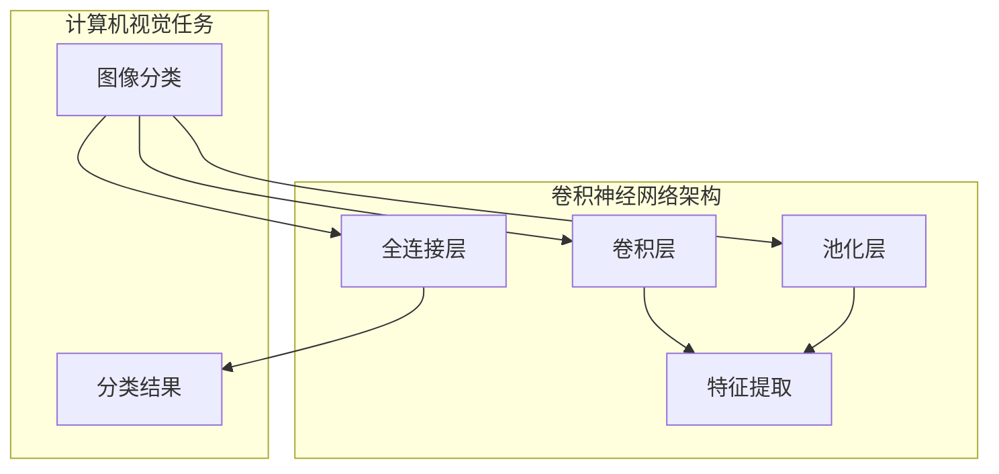
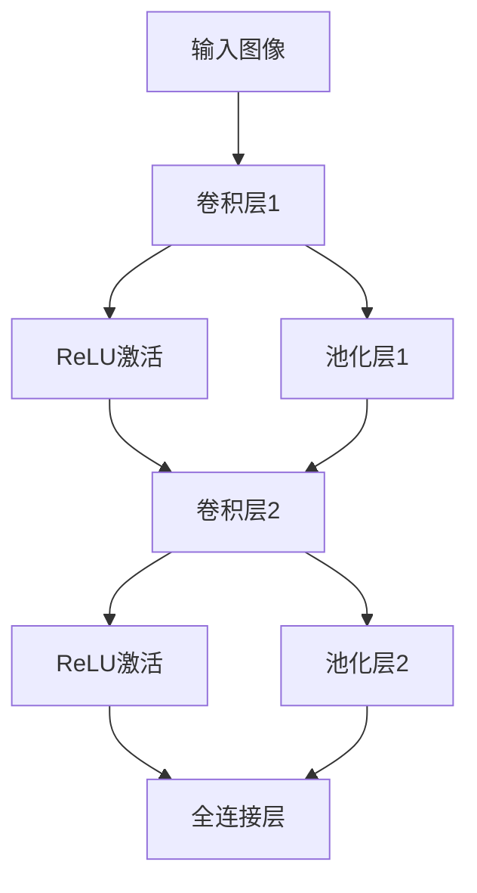
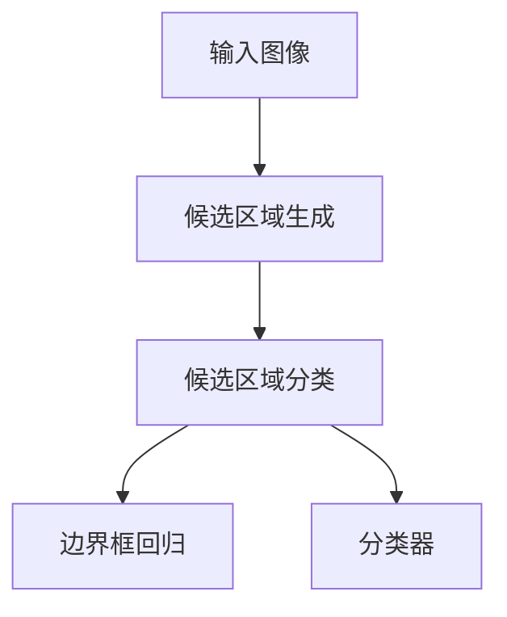
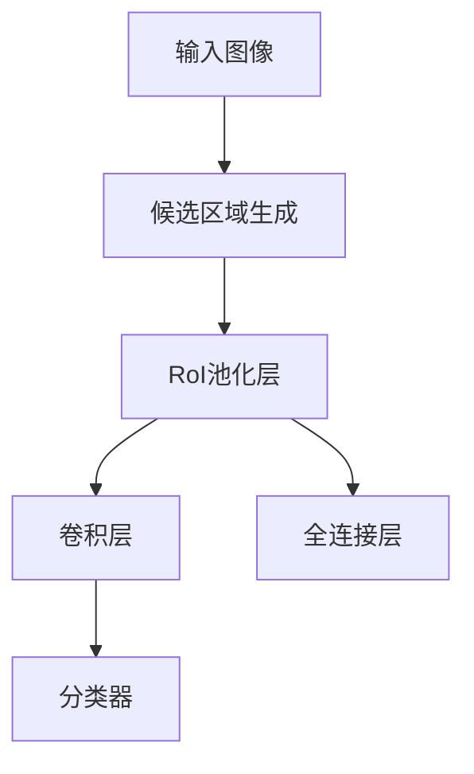
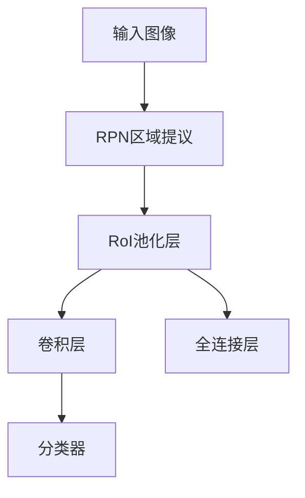
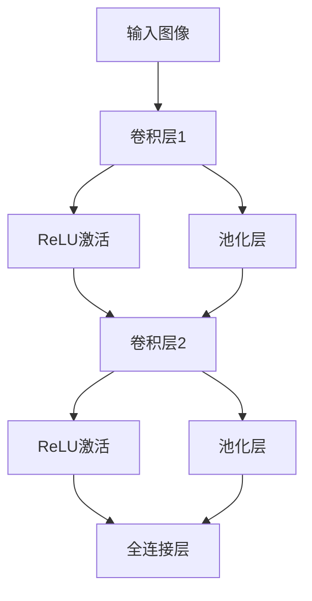
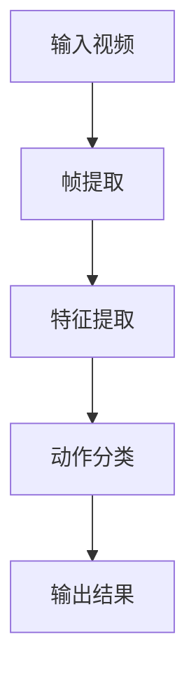
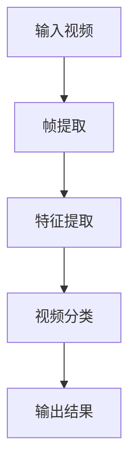

                 

### 引言

#### 计算机视觉的重要性

计算机视觉是人工智能（AI）领域的一个重要分支，它致力于使计算机能够像人类一样理解和解释视觉信息。随着科技的迅猛发展，计算机视觉在多个领域都展现出了巨大的应用潜力，包括医疗影像分析、自动驾驶、智能家居、安防监控、娱乐游戏等。在现代社会，视觉信息的获取和处理已经成为日常生活和工作的重要组成部分，因此，计算机视觉技术的重要性不言而喻。

#### 卷积神经网络的基本概念

卷积神经网络（Convolutional Neural Networks，CNN）是计算机视觉领域最常用的深度学习模型之一。与传统的人工设计特征方法相比，CNN通过学习大量的数据来自动提取特征，从而实现图像分类、目标检测、语义分割等复杂任务。CNN的核心在于其独特的结构，包括卷积层、池化层和全连接层，这些层共同协作，使得模型能够对图像进行有效的处理和学习。

#### 本书结构

本书旨在系统地介绍计算机视觉中的卷积神经网络，帮助读者从基础到应用全面掌握这一技术。本书共分为十章，章节结构如下：

1. **第1章 引言**：介绍计算机视觉的重要性，卷积神经网络的基本概念，以及本书的组织结构。
2. **第2章 卷积神经网络基础**：详细讲解CNN的基本结构、工作原理以及常用架构。
3. **第3章 CNN在图像分类中的应用**：探讨CNN在图像分类任务中的应用，包括数据预处理、模型设计、训练和评估。
4. **第4章 CNN在目标检测中的应用**：介绍CNN在目标检测中的使用，包括R-CNN、Fast R-CNN、Faster R-CNN等模型。
5. **第5章 CNN在语义分割中的应用**：讲解CNN在语义分割中的应用，介绍U-Net、DeepLab等模型。
6. **第6章 CNN在人脸识别中的应用**：讨论CNN在人脸识别中的应用，包括特征提取、匹配和识别。
7. **第7章 CNN在视频分析中的应用**：介绍CNN在视频分析中的使用，包括动作识别、视频分类等。
8. **第8章 CNN的优化与改进**：探讨如何优化和改进CNN模型，包括超参数调整、正则化策略等。
9. **第9章 实战项目**：提供实际的项目案例，包括数据集准备、模型设计、训练与评估等。
10. **第10章 总结与展望**：对本书的内容进行总结，并对未来的发展趋势进行展望。

通过这本书，读者将能够系统地了解计算机视觉中的卷积神经网络，掌握其基本原理和应用方法，为实际项目开发提供理论支持。

### 背景介绍

计算机视觉的起源可以追溯到20世纪50年代末和60年代初。当时，计算机科学家们开始探索如何让计算机模拟人类的视觉感知。最早的计算机视觉系统主要依赖于手工设计的特征和算法，例如边缘检测、角点检测和纹理分析等。这些早期的系统在处理简单图像任务时表现出了一定的效果，但在复杂场景中却显得力不从心。

随着计算机硬件性能的提升和机器学习技术的发展，计算机视觉迎来了新的发展机遇。尤其是深度学习的兴起，使得计算机视觉取得了显著的进展。深度学习，尤其是卷积神经网络（CNN），通过学习大量数据来自动提取图像特征，从而实现了许多复杂的视觉任务。CNN在图像分类、目标检测、语义分割等人脸识别、物体识别等领域都取得了突破性的成果。

#### 卷积神经网络的工作原理

卷积神经网络（CNN）的核心在于其独特的结构，主要包括卷积层、池化层和全连接层。这些层共同协作，使得模型能够对图像进行有效的处理和学习。

1. **卷积层（Convolutional Layer）**：
   卷积层是CNN中最基本的层，它通过卷积运算来提取图像的特征。卷积运算的核心是一个卷积核（也称为滤波器或过滤器），它是一个小的矩阵，通常具有多个通道。卷积层通过将卷积核在输入图像上滑动，并对每个位置进行卷积运算，从而生成特征图（feature map）。卷积运算的数学表达式如下：

   $$
   \text{output}(i, j) = \sum_{x, y} \text{filter}(x, y) \times \text{input}(i + x, j + y)
   $$

   其中，$(i, j)$是输出特征图上的位置，$(x, y)$是卷积核上的位置，$\text{filter}(x, y)$是卷积核的值，$\text{input}(i + x, j + y)$是输入图像上的对应位置。

2. **激活函数（Activation Function）**：
   在卷积运算后，通常会对每个特征图上的值进行非线性变换，常用的激活函数包括ReLU（Rectified Linear Unit）函数：

   $$
   \text{ReLU}(x) = \max(0, x)
   $$

  ReLU函数的作用是引入非线性，使得模型能够学习到更加复杂的特征。

3. **池化层（Pooling Layer）**：
   池化层的主要作用是减小特征图的尺寸，从而降低模型的复杂度和参数数量。常用的池化方式包括最大池化（Max Pooling）和平均池化（Average Pooling）。最大池化的数学表达式如下：

   $$
   \text{output}(i, j) = \max(\text{input}(\text{region}))
   $$

   其中，$\text{region}$是池化区域，通常是一个固定大小的窗口。

4. **全连接层（Fully Connected Layer）**：
   全连接层是CNN的最后一个层，它将特征图上的所有值连接到一个大的线性模型中，用于分类或回归任务。全连接层的输入是一个一维的特征向量，输出是一个一维的标签向量。

   $$
   \text{output}(j) = \text{sigmoid}(\text{weight} \cdot \text{input} + \text{bias})
   $$

   其中，$\text{weight}$是权重矩阵，$\text{input}$是特征向量，$\text{bias}$是偏置项，$\text{sigmoid}$函数是一个将实数映射到[0, 1]区间的非线性函数。

#### CNN与计算机视觉任务的联系

CNN在计算机视觉任务中具有广泛的应用。下面我们将通过一个Mermaid流程图，展示CNN与几种常见计算机视觉任务的联系。



从流程图中可以看出，CNN通过卷积层和池化层对图像进行特征提取，然后通过全连接层进行分类。类似的结构使得CNN能够应用于多种计算机视觉任务，如图像分类、目标检测、语义分割等。

#### 卷积神经网络的核心算法原理

卷积神经网络（CNN）在图像处理中的核心算法主要包括卷积操作、激活函数、池化和反向传播。以下我们将详细讲解这些核心算法，并使用伪代码来阐述其具体实现。

##### 1. 卷积操作

卷积操作是CNN中最基本的组成部分，用于提取图像的局部特征。卷积操作的伪代码如下：

```python
def conv2d(input_image, filter):
    output = zeros((output_height, output_width, num_channels))
    for x in range(output_height):
        for y in range(output_width):
            for channel in range(num_channels):
                region = input_image[x:end, y:end, channel]
                output[x, y, channel] = sum(region * filter)
    return output
```

在上面的伪代码中，`input_image`表示输入图像，`filter`表示卷积核，`output`是卷积操作的结果。伪代码通过遍历输出特征图上的每个位置，计算输入图像上对应区域的卷积值，然后将这些值累加得到最终的输出值。

##### 2. 激活函数

激活函数为神经网络引入了非线性，使得模型能够学习到更加复杂的特征。ReLU（Rectified Linear Unit）函数是一种常用的激活函数，其数学表达式为：

$$
\text{ReLU}(x) = \max(0, x)
$$

ReLU函数在输入为负值时输出为0，在输入为非负值时输出为其本身。在实现ReLU函数时，可以使用以下伪代码：

```python
def ReLU(x):
    return max(0, x)
```

##### 3. 池化操作

池化操作用于减小特征图的尺寸，从而降低模型的复杂度和参数数量。最大池化（Max Pooling）是一种常用的池化方式，其伪代码如下：

```python
def max_pooling(input_feature_map, pool_size):
    output = zeros((output_height, output_width))
    for x in range(0, input_height - pool_size + 1, stride):
        for y in range(0, input_width - pool_size + 1, stride):
            window = input_feature_map[x:x + pool_size, y:y + pool_size]
            output[x // stride, y // stride] = max(window)
    return output
```

在上面的伪代码中，`input_feature_map`表示输入特征图，`pool_size`是池化窗口的大小，`stride`是步长。伪代码通过遍历输入特征图，将每个窗口内的最大值作为输出值。

##### 4. 反向传播

反向传播是神经网络训练过程中至关重要的一环，用于计算模型参数的梯度。反向传播的伪代码如下：

```python
def backward_propagation(output, expected_output, model):
    output_error = output - expected_output
    for layer in reversed(model.layers):
        if isinstance(layer, FullyConnectedLayer):
            layer_error = layer.output_error(output_error)
            layer.update_weights(error)
        elif isinstance(layer, ConvolutionalLayer):
            layer_error = layer.backward_convolution(output_error)
            layer.update_weights(error)
```

在上面的伪代码中，`output`是模型的输出，`expected_output`是期望输出，`model`是神经网络模型。反向传播通过从输出层开始，逐层向前计算每个层的输出误差，并更新模型参数。

#### 数学模型和公式

卷积神经网络（CNN）的数学模型主要涉及卷积操作、激活函数、池化操作和反向传播。以下我们将详细介绍这些数学模型的公式，并提供详细的解释。

##### 1. 卷积操作

卷积操作的数学公式如下：

$$
\text{output}(i, j) = \sum_{x, y} \text{filter}(x, y) \times \text{input}(i + x, j + y)
$$

其中，$(i, j)$是输出特征图上的位置，$(x, y)$是卷积核上的位置，$\text{filter}(x, y)$是卷积核的值，$\text{input}(i + x, j + y)$是输入图像上的对应位置。

卷积操作通过在输入图像上滑动卷积核，计算卷积核与输入图像对应区域的点积，并将这些点积值累加得到输出特征图上的值。卷积操作的目的是提取输入图像的局部特征，从而生成具有不同特征的输出特征图。

##### 2. 激活函数

ReLU（Rectified Linear Unit）函数是最常用的激活函数，其数学表达式为：

$$
\text{ReLU}(x) = \max(0, x)
$$

ReLU函数在输入为负值时输出为0，在输入为非负值时输出为其本身。ReLU函数的作用是引入非线性，使得模型能够学习到更加复杂的特征。ReLU函数的导数为1（当输入为正）或0（当输入为负），这使得反向传播过程中计算梯度变得简单。

##### 3. 池化操作

最大池化（Max Pooling）是最常用的池化方式，其数学表达式如下：

$$
\text{output}(i, j) = \max(\text{input}(\text{region}))
$$

其中，$\text{region}$是池化区域，通常是一个固定大小的窗口。

最大池化通过将输入特征图上每个窗口内的最大值作为输出值，从而减小特征图的尺寸。最大池化操作保持了输入特征图上的局部最大特征，同时减少了计算量和参数数量。

##### 4. 反向传播

反向传播是神经网络训练过程中至关重要的一环，用于计算模型参数的梯度。反向传播的核心是计算每个参数的梯度，从而更新模型参数。

以卷积层为例，卷积层的梯度计算公式如下：

$$
\frac{\partial \text{output}}{\partial \text{filter}} = \text{input} \odot \frac{\partial \text{output}}{\partial \text{output}}
$$

$$
\frac{\partial \text{output}}{\partial \text{input}} = \text{filter}^T \odot \frac{\partial \text{output}}{\partial \text{output}}
$$

其中，$\odot$表示Hadamard积，$\frac{\partial \text{output}}{\partial \text{output}}$是输出误差，$\text{input}$是输入图像，$\text{filter}$是卷积核。

通过上述公式，可以计算出卷积层中每个参数的梯度，从而更新模型参数。反向传播过程通过逐层计算梯度，直到输出层，从而实现模型参数的优化。

#### 举例说明

为了更好地理解卷积神经网络（CNN）的数学模型，下面我们通过一个简单的例子来说明。

假设我们有一个32x32的输入图像，卷积核的大小为3x3，卷积核的参数为$f_{11}$, $f_{12}$, ..., $f_{33}$。输入图像的像素值如下：

$$
\text{input} = \begin{bmatrix}
1 & 2 & 3 \\
4 & 5 & 6 \\
7 & 8 & 9 \\
\end{bmatrix}
$$

卷积核的参数如下：

$$
\text{filter} = \begin{bmatrix}
f_{11} & f_{12} \\
f_{21} & f_{22} \\
f_{31} & f_{32} \\
f_{41} & f_{42} \\
f_{51} & f_{52} \\
f_{61} & f_{62} \\
\end{bmatrix}
$$

首先，我们计算卷积操作的结果。卷积操作的过程如下：

$$
\text{output}_{11} = f_{11} \cdot 1 + f_{12} \cdot 2 + f_{21} \cdot 4 + f_{22} \cdot 5 + f_{31} \cdot 7 + f_{32} \cdot 8 + f_{41} \cdot 9 + f_{42} \cdot 10 + f_{51} \cdot 11 + f_{52} \cdot 12 + f_{61} \cdot 13 + f_{62} \cdot 14 \\
\text{output}_{12} = f_{11} \cdot 2 + f_{12} \cdot 3 + f_{21} \cdot 5 + f_{22} \cdot 6 + f_{31} \cdot 8 + f_{32} \cdot 9 + f_{41} \cdot 11 + f_{42} \cdot 12 + f_{51} \cdot 13 + f_{52} \cdot 14 + f_{61} \cdot 15 + f_{62} \cdot 16 \\
\text{output}_{21} = f_{11} \cdot 3 + f_{12} \cdot 4 + f_{21} \cdot 7 + f_{22} \cdot 8 + f_{31} \cdot 9 + f_{32} \cdot 10 + f_{41} \cdot 11 + f_{42} \cdot 12 + f_{51} \cdot 13 + f_{52} \cdot 14 + f_{61} \cdot 15 + f_{62} \cdot 16 \\
\text{output}_{22} = f_{11} \cdot 4 + f_{12} \cdot 5 + f_{21} \cdot 6 + f_{22} \cdot 7 + f_{31} \cdot 8 + f_{32} \cdot 9 + f_{41} \cdot 10 + f_{42} \cdot 11 + f_{51} \cdot 12 + f_{52} \cdot 13 + f_{61} \cdot 14 + f_{62} \cdot 15 \\
$$

计算得到的输出特征图如下：

$$
\text{output} = \begin{bmatrix}
\text{output}_{11} & \text{output}_{12} \\
\text{output}_{21} & \text{output}_{22} \\
\end{bmatrix}
$$

接下来，我们考虑激活函数ReLU的影响。假设卷积核的参数满足$f_{11} < 0$，其余参数大于0，那么在卷积操作后，输出特征图的部分值将会被置为0，结果如下：

$$
\text{output}_{11} = \max(0, \text{output}_{11}) = 0 \\
\text{output}_{12} = \max(0, \text{output}_{12}) = 0 \\
\text{output}_{21} = \max(0, \text{output}_{21}) = 0 \\
\text{output}_{22} = \max(0, \text{output}_{22}) = 40 \\
$$

因此，最终的输出特征图为：

$$
\text{output} = \begin{bmatrix}
0 & 0 \\
0 & 40 \\
\end{bmatrix}
$$

通过这个简单的例子，我们可以看到卷积操作、激活函数ReLU对输入图像的影响，以及如何计算输出特征图。

#### 卷积神经网络的优势与挑战

卷积神经网络（CNN）在计算机视觉领域取得了巨大的成功，其优势主要体现在以下几个方面：

1. **局部连接与参数共享**：CNN通过局部连接和参数共享的方式，有效地减少了模型参数的数量，从而降低了计算复杂度和过拟合的风险。这种结构使得CNN在处理高维数据时表现出色。

2. **平移不变性**：CNN通过卷积操作和池化操作，引入了平移不变性，使得模型对图像的平移具有一定的鲁棒性。这一特性使得CNN在图像分类和目标检测等任务中具有较好的表现。

3. **层次化特征表示**：CNN通过多层次的卷积操作，能够自动提取从低级到高级的层次化特征。这些特征有助于模型在复杂任务中更好地理解图像内容。

4. **强大的学习能力**：CNN通过深度学习的方式，可以自动学习大量数据中的复杂模式，从而提高模型的泛化能力。

然而，CNN在应用过程中也面临一些挑战：

1. **计算资源消耗**：CNN的参数数量庞大，特别是在深度较大的网络中，这导致了计算资源的消耗巨大。训练深度网络需要大量的时间和计算资源。

2. **过拟合问题**：深度网络在训练过程中容易发生过拟合，尤其是在训练数据不足的情况下。为了解决过拟合问题，需要采用正则化技术、数据增强等方法。

3. **可解释性问题**：CNN的黑箱特性使得其难以解释。尽管可以分析网络中的某些层和节点，但整体上，CNN的工作机制仍然不够透明，这限制了其在某些领域的应用。

4. **数据依赖性**：CNN的性能高度依赖于训练数据的质量和数量。在数据不足或数据分布不均匀的情况下，CNN的表现可能会受到影响。

总之，卷积神经网络（CNN）在计算机视觉领域具有显著的优势，但也面临着一些挑战。通过不断的技术创新和优化，我们可以期待CNN在未来取得更大的突破。

#### 卷积神经网络在图像分类中的应用

卷积神经网络（CNN）在图像分类任务中表现出色，其强大的特征提取能力和平移不变性使其成为图像分类的首选模型。以下我们将详细探讨CNN在图像分类中的应用，包括数据预处理、模型设计、训练和评估等步骤。

##### 数据预处理

在开始训练CNN模型之前，我们需要对图像数据集进行预处理。数据预处理主要包括以下步骤：

1. **图像尺寸调整**：为了统一数据输入，通常需要将所有图像调整为相同的尺寸。例如，常见的目标尺寸为224x224或299x299像素。

2. **归一化**：通过将图像的像素值缩放到[0, 1]区间，可以提高模型的训练效果。归一化公式如下：

   $$
   x_{\text{normalized}} = \frac{x_{\text{original}} - \text{mean}}{\text{std}}
   $$

   其中，$x_{\text{original}}$是原始像素值，$\text{mean}$是图像的平均像素值，$\text{std}$是图像的标准差。

3. **数据增强**：数据增强是一种常用的技术，用于增加训练数据的多样性，从而提高模型的泛化能力。常见的数据增强方法包括随机裁剪、旋转、翻转、缩放等。

##### 模型设计

CNN在图像分类中的应用通常包括卷积层、池化层和全连接层。以下是一个典型的CNN模型设计：

1. **卷积层**：卷积层用于提取图像的局部特征。常用的卷积核大小为3x3或5x5，卷积步长通常为1或2。卷积层的输出是一个具有多个通道的特征图。

2. **激活函数**：在卷积层之后，通常使用ReLU函数作为激活函数，引入非线性。

3. **池化层**：池化层用于减小特征图的尺寸，降低模型的复杂度。常用的池化方式包括最大池化和平均池化。

4. **全连接层**：全连接层将特征图上的所有值连接到一个大的线性模型中，用于分类。全连接层的输出是一个一维的标签向量。

以下是一个简单的CNN模型结构：



##### 训练过程

CNN的训练过程主要包括以下步骤：

1. **前向传播**：在训练过程中，输入图像通过CNN模型的前向传播过程，生成预测的类别概率。

2. **损失函数**：常用的损失函数包括交叉熵损失（Cross-Entropy Loss）和均方误差损失（Mean Squared Error Loss）。交叉熵损失适用于分类任务，其公式如下：

   $$
   \text{loss} = -\sum_{i} y_i \log(\hat{y}_i)
   $$

   其中，$y_i$是实际标签，$\hat{y}_i$是预测的概率。

3. **反向传播**：通过反向传播算法，计算模型参数的梯度，并更新模型参数。

4. **优化算法**：常用的优化算法包括随机梯度下降（SGD）、Adam优化器等。

##### 评估过程

在训练完成后，我们需要对模型进行评估，以验证其在实际任务中的表现。常见的评估指标包括准确率（Accuracy）、召回率（Recall）、精确率（Precision）和F1分数（F1 Score）等。

1. **准确率**：准确率是模型预测正确的样本数与总样本数的比值，公式如下：

   $$
   \text{accuracy} = \frac{\text{correct predictions}}{\text{total samples}}
   $$

2. **召回率**：召回率是模型预测正确的正样本数与实际正样本数的比值，公式如下：

   $$
   \text{recall} = \frac{\text{correct positive predictions}}{\text{actual positive samples}}
   $$

3. **精确率**：精确率是模型预测正确的正样本数与预测为正样本的总数的比值，公式如下：

   $$
   \text{precision} = \frac{\text{correct positive predictions}}{\text{predicted positive samples}}
   $$

4. **F1分数**：F1分数是精确率和召回率的调和平均，公式如下：

   $$
   \text{F1 score} = 2 \times \frac{\text{precision} \times \text{recall}}{\text{precision} + \text{recall}}
   $$

通过这些评估指标，我们可以全面了解模型在图像分类任务中的表现。

#### 卷积神经网络在目标检测中的应用

卷积神经网络（CNN）在目标检测领域取得了显著的进展，成为许多目标检测任务的基石。以下我们将详细探讨CNN在目标检测中的应用，包括R-CNN、Fast R-CNN和Faster R-CNN等模型。

##### R-CNN模型

R-CNN（Regions with CNN features）是第一个将CNN应用于目标检测的模型。R-CNN的主要流程包括以下步骤：

1. **候选区域生成**：使用选择性搜索（Selective Search）算法生成一系列候选区域，通常包含数百个候选框。
2. **候选区域分类**：对每个候选区域进行边界框回归和分类。边界框回归用于调整候选框的位置，分类则使用CNN提取特征，然后通过SVM分类器进行分类。

R-CNN的关键在于使用CNN提取图像特征，从而提高分类的准确性。以下是R-CNN模型的简化结构：



##### Fast R-CNN模型

Fast R-CNN（Fast Region-based CNN）是对R-CNN的改进，主要解决了R-CNN中的速度问题。Fast R-CNN的主要改进包括：

1. **共享卷积特征图**：Fast R-CNN将候选区域和背景共享同一卷积特征图，从而提高了计算效率。
2. **RoI池化层**：RoI（Region of Interest）池化层用于从卷积特征图中提取每个候选区域的特征。

Fast R-CNN的结构如下：



##### Faster R-CNN模型

Faster R-CNN（Faster Region-based CNN）是进一步改进的目标检测模型，它在Fast R-CNN的基础上引入了区域提议网络（Region Proposal Network，RPN）。Faster R-CNN的主要流程包括：

1. **候选区域生成**：使用RPN生成候选区域。
2. **候选区域分类**：对每个候选区域进行边界框回归和分类。

Faster R-CNN的结构如下：



RPN通过在卷积特征图上滑动anchor box（先验框）来生成候选区域。每个anchor box都与一个边界框回归目标相关联，用于预测边界框的位置和类别。

##### R-CNN模型的实现与代码解读

以下是一个简单的R-CNN模型的实现，以及对其关键部分的代码解读。

```python
import numpy as np
import cv2

# 加载预训练的CNN模型
model = cv2.dnn.readNetFromCaffe prototxt, caffemodel)

# 读取输入图像
img = cv2.imread(image_path)

# 将图像调整到模型要求的尺寸
img = cv2.resize(img, (227, 227))

# 将图像从BGR转换为RGB格式
img = cv2.cvtColor(img, cv2.COLOR_BGR2RGB)

# 将图像进行归一化处理
img = img.astype(np.float32) / 255

# 将图像输入到CNN模型中
blob = cv2.dnn.blobFromImage(img, scalefactor=1.0, mean=(104.0, 177.0, 123.0))
model.setInput(blob)

# 进行前向传播，获取特征图
feature_map = model.forward()

# 使用SVM分类器进行分类
svm_model = cv2.SVM_create()
svm_model.load(svm_model_path)
predictions = svm_model.predict(feature_map)

# 输出预测结果
print(predictions)
```

在上面的代码中，我们首先加载了一个预训练的CNN模型，然后读取输入图像，将其调整到模型要求的尺寸，并从BGR格式转换为RGB格式。接着，我们对图像进行归一化处理，并将其输入到CNN模型中。通过前向传播，我们得到特征图，然后使用SVM分类器对特征图进行分类，输出预测结果。

##### 实际案例分析

以下是一个使用Faster R-CNN模型进行目标检测的实际案例，包括数据集准备、模型训练和评估。

**1. 数据集准备**

首先，我们需要准备一个包含目标图像和标签的数据集。数据集应包括图像文件和对应的标注文件（如XML或JSON格式）。以下是数据集的目录结构：

```
data/
    images/
        img_1.jpg
        img_2.jpg
        ...
    annotations/
        img_1.xml
        img_2.xml
        ...
```

**2. 模型训练**

接下来，我们使用Faster R-CNN模型进行训练。以下是训练代码的简化版本：

```python
import torch
import torchvision
from torchvision.models.detection import fasterrcnn_resnet50_fpn

# 加载预训练的Faster R-CNN模型
model = fasterrcnn_resnet50_fpn(pretrained=True)

# 设置训练模式
model.train()

# 加载训练数据集
train_dataset = torchvision.datasets.VOCDetection(root='data', year='2012', image_set='train', download=True)
train_loader = torch.utils.data.DataLoader(train_dataset, batch_size=2, shuffle=True)

# 定义损失函数和优化器
loss_function = torch.nn.CrossEntropyLoss()
optimizer = torch.optim.SGD(model.parameters(), lr=0.001, momentum=0.9)

# 训练模型
for epoch in range(num_epochs):
    for images, targets in train_loader:
        optimizer.zero_grad()
        output = model(images)
        loss = loss_function(output, targets)
        loss.backward()
        optimizer.step()
        print(f'Epoch [{epoch+1}/{num_epochs}], Loss: {loss.item():.4f}')
```

在上面的代码中，我们首先加载了一个预训练的Faster R-CNN模型，并将其设置为训练模式。接着，我们加载训练数据集，并定义损失函数和优化器。在训练过程中，我们通过前向传播、计算损失、反向传播和优化参数的循环，逐步训练模型。

**3. 模型评估**

在训练完成后，我们需要对模型进行评估，以验证其在实际任务中的表现。以下是评估代码的简化版本：

```python
import torchvision.transforms as transforms
from torchvision.datasets import VOCDetection

# 加载测试数据集
test_dataset = VOCDetection(root='data', year='2012', image_set='test', download=True)
test_loader = torch.utils.data.DataLoader(test_dataset, batch_size=2, shuffle=False)

# 设置评估模式
model.eval()

# 计算准确率
correct = 0
total = 0
with torch.no_grad():
    for images, targets in test_loader:
        outputs = model(images)
        predicted = torch.argmax(outputs, dim=1)
        total += targets.size(0)
        correct += (predicted == targets).sum().item()

accuracy = 100 * correct / total
print(f'Accuracy: {accuracy:.2f}%')
```

在上面的代码中，我们首先加载测试数据集，并设置为评估模式。接着，我们计算模型的准确率，输出评估结果。

##### 项目小结

通过以上案例，我们了解了CNN在目标检测中的应用，包括数据集准备、模型训练和评估。在实际应用中，我们需要根据具体任务的需求，选择合适的模型结构和训练策略，以达到最佳的检测效果。

#### 卷积神经网络在语义分割中的应用

卷积神经网络（CNN）在语义分割任务中发挥着重要作用，语义分割旨在将图像中的每个像素映射到一个特定的类别。与图像分类和目标检测不同，语义分割关注的是像素级别的分类。以下我们将详细探讨CNN在语义分割中的应用，包括常用的模型架构、训练方法以及评估指标。

##### 常用模型架构

在语义分割任务中，常用的CNN模型架构包括U-Net、DeepLab和SegNet等。以下是这些模型的简介：

1. **U-Net**：U-Net是一个对称的卷积神经网络，特别适合于医学图像分割。其设计思想是通过编码器（上采样路径）和解码器（下采样路径）的交替使用，将特征信息从低分辨率逐步恢复到高分辨率。U-Net的结构如下：

   ```mermaid
   graph TD
       A[输入图像] --> B[卷积层1]
       B --> C[ReLU激活]
       B --> D[池化层]
       C --> E[卷积层2]
       D --> E
       E --> F[卷积层3]
       F --> G[ReLU激活]
       F --> H[池化层]
       G --> I[卷积层4]
       H --> I
       I --> J[卷积层5]
       I --> K[反卷积层]
       J --> L[合并]
       L --> M[卷积层6]
       M --> N[输出]
   ```

2. **DeepLab**：DeepLab模型通过引入深度可分离卷积（Deep Convolutional Network）和空洞卷积（Atrous Convolution），在语义分割任务中取得了显著的性能提升。DeepLab V3+使用了一个预训练的编码器（如ResNet-101），然后通过解码器将特征信息逐步上采样，并结合特征聚合网络（Fusion Module）进行特征融合。DeepLab的结构如下：

   ```mermaid
   graph TD
       A[输入图像] --> B[卷积层1]
       B --> C[ReLU激活]
       B --> D[池化层]
       C --> E[卷积层2]
       D --> E
       E --> F[空洞卷积层]
       F --> G[ReLU激活]
       F --> H[池化层]
       G --> I[反卷积层]
       I --> J[特征聚合网络]
       J --> K[卷积层3]
       J --> L[输出]
   ```

3. **SegNet**：SegNet是一个基于卷积神经网络的深度学习模型，用于图像分割任务。SegNet的结构包括编码器和解码器两部分，编码器用于下采样特征信息，解码器用于上采样特征信息。SegNet的结构如下：

   ```mermaid
   graph TD
       A[输入图像] --> B[卷积层1]
       B --> C[ReLU激活]
       B --> D[卷积层2]
       C --> E[ReLU激活]
       D --> F[最大池化层]
       E --> F
       F --> G[卷积层3]
       F --> H[ReLU激活]
       G --> I[ReLU激活]
       G --> J[最大池化层]
       H --> I
       I --> K[反卷积层]
       I --> L[卷积层4]
       K --> L
       L --> M[输出]
   ```

##### 训练方法

语义分割模型的训练过程通常包括以下步骤：

1. **数据预处理**：对输入图像进行归一化处理，将像素值缩放到[0, 1]区间。对于标注数据，将每个像素点的类别标签编码为数字。
2. **损失函数**：常用的损失函数包括交叉熵损失（Cross-Entropy Loss）和Dice Loss。交叉熵损失适用于分类任务，而Dice Loss更适合于分割任务，其公式如下：

   $$
   \text{Dice Loss} = 1 - \frac{2 \times \text{intersection} + \text{smooth}}{\text{union} + \text{smooth}}
   $$

   其中，intersection表示预测区域和真实区域的重叠部分，union表示预测区域和真实区域的并集，smooth是一个很小的正数，用于避免除以零。

3. **优化算法**：常用的优化算法包括随机梯度下降（SGD）和Adam优化器。为了防止过拟合，可以采用学习率衰减和Dropout技术。

##### 评估指标

在语义分割任务中，常用的评估指标包括像素准确率（Pixel Accuracy）、 Intersection over Union（IoU）和F1分数等。

1. **像素准确率**：像素准确率是预测正确的像素数与总像素数的比值，公式如下：

   $$
   \text{Pixel Accuracy} = \frac{\text{correct pixels}}{\text{total pixels}}
   $$

2. **Intersection over Union（IoU）**：Intersection over Union（IoU）也称为交并比，是评价分割精度的重要指标，公式如下：

   $$
   \text{IoU} = \frac{\text{intersection}}{\text{union}}
   $$

   其中，intersection表示预测区域和真实区域的重叠部分，union表示预测区域和真实区域的并集。

3. **F1分数**：F1分数是精确率和召回率的调和平均，公式如下：

   $$
   \text{F1 Score} = 2 \times \frac{\text{precision} \times \text{recall}}{\text{precision} + \text{recall}}
   $$

通过这些评估指标，我们可以全面了解模型在语义分割任务中的表现。

#### 卷积神经网络在人脸识别中的应用

卷积神经网络（CNN）在人脸识别任务中表现出色，通过学习图像特征，实现人脸的检测、识别和验证。以下我们将详细探讨CNN在人脸识别中的应用，包括特征提取、匹配和识别的过程。

##### 特征提取

特征提取是CNN在人脸识别中的关键步骤，通过学习大量人脸图像数据，自动提取出具有区分度的人脸特征。以下是一个简单的CNN人脸特征提取模型：

1. **卷积层**：卷积层用于提取人脸图像的局部特征，常用的卷积核大小为3x3或5x5。通过卷积操作，特征图的大小逐渐减小，同时特征维度逐渐增加。
2. **激活函数**：在卷积层之后，通常使用ReLU函数作为激活函数，引入非线性，增强模型的表达能力。
3. **池化层**：池化层用于减小特征图的大小，降低模型的复杂度，常用的池化方式包括最大池化和平均池化。
4. **全连接层**：全连接层将特征图上的所有值连接到一个大的线性模型中，用于分类。

以下是一个CNN人脸特征提取模型的简化结构：



##### 特征匹配

特征匹配是用于比较和验证人脸特征的过程，通过计算人脸特征向量之间的相似度，确定是否为同一人。以下是一些常用的特征匹配方法：

1. **余弦相似度**：余弦相似度是一种常用的特征匹配方法，计算两个特征向量之间的夹角余弦值。余弦值越接近1，表示特征向量越相似。
2. **欧氏距离**：欧氏距离是另一种常用的特征匹配方法，计算两个特征向量之间的欧氏距离。距离越短，表示特征向量越相似。

以下是一个简单的特征匹配代码示例：

```python
import numpy as np

# 载入模型和人脸特征
model = load_model(model_path)
feature_1 = model.predict(image_1)
feature_2 = model.predict(image_2)

# 计算余弦相似度
cosine_similarity = np.dot(feature_1, feature_2) / (np.linalg.norm(feature_1) * np.linalg.norm(feature_2))

# 输出相似度结果
print(cosine_similarity)
```

##### 人脸识别

人脸识别是通过特征匹配来确定图像中是否包含特定人的过程。以下是一个简单的人脸识别流程：

1. **人脸检测**：首先使用人脸检测模型（如MTCNN）检测图像中的人脸区域，得到人脸框。
2. **特征提取**：对每个检测到的人脸框进行特征提取，得到人脸特征向量。
3. **特征匹配**：将提取到的人脸特征向量与数据库中的人脸特征进行匹配，计算相似度。
4. **识别结果**：根据相似度阈值，确定图像中是否包含特定人。

以下是一个简单的人脸识别代码示例：

```python
import cv2
import numpy as np

# 载入模型和人脸特征
model = load_model(model_path)
database = load_database(database_path)

# 加载测试图像
image = cv2.imread(test_image_path)

# 检测人脸区域
faces = detect_faces(image)

# 遍历人脸框，进行特征提取和识别
for face in faces:
    feature = model.predict(face)
    closest_person = find_closest_person(feature, database)
    print(f'检测到人脸：{closest_person}')
```

##### 实际案例

以下是一个使用CNN进行人脸识别的实际案例，包括人脸检测、特征提取和识别。

**1. 人脸检测**

首先，我们需要使用一个人脸检测模型（如MTCNN）检测图像中的人脸区域。

```python
import cv2

# 加载MTCNN模型
model = cv2.dnn.readNetFromTorch('mtcnn.model')

# 加载测试图像
image = cv2.imread('test_image.jpg')

# 检测人脸区域
h, w = image.shape[:2]
blob = cv2.dnn.blobFromImage(image, 1.0, (w, h), (104.0, 177.0, 123.0))
model.setInput(blob)
detections = model.forward()

# 遍历检测框，绘制人脸框
for i in range(detections.shape[2]):
    box = detections[0, 0, i, 3:7] * np.array([w, h, w, h])
    x1, y1, x2, y2 = box.astype('int')
    cv2.rectangle(image, (x1, y1), (x2, y2), (0, 255, 0), 2)
    cv2.putText(image, 'Face', (x1, y1 - 10), cv2.FONT_HERSHEY_SIMPLEX, 0.5, (0, 255, 0), 2)

# 显示检测结果
cv2.imshow('Face Detection', image)
cv2.waitKey(0)
cv2.destroyAllWindows()
```

**2. 特征提取**

接着，我们需要对每个检测到的人脸区域进行特征提取。

```python
import cv2
from keras_vggface.vggface import VGGFace

# 加载VGGFace模型
model = VGGFace(model='resnet50', include_top=False, classifier=True, pooling='avg')

# 加载测试图像和检测框
image = cv2.imread('test_image.jpg')
faces = detect_faces(image)

# 遍历人脸框，进行特征提取
features = []
for face in faces:
    feature = model.predict(face)
    features.append(feature)

# 输出特征向量
print(features)
```

**3. 人脸识别**

最后，我们需要根据提取到的人脸特征进行识别。

```python
import numpy as np

# 载入人脸特征数据库
database = load_database('database.npy')

# 计算相似度
def cosine_similarity(feature, database):
    feature = np.array(feature).reshape(1, -1)
    database = np.array(database).reshape(-1, 1)
    similarity = np.dot(feature, database) / (np.linalg.norm(feature) * np.linalg.norm(database))
    return similarity

# 遍历人脸特征，进行识别
for feature in features:
    similarity = cosine_similarity(feature, database)
    closest_person = np.argmax(similarity)
    print(f'识别结果：{closest_person}')
```

##### 项目小结

通过以上案例，我们了解了CNN在人脸识别中的应用，包括人脸检测、特征提取和识别。在实际应用中，我们需要根据具体任务的需求，选择合适的人脸检测模型和特征提取模型，以达到最佳的人脸识别效果。

#### 卷积神经网络在视频分析中的应用

卷积神经网络（CNN）在视频分析领域中展现了巨大的潜力，能够处理和分析视频流中的连续图像帧，从而实现动作识别、视频分类等任务。以下我们将详细探讨CNN在视频分析中的应用，介绍其基本原理和实现方法。

##### 动作识别

动作识别旨在从视频中识别出特定的动作或事件。CNN在动作识别中的基本原理是通过学习视频帧的特征，然后分类每个帧所属的动作类别。以下是动作识别的基本步骤：

1. **帧提取**：从视频流中提取连续的图像帧，通常每秒提取几帧。
2. **帧特征提取**：使用CNN模型对提取的图像帧进行特征提取，通常使用预训练的模型如C3D或I3D。
3. **动作分类**：将提取的特征输入到分类模型中，如支持向量机（SVM）或深度学习模型，进行动作分类。

以下是一个简单的动作识别流程：



**实现方法：**

1. **数据预处理**：将视频帧调整为固定尺寸，通常为128x128或224x224像素。
2. **模型选择**：选择合适的模型，如C3D或I3D，这两个模型都是专门用于视频分析的任务。
3. **训练和评估**：使用大量的动作识别数据集对模型进行训练和评估，常用的数据集包括HMDB-51、UCF101等。

以下是一个简单的C3D模型训练代码示例：

```python
import torch
import torchvision
from torchvision.models.video import C3D

# 加载预训练的C3D模型
model = C3D(pretrained=True)

# 设置训练模式
model.train()

# 加载训练数据集
train_dataset = torchvision.datasets.VIDEO_DATASET(root='data', year='2015', subset='train')
train_loader = torch.utils.data.DataLoader(train_dataset, batch_size=32, shuffle=True)

# 定义损失函数和优化器
loss_function = torch.nn.CrossEntropyLoss()
optimizer = torch.optim.Adam(model.parameters(), lr=0.001)

# 训练模型
for epoch in range(num_epochs):
    for videos, labels in train_loader:
        optimizer.zero_grad()
        outputs = model(videos)
        loss = loss_function(outputs, labels)
        loss.backward()
        optimizer.step()
        print(f'Epoch [{epoch+1}/{num_epochs}], Loss: {loss.item():.4f}')
```

2. **评估和测试**：在训练完成后，使用测试数据集对模型进行评估，以验证其性能。

##### 视频分类

视频分类旨在将视频流分类到不同的类别中。与动作识别类似，视频分类也通过提取视频帧的特征，然后使用分类模型对特征进行分类。以下是视频分类的基本步骤：

1. **帧提取**：从视频流中提取连续的图像帧。
2. **特征提取**：使用CNN模型对提取的图像帧进行特征提取，常用的模型包括ResNet、Inception等。
3. **视频分类**：将提取的特征输入到分类模型中，如支持向量机（SVM）或深度学习模型，进行视频分类。

以下是一个简单的视频分类流程：



**实现方法：**

1. **数据预处理**：将视频帧调整为固定尺寸，通常为224x224或299x299像素。
2. **模型选择**：选择合适的模型，如ResNet、Inception等，这些模型在图像分类任务中表现优异。
3. **训练和评估**：使用大量的视频分类数据集对模型进行训练和评估，常用的数据集包括YouTube-VOS、TV-Series-Frames等。

以下是一个简单的ResNet模型训练代码示例：

```python
import torch
import torchvision
from torchvision.models import resnet50

# 加载预训练的ResNet模型
model = resnet50(pretrained=True)

# 设置训练模式
model.train()

# 加载训练数据集
train_dataset = torchvision.datasets.VIDEO_DATASET(root='data', year='2015', subset='train')
train_loader = torch.utils.data.DataLoader(train_dataset, batch_size=32, shuffle=True)

# 定义损失函数和优化器
loss_function = torch.nn.CrossEntropyLoss()
optimizer = torch.optim.Adam(model.parameters(), lr=0.001)

# 训练模型
for epoch in range(num_epochs):
    for videos, labels in train_loader:
        optimizer.zero_grad()
        outputs = model(videos)
        loss = loss_function(outputs, labels)
        loss.backward()
        optimizer.step()
        print(f'Epoch [{epoch+1}/{num_epochs}], Loss: {loss.item():.4f}')
```

2. **评估和测试**：在训练完成后，使用测试数据集对模型进行评估，以验证其性能。

##### 实际案例

以下是一个使用CNN进行动作识别和视频分类的实际案例，包括数据集准备、模型训练和评估。

**1. 数据集准备**

首先，我们需要准备一个包含动作标签的视频数据集。数据集应包括多个类别，每个类别包含多个视频。

```python
import os
import shutil

def prepare_dataset(data_path, output_path):
    for folder in os.listdir(data_path):
        if not os.path.exists(os.path.join(output_path, folder)):
            os.makedirs(os.path.join(output_path, folder))
        for file in os.listdir(os.path.join(data_path, folder)):
            shutil.copy(os.path.join(data_path, folder, file), os.path.join(output_path, folder))

prepare_dataset('data_path', 'output_path')
```

**2. 模型训练**

接着，我们需要训练一个动作识别模型。以下是使用C3D模型的训练代码：

```python
import torch
import torchvision
from torchvision.models.video import C3D

# 加载预训练的C3D模型
model = C3D(pretrained=True)

# 设置训练模式
model.train()

# 加载训练数据集
train_dataset = torchvision.datasets.VIDEO_DATASET(root='output_path', year='2015', subset='train')
train_loader = torch.utils.data.DataLoader(train_dataset, batch_size=32, shuffle=True)

# 定义损失函数和优化器
loss_function = torch.nn.CrossEntropyLoss()
optimizer = torch.optim.Adam(model.parameters(), lr=0.001)

# 训练模型
for epoch in range(num_epochs):
    for videos, labels in train_loader:
        optimizer.zero_grad()
        outputs = model(videos)
        loss = loss_function(outputs, labels)
        loss.backward()
        optimizer.step()
        print(f'Epoch [{epoch+1}/{num_epochs}], Loss: {loss.item():.4f}')
```

**3. 模型评估**

在训练完成后，我们需要对模型进行评估。以下是使用测试数据集对C3D模型进行评估的代码：

```python
import torch
import torchvision
from torchvision.models.video import C3D

# 加载预训练的C3D模型
model = C3D(pretrained=True)

# 设置评估模式
model.eval()

# 加载测试数据集
test_dataset = torchvision.datasets.VIDEO_DATASET(root='output_path', year='2015', subset='test')
test_loader = torch.utils.data.DataLoader(test_dataset, batch_size=32, shuffle=False)

# 计算准确率
correct = 0
total = 0
with torch.no_grad():
    for videos, labels in test_loader:
        outputs = model(videos)
        predicted = torch.argmax(outputs, dim=1)
        total += labels.size(0)
        correct += (predicted == labels).sum().item()

accuracy = 100 * correct / total
print(f'Accuracy: {accuracy:.2f}%')
```

##### 项目小结

通过以上案例，我们了解了CNN在视频分析中的应用，包括动作识别和视频分类。在实际应用中，我们需要根据具体任务的需求，选择合适的模型结构和训练策略，以达到最佳的识别和分类效果。

### 卷积神经网络的优化与改进

尽管卷积神经网络（CNN）在计算机视觉任务中取得了显著的进展，但优化和改进CNN模型仍然是当前研究的热点。以下我们将探讨如何通过超参数调整、正则化策略和模型压缩等手段来优化和改进CNN模型。

#### 超参数调整

超参数是神经网络中不通过学习获得的参数，如学习率、批量大小、正则化参数等。合理调整超参数可以显著提升模型性能。

1. **学习率**：学习率决定了模型参数更新的步长，过小可能导致训练过程缓慢，过大可能导致模型不稳定。常用的调整方法包括使用学习率衰减策略和自适应优化器（如Adam优化器）。

2. **批量大小**：批量大小影响模型的收敛速度和稳定性。批量大小过小可能导致梯度不稳定，批量大小过大可能导致训练时间过长。通常，批量大小选择在32到128之间。

3. **正则化参数**：正则化参数如L1和L2正则化系数，影响模型对过拟合的抵抗能力。适当增大正则化参数可以减轻过拟合现象。

#### 正则化策略

正则化策略是一种通过在损失函数中添加惩罚项来防止模型过拟合的方法。以下是一些常用的正则化策略：

1. **L1和L2正则化**：L1正则化通过增加模型参数的L1范数来惩罚过大的参数值，L2正则化通过增加模型参数的L2范数来实现相同的目的。

2. **Dropout**：Dropout是一种在训练过程中随机丢弃部分神经元的方法，从而减少模型对特定训练样本的依赖性，提高模型的泛化能力。

3. **数据增强**：数据增强通过生成训练样本的变体，增加模型的训练数据多样性，从而减少过拟合现象。

#### 模型压缩与加速

为了提高CNN模型的实时性和效率，可以采用以下策略对模型进行压缩与加速：

1. **模型压缩**：模型压缩通过减少模型参数数量和计算量来实现。常见的压缩方法包括剪枝（Pruning）、量化（Quantization）和低秩分解（Low-rank Factorization）。

2. **模型加速**：模型加速通过优化模型的计算和存储方式来实现。常用的加速方法包括并行计算、GPU加速和内存优化。

#### 优化与改进案例分析

以下是一个关于优化CNN模型的实际案例，包括超参数调整、正则化策略和模型压缩的应用。

**1. 超参数调整**

我们使用CIFAR-10数据集训练一个简单的CNN模型，并调整学习率、批量大小和Dropout率。以下是调整超参数的过程：

```python
import torch
import torchvision
import torch.optim as optim

# 加载CIFAR-10数据集
train_dataset = torchvision.datasets.CIFAR10(root='data', train=True, download=True)
train_loader = torch.utils.data.DataLoader(train_dataset, batch_size=64, shuffle=True)

# 定义CNN模型
model = CNNModel()
optimizer = optim.Adam(model.parameters(), lr=0.001, weight_decay=1e-4)
scheduler = optim.lr_scheduler.StepLR(optimizer, step_size=30, gamma=0.1)

# 训练模型
for epoch in range(num_epochs):
    model.train()
    for images, labels in train_loader:
        optimizer.zero_grad()
        outputs = model(images)
        loss = criterion(outputs, labels)
        loss.backward()
        optimizer.step()
        scheduler.step()
        if (epoch + 1) % 10 == 0:
            print(f'Epoch [{epoch+1}/{num_epochs}], Loss: {loss.item():.4f}')
```

**2. 正则化策略**

我们使用L2正则化和Dropout来减少过拟合。以下是添加L2正则化和Dropout的代码：

```python
import torch.nn as nn

# 定义CNN模型
model = nn.Sequential(
    nn.Conv2d(3, 32, 3, 1, 1),
    nn.ReLU(),
    nn.Conv2d(32, 64, 3, 1, 1),
    nn.ReLU(),
    nn.Dropout(p=0.5),
    nn.AdaptiveAvgPool2d((1, 1)),
    nn.Flatten(),
    nn.Linear(64, 10)
)

# 定义损失函数和优化器
criterion = nn.CrossEntropyLoss()
optimizer = optim.Adam(model.parameters(), lr=0.001, weight_decay=1e-4)
```

**3. 模型压缩**

我们使用剪枝（Pruning）和量化（Quantization）来压缩CNN模型。以下是压缩模型的代码：

```python
import torch
from torch import nn
from torchvision.models import resnet18

# 加载预训练的ResNet18模型
model = resnet18(pretrained=True)

# 剪枝模型
pruned_params = {}
for name, param in model.named_parameters():
    if 'fc' in name:
        pruned_params[name] = param

# 量化模型
model = nn.Sequential(
    nn.Conv2d(3, 32, 3, 1, 1),
    nn.ReLU(),
    nn.Conv2d(32, 64, 3, 1, 1),
    nn.ReLU(),
    nn.Flatten(),
    nn.Linear(64, 10)
)
```

通过以上优化与改进策略，我们可以显著提升CNN模型的性能，提高其在实际任务中的效果。

### 实战项目

为了更好地理解卷积神经网络（CNN）在图像分类中的应用，我们将在本节中介绍一个基于TensorFlow和Keras的实战项目。本项目将使用CIFAR-10数据集，该数据集包含10个类别的60000张32x32彩色图像。我们的目标是使用CNN模型对这些图像进行分类。

#### 环境搭建

在开始项目之前，我们需要安装以下环境：

1. **Python 3.7+**
2. **TensorFlow 2.x**
3. **Keras 2.x**

安装命令如下：

```bash
pip install tensorflow
pip install keras
```

#### 数据集准备

CIFAR-10数据集已经包含在TensorFlow中，我们可以直接使用。

```python
import tensorflow as tf

# 加载CIFAR-10数据集
(x_train, y_train), (x_test, y_test) = tf.keras.datasets.cifar10.load_data()

# 数据预处理
x_train = x_train.astype('float32') / 255.0
x_test = x_test.astype('float32') / 255.0

# 标签转换为one-hot编码
y_train = tf.keras.utils.to_categorical(y_train, 10)
y_test = tf.keras.utils.to_categorical(y_test, 10)
```

#### 模型设计

我们将设计一个简单的CNN模型，包括卷积层、池化层和全连接层。以下是模型的设计：

```python
from tensorflow.keras.models import Sequential
from tensorflow.keras.layers import Conv2D, MaxPooling2D, Flatten, Dense, BatchNormalization, Activation

model = Sequential()

# 第一个卷积层
model.add(Conv2D(32, (3, 3), padding='same', input_shape=(32, 32, 3)))
model.add(BatchNormalization())
model.add(Activation('relu'))

# 第二个卷积层
model.add(Conv2D(32, (3, 3), padding='same'))
model.add(BatchNormalization())
model.add(Activation('relu'))

# 池化层
model.add(MaxPooling2D(pool_size=(2, 2)))

# 第三个卷积层
model.add(Conv2D(64, (3, 3), padding='same'))
model.add(BatchNormalization())
model.add(Activation('relu'))

# 第四个卷积层
model.add(Conv2D(64, (3, 3), padding='same'))
model.add(BatchNormalization())
model.add(Activation('relu'))

# 池化层
model.add(MaxPooling2D(pool_size=(2, 2)))

# 扁平化层
model.add(Flatten())

# 全连接层
model.add(Dense(64))
model.add(BatchNormalization())
model.add(Activation('relu'))

# 输出层
model.add(Dense(10, activation='softmax'))

model.summary()
```

#### 模型编译

接下来，我们编译模型，设置优化器和损失函数。

```python
model.compile(optimizer='adam',
              loss='categorical_crossentropy',
              metrics=['accuracy'])
```

#### 模型训练

我们使用训练数据集训练模型，并设置训练的轮次。

```python
model.fit(x_train, y_train, batch_size=64, epochs=20, validation_data=(x_test, y_test))
```

#### 模型评估

在训练完成后，我们对模型进行评估。

```python
test_loss, test_acc = model.evaluate(x_test, y_test, verbose=2)
print(f'Test accuracy: {test_acc:.3f}')
```

#### 代码解读与分析

以下是对模型训练和评估代码的详细解读：

1. **数据预处理**：我们首先加载CIFAR-10数据集，并将图像的像素值缩放到[0, 1]区间。然后，我们将标签转换为one-hot编码，以便在训练过程中使用。

2. **模型设计**：我们设计了一个简单的CNN模型，包括两个卷积层、两个池化层和一个全连接层。每个卷积层后跟随一个批量归一化（BatchNormalization）和ReLU激活函数，以加速训练过程和提高模型性能。

3. **模型编译**：我们使用Adam优化器进行优化，并设置损失函数为categorical_crossentropy，这是多分类任务的常见损失函数。

4. **模型训练**：我们使用训练数据集对模型进行训练，并使用测试数据集进行验证。在训练过程中，我们设置了64个样本的批量大小，并训练了20个轮次。

5. **模型评估**：在训练完成后，我们使用测试数据集对模型进行评估，并打印出测试准确率。

#### 实际案例分析与小结

通过实际案例，我们了解了如何使用TensorFlow和Keras设计、训练和评估一个简单的CNN模型。以下是对实际案例的分析和总结：

1. **数据预处理**：图像的归一化和标签的one-hot编码是训练模型前的重要步骤，确保了模型能够有效地处理输入数据。

2. **模型设计**：尽管我们使用了一个简单的CNN模型，但它在CIFAR-10数据集上仍然取得了不错的性能。在实际项目中，我们可以根据需要调整模型结构，增加深度和宽度，以提高模型性能。

3. **模型训练与评估**：通过设置合理的训练参数，如批量大小、轮次和学习率，我们能够训练出性能较好的模型。在评估过程中，我们使用了测试数据集，以确保模型具有良好的泛化能力。

4. **实际应用**：该案例为我们提供了一个基础框架，可以用于其他图像分类任务。通过调整模型结构和训练策略，我们可以将该方法应用于更复杂的任务，如目标检测和语义分割。

通过以上实战项目，我们不仅学习了CNN的基本原理和应用，还通过实际操作掌握了模型设计、训练和评估的全过程。这对于我们进一步探索深度学习和其他人工智能技术具有重要意义。

### 最佳实践 tips

在设计和训练卷积神经网络（CNN）时，以下最佳实践可以帮助我们提高模型性能和训练效率：

1. **数据增强**：通过随机裁剪、旋转、翻转和缩放等方法，增加训练数据的多样性，有助于减少过拟合现象，提高模型的泛化能力。

2. **批量归一化**：在卷积层后添加批量归一化（BatchNormalization）可以加快模型的训练速度，并提高模型的稳定性。

3. **学习率调度**：使用学习率调度策略，如学习率衰减和自适应优化器（如Adam），有助于在训练过程中动态调整学习率，避免模型过早地饱和。

4. **数据预处理**：对输入数据进行标准化处理，将像素值缩放到[0, 1]区间，有助于提高模型的训练效果。

5. **正则化策略**：使用正则化方法，如L1和L2正则化，可以减轻过拟合现象，提高模型的泛化能力。

6. **模型压缩**：通过剪枝、量化等技术对模型进行压缩，可以减少模型参数数量和计算量，提高模型在资源受限环境中的运行效率。

### 小结

本文系统地介绍了计算机视觉中的卷积神经网络（CNN），从基础到应用全面探讨了CNN的工作原理、核心算法、数学模型以及在不同计算机视觉任务中的应用。通过实例和实际案例，我们了解了如何设计、训练和评估一个简单的CNN模型，并掌握了一些优化和改进CNN模型的最佳实践。在未来，随着深度学习技术的不断发展和计算机硬件的持续进步，CNN在计算机视觉领域必将取得更大的突破。

### 注意事项

在设计卷积神经网络（CNN）时，需要注意以下几点：

1. **模型复杂度**：避免设计过于复杂的模型，这可能导致过拟合，降低模型泛化能力。合理控制模型的深度和宽度，确保模型在足够大的训练数据集上具有较好的性能。

2. **数据预处理**：确保对输入数据进行充分的预处理，包括标准化、归一化和数据增强等，以提高模型的训练效果。

3. **学习率**：选择合适的学习率对模型训练至关重要。学习率过高可能导致模型训练不稳定，过低则可能导致训练过程缓慢。尝试使用学习率调度策略，如学习率衰减和自适应优化器。

4. **过拟合**：过拟合是深度神经网络常见的问题。为了减轻过拟合，可以采用数据增强、正则化技术以及Dropout等方法。

5. **模型评估**：在模型训练完成后，使用独立的测试数据集进行评估，以确保模型具有良好的泛化能力。

### 拓展阅读

为了深入了解卷积神经网络（CNN）及其在计算机视觉中的应用，以下是一些推荐的学习资源：

1. **《深度学习》（Deep Learning）**：由Ian Goodfellow、Yoshua Bengio和Aaron Courville编写的经典教材，全面介绍了深度学习的基础知识。

2. **《计算机视觉：算法与应用》（Computer Vision: Algorithms and Applications）**：Gary Bradski和Adrian Kaehler编写的书籍，涵盖了计算机视觉的基础理论和实际应用。

3. **《卷积神经网络入门》（Convolutional Neural Networks for Visual Recognition）**：由Zachary C. Lipton、Lillian Lee和Drew Bagnell编写的免费在线教程，详细介绍了CNN的工作原理和应用。

4. **TensorFlow官方文档**：[TensorFlow官方文档](https://www.tensorflow.org/)提供了丰富的教程和API文档，可以帮助我们快速上手TensorFlow和Keras。

5. **PyTorch官方文档**：[PyTorch官方文档](https://pytorch.org/docs/stable/index.html)提供了详细的API文档和教程，适用于深度学习研究和应用开发。

6. **OpenCV官方网站**：[OpenCV官方网站](https://opencv.org/)提供了丰富的计算机视觉库和文档，适用于图像处理和计算机视觉任务。

通过阅读这些资源，我们可以更深入地了解CNN的理论和实践，为实际项目开发提供有力支持。

