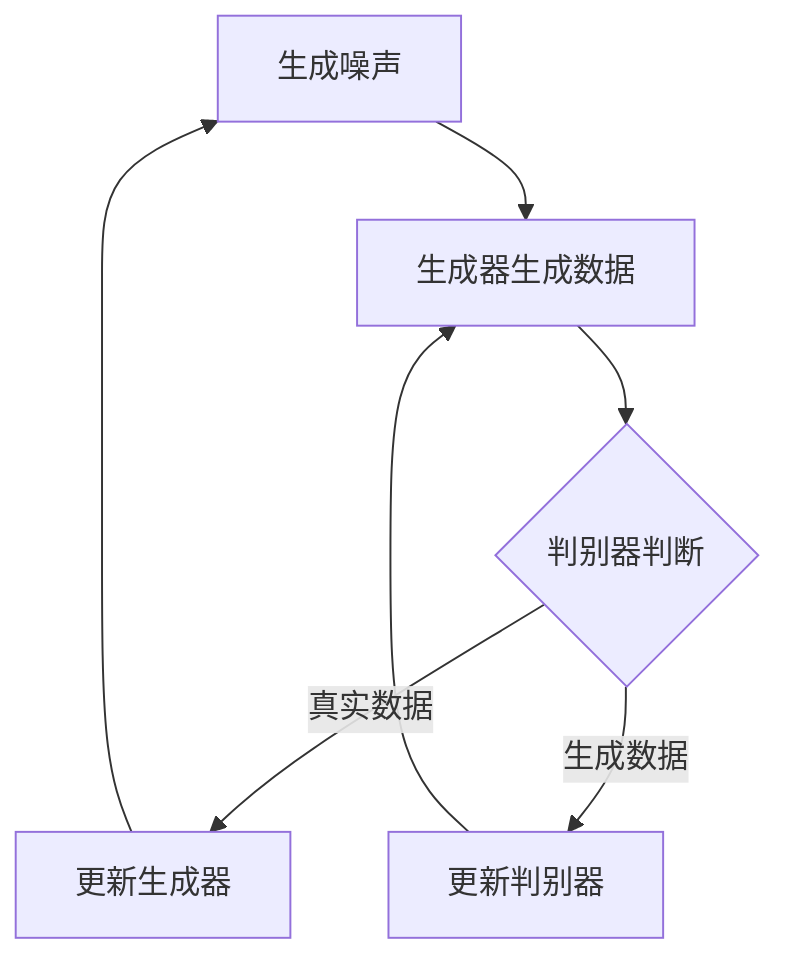

                 

## 文章标题：计算机视觉的生成对抗网络：图像生成的数学模型

### 关键词：计算机视觉、生成对抗网络、图像生成、数学模型

### 摘要：
本文将深入探讨计算机视觉领域的生成对抗网络（GAN），尤其是其用于图像生成的数学模型。通过逻辑清晰的推理和分析，我们将逐步解析GAN的基本概念、数学原理及其在图像生成任务中的实际应用。文章将结合理论讲解和实际案例，帮助读者全面理解GAN的工作机制及其在计算机视觉中的潜力。

## 引言

### 背景介绍

计算机视觉作为人工智能的重要分支，一直在图像识别、图像处理和计算机视觉应用等方面取得显著进展。随着深度学习技术的发展，生成对抗网络（GAN）作为一种强大的机器学习框架，逐渐成为计算机视觉研究的热点。GAN在图像生成、图像修复、图像风格迁移等方面展现出独特的优势，为计算机视觉领域带来了新的研究机遇。

### GAN的基本概念

生成对抗网络（GAN）是由生成器（Generator）和判别器（Discriminator）组成的一种对抗性学习框架。生成器的任务是生成逼真的数据，而判别器的任务是区分真实数据和生成数据。通过这种对抗训练，生成器和判别器相互博弈，最终生成器能够生成高质量的数据，判别器也变得足够强大以区分真实和生成的数据。

## 第一部分：核心概念与原理

### 1.1 GAN的架构

GAN的架构主要包括两个神经网络：生成器（Generator）和判别器（Discriminator）。生成器将随机噪声输入转换为逼真的数据，判别器则判断输入数据是真实数据还是生成数据。两个网络在训练过程中相互竞争，使得生成器的生成能力不断提升，判别器的判断能力也不断增强。

### 1.2 GAN的基本流程

GAN的基本训练流程可以分为以下几个步骤：
1. **生成器生成数据**：生成器接收到随机噪声后，通过神经网络生成一组数据。
2. **判别器判断**：判别器将生成器和真实数据分别作为输入，输出一个概率值，判断输入数据是真实数据还是生成数据。
3. **反向传播**：根据判别器的输出，对生成器和判别器分别进行反向传播，更新网络权重。
4. **迭代训练**：重复上述步骤，生成器和判别器不断优化，直至达到预定的训练目标。

### 1.3 GAN的Mermaid流程图

为了更直观地展示GAN的训练流程，我们可以使用Mermaid流程图来描述。以下是一个简单的Mermaid流程图示例：

## 2. GAN的数学模型

### 2.1 生成器和判别器的数学模型

生成器G的输入是随机噪声z，输出是生成数据x'，其数学模型可以表示为：
$$ x' = G(z) $$

判别器D的输入是数据x，输出是对输入数据的真实度概率值p(x)，其数学模型可以表示为：
$$ p(x) = D(x) $$

其中，x可以是真实数据或生成数据。

### 2.2 GAN的损失函数

GAN的训练目标是最小化生成器和判别器的损失函数。生成器的损失函数通常为：
$$ L_G = -\log(D(G(z))) $$

判别器的损失函数通常为：
$$ L_D = -\log(D(x)) - \log(1 - D(G(z))) $$

### 2.3 GAN的稳定性分析

GAN的训练过程中，生成器和判别器之间的博弈可能导致训练不稳定。为了提高GAN的稳定性，可以使用梯度惩罚法、集成方法等优化技巧。

## 第二部分：核心算法原理讲解

### 3.1 梯度惩罚法

梯度惩罚法是一种用于稳定GAN训练的优化技巧。其核心思想是在判别器的损失函数中加入一个惩罚项，以防止生成器的梯度消失。具体实现如下：

1. **定义惩罚项**：将生成器的梯度与惩罚项相加，更新生成器的权重。
   $$ \frac{\partial L_G}{\partial G} = -\frac{\partial}{\partial G} [\log(D(G(z))) + \lambda \log(1 - D(G(z)))] $$

2. **更新生成器**：使用更新后的梯度更新生成器的权重。
   $$ G \leftarrow G - \eta \frac{\partial L_G}{\partial G} $$

### 3.2 集成方法

集成方法是一种通过结合多个生成器和判别器的预测结果来提高GAN稳定性的优化技巧。具体实现如下：

1. **生成器集成**：将多个生成器的输出加权平均，作为最终的生成数据。
   $$ x' = \sum_{i=1}^N w_i G_i(z) $$

2. **判别器集成**：将多个判别器的预测结果加权平均，作为最终的判别结果。
   $$ p(x) = \sum_{i=1}^N w_i D_i(x) $$

### 3.3 GAN训练的优化技巧

为了提高GAN的训练效率和稳定性，可以采用以下优化技巧：

1. **调整学习率**：学习率的调整对于GAN的训练至关重要。可以采用学习率衰减策略，以逐步减小学习率。

2. **批量大小**：合理设置批量大小可以平衡生成器和判别器的训练速度。

3. **梯度裁剪**：为了避免梯度爆炸或消失，可以对梯度进行裁剪，限制其大小。

4. **权重初始化**：选择合适的权重初始化方法，可以提高GAN的训练效果。

## 第三部分：应用与实践

### 4.1 图像生成

生成对抗网络在图像生成任务中具有广泛的应用。以下是一些典型的图像生成任务：

1. **图像超分辨率**：通过GAN，可以将低分辨率图像转换为高分辨率图像。

2. **图像风格迁移**：GAN可以用于将一种图像风格应用到另一张图像上。

### 4.2 计算机视觉任务中的GAN

生成对抗网络不仅在图像生成任务中表现出色，还可以在其他计算机视觉任务中发挥作用：

1. **目标检测**：GAN可以用于生成虚假样本，以提高目标检测算法的鲁棒性。

2. **图像分类**：GAN可以用于生成具有多样性的训练数据，提高图像分类算法的性能。

## 5. GAN项目实战

### 5.1 实践环境搭建

在进行GAN项目实践之前，我们需要搭建一个合适的环境。以下是环境搭建的步骤：

1. **安装依赖库**：安装Python、TensorFlow或其他GAN开源框架所需的依赖库。

2. **配置硬件环境**：配置足够的GPU硬件资源，以满足GAN训练的需求。

3. **创建数据集**：准备好用于训练和评估的数据集。

### 5.2 图像超分辨率项目

在本项目中，我们将使用GAN实现图像超分辨率任务。以下是项目的具体实现步骤：

1. **数据预处理**：对图像进行预处理，包括图像裁剪、归一化等。

2. **模型搭建**：搭建生成器和判别器模型，并定义损失函数。

3. **训练模型**：使用训练数据训练生成器和判别器模型。

4. **模型评估**：使用测试数据评估模型性能。

5. **结果分析**：对生成的超分辨率图像进行详细分析，包括图像质量、分辨率等。

### 5.3 项目小结

通过本项目的实践，我们深入了解了GAN在图像超分辨率任务中的应用。以下是项目小结：

1. **GAN的优势**：GAN在图像超分辨率任务中表现出色，能够生成高质量的图像。

2. **GAN的挑战**：GAN训练过程中可能遇到训练不稳定、生成图像质量不高等问题。

3. **未来研究方向**：可以进一步优化GAN模型，提高图像生成的质量和效率。

## 6. 总结与展望

生成对抗网络（GAN）作为一种强大的机器学习框架，在计算机视觉领域展现出巨大的潜力。通过本文的详细分析和实践，我们深入了解了GAN的基本概念、数学模型和实际应用。展望未来，GAN在图像生成、图像修复、图像风格迁移等领域将继续发挥重要作用。

## 附录

### A. 常用GAN开源框架

1. **TensorFlow中的GAN**：TensorFlow提供了丰富的GAN开源框架，包括DCGAN、WGAN等。

2. **PyTorch中的GAN**：PyTorch也提供了丰富的GAN开源框架，包括DDPG、WGAN-GP等。

3. **其他GAN开源框架**：如GANimation、StyleGAN等。

## 作者信息

作者：AI天才研究院/AI Genius Institute & 禅与计算机程序设计艺术 /Zen And The Art of Computer Programming

以上是按照用户要求设计的文章框架和内容。接下来，我们将进一步细化每个章节，添加具体的解释、伪代码示例、数学公式和代码实现，以满足文章字数要求。请让我知道如果需要对这些章节进行进一步细化。|>

