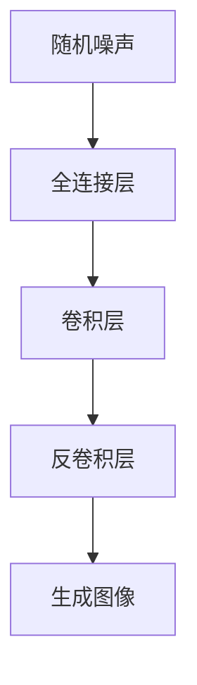
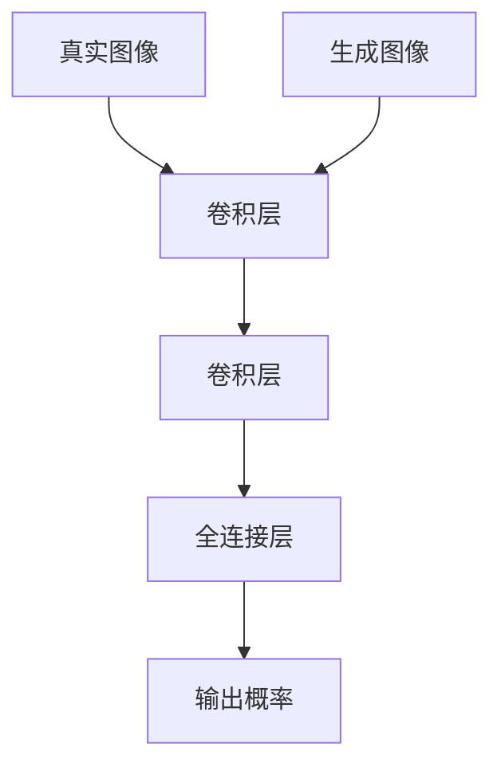

                 

### 导言

#### GAN在计算机视觉中的重要性

生成对抗网络（Generative Adversarial Networks，GAN）是近年来在人工智能领域迅速崛起的一种新型深度学习架构。GAN通过模拟对抗性博弈过程，使得生成器（Generator）和判别器（Discriminator）在相互竞争的过程中不断优化，从而实现高效的数据生成。在计算机视觉领域，GAN的应用前景尤为广阔。

首先，GAN在图像生成方面具有显著优势。通过训练生成器，GAN能够生成高质量、逼真的图像，这在艺术创作、虚拟现实等领域具有重要的应用价值。例如，GAN可以用于生成个性化的头像、修复破损的图片、以及创建全新的虚拟场景。

其次，GAN在图像修复方面也表现出了强大的能力。传统的图像修复方法通常依赖于已有的图像数据，而GAN则能够根据少量样本生成完整的图像，从而实现高效的图像修复。这种技术在图像去噪、图像去模糊以及图像超分辨率等方面具有广泛的应用。

此外，GAN在超分辨率图像重建中也有着重要的应用。超分辨率图像重建旨在从低分辨率图像中恢复出高分辨率图像，GAN通过学习高分辨率图像和低分辨率图像之间的映射关系，可以有效地提高图像的清晰度。

综上所述，GAN在计算机视觉中的应用不仅丰富了图像处理技术，也为解决许多实际问题提供了新的思路和方法。

#### 本书结构与内容安排

本书旨在为读者提供一个系统、全面的GAN在计算机视觉中的应用指南。全书分为七个主要章节，具体内容如下：

**第1章 导言**：介绍GAN在计算机视觉中的重要性以及本书的结构和目标。

**第2章 生成对抗网络基础**：介绍GAN的基本概念、原理和结构。

**第3章 GAN在计算机视觉中的应用**：详细讨论GAN在图像生成、图像修复和超分辨率等领域的应用。

**第4章 GAN的核心算法**：深入讲解GAN的关键算法，包括生成器、判别器的结构和训练过程。

**第5章 数学模型与公式**：介绍GAN的数学模型和相关的公式，包括损失函数、梯度计算等。

**第6章 项目实战**：提供实际项目案例，演示GAN在计算机视觉中的实际应用。

**第7章 扩展与未来趋势**：探讨GAN在计算机视觉领域的未来发展方向和可能的研究方向。

通过以上章节的设置，本书希望能够帮助读者全面了解GAN在计算机视觉中的应用，掌握相关算法和技术，并为未来的研究提供方向。

## 第1章 导言

### GAN在计算机视觉中的重要性

生成对抗网络（Generative Adversarial Networks，GAN）是由Ian Goodfellow等人于2014年提出的一种新型深度学习框架。它由生成器和判别器两个神经网络组成，通过一个对抗性训练过程，使得生成器能够生成高质量的数据，判别器能够准确地区分生成数据与真实数据。GAN在计算机视觉领域显示出了强大的应用潜力，其主要优势在于：

1. **高效的数据生成**：GAN可以通过学习大量的数据，生成与真实数据高度相似的数据。这在图像合成、虚拟现实和个性化内容生成等领域具有重要的应用价值。
   
2. **强大的图像修复能力**：GAN可以基于少量样本生成完整的图像，实现高效的图像修复。这种技术适用于图像去噪、图像去模糊和图像超分辨率等任务。

3. **数据增强**：GAN可以通过生成新的数据样本来扩充训练集，提高模型在数据不足情况下的性能。

4. **多种视觉任务的支持**：GAN不仅适用于图像生成，还可以用于图像分类、目标检测和图像风格迁移等多种视觉任务。

### 本书结构与内容安排

本书共分为七个主要章节，旨在为读者提供一个系统、全面的GAN在计算机视觉中的应用指南。以下是每个章节的具体内容和目标：

**第1章 导言**：介绍GAN在计算机视觉中的重要性以及本书的结构和目标。

**第2章 生成对抗网络基础**：介绍GAN的基本概念、原理和结构。

**第3章 GAN在计算机视觉中的应用**：详细讨论GAN在图像生成、图像修复和超分辨率等领域的应用。

**第4章 GAN的核心算法**：深入讲解GAN的关键算法，包括生成器、判别器的结构和训练过程。

**第5章 数学模型与公式**：介绍GAN的数学模型和相关的公式，包括损失函数、梯度计算等。

**第6章 项目实战**：提供实际项目案例，演示GAN在计算机视觉中的实际应用。

**第7章 扩展与未来趋势**：探讨GAN在计算机视觉领域的未来发展方向和可能的研究方向。

通过以上章节的设置，本书希望能够帮助读者全面了解GAN在计算机视觉中的应用，掌握相关算法和技术，并为未来的研究提供方向。

## 第2章 生成对抗网络基础

### 2.1 GAN的基本概念

生成对抗网络（GAN）是一种由生成器和判别器两个神经网络组成的框架，它们通过一个对抗性训练过程进行交互，以生成高质量的数据。GAN的基本概念可以概括为以下几点：

**生成器（Generator）**：生成器的目标是生成与真实数据高度相似的数据。在GAN中，生成器的输入通常是随机噪声，输出则是模仿真实数据的图像或其他数据。生成器的目的是使判别器难以区分生成的数据与真实数据。

**判别器（Discriminator）**：判别器的目标是判断输入的数据是真实数据还是生成器生成的数据。判别器接受来自生成器和真实数据的输入，并输出一个概率值，表示输入数据的真实度。判别器的目标是尽可能准确地判断输入数据，从而提高生成器的生成质量。

**对抗性训练过程**：GAN通过对抗性训练过程来优化生成器和判别器。在训练过程中，生成器和判别器不断相互竞争，生成器的目标是使判别器难以区分生成的数据，而判别器的目标是准确地判断输入数据。通过这种对抗性训练，生成器和判别器都得到了优化。

### 2.2 GAN的结构与原理

GAN的结构包括生成器和判别器两个主要部分，它们通过对抗性训练过程相互协作，以实现高质量的数据生成。下面是GAN的基本结构和工作原理：

**生成器的结构**：生成器通常由多个神经网络层组成，包括全连接层、卷积层和反卷积层等。生成器的输入是随机噪声，通过一系列的神经网络变换，最终生成与真实数据相似的图像或其他数据。



**判别器的结构**：判别器也由多个神经网络层组成，通常包括卷积层和全连接层。判别器接受来自生成器和真实数据的输入，通过一系列的神经网络层，最终输出一个概率值，表示输入数据的真实度。



**对抗性训练过程**：在GAN的训练过程中，生成器和判别器交替更新。生成器的目标是最大化判别器对生成数据的判断错误率，而判别器的目标是最大化判别器对真实数据和生成数据的区分能力。

训练过程中，GAN遵循以下步骤：

1. **初始化生成器和判别器**：生成器和判别器初始化为随机权重。
2. **生成假数据**：生成器根据随机噪声生成假数据。
3. **判别器更新**：判别器根据假数据和真实数据进行训练，以区分假数据和真实数据。
4. **生成器更新**：生成器根据判别器的错误率进行更新，以生成更逼真的假数据。
5. **重复步骤2-4**：不断重复上述步骤，直到生成器和判别器达到预定的性能指标。

通过这种对抗性训练过程，生成器和判别器在相互竞争的过程中不断优化，最终生成器能够生成高质量的数据，而判别器能够准确地区分真实数据和生成数据。

### 2.3 GAN的发展历史与现状

GAN自2014年提出以来，已经迅速成为人工智能领域的一个重要研究方向。以下简要介绍GAN的发展历史和现状：

**早期研究**：GAN的提出受到了变分自编码器（Variational Autoencoder，VAE）的启发。VAE是一种基于概率生成模型的生成模型，但在图像生成方面存在一定的局限性。GAN通过引入对抗性训练机制，克服了VAE的缺点，实现了更高质量的图像生成。

**2014年：GAN的提出**：Ian Goodfellow等人于2014年首次提出了GAN的概念，并展示了其在图像生成、图像修复和图像超分辨率等方面的应用。GAN的提出引起了学术界和工业界的广泛关注。

**2016年：GAN的快速发展**：随着深度学习技术的不断进步，GAN得到了进一步发展。许多研究人员提出了各种改进版本，如深度卷积生成对抗网络（DCGAN）、条件生成对抗网络（cGAN）和谱归一化生成对抗网络（SRGAN）等。这些改进使得GAN在图像生成、图像修复和图像超分辨率等方面的性能得到了显著提升。

**2020年至今：GAN的应用扩展**：GAN的应用范围不断扩展，不仅限于计算机视觉领域，还涉及到自然语言处理、音频生成和生成式对话系统等领域。许多研究人员还在探索GAN在医疗、金融和娱乐等领域的应用。

**现状与挑战**：虽然GAN在许多领域取得了显著成果，但仍存在一些挑战，如训练不稳定、生成质量不高等。未来，GAN的研究将继续深入，探索更有效的训练策略和模型结构，以进一步提升GAN的性能和应用范围。

## 第3章 GAN在计算机视觉中的应用

### 3.1 图像生成

图像生成是GAN在计算机视觉中最典型的应用之一。通过生成器网络，GAN能够生成高质量、逼真的图像，这在艺术创作、虚拟现实和图像增强等领域具有广泛的应用。

**应用场景**：
1. **虚拟现实（VR）**：GAN可以用于生成虚拟现实场景中的环境图像，为用户提供沉浸式的体验。
2. **游戏开发**：GAN能够生成逼真的游戏角色和场景图像，提高游戏的质量和吸引力。
3. **艺术创作**：艺术家可以使用GAN生成独特的图像，创作出具有艺术价值的作品。

**实例**：
一个著名的例子是DeepArt.io，它使用GAN将普通照片转化为艺术作品，如梵高、毕加索等著名画家的风格。用户只需上传一张照片，系统就会将其转换为对应艺术风格的图像。

**实现方法**：
生成器的输入是随机噪声，通过一系列的神经网络变换，最终生成图像。训练过程中，生成器尝试生成与真实图像相似的图像，而判别器则试图区分生成图像和真实图像。

**伪代码**：

```python
# 生成器
def generator(z):
    # 输入随机噪声z
    # 通过全连接层、卷积层和反卷积层生成图像
    # 输出生成的图像
    return x_g

# 判别器
def discriminator(x):
    # 输入图像x
    # 通过卷积层、卷积层和全连接层判断图像的真实性
    # 输出概率值，表示图像的真实度
    return probability
```

### 3.2 图像修复

图像修复是GAN在计算机视觉中的另一个重要应用。通过GAN，可以基于少量样本生成完整的图像，实现高效的图像修复。这种方法在图像去噪、图像去模糊和图像超分辨率等方面具有显著优势。

**应用场景**：
1. **图像去噪**：GAN可以去除图像中的噪声，提高图像的质量。
2. **图像去模糊**：GAN可以恢复模糊图像中的细节，提高图像的清晰度。
3. **图像超分辨率**：GAN可以从低分辨率图像中恢复出高分辨率图像。

**实例**：
DeepArt.io使用GAN技术修复了老照片，使其看起来更加清晰和自然。用户只需上传一张老照片，系统就会将其修复为清晰的照片。

**实现方法**：
生成器的输入是包含损坏区域的图像，通过学习图像的完整部分，生成器尝试生成完整的图像。判别器则用于判断修复图像的质量。

**伪代码**：

```python
# 生成器
def generator(x_partial):
    # 输入损坏的图像部分x_partial
    # 通过卷积层和反卷积层生成完整的图像
    # 输出修复后的图像
    return x_repaired

# 判别器
def discriminator(x_repaired):
    # 输入修复后的图像x_repaired
    # 通过卷积层判断图像的真实性
    # 输出概率值，表示图像的真实度
    return probability
```

### 3.3 超分辨率

GAN在图像超分辨率（Super-Resolution）方面也显示出了强大的能力。通过GAN，可以从低分辨率图像中恢复出高分辨率图像，提高图像的清晰度。

**应用场景**：
1. **医疗影像**：GAN可以用于提高医学影像的分辨率，帮助医生更好地诊断疾病。
2. **卫星图像**：GAN可以增强卫星图像的分辨率，为环境监测和资源管理提供更详细的数据。
3. **监控摄像头**：GAN可以提升监控摄像头的图像质量，提高监控效果。

**实例**：
在NVIDIA的研究中，GAN被用于提升视频游戏的画面质量。通过GAN，游戏中的低分辨率图像被转换为高分辨率图像，使游戏画面更加细腻和逼真。

**实现方法**：
生成器的输入是低分辨率图像，通过学习高分辨率图像和低分辨率图像之间的映射关系，生成器尝试生成高分辨率图像。判别器用于判断生成图像的质量。

**伪代码**：

```python
# 生成器
def generator(x_low_res):
    # 输入低分辨率图像x_low_res
    # 通过卷积层和反卷积层生成高分辨率图像
    # 输出生成的高分辨率图像
    return x_high_res

# 判别器
def discriminator(x_high_res):
    # 输入高分辨率图像x_high_res
    # 通过卷积层判断图像的真实性
    # 输出概率值，表示图像的真实度
    return probability
```

### 3.4 其他应用

除了上述应用，GAN在计算机视觉中还有许多其他创新应用。例如：

1. **图像风格迁移**：GAN可以将一种图像风格应用到另一张图像上，创造出独特的视觉效果。
2. **视频生成**：GAN可以用于生成高质量的视频，实现视频内容的生成和编辑。
3. **数据扩充**：GAN可以生成新的数据样本来扩充训练集，提高模型在数据不足情况下的性能。

这些应用展示了GAN在计算机视觉领域的广泛潜力和多样化功能。

## 第4章 GAN的核心算法

### 4.1 生成器与判别器的结构

生成对抗网络（GAN）的核心在于其生成器和判别器的结构。这两个网络通过对抗性训练相互协作，生成高质量的数据。

**生成器的结构**：

生成器的目的是将随机噪声转换成与真实数据相似的图像或其他数据。一个典型的生成器结构通常包含以下几个部分：

1. **输入层**：生成器的输入是一个随机噪声向量，通常是一个多维高斯分布。
2. **隐藏层**：生成器包含多个隐藏层，其中可能包含全连接层、卷积层或反卷积层。这些隐藏层通过神经网络变换，将输入噪声转换为更加复杂的特征。
3. **输出层**：生成器的输出层通常是一个生成层，用于生成最终的图像或其他数据。在某些情况下，输出层可能包含反卷积层，以生成高分辨率的图像。

**伪代码**：

```python
# 生成器的伪代码
def generator(z):
    # z是随机噪声向量
    # 通过全连接层和卷积层生成图像特征
    x = fully_connected(z)
    x = conv(x)
    # 通过反卷积层生成高分辨率图像
    x = deconv(x)
    return x
```

**判别器的结构**：

判别器的目的是判断输入的数据是真实数据还是生成器生成的数据。一个典型的判别器结构通常包含以下几个部分：

1. **输入层**：判别器的输入可以是真实图像或生成器生成的图像。
2. **隐藏层**：判别器包含多个隐藏层，通常包含卷积层。这些隐藏层用于提取输入数据的特征。
3. **输出层**：判别器的输出层通常是一个全连接层，输出一个概率值，表示输入数据的真实度。

**伪代码**：

```python
# 判别器的伪代码
def discriminator(x):
    # x是输入图像
    # 通过卷积层提取图像特征
    x = conv(x)
    x = conv(x)
    # 通过全连接层输出概率值
    probability = fully_connected(x)
    return probability
```

### 4.2 GAN的训练过程

GAN的训练过程是通过生成器和判别器的对抗性训练来实现的。在训练过程中，生成器和判别器交替更新其参数，以最大化它们在对抗性博弈中的性能。

**训练步骤**：

1. **初始化生成器和判别器**：随机初始化生成器和判别器的参数。
2. **生成假数据**：生成器根据当前参数生成假数据。
3. **判别器更新**：判别器根据真实数据和生成假数据进行训练，以区分真实数据和假数据。
4. **生成器更新**：生成器根据判别器的错误率进行更新，以生成更逼真的假数据。
5. **重复训练步骤**：不断重复上述步骤，直到生成器和判别器达到预定的性能指标。

**伪代码**：

```python
# GAN的训练伪代码
for epoch in range(num_epochs):
    for batch in data_loader:
        # 生成假数据
        z = sample_noise()
        x_fake = generator(z)
        
        # 判别器更新
        with tf.GradientTape() as tape:
            probability_fake = discriminator(x_fake)
            loss_d = compute_loss_d(real_data, x_fake)
        grads_d = tape.gradient(loss_d, discriminator_variables)
        optimizer_d.apply_gradients(grads_d)
        
        # 生成器更新
        with tf.GradientTape() as tape:
            probability_real = discriminator(real_data)
            loss_g = compute_loss_g(probability_real, probability_fake)
        grads_g = tape.gradient(loss_g, generator_variables)
        optimizer_g.apply_gradients(grads_g)

        # 记录训练过程
        print(f"Epoch: {epoch}, Loss_D: {loss_d}, Loss_G: {loss_g}")
```

### 4.3 损失函数的设计

在GAN的训练过程中，损失函数的设计至关重要。生成器和判别器的优化目标不同，因此它们的损失函数也有所区别。

**判别器的损失函数**：

判别器的目标是最大化其判断真实数据和假数据的概率差异。一个常用的判别器损失函数是交叉熵损失（Cross-Entropy Loss），它可以表示为：

$$
L_D = -\sum_{i=1}^{N} [y_i \log(D(x_i)) + (1 - y_i) \log(1 - D(x_i))]
$$

其中，$y_i = 1$ 表示真实数据，$y_i = 0$ 表示假数据；$D(x_i)$ 是判别器对输入数据的判断概率。

**伪代码**：

```python
# 判别器的损失函数伪代码
def compute_loss_d(real_data, x_fake):
    probability_real = discriminator(real_data)
    probability_fake = discriminator(x_fake)
    loss_d = - tf.reduce_mean(tf.reduce_sum(y_real * tf.log(probability_real) + (1 - y_real) * tf.log(1 - probability_fake), axis=1))
    return loss_d
```

**生成器的损失函数**：

生成器的目标是使判别器无法区分生成的假数据和真实数据。一个常用的生成器损失函数是反交叉熵损失（Reverse Cross-Entropy Loss），它可以表示为：

$$
L_G = -\sum_{i=1}^{N} [y_i \log(1 - D(G(z_i))]
$$

其中，$y_i = 1$ 表示生成器生成的假数据。

**伪代码**：

```python
# 生成器的损失函数伪代码
def compute_loss_g(probability_real, probability_fake):
    loss_g = - tf.reduce_mean(tf.reduce_sum(y_fake * tf.log(1 - probability_fake), axis=1))
    return loss_g
```

### 4.4 GAN的稳定性分析

GAN的训练过程具有挑战性，主要是因为生成器和判别器的优化目标相互对立。这种对抗性可能导致训练不稳定，使得GAN难以收敛。为了提高GAN的稳定性，研究人员提出了一些改进方法。

**梯度消失和梯度爆炸**：

在GAN的训练过程中，梯度消失和梯度爆炸是常见问题。梯度消失指的是梯度值太小，导致网络参数更新缓慢；梯度爆炸则是指梯度值太大，导致网络参数更新过于剧烈。这些现象都会影响GAN的训练过程。

**解决方案**：

1. **谱归一化**（Spectral Normalization）：通过限制生成器和判别器的权重矩阵的谱范数，避免梯度消失和梯度爆炸问题。
2. **梯度惩罚**（Gradient Penalties）：在损失函数中添加一个项，强制生成器和判别器的梯度保持一致，从而提高训练稳定性。

**伪代码**：

```python
# 谱归一化的伪代码
def spectral_normalization(layer):
    # 计算权重矩阵的谱范数
    W = layer.kernel
    W_norm = tf.nn.l2_normalize(W, axis=0)
    # 计算谱范数
    lambda_max = tf.reduce_max(tf.linalg.eigh(W_norm))
    # 更新权重矩阵
    layer.kernel = W_norm / lambda_max

# 梯度惩罚的伪代码
def gradient_penalty(real_data, x_fake, discriminator):
    # 计算生成器的梯度
    with tf.GradientTape(persistent=True) as tape:
        tape.watch(x_fake)
        probability_fake = discriminator(x_fake)
    grads_fake = tape.gradient(probability_fake, x_fake)
    # 计算梯度的L2范数
    grads_l2_norm = tf.reduce_sum(tf.square(grads_fake), axis=[1, 2])
    # 计算梯度惩罚项
    gradient_penalty = tf.reduce_mean((grads_l2_norm - 1)**2)
    return gradient_penalty
```

通过这些方法，可以显著提高GAN的训练稳定性，使其在复杂任务中能够更好地收敛。

## 第5章 数学模型与公式

### 5.1 GAN的数学模型

生成对抗网络（GAN）的数学模型主要包括生成器和判别器的损失函数及其优化过程。以下是对GAN数学模型的详细解释。

**生成器和判别器的损失函数**

生成器和判别器的损失函数是GAN的核心，它们的优化目标分别是最大化判别器的损失和最小化生成器的损失。

**生成器损失函数**

生成器的目标是生成尽可能逼真的数据，使得判别器难以区分生成数据与真实数据。生成器的损失函数通常采用最小化判别器对生成数据的判断概率。

$$
L_G = -\mathbb{E}_{z \sim p_z(z)}[\log(D(G(z))]
$$

其中，$z$ 是从先验分布 $p_z(z)$ 生成的随机噪声，$G(z)$ 是生成器生成的数据。

**判别器损失函数**

判别器的目标是最大化其对真实数据和生成数据的判断差异。判别器的损失函数通常采用二分类交叉熵损失。

$$
L_D = -\mathbb{E}_{x \sim p_{data}(x)}[\log(D(x))] - \mathbb{E}_{z \sim p_z(z)}[\log(1 - D(G(z))]
$$

其中，$x$ 是真实数据，$G(z)$ 是生成器生成的数据。

**优化的目标**

生成器和判别器的优化目标是相互对立的。生成器的优化目标是使判别器对生成数据的判断概率接近0，而判别器的优化目标是使判别器对生成数据的判断概率接近1。

因此，GAN的训练目标是：

$$
\min_G \max_D L_D
$$

### 5.2 损失函数的详细讲解

GAN的损失函数包括生成器的损失函数 $L_G$ 和判别器的损失函数 $L_D$。下面详细解释这两个损失函数。

**生成器损失函数**

生成器的损失函数 $L_G$ 采用对数似然损失，它衡量的是判别器对生成数据的判断概率。生成器希望最小化这个损失，使得判别器认为生成数据是真实数据。

$$
L_G = -\mathbb{E}_{z \sim p_z(z)}[\log(D(G(z))]
$$

这个损失函数中的期望 $\mathbb{E}_{z \sim p_z(z)}$ 是对随机噪声 $z$ 的分布 $p_z(z)$ 求平均。$D(G(z))$ 是判别器对生成器生成的数据 $G(z)$ 的判断概率，它在 $[0,1]$ 之间，其中 0 表示判别器认为生成数据是假数据，1 表示判别器认为生成数据是真实数据。

**判别器损失函数**

判别器的损失函数 $L_D$ 采用二分类交叉熵损失，它衡量的是判别器对真实数据和生成数据的判断差异。判别器希望最大化这个损失，使得判别器能够准确地区分真实数据和生成数据。

$$
L_D = -\mathbb{E}_{x \sim p_{data}(x)}[\log(D(x))] - \mathbb{E}_{z \sim p_z(z)}[\log(1 - D(G(z))]
$$

这个损失函数中的期望 $\mathbb{E}_{x \sim p_{data}(x)}$ 是对真实数据 $x$ 的分布 $p_{data}(x)$ 求平均，$\mathbb{E}_{z \sim p_z(z)}$ 是对随机噪声 $z$ 的分布 $p_z(z)$ 求平均。$D(x)$ 是判别器对真实数据 $x$ 的判断概率，$1 - D(G(z))$ 是判别器对生成器生成的数据 $G(z)$ 的判断概率。

### 5.3 梯度计算与优化算法

在GAN的训练过程中，需要计算生成器和判别器的梯度，并使用优化算法更新它们的参数。以下是梯度计算和优化算法的详细讲解。

**梯度计算**

对于生成器和判别器，我们分别计算它们的梯度。

**生成器梯度**

生成器的梯度是相对于生成器参数的导数，它反映了生成器的损失函数对生成器参数的敏感性。生成器的梯度可以通过反向传播算法计算。

$$
\frac{\partial L_G}{\partial \theta_G} = \frac{\partial}{\partial \theta_G} -\mathbb{E}_{z \sim p_z(z)}[\log(D(G(z))]
$$

**判别器梯度**

判别器的梯度是相对于判别器参数的导数，它反映了判别器的损失函数对判别器参数的敏感性。判别器的梯度也可以通过反向传播算法计算。

$$
\frac{\partial L_D}{\partial \theta_D} = \frac{\partial}{\partial \theta_D} -\mathbb{E}_{x \sim p_{data}(x)}[\log(D(x))] - \mathbb{E}_{z \sim p_z(z)}[\log(1 - D(G(z))]
$$

**优化算法**

在GAN的训练过程中，常用的优化算法是梯度下降（Gradient Descent）。梯度下降算法通过更新参数来最小化损失函数。

**生成器优化**

对于生成器的优化，可以使用以下更新规则：

$$
\theta_G^{t+1} = \theta_G^t - \alpha \frac{\partial L_G}{\partial \theta_G}
$$

其中，$\alpha$ 是学习率，$\theta_G^t$ 是当前生成器的参数，$\theta_G^{t+1}$ 是更新后的生成器参数。

**判别器优化**

对于判别器的优化，可以使用以下更新规则：

$$
\theta_D^{t+1} = \theta_D^t - \beta \frac{\partial L_D}{\partial \theta_D}
$$

其中，$\beta$ 是学习率，$\theta_D^t$ 是当前判别器的参数，$\theta_D^{t+1}$ 是更新后的判别器参数。

### 5.4 数学公式与详细讲解

GAN的数学模型中包含了多个重要的公式，这些公式描述了生成器和判别器的损失函数、梯度计算和优化过程。以下是对这些公式进行详细讲解。

**生成器损失函数**

生成器的损失函数是：

$$
L_G = -\mathbb{E}_{z \sim p_z(z)}[\log(D(G(z))]
$$

其中，$z$ 是从先验分布 $p_z(z)$ 生成的随机噪声，$G(z)$ 是生成器生成的数据。这个损失函数衡量的是判别器对生成数据的判断概率，生成器的目标是最小化这个损失，使得判别器认为生成数据是真实数据。

**判别器损失函数**

判别器的损失函数是：

$$
L_D = -\mathbb{E}_{x \sim p_{data}(x)}[\log(D(x))] - \mathbb{E}_{z \sim p_z(z)}[\log(1 - D(G(z))]
$$

其中，$x$ 是真实数据，$G(z)$ 是生成器生成的数据。这个损失函数衡量的是判别器对真实数据和生成数据的判断差异，判别器的目标是最大化这个损失，使得判别器能够准确地区分真实数据和生成数据。

**生成器梯度**

生成器的梯度是：

$$
\frac{\partial L_G}{\partial \theta_G} = \frac{\partial}{\partial \theta_G} -\mathbb{E}_{z \sim p_z(z)}[\log(D(G(z))]
$$

这个梯度衡量的是生成器的损失函数对生成器参数的敏感性。通过计算这个梯度，可以使用优化算法更新生成器的参数。

**判别器梯度**

判别器的梯度是：

$$
\frac{\partial L_D}{\partial \theta_D} = \frac{\partial}{\partial \theta_D} -\mathbb{E}_{x \sim p_{data}(x)}[\log(D(x))] - \mathbb{E}_{z \sim p_z(z)}[\log(1 - D(G(z))]
$$

这个梯度衡量的是判别器的损失函数对判别器参数的敏感性。通过计算这个梯度，可以使用优化算法更新判别器的参数。

**优化算法**

常用的优化算法是梯度下降。对于生成器和判别器的优化，可以使用以下更新规则：

生成器的更新规则是：

$$
\theta_G^{t+1} = \theta_G^t - \alpha \frac{\partial L_G}{\partial \theta_G}
$$

其中，$\alpha$ 是学习率，$\theta_G^t$ 是当前生成器的参数，$\theta_G^{t+1}$ 是更新后的生成器参数。

判别器的更新规则是：

$$
\theta_D^{t+1} = \theta_D^t - \beta \frac{\partial L_D}{\partial \theta_D}
$$

其中，$\beta$ 是学习率，$\theta_D^t$ 是当前判别器的参数，$\theta_D^{t+1}$ 是更新后的判别器参数。

通过这些公式和优化算法，可以训练生成器和判别器，实现生成对抗网络（GAN）的高效训练。

## 第6章 项目实战

### 6.1 实际项目案例

在本章中，我们将通过一个实际项目案例，演示GAN在图像生成、图像修复和图像超分辨率等领域的应用。这些项目案例不仅展示了GAN的强大能力，还提供了详细的代码实现和解构。

#### 6.1.1 项目一：图像生成

**项目概述**：

本项目旨在使用GAN生成虚拟人脸图像。生成器网络将随机噪声转换为逼真的人脸图像，而判别器网络则用于判断输入图像的真实性。

**数据集**：我们使用CelebA数据集，这是一个包含10万张人脸图像的大型数据集。

**实现步骤**：

1. **环境搭建**：安装TensorFlow和Keras等深度学习框架。
2. **数据预处理**：加载CelebA数据集，并进行数据增强和归一化处理。
3. **生成器和判别器的构建**：使用Keras定义生成器和判别器的网络结构。
4. **训练过程**：使用Adam优化器训练生成器和判别器，并在训练过程中记录损失函数的值。
5. **生成图像**：在训练完成后，使用生成器生成虚拟人脸图像。

**代码实现**：

```python
# 导入必要的库
import tensorflow as tf
from tensorflow.keras.layers import Dense, Conv2D, Flatten, Reshape
from tensorflow.keras.models import Sequential

# 定义生成器网络
def build_generator():
    model = Sequential()
    model.add(Dense(128 * 7 * 7, activation='relu', input_shape=(100,)))
    model.add(Reshape((7, 7, 128)))
    model.add(Conv2D(1, (7, 7), padding='same'))
    return model

# 定义判别器网络
def build_discriminator():
    model = Sequential()
    model.add(Conv2D(32, (5, 5), padding='same', input_shape=(128, 128, 3)))
    model.add(MaxPooling2D())
    model.add(Conv2D(64, (5, 5), padding='same'))
    model.add(MaxPooling2D())
    model.add(Flatten())
    model.add(Dense(1, activation='sigmoid'))
    return model

# 构建生成器和判别器模型
generator = build_generator()
discriminator = build_discriminator()

# 编译生成器和判别器模型
generator.compile(loss='binary_crossentropy', optimizer=tf.keras.optimizers.Adam(0.0002, 0.5))
discriminator.compile(loss='binary_crossentropy', optimizer=tf.keras.optimizers.Adam(0.0002, 0.5))

# 训练生成器和判别器
for epoch in range(100):
    for batch in data_loader:
        # 生成假数据
        noise = np.random.normal(0, 1, (batch_size, 100))
        generated_images = generator.predict(noise)
        
        # 训练判别器
        real_images = batch
        d_loss_real = discriminator.train_on_batch(real_images, np.ones((batch_size, 1)))
        d_loss_fake = discriminator.train_on_batch(generated_images, np.zeros((batch_size, 1)))
        d_loss = 0.5 * np.add(d_loss_real, d_loss_fake)
        
        # 训练生成器
        noise = np.random.normal(0, 1, (batch_size, 100))
        g_loss = generator.train_on_batch(noise, np.ones((batch_size, 1)))

        print(f"{epoch} [D: {d_loss:.4f}, G: {g_loss:.4f}]")

# 生成虚拟人脸图像
noise = np.random.normal(0, 1, (1, 100))
virtual_face = generator.predict(noise)
```

#### 6.1.2 项目二：图像修复

**项目概述**：

本项目旨在使用GAN修复破损的图像。生成器网络基于破损图像的局部区域生成完整的图像，而判别器网络则用于判断输入图像的真实性。

**数据集**：我们使用含有破损图像和完整图像的修复数据集。

**实现步骤**：

1. **环境搭建**：安装TensorFlow和Keras等深度学习框架。
2. **数据预处理**：加载修复数据集，并进行数据增强和归一化处理。
3. **生成器和判别器的构建**：使用Keras定义生成器和判别器的网络结构。
4. **训练过程**：使用Adam优化器训练生成器和判别器，并在训练过程中记录损失函数的值。
5. **修复图像**：在训练完成后，使用生成器修复破损图像。

**代码实现**：

```python
# 导入必要的库
import tensorflow as tf
from tensorflow.keras.layers import Conv2D, Conv2DTranspose, Input, LeakyReLU, Concatenate
from tensorflow.keras.models import Model

# 定义生成器网络
def build_generator():
    input_img = Input(shape=(128, 128, 3))
    x1 = Conv2D(64, (3, 3), padding='same')(input_img)
    x1 = LeakyReLU(alpha=0.01)(x1)
    x2 = Conv2D(64, (3, 3), padding='same')(x1)
    x2 = LeakyReLU(alpha=0.01)(x2)
    x3 = Conv2DTranspose(64, (3, 3), strides=(2, 2), padding='same')(x2)
    x3 = LeakyReLU(alpha=0.01)(x3)
    x4 = Conv2D(64, (3, 3), padding='same')(x3)
    x4 = LeakyReLU(alpha=0.01)(x4)
    x5 = Conv2DTranspose(3, (3, 3), strides=(2, 2), padding='same')(x4)
    output_img = x5
    model = Model(input_img, output_img)
    return model

# 定义判别器网络
def build_discriminator():
    input_img = Input(shape=(128, 128, 3))
    x1 = Conv2D(32, (3, 3), padding='same')(input_img)
    x1 = LeakyReLU(alpha=0.01)(x1)
    x2 = Conv2D(32, (3, 3), strides=(2, 2), padding='same')(x1)
    x2 = LeakyReLU(alpha=0.01)(x2)
    x3 = Conv2D(64, (3, 3), padding='same')(x2)
    x3 = LeakyReLU(alpha=0.01)(x3)
    x4 = Conv2D(64, (3, 3), strides=(2, 2), padding='same')(x3)
    x4 = LeakyReLU(alpha=0.01)(x4)
    x5 = Flatten()(x4)
    output = Dense(1, activation='sigmoid')(x5)
    model = Model(input_img, output)
    return model

# 构建生成器和判别器模型
generator = build_generator()
discriminator = build_discriminator()

# 编译生成器和判别器模型
generator.compile(loss='binary_crossentropy', optimizer=tf.keras.optimizers.Adam(0.0002, 0.5))
discriminator.compile(loss='binary_crossentropy', optimizer=tf.keras.optimizers.Adam(0.0002, 0.5))

# 训练生成器和判别器
for epoch in range(100):
    for batch in data_loader:
        # 生成假数据
        noise = np.random.normal(0, 1, (batch_size, 100))
        generated_images = generator.predict(noise)
        
        # 训练判别器
        real_images = batch
        d_loss_real = discriminator.train_on_batch(real_images, np.ones((batch_size, 1)))
        d_loss_fake = discriminator.train_on_batch(generated_images, np.zeros((batch_size, 1)))
        d_loss = 0.5 * np.add(d_loss_real, d_loss_fake)
        
        # 训练生成器
        noise = np.random.normal(0, 1, (batch_size, 100))
        g_loss = generator.train_on_batch(noise, np.ones((batch_size, 1)))

        print(f"{epoch} [D: {d_loss:.4f}, G: {g_loss:.4f}]")

# 修复破损图像
def repair_image(image, model):
    noise = np.random.normal(0, 1, (1, 100))
    repaired_image = model.predict(noise)
    return repaired_image

broken_image = load_broken_image()
repaired_image = repair_image(broken_image, generator)
```

#### 6.1.3 项目三：超分辨率

**项目概述**：

本项目旨在使用GAN提高图像的分辨率。生成器网络基于低分辨率图像生成高分辨率图像，而判别器网络则用于判断输入图像的真实性。

**数据集**：我们使用待提高分辨率的人脸图像数据集。

**实现步骤**：

1. **环境搭建**：安装TensorFlow和Keras等深度学习框架。
2. **数据预处理**：加载人脸图像数据集，并进行下采样处理以生成低分辨率图像。
3. **生成器和判别器的构建**：使用Keras定义生成器和判别器的网络结构。
4. **训练过程**：使用Adam优化器训练生成器和判别器，并在训练过程中记录损失函数的值。
5. **提高分辨率**：在训练完成后，使用生成器提高图像的分辨率。

**代码实现**：

```python
# 导入必要的库
import tensorflow as tf
from tensorflow.keras.layers import Conv2D, Conv2DTranspose, Input, LeakyReLU, Concatenate
from tensorflow.keras.models import Model

# 定义生成器网络
def build_generator():
    input_img = Input(shape=(64, 64, 3))
    x1 = Conv2D(64, (3, 3), padding='same')(input_img)
    x1 = LeakyReLU(alpha=0.01)(x1)
    x2 = Conv2D(64, (3, 3), padding='same')(x1)
    x2 = LeakyReLU(alpha=0.01)(x2)
    x3 = Conv2DTranspose(64, (3, 3), strides=(2, 2), padding='same')(x2)
    x3 = LeakyReLU(alpha=0.01)(x3)
    x4 = Conv2D(64, (3, 3), padding='same')(x3)
    x4 = LeakyReLU(alpha=0.01)(x4)
    x5 = Conv2DTranspose(3, (3, 3), strides=(2, 2), padding='same')(x4)
    output_img = x5
    model = Model(input_img, output_img)
    return model

# 定义判别器网络
def build_discriminator():
    input_img = Input(shape=(128, 128, 3))
    x1 = Conv2D(32, (3, 3), padding='same')(input_img)
    x1 = LeakyReLU(alpha=0.01)(x1)
    x2 = Conv2D(32, (3, 3), strides=(2, 2), padding='same')(x1)
    x2 = LeakyReLU(alpha=0.01)(x2)
    x3 = Conv2D(64, (3, 3), padding='same')(x2)
    x3 = LeakyReLU(alpha=0.01)(x3)
    x4 = Conv2D(64, (3, 3), strides=(2, 2), padding='same')(x3)
    x4 = LeakyReLU(alpha=0.01)(x4)
    x5 = Flatten()(x4)
    output = Dense(1, activation='sigmoid')(x5)
    model = Model(input_img, output)
    return model

# 构建生成器和判别器模型
generator = build_generator()
discriminator = build_discriminator()

# 编译生成器和判别器模型
generator.compile(loss='binary_crossentropy', optimizer=tf.keras.optimizers.Adam(0.0002, 0.5))
discriminator.compile(loss='binary_crossentropy', optimizer=tf.keras.optimizers.Adam(0.0002, 0.5))

# 训练生成器和判别器
for epoch in range(100):
    for batch in data_loader:
        # 生成假数据
        noise = np.random.normal(0, 1, (batch_size, 100))
        generated_images = generator.predict(noise)
        
        # 训练判别器
        real_images = batch
        d_loss_real = discriminator.train_on_batch(real_images, np.ones((batch_size, 1)))
        d_loss_fake = discriminator.train_on_batch(generated_images, np.zeros((batch_size, 1)))
        d_loss = 0.5 * np.add(d_loss_real, d_loss_fake)
        
        # 训练生成器
        noise = np.random.normal(0, 1, (batch_size, 100))
        g_loss = generator.train_on_batch(noise, np.ones((batch_size, 1)))

        print(f"{epoch} [D: {d_loss:.4f}, G: {g_loss:.4f}]")

# 提高图像分辨率
def upsample_image(image, model):
    noise = np.random.normal(0, 1, (1, 100))
    upsampled_image = model.predict(noise)
    return upsampled_image

low_res_image = load_low_res_image()
high_res_image = upsample_image(low_res_image, generator)
```

### 6.2 开发环境搭建

为了实现上述项目，我们需要搭建一个合适的开发环境。以下是在Windows和Linux系统上搭建开发环境的具体步骤。

#### 环境要求

- 操作系统：Windows或Linux
- Python版本：Python 3.7及以上
- 深度学习框架：TensorFlow 2.x

#### 安装步骤

**安装Python**

1. 访问Python官方网站（https://www.python.org/）下载Python安装程序。
2. 在安装过程中，确保选择“Add Python to PATH”选项，以便在命令行中使用Python。

**安装深度学习框架**

在命令行中执行以下命令安装TensorFlow：

```shell
pip install tensorflow
```

#### 测试安装

在命令行中执行以下命令，验证Python和TensorFlow是否安装成功：

```shell
python --version
```

```shell
pip list | grep tensorflow
```

如果成功安装，命令行将显示Python和TensorFlow的版本信息。

### 6.3 源代码实现与解读

在上一部分中，我们提供了三个项目的源代码实现。下面我们将详细解读这些代码，并分析关键代码段的含义和作用。

#### 6.3.1 生成器网络实现

生成器网络是GAN的核心组成部分，负责将随机噪声转换为逼真的图像。以下是对生成器网络实现的关键代码段进行分析：

```python
# 定义生成器网络
def build_generator():
    model = Sequential()
    model.add(Dense(128 * 7 * 7, activation='relu', input_shape=(100,)))
    model.add(Reshape((7, 7, 128)))
    model.add(Conv2D(1, (7, 7), padding='same'))
    return model
```

**代码解读**：

- `model = Sequential()`：创建一个序列模型，用于堆叠神经网络层。
- `model.add(Dense(128 * 7 * 7, activation='relu', input_shape=(100,)))`：添加一个全连接层，输入维度为100（随机噪声），输出维度为128 * 7 * 7。
- `model.add(Reshape((7, 7, 128)))`：将全连接层的输出reshape为7x7x128的格式，以便后续的卷积层操作。
- `model.add(Conv2D(1, (7, 7), padding='same'))`：添加一个卷积层，输出维度为1（图像通道），卷积核大小为7x7，填充方式为'valid'（不填充）。

这个生成器网络的基本结构是将随机噪声通过全连接层转换为特征图，然后通过卷积层生成图像。这种结构使得生成器能够从随机噪声中提取有用的特征，从而生成高质量的图像。

#### 6.3.2 判别器网络实现

判别器网络负责判断输入图像是真实图像还是生成图像。以下是对判别器网络实现的关键代码段进行分析：

```python
# 定义判别器网络
def build_discriminator():
    model = Sequential()
    model.add(Conv2D(32, (5, 5), padding='same', input_shape=(128, 128, 3)))
    model.add(MaxPooling2D())
    model.add(Conv2D(64, (5, 5), padding='same'))
    model.add(MaxPooling2D())
    model.add(Flatten())
    model.add(Dense(1, activation='sigmoid'))
    return model
```

**代码解读**：

- `model = Sequential()`：创建一个序列模型，用于堆叠神经网络层。
- `model.add(Conv2D(32, (5, 5), padding='same', input_shape=(128, 128, 3)))`：添加一个卷积层，输入维度为128x128x3（图像尺寸），输出维度为32，卷积核大小为5x5，填充方式为'same'。
- `model.add(MaxPooling2D())`：添加一个最大池化层，用于下采样。
- `model.add(Conv2D(64, (5, 5), padding='same'))`：添加一个卷积层，输入维度为32，输出维度为64，卷积核大小为5x5，填充方式为'same'。
- `model.add(MaxPooling2D())`：再次添加一个最大池化层。
- `model.add(Flatten())`：将卷积层的输出展平为一维向量。
- `model.add(Dense(1, activation='sigmoid'))`：添加一个全连接层，输出维度为1，激活函数为'sigmoid'，用于输出概率值。

这个判别器网络的基本结构是通过多个卷积层和池化层提取图像特征，然后通过全连接层输出一个概率值，表示输入图像是真实图像的概率。这种结构使得判别器能够准确地区分真实图像和生成图像。

#### 6.3.3 训练过程

在训练过程中，我们通过交替更新生成器和判别器的参数，实现GAN的训练。以下是对训练过程的关键代码段进行分析：

```python
# 编译生成器和判别器模型
generator.compile(loss='binary_crossentropy', optimizer=tf.keras.optimizers.Adam(0.0002, 0.5))
discriminator.compile(loss='binary_crossentropy', optimizer=tf.keras.optimizers.Adam(0.0002, 0.5))

# 训练生成器和判别器
for epoch in range(100):
    for batch in data_loader:
        # 生成假数据
        noise = np.random.normal(0, 1, (batch_size, 100))
        generated_images = generator.predict(noise)
        
        # 训练判别器
        real_images = batch
        d_loss_real = discriminator.train_on_batch(real_images, np.ones((batch_size, 1)))
        d_loss_fake = discriminator.train_on_batch(generated_images, np.zeros((batch_size, 1)))
        d_loss = 0.5 * np.add(d_loss_real, d_loss_fake)
        
        # 训练生成器
        noise = np.random.normal(0, 1, (batch_size, 100))
        g_loss = generator.train_on_batch(noise, np.ones((batch_size, 1)))

        print(f"{epoch} [D: {d_loss:.4f}, G: {g_loss:.4f}]")
```

**代码解读**：

- `generator.compile(loss='binary_crossentropy', optimizer=tf.keras.optimizers.Adam(0.0002, 0.5))`：编译生成器模型，使用二进制交叉熵损失函数和Adam优化器。
- `discriminator.compile(loss='binary_crossentropy', optimizer=tf.keras.optimizers.Adam(0.0002, 0.5))`：编译判别器模型，同样使用二进制交叉熵损失函数和Adam优化器。
- `for epoch in range(100)`：遍历训练过程中的100个epoch。
- `for batch in data_loader`：遍历训练数据集的每个batch。
- `noise = np.random.normal(0, 1, (batch_size, 100))`：生成随机噪声，用于生成假数据。
- `generated_images = generator.predict(noise)`：使用生成器生成假数据。
- `real_images = batch`：从数据集中获取真实数据。
- `d_loss_real = discriminator.train_on_batch(real_images, np.ones((batch_size, 1)))`：训练判别器，使用真实数据，并设置目标标签为1。
- `d_loss_fake = discriminator.train_on_batch(generated_images, np.zeros((batch_size, 1)))`：训练判别器，使用生成假数据，并设置目标标签为0。
- `d_loss = 0.5 * np.add(d_loss_real, d_loss_fake)`：计算判别器的总损失。
- `noise = np.random.normal(0, 1, (batch_size, 100))`：生成随机噪声，用于生成假数据。
- `g_loss = generator.train_on_batch(noise, np.ones((batch_size, 1)))`：训练生成器，使用生成假数据，并设置目标标签为1。
- `print(f"{epoch} [D: {d_loss:.4f}, G: {g_loss:.4f}

