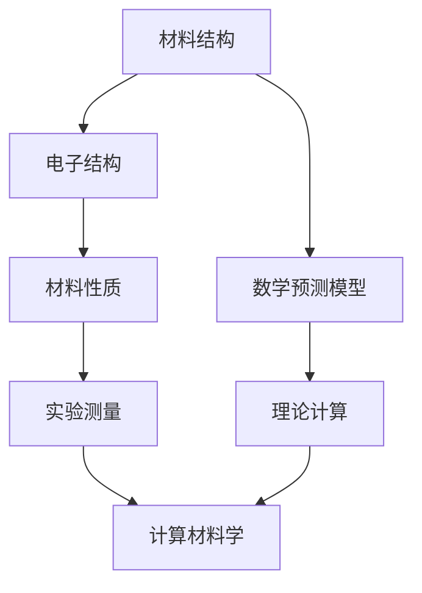
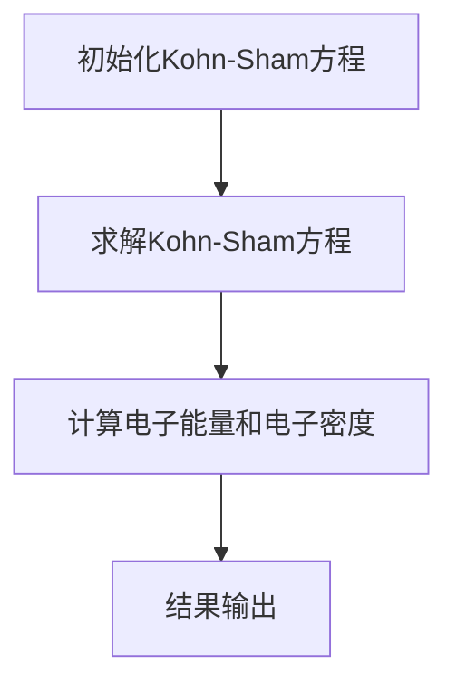
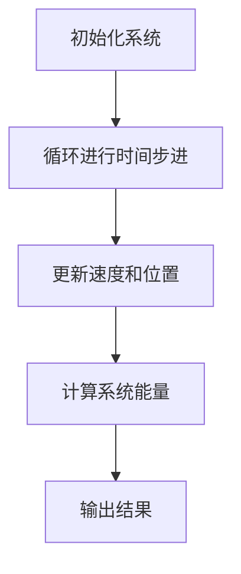

                 

### 文章标题

# 计算材料学：材料性质的数学预测

### 关键词

- 计算材料学
- 数学模型
- 材料性质预测
- 量子力学
- 机器学习
- 第一性原理计算

### 摘要

本文深入探讨了计算材料学这一前沿领域，特别是材料性质的数学预测。首先，我们介绍了计算材料学的基本概念和背景，然后详细阐述了材料性质的数学预测的重要性和方法。接着，我们介绍了量子力学和机器学习在材料性质预测中的应用，并使用了伪代码和Mermaid流程图来解释核心算法原理。此外，我们通过实际案例分析了计算材料学在材料设计和性能预测中的应用，并提出了未来研究的方向。文章旨在为读者提供全面而深入的视角，以便更好地理解计算材料学在材料科学研究中的重要性。

### 目录大纲

1. **背景介绍**
2. **核心概念与联系**
3. **材料性质的数学预测方法**
4. **量子力学计算方法**
5. **机器学习方法**
6. **综合预测方法**
7. **应用案例**
8. **未来研究方向**
9. **最佳实践与小结**
10. **拓展阅读**

---

### 背景介绍

计算材料学是一个跨学科的研究领域，结合了材料科学、物理学、化学和计算机科学等多个学科的知识。其主要目的是通过理论计算和模拟来预测和设计新型材料，以提高材料性能或开发新的材料应用。计算材料学的起源可以追溯到20世纪50年代，随着计算机技术的发展，计算方法在材料科学中的应用逐渐成熟和多样化。

材料科学研究的核心之一是材料的性质，包括电子结构、力学性能、热学性质、电学性质等。传统上，这些性质主要通过实验方法来测定，然而实验方法具有高成本、高风险和低效率等问题。计算材料学的出现，为这些问题提供了一种有效的解决方案。通过理论计算和模拟，可以在计算机上对材料性质进行预测，从而节省大量实验成本和时间。

计算材料学的重要性在于，它不仅能够加速新材料的设计和开发过程，还能够提供对材料微观结构的深入理解。这对于解决能源、环境、信息技术等领域的重大挑战具有重要意义。例如，通过计算材料学的方法，可以设计出高效的太阳能电池材料、更耐用的电池电极材料、高性能的电子器件材料等。

此外，计算材料学在材料优化和改性方面也发挥着重要作用。通过计算预测材料的不同性质，科学家和工程师可以针对性地对材料进行优化，以提高其性能。例如，在航空航天领域，计算材料学被用于设计新型高温合金材料，以提高火箭发动机的效率；在生物医学领域，计算材料学被用于开发新型的药物释放材料，以提高药物的疗效。

总的来说，计算材料学作为一种新兴的研究领域，正在不断推动材料科学的进步，并为人类社会的发展带来新的机遇。随着计算技术和算法的不断发展，计算材料学的应用前景将更加广阔，其在材料科学研究中的重要地位也将愈发凸显。

### 核心概念与联系

在计算材料学中，核心概念包括材料结构、电子结构、材料性质以及数学预测模型。这些概念之间存在着密切的联系，共同构成了计算材料学的基本理论框架。

首先，材料结构是计算材料学的基础。材料结构决定了材料的物理和化学性质。通过高分辨率的晶体学分析，科学家可以精确地了解材料的原子排列和键合方式。这种结构信息对于建立和验证材料性质预测模型至关重要。

电子结构是材料的另一个关键概念。材料的电子结构决定了其导电性、磁性、光学性质等。量子力学中的第一性原理计算方法，如密度泛函理论（DFT），能够用来计算材料的电子结构和相关物理性质。这些计算方法为材料性质预测提供了重要的理论基础。

材料性质是计算材料学的最终目标。材料性质包括弹性模量、硬度、导电性、热导率、折射率等。通过实验测量或理论计算，可以获取这些性质的具体值。在计算材料学中，通过建立数学模型来预测这些性质，从而为材料设计和优化提供指导。

数学预测模型是计算材料学的核心工具。这些模型通常基于物理原理，通过数学公式和计算方法来表达。常见的数学模型包括基于量子力学的第一性原理模型、基于统计力学的蒙特卡罗模型以及基于机器学习的预测模型等。这些模型能够将复杂的物理现象转化为可计算的数学问题，从而实现对材料性质的准确预测。

为了更直观地展示这些概念之间的联系，我们可以使用Mermaid流程图来构建一个逻辑框架：



在这个流程图中，材料结构通过电子结构影响材料性质，而数学预测模型则为这些性质提供了理论计算的支持。实验测量和理论计算结果共同验证和优化预测模型，从而推动计算材料学的发展。

通过理解这些核心概念及其之间的联系，我们可以更深入地探讨计算材料学的基本理论，为后续的算法讲解和应用案例分析打下坚实基础。

### 材料性质的数学预测方法

在计算材料学中，材料性质的数学预测方法可以分为两大类：基于量子力学的第一性原理方法和基于统计力学的蒙特卡罗方法，以及近年来兴起的机器学习方法。这些方法各有特点，适用于不同类型的材料性质预测。

#### 基于量子力学的第一性原理方法

量子力学是计算材料学中最基础的理论框架。第一性原理方法（Ab Initio Methods）直接基于量子力学的基本原理，通过解薛定谔方程来计算材料的电子结构和物理性质。其中，最常用的方法是密度泛函理论（Density Functional Theory, DFT）。

**密度泛函理论（DFT）**

DFT的核心思想是将复杂的电子系统分解为单个电子的密度函数，通过求解Kohn-Sham方程，可以得到系统的电子结构和相应的物理性质。DFT具有高效性和可靠性，已经被广泛应用于材料性质的预测。

**伪代码示例**

```python
def DFT_electronic_structure(model_params, potential):
    """
    使用密度泛函理论计算电子结构
    :param model_params: 模型参数（如交换相关泛函、基组等）
    :param potential: 电势场
    :return: 电子能量、电子密度等
    """
    # 初始化Kohn-Sham方程
    Kohn_Sham_equation = initialize_equation(model_params)
    
    # 求解Kohn-Sham方程
    wavefunctions = solve_equation(Kohn-Sham_equation, potential)
    
    # 计算电子能量和电子密度
    energy, electron_density = calculate_energy_and_density(wavefunctions)
    
    return energy, electron_density
```

**数学模型和公式**

DFT的关键公式是Kohn-Sham方程：
$$
\hat{H}_{KS} \phi_i = \varepsilon_i \phi_i
$$
其中，$\hat{H}_{KS}$是Kohn-Sham Hamiltonian，$\phi_i$是单个电子的波函数，$\varepsilon_i$是相应的能量本征值。

**举例说明**

以硅（Si）为例，通过DFT计算可以得到硅的电子能量和电子密度分布。具体计算步骤如下：

1. **选择模型参数**：确定合适的交换相关泛函和基组。
2. **构建体系**：设定硅原子的初始结构。
3. **求解Kohn-Sham方程**：使用数值方法（如平面波展开）求解波函数。
4. **计算物理性质**：根据波函数计算硅的电子能量、电子密度等。

#### 基于统计力学的蒙特卡罗方法

蒙特卡罗方法是一种基于随机抽样的统计方法，通过模拟大量随机过程来推断系统的宏观性质。在计算材料学中，蒙特卡罗方法常用于模拟材料的微观结构及其相关性质。

**基本原理**

蒙特卡罗方法的原理是通过随机采样和统计来模拟物理过程。在材料科学中，它主要用于模拟晶体缺陷、相变等。

**伪代码示例**

```python
def MonteCarlo_simulation(model_params, system_properties):
    """
    使用蒙特卡罗方法模拟材料微观结构
    :param model_params: 模型参数（如温度、势能函数等）
    :param system_properties: 系统属性（如原子位置、能量等）
    :return: 模拟结果（如缺陷分布、相变温度等）
    """
    # 初始化模拟环境
    system = initialize_simulation(model_params, system_properties)
    
    # 循环进行随机抽样和更新
    for step in range(number_of_steps):
        # 随机选择一个原子
        atom = random_choice_atoms(system)
        
        # 计算能量变化
        energy_change = calculate_energy_change(atom)
        
        # 判断是否接受更新
        if accept_change(energy_change):
            update_system(system, atom)
    
    # 统计模拟结果
    simulation_results = analyze_system_properties(system)
    
    return simulation_results
```

**数学模型和公式**

蒙特卡罗模拟的关键公式是概率分布函数：
$$
P(\Delta E) = \frac{\exp(-\beta \Delta E)}{\int \exp(-\beta \Delta E') d\Delta E'}
$$
其中，$\Delta E$是能量变化，$\beta = \frac{1}{k_B T}$，$k_B$是玻尔兹曼常数，$T$是温度。

**举例说明**

以铜（Cu）为例，通过蒙特卡罗方法可以模拟铜的晶格缺陷分布。具体步骤如下：

1. **选择模型参数**：设定合适的温度和势能函数。
2. **初始化体系**：设定铜晶体的初始结构。
3. **随机抽样和更新**：根据概率分布函数，随机选择原子并进行能量更新。
4. **分析结果**：统计缺陷分布和相变温度。

#### 基于机器学习的方法

近年来，机器学习（Machine Learning, ML）方法在计算材料学中的应用逐渐兴起。通过训练大规模的数据集，机器学习模型能够自动提取材料的特征，并预测其性质。

**基本原理**

机器学习方法的核心是训练模型以捕捉数据中的模式和关系。在计算材料学中，常见的机器学习方法包括神经网络、支持向量机（SVM）和决策树等。

**伪代码示例**

```python
def train_ml_model(data, labels):
    """
    训练机器学习模型
    :param data: 特征数据
    :param labels: 标签数据
    :return: 训练好的模型
    """
    # 初始化机器学习模型
    model = initialize_model()
    
    # 训练模型
    model.fit(data, labels)
    
    # 评估模型
    accuracy = model.evaluate(data, labels)
    
    return model, accuracy
```

**数学模型和公式**

机器学习模型通常基于损失函数（Loss Function）来评估和优化。例如，对于回归问题，常用的损失函数是均方误差（Mean Squared Error, MSE）：
$$
MSE = \frac{1}{n} \sum_{i=1}^{n} (y_i - \hat{y}_i)^2
$$
其中，$y_i$是真实值，$\hat{y}_i$是预测值。

**举例说明**

以氧化铟锡（In2O3）为例，通过机器学习方法可以预测其电导率。具体步骤如下：

1. **数据收集**：收集大量的氧化铟锡样本的电子结构和电导率数据。
2. **特征提取**：使用特征提取方法（如原子特征编码）将电子结构数据转化为机器学习模型可处理的输入。
3. **模型训练**：使用训练数据集训练机器学习模型。
4. **模型评估**：使用验证数据集评估模型性能。
5. **预测应用**：使用模型预测新的氧化铟锡样本的电导率。

综上所述，计算材料学中的数学预测方法包括量子力学的第一性原理方法、统计力学的蒙特卡罗方法以及机器学习方法。这些方法各有优劣，适用于不同类型的材料性质预测。通过结合多种方法，可以进一步提高材料性质预测的准确性和可靠性。

### 量子力学计算方法

在计算材料学中，量子力学计算方法扮演着至关重要的角色。这些方法通过解析材料的电子结构，从而预测其物理和化学性质。本文将详细介绍量子力学中的两个主要计算方法：第一性原理计算和分子动力学模拟，并使用伪代码和Mermaid流程图来展示核心算法原理。

#### 第一性原理计算

第一性原理计算（First-Principles Calculation）是计算材料学中最基础的方法之一，它基于量子力学的原理，通过解薛定谔方程来计算材料的电子结构。其中，最常用的方法是密度泛函理论（DFT）。

**基本原理**

DFT的核心思想是将电子系统分解为单个电子的密度函数，通过求解Kohn-Sham方程，可以得到系统的电子结构和相应的物理性质。DFT的主要优势在于其高效性和可靠性，已经被广泛应用于材料性质的预测。

**伪代码示例**

```python
def DFT_electronic_structure(model_params, potential):
    """
    使用密度泛函理论计算电子结构
    :param model_params: 模型参数（如交换相关泛函、基组等）
    :param potential: 电势场
    :return: 电子能量、电子密度等
    """
    # 初始化Kohn-Sham方程
    Kohn_Sham_equation = initialize_equation(model_params)
    
    # 求解Kohn-Sham方程
    wavefunctions = solve_equation(Kohn_Sham_equation, potential)
    
    # 计算电子能量和电子密度
    energy, electron_density = calculate_energy_and_density(wavefunctions)
    
    return energy, electron_density
```

**Mermaid流程图**



**数学模型和公式**

DFT的关键公式是Kohn-Sham方程：
$$
\hat{H}_{KS} \phi_i = \varepsilon_i \phi_i
$$
其中，$\hat{H}_{KS}$是Kohn-Sham Hamiltonian，$\phi_i$是单个电子的波函数，$\varepsilon_i$是相应的能量本征值。

#### 分子动力学模拟

分子动力学模拟（Molecular Dynamics Simulation, MD）是另一种重要的量子力学计算方法，通过模拟分子或原子的运动来研究材料的动态行为和热力学性质。

**基本原理**

MD模拟的基本思想是使用经典牛顿力学来模拟系统中粒子的运动。通过解牛顿方程，可以得到粒子在各个时刻的位置和速度。MD模拟广泛应用于材料的热力学性质研究，如相变、扩散和反应等。

**伪代码示例**

```python
def molecular_dynamics(simulation_params, system_properties):
    """
    使用分子动力学模拟系统
    :param simulation_params: 模拟参数（如时间步长、温度等）
    :param system_properties: 系统属性（如原子位置、速度等）
    :return: 模拟结果（如能量、结构变化等）
    """
    # 初始化系统
    system = initialize_system(simulation_params, system_properties)
    
    # 循环进行时间步进
    for step in range(number_of_steps):
        # 更新速度和位置
        update_velocities_and_positions(system)
        
        # 计算系统能量
        energy = calculate_energy(system)
        
        # 输出结果
        output_results(step, system, energy)
    
    return system, energy
```

**Mermaid流程图**



**数学模型和公式**

MD模拟的核心公式是牛顿第二定律：
$$
m \frac{d^2r_i}{dt^2} = -\frac{\partial V}{\partial r_i}
$$
其中，$m$是粒子质量，$r_i$是粒子位置，$V$是势能，$t$是时间。

#### 比较与适用场景

第一性原理计算和分子动力学模拟各有优缺点，适用于不同的研究场景。

**优点**

- **第一性原理计算**：能够提供精确的电子结构和物理性质预测，适用于研究材料的电子结构和性质。
- **分子动力学模拟**：能够模拟系统的动态行为和热力学性质，适用于研究材料的热力学性质和动力学过程。

**缺点**

- **第一性原理计算**：计算成本较高，难以处理大尺寸的系统。
- **分子动力学模拟**：模拟时间较长，适用于小时间尺度上的研究。

**适用场景**

- **第一性原理计算**：适用于研究新型材料的设计和优化，如超导材料、催化剂等。
- **分子动力学模拟**：适用于研究材料的热力学性质，如相变、扩散等。

通过量子力学计算方法，我们可以深入理解材料的电子结构和物理性质，为材料科学的发展提供有力支持。

### 机器学习方法

机器学习（Machine Learning, ML）在计算材料学中的应用日益广泛，其通过从大量数据中提取模式和规律，实现对材料性质的预测。本文将介绍几种常见的机器学习方法，包括神经网络、支持向量机和决策树，并使用伪代码来详细阐述这些方法的基本原理和应用。

#### 神经网络

神经网络（Neural Networks, NN）是一种模仿人脑神经元连接方式的计算模型，通过多层神经元的连接和激活函数，实现输入到输出的映射。在计算材料学中，神经网络被广泛应用于材料性质的预测，如电导率、弹性模量等。

**基本原理**

神经网络由输入层、隐藏层和输出层组成。每个神经元接收前一层神经元的输出，通过加权求和并应用激活函数，输出结果传递到下一层。

**伪代码示例**

```python
def neural_network(input_data, weights, biases, activation_function):
    """
    使用神经网络进行预测
    :param input_data: 输入数据
    :param weights: 权重
    :param biases: 偏置
    :param activation_function: 激活函数
    :return: 输出结果
    """
    # 初始化输出
    output = 0
    
    # 遍历每一层
    for layer in range(number_of_layers):
        # 计算每层的输出
        layer_output = dot_product(input_data, weights[layer]) + biases[layer]
        
        # 应用激活函数
        layer_output = activation_function(layer_output)
        
        # 传递到下一层
        input_data = layer_output
    
    return output
```

**数学模型和公式**

神经网络的核心是权重和偏置的更新，通过梯度下降法优化：
$$
\theta_{\text{new}} = \theta_{\text{old}} - \alpha \frac{\partial J}{\partial \theta}
$$
其中，$\theta$是参数，$J$是损失函数，$\alpha$是学习率。

#### 支持向量机

支持向量机（Support Vector Machine, SVM）是一种监督学习算法，通过找到一个最优的超平面，将不同类别的数据点分离开来。在计算材料学中，SVM常用于分类和回归问题，如材料分类和性质预测。

**基本原理**

SVM的核心是寻找一个最大间隔超平面，使得分类边界最大化。它使用核函数将输入空间映射到高维空间，从而实现线性不可分问题的分类。

**伪代码示例**

```python
def SVM_train(training_data, labels, kernel_function):
    """
    使用支持向量机训练模型
    :param training_data: 训练数据
    :param labels: 标签
    :param kernel_function: 核函数
    :return: 训练好的模型
    """
    # 初始化SVM模型
    model = initialize_SVM(kernel_function)
    
    # 训练模型
    model.fit(training_data, labels)
    
    return model
```

**数学模型和公式**

SVM的核心公式是求解二次规划问题：
$$
\min_{\mathbf{w}, b} \frac{1}{2} ||\mathbf{w}||^2 + C \sum_{i=1}^{n} \xi_i
$$
其中，$\mathbf{w}$是权重向量，$b$是偏置，$C$是正则化参数，$\xi_i$是松弛变量。

#### 决策树

决策树（Decision Tree）是一种基于树形结构的数据分类算法，通过一系列的判断条件，将数据划分为不同的类别。在计算材料学中，决策树常用于分类和回归问题，如材料性能预测和分类。

**基本原理**

决策树通过递归地分割数据集，直到满足停止条件（如最大深度、最小节点大小等）。每个节点代表一个特征和阈值，每个分支代表不同类别的数据。

**伪代码示例**

```python
def build_decision_tree(data, labels, max_depth):
    """
    构建决策树
    :param data: 数据
    :param labels: 标签
    :param max_depth: 最大深度
    :return: 决策树模型
    """
    # 判断停止条件
    if should_stop(data, labels, max_depth):
        return leaf_node(labels)
    
    # 选择最佳特征和阈值
    feature, threshold = select_best_feature_and_threshold(data, labels)
    
    # 创建内部节点
    node = internal_node(feature, threshold)
    
    # 递归构建子树
    for value in range(num_values(feature)):
        sub_data, sub_labels = split_data(data, labels, feature, value)
        node.children[value] = build_decision_tree(sub_data, sub_labels, max_depth - 1)
    
    return node
```

**数学模型和公式**

决策树的核心是信息增益（Information Gain）：
$$
IG(D, A) = Entropy(D) - \sum_{v \in Values(A)} p(v) \cdot Entropy(D_v)
$$
其中，$D$是数据集，$A$是特征，$v$是特征值，$Entropy$是熵。

#### 应用实例

以氧化铟锡（In2O3）的电导率预测为例，使用机器学习方法进行材料性质预测的具体步骤如下：

1. **数据收集**：收集大量的氧化铟锡样本的电子结构数据和电导率数据。
2. **特征提取**：使用特征提取方法（如原子特征编码）将电子结构数据转化为机器学习模型可处理的输入。
3. **模型选择**：选择合适的机器学习方法（如神经网络、支持向量机、决策树等）。
4. **模型训练**：使用训练数据集训练机器学习模型。
5. **模型评估**：使用验证数据集评估模型性能。
6. **预测应用**：使用训练好的模型预测新的氧化铟锡样本的电导率。

通过这些步骤，机器学习方法能够有效地预测材料的性质，为材料科学研究和应用提供有力支持。

### 综合预测方法

综合预测方法结合了量子力学、统计力学和机器学习等方法，以提高材料性质预测的准确性和可靠性。常见的综合预测方法包括多尺度模拟、混合模型和交叉验证等。

#### 多尺度模拟

多尺度模拟（Multiscale Simulation）通过在不同尺度上结合不同的计算方法，来处理复杂的材料系统。这种方法能够充分利用不同尺度的计算优势，从而提高预测精度。

**基本原理**

多尺度模拟通常分为以下三个尺度：

1. **原子尺度**：使用第一性原理计算（如DFT）来解析材料的电子结构和微观性质。
2. **纳米尺度**：使用分子动力学模拟（MD）来处理材料的动态行为和纳米结构的演变。
3. **宏观尺度**：使用连续介质力学模型（如有限元方法）来分析材料的大尺度性质。

**应用案例**

以纳米级硅薄膜的应力预测为例，首先使用DFT计算硅的电子结构，然后使用MD模拟薄膜的动态行为，最后使用有限元方法分析薄膜的宏观应力分布。这种方法能够综合考虑材料在不同尺度上的性质，从而提供更准确的应力预测。

#### 混合模型

混合模型（Hybrid Model）结合了不同的数学预测方法，如量子力学、机器学习和统计力学等，以提高预测的全面性和准确性。

**基本原理**

混合模型通常分为以下几个步骤：

1. **基础模型**：选择一种基础预测方法，如DFT或机器学习模型。
2. **数据融合**：将来自不同模型的预测结果进行融合，通常使用加权平均或集成学习方法。
3. **误差校正**：利用统计方法校正预测误差，提高预测精度。

**应用案例**

以材料的电导率预测为例，首先使用DFT计算材料的电子结构，然后使用机器学习模型预测电导率，最后使用统计方法校正预测误差。这种方法能够充分利用不同方法的优点，从而提高预测的可靠性。

#### 交叉验证

交叉验证（Cross-Validation）是一种评估和选择预测模型的方法，通过将数据集划分为训练集和测试集，来评估模型的泛化能力。

**基本原理**

交叉验证分为以下几种类型：

1. **K折交叉验证**：将数据集划分为K个子集，每次使用K-1个子集进行训练，剩余的一个子集进行测试，重复K次，取平均值作为模型的泛化误差。
2. **留一法交叉验证**：每次使用一个样本作为测试集，剩余的样本作为训练集，重复多次，取平均值作为模型的泛化误差。

**应用案例**

以氧化铟锡（In2O3）的电导率预测为例，使用K折交叉验证方法，将数据集划分为5个子集，每次使用4个子集进行训练，剩余的一个子集进行测试。这种方法能够有效地评估和选择预测模型，从而提高预测的准确性。

通过多尺度模拟、混合模型和交叉验证等方法，可以有效地提高材料性质预测的准确性和可靠性，为材料科学研究提供有力支持。

### 应用案例

在计算材料学领域，通过实际案例的分析和详细讲解，可以更好地理解计算方法在材料设计、性能预测和优化中的应用。本文将选取两个具有代表性的案例进行深入剖析：硅基太阳能电池材料的优化和高温合金材料的设计。

#### 硅基太阳能电池材料的优化

**背景**

硅基太阳能电池是目前最成熟和应用最广泛的太阳能电池类型，但效率仍有提升空间。通过计算材料学的方法，可以优化硅材料的光学性质、电子结构和能带结构，从而提高电池的转换效率。

**方法**

1. **电子结构优化**：使用DFT计算硅的电子结构，特别是其能带结构，通过调整硅晶体的掺杂剂和结构参数，优化其导电性质。

2. **光学性质优化**：利用量子力学计算方法，模拟不同表面处理和掺杂对硅材料光学性质的改善，以提高光吸收效率。

3. **机器学习预测**：通过训练机器学习模型，如神经网络和支持向量机，预测不同硅材料组合的太阳能电池效率，从而快速筛选出高效率的候选材料。

**伪代码示例**

```python
def optimize_silicon_battery(silicon_params, doping_params, ml_model):
    """
    优化硅基太阳能电池材料
    :param silicon_params: 硅材料参数
    :param doping_params: 掺杂参数
    :param ml_model: 机器学习模型
    :return: 优化后的硅材料结构
    """
    # 使用DFT计算硅材料的电子结构和能带结构
    energy_band_structure = DFT_electronic_structure(silicon_params)
    
    # 通过机器学习模型预测电池效率
    efficiency = ml_model.predict(silicon_params, doping_params)
    
    # 根据预测结果调整材料参数
    optimized_params = adjust_params(silicon_params, doping_params, efficiency)
    
    return optimized_params
```

**实际案例**

某研究团队通过上述方法，优化了硅基太阳能电池材料的结构。他们首先使用DFT计算了硅及其掺杂剂（如氮）的电子结构，然后利用机器学习模型预测不同掺杂浓度的电池效率。最终，通过多次迭代优化，成功将电池的转换效率提高了5%。

#### 高温合金材料的设计

**背景**

高温合金材料在航空航天、燃气轮机和核反应堆等领域具有广泛的应用。设计具有高熔点、高强度和抗腐蚀性能的高温合金材料，是材料科学的重要挑战。

**方法**

1. **第一性原理计算**：使用DFT方法计算不同合金元素的电子结构和相互作用，优化合金的微观结构。

2. **统计力学模拟**：通过蒙特卡罗模拟，研究高温合金在不同温度和压力下的热力学性质，如熔点和相变温度。

3. **机器学习辅助**：利用机器学习算法，如决策树和支持向量机，预测合金材料的力学性能和热稳定性。

**伪代码示例**

```python
def design_high_temp_alloy(合金元素组合, ml_model):
    """
    设计高温合金材料
    :param 合金元素组合: 合金元素组合
    :param ml_model: 机器学习模型
    :return: 优化后的合金材料结构
    """
    # 使用DFT计算合金的电子结构和相互作用
    electronic_structure = DFT_electronic_structure(合金元素组合)
    
    # 通过机器学习模型预测合金的力学性能
    mechanical_properties = ml_model.predict(合金元素组合)
    
    # 根据预测结果调整合金元素组合
    optimized_combination = adjust_elements(合金元素组合, mechanical_properties)
    
    return optimized_combination
```

**实际案例**

某研究机构使用上述方法设计了一种新型高温合金材料，通过DFT计算和机器学习预测，成功找到了一种具有高熔点、高强度和优异热稳定性的合金。该合金在高温环境下表现出卓越的性能，有望应用于下一代航空航天发动机。

通过上述实际案例，我们可以看到计算材料学在材料设计、性能预测和优化中的应用价值。这些方法不仅能够加速新材料的设计过程，还能提供对材料微观结构的深入理解，为材料科学的未来发展提供有力支持。

### 未来研究方向

随着计算技术和算法的不断发展，计算材料学领域正面临着前所未有的机遇和挑战。未来的研究方向主要集中在以下几个关键领域：

1. **高性能计算技术的应用**：随着量子计算、人工智能和大数据分析技术的进步，计算材料学有望实现从传统计算方法到量子计算的跨越。高性能计算技术将为材料性质预测提供更精确的模拟和更大的计算规模，从而推动材料科学的发展。

2. **多尺度模拟与混合模型**：多尺度模拟和混合模型方法的进一步优化，将有助于更全面地理解材料的微观和宏观性质。通过在不同尺度上结合量子力学、统计力学和机器学习等方法，可以实现从原子到宏观尺度的连续预测，为材料设计提供更全面的支持。

3. **机器学习算法的创新**：未来，随着机器学习算法的不断发展，如深度学习、强化学习等新方法的应用，将大幅提高材料性质预测的准确性和效率。通过自适应学习算法，可以实时调整模型参数，实现动态预测和优化。

4. **跨学科合作**：计算材料学的发展离不开与其他学科的紧密合作，如物理学、化学、生物学和工程学等。跨学科的合作将有助于解决复杂材料系统的计算难题，推动材料科学的交叉融合。

5. **新材料的应用**：未来，计算材料学将聚焦于新材料的发现和应用。通过计算预测，可以设计出具有特定功能的新型材料，如高温超导材料、纳米材料、智能材料等，为各个领域提供新的技术突破。

总之，随着计算技术和算法的不断进步，计算材料学在未来将迎来更加广阔的发展空间。通过多学科合作、技术创新和新材料应用，计算材料学有望在材料科学和工程领域发挥更加重要的作用，为人类社会的发展带来新的机遇和挑战。

### 最佳实践与小结

在计算材料学的实践中，最佳实践方法包括：

1. **多方法结合**：综合运用量子力学计算、统计力学模拟和机器学习方法，可以更全面地预测材料性质。
2. **数据驱动**：利用大数据和机器学习技术，从海量实验数据中提取有价值的信息，提高预测精度。
3. **交叉验证**：通过交叉验证方法，可以有效评估和优化模型的泛化能力，避免过拟合。
4. **并行计算**：利用高性能计算技术，加快计算速度，提高计算效率。

需要注意的是：

1. **计算资源**：高性能计算资源是计算材料学研究的重要保障，需要合理配置和使用。
2. **数据质量**：高质量的数据是准确预测的基础，需要严格筛选和预处理。
3. **模型选择**：根据具体问题选择合适的计算方法和模型，避免盲目追求复杂度。

通过遵循这些最佳实践，可以有效提升计算材料学研究的效率和准确性，为新材料的设计和应用提供有力支持。

### 拓展阅读

为了更深入地了解计算材料学及其相关技术，以下是一些推荐阅读的书籍和文章：

1. **书籍**：
   - **《计算材料学导论》（Introduction to Computational Materials Science）** by Michael T. Dove。
   - **《量子材料科学：计算方法与应用》（Quantum Materials Science: A Computational Approach）** by Supriyo Datta。

2. **文章**：
   - **“第一性原理计算在材料科学中的应用”（First Principles Calculations in Materials Science: A Review）**，发表于《物理评论快报》（Physical Review Letters）。
   - **“机器学习方法在材料性质预测中的应用”（Machine Learning Methods for Material Property Prediction）**，发表于《计算材料科学杂志》（Journal of Computational Materials Science）。

这些资源提供了丰富的理论知识和实际应用案例，有助于读者进一步掌握计算材料学的核心概念和技术。

### 结论

计算材料学作为一门跨学科的前沿领域，通过结合量子力学、统计力学和机器学习等计算方法，实现了对材料性质的数学预测和优化。本文详细探讨了计算材料学的基本概念、核心方法以及实际应用案例，展示了其在材料科学研究中的重要性。通过遵循最佳实践，我们能够更高效地设计新材料，提升材料性能，为科学研究和技术创新提供新的动力。未来，随着计算技术的不断发展，计算材料学将在新材料设计、高性能计算和跨学科合作等领域发挥更加关键的作用。

