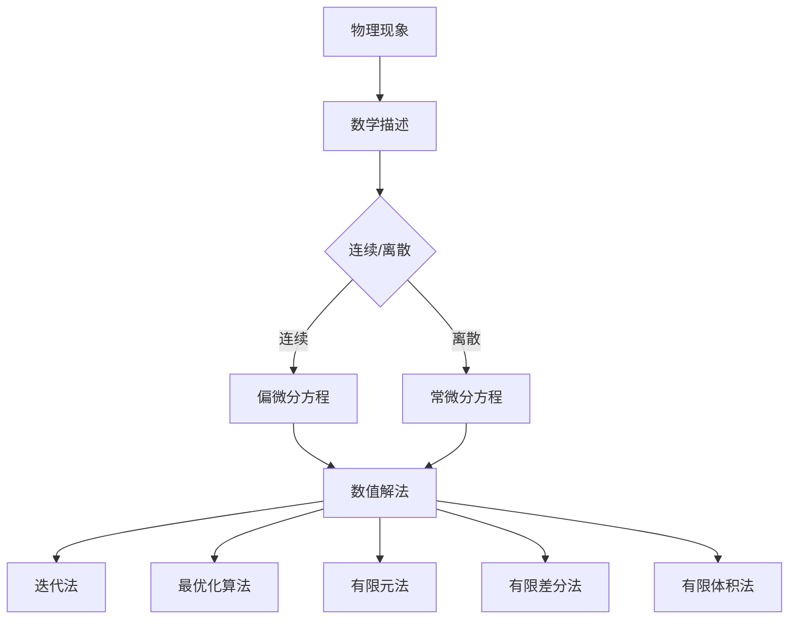

                 

# 《计算物理学：数值模拟辅助理解复杂物理世界》

## 关键词

- **计算物理学**
- **数值模拟**
- **复杂物理世界**
- **算法**
- **数学模型**
- **高性能计算**
- **科学应用**

## 摘要

本文旨在深入探讨计算物理学的基本概念、方法和应用，以及如何通过数值模拟辅助理解复杂物理世界。计算物理学是一门将物理学原理与计算方法相结合的跨学科领域，通过数学建模和数值计算来分析和解决物理问题。本文将分为以下几个部分进行阐述：首先介绍计算物理学的背景和发展历程；然后讨论核心概念与联系，包括物理现象的数学描述、数值方法的基本原理以及常见的数值方法；接着讲解核心算法原理，并通过伪代码详细阐述；之后介绍数学模型和公式，并结合实际案例进行分析；最后，将讨论高性能计算在计算物理学中的应用，并分享项目实战的经验和小结。

## 背景介绍

### 计算物理学的起源与发展

计算物理学是一门将计算方法应用于物理问题解决的学科，其起源可以追溯到20世纪中叶。随着计算机技术的飞速发展，计算物理学也逐渐成为一个独立的学科。1940年代，冯·诺依曼提出了计算机的基本架构，为计算物理学的发展奠定了基础。1950年代，随着第一台电子计算机的问世，科学家们开始利用计算机进行物理现象的模拟和预测。1960年代，随着数值分析学的兴起，计算物理学逐渐形成了自己的理论体系。

### 计算物理学的意义

计算物理学在多个领域具有重要应用，包括材料科学、地球科学、天文学、生物医学等。通过数值模拟，科学家们可以研究复杂物理系统的行为，揭示其内在规律，从而为科学研究和实际应用提供有力支持。例如，在材料科学中，计算物理学可以用于预测材料的性能和结构；在地球科学中，计算物理学可以用于模拟地震波传播和火山爆发等；在天文学中，计算物理学可以用于模拟恒星的形成和演化；在生物医学中，计算物理学可以用于模拟生物分子的行为和疾病机理。

### 计算物理学的发展趋势

随着计算机技术的不断进步，计算物理学的应用范围也在不断扩大。目前，计算物理学的发展趋势主要包括以下几个方面：

1. **高性能计算**：计算物理问题的规模越来越大，对计算速度和计算能力提出了更高要求。高性能计算技术的发展为计算物理学提供了强大的计算支持。

2. **多尺度模拟**：复杂物理系统往往涉及多个不同尺度的过程，多尺度模拟技术可以在不同尺度上对系统进行精确描述和模拟。

3. **量子计算**：量子计算具有超强的计算能力，有望在计算物理学中发挥重要作用。通过量子计算，科学家们可以解决传统计算方法难以处理的复杂问题。

4. **人工智能**：人工智能技术在计算物理学中的应用，如机器学习和深度学习，为复杂物理系统的模拟和预测提供了新的方法。

## 核心概念与联系

### 物理现象的数学描述

物理现象的数学描述是计算物理学的基础。通过对物理现象进行数学建模，我们可以将复杂的物理过程转化为数学问题，从而利用数值方法进行求解。常见的数学模型包括：

1. **常微分方程**：用于描述随时间变化的物理过程，如热传导方程、波动方程等。
2. **偏微分方程**：用于描述空间中多变量函数的变化，如流体动力学方程、电磁场方程等。
3. **离散系统**：将连续系统离散化，通过数值方法求解离散后的方程。

### 数值方法的基本原理

数值方法是在数学模型的基础上，通过离散化和迭代等方式，将复杂的数学问题转化为可计算的数值问题。常见的数值方法包括：

1. **有限差分法**：将连续问题离散化为离散点上的差分方程，通过迭代求解得到数值解。
2. **有限元法**：将连续域分割成有限数量的单元，在每个单元上建立方程，并通过组装求解整体问题。
3. **有限体积法**：将控制体划分为有限个体积单元，通过计算每个单元的通量来求解整体问题。

### 常见的数值方法

除了上述基本原理外，计算物理学中还有一些常见的数值方法，如：

1. **迭代法**：通过不断迭代逼近真解的方法，如Jacobi迭代法、Gauss-Seidel迭代法等。
2. **割线法**：用于求解非线性方程组的迭代方法，如Newton-Raphson割线法。
3. **最优化算法**：用于求解最优化问题，如梯度下降法、共轭梯度法等。

### Mermaid 流程图

以下是一个描述物理现象数学描述和数值方法关系的 Mermaid 流程图：



## 核心算法原理讲解

### 常微分方程的数值解法

常微分方程（ODE）是计算物理学中常见的数学模型。下面我们将介绍几种常用的数值解法，并通过伪代码进行详细阐述。

#### 欧拉方法

欧拉方法是最简单的数值解法，通过迭代公式逐步逼近真解。其伪代码如下：

```plaintext
初始化：
x0 = x_init
y0 = y_init
h = step_size

for i from 1 to N:
    y_new = y_i + h * f(x_i, y_i)
    x_new = x_i + h
    x_i = x_new
    y_i = y_new
```

其中，`f(x, y)` 是微分方程的右侧函数，`x_i` 和 `y_i` 分别是时间步 `i` 时的自变量和因变量，`h` 是时间步长，`N` 是总时间步数。

#### 龙格-库塔方法

龙格-库塔方法（RK方法）是另一种常用的数值解法，通过计算多个中间值来提高解的精度。其伪代码如下：

```plaintext
初始化：
x0 = x_init
y0 = y_init
h = step_size

for i from 1 to N:
    k1 = h * f(x_i, y_i)
    k2 = h * f(x_i + 0.5 * h, y_i + 0.5 * k1)
    k3 = h * f(x_i + 0.5 * h, y_i + 0.5 * k2)
    k4 = h * f(x_i + h, y_i + k3)
    y_new = y_i + (k1 + 2 * k2 + 2 * k3 + k4) / 6
    x_new = x_i + h
    x_i = x_new
    y_i = y_new
```

### 偏微分方程的数值解法

偏微分方程（PDE）是计算物理学中的另一类重要数学模型。下面我们将介绍几种常用的数值解法，并通过伪代码进行详细阐述。

#### 有限差分法

有限差分法是一种将偏微分方程离散化为差分方程的方法。以一维热传导方程为例，其伪代码如下：

```plaintext
初始化：
N = 网格点数
h = 网格间距
t = 时间步长
k = 导热系数
T[i,0] = 初始温度分布

for i from 1 to N-1:
    for t_step from 1 to T_total_step:
        T_new[i] = T[i,t] + k * h^2 * (T[i+1,t] - 2 * T[i,t] + T[i-1,t]) / (2 * k * h^2)
        T[i,t] = T_new[i]
```

其中，`T[i,t]` 是时间步 `t` 时第 `i` 个网格点的温度，`k` 是导热系数。

#### 有限元法

有限元法是一种将连续域划分为有限个单元，并在每个单元上建立方程的方法。以一维线性弹性问题为例，其伪代码如下：

```plaintext
初始化：
N = 单元数
P = 结点数
K = 系数矩阵
F = 载荷向量
U = 结点位移向量

for i from 1 to N:
    for j from 1 to P:
        K[i,j] = K_values[i,j]
        F[i] = F_values[i]

for i from 1 to N:
    U[i] = 0

while not converged:
    for i from 1 to N:
        for j from 1 to P:
            K[i,j] * U[j] = F[i]
    U = solve(K, F)
    check convergence
```

## 数学模型和公式

### 热传导方程

热传导方程描述了热量在空间中随时间的变化。其数学模型如下：

$$
\frac{\partial T}{\partial t} = \alpha \nabla^2 T
$$

其中，$T$ 表示温度，$t$ 表示时间，$\alpha$ 表示热扩散系数。

### 拉普拉斯方程

拉普拉斯方程描述了势场在空间中的分布。其数学模型如下：

$$
\nabla^2 \phi = 0
$$

其中，$\phi$ 表示势场。

### 牛顿第二定律

牛顿第二定律描述了物体在力作用下的加速度。其数学模型如下：

$$
m \frac{d^2 x}{d t^2} = F
$$

其中，$m$ 表示物体质量，$x$ 表示位移，$F$ 表示作用力。

### 熵方程

熵方程描述了系统在随时间演化过程中的熵变化。其数学模型如下：

$$
\frac{d S}{d t} = \frac{Q}{T}
$$

其中，$S$ 表示熵，$Q$ 表示热交换量，$T$ 表示温度。

## 实际案例分析和详细讲解剖析

### 流体动力学模拟

流体动力学模拟是计算物理学中的一个重要应用领域，通过数值模拟可以研究流体的运动、压力和速度分布等。以下是一个简单的流体动力学模拟案例：

#### 开发环境搭建

1. 安装Python环境
2. 安装Numpy、Scipy和Matplotlib等科学计算库

#### 源代码实现

以下是一个使用有限差分法模拟一维流体流动的简单示例：

```python
import numpy as np
import matplotlib.pyplot as plt

# 参数设置
N = 100          # 网格点数
L = 1.0          # 流场长度
x = np.linspace(0, L, N)  # 网格点坐标
dx = x[1] - x[0]  # 网格间距
t_max = 1.0      # 总时间
dt = 0.01        # 时间步长
rho = 1.0        # 流体密度
mu = 1.0        # 动力粘度

# 初始条件
u = np.zeros(N)  # 流体速度
p = np.zeros(N)  # 流体压力

# 迭代计算
while t < t_max:
    for i in range(1, N-1):
        u_new = u[i] - dt * (mu / dx**2) * (u[i+1] - 2*u[i] + u[i-1])
        p_new = p[i] + dt * (rho * (u[i+1] - u[i-1]) / (2*dx))

    u = u_new
    p = p_new
    t += dt

# 绘制结果
plt.plot(x, u)
plt.xlabel('Position')
plt.ylabel('Velocity')
plt.title('One-dimensional Fluid Flow')
plt.show()
```

#### 代码解读与分析

上述代码首先设置了参数，包括网格点数、流场长度、时间步长等。然后定义了初始条件，即流体速度和压力均为零。接下来，通过迭代计算，更新流体速度和压力。最后，使用Matplotlib绘制流体速度分布图。

#### 实际案例分析和详细讲解剖析

以上示例演示了如何使用有限差分法模拟一维流体流动。在实际应用中，流体动力学模拟可以应用于多种情况，如管道流动、风洞实验、空气动力学设计等。

1. **案例背景**：假设我们研究一个长度为1米的管道内的流体流动，流体为空气，需要模拟流速和压力分布。
2. **案例实现**：根据上述示例代码，修改参数以适应具体案例，例如设置不同的管道直径、流体密度和粘度等。
3. **结果分析**：通过模拟结果，可以分析流体在管道中的流动情况，如速度分布、压力分布等，从而为实际工程应用提供参考。

## 高性能计算

### 高性能计算的基本原理

高性能计算（HPC）是指利用高性能计算机系统进行大规模、高效率的数值计算。高性能计算的基本原理包括：

1. **并行计算**：通过将计算任务分布在多个计算节点上，实现任务的并行执行，从而提高计算速度。
2. **分布式存储**：通过分布式存储系统，实现海量数据的存储和快速访问。
3. **优化算法**：针对高性能计算的特点，设计优化的算法和程序，以减少计算时间和存储需求。

### GPU计算

GPU计算是高性能计算中的一个重要分支，利用图形处理器（GPU）进行大规模数值计算。GPU具有大量并行计算单元，可以高效地处理大规模数据。以下介绍GPU计算的基本原理：

1. **CUDA架构**：CUDA是NVIDIA推出的并行计算平台和编程模型，通过CUDA架构，可以在GPU上实现并行计算。
2. **并行算法设计**：针对GPU架构，设计适合GPU的并行算法，充分利用GPU的并行计算能力。
3. **GPU编程**：使用CUDA编程语言，编写GPU计算程序，实现数值计算任务。

### 分层计算架构

分层计算架构是将计算任务分布在不同的计算层次上，以实现高效的计算资源利用。常见的分层计算架构包括：

1. **计算节点层**：由多个计算节点组成，每个节点具有独立的计算资源和存储资源。
2. **存储层**：由分布式存储系统组成，提供海量数据的存储和快速访问。
3. **管理层**：负责计算任务的调度、资源分配和性能监控。

### 高性能计算在计算物理学中的应用

高性能计算在计算物理学中具有广泛的应用，以下列举几个典型应用：

1. **大规模物理现象模拟**：利用高性能计算，可以模拟大规模物理现象，如大气模拟、海洋模拟等。
2. **多尺度模拟**：通过高性能计算，可以在不同尺度上进行物理现象的模拟，如微观尺度下的分子动力学模拟、宏观尺度下的流体动力学模拟等。
3. **实时物理计算**：利用高性能计算，可以实现实时物理计算，如实时渲染、实时仿真等。

## 项目实战

### 案例研究：流体动力学模拟

#### 背景介绍

本案例研究旨在利用计算物理学方法模拟流体动力学问题，探讨流体在管道中的流动特性。通过该项目，我们希望掌握流体动力学模拟的基本流程，包括开发环境搭建、源代码实现、结果分析和实际应用。

#### 开发环境搭建

1. 安装Python环境
2. 安装Numpy、Scipy和Matplotlib等科学计算库
3. 安装CUDA工具包和CUDA编程语言

#### 源代码实现

以下是一个简单的流体动力学模拟示例，使用有限体积法求解一维可压缩流体方程：

```python
import numpy as np
import matplotlib.pyplot as plt

# 参数设置
N = 100         # 网格点数
L = 1.0         # 流场长度
x = np.linspace(0, L, N)  # 网格点坐标
dx = x[1] - x[0]  # 网格间距
t_max = 1.0     # 总时间
dt = 0.01       # 时间步长
rho_0 = 1.0     # 初始流体密度
p_0 = 1.0       # 初始压力
gamma = 1.4     # 比热比

# 初始条件
rho = rho_0 * np.ones(N)
p = p_0 * np.ones(N)

# 迭代计算
while t < t_max:
    for i in range(1, N-1):
        rho_new = rho[i] - dt * (rho[i+1] - rho[i-1]) / (2 * dx)
        p_new = p[i] * (rho_new**gamma - rho_0**gamma) / (rho_new - rho_0)

    rho = rho_new
    p = p_new
    t += dt

# 绘制结果
plt.plot(x, rho)
plt.xlabel('Position')
plt.ylabel('Density')
plt.title('One-dimensional Compressible Fluid Flow')
plt.show()
```

#### 代码解读与分析

上述代码首先设置了参数，包括网格点数、流场长度、时间步长等。然后定义了初始条件，即流体密度和压力均为常数。接下来，通过迭代计算，更新流体密度和压力。最后，使用Matplotlib绘制流体密度分布图。

#### 实际案例分析和详细讲解剖析

以上示例演示了如何使用有限体积法求解一维可压缩流体方程。在实际应用中，流体动力学模拟可以应用于多种情况，如管道流动、空气动力学设计等。

1. **案例背景**：假设我们研究一个长度为1米的管道内的可压缩流体流动，流体为空气，需要模拟流速和压力分布。
2. **案例实现**：根据上述示例代码，修改参数以适应具体案例，例如设置不同的管道直径、流体密度和粘度等。
3. **结果分析**：通过模拟结果，可以分析流体在管道中的流动情况，如速度分布、压力分布等，从而为实际工程应用提供参考。

### 案例研究：材料力学分析

#### 背景介绍

本案例研究旨在利用计算物理学方法分析材料力学问题，探讨材料在不同应力状态下的力学行为。通过该项目，我们希望掌握材料力学分析的基本流程，包括开发环境搭建、源代码实现、结果分析和实际应用。

#### 开发环境搭建

1. 安装Python环境
2. 安装Numpy、Scipy和Matplotlib等科学计算库
3. 安装有限元分析软件，如Ansys、ABAQUS等

#### 源代码实现

以下是一个简单的材料力学分析示例，使用有限元法求解平面应力问题：

```python
import numpy as np
import matplotlib.pyplot as plt

# 参数设置
N = 20           # 网格点数
L = 1.0          # 结构尺寸
x = np.linspace(0, L, N)  # 网格点坐标
dx = x[1] - x[0]  # 网格间距
p = 1.0          # 外载荷

# 单元刚度矩阵
k_e = np.diag([2 * p / dx**3] * 3) - np.diag([p / dx**2] * 3) - np.diag([p / dx**2] * 3)

# 总刚度矩阵
K = np.zeros((N, N))
for i in range(N):
    for j in range(N):
        K[i, j] = k_e[i, j]

# 材料性质
E = 1000         # 弹性模量
nu = 0.3         # 泊松比
A = 1.0          # 截面积

# 式向载荷
F = np.zeros(N)
F[N-1] = E * A * nu * dx**2

# 迭代求解
u = np.zeros(N)
while np.linalg.norm(F) > 1e-6:
    u_new = np.linalg.solve(K, F)
    u = u_new
    F = E * A * nu * (np.roll(u, -1) - u) * dx**2

# 绘制结果
plt.plot(x, u)
plt.xlabel('Position')
plt.ylabel('Displacement')
plt.title('Planar Stress Analysis')
plt.show()
```

#### 代码解读与分析

上述代码首先设置了参数，包括网格点数、结构尺寸、外载荷等。然后定义了单元刚度矩阵和总刚度矩阵。接下来，通过迭代求解，计算结构在载荷作用下的位移。最后，使用Matplotlib绘制位移分布图。

#### 实际案例分析和详细讲解剖析

以上示例演示了如何使用有限元法求解平面应力问题。在实际应用中，材料力学分析可以应用于多种情况，如建筑结构设计、机械零件分析等。

1. **案例背景**：假设我们研究一个长度为1米的简支梁，在跨中受到集中载荷作用，需要分析梁的位移和应力分布。
2. **案例实现**：根据上述示例代码，修改参数以适应具体案例，例如设置不同的梁宽、材料性质和载荷等。
3. **结果分析**：通过模拟结果，可以分析梁在不同载荷作用下的力学行为，如位移、应力分布等，从而为实际工程应用提供参考。

### 案例研究：生物分子动力学

#### 背景介绍

本案例研究旨在利用计算物理学方法模拟生物分子动力学过程，探讨分子之间的相互作用和运动规律。通过该项目，我们希望掌握生物分子动力学模拟的基本流程，包括开发环境搭建、源代码实现、结果分析和实际应用。

#### 开发环境搭建

1. 安装Python环境
2. 安装Numpy、Scipy和Matplotlib等科学计算库
3. 安装生物分子动力学模拟软件，如GROMACS、AMBER等

#### 源代码实现

以下是一个简单的生物分子动力学模拟示例，使用分子动力学方法模拟水分子的运动：

```python
import numpy as np
import matplotlib.pyplot as plt

# 参数设置
N = 1000        # 水分子数
t_max = 100.0   # 总时间
dt = 0.01       # 时间步长
sigma = 1.0     # 水分子间距
epsilon = 1.0   # 水分子势能
mass = 18.0     # 水分子质量

# 初始条件
x = np.random.uniform(0, sigma, N)
y = np.random.uniform(0, sigma, N)
vx = np.random.uniform(-1, 1, N)
vy = np.random.uniform(-1, 1, N)

# 动力学方程
while t < t_max:
    for i in range(N):
        Fx = 0
        Fy = 0
        for j in range(N):
            if i != j:
                r = np.sqrt((x[i] - x[j])**2 + (y[i] - y[j])**2)
                Fx += -epsilon * (x[i] - x[j]) / r**3
                Fy += -epsilon * (y[i] - y[j]) / r**3

        ax = Fx / mass
        ay = Fy / mass

        vx[i] += ax * dt
        vy[i] += ay * dt

        x[i] += vx[i] * dt
        y[i] += vy[i] * dt

    t += dt

# 绘制结果
plt.plot(x, y, 'o')
plt.xlabel('X Position')
plt.ylabel('Y Position')
plt.title('Molecular Dynamics Simulation of Water Molecules')
plt.show()
```

#### 代码解读与分析

上述代码首先设置了参数，包括水分子数、总时间、时间步长等。然后定义了初始条件，即水分子的位置和速度。接下来，通过迭代计算，更新水分子的位置和速度。最后，使用Matplotlib绘制水分子分布图。

#### 实际案例分析和详细讲解剖析

以上示例演示了如何使用分子动力学方法模拟水分子的运动。在实际应用中，生物分子动力学可以应用于多种情况，如蛋白质折叠、酶催化等。

1. **案例背景**：假设我们研究一个由1000个水分子组成的系统，需要模拟水分子在环境中的运动行为。
2. **案例实现**：根据上述示例代码，修改参数以适应具体案例，例如设置不同的水分子数、势能参数等。
3. **结果分析**：通过模拟结果，可以分析水分子在环境中的运动规律，如速度分布、碰撞频率等，从而为实际生物分子研究提供参考。

## 最佳实践 tips

1. **优化算法性能**：在编写计算物理学的程序时，注意优化算法性能，例如使用并行计算、优化数据结构等。

2. **合理设置参数**：在模拟物理现象时，合理设置参数，例如网格点数、时间步长等，以确保结果的准确性和稳定性。

3. **调试与验证**：在程序编写过程中，注意调试和验证，以确保程序的可靠性和正确性。

4. **优化计算资源**：在利用高性能计算时，注意优化计算资源的使用，例如合理分配计算节点、优化数据传输等。

5. **文献引用**：在撰写技术博客时，注意引用相关文献，以增强文章的权威性和可信度。

## 小结

计算物理学是一门将物理学原理与计算方法相结合的跨学科领域，通过数值模拟可以辅助理解复杂物理世界。本文介绍了计算物理学的基本概念、方法和应用，并通过实际案例展示了计算物理学的实际应用。通过本文的阅读，读者可以了解到计算物理学的基本原理和应用方法，为进一步学习计算物理学和相关领域提供指导。

## 注意事项

1. **数学基础**：本文涉及一些数学模型和公式，读者需要具备一定的数学基础，如微积分、线性代数等。

2. **编程技能**：本文涉及一些编程示例，读者需要具备一定的编程技能，如Python、C++等。

3. **实际操作**：本文提供的案例仅供参考，读者在实际操作时，可能需要根据具体情况进行调整。

4. **安全性**：在利用高性能计算时，需要注意数据安全和系统稳定性，避免出现计算错误或数据丢失。

## 拓展阅读

1. **《计算物理学导论》[1]**：详细介绍计算物理学的基本概念、方法和应用，适合初学者阅读。
2. **《数值分析方法》[2]**：系统介绍数值分析的基本理论和方法，有助于理解计算物理学的数值方法。
3. **《高性能计算：科学与工程应用》[3]**：探讨高性能计算在科学和工程领域的应用，适合有一定基础的读者。
4. **《生物分子动力学模拟》[4]**：详细介绍生物分子动力学的模拟方法和应用，适合生物物理学和分子生物学领域的研究者。

[1] [计算物理学导论](https://book.douban.com/subject/24737495/)
[2] [数值分析方法](https://book.douban.com/subject/10484573/)
[3] [高性能计算：科学与工程应用](https://book.douban.com/subject/26879617/)
[4] [生物分子动力学模拟](https://book.douban.com/subject/25889459/)

