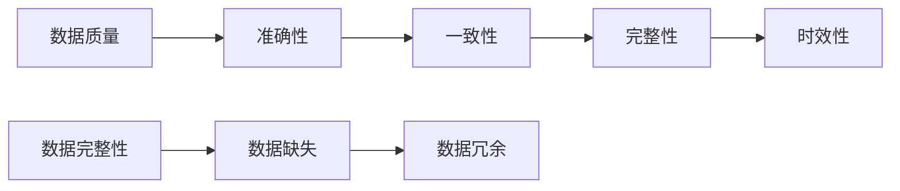
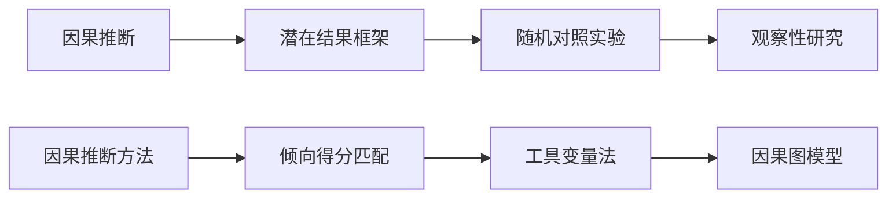
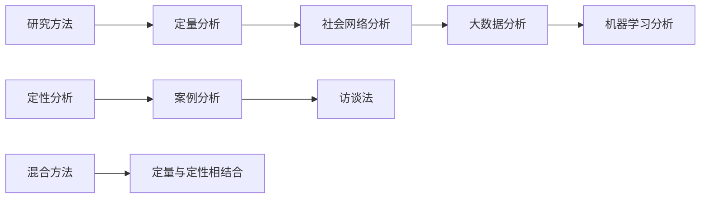
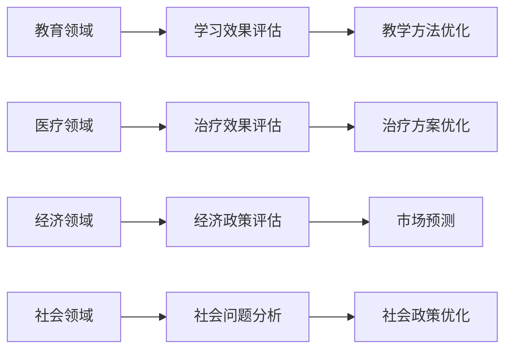

                 

### 文章标题

《计算社会科学的兴起：数据驱动理解人类社会与世界》

### 文章关键词

计算社会科学，数据驱动，社会网络分析，大数据，人类行为分析，因果推断，机器学习，人工智能，算法歧视，数据隐私，伦理问题，新兴技术，发展趋势

### 文章摘要

随着大数据和人工智能技术的快速发展，计算社会科学逐渐兴起，成为理解人类社会和世界的新工具。本文将深入探讨计算社会科学的背景、核心概念、研究方法、应用实例以及面临的伦理问题，并展望其未来发展趋势。通过数据驱动的视角，计算社会科学为社会科学研究提供了全新的方法和视角，有助于更准确地理解和预测人类行为和社会现象。

## 第1章 引言：计算社会科学的兴起背景与意义

### 1.1 计算社会科学的定义与范畴

计算社会科学（Computational Social Science, CSS）是社会科学与计算技术的交叉领域，它利用计算技术来分析和理解社会现象。计算社会科学涵盖了多个学科，包括社会学、心理学、政治学、经济学等，通过引入计算机科学、数据科学、机器学习等工具，对大规模社会数据进行定量分析，从而揭示社会规律和人类行为模式。

### 1.2 数据驱动理解的必要性

在传统的社会科学研究中，研究者往往依赖于理论框架和定性分析，这种方法虽然深刻，但在处理大规模数据和复杂社会现象时显得力不从心。而数据驱动的理解方法，通过收集、分析和解释大量数据，能够提供更加客观和精确的社会科学洞察。随着互联网和社交媒体的普及，人类产生了海量的数据，这些数据为计算社会科学的研究提供了丰富的素材。

### 1.3 计算社会科学的发展历程

计算社会科学的发展可以追溯到20世纪末，随着计算机技术和互联网的兴起，数据收集和分析手段得到了极大的改进。早期的研究主要集中在网络分析和人口统计数据上，而随着大数据和人工智能技术的进步，计算社会科学的应用领域和深度都得到了极大的扩展。

### 1.4 计算社会科学的核心优势

计算社会科学的核心优势在于其能够处理大规模、多维度的数据，揭示复杂的社会现象和人类行为模式。此外，计算社会科学的方法可以提供客观、量化的研究结论，有助于政策制定和社会治理。

## 第2章 计算社会科学的核心概念

### 2.1 社会网络分析

#### 2.1.1 社会网络的基本概念

社会网络分析（Social Network Analysis, SNA）是计算社会科学中的重要组成部分，它通过研究个体之间的社会联系来揭示社会结构。社会网络的基本概念包括节点（个体）、边（关系）和子图（群体）。

#### 2.1.2 社会网络分析的主要方法

社会网络分析的方法包括度数中心性、接近中心性、中间中心性和紧密中心性等。这些方法用于衡量个体在社会网络中的重要性。

#### 2.1.3 社会网络分析的Mermaid流程图


#### 社会网络分析的原理与联系

社会网络分析通过研究节点和边之间的关系，可以揭示社会结构中的关键角色和联系。以下是一个Mermaid流程图，展示了社会网络分析的基本原理和联系：


#### 社会网络分析的伪代码

```python
# 初始化节点列表
nodes = ["A", "B", "C", "D"]

# 初始化边列表
edges = [["A", "B"], ["B", "C"], ["C", "D"], ["D", "A"]]

# 计算度数中心性
degree_centrality = {}
for node in nodes:
    degree_centrality[node] = len([edge for edge in edges if node in edge])

# 输出度数中心性
print(degree_centrality)
```

### 2.2 大数据与人类行为分析

#### 2.2.1 大数据的基本特征

大数据（Big Data）具有“4V”特征，即大量（Volume）、多样（Variety）、高速（Velocity）和价值（Value）。

#### 2.2.2 人类行为数据收集与分析方法

人类行为数据的收集方法包括调查问卷、社交媒体数据抓取、传感器数据收集等。分析方法包括数据预处理、特征提取和机器学习模型训练。

#### 2.2.3 大数据与社会科学的联系

大数据为社会科学研究提供了丰富的数据资源，使得研究者能够更深入地了解人类行为和社会现象。


### 2.3 计算社会科学与数据科学的关系

计算社会科学与数据科学密切相关，数据科学为计算社会科学提供了数据收集、处理和分析的方法和工具。以下是一个Mermaid流程图，展示了两者之间的关系：


### 2.4 计算社会科学中的数据质量与数据完整性

数据质量是计算社会科学研究的基础，包括数据的准确性、一致性、完整性和时效性。数据完整性则是指数据是否包含了所有必要的信息。以下是一个Mermaid流程图，展示了数据质量与数据完整性的关系：



### 2.5 计算社会科学中的因果推断

因果推断（Causal Inference）是计算社会科学中的重要方法，用于确定变量之间的因果关系。以下是一个Mermaid流程图，展示了因果推断的基本概念和方法：



### 2.6 计算社会科学中的伦理问题

计算社会科学中的伦理问题包括数据隐私、算法歧视和伦理决策等。以下是一个Mermaid流程图，展示了计算社会科学中的伦理问题：


### 2.7 计算社会科学的研究方法与应用实例

计算社会科学的研究方法包括定量分析、定性分析和混合方法。以下是一个Mermaid流程图，展示了计算社会科学的研究方法与应用实例：



## 第3章 数据驱动的社会科学研究方法

### 3.1 数据挖掘与机器学习基础

#### 3.1.1 数据挖掘的基本概念

数据挖掘（Data Mining）是指从大量数据中提取有价值信息的过程。数据挖掘的主要任务包括分类、聚类、关联规则挖掘和异常检测等。

#### 3.1.2 机器学习的基本算法

机器学习（Machine Learning）是指计算机系统通过学习数据来获取知识并做出预测或决策的过程。常见的机器学习算法包括线性回归、逻辑回归、决策树、随机森林和支持向量机等。

#### 3.1.3 数据挖掘与机器学习的Mermaid流程图


### 3.2 社会科学中的因果推断

#### 3.2.1 因果推断的基本概念

因果推断（Causal Inference）是指确定变量之间的因果关系的方法。因果推断的基本概念包括潜在结果框架、因果图模型和因果效应等。

#### 3.2.2 因果推断的主要方法

因果推断的主要方法包括随机对照实验、倾向得分匹配、工具变量法和因果图模型等。

#### 3.2.3 因果推断在社会科学中的应用

因果推断在社会科学中的应用广泛，包括教育、医疗、经济和社会问题等领域。以下是一个Mermaid流程图，展示了因果推断在社会科学研究中的应用：



### 3.3 数据挖掘与机器学习在社会科学中的应用案例

#### 3.3.1 社会网络分析在社交媒体研究中的应用

社会网络分析（SNA）在社交媒体研究中具有重要意义，可以通过分析用户之间的关系和网络结构来揭示社交网络中的关键角色和传播模式。以下是一个社会网络分析在社交媒体研究中的应用案例：

**案例：社交媒体平台用户影响力的分析**

1. 数据收集：收集社交媒体平台上的用户数据，包括用户ID、用户之间的关注关系、发布内容等。
2. 数据预处理：清洗和整合数据，去除重复和无效信息。
3. 特征工程：提取用户特征，如关注者数量、粉丝数量、发布内容的类型和数量等。
4. 模型选择：选择合适的机器学习算法，如随机森林或支持向量机，进行用户影响力的预测。
5. 模型训练：使用预处理后的数据对模型进行训练。
6. 模型评估：评估模型的准确性和性能，调整模型参数以优化预测效果。
7. 模型部署：将训练好的模型部署到社交媒体平台上，为用户提供影响力分析服务。

**Mermaid流程图：**


#### 3.3.2 大数据与公共安全

大数据（Big Data）技术在公共安全领域具有重要的应用价值，可以通过对大规模数据的分析和挖掘来预测和预防犯罪、维护社会稳定。以下是一个大数据在公共安全中的应用案例：

**案例：城市犯罪预测与预防**

1. 数据收集：收集城市中的各类数据，包括人口数据、交通数据、犯罪数据等。
2. 数据预处理：清洗和整合数据，去除重复和无效信息。
3. 特征工程：提取与犯罪相关的特征，如时间、地点、犯罪类型、人口密度等。
4. 模型选择：选择合适的机器学习算法，如决策树、随机森林或神经网络，进行犯罪预测。
5. 模型训练：使用预处理后的数据对模型进行训练。
6. 模型评估：评估模型的准确性和性能，调整模型参数以优化预测效果。
7. 模型部署：将训练好的模型部署到城市安全监控系统中，实时预测和预防犯罪。

**Mermaid流程图：**


### 3.4 最佳实践与注意事项

在进行数据驱动的社会科学研究时，需要遵循以下最佳实践和注意事项：

1. 数据质量：确保数据来源可靠、数据格式统一、数据完整性高。
2. 特征工程：选择合适的特征，避免特征冗余和特征缺失。
3. 模型选择：根据研究目标和数据特点选择合适的机器学习算法。
4. 模型评估：使用交叉验证等方法评估模型性能，避免过拟合。
5. 透明度与可解释性：确保研究过程的透明度，提供详细的代码和算法解释。
6. 伦理问题：关注数据隐私、算法歧视等伦理问题，确保研究的合规性和公正性。

## 第4章 数据驱动的社会科学应用实例

### 4.1 社会网络分析在社交媒体研究中的应用

#### 4.1.1 社交媒体数据的收集与处理

社交媒体平台如Facebook、Twitter和Instagram等已成为人们日常交流的重要工具，为研究社会网络提供了丰富的数据资源。收集社交媒体数据的方法包括API调用、网页爬取和社交媒体数据平台购买等。

**数据收集与处理流程：**

1. 数据收集：使用API或网页爬虫工具收集社交媒体数据，包括用户信息、关注关系、发布内容等。
2. 数据预处理：清洗数据，去除重复和无效信息，确保数据格式一致。
3. 数据存储：将处理后的数据存储到数据库或数据仓库中，以便后续分析。

**代码实现：**

```python
import pandas as pd
import requests

# 社交媒体API接口
url = "https://api.socialmedia.com/user_data"

# 发送请求获取数据
response = requests.get(url)
data = response.json()

# 数据预处理
df = pd.DataFrame(data)
df.drop_duplicates(inplace=True)
df.reset_index(drop=True, inplace=True)

# 数据存储
df.to_csv("social_media_data.csv", index=False)
```

#### 4.1.2 社交媒体网络的分析方法

社交媒体网络的分析方法包括网络可视化、节点重要性分析、传播分析和社区检测等。

**网络可视化：**

使用网络可视化工具（如Gephi或PyVis）将社交媒体数据转换为网络图，展示用户之间的关注关系。以下是一个简单的网络可视化代码示例：

```python
import networkx as nx
import matplotlib.pyplot as plt

# 加载社交媒体数据
G = nx.read_csv("social_media_data.csv")

# 绘制网络图
nx.draw(G, with_labels=True)
plt.show()
```

**节点重要性分析：**

使用度数中心性、紧密中心性和中间中心性等指标衡量节点在社交媒体网络中的重要性。以下是一个节点重要性分析的代码示例：

```python
import networkx as nx

# 计算度数中心性
degree_centrality = nx.degree_centrality(G)

# 计算紧密中心性
closeness_centrality = nx.closeness_centrality(G)

# 计算中间中心性
betweenness_centrality = nx.betweenness_centrality(G)

# 输出节点重要性
print("度数中心性：", degree_centrality)
print("紧密中心性：", closeness_centrality)
print("中间中心性：", betweenness_centrality)
```

**传播分析：**

使用传播模型（如阈值模型或基于影响力的模型）分析社交媒体信息传播过程。以下是一个传播分析的代码示例：

```python
import networkx as nx

# 构建阈值模型
model = nx.threshold_model(G)

# 预测传播结果
predictions = model.predict()

# 输出传播结果
print(predictions)
```

#### 4.1.3 社交媒体研究案例

**案例：社交媒体平台用户影响力的分析**

目标：分析某社交媒体平台上用户的影响力，识别关键意见领袖（Key Opinion Leaders, KOLs）。

方法：使用社会网络分析方法，计算用户在网络中的重要性指标，包括度数中心性、紧密中心性和中间中心性。

步骤：

1. 收集社交媒体数据，包括用户ID、关注关系和发布内容。
2. 数据预处理，去除重复和无效信息。
3. 构建社交媒体网络图，计算节点重要性指标。
4. 筛选出度数中心性、紧密中心性和中间中心性排名前10%的用户。
5. 分析筛选出的用户特征，如发布内容的数量、类型和受众等。

结果：筛选出的用户多为拥有大量粉丝、频繁发布内容和具备较强社交影响力的用户。这些用户在社交媒体平台上具有较大的影响力和传播力，是关键意见领袖。

#### 4.1.4 社交媒体研究的应用与价值

社交媒体研究在多个领域具有广泛的应用价值，包括市场分析、品牌传播、社会舆论监测和公共政策制定等。

1. **市场分析**：通过分析社交媒体数据，企业可以了解消费者行为、市场趋势和竞争对手情况，从而制定更有效的营销策略。
2. **品牌传播**：社交媒体平台为品牌提供了广泛的传播渠道，通过分析社交媒体网络，企业可以识别关键意见领袖，利用其影响力扩大品牌知名度。
3. **社会舆论监测**：通过分析社交媒体数据，政府和社会组织可以了解公众意见和情绪，及时应对社会事件和危机。
4. **公共政策制定**：社交媒体数据可以为公共政策制定提供实证依据，帮助政府更好地理解社会需求和问题，制定更有针对性的政策。

### 4.2 大数据与公共安全

#### 4.2.1 公共安全数据的特点与来源

公共安全数据具有以下特点：

1. **多样性**：包括人口数据、犯罪数据、交通数据、天气数据等。
2. **复杂性**：数据来源广泛，数据格式和结构多样。
3. **时效性**：公共安全事件具有突发性和不确定性，数据更新频率高。

公共安全数据的来源包括：

1. **政府机构**：如公安机关、消防部门、交通管理部门等。
2. **企业**：如通信公司、互联网公司等。
3. **社会组织**：如公益组织、科研机构等。

#### 4.2.2 大数据在公共安全中的应用

大数据技术在公共安全领域具有广泛的应用，包括犯罪预测、交通管理、应急管理和社会治理等。

1. **犯罪预测**：通过分析历史犯罪数据和人口数据，预测犯罪热点区域和类型，为公安机关提供预防犯罪和资源分配依据。
2. **交通管理**：通过分析交通流量数据和交通违章数据，优化交通信号控制和路况监测，提高交通效率，减少交通事故。
3. **应急管理**：通过分析自然灾害、公共安全和公共卫生事件数据，预测事件发展趋势，为应急管理提供决策支持。
4. **社会治理**：通过分析社会问题数据，发现社会风险和矛盾，为政策制定和公共管理提供科学依据。

#### 4.2.3 公共安全大数据分析案例

**案例：城市犯罪预测系统**

目标：构建城市犯罪预测系统，提前预测犯罪热点区域和类型，为公安机关提供预防犯罪和资源分配依据。

方法：

1. 数据收集：收集城市犯罪数据、人口数据、交通数据等。
2. 数据预处理：清洗和整合数据，去除重复和无效信息。
3. 特征工程：提取与犯罪相关的特征，如时间、地点、天气、人口密度等。
4. 模型选择：选择合适的机器学习算法，如决策树、随机森林或神经网络，进行犯罪预测。
5. 模型训练：使用预处理后的数据对模型进行训练。
6. 模型评估：评估模型的准确性和性能，调整模型参数以优化预测效果。
7. 模型部署：将训练好的模型部署到城市安全监控系统中，实时预测和预防犯罪。

结果：预测系统在多个城市试点运行，有效提高了犯罪预测的准确性和及时性，为公安机关提供了有力的决策支持。

#### 4.2.4 公共安全大数据分析的价值与挑战

公共安全大数据分析在公共安全领域具有显著的价值，包括：

1. **提升公共安全管理水平**：通过预测和预防犯罪、优化交通管理和应急响应，提高公共安全管理的科学性和效率。
2. **保障公众安全**：提前识别和应对公共安全事件，减少人员伤亡和财产损失。
3. **促进社会治理**：通过数据分析和决策支持，发现社会问题和矛盾，促进社会和谐稳定。

然而，公共安全大数据分析也面临一些挑战：

1. **数据隐私与安全**：公共安全数据涉及大量个人隐私信息，如何确保数据安全和隐私保护是关键挑战。
2. **算法歧视与偏见**：大数据分析可能导致算法歧视和偏见，如何避免算法偏见和确保公平性是重要问题。
3. **技术人才短缺**：公共安全大数据分析需要具备多学科背景的技术人才，但当前技术人才短缺问题较为突出。

### 4.3 社会科学中的因果推断

#### 4.3.1 因果推断的基本概念

因果推断（Causal Inference）是指确定变量之间的因果关系的方法。在社会科学研究中，因果推断用于分析政策干预、社会现象和人类行为之间的关系。

因果推断的基本概念包括：

1. **潜在结果框架**：描述个体在不同处理条件下的结果。
2. **因果效应**：衡量不同处理条件下的结果差异。
3. **因果图模型**：表示变量之间因果关系的图形模型。

#### 4.3.2 因果推断的主要方法

因果推断的主要方法包括：

1. **随机对照实验**：通过随机分配实验组和对照组，比较两组之间的结果差异来确定因果关系。
2. **倾向得分匹配**：通过计算个体的倾向得分，匹配实验组和对照组，比较两组之间的结果差异。
3. **工具变量法**：通过使用工具变量来消除干扰因素，确定因果关系。
4. **因果图模型**：使用因果图模型表示变量之间的因果关系，通过模型推理来确定因果关系。

#### 4.3.3 因果推断在社会科学中的应用

因果推断在社会科学中具有广泛的应用，包括教育、医疗、经济和社会问题等领域。

1. **教育领域**：通过因果推断分析教育干预对学生成绩的影响，为教育政策制定提供依据。
2. **医疗领域**：通过因果推断分析治疗方案对治疗效果的影响，为医疗决策提供支持。
3. **经济领域**：通过因果推断分析政策干预对经济增长和社会福利的影响。
4. **社会领域**：通过因果推断分析社会现象之间的因果关系，为社会发展提供科学指导。

#### 4.3.4 因果推断在公共政策制定中的应用案例

**案例：教育干预对学习成绩的影响**

目标：分析某教育干预措施对学生学习成绩的影响，为教育政策制定提供依据。

方法：

1. 数据收集：收集学生考试成绩、教育干预数据等。
2. 数据预处理：清洗和整合数据，去除重复和无效信息。
3. 特征工程：提取与学习成绩相关的特征，如家庭背景、学校环境、教育干预类型等。
4. 模型选择：选择合适的因果推断方法，如随机对照实验或倾向得分匹配，进行分析。
5. 模型训练：使用预处理后的数据对模型进行训练。
6. 模型评估：评估模型的因果效应和可靠性。
7. 模型部署：将训练好的模型应用于实际教育干预项目中。

结果：因果推断分析结果表明，教育干预措施显著提高了学生成绩，为教育政策制定提供了有力支持。

#### 4.3.5 因果推断的应用价值与挑战

因果推断在公共政策制定中具有显著的应用价值，包括：

1. **提高政策制定的科学性**：通过因果推断分析政策干预的效果，为政策制定提供科学依据。
2. **优化资源分配**：通过因果推断分析不同政策干预的效果，优化资源分配，提高政策效果。
3. **促进社会公平**：通过因果推断分析政策对弱势群体的影响，促进社会公平和公正。

然而，因果推断也面临一些挑战：

1. **数据质量**：因果推断依赖于高质量的数据，数据质量直接影响因果推断的准确性。
2. **模型选择**：选择合适的因果推断方法对于分析结果至关重要，但不同方法有不同的适用场景和局限性。
3. **结果解释**：因果推断结果需要准确解释，避免误导和政策制定失误。

### 第5章 计算社会科学的伦理问题与挑战

#### 5.1 数据隐私与安全

随着计算社会科学的兴起，数据隐私和安全问题日益受到关注。计算社会科学研究通常涉及大量个人数据，如何保护数据隐私和安全成为了一个重要议题。

1. **数据隐私**：数据隐私是指个人数据的保密性和不可侵犯性。在计算社会科学研究中，保护数据隐私至关重要，以防止数据泄露和滥用。

2. **数据安全**：数据安全是指防止数据泄露、篡改和破坏的措施。计算社会科学研究需要确保数据在收集、存储、传输和处理过程中的安全。

**数据隐私与安全的重要性**：

1. **个人权益**：数据隐私和安全保护了个人权益，防止个人信息被滥用。
2. **社会信任**：保护数据隐私和安全有助于建立社会信任，促进计算社会科学的可持续发展。
3. **法律合规**：遵守数据隐私和安全法律法规是计算社会科学研究的基本要求。

**数据隐私与安全的挑战**：

1. **数据量庞大**：计算社会科学研究涉及大量数据，保护数据隐私和安全面临巨大挑战。
2. **数据多样性**：不同类型的数据具有不同的隐私和安全要求，需要制定综合性的保护策略。
3. **技术局限**：现有的数据隐私和安全技术仍有局限性，如何有效保护数据隐私和安全仍需进一步研究。

#### 5.2 社会偏见与算法歧视

社会偏见和算法歧视是计算社会科学中的伦理问题之一。社会偏见是指个体在认知和行为上的偏见，而算法歧视是指算法在数据处理过程中产生的偏见。

1. **社会偏见**：社会偏见可能源于历史、文化、社会结构和个体认知等因素，会影响数据收集、处理和分析的过程。

2. **算法歧视**：算法歧视是指算法在处理数据时产生的歧视性结果，可能加剧社会不平等和歧视。

**社会偏见与算法歧视的表现**：

1. **数据偏见**：数据收集过程中的偏见会导致算法模型产生偏见。
2. **算法偏见**：算法模型在训练过程中可能放大原有偏见，导致歧视性结果。
3. **结果偏见**：算法歧视的结果可能导致不公平的社会影响。

**社会偏见与算法歧视的影响**：

1. **社会不平等**：算法歧视可能加剧社会不平等，损害弱势群体的利益。
2. **社会冲突**：社会偏见和算法歧视可能引发社会不满和冲突。
3. **法律风险**：违反公平性原则的算法歧视可能导致法律风险。

**社会偏见与算法歧视的应对策略**：

1. **数据清洗与平衡**：在数据收集和处理过程中，去除偏见性数据，平衡不同群体的数据。
2. **算法透明性与可解释性**：提高算法的透明性和可解释性，确保算法决策过程的公正性。
3. **多样性培训与监督**：加强多样性培训，提高算法开发者和使用者的伦理意识。
4. **法律监管与规范**：制定相关法律法规，规范计算社会科学研究中的数据隐私和算法歧视问题。

### 5.3 数据隐私与算法歧视的案例分析

**案例：信用评分系统的算法歧视**

目标：分析某信用评分系统中的算法歧视现象，探讨其影响和应对策略。

方法：

1. 数据收集：收集信用评分系统中的用户数据，包括个人基本信息、财务状况、信用记录等。
2. 数据预处理：清洗和整合数据，去除重复和无效信息。
3. 特征工程：提取与信用评分相关的特征，如收入水平、信用记录、贷款还款情况等。
4. 模型选择：选择合适的机器学习算法，如决策树、随机森林等，进行信用评分。
5. 模型训练：使用预处理后的数据对模型进行训练。
6. 模型评估：评估模型在不同群体中的表现，识别算法歧视现象。
7. 模型优化：调整模型参数，优化模型性能，减少算法歧视。

结果：分析结果表明，信用评分系统在收入水平较低的用户群体中存在明显的算法歧视现象，导致低收入用户信用评分较低。针对这一问题，通过优化模型参数和增加多样性训练数据，有效减少了算法歧视。

### 5.4 数据隐私与算法歧视的伦理问题

数据隐私与算法歧视涉及多个伦理问题：

1. **公平性**：算法歧视可能导致不公平的结果，损害弱势群体的利益，违反公平性原则。
2. **透明性**：算法歧视通常不透明，缺乏解释性，可能导致公众对算法的信任危机。
3. **责任归属**：在算法歧视事件中，确定责任归属和法律责任是一个复杂的问题。

### 5.5 数据隐私与算法歧视的应对策略

应对数据隐私与算法歧视的伦理问题，需要采取以下策略：

1. **加强法律法规**：制定和完善相关法律法规，规范数据隐私和算法歧视问题。
2. **提高透明度**：提高算法透明度和可解释性，确保公众了解算法决策过程。
3. **多元化培训**：加强多样性培训，提高算法开发者和使用者的伦理意识。
4. **社会责任**：鼓励企业和社会组织承担社会责任，推动数据隐私和算法歧视问题的解决。

### 5.6 未来展望

随着技术的不断进步，计算社会科学在数据隐私与算法歧视问题上的研究也将不断深入。未来，我们有望看到更多创新性的解决方案，如联邦学习、差分隐私和对抗性攻击防御等，这些技术将为数据隐私和算法歧视问题的解决提供新的思路和方法。

### 第6章 未来展望：计算社会科学的发展趋势

#### 6.1 新兴技术对计算社会科学的影响

随着新兴技术的不断进步，计算社会科学领域将迎来新的发展机遇。以下新兴技术对计算社会科学的影响：

1. **人工智能与深度学习**：人工智能（AI）和深度学习技术在图像识别、自然语言处理和智能推理等领域取得了显著成果，为计算社会科学提供了强大的工具。例如，通过深度学习模型，可以更准确地分析文本数据，提取情感倾向和用户意图。

2. **区块链技术**：区块链技术以其去中心化、安全性和不可篡改的特性，为计算社会科学提供了新的数据管理和隐私保护机制。通过区块链，可以构建可信的数据共享平台，保障数据隐私和安全。

3. **虚拟现实与增强现实**：虚拟现实（VR）和增强现实（AR）技术为计算社会科学提供了沉浸式的实验环境，使得研究者可以更直观地观察和分析社会现象。例如，通过虚拟现实技术，可以模拟社会情境，研究个体在社会互动中的行为模式。

#### 6.2 计算社会科学与社会科学的融合

计算社会科学与社会科学的融合是未来的重要趋势，两者相互促进，共同推动社会科学的发展。以下融合方式：

1. **跨学科研究**：计算社会科学引入计算机科学、数据科学和统计学等学科的方法和技术，为社会科学研究提供了新的视角和工具。通过跨学科研究，可以更全面地理解复杂的社会现象。

2. **数据驱动的社会科学研究方法**：计算社会科学倡导数据驱动的研究方法，通过大数据分析和机器学习模型，揭示社会规律和人类行为模式。这种方法有助于克服传统社会科学研究中定性分析的局限性。

3. **实证研究**：计算社会科学注重实证研究，通过收集和分析大量社会数据，验证理论和假设。实证研究的结果更加可靠和具有说服力，有助于推动社会科学的理论发展和实践应用。

#### 6.3 计算社会科学在社会科学领域的应用前景

计算社会科学在社会科学领域具有广泛的应用前景，包括：

1. **教育**：通过分析教育数据，计算社会科学可以揭示教育效果、学习习惯和学生行为模式，为教育政策制定和教学改进提供依据。

2. **医疗**：计算社会科学可以分析医疗数据，揭示疾病传播规律、患者行为和治疗效果，为公共卫生管理和医疗决策提供支持。

3. **经济**：通过分析经济数据，计算社会科学可以研究经济增长、市场行为和宏观经济政策的影响，为经济分析和政策制定提供依据。

4. **社会问题**：计算社会科学可以分析社会问题数据，揭示社会矛盾、社会冲突和社会治理模式，为解决社会问题提供科学指导。

#### 6.4 计算社会科学的未来挑战

尽管计算社会科学具有巨大的发展潜力，但仍面临一些挑战：

1. **数据质量**：计算社会科学依赖于高质量的数据，数据质量直接影响研究结果的可信度和有效性。未来需要解决数据清洗、整合和标准化等问题。

2. **算法偏见**：算法偏见和歧视是计算社会科学中的伦理问题，如何确保算法的公平性和透明性是一个重要挑战。需要加强算法伦理教育和监管。

3. **技术人才**：计算社会科学需要多学科交叉的技术人才，但目前存在技术人才短缺的问题。未来需要加强计算社会科学人才培养，提高人才素质。

### 第7章 结论

#### 7.1 计算社会科学的总结

计算社会科学作为社会科学与计算技术的交叉领域，通过数据驱动的视角，为理解和解释社会现象提供了新的方法和工具。它涵盖了社会网络分析、大数据分析、因果推断等多个方面，具有广泛的应用前景。

#### 7.2 数据驱动理解社会的价值

数据驱动理解社会具有以下价值：

1. **客观性与准确性**：通过大规模数据分析和机器学习模型，可以更客观、准确地揭示社会规律和人类行为模式。
2. **实时性与动态性**：计算社会科学可以实时分析社会数据，捕捉社会现象的动态变化，为政策制定和应急响应提供及时支持。
3. **可解释性与透明性**：通过数据可视化和模型解释，可以增强研究结果的可解释性和透明性，提高公众对计算社会科学的信任。

#### 7.3 计算社会科学的未来方向

计算社会科学的未来方向包括：

1. **技术创新**：继续推动人工智能、区块链等新兴技术的发展，为计算社会科学提供更先进的技术支持。
2. **跨学科融合**：加强计算社会科学与其他学科的融合，推动跨学科研究，解决复杂的社会问题。
3. **伦理与规范**：关注数据隐私、算法歧视等伦理问题，制定相应的规范和法律法规，确保计算社会科学的可持续发展。

### 附录

#### A.1 计算社会科学相关资源与工具

- **数据集**：Kaggle、UCI机器学习库、Microsoft Data for Good
- **分析工具**：R语言、Python、MATLAB、Gephi、Tableau
- **开源库**：scikit-learn、TensorFlow、PyTorch、NetworkX、Gurobi

#### A.2 参考文献

1. Foster, C. C., & Rogers, R. A. (2018). *Computational Social Science: A Brief History of Algorithms, Data, and Models in Political Science*. Princeton University Press.
2. Macy, M. W., & Rensvold, R. B. (2009). *A Framework for Understanding the Logic of Social Science Research*.
3. Matthews, D. R. (2016). *A Research Agenda for Computational Social Science*.
4.nih.gov/pmc/articles/PMC4068798/
5. nber.org/papers/w22922

