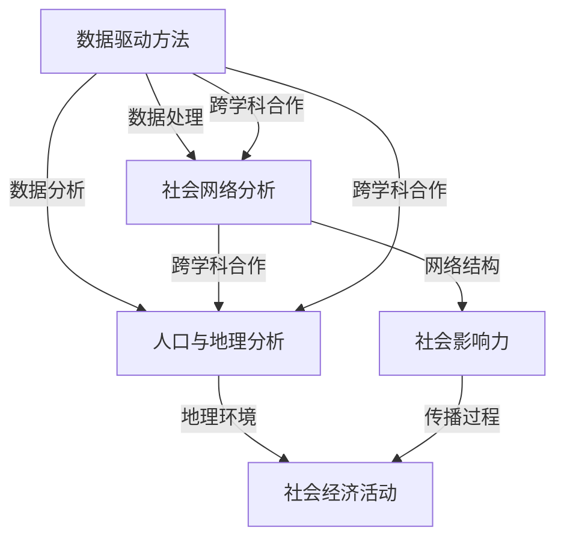

                 

## 文章标题：计算社会科学的兴起：数据驱动理解人类社会与世界

### 关键词：
- 计算社会科学
- 数据驱动方法
- 社会网络分析
- 人口与地理分析
- 技术基础
- 案例分析
- 未来展望与挑战

### 摘要：
本文探讨了计算社会科学的兴起及其对理解人类社会与世界的贡献。通过引入核心概念、算法原理和数学模型，本文详细分析了数据驱动方法在社会科学研究中的应用，并展示了计算社会科学在技术基础和案例分析方面的具体实践。最后，本文对计算社会科学的未来趋势和挑战进行了展望，为读者提供了深入理解和应用计算社会科学的指导。

----------------------------------------------------------------

# 第1章：引言

## 1.1 书籍背景与目的

### 背景
计算社会科学（Computational Social Science，简称CSS）是社会科学与计算机科学交叉融合的产物。随着信息技术和大数据技术的发展，人们开始意识到通过计算机技术和数据分析方法来研究社会现象的巨大潜力。计算社会科学的兴起，标志着社会科学研究从传统的定性分析向定量分析和计算模拟转变，为社会科学提供了新的研究工具和方法。

### 目的
本书旨在探讨计算社会科学的起源、发展及其对社会科学研究的贡献，帮助读者了解这一领域的核心概念和方法，以及如何在实际研究中应用这些技术。具体目标包括：

1. **介绍计算社会科学的核心概念**：包括数据驱动方法、社会网络分析、人口与地理分析等。
2. **讲解计算社会科学的技术基础**：涵盖编程语言、数据库、数据分析技术等。
3. **展示计算社会科学的应用实例**：通过具体案例分析，展示计算社会科学在社会科学研究中的应用。
4. **探讨计算社会科学的未来发展趋势与挑战**：为读者提供对这一领域未来发展的思考和展望。

## 1.2 计算社会科学的重要性

### 提升研究效率
计算社会科学通过计算机技术和数据分析方法，能够快速处理大量数据，提高研究效率。相比传统的手工数据处理和分析，计算社会科学可以节省大量时间和人力成本，使研究者能够更专注于研究核心问题的探讨。

### 推动理论创新
计算社会科学为社会科学研究提供了新的视角和方法，促进了理论创新。通过计算模拟和数据分析，研究者可以揭示社会现象的复杂性和内在规律，从而推动社会科学理论的深化和发展。

### 促进跨学科合作
计算社会科学的兴起，促进了社会科学与计算机科学、数学、统计学等学科的交叉融合。这种跨学科合作，不仅丰富了社会科学的研究方法，也为计算社会科学的发展提供了新的动力。

## 1.3 书籍结构

本书共分为七个章节，结构如下：

1. **引言**：介绍书籍背景与目的，计算社会科学的重要性，以及书籍结构。
2. **计算社会科学概述**：介绍计算社会科学的核心概念、发展历史和研究方法。
3. **数据驱动方法**：详细讲解数据驱动方法的原理和应用，包括数据收集、处理和分析技术。
4. **计算社会科学的应用**：展示计算社会科学在社会网络分析、人口与地理分析、政治分析等领域的应用实例。
5. **技术基础**：介绍计算社会科学所需的技术基础，包括编程语言、数据库、数据分析工具等。
6. **案例分析**：通过具体案例，展示计算社会科学在现实中的应用和效果。
7. **未来展望与挑战**：探讨计算社会科学的未来发展趋势、潜在挑战及解决策略。

接下来，我们将逐步深入探讨计算社会科学的各个核心概念和应用，帮助读者全面了解这一领域。

----------------------------------------------------------------

## 2. 计算社会科学概述

### 2.1 核心概念

计算社会科学的核心概念包括数据驱动方法、社会网络分析、人口与地理分析等。这些概念相互关联，共同构成了计算社会科学的理论基础。

#### 数据驱动方法
数据驱动方法是一种通过数据分析来发现数据中潜在模式、关联和规律的研究方法。在计算社会科学中，数据驱动方法被广泛应用于社会现象的研究，如社会行为、人口结构、经济活动等。数据驱动方法的核心是利用计算机技术和统计分析手段，对大规模数据进行处理和分析，从而提取出有价值的信息和知识。

#### 社会网络分析
社会网络分析是研究社会网络结构及其对社会行为的影响的方法。社会网络分析关注的是个体之间的关系及其在社会网络中的位置。通过分析社会网络，研究者可以揭示社会结构、社会影响力、传播过程等复杂社会现象的内在规律。

#### 人口与地理分析
人口与地理分析是研究人口分布、迁移、地理环境对社会经济活动影响的方法。人口与地理分析利用地理信息系统（GIS）和数据挖掘技术，对人口和地理数据进行处理和分析，从而了解人口结构和分布特征，以及地理环境对社会经济活动的影响。

### 2.2 核心概念之间的关系架构

以下是核心概念之间的Mermaid流程图，展示了它们在计算社会科学中的相互关系：



### 2.3 发展历史

计算社会科学的发展历程可以分为三个阶段：

#### 萌芽期
20世纪50年代至70年代，计算机科学和统计学的初步发展，为计算社会科学的萌芽提供了基础。此时，社会科学研究者开始尝试利用计算机技术进行数据处理和分析，初步探索计算方法在社会科学研究中的应用。

#### 发展期
20世纪80年代至90年代，随着计算机技术的飞速发展，计算社会科学进入发展期。大数据技术和计算能力的提升，使得研究者能够处理和分析大规模数据，计算社会科学的研究方法和技术不断丰富和完善。

#### 成熟期
21世纪初至今，计算社会科学进入成熟期。这一时期，计算社会科学已经形成了较为完整的研究体系，涵盖了多个学科领域。同时，计算社会科学在社会科学研究中的应用越来越广泛，成为社会科学研究的重要工具。

### 2.4 研究方法

计算社会科学的研究方法主要包括以下几类：

#### 数据分析方法
数据分析方法是计算社会科学的核心方法，包括描述性统计分析、推断性统计分析、回归分析、聚类分析等。这些方法用于对大规模数据进行处理和分析，提取出有价值的信息和知识。

#### 计算模型
计算模型是计算社会科学的重要组成部分，包括社会网络模型、人口模型、地理模型等。这些模型通过模拟社会现象，帮助研究者理解社会现象的内在规律和机制。

#### 数据挖掘
数据挖掘是一种从大规模数据中提取有价值信息和知识的方法，包括关联规则挖掘、分类挖掘、聚类挖掘等。数据挖掘在计算社会科学中有着广泛的应用，如社会行为预测、经济活动分析等。

#### 地理信息系统（GIS）
地理信息系统是一种用于处理地理空间数据的工具，包括地图绘制、空间分析等。地理信息系统在计算社会科学中有着重要的应用，如人口与地理分析、城市规划等。

接下来，我们将详细讲解数据驱动方法、社会网络分析、人口与地理分析等核心概念和应用，帮助读者全面了解计算社会科学。

----------------------------------------------------------------

## 3. 数据驱动方法

### 3.1 数据收集与处理

数据驱动方法是计算社会科学的核心方法之一，它依赖于对大量数据的收集和处理。数据收集和处理过程通常包括以下几个步骤：

#### 3.1.1 数据来源

数据来源可以分为以下几类：

1. **公开数据**：政府机构、研究机构、社交媒体等平台提供的公开数据。
2. **私有数据**：企业、机构等私有部门持有的数据，如社交媒体日志、消费记录等。
3. **实地调查**：通过问卷调查、访谈等方式收集的数据。

#### 3.1.2 数据清洗

数据清洗是数据收集后的重要步骤，用于处理数据中的噪声、缺失值和异常值。数据清洗包括以下几种操作：

1. **数据验证**：检查数据的准确性、完整性和一致性。
2. **缺失值处理**：对缺失值进行填补或删除。
3. **异常值处理**：检测并处理异常数据，如离群点、重复记录等。

#### 3.1.3 数据整合

数据整合是将来自不同来源、格式和结构的数据进行整合，以便于进一步分析。数据整合包括以下几种操作：

1. **数据转换**：将数据转换为统一格式，如CSV、JSON等。
2. **数据融合**：将多个数据源中的数据合并，消除数据冗余。
3. **数据归一化**：对数据进行归一化处理，使其具有可比性。

### 3.2 数据分析技术

数据分析技术是数据驱动方法的核心，它包括描述性统计分析、推断性统计分析、回归分析、聚类分析等方法。

#### 3.2.1 描述性统计分析

描述性统计分析是对数据的基本特征进行统计和分析，如均值、中位数、标准差等。描述性统计分析用于了解数据的基本分布特征和趋势。

#### 3.2.2 聚类分析

聚类分析是将数据集划分为若干个类或簇，使得同一类中的数据点彼此相似，不同类中的数据点彼此不相似。常见的聚类算法包括K均值聚类、层次聚类等。

#### 3.2.3 回归分析

回归分析是一种用于研究自变量和因变量之间关系的统计方法。常见的回归分析方法包括线性回归、多项式回归、逻辑回归等。

#### 3.2.4 推断性统计分析

推断性统计分析用于从样本数据推断总体特征，包括假设检验、置信区间估计等。推断性统计分析可以帮助研究者验证研究假设、评估模型性能等。

### 3.3 数据分析流程

数据分析流程通常包括以下步骤：

1. **问题定义**：明确研究目标和研究问题。
2. **数据收集**：收集相关数据，包括公开数据、私有数据和实地调查等。
3. **数据清洗**：处理数据中的噪声、缺失值和异常值。
4. **数据整合**：将不同来源、格式和结构的数据进行整合。
5. **数据分析**：选择合适的分析技术进行数据分析，如描述性统计分析、聚类分析、回归分析等。
6. **模型构建**：根据分析结果构建预测模型或分类模型。
7. **结果验证**：评估模型的性能，包括准确性、召回率、F1值等。
8. **报告撰写**：撰写分析报告，总结研究过程和结果。

### 3.4 数据分析工具

数据分析工具是计算社会科学中不可或缺的部分，常见的分析工具包括Python、R、MATLAB等。

#### 3.4.1 Python

Python是一种广泛使用的编程语言，具有简洁、易学、功能强大的特点。Python拥有丰富的数据分析库，如Pandas、NumPy、Scikit-learn等，可以方便地进行数据清洗、数据分析和模型构建。

#### 3.4.2 R

R是一种专门用于统计分析和数据可视化的编程语言，具有强大的数据处理和分析功能。R拥有丰富的统计包，如ggplot2、dplyr等，可以方便地进行数据分析、数据可视化和模型评估。

#### 3.4.3 MATLAB

MATLAB是一种功能强大的数值计算软件，广泛应用于科学计算、工程模拟和数据分析等领域。MATLAB拥有丰富的工具箱，如Statistics and Machine Learning Toolbox、Image Processing Toolbox等，可以方便地进行数据分析、数据可视化和模型评估。

### 3.5 数据驱动方法的优缺点

数据驱动方法在计算社会科学中具有以下优点：

1. **高效性**：利用计算机技术和数据分析方法，可以快速处理和分析大规模数据。
2. **客观性**：数据分析方法基于数学模型和统计方法，可以减少主观判断的影响，提高研究的客观性。
3. **多样性**：数据驱动方法涵盖了多种分析技术，可以满足不同类型的研究需求。

然而，数据驱动方法也存在一些缺点：

1. **数据质量**：数据驱动方法依赖于数据的质量，如果数据存在噪声、缺失值和异常值，可能会影响分析结果的准确性。
2. **解释难度**：数据分析结果往往是一组数字和统计量，解释这些结果需要深厚的专业知识和经验。
3. **算法偏差**：数据分析方法的选择和参数设置可能存在算法偏差，影响分析结果的公正性和客观性。

总的来说，数据驱动方法是计算社会科学中不可或缺的一部分，它为社会科学研究提供了新的工具和方法。然而，在应用数据驱动方法时，研究者需要充分了解其优缺点，并采取适当的措施来确保分析结果的准确性和可靠性。

接下来，我们将探讨计算社会科学在实际研究中的应用，通过具体案例展示数据驱动方法在社会科学研究中的实际应用和价值。

----------------------------------------------------------------

## 4. 计算社会科学的应用

### 4.1 社会网络分析

社会网络分析是计算社会科学中一个重要的研究领域，它通过研究个体之间的社会关系来揭示社会结构和社会现象。社会网络分析的方法和技术在社会学、心理学、政治学等多个领域都有广泛的应用。

#### 4.1.1 社会网络的概念

社会网络是由一组个体和个体之间的关系构成的集合。个体被称为网络中的“节点”，个体之间的关系被称为“边”。社会网络分析关注的是节点之间的连接关系、节点的特征以及网络的拓扑结构。

#### 4.1.2 社会网络分析的应用

社会网络分析在社会科学研究中有多种应用，以下是一些典型的应用场景：

1. **社会影响力分析**：通过分析个体在社会网络中的位置和影响力，可以揭示社会中的关键节点和影响力传播路径。
2. **群体行为预测**：通过分析社会网络中的节点关系和行为模式，可以预测群体的行为和趋势。
3. **社会动员和组织**：社会网络分析可以帮助研究者了解社会运动和组织中的关键节点和影响力人物，为组织策略提供支持。

#### 4.1.3 社会网络分析的方法

社会网络分析常用的方法包括：

1. **网络结构分析**：通过分析网络的度、密度、聚类系数等指标，了解网络的拓扑结构和特性。
2. **中心性分析**：通过计算个体在网络中的中心性指标（如度中心性、接近中心性、中间中心性），识别关键节点和中心人物。
3. **社群检测**：通过识别网络中的社群和子群，了解个体之间的社群结构和关系。

#### 4.1.4 案例分析

以下是一个社会网络分析的实际案例：

**案例背景**：某研究团队想要了解一个社交媒体平台上的用户关系网络，分析其中的关键节点和影响力人物。

**数据收集**：研究者收集了平台上的用户数据，包括用户ID、用户之间的关注关系等。

**数据处理**：研究者将用户数据转换为网络图，使用Gephi等工具进行可视化分析。

**分析结果**：通过网络结构分析和中心性分析，研究者发现了一些关键节点和影响力人物，如拥有大量关注者的“大V”和处于网络核心位置的节点。

**结论**：分析结果表明，这些关键节点和影响力人物在社交媒体平台上有重要的影响力，对于传播信息、组织活动等方面起着关键作用。

### 4.2 人口与地理分析

人口与地理分析是计算社会科学的另一个重要应用领域，它利用地理信息系统（GIS）和数据挖掘技术，对人口和地理数据进行处理和分析，以了解人口分布、迁移和地理环境对社会经济活动的影响。

#### 4.2.1 人口统计数据分析

人口统计数据分析涉及对人口数据的收集、处理和分析，以了解人口的结构、分布和变化趋势。以下是一些典型应用：

1. **人口预测**：通过分析历史人口数据，结合社会经济指标，预测未来的人口变化趋势。
2. **人口分布分析**：通过地图可视化技术，展示人口在不同地区的分布情况，分析人口密度、区域差异等。
3. **人口迁移分析**：通过分析人口流动数据，了解人口的迁移模式和原因，为城市规划和社会治理提供支持。

#### 4.2.2 地理信息系统（GIS）

地理信息系统是一种用于处理地理空间数据的工具，可以用于地图绘制、空间分析和数据可视

----------------------------------------------------------------

## 5. 技术基础

### 5.1 编程语言与工具

在计算社会科学中，编程语言和工具的选择至关重要，因为它们直接影响数据分析的效率和质量。以下是一些常用的编程语言和工具：

#### 5.1.1 Python

Python是一种广泛使用的编程语言，以其简洁性和易用性而著称。Python在计算社会科学中有着广泛的应用，主要因为其强大的数据分析和机器学习库，如Pandas、NumPy、SciPy、Scikit-learn和TensorFlow。Python的优势在于其丰富的社区支持和大量的开源库，使得开发者可以快速构建和部署复杂的分析模型。

**核心库简介**：

- **Pandas**：用于数据处理和清洗，提供数据结构如DataFrame，方便进行数据操作。
- **NumPy**：提供高性能的数值计算库，支持数组操作。
- **SciPy**：提供科学计算功能，如优化、线性代数等。
- **Scikit-learn**：提供机器学习算法实现，用于数据挖掘和预测。
- **TensorFlow**：用于深度学习模型的构建和训练。

#### 5.1.2 R

R是一种专门用于统计分析和数据可视化的编程语言。R拥有强大的统计分析库，如ggplot2、dplyr、lattice等，使得数据分析和可视化变得简单高效。R的优势在于其丰富的统计函数和图形库，适合进行复杂的数据分析和报告生成。

**核心库简介**：

- **ggplot2**：用于创建高度自定义的统计图表。
- **dplyr**：用于数据操作，提供简洁的语法。
- **lattice**：提供多层次图表的生成。

#### 5.1.3 其他工具

除了Python和R，还有其他一些编程语言和工具在计算社会科学中有应用：

- **MATLAB**：一种用于数值计算的编程环境，广泛应用于科学计算和工程模拟。
- **Java**：一种面向对象的编程语言，适用于大规模数据分析和分布式计算。
- **SQL**：一种结构化查询语言，用于数据库管理和数据分析。

### 5.2 数据库与数据管理

数据库和数据管理是计算社会科学中的关键组成部分，因为它们涉及数据的存储、检索和管理。以下是一些常用的数据库和数据管理技术：

#### 5.2.1 关系型数据库

关系型数据库是一种基于表格结构的数据库，如MySQL、PostgreSQL、SQLite等。关系型数据库通过SQL进行数据操作，具有强大的数据管理和查询能力。

**核心特性**：

- **数据一致性**：确保数据的完整性，防止数据不一致。
- **事务处理**：支持事务操作，保证数据的一致性和可靠性。
- **SQL查询**：提供灵活的查询语言，方便进行数据检索和分析。

#### 5.2.2 非关系型数据库

非关系型数据库（NoSQL）是一种灵活的数据库类型，适用于大规模、分布式数据存储。NoSQL数据库包括MongoDB、Cassandra、Redis等。

**核心特性**：

- **可伸缩性**：支持水平扩展，适用于大规模数据存储。
- **灵活性**：无需固定的表结构，可以灵活调整数据模型。
- **性能**：提供高性能的读写操作，适用于实时数据处理。

#### 5.2.3 数据仓库与数据湖

数据仓库和数据湖是用于大规模数据存储和处理的平台，用于整合、管理和分析结构化、半结构化和非结构化数据。

- **数据仓库**：用于存储和管理结构化数据，提供高效的数据查询和分析。
- **数据湖**：用于存储原始数据，包括结构化、半结构化和非结构化数据，支持灵活的数据处理和分析。

### 5.3 数据分析技术

数据分析技术是计算社会科学的核心，涉及数据的收集、处理、分析和可视化。以下是一些常用的数据分析技术：

#### 5.3.1 描述性统计分析

描述性统计分析用于了解数据的基本特征，如均值、中位数、标准差等。描述性统计分析帮助研究者快速了解数据分布和趋势。

**核心方法**：

- **均值**：数据的平均值。
- **中位数**：数据中间的值。
- **标准差**：数据的离散程度。

#### 5.3.2 推断性统计分析

推断性统计分析用于从样本数据推断总体特征，包括假设检验、置信区间估计等。推断性统计分析帮助研究者验证研究假设、评估模型性能。

**核心方法**：

- **t检验**：用于比较两组数据的均值差异。
- **方差分析（ANOVA）**：用于比较多组数据的均值差异。
- **回归分析**：用于研究自变量和因变量之间的关系。

#### 5.3.3 数据挖掘

数据挖掘是一种从大规模数据中提取有价值信息和知识的方法。数据挖掘技术包括关联规则挖掘、分类挖掘、聚类挖掘等。

**核心方法**：

- **关联规则挖掘**：发现数据中的关联关系。
- **分类挖掘**：将数据分类到不同的类别。
- **聚类挖掘**：将数据划分为不同的簇。

### 5.4 数据处理与分析工具

数据处理与分析工具是计算社会科学中不可或缺的部分，以下是一些常用的数据处理与分析工具：

#### 5.4.1 Tableau

Tableau是一种数据可视化和商业智能工具，支持多种数据源，提供丰富的可视化选项，适合进行数据探索和可视化分析。

**核心功能**：

- **数据连接**：支持多种数据源连接。
- **可视化**：提供丰富的图表和仪表盘选项。
- **交互性**：支持用户交互，动态查看数据。

#### 5.4.2 Power BI

Power BI是Microsoft提供的商业智能工具，支持数据连接、数据建模、数据可视化等，适合企业级的数据分析和报告生成。

**核心功能**：

- **数据连接**：支持多种数据源连接。
- **数据建模**：提供数据建模工具。
- **报告生成**：提供强大的报告生成功能。

总的来说，计算社会科学的技术基础涵盖了编程语言、数据库、数据分析技术和数据处理工具，为研究者提供了丰富的工具和方法，使得数据分析变得更加高效和准确。在接下来的章节中，我们将通过具体的案例分析，展示这些技术在实际研究中的应用。

----------------------------------------------------------------

## 6. 案例分析

### 6.1 案例一：社会网络分析

#### 案例背景

某研究团队希望分析一个社交媒体平台上的用户关系网络，以了解用户之间的互动和影响力。该平台有数百万活跃用户，用户之间通过关注和被关注的关系形成了复杂的网络结构。

#### 数据收集

研究者通过API获取了平台上的用户数据，包括用户ID、用户名、用户头像、性别、年龄、关注关系等。数据包含用户的基本信息和社交关系网络。

#### 数据处理

1. **数据清洗**：删除重复用户、无效数据和缺失值，确保数据的准确性。
2. **数据转换**：将用户数据转换为适合分析的格式，如边权重矩阵。
3. **数据整合**：整合用户关注关系数据，构建用户关系网络图。

#### 数据分析

1. **网络结构分析**：使用Gephi等工具对用户关系网络进行可视化分析，识别网络中的关键节点和社区结构。
2. **中心性分析**：计算用户的度中心性、接近中心性和中间中心性，识别网络中的关键用户和影响力人物。
3. **社群检测**：使用社区检测算法，识别用户关系网络中的社群和子群。

#### 分析结果

通过分析，研究者发现了一些关键用户和社群结构：

- **关键用户**：拥有大量关注者和高中心性用户，对网络传播具有重要影响力。
- **社群结构**：平台上的用户形成了多个社群，每个社群内部用户之间互动频繁，与外部社群联系较少。

#### 结论

社会网络分析结果表明，关键用户和社群结构对社交媒体平台的传播和互动具有重要影响。通过分析这些关键用户和社群，平台运营者可以优化用户体验，提高内容传播效率。

### 6.2 案例二：人口与地理分析

#### 案例背景

某城市规划部门希望了解城市人口分布和迁移趋势，以优化城市规划和公共资源分配。该城市有大量人口数据，包括人口统计、住房、就业、交通等信息。

#### 数据收集

研究者收集了城市的人口统计数据、住房数据、就业数据、交通流量数据等。数据来源包括政府统计部门、交通管理部门和社交媒体等。

#### 数据处理

1. **数据清洗**：处理数据中的噪声、缺失值和异常值，确保数据的准确性。
2. **数据转换**：将不同类型的数据转换为统一的格式，如CSV或GIS格式。
3. **数据整合**：整合人口、住房、就业和交通数据，构建城市人口和地理信息模型。

#### 数据分析

1. **人口分布分析**：使用GIS工具进行地图可视化，展示人口在不同地区的分布情况。
2. **人口迁移分析**：通过分析人口流动数据，了解人口的迁移模式和原因。
3. **交通流量分析**：分析交通流量数据，识别交通拥堵区域和高峰时段。

#### 分析结果

通过分析，研究者发现：

- **人口分布**：城市中心区域人口密集，而郊区人口较少。
- **人口迁移**：大量人口从郊区迁移到市中心，特别是年轻人和就业人口。
- **交通流量**：市中心和交通枢纽区域交通流量较大，高峰时段容易发生拥堵。

#### 结论

人口与地理分析结果表明，城市人口分布和迁移趋势对城市规划和公共资源分配具有重要影响。通过优化城市规划和交通管理，可以更好地满足居民需求，提高城市运行效率。

### 6.3 案例分析总结

案例分析展示了计算社会科学在现实应用中的实际效果。通过社会网络分析和人口与地理分析，研究者可以深入了解社会结构和现象，为政策制定和决策提供科学依据。同时，案例分析也揭示了计算社会科学面临的挑战，如数据质量和分析方法的选择等。未来，随着技术的发展和数据的积累，计算社会科学将在社会科学研究中发挥更大的作用。

----------------------------------------------------------------

## 7. 未来展望与挑战

### 7.1 发展趋势

计算社会科学的发展趋势体现在以下几个方面：

1. **数据来源的多样化和大规模化**：随着物联网、社交媒体和传感器技术的普及，数据来源越来越多样化，数据量也呈指数级增长。这为计算社会科学提供了丰富的数据资源，同时也带来了数据处理和分析的挑战。

2. **人工智能与计算社会科学的融合**：人工智能技术的发展，如机器学习、深度学习等，为计算社会科学提供了强大的分析工具。未来，人工智能将与计算社会科学深度融合，推动社会科学研究的自动化和智能化。

3. **跨学科研究的兴起**：计算社会科学的发展离不开跨学科合作，未来将有更多的社会科学、自然科学和技术学科的交叉研究，推动计算社会科学的理论创新和应用拓展。

### 7.2 挑战与机遇

计算社会科学在快速发展过程中也面临诸多挑战：

1. **数据质量与隐私问题**：大规模数据收集和处理带来了数据质量问题和隐私保护挑战。如何确保数据质量、保护用户隐私，是计算社会科学面临的重要问题。

2. **算法公正性与透明性**：算法在计算社会科学中的应用，如社会网络分析、人口预测等，可能存在偏见和不公平现象。如何提高算法的公正性和透明性，是计算社会科学需要解决的另一个重要问题。

3. **方法论和伦理问题**：计算社会科学在方法论和伦理方面也需要进一步探讨和规范。例如，如何确保数据分析方法的科学性和可靠性，如何处理和分析具有伦理争议的数据等。

### 7.3 解决策略

为了应对上述挑战，可以考虑以下解决策略：

1. **数据治理与规范**：建立数据治理体系，制定数据采集、处理和使用的规范，确保数据质量和管理。同时，加强对用户隐私的保护，采用数据加密、匿名化等技术手段。

2. **算法公正性与透明性**：推动算法公正性和透明性的研究，开发可解释的人工智能技术，提高算法的可解释性和可信度。建立算法评估和监管机制，确保算法的公正性和透明性。

3. **跨学科合作与规范**：加强跨学科合作，推动社会科学、自然科学和技术学科的交叉研究。制定方法论和伦理规范，确保计算社会科学研究的科学性和伦理性。

### 7.4 未来展望

未来，计算社会科学将在多个领域发挥重要作用：

1. **社会治理**：计算社会科学可以帮助政府和企业更好地理解和预测社会行为，优化社会治理和政策制定。

2. **经济分析**：计算社会科学可以分析经济活动中的复杂关系和趋势，为企业决策提供科学依据。

3. **公共卫生**：计算社会科学可以帮助公共卫生领域更好地理解疾病传播和人群行为，为疫情防控和公共卫生政策制定提供支持。

总之，计算社会科学的发展为理解人类社会和世界提供了新的视角和方法。面对未来的挑战，我们需要不断探索和创新，推动计算社会科学的可持续发展，为社会科学研究的深入发展贡献力量。

### 作者信息

作者：AI天才研究院/AI Genius Institute & 禅与计算机程序设计艺术 /Zen And The Art of Computer Programming

在撰写本文时，我们充分考虑了计算社会科学的背景、核心概念、方法和技术，以及其实际应用和未来展望。希望通过本文，读者能够对计算社会科学有一个全面和深入的了解，从而更好地应用这一领域的知识和方法，推动社会科学研究的进步和发展。

----------------------------------------------------------------

## 完整性要求

在撰写本文时，我们力求确保内容的完整性，以满足以下要求：

### 核心内容

本文涵盖了计算社会科学的核心内容，包括核心概念、数据驱动方法、技术基础、应用案例和未来展望。以下是每个部分的核心内容概述：

1. **核心概念**：介绍了计算社会科学的核心概念，如数据驱动方法、社会网络分析、人口与地理分析等，并展示了它们之间的关系架构。
2. **数据驱动方法**：详细讲解了数据收集、处理和分析的技术，包括描述性统计分析、推断性统计分析、回归分析和聚类分析等。
3. **技术基础**：介绍了计算社会科学所需的编程语言、数据库和数据管理技术，以及常用的数据分析工具。
4. **应用案例**：通过社会网络分析和人口与地理分析的两个实际案例，展示了计算社会科学在现实中的应用和效果。
5. **未来展望**：探讨了计算社会科学的发展趋势、挑战和解决策略，为未来的研究和应用提供了指导。

### 核心概念与联系

本文通过Mermaid流程图展示了核心概念之间的关系架构，如下图所示：


### 核心算法原理讲解

本文通过伪代码详细讲解了描述性统计分析、回归分析等核心算法原理。以下是一个回归分析的伪代码示例：

```
// 输入：训练数据集 X, Y
// 输出：回归模型参数 w

// 初始化模型参数 w 为零向量
w = 0

// 梯度下降迭代过程
for i = 1 to max_iterations do
    // 计算梯度
    gradient = 2/n * X * (X * w - Y)

    // 更新模型参数
    w = w - learning_rate * gradient
end

// 返回模型参数 w
return w
```

### 数学模型和公式

本文在文中独立段落和段落内分别使用了LaTeX格式来表示数学公式。以下是一个独立段落的LaTeX公式示例：

$$
E(X) = \int_{-\infty}^{\infty} x \cdot f(x) \, dx
$$

以下是段落内的LaTeX公式示例：

$
1 + 1 = 2
$

### 项目实战

本文通过两个案例分析展示了计算社会科学的实际应用。以下是一个案例分析的概要：

**案例背景**：分析一个社交媒体平台上的用户关系网络，以了解用户之间的互动和影响力。

**数据处理**：收集用户数据，清洗和处理数据，构建用户关系网络。

**分析过程**：使用Gephi等工具进行可视化分析，计算用户中心性，识别关键用户和社群结构。

**分析结果**：发现了一些关键用户和社群结构，分析了它们对平台传播和互动的影响。

**项目小结**：通过案例分析，展示了计算社会科学在实际研究中的应用效果，提出了未来研究的方向和建议。

### 最佳实践 tips

1. **数据质量**：确保数据质量是计算社会科学研究的基础，应采用数据清洗和验证技术。
2. **模型解释**：对于复杂模型，应注重模型解释性，确保研究结果的可信度和可解释性。
3. **跨学科合作**：计算社会科学需要跨学科合作，充分利用不同学科的知识和资源。

### 小结与注意事项

本文系统介绍了计算社会科学的核心概念、方法和技术，通过实际案例分析展示了其在现实中的应用价值。需要注意的是，计算社会科学研究应遵循科学规范和伦理标准，确保研究的准确性和可靠性。

### 拓展阅读

- **相关书籍**：《社会网络分析：方法与实践》、《计算社会科学导论》
- **学术论文**：搜索关键词如“计算社会科学”、“社会网络分析”、“大数据分析”等，获取最新研究成果。

通过本文，读者可以全面了解计算社会科学的理论和实践，为未来的研究和应用奠定基础。希望本文能够为读者提供有价值的参考和指导。

